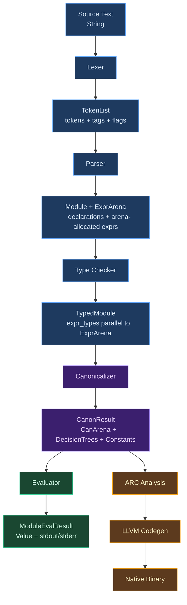
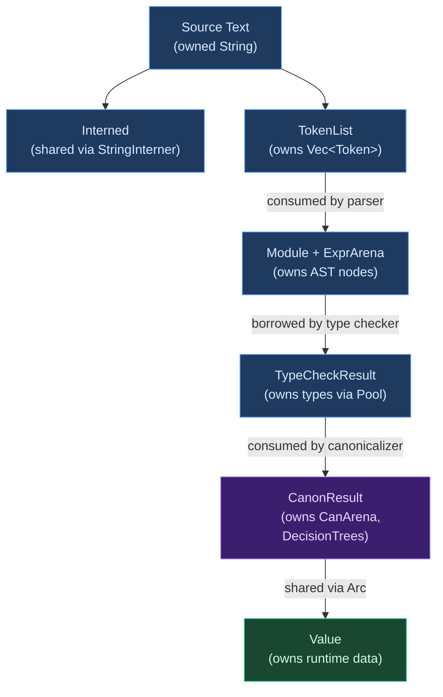

# Data Flow

## How Data Evolves Through Compilation

A compiler transforms source code into executable output, but this transformation doesn't happen in one step. The source text passes through a series of increasingly refined representations, each designed for the phase that consumes it.

The key insight is that **each representation exists to serve a specific phase's needs**:

- The lexer needs a flat character stream. It produces tokens — still flat, but now with structure (kind, span, value).
- The parser needs tokens. It produces a tree — hierarchical, with expressions containing sub-expressions.
- The type checker needs the tree. It produces types — annotations layered parallel to the tree, answering "what type is this expression?"
- The canonicalizer needs both the tree and the types. It produces a simplified tree with decision trees — sugar removed, patterns compiled, constants folded.
- The evaluator needs the canonical tree. It produces runtime values — the program's actual output.

Each representation adds information (types, decision trees, runtime values) while discarding information the next phase doesn't need (named arguments become positional, match patterns become decision nodes). This progressive refinement is what makes each phase tractable — the type checker doesn't need to understand named arguments, and the evaluator doesn't need to understand type variables.

### The Data Flow Contract

At each stage boundary, the compiler makes a commitment:

1. **The output is complete** — downstream phases don't need to reach back for information the output doesn't contain
2. **The output is self-describing** — every node carries enough context (type, span) for the next phase to process it without additional lookups
3. **The output is shareable** — multiple consumers can read the same data without interference (immutability after construction, `Arc` wrapping for shared ownership)

When this contract is violated — when a phase needs to reach back to an earlier phase's data — it indicates a design problem. Ori's architecture enforces this contract through Rust's ownership system: each phase owns its output, and downstream phases receive it by reference or `Arc`.

## What Makes Ori's Data Flow Distinctive

### Parallel Array Storage

Most compilers store AST nodes as heap-allocated tree structures: each node owns its children via pointers. Ori uses **arena allocation with parallel arrays** instead. The `ExprArena` stores all expressions in a flat `Vec<Expr>`, with each expression referenced by a 4-byte `ExprId(u32)` index. The `TokenList` stores tokens, discriminant tags, and metadata flags in three parallel arrays. The `CanArena` stores canonical expressions, spans, and types in parallel arrays indexed by `CanId`.

This approach gives cache locality (sequential traversal hits contiguous memory), compact references (4-byte `ExprId` vs 8-byte pointer), and Salsa compatibility (a flat `Vec` trivially satisfies `Clone + Eq + Hash`).

### Zero-Copy Sharing via Arc

After canonicalization, the canonical IR needs to be consumed by multiple independent consumers: the evaluator, the test runner, the `check` command, and the LLVM backend. Rather than copying the data for each consumer, Ori wraps the `CanonResult` in an `Arc` (as `SharedCanonResult`), making sharing free and independent of the data's size.

### Type Interning

Types are not stored inline in the AST. Instead, each type is interned into a `Pool` and referenced by `Idx(u32)`. A pre-computed `Tag(u8)` discriminant enables O(1) kind dispatch without unpacking the full type. Primitives occupy fixed indices (`INT=0`, `FLOAT=1`, etc.), so testing whether a type is `int` is a single integer comparison.

## Overview



## Stage-by-Stage Data Structures

### Stage 1: Lexing

**Input**: Source text (`String`)
**Output**: `TokenList`

```rust
pub struct TokenList {
    tokens: Vec<Token>,
    /// Parallel array of discriminant tags (u8), one per token.
    /// tags[i] == tokens[i].kind.discriminant_index()
    tags: Vec<u8>,
    /// Parallel array of per-token metadata flags, one per token.
    /// Captures whitespace/trivia context for each token.
    flags: Vec<TokenFlags>,
}

pub struct Token {
    kind: TokenKind,
    span: Span,
}
```

The lexer performs four data transformations:
1. **Character stream → token stream** — recognizing keywords, operators, and literals
2. **Identifiers → interned Names** — via `StringInterner`, converting strings to `Name(u32)` for O(1) comparison
3. **Numeric text → typed values** — `"42"` becomes `TokenKind::Int(42)`, `"3.14"` becomes `TokenKind::Float(f64_bits)`
4. **Comments → discarded** — comments don't survive into the token stream (but are preserved in `ModuleExtra` for the formatter)

Example:
```text
"let x = 42"

→ TokenList {
     tokens: [
       Token { kind: Let, span: Span(0, 3) },
       Token { kind: Ident(Name(0)), span: Span(4, 5) },  // "x" interned
       Token { kind: Eq, span: Span(6, 7) },
       Token { kind: Int(42), span: Span(8, 10) },
     ],
     tags: [TAG_LET, TAG_IDENT, TAG_EQ, TAG_INT],
     flags: [TokenFlags::default(); 4],
   }
```

The parallel `tags` array exists for O(1) token kind checks without unpacking the full `TokenKind` enum. The parser's `check()` method compares a single `u8` tag rather than pattern-matching an enum with dozens of variants.

### Stage 2: Parsing

**Input**: `TokenList`
**Output**: `ParseOutput`

```rust
pub struct ParseOutput {
    pub module: Module,
    pub arena: SharedArena,
    pub errors: Vec<ParseError>,
    pub warnings: Vec<ParseWarning>,
    pub metadata: ModuleExtra,
}

pub struct Module {
    functions: Vec<Function>,
    types: Vec<TypeDef>,
    tests: Vec<Test>,
    imports: Vec<Import>,
}

pub struct ExprArena {
    exprs: Vec<Expr>,  // Indexed by ExprId
}

pub struct Expr {
    kind: ExprKind,
    span: Span,
}
```

The parser performs three data transformations:
1. **Token stream → AST nodes** — recognizing syntactic structure (declarations, expressions, patterns)
2. **Expressions → arena-allocated** — each expression gets an `ExprId`, stored in the flat `ExprArena`
3. **Syntax errors → `ParseError` list** — accumulated, not fatal

The `ModuleExtra` sidecar holds formatting-relevant data (comments, blank lines, trivia positions) separately from the syntactic AST. This separation means the type checker never sees comment data, while the formatter has access to everything it needs.

Example:
```text
TokenList [Let, Ident(x), Eq, Int(42)]

→ Module { functions: [], types: [], ... }

→ ExprArena {
     exprs: [
       Expr { kind: Let { name: x, value: ExprId(1) }, span: ... },
       Expr { kind: Literal(Int(42)), span: ... },
     ]
   }
```

### Stage 3: Type Checking

**Input**: `Module` + `ExprArena`
**Output**: `TypedModule` + `Pool`

```rust
pub struct TypedModule {
    expr_types: Vec<Type>,  // expr_types[expr_id] = type of that expr
    errors: Vec<TypeError>,
}
```

The type checker's core output is a **parallel array** `expr_types` where `expr_types[i]` is the type of the expression at `ExprId(i)`. This is parallel to the `ExprArena` — no tree traversal needed to find an expression's type, just an index lookup.

Types are interned into a `Pool` and referenced by `Idx(u32)`. The `Pool` itself lives in a session-scoped `PoolCache` outside Salsa's dependency graph, because its internal structure doesn't support the equality comparison Salsa requires.

Data transformations:
1. **Expressions → type annotations** — stored parallel to `ExprArena`
2. **Type variables → resolved types** — via unification (union-find)
3. **Type mismatches → `TypeError` list** — accumulated for comprehensive diagnostics

Example:
```text
ExprArena[ExprId(0)] = Let { name: x, value: ExprId(1) }
ExprArena[ExprId(1)] = Literal(Int(42))

→ TypedModule {
     expr_types: [
       Type::Int,   // ExprId(0): binding has type Int
       Type::Int,   // ExprId(1): literal has type Int
     ],
     errors: [],
   }
```

### Stage 3.5: Canonicalization

**Input**: `Module` + `ExprArena` + `TypeCheckResult` + `Pool`
**Output**: `CanonResult`

```rust
pub struct CanonResult {
    arena: CanArena,
    constants: ConstantPool,
    decision_trees: DecisionTreePool,
    root: CanId,
    roots: Vec<CanonRoot>,
    method_roots: Vec<MethodRoot>,
    problems: Vec<PatternProblem>,
}
```

Canonicalization consumes the AST and types together, producing a new arena (`CanArena`) with a different expression type (`CanExpr`). This is a new data structure, not a mutation of the AST — the original `ExprArena` remains unchanged.

Data transformations:
1. **Named calls → positional calls** — argument reordering based on type signatures
2. **Template literals → string concatenation** — `to_str()` calls + `++` chains
3. **Spread expressions → method calls** — `[...a, x]` becomes `a.append(x)`
4. **Match patterns → decision trees** — [Maranget 2008](http://moscova.inria.fr/~maranget/papers/ml05e-maranget.pdf) algorithm
5. **Compile-time expressions → constants** — folded into `ConstantPool`
6. **Every `CanNode` annotated with its resolved type** — from the `Pool`

The `CanonResult` is wrapped in `SharedCanonResult` (`Arc<CanonResult>`) for zero-copy sharing across all consumers. The `Arc` wrapper means the evaluator, test runner, `check` command, and LLVM backend all read the same data without copying.

### Stage 4: Evaluation

**Input**: `CanonResult`
**Output**: `ModuleEvalResult`

```rust
pub struct ModuleEvalResult {
    pub result: Option<EvalOutput>,
    pub error: Option<String>,
    pub eval_error: Option<EvalErrorSnapshot>,
}

pub struct EvalOutput {
    stdout: String,
    stderr: String,
}
```

`ModuleEvalResult` uses a two-tier error design to satisfy Salsa's requirements while preserving rich error context:

- **`error: Option<String>`** — universal "did it fail?" field. Simple string for Salsa compatibility (`Clone + Eq + Hash`). Set for any failure kind (lex, parse, type, or runtime).
- **`eval_error: Option<EvalErrorSnapshot>`** — structured error snapshot, populated **only** for runtime eval errors. Preserves the `ErrorCode`, span, backtrace, and notes that the plain `error` field discards. Pre-runtime failures (lex, parse, type errors) leave this as `None`.

This separation allows Salsa to efficiently compare and cache results (via the simple `error` string) while still providing rich diagnostics (via `EvalErrorSnapshot`) when needed for error rendering.

Data transformations:
1. **`CanExpr` nodes → runtime Values** — via `eval_can(CanId)` tree walking
2. **Decision trees → pattern match evaluation** — walking the pre-compiled tree
3. **Function calls → stack frame creation** — environment-based scoping
4. **Print calls → output capture** — `EvalOutput` collects stdout/stderr

## Cross-Cutting Data

### Spans

Every data structure in the compiler carries source location information:

```rust
pub struct Span {
    start: u32,
    end: u32,
}
```

Spans are byte offsets into the source text, not line/column pairs. This makes span arithmetic (containment, intersection, concatenation) O(1), and line/column conversion is deferred to error rendering where it's actually needed. Spans appear in tokens, AST expressions, canonical expressions, and all error types.

### Interned Names

All identifiers use interned names throughout the pipeline:

```rust
pub struct Name(u32);
```

The `StringInterner` maps `Name` ↔ `&str` bidirectionally. Interning happens once during lexing; from that point forward, every phase uses the 4-byte `Name` index. Two variable names are equal if and only if their `Name` values are equal — an integer comparison, not a string comparison.

### Error Types

Each phase has its own error type, reflecting the different kinds of problems each phase can detect:

```rust
pub struct LexError { span: Span, message: String }               // Rare: invalid characters
pub struct ParseError { span: Span, expected: Vec<TokenKind>, ... } // Syntax errors
pub struct TypeError { span: Span, kind: TypeErrorKind }            // Type mismatches
pub struct EvalError { span: Span, kind: EvalErrorKind }            // Runtime errors
```

All error types carry `Span` for accurate source location reporting. Phase-specific error types prevent confusing mix-ups (a parse error can't accidentally be treated as a type error) and allow each phase's error rendering to be specialized.

## Memory Ownership Through the Pipeline



The ownership story has three key properties:

- **No data is copied between stages** — each stage produces new data; it doesn't clone the previous stage's output.
- **AST is borrowed, not cloned, after parsing** — the type checker reads the `ExprArena` by reference, annotating it with types stored in a parallel array.
- **Canonical IR is shared via `Arc`** — `SharedCanonResult` wraps `CanonResult` in `Arc` for zero-copy sharing across the evaluator, test runner, and LLVM backend.
- **Salsa handles caching lifetimes** — query results are kept alive as long as they might be needed for incremental recomputation.

## Design Tradeoffs

### Arena Allocation vs. Tree Allocation

The standard approach to AST representation is a tree of heap-allocated nodes: `Box<Expr>`, `Vec<Expr>`, and so on. Each node owns its children, and traversal follows pointers.

Ori uses arena allocation instead: all expressions live in a flat `Vec<Expr>`, referenced by `ExprId(u32)` indices. This trades pointer-chasing flexibility (you can't easily move a subtree) for cache performance (contiguous memory), compact references (4 bytes vs 8), and Salsa compatibility (the arena is a single `Vec`).

The tradeoff is meaningful. Arena-allocated ASTs are harder to modify in place — you can't just swap a subtree pointer. But Ori's pipeline doesn't modify ASTs: each phase produces a new representation from the previous one. The immutability that arenas encourage is exactly the immutability that a phase-based pipeline needs.

### Parallel Arrays vs. Struct-of-Arrays

`TokenList` uses three parallel arrays (`tokens`, `tags`, `flags`) instead of a single `Vec<TokenWithMeta>`. This struct-of-arrays (SoA) layout means that scanning just the tags (which the parser's `check()` method does constantly) reads a compact `Vec<u8>` rather than striding through a larger struct that includes unused fields.

The same pattern appears in `CanArena` (parallel arrays of kinds, spans, and types) and `TypedModule` (parallel `expr_types` array indexed by `ExprId`). Each parallel array stores exactly the data that one consumer needs, maximizing cache efficiency for that consumer's access pattern.

### Interning vs. Direct Storage

Interning (names and types) trades memory indirection for comparison speed and deduplication. Looking up a name's string requires an interner call; looking up a type's structure requires a pool access. But comparing two names is an integer comparison, and two identical types share the same `Idx` — both O(1).

The alternative — storing strings and types directly — would make each comparison O(n) in the length of the string or depth of the type. For a type checker that performs thousands of comparisons per function, this difference is the difference between acceptable and unacceptable performance.

## Prior Art

### Rust — HIR/MIR Layered Representations

[Rust's compiler](https://github.com/rust-lang/rust) uses multiple distinct IR types (AST → HIR → THIR → MIR), each with its own arena. HIR is an arena-allocated desugared AST (similar to Ori's `CanArena`). MIR is a control-flow graph with basic blocks (similar to Ori's `ArcFunction`). Rust's approach validates the general strategy of progressive lowering through distinct, purpose-built representations.

### Zig — InternPool for Type Representation

[Zig](https://github.com/ziglang/zig)'s compiler uses an `InternPool` for type representation, interning types into a flat array with integer handles — essentially the same approach as Ori's `Pool` with `Idx(u32)`. Zig's `InternPool` also stores values, strings, and other data in the same pool, whereas Ori separates these into distinct interning domains (`Pool` for types, `StringInterner` for names, `ConstantPool` for constants).

### GHC — Core with Global Uniques

[GHC](https://gitlab.haskell.org/ghc/ghc) uses a `Unique` (integer ID) system for names throughout its pipeline, functionally identical to Ori's `Name(u32)` interning. GHC's `Unique` values are globally unique across the entire compilation, while Ori's `Name` values are unique within a single `StringInterner` instance — a simpler model that works because Ori's compilation units are self-contained.
