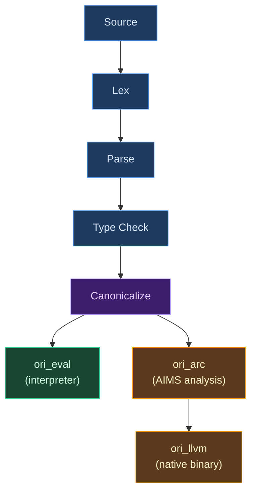
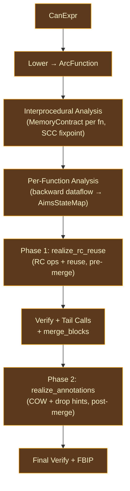
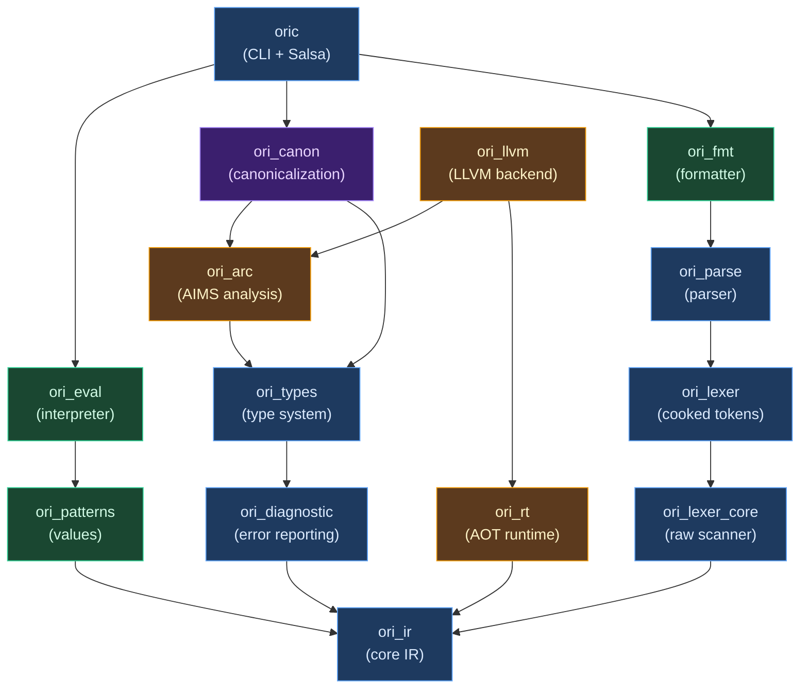

# Architecture Overview

## What Is Compiler Architecture?

A compiler translates source code into executable code. But compilers are large, complex programs — and large programs need structure. **Compiler architecture** is the study of how to organize that structure: what pieces exist, how they communicate, and what guarantees each piece provides to the others.

The central challenge is decomposition. A compiler must take arbitrary source text and produce correct, efficient output — a task that involves lexical analysis, syntax analysis, semantic analysis, optimization, and code generation. Each of these could be a project in itself. Architecture determines how they fit together.

Three properties separate good compiler architectures from bad ones:

1. **Phase independence** — each phase operates on a well-defined input and produces a well-defined output, without reaching into other phases' state. This makes phases individually testable and replaceable.

2. **Progressive refinement** — data flows through increasingly refined representations: raw text → tokens → syntax tree → typed tree → optimized IR → machine code. Each representation discards information that downstream phases don't need, making those phases simpler.

3. **Error resilience** — a well-architected compiler doesn't stop at the first error. It accumulates diagnostics across phases, giving the user a comprehensive view of everything wrong in one compilation. This requires each phase to produce meaningful output even when its input contains errors — a much harder engineering problem than stopping at the first failure.

These properties aren't free. Phase independence requires careful interface design. Progressive refinement means maintaining multiple IR types. Error resilience means every phase needs recovery logic. The architecture of a compiler is, in essence, the set of decisions about how to pay these costs.

## Approaches to Compiler Organization

Compiler architects have developed several organizational strategies over the past six decades. Understanding them clarifies why Ori chose the approach it did.

### Single-Pass Compilation

The earliest compilers — and many early language designs — were built around the constraint of limited memory. A single-pass compiler reads the source exactly once, generating code as it goes. Pascal's one-pass design influenced its grammar: you must declare types before using them, because the compiler has already forgotten earlier source by the time it reaches later code.

Single-pass compilation is fast (one read of the source) and memory-efficient (no full AST in memory), but it severely limits the language: forward references become impossible or require special syntax, global optimization is ruled out, and error messages are poor because the compiler has no context beyond the current position.

No modern production compiler uses a pure single-pass design, but the tension it highlights — **memory and speed vs. analysis power** — remains fundamental.

### Multi-Pass Pipelines

The dominant approach since the 1970s is to decompose compilation into a fixed sequence of passes, each transforming one IR into another:

```text
Source → Tokens → AST → Typed AST → Optimized IR → Machine Code
```

Each pass has a clear contract: it takes in one representation and produces the next. The lexer doesn't need to know about types; the type checker doesn't need to know about register allocation. This decomposition is the compiler equivalent of Unix's "do one thing well" philosophy.

The multi-pass model's strength is simplicity: each pass is small enough to understand, test, and maintain independently. Its weakness is rigidity: the pipeline is fixed, so changes to one pass can cascade through all downstream passes, and recompiling a single changed function requires re-running the entire pipeline from scratch.

### Nanopass Frameworks

The [nanopass approach](https://www.cambridge.org/core/journals/journal-of-functional-programming/article/educational-pearl-a-nanopass-framework-for-compiler-education/1E378B9B451270AF6A155FA0C21C04A3) (Sarkar, Waddell, and Dybvig, 2004) takes multi-pass to its logical extreme: instead of a few large passes, use many tiny ones, each performing a single transformation. GHC's compilation from Source Haskell through Core, STG, Cmm, and finally to machine code follows this philosophy, with dozens of transformations in the Core-to-Core optimization pipeline alone.

Each nanopass is trivially correct (it does one thing), easy to test (small input-output contract), and easy to add or remove (no coupling to other passes). The cost is performance overhead from many IR traversals and the engineering complexity of maintaining many IR types.

### Query-Based / Demand-Driven Compilation

Traditional pipelines are **push-based**: the compiler pushes source through each phase in sequence. Query-based architectures flip this to **pull-based**: downstream consumers request what they need, and the framework figures out what to compute.

The [Salsa](https://salsa-rs.netlify.app/) framework (developed for [rust-analyzer](https://rust-analyzer.github.io/)) is the most prominent example. Each computation is a "query" — a pure function from inputs to outputs. The framework memoizes results, tracks dependencies, and only recomputes what's necessary when inputs change. This is essentially a build system for compiler computations.

```text
Traditional:  source → lex → parse → check → eval  (always runs everything)
Query-based:  eval(file) → needs check(file) → needs parse(file) → needs lex(file)
              (only runs what's needed, caches the rest)
```

Query-based compilation excels at incrementality (editing one function doesn't re-type-check the whole module) and IDE integration (diagnostics for a single file can be computed without processing the entire project). The cost is complexity: query results must satisfy equality constraints for caching, and data that can't be compared for equality requires escape hatches outside the query framework.

### Progressive Lowering

Many compilers use multiple IR levels, each successively lower-level:

| Compiler | IR Levels |
|----------|-----------|
| **GHC** | Source → Core → STG → Cmm → Assembly |
| **Rust** | Source → HIR → THIR → MIR → LLVM IR → Machine Code |
| **LLVM** | LLVM IR → SelectionDAG → MachineInstr → MCInst |
| **Zig** | Source → AST → AstGen → ZIR → AIR → Machine Code |

Each lowering step eliminates abstraction: HIR removes syntactic sugar, MIR removes complex control flow, LLVM IR removes machine-specific details. The number of IR levels reflects a tradeoff between the engineering cost of maintaining multiple representations and the simplification each level provides to the passes that consume it.

## What Makes Ori's Architecture Distinctive

Ori combines elements from several of these approaches. The result is a query-based pipeline with progressive lowering and a distinctive fork point where one canonical IR feeds two completely separate backends.

### Canonical IR as the Single Bridge

The central architectural idea is a **sugar-free canonical IR** (`CanExpr`) that sits between type checking and execution. Both backends — the tree-walking interpreter and the LLVM native code generator — consume the same representation:



Canonicalization does three things that neither backend needs to repeat:

1. **Desugaring** — Named calls become positional. Template literals become string concatenation. Spreads become method calls. Seven sugar forms eliminated entirely.
2. **Pattern compilation** — Match expressions compile to decision trees via Maranget's ["Compiling Pattern Matching to Good Decision Trees"](http://moscova.inria.fr/~maranget/papers/ml05e-maranget.pdf) (2008). The interpreter walks the tree; LLVM emits `switch` terminators from it.
3. **Constant folding** — Compile-time expressions pre-evaluated into a `ConstantPool`.

Every `CanNode` carries its resolved type from type checking, so downstream passes never re-infer. And because `CanExpr` is a **separate Rust type** from `ExprKind`, sugar variants physically cannot appear in canonical IR — a backend that tries to match on `CallNamed` gets a compile error, not a runtime panic.

This architecture means that adding a new syntactic sugar to Ori requires changes in exactly two places: the parser (to recognize it) and the canonicalizer (to desugar it). Neither backend needs to change. Conversely, adding a new backend requires no changes to the frontend — it simply consumes `CanExpr` like the existing backends do.

### AIMS (Lean 4 / Koka Inspired)

Ori uses automatic reference counting instead of a garbage collector or borrow checker. The `ori_arc` crate implements a research-grade AIMS (ARC Intelligent Memory System) pipeline inspired by [Lean 4](https://leanprover.github.io/)'s LCNF IR and Koka's [FBIP](https://www.microsoft.com/en-us/research/publication/fp2-fully-in-place-functional-programming/) (Functional-But-In-Place) analysis.

**Three-way type classification** drives all RC decisions:

| Class | Meaning | RC Behavior |
|-------|---------|-------------|
| `Scalar` | Never heap-allocated (`int`, `bool`, `Option<int>`) | No RC operations |
| `DefiniteRef` | Always heap-allocated (`str`, `[T]`, `{K: V}`) | Full RC tracking |
| `PossibleRef` | Unknown at analysis time (unresolved generics) | Conservative RC |

AIMS replaces traditional sequential analysis passes (borrow inference → liveness → RC insertion → reset/reuse → RC elimination) with a **unified 7-dimensional product lattice**. A single backward dataflow analysis (`analyze_function()`) converges on an `AimsState` per variable at each program point, encoding all memory decisions simultaneously:

| Dimension | What It Tracks |
|-----------|---------------|
| `AccessClass` | How the value is accessed (read, write, project) |
| `Consumption` | Whether the value is consumed, shared, or dead |
| `Cardinality` | How many times the value is used downstream |
| `Uniqueness` | Whether the value has a unique reference |
| `Locality` | Whether the value escapes the current scope |
| `ShapeClass` | Structural shape (scalar, aggregate, closure) |
| `EffectClass` | Side-effect classification (pure, reads, writes) |

All RC, reuse, COW, and drop decisions are **derived from the converged state map** in two emission phases:



A critical architectural constraint: Phase 2 runs **after** `merge_blocks()` (CFG cleanup), which invalidates position-keyed state maps. Post-merge steps access the `AimsStateMap` via `ArcVarId`-keyed lookups instead — this works because `merge_blocks()` preserves entry block IDs.

The ARC IR is **backend-independent** — `ori_arc` has no LLVM dependency. The `arc_emitter` in `ori_llvm` translates ARC IR instructions to LLVM IR. This separation means the AIMS analysis can be tested, debugged, and evolved without touching codegen.

### Capability-Based Effect System

Every function declares what effects it may perform:

```ori
@fetch_data (url: str) -> Result<str, Error> uses Http = { ... }
```

Effects are tracked through the type system via `EffectClass`:
- **Pure** — deterministic, parallelizable
- **ReadsOnly** — reads external state (`Env`, `Clock`, `Random`)
- **HasEffects** — I/O or mutation (`Http`, `FileSystem`, `Print`)

Capabilities are provided at call sites via `with...in`, enabling dependency injection and testability without frameworks:

```ori
with Http = MockHttp { } in {
    fetch_data(url: "https://example.com")
}
```

This is an algebraic effects system in practice — the `with...in` construct is essentially a handler that provides an implementation for an effect, similar to how Koka and Eff handle effects. The difference is that Ori's effects are coarser-grained (capability traits rather than individual operations) and focused on practical dependency injection rather than research-language generality.

Stateful handlers carry mutable state through handler frames:

```ori
with Logger = handler(state: []) {
    log: (s, msg) -> ([...s, msg], void)
} in { ... }
```

### Salsa-Driven Incrementality

Every major computation is a Salsa query with automatic memoization, dependency tracking, and early cutoff:

```rust
#[salsa::tracked]
pub fn tokens(db: &dyn Db, file: SourceFile) -> TokenList { ... }

#[salsa::tracked]
pub fn parsed(db: &dyn Db, file: SourceFile) -> ParseOutput { ... }

#[salsa::tracked]
pub fn typed(db: &dyn Db, file: SourceFile) -> TypeCheckResult { ... }

#[salsa::tracked]
pub fn evaluated(db: &dyn Db, file: SourceFile) -> ModuleEvalResult { ... }
```

When source text changes, Salsa re-runs `tokens()`. If the tokens are identical (e.g., whitespace-only change), `parsed()` returns its cached result and nothing downstream runs. This early cutoff cascades through the entire pipeline — a change that only affects comments will re-lex but skip parsing, type checking, and evaluation entirely.

**Session-scoped side-caches** handle data that can't satisfy Salsa's `Clone + Eq + Hash` requirements:

| Cache | Contents | Populated By |
|-------|----------|-------------|
| `PoolCache` | `Arc<Pool>` per file | `typed()` |
| `CanonCache` | `SharedCanonResult` per file | `canonicalize_cached()` |
| `ImportsCache` | `Arc<ResolvedImports>` per file | Module loading |

A `CacheGuard` safety token ensures invalidation is always performed before re-type-checking — callers cannot skip it.

### Smart Verification

Tests in Ori are bound to functions via first-class syntax and tracked in the dependency graph:

```ori
@factorial (n: int) -> int = if n <= 1 then 1 else n * factorial(n: n - 1)

@t tests @factorial () -> void = {
    assert_eq(actual: factorial(n: 0), expected: 1);
    assert_eq(actual: factorial(n: 5), expected: 120);
}
```

Test enforcement is configurable: `off` (default), `warn`, or `error`. Functions also support contracts (`pre()`/`post()`) that run at call boundaries. The compiler tracks test-to-function relationships in the dependency graph, enabling incremental test execution — only affected tests run when code changes.

## Crate Architecture

The compiler is a Cargo workspace with strict one-way dependencies. Later phases never call back into earlier ones — a pattern sometimes called the "dependency rule" in software architecture. The Cargo dependency graph makes violations of this rule compile errors, not policy documents.



> Only key dependency edges shown — all crates ultimately depend on `ori_ir`. `ori_llvm` and `ori_rt` are workspace members but not in `default-members` (require LLVM 21).

**Key dependency invariants:**

- **`ori_patterns` depends only on `ori_ir`** — the Value system is type-agnostic. Runtime values don't need to know about the type pool or inference engine.
- **`ori_eval` depends on `ori_patterns`, not `ori_types`** — the interpreter doesn't type-check. It trusts that upstream phases have already validated the program.
- **`ori_arc` has no LLVM dependency** — AIMS analysis is backend-independent. The analysis can be tested and evolved without an LLVM installation.
- **Pure functions live in library crates; Salsa queries live only in `oric`** — the CLI orchestrator owns the incremental computation framework, keeping library crates independent of the build system.

## Design Principles

### Flat Data Structures

The AST uses **arena allocation** rather than recursive heap allocation. Expressions are stored in a flat `Vec<Expr>` and referenced by `ExprId(u32)` — a 4-byte index rather than an 8-byte pointer. This gives cache locality (expressions are contiguous in memory), simple memory management (one allocation for the whole arena), and efficient Salsa serialization (the arena is a single `Vec` that satisfies `Clone + Eq + Hash`).

All identifiers are interned as `Name(u32)` for O(1) comparison. Comparing two variable names is an integer comparison, not a string comparison — critical when the type checker compares thousands of names during inference.

### Pool-Based Type Representation

Types are interned into a `Pool` and referenced by `Idx(u32)`. A `Tag(u8)` discriminant enables tag-driven dispatch without unpacking the full type. Pre-computed `TypeFlags` bitflags answer common queries (`HAS_VAR`, `IS_PRIMITIVE`, `NEEDS_SUBST`) in O(1).

Primitives are pre-interned at fixed indices (`INT=0`, `FLOAT=1`, ..., `ORDERING=11`), so comparing a type to `int` is a single integer comparison. This matters because primitive type checks are among the most frequent operations in the type checker.

### Phase Purity

Each compiler phase is a pure `IR → IR` transformation:
- The lexer produces tokens without parsing
- The parser builds AST without type checking
- The type checker annotates without evaluating
- The canonicalizer desugars without knowing which backend will consume the result

Phase boundaries use minimal types — `(tag, span)` at the lexer boundary, `ExprId` for AST references, `Idx` for types. No phase state leaks into output types. This means each phase can be tested in isolation with synthetic inputs, without constructing the full compilation pipeline.

### Error Accumulation

Every phase accumulates all errors in one pass rather than stopping at the first. Only the evaluator stops on first error (since execution can't meaningfully continue with a type mismatch or unbound variable). This gives users comprehensive diagnostics from a single compilation — fixing five errors at once instead of discovering them one at a time through five compile-fix cycles.

`ErrorGuaranteed` provides a **type-level proof** that an error was emitted. Functions that need to indicate "this failed, but I've already reported why" return `ErrorGuaranteed` instead of `()`, preventing "error reported but compilation continues as if successful" bugs. This pattern comes from rustc, where it solved the same class of problems.

### Registry Pattern

Built-in patterns (`recurse`, `parallel`, `spawn`, etc.) use zero-sized types wrapped in a `Pattern` enum — 1 byte, static dispatch, no heap allocation, no HashMap lookup. The `PatternRegistry` is a direct `match` from kind to pattern. This same registry pattern is used for built-in methods, operator dispatch, and derived trait implementations throughout the compiler.

## Key Types

| Type | Crate | Purpose |
|------|-------|---------|
| `ExprArena` / `ExprId` | `ori_ir` | Arena-allocated AST expressions |
| `Name` | `ori_ir` | Interned identifier (u32 index) |
| `Span` | `ori_ir` | Source location (start/end byte offsets) |
| `Idx` / `Tag` / `Pool` | `ori_types` | Interned type handle / kind discriminant / type storage |
| `TypeFlags` | `ori_types` | Pre-computed type metadata bitflags |
| `CanonResult` | `ori_ir` | Canonical IR: `CanArena` + `DecisionTreePool` + `ConstantPool` |
| `SharedCanonResult` | `ori_ir` | `Arc`-wrapped `CanonResult` for zero-copy sharing |
| `ArcFunction` / `ArcInstr` | `ori_arc` | Basic-block IR with explicit RC operations |
| `ArcClass` | `ori_arc` | `Scalar` / `DefiniteRef` / `PossibleRef` classification |
| `Value` | `ori_patterns` | Runtime values (interpreter) |
| `Interpreter` | `ori_eval` | Tree-walking evaluator over canonical IR |
| `IrBuilder` / `SimpleCx` | `ori_llvm` | LLVM IR construction and context |
| `Diagnostic` | `ori_diagnostic` | Rich error with labels, suggestions, and fix applicability |
| `ErrorGuaranteed` | `ori_diagnostic` | Type-level proof an error was emitted |

## Prior Art

Ori's architecture draws from several research and production compilers, each contributing ideas to different parts of the design.

### Lean 4 — ARC and Reset/Reuse

[Lean 4](https://github.com/leanprover/lean4)'s compiler (`src/Lean/Compiler/IR/`) pioneered the approach of compiling a functional language to efficient imperative code via reference counting with compile-time optimizations. Its LCNF (Lambda Calculus Normal Form) IR uses borrow inference to determine which function parameters can be borrowed rather than owned, eliminating unnecessary reference count increments. The reset/reuse optimization detects when a constructor application immediately follows a destructor, allowing the old allocation to be reused in-place. Ori's `ori_arc` crate implements both of these techniques, adapted from Lean's `RC.lean`, `Borrow.lean`, and `ExpandResetReuse.lean`.

### Koka — FBIP and Capabilities

[Koka](https://github.com/koka-lang/koka)'s compiler (`src/Core/Borrowed.hs`, `src/Core/CheckFBIP.hs`) developed the [Functional-But-In-Place](https://www.microsoft.com/en-us/research/publication/fp2-fully-in-place-functional-programming/) (FBIP) analysis, which proves when functional update patterns can be compiled to in-place mutation without changing semantics. Ori's FBIP module (`ori_arc/src/fbip/`) implements this analysis. Koka also pioneered the capability-based effect system that inspired Ori's `uses`/`with...in` design — though Ori's effects are coarser-grained (capability traits rather than individual operations), trading expressiveness for practical ergonomics.

### Salsa / rust-analyzer — Query-Based Compilation

The [Salsa](https://salsa-rs.netlify.app/) framework was developed as the incremental computation engine for [rust-analyzer](https://rust-analyzer.github.io/), the Rust language server. Ori uses Salsa for the same purpose: turning the compilation pipeline into a set of memoized, dependency-tracked queries that enable incremental recomputation. The key insight from rust-analyzer is that a language server and a batch compiler can share the same query definitions — `ori check` and a future IDE plugin would call the same `typed()` query.

### Maranget (2008) — Decision Trees

Luc Maranget's paper ["Compiling Pattern Matching to Good Decision Trees"](http://moscova.inria.fr/~maranget/papers/ml05e-maranget.pdf) provides the algorithm Ori uses for pattern compilation. The algorithm produces decision trees that minimize the number of runtime tests by considering which column of a pattern matrix has the most discriminating power. The same algorithm is used by Roc and Elm, making it well-proven in production functional language compilers.

### rustc — ErrorGuaranteed and Diagnostic Patterns

[Rust's compiler](https://github.com/rust-lang/rust) introduced the `ErrorGuaranteed` type-level proof pattern to prevent a class of bugs where error reporting and error propagation get out of sync. Ori adopted this pattern in `ori_diagnostic`, along with rustc's approach of accumulating errors rather than aborting on the first one. The diagnostic infrastructure — rich errors with labels, suggestions, and machine-applicable fixes — follows the model established by rustc and refined by rust-analyzer.

## Related Documents

- [Compilation Pipeline](pipeline.md) — Detailed stage-by-stage pipeline with Salsa query signatures
- [Salsa Integration](salsa-integration.md) — How Salsa queries, caching, side-caches, and invalidation work
- [Data Flow](data-flow.md) — How data structures evolve as they move through the compiler phases
