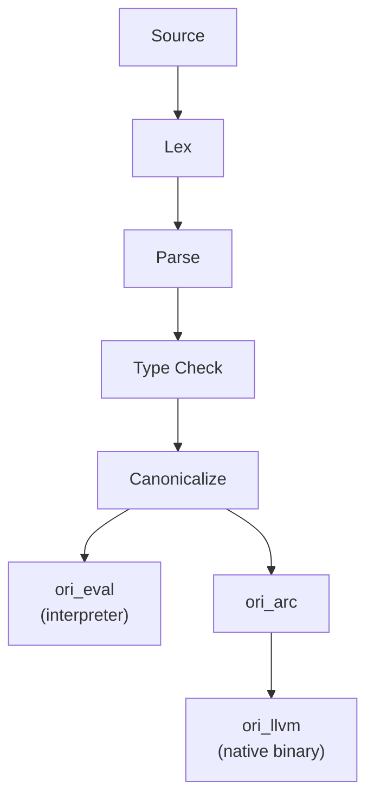
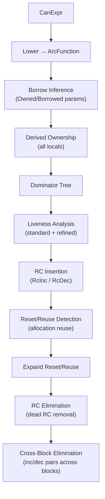
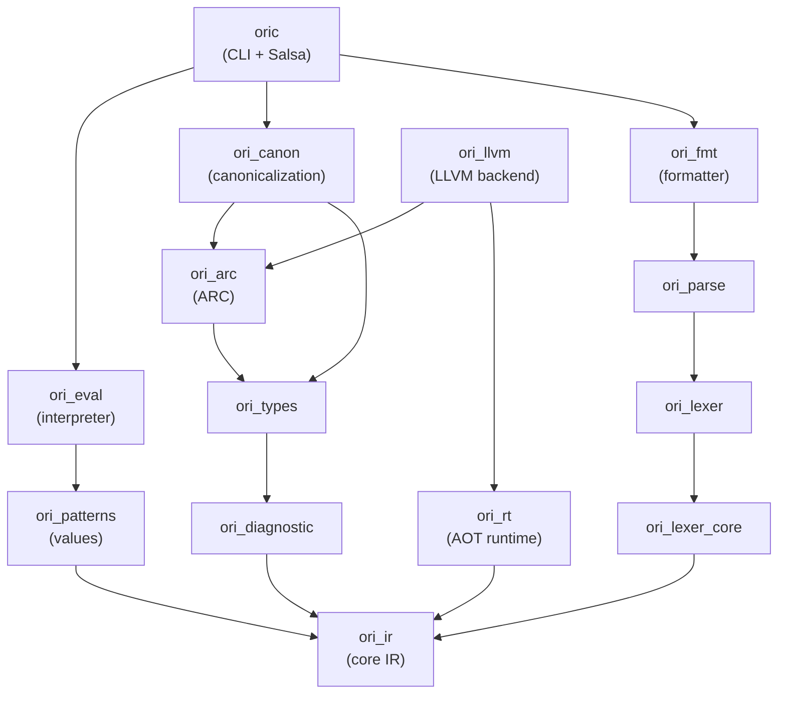

# Architecture Overview

The Ori compiler (`oric`) is an incremental, query-based compiler built on [Salsa](https://github.com/salsa-rs/salsa). It compiles Ori source code through a seven-stage pipeline that feeds two backends — a tree-walking interpreter and an LLVM native code generator — from a single shared intermediate representation.

## What Makes Ori's Compiler Distinctive

Most compilers are either interpreters or ahead-of-time compilers. Ori is both, and several architectural decisions follow from that choice.

### Canonical IR as the Single Bridge

The central architectural idea is a **sugar-free canonical IR** (`CanExpr`) that sits between type checking and execution. Both backends consume the same representation:



Canonicalization does three things that neither backend needs to repeat:

1. **Desugaring** — Named calls become positional. Template literals become string concatenation. Spreads become method calls. Seven sugar forms eliminated.
2. **Pattern compilation** — Match expressions compile to decision trees via the Maranget (2008) algorithm ("Compiling Pattern Matching to Good Decision Trees"). The interpreter walks the tree; LLVM emits `switch` terminators from it.
3. **Constant folding** — Compile-time expressions pre-evaluated into a `ConstantPool`.

Every `CanNode` carries its resolved type from type checking, so downstream passes never re-infer.

### ARC Memory Management (Lean 4 / Koka Inspired)

Ori uses automatic reference counting instead of a garbage collector or borrow checker. The `ori_arc` crate implements a research-grade ARC pipeline inspired by Lean 4's LCNF IR and Koka's FBIP (Functional-But-In-Place) analysis.

**Three-way type classification** drives all RC decisions:

| Class | Meaning | RC Behavior |
|-------|---------|-------------|
| `Scalar` | Never heap-allocated (`int`, `bool`, `Option<int>`) | No RC operations |
| `DefiniteRef` | Always heap-allocated (`str`, `[T]`, `{K: V}`) | Full RC tracking |
| `PossibleRef` | Unknown at analysis time (unresolved generics) | Conservative RC |

The ARC pipeline is a 10-pass transformation with load-bearing ordering:



The ARC IR is **backend-independent** — `ori_arc` has no LLVM dependency. The `arc_emitter` in `ori_llvm` translates ARC IR instructions to LLVM IR. This separation means the ARC analysis can be tested, debugged, and evolved without touching codegen.

### Capability-Based Effect System

Every function declares what effects it may perform:

```ori
@fetch_data (url: str) -> Result<str, Error> uses Http = { ... }
```

Effects are tracked through the type system via `EffectClass`:
- **Pure** — deterministic, parallelizable
- **ReadsOnly** — reads external state (`Env`, `Clock`, `Random`)
- **HasEffects** — I/O or mutation (`Http`, `FileSystem`, `Print`)

Capabilities are provided at call sites via `with...in`, enabling dependency injection and testability without frameworks:

```ori
with Http = MockHttp { } in {
    fetch_data(url: "https://example.com")
}
```

Stateful handlers carry mutable state through handler frames:

```ori
with Logger = handler(state: []) {
    log: (s, msg) -> ([...s, msg], void)
} in { ... }
```

### Salsa-Driven Incrementality

Every major computation is a Salsa query with automatic memoization, dependency tracking, and early cutoff:

```rust
#[salsa::tracked]
pub fn tokens(db: &dyn Db, file: SourceFile) -> TokenList { ... }

#[salsa::tracked]
pub fn parsed(db: &dyn Db, file: SourceFile) -> ParseOutput { ... }

#[salsa::tracked]
pub fn typed(db: &dyn Db, file: SourceFile) -> TypeCheckResult { ... }

#[salsa::tracked]
pub fn evaluated(db: &dyn Db, file: SourceFile) -> ModuleEvalResult { ... }
```

When source text changes, Salsa re-runs `tokens()`. If the tokens are identical (e.g., whitespace-only change), `parsed()` returns its cached result and nothing downstream runs. This early cutoff cascades through the entire pipeline.

**Session-scoped side-caches** handle data that can't satisfy Salsa's `Clone + Eq + Hash` requirements:

| Cache | Contents | Populated By |
|-------|----------|-------------|
| `PoolCache` | `Arc<Pool>` per file | `typed()` |
| `CanonCache` | `SharedCanonResult` per file | `canonicalize_cached()` |
| `ImportsCache` | `Arc<ResolvedImports>` per file | Module loading |

A `CacheGuard` safety token ensures invalidation is always performed before re-type-checking — callers cannot skip it.

### Mandatory Verification

Tests are not optional in Ori. Every function (except `@main`) requires attached tests:

```ori
@factorial (n: int) -> int = if n <= 1 then 1 else n * factorial(n: n - 1)

@t tests @factorial () -> void = {
    assert_eq(actual: factorial(n: 0), expected: 1);
    assert_eq(actual: factorial(n: 5), expected: 120);
}
```

The type checker enforces this. Functions also support contracts (`pre()`/`post()`) that run at call boundaries.

## Crate Architecture

The compiler is a Cargo workspace with strict one-way dependencies. Later phases never call back into earlier ones.



> Only key dependency edges shown — all crates ultimately depend on `ori_ir`. `ori_llvm` and `ori_rt` are excluded from the main workspace (require LLVM 17).

**Key dependency invariants:**
- `ori_patterns` depends only on `ori_ir`, not `ori_types` — the Value system is type-agnostic
- `ori_eval` depends on `ori_patterns`, not directly on `ori_types` — the interpreter doesn't type-check
- `ori_arc` has no LLVM dependency — ARC analysis is backend-independent
- Pure functions live in library crates; Salsa queries live only in `oric`

## Design Principles

### Flat Data Structures

The AST uses arena allocation. Expressions are indexed by `ExprId(u32)` into a flat `Vec<Expr>`, giving cache locality, simple memory management, and efficient Salsa serialization. All identifiers are interned as `Name(u32)` for O(1) comparison.

### Pool-Based Type Representation

Types are interned into a `Pool` and referenced by `Idx(u32)`. A `Tag(u8)` discriminant enables tag-driven dispatch without unpacking. Pre-computed `TypeFlags` bitflags answer common queries (`HAS_VAR`, `IS_PRIMITIVE`, `NEEDS_SUBST`) in O(1).

Primitives are pre-interned at fixed indices (`INT=0`, `FLOAT=1`, ..., `ORDERING=11`), so comparing a type to `int` is a single integer comparison.

### Phase Purity

Each compiler phase is a pure `IR → IR` transformation:
- The lexer produces tokens without parsing
- The parser builds AST without type checking
- The type checker annotates without evaluating
- The canonicalizer desugars without knowing which backend will consume the result

Phase boundaries use minimal types — `(tag, span)` at the lexer boundary, `ExprId` for AST references, `Idx` for types. No phase state leaks into output types.

### Error Accumulation

Every phase accumulates all errors in one pass rather than stopping at the first. Only the evaluator stops on first error (since execution can't meaningfully continue). This gives users comprehensive diagnostics from a single compilation.

`ErrorGuaranteed` provides a type-level proof that an error was emitted, preventing "error reported but compilation continues as if successful" bugs.

### Registry Pattern

Built-in patterns (`recurse`, `parallel`, `spawn`, etc.) use zero-sized types wrapped in a `Pattern` enum — 1 byte, static dispatch, no heap allocation, no HashMap lookup. The `PatternRegistry` is a direct `match` from kind to pattern.

## Key Types

| Type | Crate | Purpose |
|------|-------|---------|
| `ExprArena` / `ExprId` | `ori_ir` | Arena-allocated AST expressions |
| `Name` | `ori_ir` | Interned identifier (u32 index) |
| `Span` | `ori_ir` | Source location (start/end byte offsets) |
| `Idx` / `Tag` / `Pool` | `ori_types` | Interned type handle / kind discriminant / type storage |
| `TypeFlags` | `ori_types` | Pre-computed type metadata bitflags |
| `CanonResult` | `ori_ir` | Canonical IR: `CanArena` + `DecisionTreePool` + `ConstantPool` |
| `SharedCanonResult` | `ori_ir` | `Arc`-wrapped `CanonResult` for zero-copy sharing |
| `ArcFunction` / `ArcInstr` | `ori_arc` | Basic-block IR with explicit RC operations |
| `ArcClass` | `ori_arc` | `Scalar` / `DefiniteRef` / `PossibleRef` classification |
| `Value` | `ori_patterns` | Runtime values (interpreter) |
| `Interpreter` | `ori_eval` | Tree-walking evaluator over canonical IR |
| `IrBuilder` / `SimpleCx` | `ori_llvm` | LLVM IR construction and context |
| `Diagnostic` | `ori_diagnostic` | Rich error with labels, suggestions, and fix applicability |
| `ErrorGuaranteed` | `ori_diagnostic` | Type-level proof an error was emitted |

## Prior Art

The architecture draws from several research compilers:

| Feature | Inspiration |
|---------|------------|
| ARC with borrow inference | Lean 4 LCNF (`Compiler/IR/RC.lean`, `Borrow.lean`) |
| Functional-but-in-place (FBIP) | Koka (`Core/Borrowed.hs`, `Core/CheckFBIP.hs`) |
| Reset/reuse optimization | Lean 4 (`ExpandResetReuse.lean`) |
| Decision tree compilation | Maranget (2008), used by Roc and Elm |
| Query-based compilation | Salsa (used by rust-analyzer) |
| Capability-based effects | Koka effect handlers, algebraic effects literature |

## Related Documents

- [Compilation Pipeline](pipeline.md) — Detailed stage-by-stage pipeline description
- [Salsa Integration](salsa-integration.md) — How Salsa queries, caching, and side-caches work
- [Data Flow](data-flow.md) — Data movement and ownership through phases
