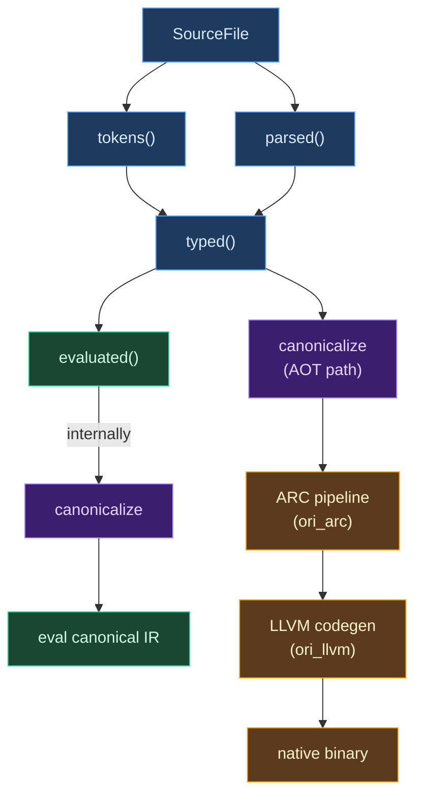

# Compilation Pipeline

## What Is a Compilation Pipeline?

Every compiler, no matter how simple, must perform multiple distinct operations on source code: recognize words, understand structure, check meaning, and produce output. The **compilation pipeline** is how these operations are organized — the order in which they run, the data they pass between each other, and the rules for when a later stage can request information from an earlier one.

The simplest pipeline is a linear sequence: lex, then parse, then type-check, then generate code. Each stage runs to completion before the next begins, and data flows in one direction. This is easy to reason about but inflexible — a change to one source file forces the entire pipeline to re-run from scratch.

More sophisticated pipelines introduce two key ideas:

**Demand-driven execution.** Instead of pushing data through stages in order, the pipeline is inverted: the final stage *requests* its input, which triggers the second-to-last stage, and so on recursively. This means stages only run when their output is actually needed, and the framework can skip stages whose inputs haven't changed.

**Forking.** A single pipeline can diverge at a midpoint, with multiple downstream stages consuming the same intermediate result. This is essential for compilers with multiple backends — an interpreter and a native code generator, for example, can share the work of lexing, parsing, type checking, and desugaring, then diverge for execution.

Both of these ideas carry costs. Demand-driven execution requires a caching framework and equality checks on intermediate results. Forking requires the shared intermediate representation to be general enough for all consumers. The pipeline design is where these tradeoffs are resolved.

## Pipeline Design Decisions

### Push vs. Pull

A **push-based** pipeline runs each stage in sequence: `lex(source) |> parse |> check |> eval`. The driver controls the order. Simple and predictable, but wasteful when only part of the output is needed.

A **pull-based** pipeline inverts control: calling `eval(file)` triggers `check(file)`, which triggers `parse(file)`, which triggers `lex(file)`. Each stage runs only when needed and caches its result. This is the model Ori uses via [Salsa](https://salsa-rs.netlify.app/).

The practical difference shows up during development. In a push-based compiler, changing one line forces a full recompile. In a pull-based compiler, `lex(file)` re-runs, but if the tokens are identical to the cached result (a whitespace-only change, say), every downstream stage returns its cached result immediately. This "early cutoff" behavior is the foundation of incremental compilation.

### The Fork Point

Most compilers have a single pipeline ending in one backend. Ori's pipeline **forks** after canonicalization: the same canonical IR feeds both the tree-walking interpreter (fast feedback during development) and the ARC/LLVM pipeline (native performance for production). This fork is the reason canonicalization exists as a separate stage — without it, desugaring and pattern compilation would need to be duplicated in both backends.

## Pipeline Stages

### 1. Lexical Analysis (`tokens` query)

**Input**: `SourceFile` (source text)
**Output**: `TokenList`

```rust
#[salsa::tracked]
pub fn tokens(db: &dyn Db, file: SourceFile) -> TokenList
```

The lexer converts source text into tokens:

```text
"let x = 42"  →  [Let, Ident("x"), Eq, Int(42)]
```

Key characteristics:
- Two-layer architecture: raw scanner (`ori_lexer_core`) + token cooking (`ori_lexer`)
- String interning for identifiers
- Handles duration literals (`100ms`), size literals (`4kb`)
- No errors accumulated — invalid input becomes an `Error` token

**Intermediate queries**: The `tokens()` query is the top of a small query chain:

```text
tokens_with_metadata(db, file) → LexOutput  (full output including comments/metadata)
    ↓
lex_result(db, file) → LexResult            (tokens + errors, without metadata)
    ↓
tokens(db, file) → TokenList                (just the token list)
lex_errors(db, file) → Vec<LexError>        (just the errors)
```

- `tokens_with_metadata()` calls `lex_with_comments()` and preserves comment/trivia data for the formatter
- `lex_result()` strips metadata from `tokens_with_metadata()` output
- `tokens()` and `lex_errors()` extract their respective fields from `lex_result()`

This chain design means that a formatting-only consumer (which needs comments) and a compilation consumer (which doesn't) share the same lex work via Salsa caching.

### 2. Parsing (`parsed` query)

**Input**: `SourceFile` (via `tokens` query)
**Output**: `ParseOutput { module: Module, arena: ExprArena, errors: Vec<ParseError> }`

```rust
#[salsa::tracked]
pub fn parsed(db: &dyn Db, file: SourceFile) -> ParseOutput
```

The parser builds a flat AST using recursive descent:

```text
tokens  →  Module {
              functions: [...],
              types: [...],
              tests: [...],
            }
```

Key characteristics:
- Recursive descent with Pratt parsing for expressions
- Error recovery via `ParseOutcome` enum and `TokenSet` synchronization
- Arena allocation for expressions — all nodes indexed by `ExprId`
- Accumulates errors (doesn't stop at first error)

### 3. Type Checking (`typed` query)

**Input**: `SourceFile` (via `parsed` query)
**Output**: `TypeCheckResult { typed: TypedModule, error_guarantee: Option<ErrorGuaranteed> }`

```rust
#[salsa::tracked]
pub fn typed(db: &dyn Db, file: SourceFile) -> TypeCheckResult
```

Type checking performs Hindley-Milner inference with constraint solving:

```text
parsed AST  →  TypedModule {
                  expr_types: [Type for each ExprId],
                  errors: [...],
                }
```

Key characteristics:
- Constraint-based inference via `InferEngine`
- Unification with union-find and rank optimization
- Pattern type checking and exhaustiveness preparation
- Capability checking (`uses` declarations)
- Some desugarings happen here: pipe (`|>`), comparison operators, `for...yield`

**Side-channel query**: `typed_pool(db, file) -> Option<Arc<Pool>>` provides access to the type `Pool` produced as a side effect of `typed()`. The Pool can't satisfy Salsa's `Clone + Eq + Hash` requirements, so it is stored in a session-scoped `PoolCache` rather than as a Salsa query output. Callers that need the Pool (error rendering, canonicalization, codegen) call `typed()` first, then `typed_pool()`.

### 4. Canonicalization (independently cached)

**Input**: `ParseOutput` + `TypeCheckResult` + `Pool`
**Output**: `SharedCanonResult` (Arc-wrapped `CanonResult`)

Canonicalization transforms the typed AST into sugar-free canonical IR:

```rust
let shared_canon = canonicalize_cached(db, file, parse_result, type_result, pool);
```

Key operations:
- **Desugaring**: Named calls to positional, template literals to concatenation, spreads to method calls
- **Pattern compilation**: Match patterns to decision trees ([Maranget 2008](http://moscova.inria.fr/~maranget/papers/ml05e-maranget.pdf) algorithm)
- **Constant folding**: Compile-time expressions pre-evaluated into `ConstantPool`
- **Type attachment**: Every `CanNode` carries its resolved type

Canonicalization is NOT a Salsa query, but it is independently cached via `canonicalize_cached()` in the session-scoped `CanonCache`. Multiple consumers share the same cached result: the `evaluated()` query, the `check` command (for pattern exhaustiveness), the test runner, and the LLVM backend. The cache is keyed by file path and stores `SharedCanonResult` values, so the canonical IR is computed once and shared across all consumers via `Arc`.

### 5. Evaluation (`evaluated` query)

**Input**: `SourceFile` (via `typed` query, then canonicalized)
**Output**: `ModuleEvalResult { value: Value, output: EvalOutput }`

```rust
#[salsa::tracked]
pub fn evaluated(db: &dyn Db, file: SourceFile) -> ModuleEvalResult
```

Tree-walking interpretation over canonical IR:

```text
CanonResult  →  ModuleEvalResult {
                   value: Value::Int(42),
                   output: EvalOutput { stdout, stderr },
                 }
```

Key characteristics:
- Evaluates `CanExpr` nodes (canonical IR), not raw `ExprKind`
- Stack-based environment for variable bindings
- Decision tree evaluation for pattern matching
- Pattern registry for built-in patterns (`recurse`, `parallel`, `spawn`)
- Module caching for imports
- Parallel test execution

### 6. ARC Analysis (`ori_arc`)

**Input**: `CanonResult` + `Pool`
**Output**: `Vec<ArcFunction>` (ARC IR with RC operations)

The ARC pipeline transforms canonical IR into a basic-block IR with explicit reference counting:

```text
CanExpr → lower → ArcFunction
  → borrow inference (Owned/Borrowed params)
  → derived ownership (all locals)
  → dominator tree
  → liveness + refined liveness
  → RC insertion (RcInc/RcDec)
  → reset/reuse detection
  → expand reset/reuse
  → RC elimination (dead RC removal)
  → cross-block RC elimination
```

Key characteristics:
- Three-way type classification: `Scalar` / `DefiniteRef` / `PossibleRef`
- Backend-independent — no LLVM dependency
- Borrow signatures cached per session for unchanged function bodies

### 7. LLVM Codegen (`ori_llvm`)

**Input**: `Vec<ArcFunction>` + `Pool` + type info
**Output**: Native binary or JIT execution

Two-pass compilation:
1. **Declare**: Walk functions → `FunctionAbi` → declare with calling conventions and attributes
2. **Define**: Walk ARC IR → `ArcIrEmitter` → LLVM IR

The `ArcIrEmitter` translates each ARC IR instruction to LLVM instructions, handling RC operations, closures, built-in methods, and derived trait codegen.

### 8. Pattern Checking (inside `check` command)

Canonicalization also runs in the `check` command — independently of `evaluated()` — to detect pattern problems before execution:

```rust
let canon_result = ori_canon::lower_module(
    &parse_result.module,
    &parse_result.arena,
    &type_result,
    &pool,
    interner,
);
for problem in &canon_result.problems {
    let diag = pattern_problem_to_diagnostic(problem, interner);
    emitter.emit(&diag);
}
```

This detects non-exhaustive matches and redundant arms at check time, without running the evaluator. The same canonical IR is shared with the evaluator if `ori run` is called later, thanks to the `CanonCache`.

## Query Dependencies



When `SourceFile` changes:
1. `tokens()` re-runs
2. If tokens unchanged, `parsed()` uses cached result (early cutoff)
3. If parsed unchanged, `typed()` uses cached result
4. If typed unchanged, `evaluated()` uses cached result

Early cutoff is Salsa's most powerful optimization. A whitespace-only edit re-lexes (new tokens) but produces identical token output, so parsing and everything downstream is skipped. A comment-only edit produces different lex output (different metadata) but identical tokens, so parsing is skipped. The more phases that produce unchanged output, the less work downstream phases do.

## Phase Characteristics

| Phase | Errors | Recovery | Output |
|-------|--------|----------|--------|
| Lexer | Rare (invalid chars) | Continue (emit Error token) | TokenList |
| Parser | Syntax errors | Skip/recover via TokenSet | Module + errors |
| Typeck | Type mismatches | Continue (accumulate) | Types + errors |
| Canon | Pattern problems | Accumulate | CanonResult + PatternProblems |
| ARC | Classification errors | Abort | Vec\<ArcFunction\> |
| LLVM | Codegen errors | Abort | Native binary |
| Eval | Runtime errors | Stop | Value or error |

The recovery strategy shifts across phases. Early phases (lexer, parser) recover aggressively to maximize the number of errors reported per compilation. Middle phases (type checker, canonicalizer) accumulate errors but continue processing. Late phases (ARC, LLVM, evaluator) abort on error because their input is expected to be correct — errors at these stages indicate compiler bugs, not user errors.

## Debugging the Pipeline

Salsa event logging shows which queries execute and which return cached results:

```bash
ORI_LOG=oric=debug ori check file.ori
```

Output shows query execution:
```text
DEBUG oric: will_execute: tokens(file_0)
DEBUG oric: did_execute: tokens(file_0) in 1.2ms
DEBUG oric: will_execute: parsed(file_0)
DEBUG oric: did_execute: parsed(file_0) in 3.4ms
```

Each phase has its own tracing target for deeper inspection:

```bash
ORI_LOG=ori_types=trace ORI_LOG_TREE=1 ori check file.ori  # Type inference call tree
ORI_LOG=ori_eval=debug ori run file.ori                    # Evaluator dispatch
ORI_LOG=ori_arc=debug ori build file.ori                   # ARC pipeline passes
```

Phase dumps provide full IR output at each boundary:

```bash
ORI_DUMP_AFTER_PARSE=1 ori check file.ori   # AST after parse
ORI_DUMP_AFTER_TYPECK=1 ori check file.ori  # Typed IR
ORI_DUMP_AFTER_ARC=1 ori build file.ori     # ARC IR with RC annotations
ORI_DUMP_AFTER_LLVM=1 ori build file.ori    # LLVM IR
```

These are the compiler's primary debugging tools — `ORI_LOG` before reading code line-by-line, phase dumps before stepping through passes manually.

## Prior Art

Different compilers organize their pipelines in different ways, and the differences are illuminating.

### Rust — Progressive Lowering

[Rust's compiler](https://github.com/rust-lang/rust) uses multiple IR levels: Source → AST → HIR → THIR → MIR → LLVM IR → Machine Code. Each lowering step eliminates a category of complexity. HIR desugars `for` loops and `?`. THIR adds type information. MIR desugars drops, moves, and control flow. This progressive approach means each IR is simpler than the last, but the cost is maintaining six distinct representations.

Ori takes a similar but more compressed approach — two main IRs (AST and canonical) plus a third (ARC IR) for the native path — reflecting the simpler language surface.

### GHC — The Nanopass Pipeline

[GHC](https://gitlab.haskell.org/ghc/ghc)'s pipeline from Haskell source to native code passes through Source → Core → STG → Cmm → Assembly, with dozens of Core-to-Core optimization passes. Each optimization is a standalone `Core → Core` transformation. This modularity makes it easy to add, remove, or reorder optimizations, but the sheer number of passes means compilation is slower than architectures with fewer, larger passes.

### Go — The Monolithic Frontend

[Go](https://github.com/golang/go)'s compiler (`cmd/compile`) uses a relatively flat architecture compared to Rust or GHC. The frontend goes straight from source to SSA form with minimal intermediate representations. This reflects Go's design philosophy of simplicity and fast compilation — fewer IRs mean less engineering overhead but also less opportunity for sophisticated optimizations.

### Zig — Self-Hosted with Minimal IRs

[Zig](https://github.com/ziglang/zig)'s self-hosted compiler uses Source → AST → ZIR → AIR → Machine Code, with separate analysis passes over a single IR rather than transforming between representations. This keeps the codebase smaller and avoids the maintenance burden of multiple IR types, at the cost of each pass needing to understand the full complexity of the IR rather than a simplified subset.
