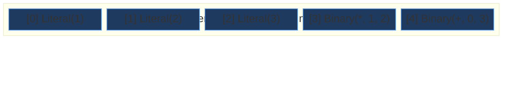
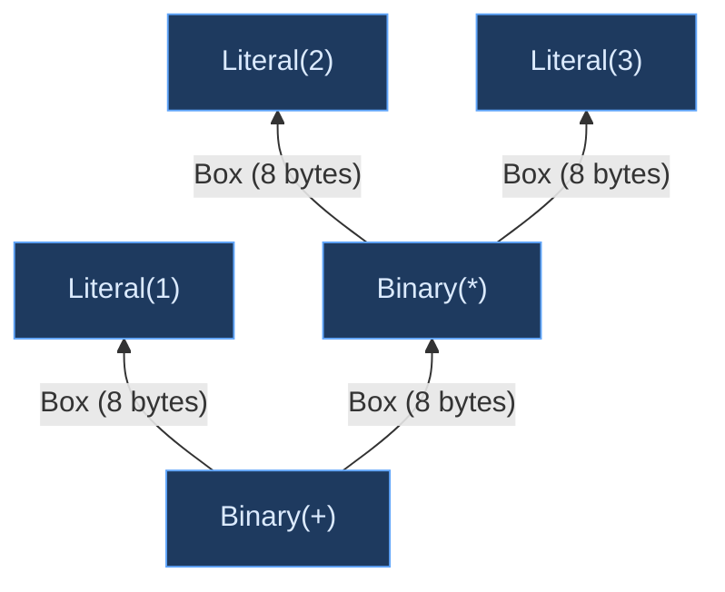

# Flat AST Design

## What Is a Flat AST?

Most compilers represent programs as trees. The expression `1 + 2 * 3` becomes a tree where the `+` node owns a `1` child and a `*` child, and the `*` child owns `2` and `3`. This is a natural encoding — source code is hierarchical, and trees preserve that hierarchy.

A **flat AST** replaces the tree's pointer-based ownership with index-based referencing. Instead of each node owning its children through `Box<Expr>` or `Rc<Expr>`, all nodes live in a contiguous array, and children are referenced by their position in that array. The tree structure is still there — `+` still has two children — but it's encoded as indices rather than pointers.

```text
Tree AST:     +                   Flat AST:  [0] Literal(1)
             / \                             [1] Literal(2)
            1   *                            [2] Literal(3)
               / \                           [3] Binary(*, 1, 2)
              2   3                          [4] Binary(+, 0, 3)
```

This seemingly minor change in representation has far-reaching consequences for compiler performance, memory management, and integration with incremental compilation frameworks. Ori's flat AST design is central to how the entire compiler operates.

## Why Not Just Use Trees?

The recursive tree representation is the textbook approach:

```rust
enum Expr {
    Literal(Literal),
    Binary {
        left: Box<Expr>,
        op: BinaryOp,
        right: Box<Expr>,
    },
    Call {
        func: Box<Expr>,
        args: Vec<Box<Expr>>,
    },
    If {
        condition: Box<Expr>,
        then_branch: Box<Expr>,
        else_branch: Option<Box<Expr>>,
    },
}
```

This works perfectly well for small programs and educational compilers. But as programs grow, four problems emerge.

**Allocation pressure.** Every node is a separate heap allocation. Parsing a file with 50,000 expressions means 50,000 calls to the allocator — each involving bookkeeping, potential lock contention in multithreaded allocators, and fragmentation of the heap. Some allocators handle this well; others don't. But even the best allocator can't match the cost of zero allocations, which is what a pre-sized flat array achieves.

**Cache behavior.** Modern CPUs are fast at arithmetic but slow at memory access. A cache miss — when the CPU needs data that isn't in the L1/L2 cache — costs 50-200 cycles. A recursive tree scatters nodes across the heap, so traversing the tree (during type checking, evaluation, or codegen) means chasing pointers to unpredictable locations, generating cache misses at every step. A flat array stores nodes contiguously, so sequential traversal reads memory in order — the CPU's hardware prefetcher can predict and preload the next cache line.

**Equality and hashing.** Salsa, the incremental computation framework Ori uses, memoizes the results of compilation queries. To know whether a cached result is still valid, Salsa compares the current input to the cached input for equality. For a recursive tree, equality comparison means a deep recursive traversal — O(n) in the size of the tree. For a flat array, equality comparison is a `memcmp` of contiguous memory — still O(n) in element count, but with dramatically better constant factors because the comparison reads linear memory.

**Sharing.** When multiple compilation queries need the same AST (the type checker, the canonicalizer, the evaluator), a recursive tree must either be deeply copied or wrapped in `Arc` at every node. A flat array can be shared by wrapping the entire array in a single `Arc`, giving every consumer a zero-cost reference to the same contiguous data.

## Ori's Flat AST Design

Ori's AST separates the concerns that recursive trees conflate. Instead of each node being a self-contained struct with kind, span, and children, the arena uses a **struct-of-arrays** layout:

```rust
struct ExprArena {
    expr_kinds: Vec<ExprKind>,   // 24 bytes each — what kind of expression
    expr_spans: Vec<Span>,       // 8 bytes each — where in the source text
    // ... 20+ side tables for variable-length data
}
```

An `ExprId(u32)` indexes into both arrays simultaneously — `expr_kinds[id]` gives the expression kind, `expr_spans[id]` gives its source location. The key insight is that most passes only need one of these: the type checker iterates over `expr_kinds` without touching spans; error reporting reads spans without caring about expression structure. Separating them means each pass only pulls the data it needs into cache.

### ExprId — The Universal Reference

`ExprId` is the handle through which all code references AST nodes:

```rust
#[repr(transparent)]
#[derive(Clone, Copy, Eq, PartialEq, Hash, Debug)]
pub struct ExprId(u32);

impl ExprId {
    pub const INVALID: ExprId = ExprId(u32::MAX);

    pub const fn is_valid(self) -> bool {
        self.0 != u32::MAX
    }
}
```

At 4 bytes, `ExprId` is half the size of a pointer on 64-bit systems. It's `Copy`, so passing it around has no overhead — no reference counting, no cloning, no lifetime tracking. It derives all the traits Salsa needs (`Clone`, `Eq`, `Hash`), making it directly usable as a query key or result.

The `INVALID` sentinel (`u32::MAX`) provides a safe "no expression" marker, used in places where an optional expression reference is needed without the 4-byte overhead of `Option<ExprId>`.

### ExprRange — Compact Variable-Length Children

A critical design problem in flat ASTs is handling nodes with variable numbers of children. A function call has an arbitrary number of arguments. A list literal has an arbitrary number of elements. A match expression has an arbitrary number of arms. In a recursive tree, these are naturally `Vec<Box<Expr>>`. In a flat AST, we need a different solution.

Ori uses `ExprRange` — a compact reference into a flattened side-table:

```rust
#[repr(C)]
pub struct ExprRange {
    start: u32,   // Index into arena's expr_lists array
    len: u16,     // Number of elements (max 65,535)
    // 2 bytes padding
}
```

Instead of each `Call` node owning a `Vec<ExprId>` (24 bytes for the Vec header alone), it stores an `ExprRange` (8 bytes) that points into the arena's shared `expr_lists: Vec<ExprId>` array. A call with 3 arguments has `ExprRange { start: 47, len: 3 }`, meaning its arguments are `expr_lists[47]`, `expr_lists[48]`, and `expr_lists[49]`.

This design keeps `ExprKind` at a fixed 24 bytes regardless of how many children a node has — a property that matters for cache line utilization. It also means all variable-length data lives in a single contiguous array that can be pre-allocated with the arena.

The `u16` length cap of 65,535 elements per list is a deliberate choice. No reasonable program has a function call with 65,535 arguments or a list literal with 65,535 elements. The cap saves 2 bytes per range (versus `u32`), and 2 bytes × hundreds of thousands of ranges adds up.

### Building the AST During Parsing

The parser owns the arena and fills it during parsing. The pattern is append-only: child nodes are always allocated before their parents, because the parser builds the tree bottom-up.

```rust
impl Parser {
    fn parse_binary(&mut self) -> ExprId {
        let left = self.parse_unary();

        if self.check_operator() {
            let op = self.advance_operator();
            let right = self.parse_binary();

            // Children already allocated, just reference their IDs
            self.arena.alloc(ExprKind::Binary { left, op, right })
        } else {
            left
        }
    }
}
```

Pre-allocation uses a heuristic: approximately one expression per 20 bytes of source text. For a 10,000-byte file, the parser pre-allocates space for ~500 expressions. This heuristic was derived empirically from Ori source files and avoids most reallocation during parsing.

For variable-length children, the parser pushes children into the side-table and creates a range:

```rust
fn parse_call_args(&mut self) -> ExprRange {
    let start = self.arena.expr_lists.len() as u32;
    while !self.check(&TokenKind::RParen) {
        let arg = self.parse_expr();
        self.arena.expr_lists.push(arg);
        // ... comma handling
    }
    let len = (self.arena.expr_lists.len() as u32 - start) as u16;
    ExprRange { start, len }
}
```

### Traversal with Arena Context

Every function that examines the AST must accept the arena as a parameter:

```rust
fn eval_expr(arena: &ExprArena, id: ExprId, env: &mut Environment) -> Value {
    match arena.kind(id) {
        ExprKind::Literal(lit) => Value::from_literal(lit),

        ExprKind::Binary { left, op, right } => {
            let left_val = eval_expr(arena, *left, env);
            let right_val = eval_expr(arena, *right, env);
            apply_op(op, left_val, right_val)
        }

        ExprKind::If { condition, then_branch, else_branch } => {
            let cond_val = eval_expr(arena, *condition, env);
            if cond_val.is_truthy() {
                eval_expr(arena, *then_branch, env)
            } else if let Some(else_id) = else_branch {
                eval_expr(arena, *else_id, env)
            } else {
                Value::Void
            }
        }
        // ...
    }
}
```

This is more verbose than `expr.left` on a recursive tree, but in practice the arena is already threaded through every function as part of a context struct. The `Deref` implementation on `SharedArena` makes this ergonomic — code that holds a `SharedArena` can call `arena.kind(id)` directly without explicitly dereferencing.

### Parallel Arrays for Phase-Specific Data

The arena's SoA layout naturally extends to phase-specific metadata. Type annotations, computed during type checking, are stored in a parallel array indexed by the same `ExprId`:

```rust
// Type checker stores types parallel to the arena
let expr_type: Idx = pool.get_type(expr_id);
```

This pattern keeps the AST immutable after parsing — type checking doesn't modify the arena, it builds a parallel data structure. Multiple phases can attach their own metadata to the same AST without interfering with each other. And because each parallel array is independently Salsa-compatible, phase results can be cached and invalidated independently.

### Memory Layout Comparison

For the expression `1 + 2 * 3`, the flat arena stores five nodes in contiguous memory:



A Box-based AST scatters these across the heap:



In the flat layout, iterating over all expressions is a linear scan of contiguous memory. In the Box-based layout, each traversal step follows a pointer to an unpredictable memory location.

### Sharing via SharedArena

After parsing, the arena is wrapped in `SharedArena(Arc<ExprArena>)` for zero-cost sharing:

```rust
pub struct SharedArena(Arc<ExprArena>);

impl Deref for SharedArena {
    type Target = ExprArena;
    fn deref(&self) -> &Self::Target { &self.0 }
}
```

Cloning a `SharedArena` is an `Arc::clone` — an atomic increment, not a deep copy. The type checker, canonicalizer, evaluator, and LLVM backend all hold `SharedArena` references to the same underlying data.

## Design Tradeoffs

Flat ASTs are not free. Three properties of recursive trees are lost:

**Append-only allocation.** The arena only grows. Nodes cannot be deleted or replaced in place. This is acceptable because compiler passes are append-only by nature — parsing builds the AST once, and subsequent phases create new representations (canonical IR, ARC IR) rather than modifying the raw AST.

**Arena threading.** Every function that touches the AST must accept the arena as a parameter. This adds one argument to many function signatures. In practice, the arena is bundled into context structs that are already threaded through the compiler, so the incremental burden is a field in an existing parameter rather than a new parameter.

**Indirection.** Accessing a child node requires `arena.kind(child_id)` rather than `node.child`. This is one extra index operation — a bounds-checked array access, which modern CPUs predict and pipeline effectively. The indirection cost is small compared to the cache locality benefit.

These tradeoffs are well-understood in the compiler community. Zig, Roslyn, and Swift's libSyntax all make the same tradeoffs, and none have found the costs to be problematic in practice.

## Prior Art

### Zig — MultiArrayList and Flat AST

[Zig](https://github.com/ziglang/zig)'s compiler pioneered the SoA flat AST pattern in a production compiler. Zig's `std.zig.Ast` stores node tags, data, and extra information in separate arrays, accessed by a unified `Node.Index`. The pattern extends through Zig's entire pipeline — ZIR, AIR, and the type system all use flat indexed storage. Andrew Kelley has discussed the design's performance benefits extensively, noting that Zig's parser achieves approximately 40 MB/s throughput partially due to cache-friendly memory layout. Ori's `ExprArena` follows the same structural pattern, adapted for Rust's type system and Salsa's requirements.

### Roslyn — Red-Green Trees

Microsoft's [Roslyn](https://github.com/dotnet/roslyn) C# compiler uses an alternative approach to the same problem: **red-green trees**. The "green" tree is an immutable, position-independent syntax tree (similar to Ori's `ExprArena` in spirit). The "red" tree is a lazily-constructed wrapper that adds parent pointers and absolute positions. This design enables incremental re-parsing — when source text changes, only affected green nodes are rebuilt. Ori chose flat arenas over red-green trees, trading incremental re-parsing for simpler implementation and better cache behavior.

### Swift — libSyntax

[Swift](https://github.com/swiftlang/swift)'s `libSyntax` library represents syntax nodes as a flat, immutable structure with structural sharing. Like Roslyn, it separates the raw tree structure from position information. Swift's design influenced the broader move toward immutable, shareable syntax trees in production compilers. Ori's `SharedArena` pattern achieves a similar goal — immutable post-parse, shared via `Arc` — but with a simpler flat-array implementation.

### Tree-sitter — Concrete Syntax Trees

[Tree-sitter](https://github.com/tree-sitter/tree-sitter) builds concrete syntax trees (CSTs) that preserve every token, including whitespace and comments, for IDE use. Tree-sitter's trees are designed for incremental re-parsing and are stored in a flat, position-indexed format. While Ori's AST is an abstract syntax tree (discarding whitespace and comments), Tree-sitter's flat storage and incremental design share the same insight: contiguous memory and index-based references outperform recursive trees for compiler workloads.

## Related Documents

- [Arena Allocation](arena-allocation.md) — SoA layout details, capacity heuristics, parallel array patterns
- [String Interning](string-interning.md) — How identifiers in the AST are represented as interned `Name(u32)` values
- [Type Representation](type-representation.md) — How the type pool extends the flat indexing pattern to types
- [IR Overview](index.md) — How the flat AST fits into Ori's three-tier IR pipeline
