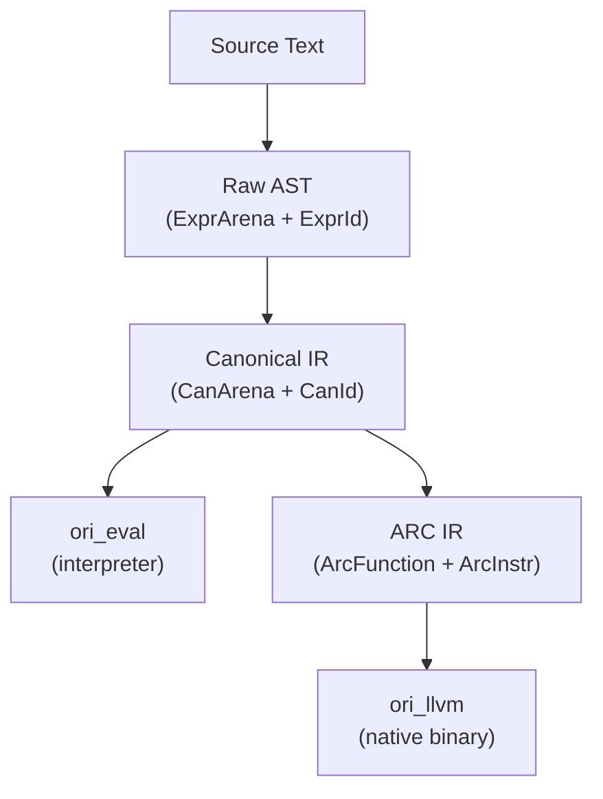

# Intermediate Representation Overview

The Ori compiler uses three intermediate representations, each optimized for a different phase of compilation:



Most compilers have one or two IRs. Ori has three because it serves two backends from a single pipeline — the canonical IR is the bridge that eliminates duplicated work, while the ARC IR handles concerns specific to native code generation.

## What Makes Ori's IR Design Distinctive

### Three-Tier IR System

| IR | Crate | Purpose | Key Type |
|----|-------|---------|----------|
| **Raw AST** | `ori_ir` | Parser output — preserves source structure and sugar | `ExprKind` + `ExprId` |
| **Canonical IR** | `ori_ir` (canon module) | Sugar-free, type-annotated, decision-tree compiled | `CanExpr` + `CanId` |
| **ARC IR** | `ori_arc` | Basic-block form with explicit RC operations | `ArcInstr` + `ArcVarId` |

Each IR has its own arena and index types — `ExprId` cannot accidentally index into `CanArena`, and `CanId` cannot index into ARC blocks. The type system enforces IR boundaries at compile time.

### Struct-of-Arrays Arena

The AST arena uses a struct-of-arrays layout rather than a traditional array-of-structs:

```rust
struct ExprArena {
    expr_kinds: Vec<ExprKind>,   // 24 bytes each — primary data
    expr_spans: Vec<Span>,       // 8 bytes each — source locations
    // ... 20+ side-table vectors for variable-length data
}
```

Most operations only touch `expr_kinds` (type checking, evaluation, canonicalization). Spans are only needed for error reporting. By separating them, the hot path reads 24-byte entries instead of 32-byte entries — a 25% improvement in cache line utilization.

Variable-length data (call arguments, list elements, match arms) uses compact range types instead of `Vec`:

```rust
struct ExprRange {
    start: u32,
    len: u16,    // max 65,535 elements per list
}
// 8 bytes total — points into a flattened side-table vector
```

This keeps `ExprKind` at a fixed 24 bytes regardless of how many children an expression has.

See [Arena Allocation](arena-allocation.md) and [Flat AST](flat-ast.md) for details.

### Pool-Based Type Interning

Types are interned into a `Pool` and referenced by `Idx(u32)`. Every unique type exists exactly once, enabling O(1) equality via index comparison:

```rust
struct Item {
    tag: Tag,   // 1 byte — type kind discriminant (u8)
    data: u32,  // 4 bytes — meaning depends on tag
}

struct Pool {
    items: Vec<Item>,            // All types (parallel arrays)
    flags: Vec<TypeFlags>,       // Pre-computed metadata
    hashes: Vec<u64>,            // Stable hashes
    extra: Vec<u32>,             // Variable-length data
    intern_map: FxHashMap<u64, Idx>,  // Deduplication
    var_states: Vec<VarState>,   // Type variable state
}
```

The `Tag(u8)` discriminant enables tag-driven dispatch — checking whether a type is a primitive, container, function, or variable is a single integer comparison. `TypeFlags` propagate from children to parents via bitwise OR, so checking whether a deeply nested type contains any unresolved variables is O(1).

Primitives are pre-interned at fixed indices (`INT=0`, `FLOAT=1`, ..., `ORDERING=11`), matching between `TypeId` (parser level) and `Idx` (type checker level).

Inspired by Zig's `InternPool`, Rust's `rustc_type_ir` (TypeFlags), and Lean 4's `IRType`.

See [Type Representation](type-representation.md) for the full design.

### Concurrent String Interning

All identifiers are interned to `Name(u32)` — 4 bytes instead of 24 bytes for `String`, with O(1) comparison. The interner uses 16 lock-striped shards for concurrent access:

```rust
struct Name(u32);  // Bits 31-28: shard, bits 27-0: local index

struct StringInterner {
    shards: [RwLock<InternShard>; 16],
}
```

~60 keywords and common identifiers are pre-interned at construction time for predictable `Name` values. `SharedInterner(Arc<StringInterner>)` enables zero-cost sharing across parallel test threads.

See [String Interning](string-interning.md) for details.

## Canonical IR: The Backend Bridge

The canonical IR deserves special attention because it's the key to Ori's dual-backend architecture. It transforms the raw AST in three ways:

1. **Desugaring** — Named calls → positional, template literals → concat, spreads → method calls (7 sugar forms)
2. **Pattern compilation** — Match expressions → decision trees (Maranget 2008 algorithm)
3. **Constant folding** — Compile-time expressions → `ConstantPool` entries

```rust
struct CanonResult {
    arena: CanArena,                    // Canonical expressions
    constants: ConstantPool,            // Pre-evaluated constants
    decision_trees: DecisionTreePool,   // Compiled pattern matches
    roots: Vec<CanonRoot>,              // Function/test entry points
    problems: Vec<PatternProblem>,      // Exhaustiveness violations
}
```

Every `CanNode` carries its resolved type, so neither backend needs to re-infer. The interpreter evaluates `CanExpr` directly; the LLVM path lowers `CanExpr` to ARC IR first.

`SharedCanonResult` wraps `CanonResult` in `Arc` for zero-copy sharing across consumers — the evaluator, test runner, `check` command, and LLVM backend all read from the same cached instance.

## ID Types and Sentinel Values

Several types use the ID pattern for indirection:

| Type | Size | Storage | Sentinel |
|------|------|---------|----------|
| `ExprId(u32)` | 4B | `ExprArena` | `INVALID = u32::MAX` |
| `CanId(u32)` | 4B | `CanArena` | — |
| `ArcVarId(u32)` | 4B | `ArcFunction` | — |
| `Name(u32)` | 4B | `StringInterner` | `EMPTY = 0` |
| `TypeId(u32)` | 4B | `ori_types` pool | `ERROR = 8` |
| `Idx(u32)` | 4B | `Pool` | `NONE = u32::MAX` |

All IDs are `Copy + Eq + Hash` — cheap to pass, compare, and store in Salsa queries.

## Size Assertions

Frequently-allocated types have compile-time size assertions to prevent accidental regressions:

| Type | Size | Notes |
|------|------|-------|
| `Span` | 8B | Two u32 offsets |
| `Token` | 24B | TokenKind + Span |
| `TokenKind` | 16B | Largest variant payload + discriminant |
| `ExprKind` | 24B | Compact via ExprId indirection and ranges |
| `CanExpr` | 24B | Sugar-free canonical expression |
| `Item` | 5B | Tag(1) + data(4), may pad to 8 |

The `static_assert_size!` macro catches any change at compile time, forcing intentional review.

## Salsa Compatibility

All IR types derive `Clone, Eq, PartialEq, Hash, Debug` — the traits required by Salsa for memoization and early cutoff. The flat arena and interned ID patterns make this natural: comparing two `ExprArena` values is comparing two `Vec`s of small structs, not traversing pointer-heavy trees.

## Related Documents

- [Flat AST](flat-ast.md) — Why arena + ID over Box, with memory layout comparison
- [Arena Allocation](arena-allocation.md) — SoA layout, capacity heuristics, SharedArena
- [String Interning](string-interning.md) — 16-shard concurrent interner, pre-interned keywords
- [Type Representation](type-representation.md) — Pool, Tag, Item, TypeFlags, extra array layouts
