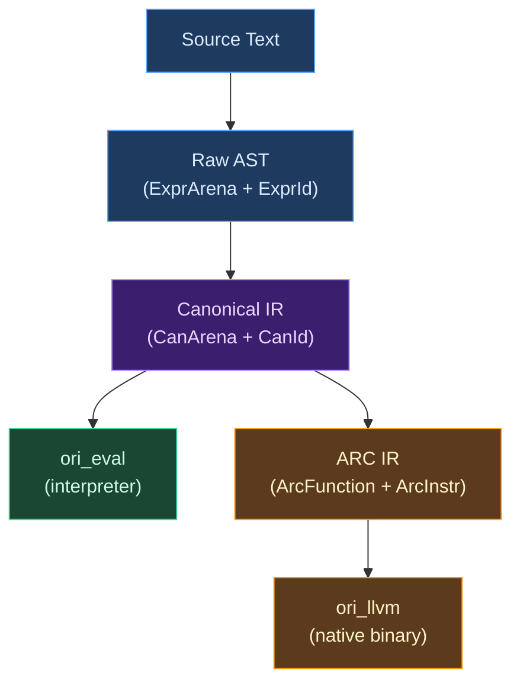

# Intermediate Representation Overview

## What Is an Intermediate Representation?

An **intermediate representation** (IR) is the data structure a compiler uses to reason about a program between reading the source text and producing output. Source code is designed for humans — it has comments, formatting, syntactic sugar, and ambiguous constructs that require context to resolve. Machine code is designed for hardware — it has registers, memory addresses, and instructions with rigid encoding rules. Neither representation is suitable for the work compilers do in between: type checking, optimization, analysis, and transformation. That work happens on an IR.

The choice of IR is among the most consequential decisions in compiler design. It determines what analyses are easy or hard, what optimizations are possible, how fast the compiler runs, and how much memory it uses. A compiler's IR is its internal language — the vocabulary in which it thinks about programs.

Every compiler has at least one IR. Most have several, because different phases of compilation need different things from their representation. A type checker wants to see every expression with its source location intact. An optimizer wants control flow decomposed into basic blocks. A code generator wants a representation close to the target machine. These demands pull in different directions, and multi-level IR designs are the result.

## Classical Approaches to IR Design

Compiler builders have developed several approaches to IR design over the past five decades. Understanding these approaches — and the tradeoffs between them — clarifies why Ori chose the design it did.

### Recursive Tree IRs

The most natural IR for a parser to produce is a **recursive tree** — each AST node owns its children via pointers or smart pointers:

```rust
// The "obvious" approach: each node owns its children
enum Expr {
    Int(i64),
    Add(Box<Expr>, Box<Expr>),
    Call(String, Vec<Expr>),
    If(Box<Expr>, Box<Expr>, Box<Expr>),
}
```

This is easy to build (the parser constructs nodes bottom-up and passes ownership to parents) and easy to pattern-match (Rust's `match` works naturally on recursive enums). Most introductory compiler textbooks use this representation.

But recursive trees have serious problems at scale. Every node is a separate heap allocation, scattered across memory — a tree with 100,000 nodes makes 100,000 calls to the allocator and produces 100,000 cache-unfriendly pointers. Comparing two trees for equality requires a deep recursive traversal. And because each node owns its children, sharing subtrees (for incremental recompilation or memoization) requires reference counting or copying entire subtrees.

### Flat Array IRs

The alternative is to store all nodes in a **flat array** and reference them by index rather than pointer:

```rust
struct ExprId(u32);  // 4-byte index, not 8-byte pointer

struct Arena {
    nodes: Vec<ExprKind>,
    spans: Vec<Span>,
}
```

Flat IRs trade the recursive tree's natural structure for contiguous memory layout. All nodes live in a single allocation. Iteration is a linear scan. Equality comparison between two arenas is a `memcmp`. These properties matter enormously for production compilers: cache locality can mean a 2-5x performance difference on large files, and cheap equality enables the kind of memoization that incremental compilation frameworks like Salsa depend on.

The cost is indirection. Where a recursive tree says `expr.left`, a flat IR says `arena[expr.left_id]`. Every access goes through an index lookup. This makes code slightly more verbose and requires passing the arena to every function that needs to inspect a node — but in practice, compilers already pass context objects through most functions, so the incremental burden is small.

[Zig](https://github.com/ziglang/zig)'s compiler is the most prominent example of this approach. Its AST (`std.zig.Ast`) stores all nodes in a flat `MultiArrayList`, with separate arrays for tags, data, and extra information. Zig's IR levels (ZIR, AIR, MIR) continue this pattern — every level uses flat indexed storage rather than recursive trees.

### Interned Pool Representations

For types — which are compared far more often than they are constructed — many compilers go further than flat arrays and use **interning**. An interned pool stores each unique value exactly once and represents it by a small index:

```rust
struct TypeIdx(u32);  // 4-byte handle

// Comparing types: just compare indices
fn same_type(a: TypeIdx, b: TypeIdx) -> bool {
    a == b  // O(1), not structural comparison
}
```

Interning transforms structural equality into identity equality. Two types with the same structure always get the same index, so comparing them is a single integer comparison. This is critical in type checkers, which perform millions of type comparisons during inference and unification.

[Zig's InternPool](https://github.com/ziglang/zig/blob/master/src/InternPool.zig) and [rustc's `ty::TyKind`](https://github.com/rust-lang/rust/blob/master/compiler/rustc_type_ir/src/ty_kind.rs) with its `Interner` trait both use this approach. GHC interns types through its `Unique` mechanism. The common insight is that types are structural data that benefits enormously from deduplication and O(1) comparison.

### Struct-of-Arrays Layout

When a flat IR stores all data about a node in one struct (`AoS` — array of structs), every access pulls the entire struct into cache, even if only one field is needed. **Struct-of-arrays** (`SoA`) separates each field into its own array:

```text
Array-of-Structs (AoS):   [kind+span+type, kind+span+type, kind+span+type, ...]
Struct-of-Arrays (SoA):   kinds: [kind, kind, kind, ...]
                           spans: [span, span, span, ...]
                           types: [type, type, type, ...]
```

When the type checker iterates over expressions, it only touches the `kinds` array — spans and types stay out of cache. This improves cache utilization proportional to how much of each node is actually accessed per pass. Zig's `MultiArrayList` is purpose-built for this pattern. The ECS (Entity Component System) architecture popular in game engines uses the same principle for the same reason.

The SoA layout also enables **parallel arrays** — side tables that store optional per-node data without inflating the core node size. A node that can optionally carry type information stores it in a parallel `types` array indexed by the same ID. Nodes without type information simply have no entry (or a sentinel value) at that index.

### Multi-Level IR Pipelines

Production compilers rarely use a single IR. Instead, they use a sequence of IRs, each at a lower level of abstraction:

| Compiler | IR Levels | Rationale |
|----------|-----------|-----------|
| [**GHC**](https://gitlab.haskell.org/ghc/ghc) | Source → Core → STG → Cmm → Assembly | Each level eliminates one class of abstraction: sugar, laziness, closures, machine independence |
| [**Rust**](https://github.com/rust-lang/rust) | Source → HIR → THIR → MIR → LLVM IR → Machine Code | HIR desugars syntax; MIR eliminates complex control flow; LLVM handles machine-specific optimization |
| [**LLVM**](https://github.com/llvm/llvm-project) | LLVM IR → SelectionDAG → MachineInstr → MCInst | Each level moves closer to the target architecture |
| [**Zig**](https://github.com/ziglang/zig) | Source → AST → AstGen → ZIR → AIR → Machine Code | ZIR is semantic analysis; AIR is machine-abstracted codegen |

Each lowering step simplifies the representation by eliminating abstraction: source-level sugar becomes explicit operations, complex control flow becomes basic blocks, high-level types become memory layouts. The engineering cost is maintaining multiple IR types and the transformations between them. The benefit is that each phase operates on a representation tailored to its needs — optimizers don't need to handle syntactic sugar, and code generators don't need to handle type inference.

The number of IR levels reflects a tradeoff. Too few, and individual phases become complex because they must handle too many concerns. Too many, and the compiler spends significant time transforming between representations. Most production compilers settle on 3-5 levels.

## What Makes Ori's IR Design Distinctive

Ori combines flat arena storage, interned type pools, SoA layout, and multi-level lowering into a design with three distinctive properties.

### Three IRs Serving Two Backends

Most compilers have one backend. Ori has two — a tree-walking interpreter (`ori_eval`) for rapid development and testing, and an LLVM-based native code generator (`ori_llvm`) for production binaries. The three-IR design exists to serve both backends efficiently from a single frontend pipeline:



The **canonical IR** is the bridge. It eliminates all syntactic sugar, compiles pattern matches to decision trees, and folds constants — work that neither backend needs to repeat. The interpreter evaluates canonical IR directly. The native path lowers it further to ARC IR, which adds explicit reference counting operations and basic-block control flow that the LLVM backend translates to machine code.

This fork-point design means that adding new syntactic sugar requires changes only in the parser and canonicalizer — neither backend changes. Conversely, optimizing the native backend (adding ARC elimination passes, improving borrow inference) doesn't affect the interpreter at all.

### Everything Is an Index

Every major data structure in Ori's IR is referenced by a 4-byte index rather than a pointer:

| Handle | Storage | What It References |
|--------|---------|-------------------|
| `ExprId(u32)` | `ExprArena` | Raw AST expression |
| `CanId(u32)` | `CanArena` | Canonical IR expression |
| `ArcVarId(u32)` | `ArcFunction` | ARC IR variable |
| `Name(u32)` | `StringInterner` | Interned identifier string |
| `TypeId(u32)` | (parser-level) | Parsed type annotation |
| `Idx(u32)` | `Pool` | Interned type in the type checker |

All of these are `Copy + Eq + Hash` — cheap to pass by value, cheap to compare, and compatible with Salsa's memoization requirements. A function signature in the type checker is a handful of `Idx` values, not a tree of heap-allocated type nodes.

This index-everywhere design has a cascading benefit: because every cross-reference is a small integer, the entire IR satisfies `Clone + Eq + Hash` naturally. Comparing two `ExprArena` values for equality is comparing two `Vec<ExprKind>` — a flat memory comparison, not a deep tree traversal. This is exactly what Salsa needs for its early-cutoff optimization, where unchanged query results prevent downstream recomputation.

### Compile-Time Size Discipline

Frequently-allocated IR types have compile-time size assertions:

| Type | Size | Why It Matters |
|------|------|---------------|
| `Span` | 8 bytes | Two `u32` offsets; one per expression |
| `Token` | 24 bytes | Allocated per token during lexing |
| `TokenKind` | 16 bytes | Discriminant + largest variant payload |
| `ExprKind` | 24 bytes | Compact via `ExprId` indirection and `ExprRange` |
| `CanExpr` | 24 bytes | Sugar-free canonical expression |
| `Item` | 5 bytes | Type pool entry: `Tag(1)` + `data(4)`, padded to 8 |

The `static_assert_size!` macro catches any accidental size increase at compile time. Adding a field to `ExprKind` that pushes it from 24 to 32 bytes would cause a compile error, forcing the developer to either find a more compact encoding or consciously accept the regression.

This discipline exists because IR node size directly determines cache behavior. At 24 bytes, roughly 2.5 `ExprKind` values fit in a 64-byte cache line. At 32 bytes, only 2 fit — a 20% reduction in cache efficiency that compounds across every pass that iterates over the AST. For a compiler that processes hundreds of thousands of expressions, this difference is measurable.

## The Three IR Levels

### Raw AST (`ExprArena` + `ExprId`)

The raw AST is what the parser produces. It preserves the full source structure, including syntactic sugar like named arguments, template literals, spread operators, and for-yield comprehensions. Every expression has a `Span` linking it back to the source text for error reporting.

The arena uses SoA layout — `ExprKind` values in one array, `Span` values in another, with 20+ parallel side-table arrays for variable-length data (arguments, parameters, match arms, template parts). Variable-length children use `ExprRange` (8 bytes: `start: u32` + `len: u16`) instead of `Vec<ExprId>` (24+ bytes), keeping `ExprKind` at a fixed 24 bytes.

The parser pre-allocates arena capacity using the heuristic of approximately one expression per 20 bytes of source text. `SharedArena(Arc<ExprArena>)` enables zero-copy sharing between the parser output and all downstream consumers.

See [Flat AST](flat-ast.md) and [Arena Allocation](arena-allocation.md) for the full design.

### Canonical IR (`CanArena` + `CanId`)

The canonical IR is the sugar-free, type-annotated representation that both backends consume. Canonicalization transforms the raw AST in three ways:

1. **Desugaring** — Named calls become positional. Template literals become string concatenation. Spreads become method calls. Seven sugar forms are eliminated entirely.
2. **Pattern compilation** — Match expressions compile to decision trees via [Maranget's algorithm](http://moscova.inria.fr/~maranget/papers/ml05e-maranget.pdf) (2008). The interpreter walks the tree; LLVM emits `switch` terminators from it.
3. **Constant folding** — Compile-time expressions are pre-evaluated into a `ConstantPool`.

```rust
struct CanonResult {
    arena: CanArena,                    // Canonical expressions
    constants: ConstantPool,            // Pre-evaluated constants
    decision_trees: DecisionTreePool,   // Compiled pattern matches
    roots: Vec<CanonRoot>,              // Function/test entry points
    problems: Vec<PatternProblem>,      // Exhaustiveness violations
}
```

Every `CanNode` carries its resolved type, so neither backend needs to re-infer. And because `CanExpr` is a separate Rust type from `ExprKind`, sugar variants physically cannot appear in canonical IR — a backend that tries to match on `CallNamed` gets a compile error, not a runtime panic.

`SharedCanonResult(Arc<CanonResult>)` wraps the result for zero-copy sharing across all consumers: the evaluator, test runner, `check` command, and LLVM backend all read from the same cached instance.

See [Desugaring](../07-canonicalization/desugaring.md) for the full treatment of how sugar is eliminated.

### ARC IR (`ArcFunction` + `ArcInstr`)

The ARC IR is a basic-block representation with explicit reference counting operations, consumed only by the LLVM backend. It exists because the interpreter doesn't need reference counting (it uses Rust's own reference counting via `Arc<Value>`), but the native backend must manage memory explicitly.

The ARC pipeline uses the **AIMS unified lattice** — a single backward dataflow analysis over a 7-dimensional product lattice (`AimsState`: AccessClass × Consumption × Cardinality × Uniqueness × Locality × ShapeClass × EffectClass) that converges on all memory decisions simultaneously. RC operations, allocation reuse, COW annotations, and drop hints are then emitted in two phases from the converged state map: Phase 1 (pre-merge) handles RC and reuse, Phase 2 (post-merge) handles COW and drop hints. This pipeline is inspired by [Lean 4](https://github.com/leanprover/lean4)'s LCNF IR and [Koka](https://github.com/koka-lang/koka)'s FBIP analysis.

A three-way type classification drives all RC decisions:

| Class | Meaning | RC Behavior |
|-------|---------|-------------|
| `Scalar` | Never heap-allocated (`int`, `bool`, `Option<int>`) | No RC operations emitted |
| `DefiniteRef` | Always heap-allocated (`str`, `[T]`, `{K: V}`) | Full RC tracking |
| `PossibleRef` | Unknown at analysis time (unresolved generics) | Conservative RC |

The ARC crate has no LLVM dependency — it produces `ArcFunction` values that the `arc_emitter` in `ori_llvm` translates to LLVM IR. This separation means ARC analysis can be tested and evolved without an LLVM installation.

## Cross-Cutting Concerns

### String Interning

All identifiers across every IR level are interned to `Name(u32)` — 4 bytes instead of 24 bytes for `String`, with O(1) equality via integer comparison. The interner uses 16 lock-striped shards for concurrent access, with ~60 keywords and common identifiers pre-interned at startup for predictable `Name` values.

`Name` encoding packs the shard index into the high 4 bits and the local index into the low 28 bits, supporting up to 268 million unique strings per shard. `SharedInterner(Arc<StringInterner>)` enables zero-cost sharing across parallel test threads.

See [String Interning](string-interning.md) for the full design.

### Type Interning

Types are interned into a `Pool` and referenced by `Idx(u32)`. Each type is stored as an `Item` — a 5-byte pair of `Tag(u8)` (type kind discriminant) and `data(u32)` (meaning depends on tag). The `Tag` uses range-based categorization:

- **Primitives (0-15)**: `Int`, `Float`, `Bool`, `Str`, etc. — data unused
- **Simple containers (16-31)**: `List`, `Option`, `Set`, `Iterator` — data is child `Idx`
- **Two-child containers (32-47)**: `Map`, `Result` — data is index into `extra` array
- **Complex types (48-79)**: `Function`, `Tuple`, `Struct`, `Enum` — data is index into `extra` array with length prefix
- **Named types (80-95)**: `Named`, `Applied`, `Alias` — data is index into `extra` array
- **Type variables (96-111)**: `Var`, `BoundVar`, `RigidVar` — data is variable ID
- **Type schemes (112-127)**: `Scheme` — data is index into `extra` array
- **Special (240-255)**: `Infer`, `SelfType`, `Projection` — internal markers

Pre-computed `TypeFlags` bitflags (`HAS_VAR`, `IS_PRIMITIVE`, `NEEDS_SUBST`) propagate from children to parents via bitwise OR during interning, making common queries O(1).

Primitives are pre-interned at fixed indices (`INT=0`, `FLOAT=1`, ..., `ORDERING=11`), matching between `TypeId` (parser level) and `Idx` (type checker level). This means checking whether a type is `int` is a single comparison: `idx == Idx::INT`.

See [Type Representation](type-representation.md) for the full design.

### Salsa Compatibility

All IR types derive or implement `Clone, Eq, PartialEq, Hash, Debug` — the traits Salsa requires for memoization and early cutoff. The flat arena and interned ID patterns make this natural: comparing two `ExprArena` values is comparing two `Vec`s of small structs, not traversing pointer-heavy trees. Comparing two type pools is comparing two `Vec<Item>`, not recursively walking type trees.

Types that can't satisfy these requirements — mutable state, interior mutability, function pointers — are excluded from query results by design. Session-scoped side-caches (`PoolCache`, `CanonCache`, `ImportsCache`) handle `Arc`-wrapped data outside the query framework.

## Prior Art

Ori's IR design draws from several compilers, each contributing ideas to different parts of the architecture.

### Zig — Flat Arrays and InternPool

[Zig](https://github.com/ziglang/zig)'s compiler is the clearest influence on Ori's flat array design. Zig's AST (`std.zig.Ast`) pioneered the `MultiArrayList` pattern — storing each field of a node type in a separate array for cache efficiency. Zig carries this through its entire compilation pipeline: ZIR, AIR, and the type system all use flat indexed storage. Zig's [`InternPool`](https://github.com/ziglang/zig/blob/master/src/InternPool.zig) unifies type interning, string interning, and value interning into a single indexed storage, demonstrating that the interning pattern generalizes beyond just types. Ori's `Pool` and `StringInterner` are separate (they store different kinds of data with different access patterns), but the core idea — small integer indices instead of pointers, O(1) equality via index comparison — comes directly from Zig.

### Rust — HIR/MIR/LLVM and TypeFlags

[Rust's compiler](https://github.com/rust-lang/rust) (`rustc`) uses a multi-level IR pipeline: the source desugars into HIR (high-level IR, no sugar), which lowers to THIR (typed HIR), then to MIR (mid-level IR, basic blocks), and finally to LLVM IR. Ori's three-level design follows a similar pattern — Raw AST maps roughly to rustc's AST, Canonical IR maps to HIR/THIR (sugar-free, type-annotated), and ARC IR maps to MIR (basic-block form with explicit operations).

Rust's [`TypeFlags`](https://github.com/rust-lang/rust/blob/master/compiler/rustc_type_ir/src/flags.rs) — pre-computed bitflags that answer queries like "does this type contain inference variables?" in O(1) — directly inspired Ori's `TypeFlags`. The pattern of computing flags during type construction and propagating them upward via bitwise OR is identical.

### Lean 4 — LCNF IR and ARC Optimization

[Lean 4](https://github.com/leanprover/lean4)'s compiler (`src/Lean/Compiler/IR/`) demonstrates that functional languages can achieve competitive performance through compile-time reference counting optimization. Lean's LCNF IR uses borrow inference to classify parameters as owned or borrowed, RC insertion based on liveness analysis, and reset/reuse to detect when allocation can be avoided. Ori's `ori_arc` crate implements all three techniques, adapted from Lean's `RC.lean`, `Borrow.lean`, and `ExpandResetReuse.lean`.

### GHC — Progressive Lowering

[GHC](https://gitlab.haskell.org/ghc/ghc)'s four-level IR pipeline (Core → STG → Cmm → Assembly) is the canonical example of progressive lowering in a functional language compiler. Each level eliminates one class of abstraction: Core removes syntactic sugar, STG makes evaluation order explicit, Cmm removes closures and garbage collection. Ori's three-level design follows the same principle — each level is simpler and lower-level than the previous — but with fewer levels, trading some phase separation for engineering simplicity.

### Roslyn — Immutable Red-Green Trees

Microsoft's [Roslyn](https://github.com/dotnet/roslyn) C# compiler uses an innovative "red-green tree" design for its syntax tree: an immutable green tree (structural) paired with a lazily-constructed red tree (with parent pointers and positions). This enables incremental re-parsing — when source text changes, only the affected green nodes are rebuilt, and the red tree is re-derived. Ori chose flat arenas over red-green trees, trading incremental re-parsing capability for simpler implementation and better cache behavior in the batch compilation case.

## Related Documents

- [Flat AST](flat-ast.md) — Why arena + ID over `Box`, with memory layout comparison
- [Arena Allocation](arena-allocation.md) — SoA layout, capacity heuristics, parallel arrays
- [String Interning](string-interning.md) — 16-shard concurrent interner, `Name` encoding, pre-interned keywords
- [Type Representation](type-representation.md) — `Pool`, `Tag`, `Item`, `TypeFlags`, interning and deduplication
