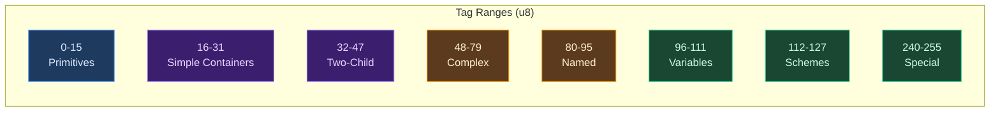

# Type Representation

## What Is Type Representation?

Every type checker needs a way to represent types — the internal data structure that answers questions like "is this an integer?", "does this function take two arguments?", "are these two types the same?". The choice of representation determines how fast these questions can be answered, how much memory the type checker uses, and how well it integrates with caching and incremental compilation.

This choice matters more than it might seem. A type checker performs millions of type comparisons during inference: every time a function is called, every time an operator is applied, every time a pattern is matched, the checker compares types. The representation's equality check is in the innermost loop of the most expensive compilation phase.

Compilers have converged on two broad approaches, each with clear tradeoffs.

### Recursive Enum Trees

The most direct representation is a recursive enum, where each type variant owns its children:

```rust
enum Type {
    Int,
    Str,
    List(Box<Type>),
    Map(Box<Type>, Box<Type>),
    Function(Vec<Type>, Box<Type>),
    Struct { name: String, fields: Vec<(String, Type)> },
    Var(u32),  // Unresolved type variable
}
```

This is simple to build, simple to pattern-match, and directly mirrors the source-level type syntax. Most educational compilers and many production compilers start here. The problems emerge at scale: comparing two `Function(Vec<Type>, Box<Type>)` values for equality requires recursively comparing every parameter type and the return type. Hashing a type for use in a hash map requires traversing the entire structure. And identical types — say, `[int]` — may exist as thousands of separate heap allocations.

### Interned Pool Representations

The alternative is **interning**: store each unique type once in a pool, represent it everywhere as a small integer index, and use index equality as a proxy for structural equality.

```rust
struct TypeIdx(u32);

fn same_type(a: TypeIdx, b: TypeIdx) -> bool {
    a.0 == b.0  // O(1), not structural traversal
}
```

Two types with the same structure always receive the same index, so comparing them is a single integer comparison. The pool deduplicates automatically — constructing `list(int)` twice returns the same index both times.

The cost is indirection: inspecting a type requires a pool lookup (`pool[idx]`), and constructing a type requires hashing its structure to check for duplicates. But for type checkers, where comparison vastly outnumbers construction, this tradeoff is overwhelmingly favorable.

## Ori's Type Representation

Ori uses a pool-based design with a distinctive tag-driven architecture. Types are represented at two levels: `TypeId` in the parser (a lightweight index for parsed type annotations) and `Idx` in the type checker (the full interned type handle). Both share the same primitive indices for seamless bridging.

### TypeId — Parser-Level Type Handle

The parser produces `TypeId(u32)` values for type annotations in source code. `TypeId` knows about 12 primitive types and two special markers, but nothing about compound types — those are the type checker's responsibility:

| Index | Constant | Type |
|-------|----------|------|
| 0 | `INT` | 64-bit signed integer |
| 1 | `FLOAT` | IEEE 754 double |
| 2 | `BOOL` | Boolean |
| 3 | `STR` | UTF-8 string |
| 4 | `CHAR` | Unicode scalar value |
| 5 | `BYTE` | 8-bit unsigned |
| 6 | `UNIT` | Unit type `()` |
| 7 | `NEVER` | Bottom type |
| 8 | `ERROR` | Poison type (error recovery) |
| 9 | `DURATION` | Time duration |
| 10 | `SIZE` | Memory size |
| 11 | `ORDERING` | Comparison result |
| 12 | `INFER` | Inference placeholder (not stored in pool) |
| 13 | `SELF_TYPE` | Self in trait/impl contexts (not stored in pool) |

The `INFER` and `SELF_TYPE` markers are parser-level constructs that never enter the type pool. The bridge function `resolve_type_id()` maps `TypeId → Idx` — an identity mapping for primitives 0-11, followed by pool lookup for compound types starting at index 64 (`FIRST_DYNAMIC`).

### Idx — The Universal Type Handle

`Idx(u32)` is the type handle used throughout the type checker, evaluator, and code generator. It shares the same primitive layout as `TypeId` (indices 0-11 are identical), with a sentinel value and dynamic range:

```rust
pub struct Idx(u32);

impl Idx {
    pub const INT: Self = Self(0);
    pub const FLOAT: Self = Self(1);
    // ... through ORDERING = 11
    pub const FIRST_DYNAMIC: u32 = 64;
    pub const NONE: Self = Self(u32::MAX);  // Sentinel
}
```

Comparing a type to `int` is `idx == Idx::INT` — a single integer comparison, no pool access needed. This matters because primitive type checks are among the most frequent operations in inference.

### Tag — Type Kind Discriminant

Each type in the pool has a `Tag(u8)` that identifies its kind. Tags are organized into ranges, where the range determines how the tag's companion `data` field is interpreted:



The range-based organization enables fast category checks: `tag < 16` means primitive, `16 <= tag < 48` means container, `96 <= tag < 112` means type variable. These are single integer comparisons — no match expression, no hash lookup.

**Primitives (0-15)** — `data` is unused (always 0):
`Int=0  Float=1  Bool=2  Str=3  Char=4  Byte=5  Unit=6  Never=7  Error=8  Duration=9  Size=10  Ordering=11`

**Simple containers (16-31)** — `data` is the child `Idx`:
`List=16  Option=17  Set=18  Channel=19  Range=20  Iterator=21  DoubleEndedIterator=22`

**Two-child containers (32-47)** — `data` is an index into the `extra` array (2 consecutive entries):
`Map=32  Result=33  Borrowed=34`

**Complex types (48-79)** — `data` is an index into `extra` with a length prefix:
`Function=48  Tuple=49  Struct=50  Enum=51`

**Named types (80-95)** — `data` is an index into `extra`:
`Named=80  Applied=81  Alias=82`

**Type variables (96-111)** — `data` is a variable ID indexing `var_states`:
`Var=96  BoundVar=97  RigidVar=98`

**Type schemes (112-127)** — `data` is an index into `extra`:
`Scheme=112`

**Special (240-255)** — compiler-internal markers:
`Projection=240  ModuleNs=241  Infer=254  SelfType=255`

### Item — The 5-Byte Type Entry

Each type in the pool is stored as an `Item` — a compact pair of tag and data:

```rust
#[repr(C)]
pub struct Item {
    pub tag: Tag,   // 1 byte — which kind of type
    pub data: u32,  // 4 bytes — interpretation depends on tag
}
```

Logically 5 bytes, padded to 8 by Rust's alignment rules. The `data` field's meaning is entirely determined by the tag's range — a design that trades type safety for compactness. A simple container's `data` is a child `Idx`. A complex type's `data` is an offset into the `extra` array. A type variable's `data` is a variable ID.

This encoding means the pool's `items: Vec<Item>` is a contiguous array of 8-byte entries — compact enough that the entire type pool for a typical file fits in L2 cache.

### Pool — Unified Type Storage

The `Pool` is the central data structure of the type checker. All types, variables, and metadata live here:

```rust
pub struct Pool {
    items: Vec<Item>,                    // Type entries (parallel arrays below)
    flags: Vec<TypeFlags>,               // Pre-computed metadata
    hashes: Vec<u64>,                    // Stable Merkle hashes
    extra: Vec<u32>,                     // Variable-length data
    intern_map: FxHashMap<u64, Idx>,     // Deduplication by hash
    resolutions: FxHashMap<Idx, Idx>,    // Named type → concrete type
    var_states: Vec<VarState>,           // Type variable state
    next_var_id: u32,                    // Fresh variable counter
}
```

The pool uses **Merkle hashing** for interning: each type's hash is computed from its tag, data, and the hashes of its children (recursively). This means `list(int)` always produces the same hash regardless of when it's constructed, and the `intern_map` can detect duplicates in O(1) amortized time.

**Initialization**: `Pool::new()` pre-interns 12 primitives at fixed indices 0-11 and pads to `FIRST_DYNAMIC` (64). This guarantees that `Idx::INT`, `Idx::STR`, etc. are valid indices without any construction.

### Extra Array — Variable-Length Data

Complex types store their variable-length data (parameter lists, field lists, variant lists) in the shared `extra: Vec<u32>` array. The `data` field in `Item` points to the start position:

| Type | Extra Layout |
|------|-------------|
| `Function` | `[param_count, p0, p1, ..., return_type]` |
| `Tuple` | `[elem_count, e0, e1, ...]` |
| `Struct` | `[name_lo, name_hi, field_count, f0_name, f0_type, ...]` |
| `Enum` | `[name_lo, name_hi, variant_count, v0_name, v0_field_count, ...]` |
| `Named` | `[name_lo, name_hi]` |
| `Applied` | `[name_lo, name_hi, arg_count, arg0, arg1, ...]` |
| `Scheme` | `[var_count, var0, var1, ..., body_type]` |
| `Map`/`Result` | `[child0, child1]` |

This shared-array design avoids per-type heap allocations for parameter lists and field lists. A function type with 3 parameters occupies 5 entries in `extra` (`[3, p0, p1, p2, ret]`) — no `Vec`, no `Box`, no separate allocation.

### Type Variables and Unification

Type variables (tags `Var`, `BoundVar`, `RigidVar`) use the `var_states` array to track their state during inference:

```rust
pub enum VarState {
    Unbound { id: u32, rank: Rank, name: Option<Name> },
    Link { target: Idx },
    Rigid { name: Name },
    Generalized { id: u32, name: Option<Name> },
}
```

Unification links variables by setting `VarState::Link { target }`. The `resolve()` method follows link chains to the final target, with path compression to amortize future lookups — the classic union-find optimization.

### TypeFlags — O(1) Property Queries

`TypeFlags` is a 32-bit bitfield computed once when a type is interned. Flags propagate from children to parents via bitwise OR during construction:

```text
Bits 0-7:   Presence    — HAS_VAR, HAS_ERROR, HAS_INFER, HAS_SELF, ...
Bits 8-15:  Category    — IS_PRIMITIVE, IS_CONTAINER, IS_FUNCTION, ...
Bits 16-23: Optimization — NEEDS_SUBST, IS_RESOLVED, IS_MONO, IS_COPYABLE
Bits 24-31: Capability  — HAS_CAPABILITY, IS_PURE, HAS_IO, HAS_ASYNC
```

The propagation rule is: when constructing `list(T)`, the list's flags include `T`'s flags (via OR) plus the list's own category flags. This means checking whether a deeply nested type like `[[Option<Result<T, E>>]]` contains any unresolved type variables is a single bitwise AND: `flags.contains(HAS_VAR)`. No traversal needed, regardless of nesting depth.

This pattern comes directly from [rustc's `TypeFlags`](https://github.com/rust-lang/rust/blob/master/compiler/rustc_type_ir/src/flags.rs), which uses the same propagation strategy for the same reason.

### Type Construction and Queries

The pool provides typed builder methods for construction and O(1) accessors for queries:

```rust
impl Pool {
    // Construction — all return interned, deduplicated Idx
    pub fn list(&mut self, elem: Idx) -> Idx { ... }
    pub fn map(&mut self, key: Idx, value: Idx) -> Idx { ... }
    pub fn function(&mut self, params: &[Idx], ret: Idx) -> Idx { ... }
    pub fn struct_type(&mut self, name: Name, fields: &[(Name, Idx)]) -> Idx { ... }
    pub fn fresh_var(&mut self) -> Idx { ... }

    // Queries — O(1) via direct indexing
    pub fn tag(&self, idx: Idx) -> Tag { ... }
    pub fn flags(&self, idx: Idx) -> TypeFlags { ... }
    pub fn list_elem(&self, idx: Idx) -> Idx { ... }
    pub fn function_params(&self, idx: Idx) -> &[u32] { ... }
    pub fn resolve(&self, idx: Idx) -> Idx { ... }
}
```

Type display for error messages (`pool.format(idx)`) resolves `Idx` values to human-readable strings like `[int]`, `{str: int}`, `(int, int) -> bool`, using the `StringLookup` trait to resolve interned `Name` values.

## Design Tradeoffs

### Pool-per-File

Each source file gets its own `Pool`. Types from different files are bridged via **Merkle hash lookup** — when importing a function from module B, the type checker computes the Merkle hash of the function's type in module B's pool and looks it up in module A's pool. If the hash matches, the existing `Idx` is reused; otherwise, the type is re-interned into module A's pool.

This per-file isolation simplifies incremental compilation (changing file A doesn't invalidate file B's pool) but means that the same type can have different `Idx` values in different pools. Cross-pool comparisons must always go through the hash-based bridge, not raw `Idx` equality.

### Tag Safety vs Compactness

The `Item { tag, data }` encoding packs maximum information into 5 bytes, but the `data` field's meaning is determined entirely by the tag — a `data` value of `42` could be a child `Idx`, an `extra` offset, or a variable ID depending on the tag. Misinterpreting the data field is a logic bug that the type system can't catch.

In practice, this is safe because all access goes through typed accessor methods (`list_elem()`, `function_params()`, `var_state()`) that check the tag before interpreting the data. The compactness benefit — the entire type pool fitting in cache — justifies the loss of static type safety on the internal representation.

### No Shrinking

Like the expression arena, the type pool only grows. Type entries are never deleted. This is acceptable because pools are per-file and per-session — the pool is dropped when the file's compilation results are invalidated, reclaiming all memory at once.

## Prior Art

### Zig — InternPool

[Zig's `InternPool`](https://github.com/ziglang/zig/blob/master/src/InternPool.zig) is the most direct influence on Ori's Pool design. Zig unifies type interning, string interning, and value interning into a single flat storage with tag-driven dispatch and an `extra` array for variable-length data. The structural similarity is deliberate: both systems use a `(tag, data)` pair as the core entry format, both use a shared `extra` array for complex types, and both use hash-based deduplication. Zig's design demonstrated that this architecture scales to a production compiler handling millions of types.

### rustc — TyKind and TypeFlags

[Rust's compiler](https://github.com/rust-lang/rust) represents types via [`TyKind`](https://github.com/rust-lang/rust/blob/master/compiler/rustc_type_ir/src/ty_kind.rs), an enum with variants for every type kind, interned through a thread-local context. rustc's [`TypeFlags`](https://github.com/rust-lang/rust/blob/master/compiler/rustc_type_ir/src/flags.rs) — pre-computed bitflags propagated via OR during construction — directly inspired Ori's `TypeFlags`. The flag categories (presence, structural, optimization) and the propagation strategy are essentially identical.

### GHC — Unique-Based Interning

[GHC](https://gitlab.haskell.org/ghc/ghc) (the Glasgow Haskell Compiler) uses a `Unique` identifier for type interning. Each type constructor and type variable gets a globally unique integer, enabling O(1) comparison. GHC's approach is more fine-grained than Ori's pool-based interning — individual type constructors are unique, but compound types may still require structural comparison. Ori's pool-level interning goes further by making even compound types like `(int, int) -> bool` comparable by index.

### Lean 4 — IRType for ARC Classification

[Lean 4](https://github.com/leanprover/lean4)'s `IRType` classifies types for ARC analysis into categories similar to Ori's `ArcClass` (scalar vs. reference). Lean's type classification is simpler than Ori's `Tag` ranges — it primarily distinguishes between types that need reference counting and types that don't — but the underlying insight is the same: compact type metadata enables fast dispatch in the code generator without full type analysis.

## Related Documents

- [Pool Architecture](../05-type-system/pool-architecture.md) — Detailed pool internals and advanced operations
- [Type Inference](../05-type-system/type-inference.md) — How types are inferred using the pool
- [Unification](../05-type-system/unification.md) — How type variables are resolved
- [String Interning](string-interning.md) — The complementary interning strategy for identifiers
- [IR Overview](index.md) — How the type pool fits into the three-tier IR pipeline
