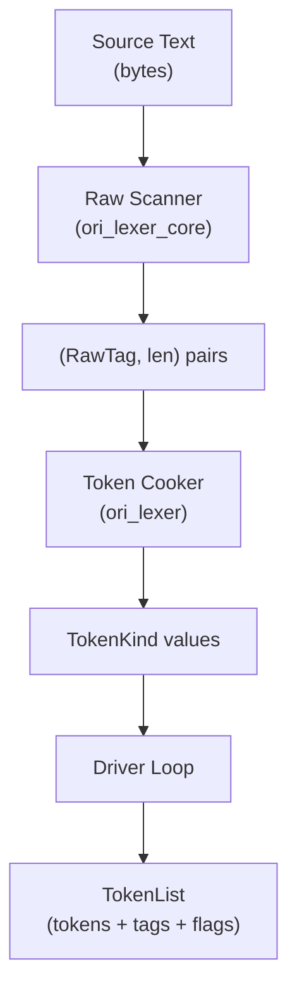

# Lexer Overview

The Ori lexer converts source text into a stream of tokens. It uses a **two-layer architecture** inspired by `rustc_lexer` / `rustc_parse::lexer`: a raw scanner that operates on bytes with zero dependencies, and a cooking layer that transforms raw tokens into compiler-ready `TokenKind` values with interning, keyword resolution, and diagnostics.

## What Makes Ori's Lexer Distinctive

### Two-Layer Architecture

Most lexers are monolithic — one pass that does everything from byte scanning to keyword resolution. Ori separates these concerns into two crates with different dependency profiles:



- **`ori_lexer_core`** — Zero `ori_*` dependencies. Pure byte-level state machine. Can be consumed by external tools (syntax highlighters, editor plugins) without pulling in the compiler.
- **`ori_lexer`** — Depends on `ori_ir` for `Token`, `TokenKind`, `Span`, `TokenList`, `StringInterner`. Handles keyword resolution, interning, escape processing, numeric parsing, and diagnostics.

This separation means the raw scanner can be benchmarked and optimized independently of the cooking layer.

### SIMD-Accelerated String Scanning

The raw scanner uses 16-byte SIMD chunks to find string and template delimiters in parallel:
- `skip_to_string_delim()` — finds `"`, `\`, `\r`, `\n`, or NUL
- `skip_to_template_delim()` — finds `` ` ``, `{`, `}`, `\`, or NUL

Falls back to byte-by-byte scanning for the tail when fewer than 16 bytes remain.

### First-Class Template Literals

Template literals (`` `hello {name}` ``) are a lexer-level concept, not a parser desugar. The raw scanner maintains a stack of `InterpolationDepth` structs to track nested parentheses, brackets, and braces within interpolations — enabling expressions like `{map[key]}` or `{fn(a, b)}` inside templates.

Four token types (`TemplateHead`, `TemplateMiddle`, `TemplateTail`, `TemplateFull`) let the parser handle interpolation without special modes. Format specs (`:>10.2f`) are detected when a `:` appears at the top level of an interpolation.

### Cross-Language Error Detection

The lexer recognizes common patterns from other languages and provides targeted suggestions:

| Pattern | Suggestion |
|---------|------------|
| `;` | "Semicolons are required only when an expression/item doesn't end with `}`" |
| `===` | "Use `==` for equality" |
| `++` / `--` | "Use `x += 1` / `x -= 1`" |
| Unicode confusables | "Did you mean ASCII `X`?" (full-width chars, Unicode minus, etc.) |

Errors follow a WHERE+WHAT+WHY+HOW structure: span, error kind, surrounding context, and concrete fix suggestions.

### Duration and Size Literals

The lexer natively handles time and memory literals with compile-time exact-representation checks:

```
100ms → Duration(100, Milliseconds)    4kb  → Size(4, Kilobytes)
1.5s  → Duration(1_500_000_000, Nanoseconds)   1.5kb → Size(1500, Bytes)
```

Decimal values like `1.5s` are converted to the largest base unit that represents the value exactly using integer arithmetic. If the result isn't exact (e.g., `1.5ns`), a `DecimalNotRepresentable` error is emitted.

### Greater-Than Token Splitting

The lexer produces individual `>` tokens, never `>>` or `>=` as single tokens. The parser synthesizes compound operators from adjacent tokens in expression context. This enables the type parser to handle nested generics (`Result<Result<int, str>, str>`) without special lexer modes — the same approach used by Rust and Swift.

## Performance

### Benchmark Results

Throughput measured via Criterion on generated Ori source (simple function declarations):

| Layer | Throughput | What It Measures |
|-------|-----------|-----------------|
| Raw scanner (`ori_lexer_core`) | ~750–770 MiB/s | Pure byte scanning — no interning, no keywords, no diagnostics |
| Cooked lexer (`ori_lexer`) | ~250–270 MiB/s | Full tokenization — keyword resolution, interning, escape processing |

The ~3x gap between raw and cooked reflects the cost of string interning and keyword resolution. The raw scanner throughput is competitive with other published lexer benchmarks (`rustc_lexer`, Zig, Go).

### Running Benchmarks

```bash
# Raw scanner throughput (ori_lexer_core only)
cargo bench -p oric --bench lexer_core -- "raw/throughput"

# Cooked lexer throughput (full pipeline)
cargo bench -p oric --bench lexer -- "raw/throughput"

# Realistic file sizes (1KB / 10KB / 50KB)
cargo bench -p oric --bench lexer -- "raw/realistic"

# Salsa query overhead (cached vs uncached)
cargo bench -p oric --bench lexer -- "incremental"

# Run sequentially — CPU contention skews throughput results
```

### Performance Techniques

- **Sentinel byte** — A NUL byte appended to the source buffer eliminates bounds checks during scanning
- **Pre-allocation** — Buffer sizes estimated from source length (`tokens: source_len / 2 + 1`, `newlines: source_len / 40`)
- **`#[inline]` on hot paths** — All cross-crate hot functions (cooker helpers, keyword pre-filters, span construction) are `#[inline]` for call-chain optimization across crate boundaries
- **Fast-path escapes** — Strings with no backslashes are interned directly from the source slice without allocation
- **Length-bucketed keywords** — Keyword lookup filters by identifier length and first byte before string comparison, eliminating >99% of identifiers without hashing

## Raw Scanner

The raw scanner (`ori_lexer_core::RawScanner`) produces `(RawTag, len)` pairs. It operates entirely on the stack with no allocations.

```rust
#[repr(u8)]
pub enum RawTag {
    Ident, Int, Float, HexInt, BinInt, String, Char, Duration, Size,
    TemplateHead, TemplateMiddle, TemplateTail, TemplateComplete, FormatSpec,
    Plus, Minus, Star, Slash, /* ... ~80 variants total ... */
    Whitespace, Newline, LineComment,
    InvalidByte, UnterminatedString, UnterminatedTemplate,
    Eof,
}
```

The scanner sees identifiers and keywords identically (`RawTag::Ident`) — keyword resolution happens in the cooking layer.

## Cooking Layer

The cooking layer (`ori_lexer::TokenCooker`) transforms `(RawTag, len)` pairs into `TokenKind` values:

```
RawTag::Ident + "cache" → keyword lookup → TokenKind::Cache (if followed by `(`)
RawTag::Ident + "cache" → keyword lookup → TokenKind::Ident(Name) (otherwise)
RawTag::String + slice   → unescape → intern → TokenKind::String(Name)
RawTag::Int + "1_000"    → parse → TokenKind::Int(1000)
```

### Context-Sensitive Keywords

Six pattern keywords are only recognized when immediately followed by `(`:

```
cache, catch, parallel, recurse, spawn, timeout
```

Resolution uses a three-stage filter: length + first byte → string match → lookahead (skips horizontal whitespace but NOT newlines, checks for `(`). Resolved soft keywords have the `CONTEXTUAL_KW` flag set in `TokenFlags`.

### Escape Processing

Escape rules are **spec-strict** and differ by context:

| Context | Valid Escapes | Invalid |
|---------|--------------|---------|
| String (`"..."`) | `\"` `\\` `\n` `\t` `\r` `\0` | `\'` (specific error) |
| Char (`'...'`) | `\'` `\\` `\n` `\t` `\r` `\0` | `\"` (specific error) |
| Template (`` `...` ``) | `` \` `` `\\` `\n` `\t` `\r` `\0` `{{` `}}` | — |

Each context has a dedicated unescape function. A **fast path** detects when no escapes are present and directly interns the source slice, avoiding allocation.

## TokenList Structure

`TokenList` uses three parallel arrays for cache-friendly access patterns:

```rust
pub struct TokenList {
    tokens: Vec<Token>,         // Token = { kind: TokenKind, span: Span }
    tags: Vec<u8>,              // discriminant tag per token (O(1) kind checks)
    flags: Vec<TokenFlags>,     // per-token metadata
}
```

The `tags` array enables O(1) kind checks without pattern matching on the full `TokenKind` enum — the parser's `check()` and `at()` methods run on every token.

**Salsa early cutoff**: `TokenList` has custom `Eq`/`Hash` that compare `TokenKind` values and `TokenFlags` but ignore `Span` positions. Whitespace-only edits produce equal `TokenList` values, so downstream queries skip re-execution.

## Entry Points

All three entry points share the same driver loop — there is only one lexing implementation:

| Entry Point | Returns | Used By |
|-------------|---------|---------|
| `lex()` | `TokenList` | Parser |
| `lex_full()` | `TokenList` + errors | Parsing pipeline |
| `lex_with_comments()` | `TokenList` + errors + comments + blank lines + warnings | Formatter, LSP |

## Salsa Integration

A three-level Salsa query hierarchy exposes the lexer:

```rust
#[salsa::tracked]
pub fn tokens_with_metadata(db: &dyn Db, file: SourceFile) -> LexOutput { ... }

#[salsa::tracked]
pub fn lex_result(db: &dyn Db, file: SourceFile) -> LexResult { ... }

#[salsa::tracked]
pub fn tokens(db: &dyn Db, file: SourceFile) -> TokenList { ... }

#[salsa::tracked]
pub fn lex_errors(db: &dyn Db, file: SourceFile) -> Vec<LexError> { ... }
```

Each level strips metadata from the one above, enabling consumers to depend on only what they need. The parser depends on `tokens()`, so formatting-only changes (comments, whitespace) don't trigger re-parsing.

## Related Documents

- [Token Design](token-design.md) — Token types, flags, and metadata
- [Architecture: Pipeline](../01-architecture/pipeline.md) — Pipeline overview
