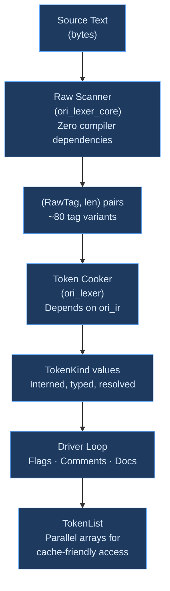
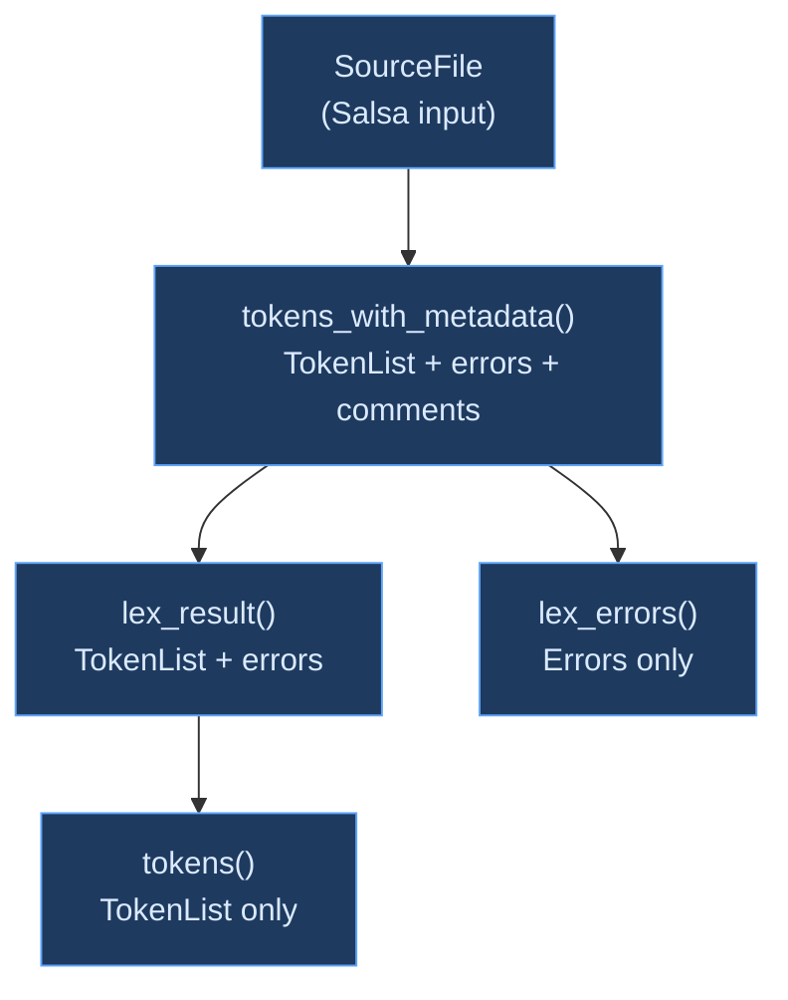

# Lexical Analysis

## What Is Lexical Analysis?

**Lexical analysis** (or **lexing**, or **tokenization**) is the first phase of compilation. It takes a flat stream of characters — the source file as raw text — and groups them into meaningful chunks called **tokens**. Each token represents the smallest unit of meaning in the language: a keyword, an identifier, a number, an operator, a delimiter.

```ori
@add (x: int, y: int) -> int = x + y
```

The lexer transforms this into a sequence of tokens:

| Source | Token |
|--------|-------|
| `@` | At |
| `add` | Ident("add") |
| `(` | LParen |
| `x` | Ident("x") |
| `:` | Colon |
| `int` | IntType |
| `,` | Comma |
| `y` | Ident("y") |
| `:` | Colon |
| `int` | IntType |
| `)` | RParen |
| `->` | Arrow |
| `int` | IntType |
| `=` | Eq |
| `x` | Ident("x") |
| `+` | Plus |
| `y` | Ident("y") |

The lexer's job seems simple — pattern matching on characters — but it handles a surprising amount of complexity: Unicode, escape sequences, nested interpolation, context-sensitive keywords, error recovery, and cross-language diagnostics. Getting lexing right means the parser never has to think about character-level concerns, and getting it fast means the entire compiler pipeline starts from a solid foundation.

Historically, lexers were generated from regular expression specifications. Tools like `lex` (1975) and its descendant `flex` let compiler writers specify token patterns as regular expressions and automatically generated finite automata to recognize them. Modern compilers have largely moved to hand-written lexers for three reasons: better error messages, higher performance, and the ability to handle context-sensitive constructs that regular expressions cannot express.

## Why Tokenize?

### Separation of Concerns

Without a lexer, the parser would have to handle character-level concerns alongside grammatical structure. It would need to recognize that `let` is a keyword while `letter` is an identifier, handle whitespace and comments, process escape sequences in strings, and detect malformed numeric literals — all while simultaneously tracking grammatical context like operator precedence and nesting depth.

Separating these concerns is the oldest idea in compiler design. The lexer handles the **lexical grammar** (what sequences of characters form valid tokens), while the parser handles the **syntactic grammar** (how tokens combine into valid programs). Each phase has a simpler job, can be tested independently, and can be optimized for its specific workload.

### Performance

Lexing is inherently a streaming, byte-by-byte operation. Specialized data structures and techniques — lookup tables, SIMD scanning, sentinel termination — can push lexer throughput close to memory bandwidth. A well-optimized lexer processes source text at hundreds of megabytes per second, ensuring that tokenization is never the bottleneck in compilation.

By contrast, parsing involves recursive structures, backtracking, and complex state. Running these operations at the character level would be far slower than running them on a pre-tokenized stream. The lexer pre-computes the work that the parser would otherwise repeat on every token access.

### Error Localization

A dedicated lexer can detect and report character-level errors with precision: unterminated strings, invalid escape sequences, malformed numbers, unexpected characters. These errors are reported with exact source positions before the parser ever sees the token stream, keeping error messages specific and actionable.

## Classical Approaches to Lexing

### Generated Lexers (DFA-Based)

The textbook approach converts regular expression patterns into a **deterministic finite automaton** (DFA). Each state in the automaton represents progress through a pattern, and each input character triggers a transition. When the automaton reaches an accepting state, a token has been recognized.

Tools like `lex`, `flex`, [re2c](https://re2c.org/), and [ANTLR](https://www.antlr.org/) automate this process. The compiler writer specifies patterns; the tool generates the state machine. The resulting lexer is fast (a single table lookup per character) and correct by construction (the DFA is mathematically equivalent to the regular expressions).

The limitation is **error handling and context sensitivity**. DFA-based lexers produce opaque state machines that are difficult to augment with custom error messages, recovery strategies, or context-dependent behavior. When a generated lexer encounters invalid input, its error is typically "unexpected character at position N" — unhelpful for a user who typed `===` expecting JavaScript semantics.

### Hand-Written Lexers

Most production compilers use hand-written lexers. [Rust](https://github.com/rust-lang/rust) (`rustc_lexer`), [Go](https://github.com/golang/go) (`go/scanner`), [Zig](https://github.com/ziglang/zig) (`Tokenizer`), [TypeScript](https://github.com/microsoft/TypeScript) (`scanner.ts`), and [Clang](https://github.com/llvm/llvm-project) all have hand-written lexers. The main advantage is control: every error message, every context-sensitive decision, every recovery strategy is explicit code that the compiler writer can read, debug, and optimize.

The disadvantage is that hand-written lexers can be harder to verify against a grammar specification. A DFA generated from a regular expression is correct by construction; a hand-written lexer must be tested against the spec.

### Two-Layer Lexers

Some compilers split lexing into two phases. [Rust's lexer](https://github.com/rust-lang/rust/tree/master/compiler/rustc_lexer) pioneered this in its modern form: `rustc_lexer` is a zero-dependency crate that produces raw token classifications and lengths, while `rustc_parse::lexer` "cooks" these raw tokens into the full `Token` type with keyword resolution, interning, and diagnostics.

The motivation is **reusability**. The raw layer has no compiler dependencies and can be used by external tools — syntax highlighters, formatters, editor plugins — without pulling in the full compiler. The cooking layer adds compiler-specific concerns: interning identifiers into a global table, resolving keywords, processing escape sequences into values.

This separation also enables independent optimization. The raw layer can be benchmarked and tuned for pure byte throughput without worrying about interner contention or diagnostic allocation. The cooking layer can be optimized for the specific patterns of its domain (most tokens are keywords or short identifiers) without complicating the low-level scanner.

### Incremental Lexers

IDE-oriented compilers need lexers that can efficiently re-tokenize after small edits. Rather than re-lexing the entire file when a user types a character, an **incremental lexer** identifies the affected region and re-tokenizes only that portion.

[Tree-sitter](https://tree-sitter.github.io/tree-sitter/) and [Roslyn](https://github.com/dotnet/roslyn) use incremental approaches. The complexity is significant: token boundaries can shift when characters are inserted or deleted, and context-sensitive constructs (like string delimiters) can change the interpretation of distant tokens.

Ori does not use an incremental lexer. Instead, it relies on Salsa's query-level caching: if re-lexing a file produces the same `TokenList` (ignoring span positions), downstream queries skip re-execution. This provides file-level incrementality without token-level complexity.

## What Makes Ori's Lexer Distinctive

### Two-Layer Architecture

Ori follows Rust's two-layer model, split across two crates with different dependency profiles:



- **`ori_lexer_core`** — Zero `ori_*` dependencies. Pure byte-level state machine. Produces `(RawTag, len)` pairs with no heap allocation (except a small stack for template nesting). Can be consumed by syntax highlighters, editor plugins, and linting tools without pulling in the compiler. Benchmarks at ~750-1000 MiB/s.

- **`ori_lexer`** — Depends on `ori_ir` for `Token`, `TokenKind`, `Span`, `TokenList`, and `StringInterner`. Handles keyword resolution, string interning, escape processing, numeric literal parsing, and diagnostic generation. Benchmarks at ~210-270 MiB/s.

The ~3x gap between raw and cooked throughput reflects the cost of interning and keyword resolution — operations that require hash table access and string comparison. The raw scanner's throughput is competitive with published lexer benchmarks from [Rust](https://github.com/rust-lang/rust), [Zig](https://github.com/ziglang/zig), and [Go](https://github.com/golang/go).

### First-Class Template Literals

Many languages handle string interpolation as parser-level or even runtime-level concerns. JavaScript's template literals, for example, are lexed as a single token type and parsed with special rules. Python's f-strings required significant parser changes.

Ori treats template literals as a **lexer-level concept** with dedicated token types. The raw scanner maintains a stack of `InterpolationDepth` structs to track nesting inside interpolated expressions — enabling arbitrarily complex expressions like `{map[key]}` or `{fn(a, b)}` inside templates.

```text
Source:    `Hello {name}, you have {items.count()} items`

Tokens:    TemplateHead("Hello ")
           Ident(name)
           TemplateMiddle(", you have ")
           Ident(items)  Dot  Ident(count)  LParen  RParen
           TemplateTail(" items")
```

Four token types (`TemplateHead`, `TemplateMiddle`, `TemplateTail`, `TemplateFull`) let the parser handle interpolation without special modes or state. Format specs (`:>10.2f`) are detected when a `:` appears at the interpolation's top nesting level, emitting a separate `FormatSpec` token.

### Greater-Than Token Splitting

The lexer produces individual `>` tokens, never `>>` (right shift) or `>=` (greater-equal) as compound tokens. The parser synthesizes these operators from adjacent tokens in expression context. This is the same strategy used by [Rust](https://github.com/rust-lang/rust) and [Swift](https://github.com/apple/swift).

The motivation is **generic syntax**: `Result<Result<int, str>, str>` ends with two `>` tokens that close two generic parameter lists. If the lexer produced `>>` as a single token, it would need to understand type syntax to distinguish `>>` (shift) from `> >` (two closing brackets). By producing individual `>` tokens, the lexer stays context-free and the parser handles disambiguation.

```text
Type context:    Result<Option<int>, str>
                                  ^  ^--- two separate Gt tokens

Expression:      x >> 2
                   ^^--- two adjacent Gt tokens, parser synthesizes Shr
```

Adjacency is determined by span endpoints: `tokens[i].span.end == tokens[i+1].span.start`. The `ADJACENT` flag in `TokenFlags` provides this information directly.

### Cross-Language Error Detection

The lexer recognizes patterns from other languages and provides targeted migration hints:

| Pattern | What Users Expect | Ori's Suggestion |
|---------|-------------------|------------------|
| `===` | JavaScript strict equality | "Use `==` for equality" |
| `++` / `--` | C/JavaScript increment/decrement | "Use `x += 1` / `x -= 1`" |
| `;` (misplaced) | Statement terminator | "Semicolons are required only after expressions/items that don't end with `}`" |
| Unicode confusables | Copy-paste from documentation | "Did you mean ASCII `X`?" (detects Cyrillic, Greek, full-width characters) |

Errors follow a WHERE+WHAT+WHY+HOW structure: source span, error classification, contextual explanation, and concrete fix suggestion. This is particularly valuable for Ori because its syntax borrows from multiple language traditions — users coming from JavaScript, Python, Rust, or Haskell each bring different assumptions about semicolons, operators, and string syntax.

### Duration and Size Literals

Ori natively handles time and memory size literals at the lexer level, with compile-time exact-representation checks:

```text
100ms → Duration(100, Milliseconds)       4kb  → Size(4, Kilobytes)
1.5s  → Duration(1_500_000_000, Nanoseconds)   1.5kb → Size(1500, Bytes)
```

Decimal values like `1.5s` are converted to the largest base unit that represents the value exactly using integer arithmetic — no floating-point involved. If the result cannot be represented exactly (e.g., `1.5ns` — half a nanosecond isn't possible), a `DecimalNotRepresentable` error is emitted at lex time rather than silently losing precision.

### Sentinel-Terminated Scanning

The raw scanner appends a NUL byte sentinel to the source buffer, rounded up to a 64-byte cache-line boundary. This eliminates bounds checks on every `peek()` and `peek2()` call — the sentinel guarantees that reads past the end of the source return a known value (0x00, which matches no valid token start) rather than requiring an index comparison.

On x86_64, the scanner also prefetches the first 256 bytes (4 cache lines) of the source buffer on construction, warming the L1 cache for the initial scanning burst.

## The Raw Scanner

The raw scanner (`ori_lexer_core::RawScanner`) produces `(RawTag, len)` pairs from source bytes. It operates entirely on the stack with no heap allocation — except for a small `Vec<InterpolationDepth>` that tracks template literal nesting depth.

### Dispatch Architecture

The main loop dispatches on the current byte:

```text
0x00                → EOF (sentinel hit)
' ' | '\t'          → whitespace (skip)
'\n' | '\r'         → newline
'a'-'z' | 'A'-'Z'  → identifier (keywords resolved later)
'_'                 → underscore or identifier prefix
'0'-'9'             → numeric literal (decimal, hex, binary, float)
'"'                 → string literal
'\''                → char literal
'`'                 → template literal
'/'                 → slash or line comment
'+' '-' '*' ...     → operators (single/multi-char)
'(' ')' '{' ...     → delimiters
0x80-0xFF           → UTF-8 multi-byte (identifier or invalid)
```

Each arm is a dedicated scanning function. The `RawTag` enum has approximately 80 variants covering all token types, including error variants like `InvalidByte`, `UnterminatedString`, and `UnterminatedTemplate`. The scanner sees identifiers and keywords identically as `RawTag::Ident` — keyword resolution is deferred to the cooking layer.

### Identifier Scanning

Identifiers use a 256-entry lookup table (`IS_IDENT_CONTINUE_TABLE`) for continuation bytes. Each iteration reads the current byte, indexes into the table (a single array lookup — no branch), and advances if the byte is a valid identifier continuation character. This is faster than range checking (`b'a'..=b'z' | b'A'..=b'Z' | b'0'..=b'9' | b'_'`) because it avoids branch misprediction on the multiple ranges.

### Numeric Literals

The raw scanner classifies numeric literals without parsing their values:

```text
[0-9]+                    → RawTag::Int     (decimal)
0x[0-9a-fA-F_]+           → RawTag::HexInt  (hexadecimal)
0b[01_]+                  → RawTag::BinInt  (binary)
[0-9]+.[0-9]+([eE]...)?   → RawTag::Float   (floating-point)
[0-9]+(ns|us|ms|s|m|h)    → RawTag::Duration
[0-9]+(b|kb|mb|gb|tb)     → RawTag::Size
```

Value parsing (stripping underscores, computing values, checking overflow) happens in the cooking layer. The raw scanner only determines the category and length.

### Template Literal State Machine

Template scanning is the most complex part of the raw scanner. When the scanner encounters a backtick, it enters template mode and tracks nesting depth inside interpolated expressions:

```rust
struct InterpolationDepth {
    brace: u32,    // Tracks { } nesting
    paren: u32,    // Tracks ( ) nesting
    bracket: u32,  // Tracks [ ] nesting
}
```

Inside an interpolation (`{...}`), the scanner increments counters on opening delimiters and decrements on closing ones. When a `}` is encountered with `brace == 0`, the interpolation has ended and the scanner returns to template text mode. This enables expressions like `{map[key]}` (where the `]` doesn't close the interpolation) and `{fn(a, b)}` (where the `)` doesn't close the interpolation).

A top-level `:` (when all nesting depths are zero) starts a format spec. This distinguishes `{value:>10}` (format spec) from `{map[key:value]}` (nested expression with colon).

## The Cooking Layer

The cooking layer (`ori_lexer::TokenCooker`) transforms each `(RawTag, len)` pair from the raw scanner into a `TokenKind` value, performing keyword resolution, interning, escape processing, and value parsing along the way.

### Keyword Resolution

Keywords are resolved from identifiers via a **length-bucketed lookup**. The cooker first checks the identifier's length and first byte — a constant-time filter that rejects >99% of identifiers without any string comparison:

```text
Step 1: Length filter
    "x"       → len 1 → no keywords of length 1 → stays Ident
    "result"  → len 6 → possible match → proceed

Step 2: First-byte filter
    "result"  → 'r' → possible: "return" → proceed
    "zebra"   → 'z' → no keywords start with 'z' at len 5 → stays Ident

Step 3: String comparison
    "result"  ≠ "return" → stays Ident
    "return"  = "return" → becomes TokenKind::Return
```

This three-stage pipeline avoids hash table lookups entirely. The first two stages are integer comparisons (length and byte value), and the third stage — string comparison — is reached only for the small fraction of identifiers that happen to share a length and first byte with a keyword.

### Context-Sensitive Keywords

Six keywords are only recognized when immediately followed by `(`:

```text
cache(    catch(    parallel(    recurse(    spawn(    timeout(
```

These are **pattern expression keywords** — they introduce expression forms that syntactically resemble function calls. Without the `(` lookahead, `cache` as a variable name would be incorrectly recognized as a keyword. The lookahead skips horizontal whitespace but not newlines, so `cache (` (with a space) is recognized but `cache\n(` (across lines) is not.

When a context-sensitive keyword is resolved, the `CONTEXTUAL_KW` flag is set in `TokenFlags`, allowing the parser to distinguish contextually-resolved keywords from reserved keywords.

### Identifier Cache

The cooking layer maintains a 256-entry direct-mapped cache for frequently seen identifiers:

```text
Hash:    (first_byte * 31) ^ last_byte ^ len
Slot:    hash & 0xFF

Cache hit:    return cached (Name, TokenKind) pair
Cache miss:   intern string, resolve keyword, update slot
```

The cache is approximately 10x cheaper than `FxHashMap` per lookup (verified by Callgrind profiling). Context-sensitive keywords bypass the cache because their resolution depends on lookahead context that may change between occurrences.

### Escape Processing

Escape rules are **spec-strict** and differ by context:

| Context | Valid Escapes | Context-Specific |
|---------|---------------|------------------|
| String (`"..."`) | `\"` `\\` `\n` `\t` `\r` `\0` | `\'` is an error: "use `'` directly" |
| Char (`'...'`) | `\'` `\\` `\n` `\t` `\r` `\0` | `\"` is an error: "use `"` directly" |
| Template (`` `...` ``) | `` \` `` `\\` `\n` `\t` `\r` `\0` `{{` `}}` | Brace escapes for literal `{` and `}` |

Each context has a dedicated unescape function (`unescape_string_v2`, `unescape_char_v2`, `unescape_template_v2`). A **fast path** detects strings with no backslashes and directly interns the source slice, avoiding allocation entirely — the common case for short identifiers and simple strings.

### Duration and Size Parsing

The cooker parses duration and size literals using **integer arithmetic only**. Decimal values are converted to the smallest exact base unit:

```text
1.5s  → split: integer=1, fraction="5", unit=Seconds
      → whole_nanos = 1 × 1_000_000_000 = 1_000_000_000
      → frac_nanos  = 5 × 1_000_000_000 / 10 = 500_000_000
      → total       = 1_500_000_000 nanoseconds
      → Duration(1_500_000_000, Nanoseconds)
```

If the fraction cannot be represented exactly (e.g., `1.5ns` — the base unit for nanoseconds is 1, and 0.5 nanoseconds isn't an integer), the cooker emits `DecimalNotRepresentable` rather than silently rounding.

## TokenList: The Lexer's Output

`TokenList` uses three parallel arrays for cache-friendly access patterns:

```rust
pub struct TokenList {
    tokens: Vec<Token>,         // Token = { kind: TokenKind, span: Span }
    tags: Vec<u8>,              // Discriminant tag per token (O(1) kind checks)
    flags: Vec<TokenFlags>,     // Per-token metadata (whitespace, errors, etc.)
}
```

### Why Parallel Arrays?

The parser's hot path — checking what kind of token comes next — accesses only the `tags` array. At 1 byte per token, the `tags` array is 16x more cache-dense than the `tokens` array (where each `Token` is 16 bytes: 8 for `TokenKind` + 8 for `Span`). A sequential scan through `tags` for the next keyword or delimiter touches far fewer cache lines than scanning through full `Token` structs.

This is a **Structure of Arrays** (SoA) layout — the same optimization used in game engines, database query engines, and scientific computing whenever different fields of a record have different access frequencies.

### Discriminant Tags

The `tags` array stores the `TokenKind` discriminant as a `u8`, enabling O(1) kind checks without pattern matching on the full `TokenKind` enum:

```text
Instead of:   match tokens[i].kind { TokenKind::Let => ..., TokenKind::If => ... }
Parser does:  if tags[i] == TAG_LET { ... } else if tags[i] == TAG_IF { ... }
```

This is particularly valuable for the parser's `check()` and `at()` methods, which run on every token during parsing. The `TokenSet` bitset (two `u128` values covering 256 possible tags) enables O(1) membership testing for token sets like "any keyword" or "any binary operator."

### Position-Independent Equality

`TokenList` has custom `Eq` and `Hash` implementations that compare token *kinds* and *flags* but ignore *spans*:

```text
"let  x = 1"  →  [Let, Ident(x), Eq, Int(1)]  spans: [0-3, 5-6, 7-8, 9-10]
"let x = 1"   →  [Let, Ident(x), Eq, Int(1)]  spans: [0-3, 4-5, 6-7, 8-9]

Same TokenKind sequence → hash matches → Salsa skips re-parsing
```

This enables **Salsa early cutoff**: whitespace-only edits change span positions but produce equal `TokenList` values, so downstream queries (parsing, type checking) skip re-execution entirely. The `tags` array is excluded from comparison because it is derived from `TokenKind` values.

### Pre-allocation

All arrays are pre-allocated based on source length estimates:

```text
tokens:     source_len / 2 + 1     (~1 token per 2-3 bytes)
newlines:   source_len / 40        (~1 newline per 40 bytes)
blank lines: source_len / 400
```

These estimates eliminate almost all `Vec` reallocation during lexing. Callgrind profiling showed that eliminating reallocation saved approximately 5.7% of total lexer time.

## Entry Points

All entry points share the same driver loop — there is only one lexing implementation. A const-generic parameter (`WITH_METADATA: bool`) controls whether comment and doc-comment tracking is active. LLVM monomorphizes two versions: the fast path (used by the parser) eliminates all metadata-tracking code at compile time.

| Entry Point | Returns | Used By |
|-------------|---------|---------|
| `lex()` | `TokenList` | Parser (fast path) |
| `lex_full()` | `TokenList` + errors | Parsing pipeline |
| `lex_with_comments()` | `TokenList` + errors + comments + blank lines + warnings | Formatter, LSP |

The `lex_with_comments()` path additionally classifies comments as documentation markers (`DocDescription`, `DocMember`, `DocWarning`, `DocExample`) and tracks detached doc comments — doc comments separated from their declaration by a blank line.

## Salsa Integration

A three-level query hierarchy enables consumers to depend on exactly what they need:



Each level strips metadata from the one above. The parser depends on `tokens()`, so formatting changes (comments, whitespace) that don't alter the token sequence avoid re-parsing. The diagnostic system depends on `lex_errors()`, so it can report lexing errors without depending on the full metadata output.

## Performance

### Throughput

| Layer | Throughput | What It Measures |
|-------|-----------|------------------|
| Raw scanner (`ori_lexer_core`) | ~750–1000 MiB/s | Pure byte scanning — no interning, no keywords, no diagnostics |
| Cooked lexer (`ori_lexer`) | ~210–270 MiB/s | Full tokenization — keyword resolution, interning, escape processing |

The ~3–4x gap between raw and cooked reflects the cost of string interning and keyword resolution. The raw scanner throughput is competitive with published benchmarks from other compiler lexers.

### Optimization Techniques

**Sentinel termination** — A NUL byte appended to the source buffer eliminates bounds checks during scanning. Every `current()`, `peek()`, and `peek2()` call indexes into the buffer without comparing against the buffer length. The sentinel guarantees that reads past the source end return 0x00.

**Cache-line prefetching** — On x86_64, the scanner prefetches the first 256 bytes (4 cache lines) of the source buffer on construction using `_mm_prefetch`. This warms the L1 cache for the initial scanning burst where cache misses are most likely.

**Identifier continuation table** — A 256-entry lookup table replaces multi-range matching (`a-z | A-Z | 0-9 | _`) with a single indexed read. Each byte value maps to a boolean: is this a valid identifier continuation character?

**`#[inline]` on cross-crate hot functions** — The cooking layer's helper functions (keyword pre-filters, span construction, escape helpers) are marked `#[inline]`, enabling LLVM to inline them across crate boundaries. Benchmarks showed 20-30% improvement from this annotation alone.

**Fast-path escape detection** — Strings with no backslashes are interned directly from the source slice without heap allocation. The cooker scans for `\` before deciding whether to allocate a buffer for escape processing.

**Length-bucketed keyword lookup** — Keyword identification filters by identifier length and first byte before any string comparison, eliminating >99% of identifiers from keyword consideration without hashing.

**Identifier cache** — A 256-entry direct-mapped cache (~10x cheaper than `FxHashMap`) avoids re-interning frequently seen identifiers. The cache key is a fast hash of the first byte, last byte, and length.

### Running Benchmarks

```bash
# Raw scanner throughput (ori_lexer_core only)
cargo bench -p oric --bench lexer_core -- "raw/throughput"

# Cooked lexer throughput (full pipeline)
cargo bench -p oric --bench lexer -- "raw/throughput"

# Realistic file sizes (1KB / 10KB / 50KB)
cargo bench -p oric --bench lexer -- "raw/realistic"

# Salsa query overhead (cached vs uncached)
cargo bench -p oric --bench lexer -- "incremental"

# Run sequentially — CPU contention skews throughput results
```

## Design Tradeoffs

### Two Layers vs One

The two-layer architecture adds a dispatch cost: every token passes through both the raw scanner and the cooking layer. Benchmarks show approximately 15% overhead compared to a monolithic lexer that performs all operations in a single pass. Ori accepts this overhead because the benefits — external tool reusability, independent benchmarkability, cleaner separation of byte-level and semantic-level concerns — outweigh the throughput cost.

### Significant Newlines

Newlines are significant tokens (`TokenKind::Newline`) used by the parser for statement separation. This means the lexer cannot simply skip whitespace — it must distinguish horizontal whitespace (spaces, tabs, which are skipped) from vertical whitespace (newlines, which produce tokens). The tradeoff is a slightly more complex parser that must handle newlines as statement terminators, but the benefit is that Ori avoids the semicolon-insertion complexity of Go or JavaScript.

### No Block Comments

Ori has only line comments (`//`), not block comments (`/* */`). This simplifies the lexer (no nesting depth tracking for comments) and formatter (no multi-line comment alignment). The tradeoff is that temporarily commenting out large blocks of code requires prefixing each line with `//` rather than wrapping the block.

### No Incremental Tokenization

The lexer re-tokenizes entire files on every edit, relying on Salsa's file-level caching for incrementality. A token-level incremental lexer would avoid re-scanning unchanged portions of the file, but adds significant complexity (token boundary tracking, invalidation propagation, context restoration). For typical Ori source files (under 50 KB), full re-tokenization completes in under 200 microseconds — well within interactive latency budgets.

### Leaked String Storage in Interning

Interned strings are stored via `Box::leak()` and never freed. The interner only grows during a compilation session. This is discussed in detail in the [String Interning](../02-intermediate-representation/string-interning.md) chapter. The tradeoff is acceptable for batch compilation where the interner's lifetime matches the process lifetime, but would need revisiting for long-running IDE processes.

## Prior Art

### Rust — `rustc_lexer` and `rustc_parse::lexer`

[Rust's lexer](https://github.com/rust-lang/rust/tree/master/compiler/rustc_lexer) is the direct inspiration for Ori's two-layer design. `rustc_lexer` is a zero-dependency crate that classifies raw tokens without interning or keyword resolution; `rustc_parse::lexer` builds on it to produce the full `Token` type used by the parser. Ori follows the same split but adds features Rust doesn't have: template literal scanning with nesting, duration/size literal classification, and cross-language error detection. Rust's `>` token splitting strategy (individual `>` tokens, parser-synthesized `>>` and `>=`) directly informed Ori's design.

### Go — `go/scanner`

[Go's scanner](https://github.com/golang/go/tree/master/src/go/scanner) is a monolithic hand-written lexer that handles tokenization, keyword resolution, and semicolon insertion in a single pass. Go's automatic semicolon insertion (based on the previous token's type) is more complex than Ori's significant-newline approach but serves a similar goal: freeing users from writing explicit statement terminators while maintaining unambiguous parsing. Go's lexer is notable for its simplicity — approximately 800 lines for the entire scanner.

### Zig — `Tokenizer`

[Zig's tokenizer](https://github.com/ziglang/zig/blob/master/lib/std/zig/tokenizer.zig) is a single-file hand-written lexer focused on extreme simplicity. It produces tokens as `(tag, loc)` pairs with approximately 130 tag values. Zig's lexer is notable for having no string interning at the lexer level — interning happens later in semantic analysis. This makes the lexer faster but shifts interning costs to downstream phases. Ori's approach of interning during lexing pays the cost once, upstream, where it benefits all downstream consumers.

### TypeScript — `scanner.ts`

[TypeScript's scanner](https://github.com/microsoft/TypeScript/blob/main/src/compiler/scanner.ts) is a monolithic lexer (~3,500 lines) that handles JavaScript's complex lexical grammar including template literals, regular expression literals, JSX, and automatic semicolon insertion. TypeScript's template literal handling is similar to Ori's in principle (separate token types for head, middle, and tail segments) but more complex due to JavaScript's additional syntax. TypeScript's scanner maintains more state than Ori's raw scanner because it must handle re-scanning (the same source region can be scanned differently in different syntactic contexts).

### Clang — `Lexer.cpp`

[Clang's lexer](https://github.com/llvm/llvm-project/tree/main/clang/lib/Lex) is highly optimized for throughput, using techniques like character-class lookup tables and `__builtin_expect` annotations for branch prediction hints. Clang's preprocessor integration (macros expand during lexing) adds complexity that Ori avoids by having no preprocessor. Clang's identifier lookup table approach — a fixed-size array indexed by character value — directly inspired Ori's `IS_IDENT_CONTINUE_TABLE`.

### GHC — Alex-Generated Lexer

[GHC](https://github.com/ghc/ghc) (the Glasgow Haskell Compiler) uses [Alex](https://www.haskell.org/alex/), a lexer generator for Haskell, to produce its lexer from regular expression specifications. This is one of the few production compilers that still uses generated lexing. GHC's choice reflects Haskell's relatively simple lexical grammar and the Haskell ecosystem's preference for declarative specifications. The tradeoff is the one discussed earlier: generated lexers make custom error messages and context-sensitive rules harder to implement.

## Related Documents

- [Token Design](token-design.md) — Token types, flags, and the design of Ori's token representation
- [Architecture: Pipeline](../01-architecture/pipeline.md) — How lexing fits into the compilation pipeline
- [String Interning](../02-intermediate-representation/string-interning.md) — The interning system that the lexer feeds into
- [Flat AST](../02-intermediate-representation/flat-ast.md) — How the parser consumes the token stream
