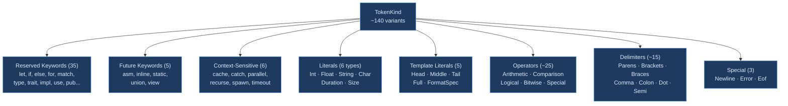
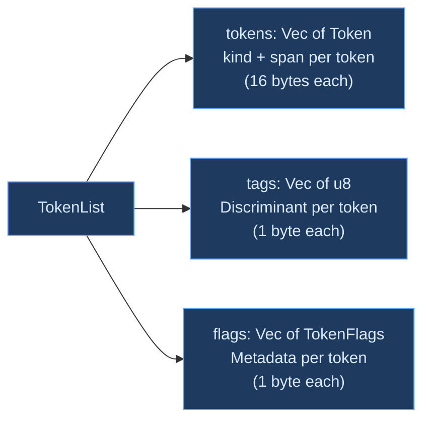

# Token Design

## What Is a Token?

A **token** is the atomic unit of syntax — the smallest piece of source code that carries meaning to the compiler. Tokens are to a compiler what words are to a human reader: a string of characters like `let` or `42` or `+` is a single unit that the parser works with, without caring about the individual characters that compose it.

Every token carries at least two pieces of information:

1. **What kind of token it is** — a keyword, an identifier, a number, an operator, a delimiter
2. **Where it appears in the source** — start and end positions, used for error messages and tooling

Many tokens carry additional data: an integer literal carries its numeric value, a string literal carries its interned content, a duration literal carries both its value and its unit. The design of this data — what information each token stores, how it's represented in memory, how the parser accesses it — has cascading effects on the performance and correctness of every downstream phase.

### The Design Space

Token representation involves several interrelated design choices:

**Granularity** — How many distinct token kinds does the lexer produce? At one extreme, a lexer could classify tokens into broad categories (identifier, number, operator, delimiter). At the other extreme, it could have a unique kind for every keyword, every operator, every literal type. Broader categories push work to the parser (which must distinguish `let` from `for` by examining the token's string); finer categories front-load this work in the lexer but produce a larger `TokenKind` enum.

**Payload** — Where does token data live? Inline in the token struct (fast access, larger tokens), in a side table indexed by token position (smaller tokens, indirect access), or as interned handles that reference a shared table (small tokens, O(1) comparison, requires interner for display)?

**Metadata** — Beyond kind and position, what additional information does each token carry? Whitespace context? Error flags? Documentation markers? This metadata can live inline, in parallel arrays, or not at all (requiring the parser to recompute it from the source).

**Equality semantics** — What makes two token streams "the same"? If only token kinds matter (ignoring positions), then whitespace-only edits produce equal streams — useful for incremental caching. If positions matter, every edit produces a different stream.

## Classical Approaches

### Tagged Union (Variant/Enum)

The most common representation is a tagged union — a single type that can hold any token kind, with a discriminant tag to identify which variant is active:

```text
Token = { tag: u8, data: union { int_val: u64, name: Name, char_val: char, ... } }
```

In Rust, this is an `enum`. In C, it's a `struct` with a `tag` field and a `union` of payloads. In Java, it's a class hierarchy or sealed interface.

The advantage is type safety — pattern matching on the tag guarantees that you access the right payload variant. The disadvantage is size: the enum must be as large as its largest variant plus the tag, even for variants that carry no data. A keyword token that needs only a tag (1 byte) takes the same space as a string literal that carries a 4-byte interned `Name`.

### Separate Token Type

Some compilers use separate types for different token categories. [GHC](https://github.com/ghc/ghc) uses distinct `ITinteger`, `ITstring`, `ITvarid`, etc. types rather than a single `Token` enum. This avoids the wasted-space problem (each token type is only as large as it needs to be) but complicates generic token handling — a function that operates on "any token" must use dynamic dispatch or a trait object.

### Flat Tag + Side Table

An alternative is to store only a tag per token, with payloads in a separate side table indexed by token position. [Zig's compiler](https://github.com/ziglang/zig) uses this approach: each token is a `(tag, start)` pair (compact), and the parser fetches the token's text from the source when it needs the actual content. This minimizes per-token memory but adds indirection: looking up a token's value requires indexing into the source or a supplementary table.

### Token Objects (OOP Style)

Object-oriented compilers sometimes represent tokens as objects with virtual methods. [Roslyn](https://github.com/dotnet/roslyn) (C#) uses rich `SyntaxToken` objects that carry trivia (whitespace and comments), parent references, and position information. This is maximally flexible but incurs allocation and indirection costs. Roslyn accepts this tradeoff because IDE responsiveness matters more than raw throughput.

## Ori's Token Representation

Ori uses a **fine-grained enum** with inline payloads and a **parallel arrays** output format, designed for Salsa compatibility, cache-friendly parser access, and rich error reporting.

### TokenKind — The Core Enum

`TokenKind` is the heart of the token system. It uses approximately 140 variants grouped into logical categories:



Each variant falls into one of two categories: **data-free** (keywords, operators, delimiters — the tag alone carries all information) or **data-carrying** (literals and identifiers, which store their value inline).

#### Data-Free Variants

Keywords, operators, and delimiters carry no payload — the discriminant tag is the entire token:

```text
TokenKind::Let         — the keyword "let"
TokenKind::Plus        — the operator "+"
TokenKind::LParen      — the delimiter "("
TokenKind::Arrow       — the operator "->"
```

This is efficient: checking whether a token is `Let` is a single integer comparison against the discriminant value.

#### Data-Carrying Variants

Literals and identifiers store their parsed values inline:

```text
TokenKind::Int(u64)                      — 42, 1_000_000, 0xFF, 0b1010
TokenKind::Float(u64)                    — 3.14, 2.5e-8 (f64 bits as u64)
TokenKind::String(Name)                  — "hello" (interned after unescape)
TokenKind::Char(char)                    — 'a', '\n', '中'
TokenKind::Duration(u64, DurationUnit)   — 100ms, 5s, 1.5s
TokenKind::Size(u64, SizeUnit)           — 4kb, 10mb, 1.5kb
TokenKind::Ident(Name)                   — any identifier (interned)
```

**Why `Float` stores bits as `u64`**: Salsa requires all query inputs and outputs to implement `Eq` and `Hash`. Rust's `f64` does not implement these traits because floating-point equality is complicated (NaN ≠ NaN, +0.0 = -0.0). By storing the raw bit pattern as `u64`, `TokenKind` can derive `Eq` and `Hash` while preserving all `f64` values including NaN and signed zeros. The bit representation is converted back to `f64` when the parser needs the numeric value.

**Why identifiers use `Name`**: Identifiers are stored as interned handles (`Name(u32)`) rather than string slices. This means comparing two identifiers is a 4-byte integer comparison rather than a variable-length string comparison. The interner must be consulted to recover the original text for error messages or code generation, but this is an infrequent operation compared to the millions of identifier comparisons that occur during type checking. See the [String Interning](../02-intermediate-representation/string-interning.md) chapter for details.

### Token — Kind Plus Position

Each token pairs a `TokenKind` with a `Span`:

```rust
pub struct Token {
    pub kind: TokenKind,
    pub span: Span,       // u32 start + u32 end = 8 bytes
}
```

### Span — Source Position

```rust
pub struct Span {
    pub start: u32,
    pub end: u32,
}
```

`u32` byte offsets support source files up to 4 GiB — far beyond any practical source file. Files exceeding this limit saturate to `u32::MAX`. The 8-byte span is compact enough to embed in every token and AST node without significant memory overhead.

Spans reference the original source text by byte position, not by owned copies. This is **zero-copy** — the lexer never allocates memory to store source text in tokens. When a diagnostic needs to display source context, it indexes into the original source buffer using the span's start and end positions.

## Keyword Design

### Reserved Keywords

Ori has 35 reserved keywords that are always recognized as keywords, never as identifiers:

```text
as  break  continue  def  div  do  else  extend  extension  extern
false  for  if  impl  in  let  loop  match  pub  self  Self
suspend  tests  then  trait  true  type  unsafe  use  uses  void
where  with  yield  Never  return
```

**`return` as a reserved keyword** deserves special mention. Ori has no `return` statement — the last expression in a block is the block's value. However, `return` is reserved so that the parser can produce a targeted error message when users coming from C, JavaScript, Python, or Rust type `return`. Without this reservation, `return` would be parsed as an identifier, producing a confusing "unexpected identifier" error rather than the helpful "Ori doesn't have `return`; the last expression in a block is its value."

**`Never` as a keyword** is unusual — most languages spell their bottom type as a type-level construct (Rust's `!`, TypeScript's `never`, Kotlin's `Nothing`). Ori's `Never` is a keyword-level token that the parser can recognize without type information, simplifying the grammar.

### Future Reserved Keywords

Five keywords are reserved for potential future use:

```text
asm  inline  static  union  view
```

Using any of these as an identifier produces a specific error explaining that the word is reserved for future language features.

### Context-Sensitive Keywords

Six keywords are only recognized when followed by `(`:

```text
cache(    catch(    parallel(    recurse(    spawn(    timeout(
```

These keywords introduce **pattern expressions** — special expression forms that syntactically resemble function calls. The context-sensitive resolution ensures that `cache`, `timeout`, etc. remain available as identifier names in non-call contexts.

An additional set of identifiers serves as **pattern argument names** — words like `body`, `buffer`, `default`, `expr`, `map`, `state` — that are always identifiers but have special meaning as named arguments within pattern expressions. These are not keywords; they're resolved entirely by the parser based on syntactic position.

### Built-in Type Names

Five type names are recognized as dedicated tokens:

```text
bool  byte  float  int  str
```

These are not technically keywords (they don't affect the grammar) but having dedicated token kinds allows the parser to recognize primitive types immediately rather than looking them up in a name-resolution table.

## TokenFlags — Per-Token Metadata

`TokenFlags` is a `u8` bitfield that captures contextual information about each token's surroundings:

```text
Bit 0 (0x01): SPACE_BEFORE    — Preceded by horizontal whitespace
Bit 1 (0x02): NEWLINE_BEFORE  — Preceded by a newline
Bit 2 (0x04): TRIVIA_BEFORE   — Preceded by a comment
Bit 3 (0x08): ADJACENT        — No whitespace/newline/trivia before
Bit 4 (0x10): LINE_START      — First token on its line
Bit 5 (0x20): HAS_ERROR       — Error during cooking (overflow, bad escape, etc.)
Bit 6 (0x40): CONTEXTUAL_KW   — Soft keyword resolved via lookahead
Bit 7 (0x80): IS_DOC          — First token after a doc comment
```

### Why Flags Instead of Inline Fields?

Flags are stored in a parallel `Vec<TokenFlags>` alongside the token array, not inside the `Token` struct. This keeps `Token` at 16 bytes (kind + span) and ensures that flag access doesn't pollute the cache lines used for kind checks.

Each flag serves a specific consumer:

| Flag | Primary Consumer | Purpose |
|------|-----------------|---------|
| `SPACE_BEFORE` | Formatter | Preserve or normalize spacing |
| `NEWLINE_BEFORE` | Parser | Statement boundary detection |
| `TRIVIA_BEFORE` | Formatter | Attach comments to adjacent tokens |
| `ADJACENT` | Parser | Compound operator synthesis (`> >` → `>>`) |
| `LINE_START` | Formatter | Indentation calculation |
| `HAS_ERROR` | Diagnostics | Mark error-bearing tokens |
| `CONTEXTUAL_KW` | Parser | Distinguish `cache(` keyword from `cache` identifier |
| `IS_DOC` | Parser | Doc comment attachment to declarations |

### Flag Production

Flags accumulate in a pending state during trivia scanning and are applied when the next content token is pushed:

```text
Source:    // comment\n    let x = 42

Scanning:
  "// comment"  → pending |= TRIVIA_BEFORE
  "\n"          → pending |= NEWLINE_BEFORE | LINE_START
  "    "        → pending |= SPACE_BEFORE
  "let"         → flags = pending  (TRIVIA_BEFORE | NEWLINE_BEFORE | LINE_START | SPACE_BEFORE)
  " "           → pending = SPACE_BEFORE
  "x"           → flags = SPACE_BEFORE
  " "           → pending = SPACE_BEFORE
  "="           → flags = SPACE_BEFORE
  " "           → pending = SPACE_BEFORE
  "42"          → flags = SPACE_BEFORE
```

If no trivia precedes a token (the pending flags are empty), the `ADJACENT` flag is set instead. This is critical for the parser's compound operator synthesis: `>>` (adjacent `>` tokens) must be distinguished from `> >` (space-separated `>` tokens).

The `IS_DOC` flag is only computed in the `lex_with_comments()` path, not the fast `lex()` path, since only the formatter and LSP need doc comment attachment.

## TokenList — The Output Structure

`TokenList` is the complete output of lexing a source file. It uses three parallel arrays:



### The Discriminant Tag Array

The `tags` array stores each token's `TokenKind` discriminant as a `u8`. This enables the parser's hot-path operations — `check()`, `at()`, `expect()` — to examine a 1-byte tag rather than the full 16-byte `Token`. For a file with 10,000 tokens, the `tags` array is 10 KB; the `tokens` array is 160 KB. Scanning the tags array for "the next `Let` token" touches ~6x fewer cache lines.

The `TokenSet` type uses the discriminant values for O(1) set membership:

```text
TokenSet = { lo: u128, hi: u128 }    // 256 bits covering all possible tags

EXPRESSION_START = TokenSet containing:
    TAG_INT | TAG_FLOAT | TAG_STRING | TAG_IDENT | TAG_LPAREN |
    TAG_LBRACKET | TAG_LBRACE | TAG_IF | TAG_MATCH | TAG_FOR | ...

Checking:  set.contains(tags[i])  →  single bit test on u128
```

This is the same bit-set technique used by parser generators like ANTLR for lookahead sets.

### Position-Independent Equality (Salsa Integration)

`TokenList` has custom `Eq` and `Hash` implementations that compare `TokenKind` values and `TokenFlags` but **ignore `Span` positions**:

```text
Edit: insert a space between "let" and "x"

Before: [Let(0..3), Ident("x", 4..5), Eq(6..7), Int(42, 8..10)]
After:  [Let(0..3), Ident("x", 5..6), Eq(7..8), Int(42, 9..11)]

Kinds+flags identical → TokenList::eq() returns true → Salsa skips re-parsing
```

The `tags` array is excluded from the equality check because tags are derived from `TokenKind` values — if the kinds are equal, the tags must be equal. This is a deliberate redundancy: the tags exist for fast access in the parser, not as independent data.

This position-independent equality enables **Salsa early cutoff**. When a whitespace-only edit produces a `TokenList` that equals the previous one, Salsa's memoization detects the match and skips all downstream queries — parsing, type checking, and code generation all avoid re-execution for the entire file.

## Literal Design

### Integer Literals

Three formats with underscore separators for readability:

```text
42          → Int(42)           Decimal
1_000_000   → Int(1000000)     Underscores stripped during cooking
0xFF        → Int(255)          Hexadecimal (0x prefix)
0xDEAD_BEEF → Int(3735928559)  Hex with underscores
0b1010      → Int(10)           Binary (0b prefix)
0b1111_0000 → Int(240)          Binary with underscores
```

Overflow beyond `u64::MAX` produces `TokenKind::Error` with the `HAS_ERROR` flag and accumulates an `IntegerOverflow` diagnostic.

### Float Literals

```text
3.14       → Float(bits)        Standard decimal
2.5e-8     → Float(bits)        Scientific notation
1e10       → Float(bits)        Integer mantissa with exponent
1_000.5    → Float(bits)        Underscores in mantissa
```

The raw scanner classifies the token as `RawTag::Float`; the cooking layer parses the text (stripping underscores) via `f64::from_str` and stores the result as a `u64` bit pattern.

### String Literals

```text
"hello"             → String(Name)    Simple string
"with \"escapes\""  → String(Name)    Escaped quotes
"line\nbreak"       → String(Name)    Escape sequences
```

Valid escapes: `\"` `\\` `\n` `\t` `\r` `\0`. The escape `\'` in a string context produces a specific error ("use `'` directly without escaping") rather than a generic "invalid escape" — this catches a common mistake by users coming from languages where `\'` is valid in both string and character contexts.

A **fast path** detects strings containing no backslashes and interns the source slice directly, avoiding heap allocation.

### Char Literals

```text
'a'    → Char('a')       ASCII
'λ'    → Char('λ')       Unicode (2-byte UTF-8)
'中'   → Char('中')       Unicode (3-byte UTF-8)
'\n'   → Char('\n')      Escape sequence
```

Valid escapes: `\'` `\\` `\n` `\t` `\r` `\0`. The escape `\"` in a character context produces the inverse error: "use `"` directly."

### Duration Literals

```text
100ns  → Duration(100, Nanoseconds)
50us   → Duration(50, Microseconds)
100ms  → Duration(100, Milliseconds)
5s     → Duration(5, Seconds)
2m     → Duration(2, Minutes)
1h     → Duration(1, Hours)
```

Decimal durations are converted to integer base units via exact arithmetic:

```text
1.5s   → Duration(1_500_000_000, Nanoseconds)    1.5 seconds in nanos
0.5m   → Duration(30, Seconds)                    0.5 minutes in seconds
```

### Size Literals

```text
1024b  → Size(1024, Bytes)
4kb    → Size(4, Kilobytes)
10mb   → Size(10, Megabytes)
2gb    → Size(2, Gigabytes)
1tb    → Size(1, Terabytes)
```

Sizes use SI units (1000-based, not 1024-based). Decimal sizes follow the same exact-representation rule as durations:

```text
1.5kb  → Size(1500, Bytes)    1.5 kilobytes in bytes
```

### Template Literals

Template literals produce context-dependent token types based on their structure:

```text
`no interpolation`              → TemplateFull("no interpolation")
`hello {name}`                  → TemplateHead("hello ") ... TemplateTail("")
`{a} middle {b}`                → TemplateHead("") ... TemplateMiddle(" middle ") ... TemplateTail("")
`value: {x:>10.2f}`            → TemplateHead("value: ") Ident(x) FormatSpec(">10.2f") TemplateTail("")
```

All template text content is interned after escape processing. Template escapes include `{{` and `}}` for literal braces in addition to the standard backslash escapes.

## Ori-Specific Token Design

Several tokens reflect design choices unique to Ori:

### `@` — Function Sigil

The `@` token serves dual purpose: in declaration context it marks function names (`@add`, `@main`), and in expression context it serves as the matrix multiplication operator. The parser disambiguates based on syntactic position — this is a parsing decision, not a lexing one. The lexer produces a single `At` token in both cases.

### `$` — Immutability Sigil

The `$` token marks immutable bindings (`let $x = 42`) and module-level constants (`let $timeout = 30s`). Like `@`, it's a single token that the parser interprets in context.

### `#` — Length/Attribute Prefix

The `#` token serves as the length shorthand in index expressions (`list[# - 1]`, where `#` means "length of the collection") and as the attribute prefix (`#derive(Eq)`). The combined `#[` sequence is lexed as a single `HashBracket` token to simplify attribute parsing — the lexer handles the two-character lookahead so the parser doesn't need to.

### `Newline` — Significant Whitespace

Unlike most languages where newlines are simply whitespace, Ori's `Newline` is a full token used by the parser for statement separation. This is the mechanism that allows Ori to omit semicolons in most cases while maintaining unambiguous parsing.

### `Error` — Graceful Degradation

Invalid input produces `TokenKind::Error` tokens rather than aborting lexing. This allows the parser to:
1. See where errors occurred via spans
2. Attempt recovery by skipping error tokens
3. Report multiple errors from a single source file

The parser treats `Error` tokens as "unexpected" and skips them during recovery, continuing to parse the rest of the file. This is essential for IDE-quality error reporting where users expect to see errors for the entire file, not just the first one.

## The Greater-Than Token Design

The lexer produces individual `>` tokens — never `>>` (right shift) or `>=` (greater-equal) as single tokens. This asymmetry with `<` (where `<<` and `<=` are single tokens) is deliberate:

| Operator | Lexer Output | Why |
|----------|--------------|-----|
| `<` | `Lt` | No ambiguity — always a single `<` |
| `<=` | `LtEq` | No ambiguity — `<=` never appears in type syntax |
| `<<` | `Shl` | No ambiguity — `<<` never appears in type syntax |
| `>` | `Gt` | Could close a generic: `Option<int>` |
| `>=` | `Gt` + `Eq` | Could be end of generic + assignment: `x: Option<int>=...` |
| `>>` | `Gt` + `Gt` | Could be closing two generics: `Result<Option<int>>` |

The parser synthesizes `>=` and `>>` from adjacent tokens in expression context by checking span adjacency. In type context, each `>` independently closes a generic parameter list. This approach avoids the need for a "type mode" in the lexer that would complicate the clean separation between lexical and syntactic analysis.

## Comments

Ori has line comments only (`//`). By default, `lex()` strips comments from the token stream — they contribute only to `TokenFlags` (setting `TRIVIA_BEFORE`). The `lex_with_comments()` path preserves and classifies them:

```text
// Description of the function       → DocDescription
// * param: description of param     → DocMember
// ! Warning or Panics note          → DocWarning
// > example() -> result             → DocExample
// anything else                     → Regular
```

Doc comments are attached to declarations via the `IS_DOC` flag on the token following the comment. The lexer also detects **detached doc comments** — doc comments separated from their target declaration by a blank line — and emits a warning.

## Design Tradeoffs

### Fine-Grained Enum vs Broad Categories

Ori's `TokenKind` has ~140 variants — one for every keyword, operator, and literal type. A simpler design might use 20-30 categories (Keyword, BinaryOp, UnaryOp, Literal, Delimiter, Identifier) with a payload to distinguish subcategories. The fine-grained approach makes pattern matching in the parser exhaustive and explicit: missing a keyword variant is a compile error, not a runtime surprise. The cost is a larger enum (though Rust optimizes enum sizes well) and more variants to maintain.

### Inline Payloads vs Side Tables

Literals store their values inline in `TokenKind` rather than in a separate table. This means `Token` is as large as its largest variant (16 bytes with span), even for data-free tokens like keywords. A side-table design would shrink tokens to ~4 bytes (tag + span offset) but require an additional lookup for every literal access. Ori chose inline payloads because literal access is frequent (the parser reads every integer, string, and identifier value) and the size overhead is manageable — 160 KB for 10,000 tokens.

### Parallel Arrays vs Struct-of-Arrays Everywhere

`TokenList` splits tokens, tags, and flags into separate arrays but keeps `kind` and `span` together in the `Token` struct. A fully SoA design would separate `kinds: Vec<TokenKind>` and `spans: Vec<Span>` as well. Ori keeps them together because the parser typically accesses both kind and span at the same time (to construct AST nodes with spans), and the `tags` array already provides the fast-path for kind-only access.

### Custom Eq/Hash vs Derived

The custom `Eq`/`Hash` that ignores spans is a correctness decision, not just an optimization. If `TokenList` used derived equality (which includes spans), whitespace edits would invalidate Salsa's cache even though the program's meaning hasn't changed. This would defeat the purpose of incremental compilation for the most common edit pattern — reformatting and whitespace adjustment. The tradeoff is that two files with the same tokens but different formatting are considered equal by Salsa, which is the desired behavior.

## Prior Art

### Rust — `Token` and `TokenKind`

[Rust's parser](https://github.com/rust-lang/rust/tree/master/compiler/rustc_ast/src/token.rs) uses a `TokenKind` enum similar to Ori's but with fewer variants — Rust keywords are resolved during parsing rather than lexing, so the token kind for `let` is `Ident("let")` rather than a dedicated `Let` variant. Ori's approach of resolving keywords during lexing is a tradeoff: more `TokenKind` variants but simpler parser code (no string comparisons during parsing). Rust's `>` token splitting and span-based adjacency checking directly inspired Ori's design.

### Zig — Flat `Token` with `Tag`

[Zig's tokenizer](https://github.com/ziglang/zig/blob/master/lib/std/zig/tokenizer.zig) uses a very flat design: each token is a `(Tag, Loc)` pair where `Tag` is an enum (~130 variants) and `Loc` stores start/end positions. Zig has no interning at the lexer level — the parser retrieves token text by slicing the source. This makes Zig's lexer extremely fast but pushes string handling costs to later phases. Ori's early interning pays a lexer-time cost but saves work in every downstream phase that compares identifiers.

### TypeScript — Rich `SyntaxKind`

[TypeScript's `SyntaxKind`](https://github.com/microsoft/TypeScript/blob/main/src/compiler/types.ts) enum has ~380 values covering both tokens and AST nodes in a single enumeration. This unification simplifies the interface between scanner and parser but means the enum is large and not all values are valid in all contexts. Ori keeps token kinds and AST node kinds as separate enums, enforcing the lexer-parser boundary at the type level.

### Roslyn — `SyntaxToken` with Trivia

[Roslyn's `SyntaxToken`](https://github.com/dotnet/roslyn) carries leading and trailing **trivia** (whitespace and comments) as part of the token itself. Every character in the source file belongs to exactly one token or its trivia, enabling perfect round-tripping — the syntax tree can reconstruct the original source character-for-character. Ori takes a different approach: whitespace is recorded as flags (`SPACE_BEFORE`, `NEWLINE_BEFORE`), and comments are optionally preserved in a separate `Comment` list. This is less powerful than Roslyn's full-fidelity trivia (Ori can't perfectly reconstruct whitespace from flags alone) but consumes far less memory per token.

### GHC — Rich Token Payloads

[GHC's lexer](https://github.com/ghc/ghc) produces tokens with rich semantic payloads — string tokens carry their encoding, integer tokens carry their value and base, and special tokens carry layout information (Haskell's significant-whitespace rules are handled at the lexer level). Ori's token payloads are simpler because Ori's grammar is less context-sensitive than Haskell's — no layout rules, no operator fixity declarations during lexing, no pragma processing.

## Related Documents

- [Lexer Overview](index.md) — Architecture, two-layer design, performance
- [Architecture: Pipeline](../01-architecture/pipeline.md) — How tokens flow through the compilation pipeline
- [String Interning](../02-intermediate-representation/string-interning.md) — The `Name` type used by identifier and string tokens
- [Flat AST](../02-intermediate-representation/flat-ast.md) — How the parser builds AST nodes from tokens
