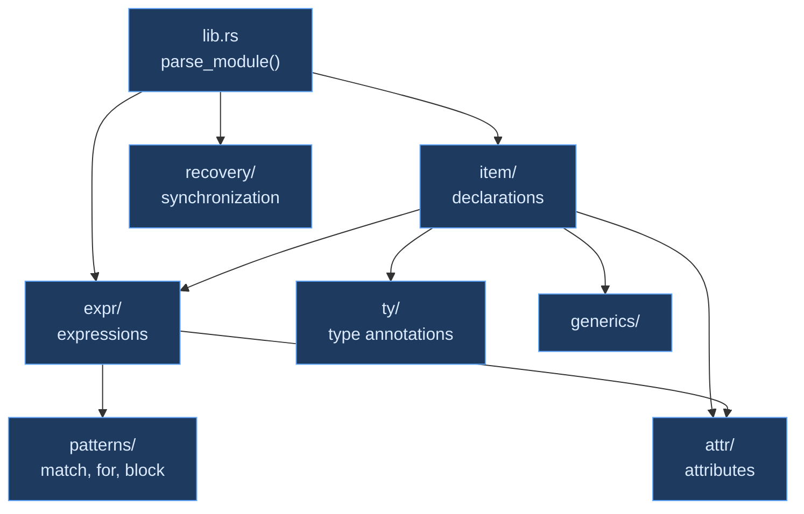

# Grammar Modules

## How Should a Parser Be Organized?

A programming language parser is one of the largest single components in a compiler. Ori's parser spans roughly 24,000 lines across 76 files — and this is a modest-sized language. C++ parsers (like [Clang](https://github.com/llvm/llvm-project)'s) run to hundreds of thousands of lines. The question of how to organize this code is not academic; it directly affects whether a new language feature can be added without understanding the entire parser, whether bugs can be localized quickly, and whether multiple contributors can work on the parser simultaneously.

### The Monolithic Approach

The simplest approach is a single file with all parsing functions. [Go](https://github.com/golang/go)'s parser (`go/parser`) takes this route — Go's deliberately small grammar makes a single-file parser feasible. The advantage is discoverability: everything is in one place, and search works. The disadvantage is scale: as the grammar grows, the file grows, and navigating a 10,000-line file becomes a productivity problem.

### Module-Per-Construct

Most production parsers organize by **syntactic category**: one module for expressions, one for declarations, one for types, one for patterns. This mirrors the grammar itself — the EBNF has sections for expressions, declarations, and types, and the code follows the same structure.

[Rust's parser](https://github.com/rust-lang/rust) (`rustc_parse/src/parser/`) organizes into `expr.rs`, `item.rs`, `ty.rs`, `pat.rs`, `stmt.rs`, and `generics.rs`. [Zig](https://github.com/ziglang/zig) has a single large `Parser.zig` but with clearly delimited sections. [TypeScript](https://github.com/microsoft/TypeScript)'s `parser.ts` is a single 11,000-line file but with a clear section structure.

Ori follows the module-per-construct approach, with further subdivision within large categories. The authoritative grammar is in [grammar.ebnf](https://github.com/upstat-io/ori-lang/blob/master/docs/ori_lang/0.1-alpha/spec/grammar.ebnf); each EBNF production maps to a parsing function in the module for its syntactic category.

## Module Structure

### Top Level

The parser's public entry point (`lib.rs`) handles the module-level parse loop: it iterates over the token stream, dispatching each declaration to the appropriate module based on the leading token. After parsing all declarations, it returns a `ParseOutput` containing the `Module`, `ExprArena`, and accumulated errors.

### expr/ — Expressions

Expressions are the largest grammar category and are split into four sub-modules:

**mod.rs — Pratt Parser Entry**

The core expression parsing entry point. Routes to the Pratt parser for binary operators, handles assignment, and dispatches to sub-modules for unary, postfix, and primary expressions. See [Pratt Parser](pratt-parser.md).

```rust
parse_expr()                 // Full expression (includes assignment)
parse_non_assign_expr()      // No top-level = (guard clauses)
parse_non_comparison_expr()  // No < > (const generic defaults)
parse_binary_pratt(min_bp)   // Pratt loop: single-loop precedence climbing
parse_unary()                // - ! ~ with constant folding for negation
parse_range_continuation()   // left .. end by step
```

**operators.rs — Binding Power Table**

Maps token discriminants to operator binding powers and variants via the static `OPER_TABLE`. Also handles unary operator matching and function expression keyword dispatch.

```rust
infix_binding_power()        // Token → (left_bp, right_bp, BinaryOp, token_count)
match_unary_op()             // - ! ~ → UnaryOp
match_function_exp_kind()    // Keyword → FunctionExpKind (recurse, parallel, ...)
```

**primary.rs — Literals and Atoms**

Everything that can start an expression without an operator: literals (`42`, `"hello"`, `true`, `3.14`, `'c'`, `5s`, `1mb`), identifiers, `self`, function references (`@name`), variant constructors (`Ok`, `Err`, `Some`, `None`), let bindings, and lambdas.

```rust
parse_literal()              // Numeric, string, char, bool, duration, size
parse_ident()                // Identifiers
parse_self_ref()             // self
parse_function_ref()         // @name
parse_hash_length()          // # (collection length in index context)
parse_let()                  // let x = value, let $x = value
parse_lambda()               // x -> x + 1, (a, b) -> a + b
```

**postfix.rs — Postfix Operations**

A tight loop that applies postfix operators to a base expression: function calls, method calls, field access, indexing, try (`?`), and casts (`as`, `as?`).

```rust
apply_postfix_ops(base)      // Loop applying postfix operators
parse_call_args()            // f(a, b, c)
parse_named_call_args()      // f(a: 1, b: 2)
parse_method_call()          // obj.method(args)
parse_field_access()         // obj.field, obj.0
parse_index()                // arr[i], arr[# - 1]
parse_try()                  // expr?
parse_cast()                 // expr as Type, expr as? Type
```

**patterns/ — Control Flow and Pattern Expressions**

Block expressions, match, for, loop, try, and function expressions (compiler patterns like `recurse`, `parallel`, `spawn`). The `match_patterns.rs` sub-module handles pattern syntax for match arms and destructuring.

```rust
parse_block()                // { expr; expr; result }
parse_try_expr()             // try { expr?; Ok(value) }
parse_match()                // match value { pattern -> body, ... }
parse_for()                  // for x in items do/yield ...
parse_loop()                 // loop { body }
parse_function_exp()         // recurse(...), parallel(...), with(...)
```

### item/ — Top-Level Declarations

Each declaration kind gets its own sub-module:

**function.rs** — Functions and tests. Dispatches `@` to function or test based on context, parses parameter lists, return types, and capabilities.

```rust
parse_function()             // @name (params) -> Type = body
parse_test()                 // @test_name tests @target () -> void = body
parse_params()               // (a: int, b: str = "default")
parse_capabilities()         // uses Http, FileSystem
```

**type_decl.rs** — Type declarations: structs, sum types, and newtypes.

```rust
parse_type_decl()            // type Name = ...
parse_struct_body()          // { x: int, y: int }
parse_sum_or_newtype()       // Some(T) | None
```

**trait_def.rs** — Trait definitions with method signatures, default methods, and associated types.

**impl_def.rs** — Implementation blocks: `impl Trait for Type`, `def impl Trait`, and inherent methods.

**use_def.rs** — Import declarations: relative (`"./math"`), module (`std.net.http`), aliased (`as http`), and selective (`{ add, subtract }`).

**extend.rs** — Extension method blocks.

**extension_import.rs** — Extension imports: `extension "path" { Type.method }`.

**extern_def.rs** — FFI extern blocks: `extern "c" { ... }`.

**generics.rs** — Generic parameter parsing, shared across functions, types, traits, and impls. Handles type parameters, const generics, bounds, where clauses, and capability declarations.

```rust
parse_generics()             // <T, U: Bound>, <T = Self>, <$N: int = 10>
parse_bounds()               // Eq + Clone + Printable
parse_where_clauses()        // where T: Clone, U: Default
parse_uses_clause()          // uses Http, FileSystem
```

**config.rs** — Module-level constants: `let $TIMEOUT = 30s`.

### ty/ — Type Annotations

Type parsing is separate from expression parsing because types have different syntax: `[int]` is a list type (not an index expression), `{str: int}` is a map type (not a block or struct literal), and `(int, str) -> bool` is a function type (not a tuple with an arrow).

```rust
parse_type()                 // int, str, bool, void, Never
parse_list_type()            // [int], [int, max 10]
parse_map_type()             // {str: int}
parse_tuple_type()           // (int, str)
parse_named_type()           // Result<T, E>, Option<T>
parse_function_type()        // (int, int) -> int
parse_self_type()            // Self
parse_associated_type()      // T.Assoc
parse_infer_type()           // _ (infer)
```

### attr/ — Attributes

Attribute parsing is shared across all declaration types. Each declaration can be preceded by attributes like `#derive(Eq, Clone)`, `#skip("reason")`, `#compile_fail("error")`, and conditional compilation markers.

```rust
pub struct ParsedAttrs {
    pub derives: Vec<Name>,
    pub test_target: Option<TestTarget>,
    pub skip_reason: Option<String>,
    pub compile_fail: Option<String>,
    // ...
}
```

`ParsedAttrs` always returns a value (even on malformed attributes) and accumulates errors separately. This ensures type checking proceeds even when attributes are syntactically invalid.

### foreign_keywords/ — Cross-Language Transition Help

A sorted lookup table maps keywords from other languages to Ori-specific guidance when they appear at declaration position:

| Foreign Keyword | Ori Guidance |
|----------------|-------------|
| `class` | Use `type` for type definitions |
| `const`, `var` | Use `let` for variable bindings |
| `enum` | Use `type` with variants |
| `fn`, `func`, `function` | Use `@name (params) -> type = body` |
| `interface` | Use `trait` |
| `nil`, `null` | Use `void` |
| `return` | Ori is expression-based — last expression is the block's value |
| `struct` | Use `type Name = { fields }` |
| `switch` | Use `match` |
| `while` | Use `loop` with `if`/`break` |

These identifiers remain valid in non-declaration positions. Lookup uses binary search.

## Cross-Module Dependencies



The dependency flow is strictly top-down:

- **lib.rs** calls `item/` for declarations and `expr/` for top-level expressions
- **item/** calls `expr/` for function bodies, `ty/` for type annotations, `generics/` for type parameters, and `attr/` for attributes
- **expr/** calls `patterns/` for match arms and binding patterns, and `attr/` for expression-level attributes
- **No module calls upward** — `expr/` never calls `item/`, `ty/` never calls `expr/`

This acyclic structure means each module can be understood in isolation: reading `ty/` requires no knowledge of how expressions or declarations work.

## Naming Conventions

### Parse Functions

```rust
parse_X()                    // Parse X, return Result<X, ParseError>
parse_X_with_outcome()       // Parse X, return ParseOutcome<X>
```

The `_with_outcome` suffix indicates functions that participate in four-way progress tracking (see [Error Recovery](error-recovery.md)). Most top-level entry points use `ParseOutcome`; once committed to a production, inner parsing typically uses `Result`.

### Cursor Methods

```rust
check(&kind)                 // Test current token without consuming
check_tag(tag)               // Test discriminant byte without reading full TokenKind
check_ident()                // Test if current is identifier
peek_next_kind()             // Look ahead one token
advance()                    // Consume and return current token
expect(&kind)                // Consume specific token or error
expect_ident()               // Consume identifier or error
skip_newlines()              // Skip newline tokens
```

### Context Methods

```rust
with_context(flags, f)       // Add context flags, run f, restore
without_context(flags, f)    // Remove context flags, run f, restore
allows_struct_lit()          // Check NO_STRUCT_LIT flag
in_error_context(ctx, f)    // Wrap errors with "while parsing X"
```

## Series Combinator

Parsing comma-separated lists — function arguments, struct fields, generic parameters, match arms — is one of the most common operations in a parser. Rather than duplicating the separator/terminator/trailing-comma logic everywhere, Ori provides a reusable `SeriesConfig` combinator (inspired by [Gleam](https://github.com/gleam-lang/gleam)'s `series_of()`):

```rust
pub struct SeriesConfig {
    pub separator: TokenKind,        // Usually Comma
    pub terminator: TokenKind,       // RParen, RBracket, RBrace, Gt
    pub trailing: TrailingSeparator, // Allowed, Forbidden, Required
    pub skip_newlines: bool,
    pub min_count: usize,
    pub max_count: Option<usize>,
}

pub enum TrailingSeparator {
    Allowed,    // Trailing separator accepted (e.g., [1, 2, 3,])
    Forbidden,  // Error on trailing separator
    Required,   // Must have separator between items
}
```

Convenience constructors for common delimiter pairs:

| Method | Delimiters | Usage |
|--------|------------|-------|
| `paren_series()` | `(` `)` | Function arguments, tuples |
| `bracket_series()` | `[` `]` | List literals, indexing |
| `brace_series()` | `{` `}` | Struct literals, blocks |
| `angle_series()` | `<` `>` | Generic parameters |

The series combinator handles newline skipping, separator expectations, trailing separator policy, and count validation in one place. Parsing functions provide an item-parsing callback; the combinator handles everything else.

## Soft Keywords

Several Ori keywords are context-sensitive ("soft keywords"). In most positions they are valid identifiers; in specific syntactic positions they act as keywords. The parser handles this through two mechanisms:

1. **`Cursor::soft_keyword_to_name()`** — maps tokens that are keywords in some contexts to identifiers in others.

2. **`match_function_exp_kind()`** — gates keywords like `recurse`, `parallel`, `spawn`, `timeout`, `cache`, `with`, `print`, `panic`, `catch`, `todo`, and `unreachable` on the presence of a following `(`. Without a following `(`, they parse as identifiers.

Note that `match`, `try`, and `loop` use block syntax (`match expr { ... }`, `try { ... }`, `loop { ... }`) rather than parenthesized syntax, so they are recognized by their leading keyword regardless of what follows.

## Return Type Conventions

The parser uses four distinct return type patterns, each signaling different error-handling semantics:

| Return Type | When Used | Meaning |
|-------------|-----------|---------|
| `ParseOutcome<T>` | Entry points subject to backtracking | Carries progress information for `one_of!` |
| `Result<T, ParseError>` | After commitment | No progress tracking needed |
| `Option<T>` | Lightweight type parsing | `None` = absent, caller decides if that's an error |
| `ParsedAttrs` + `&mut Vec<ParseError>` | Attribute parsing | Always returns value, accumulates errors separately |

This stratification keeps the progress-tracking machinery where it's needed (entry points, alternatives) without infecting the entire parser with four-way outcomes.

## Design Tradeoffs

**Deep module hierarchy vs flat files** — Ori splits expressions into 4+ sub-modules and declarations into 9+ sub-modules rather than having two large files. This makes each file readable (most are under 500 lines) at the cost of requiring navigation across files to follow a parse path. The dependency diagram above helps orientation.

**Shared series combinator vs per-site loops** — The `SeriesConfig` combinator centralizes delimiter-separated list parsing. This avoids duplicating trailing-comma logic across ~20 call sites but adds a layer of indirection. The tradeoff is worth it: changes to trailing separator policy (e.g., allowing trailing commas in generic parameters) require changing one configuration, not twenty parse loops.

**Soft keywords vs reserved words** — Making `print`, `cache`, `recurse`, etc. context-sensitive means they can be used as identifiers in most positions. This is more user-friendly than reserving them globally but requires the parser to check following tokens for disambiguation. The implementation cost is modest — a `peek_next_kind()` check — but the edge cases need testing.

## Prior Art

| Compiler | Parser Organization | Key Insight |
|----------|-------------------|-------------|
| [Rust](https://github.com/rust-lang/rust) | `rustc_parse/src/parser/`: `expr.rs`, `item.rs`, `ty.rs`, `pat.rs`, `stmt.rs`, `generics.rs`, `path.rs` | Module-per-syntactic-category, closely matching the grammar reference |
| [Go](https://github.com/golang/go) | Single-file `go/parser/parser.go` | Go's small grammar makes single-file feasible; search is discoverability |
| [Zig](https://github.com/ziglang/zig) | Single `Parser.zig` with section comments | Section-delimited monolith; flat AST reduces the parse function count |
| [TypeScript](https://github.com/microsoft/TypeScript) | Single `parser.ts` (~11,000 lines) | IDE-oriented parser with incremental reuse; single-file despite size |
| [Gleam](https://github.com/gleam-lang/gleam) | `parse/` with separate expression, pattern, and type modules; `series_of()` combinator | Direct inspiration for Ori's `SeriesConfig` pattern |
| [Roc](https://github.com/roc-lang/roc) | `parse/src/`: `expr.rs`, `pattern.rs`, `type_annotation.rs`, `header.rs` | Module-per-category with Elm-style progress tracking throughout |
| [Swift](https://github.com/swiftlang/swift) | `Parse/`: `ParseDecl.cpp`, `ParseExpr.cpp`, `ParseType.cpp`, `ParsePattern.cpp`, `ParseStmt.cpp` | C++ module-per-category; each file 2,000-5,000 lines |
