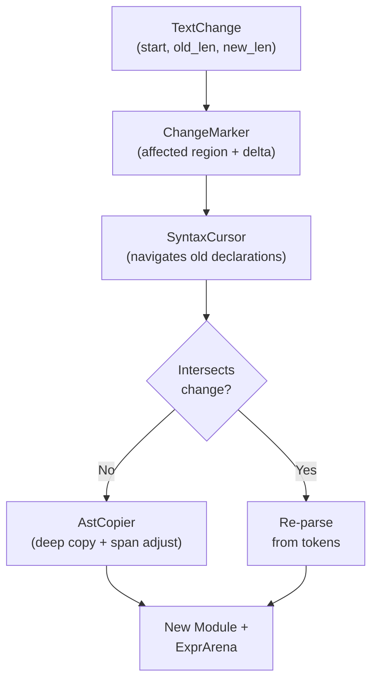

# Incremental Parsing

The Ori parser supports incremental reuse of unchanged declarations from a previous parse. When a user edits a file in an IDE, only the declarations that overlap with the edited region are re-parsed — the rest are copied from the old AST with adjusted spans.

## What Makes Ori's Incremental Parsing Distinctive

### Declaration-Level Granularity

Most incremental parsers operate at either the token level (tree-sitter) or the file level (Salsa). Ori targets the middle ground: **declaration-level reuse**. Each top-level declaration (function, type, trait, impl, etc.) is an isolation boundary — a change inside a function body cannot affect the parse of sibling declarations. This gives O(k) parsing where k = changed declarations, versus O(n) for full reparse.

| Approach | Speed | Complexity | Correctness |
|----------|-------|------------|-------------|
| Full re-parse | O(n) always | Simple | Trivially correct |
| **Declaration-level reuse** (Ori) | **O(k)** where k = changed decls | Moderate | Correct by span isolation |
| Token-level reuse (tree-sitter) | O(log n) | Very high | Requires error-tolerant grammar |

### Arena-Independent Deep Copy

Reused declarations aren't shared between old and new arenas — they're deep-copied with remapped `ExprId`s. This keeps old and new arenas fully independent, avoiding lifetime entanglement and enabling the old `ParseOutput` to be dropped freely. The copy adjusts all spans by the edit delta in a single pass.

### Composable with Salsa

The incremental parser operates below Salsa's file-level caching. Salsa handles cross-file dependencies; the incremental parser handles intra-file reuse. When a file changes, Salsa invalidates the file's parse query, which calls `parse_incremental()` — reusing most declarations while still producing a fresh `ParseOutput` for Salsa to cache.

## Architecture



## Components

### TextChange

Describes a single text edit:

```rust
pub struct TextChange {
    pub start: u32,    // Byte offset of edit start
    pub old_len: u32,  // Bytes removed
    pub new_len: u32,  // Bytes inserted
}
```

### ChangeMarker

Computed from `TextChange`, extends the affected region for lookahead safety:

```rust
pub struct ChangeMarker {
    pub affected_start: u32,
    pub affected_end: u32,
    pub delta: i64,  // new_len - old_len (positive = insertion)
}
```

The affected region is extended backwards to the end of the previous token, ensuring that multi-token lookahead patterns are not disrupted by the boundary.

### DeclRef

A lightweight reference to a declaration in the old AST:

```rust
pub struct DeclRef {
    pub kind: DeclKind,
    pub index: usize,
    pub span: Span,
}

pub enum DeclKind {
    Import, Const, Function, Test, Type, Trait, Impl, DefImpl, Extend,
}
```

### SyntaxCursor

Navigates the old module's declarations, sorted by span position:

```rust
pub struct SyntaxCursor<'a> {
    module: &'a Module,
    arena: &'a ExprArena,
    declarations: Vec<DeclRef>,  // sorted by span.start
    marker: ChangeMarker,
    position: usize,
}
```

`find_at(pos)` locates a declaration at the given position. The caller then checks whether the declaration intersects the change region.

### AstCopier

Deep-copies a declaration from the old arena into the new arena, adjusting all spans by the change delta:

```rust
pub struct AstCopier<'a> {
    old_arena: &'a ExprArena,
    marker: ChangeMarker,
}
```

Copy methods exist for each declaration type (`copy_function()`, `copy_test()`, `copy_type_decl()`, `copy_trait()`, `copy_impl()`, `copy_def_impl()`, `copy_extend()`, `copy_const()`). Each recursively allocates new `ExprId`s in the destination arena, so the old and new arenas remain independent.

## Algorithm

### 1. Collect Declarations

`collect_declarations(module)` produces a sorted `Vec<DeclRef>` from the old module, ordered by `span.start`.

### 2. Parse with Reuse

`parse_module_incremental()` processes the token stream. For each position, it checks whether the `SyntaxCursor` finds a declaration that falls outside the change region. If so, the declaration is copied via `AstCopier`; otherwise, it's re-parsed fresh from the token stream.

Imports are always re-parsed because they affect module resolution globally.

### 3. Span Adjustment

Declarations **after** the change region have their spans shifted by the change delta:

```
Original:   [func_a 0..50]  [EDITED 50..80]  [func_b 80..120]
After edit (delta = +10):
            [func_a 0..50]  [EDITED 50..90]  [func_b 90..130]
```

`func_a` is before the change — copied without adjustment.
`func_b` is after the change — all spans shifted by +10.
The edited region is re-parsed from tokens.

## Statistics

`IncrementalStats` tracks reuse efficiency:

```rust
pub struct IncrementalStats {
    pub reused_count: usize,
    pub reparsed_count: usize,
}

impl IncrementalStats {
    pub fn reuse_rate(&self) -> f64;
}
```

`CursorStats` tracks lookup performance (lookups, skipped, intersected).

## Running Benchmarks

```bash
# Incremental vs full reparse at various file sizes
cargo bench -p oric --bench parser -- "incremental"

# Reuse rate by edit position (start, middle, end of file)
cargo bench -p oric --bench parser -- "incremental_reuse"
```

## Design Tradeoffs

- **Imports are always re-parsed** — They affect global resolution and are typically few in number.
- **Single-edit model** — The current design handles one `TextChange` per incremental parse. Multiple concurrent edits require coalescing into a single change.
- **Metadata not merged** — Incremental parsing does not yet merge `ModuleExtra` (comments, blank lines). For full metadata support, a separate lex-with-comments pass is needed.
- **Arena independence** — Copied declarations get new `ExprId`s in the new arena. The old arena and module are not modified. This is intentional — arena sharing would require lifetime entanglement that complicates the Salsa integration.

## Usage

```rust
// Initial parse
let output = ori_parse::parse(&tokens, &interner);

// After user edits the file
let change = TextChange { start: 42, old_len: 5, new_len: 8 };
let new_tokens = ori_lexer::lex(new_source, &interner);
let new_output = ori_parse::parse_incremental(
    &new_tokens,
    &interner,
    &output,
    change,
);
```
