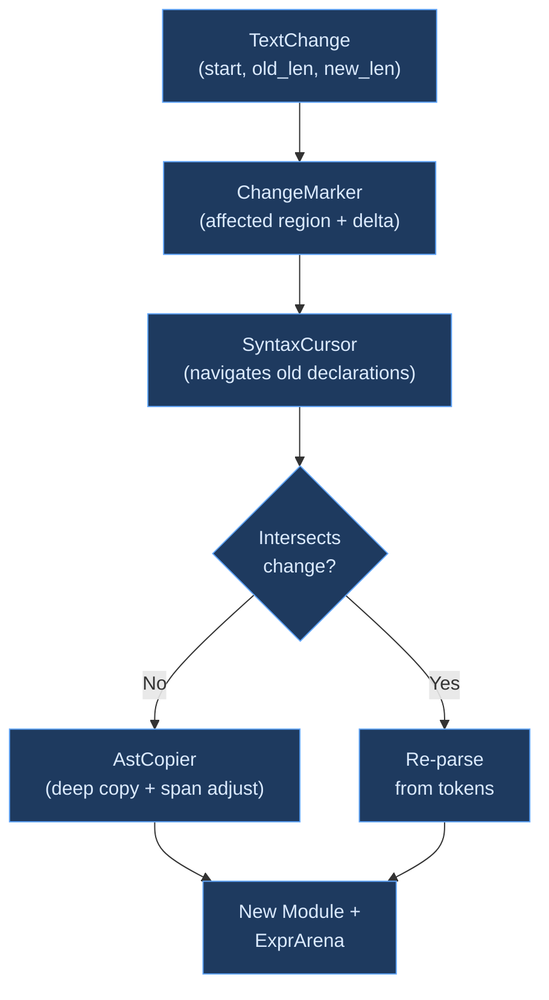

# Incremental Parsing

## What Is Incremental Parsing?

**Incremental parsing** is the technique of reusing work from a previous parse when only part of the source text has changed. Instead of re-parsing an entire file after every keystroke, an incremental parser identifies the unchanged portions and copies them from the old parse result, only re-parsing the regions affected by the edit.

This matters because IDEs compile continuously. Every character the programmer types triggers a reparse, a type check, and an update to diagnostics, completions, and highlights. A 5,000-line file takes perhaps 10ms to parse from scratch — fast enough for batch compilation, but when it happens on every keystroke, those milliseconds add up to perceptible lag. Incremental parsing reduces most keystrokes to sub-millisecond work by reusing the 99% of declarations that didn't change.

### The IDE Problem

Batch compilers can afford to re-parse everything. They run once, process all files, and produce output. IDE compilers run continuously — they must respond to every edit in real time, maintaining a consistent view of the program as it changes. The constraints are fundamentally different:

| Property | Batch Compiler | IDE Compiler |
|----------|---------------|--------------|
| Parse frequency | Once per file | Every keystroke |
| Acceptable latency | Seconds | Milliseconds |
| Input state | Complete, valid | Partial, often invalid |
| Output requirement | Final AST | Partial AST with errors |

Incremental parsing addresses the frequency and latency constraints. Error recovery (see [Error Recovery](error-recovery.md)) addresses the partial/invalid input constraint. Together, they make IDE-responsive compilation possible.

### Granularity Spectrum

Incremental parsers differ in the granularity of reuse:

**File-level** — the coarsest granularity. If a file hasn't changed, reuse the entire parse result. If any byte changed, re-parse the entire file. This is what [Salsa](https://github.com/salsa-rs/salsa) and similar incremental computation frameworks provide at the query level. It handles multi-file projects efficiently (unchanged files are never re-parsed) but provides no benefit for edits within a single file.

**Declaration-level** — reuse individual top-level declarations (functions, types, traits) when they don't overlap the edited region. A change inside one function body only re-parses that function; sibling declarations are copied from the old AST. This is Ori's approach, giving O(k) parsing where k = changed declarations.

**Node-level** — reuse individual syntax tree nodes. [Roslyn](https://github.com/dotnet/roslyn) (C#) uses immutable "green" tree nodes that can be shared between old and new parse trees. Unchanged subtrees are pointer-identical across versions. This provides the finest-grained reuse in practice for hand-written parsers.

**Parse-state-level** — the finest granularity. [tree-sitter](https://tree-sitter.github.io/tree-sitter/) tracks which parse states were affected by an edit and re-runs only those states, achieving O(log n) incremental updates. This requires an LR parser (tree-sitter uses GLR) and a grammar that can be partitioned into independent parse states.

### Classical Approaches

#### Red-Green Trees (Roslyn)

[Roslyn](https://github.com/dotnet/roslyn) pioneered the **red-green tree** design for IDE-oriented parsing. The parse tree is split into two layers:

- **Green nodes** — immutable, position-independent, structurally shared. A green node stores its kind, width (in characters), and child green nodes. Two parse trees that have the same structure in some subtree share the same green node in memory.
- **Red nodes** — mutable wrappers that add parent pointers and absolute positions. Red nodes are created on demand when navigating the tree.

Because green nodes are immutable and position-independent, incremental parsing can reuse them freely. A change at position 500 doesn't invalidate green nodes at position 0 — they're structurally identical even though their absolute positions might shift. Only the red wrappers (which carry positions) need updating.

#### Tree-sitter

[Tree-sitter](https://tree-sitter.github.io/tree-sitter/) takes a different approach: it generates an LR parser from a grammar specification and tracks incremental edits at the parse-state level. After an edit, tree-sitter identifies the smallest set of parse states affected by the change and re-runs only those states. The result is O(log n) incremental updates for most edits.

Tree-sitter produces **concrete syntax trees** (CSTs) that preserve every token, including whitespace and comments. This makes it ideal for editors (syntax highlighting, code folding) but means the tree is larger and more detailed than the abstract syntax trees (ASTs) that compilers typically work with.

#### Salsa (File-Level)

[Salsa](https://github.com/salsa-rs/salsa) provides incremental computation at the query level. Each query (e.g., "parse file X") is memoized with its inputs. When an input changes, Salsa re-executes only the queries whose inputs were affected, using dependency tracking to determine which queries are stale.

For parsing, Salsa operates at file granularity: if a file's text changes, the parse query is re-executed for that file. Salsa doesn't know about declarations within a file — it sees the entire file as one input. This is efficient for multi-file projects but provides no intra-file reuse.

## How Ori Does Incremental Parsing

Ori targets **declaration-level** granularity, operating below Salsa's file-level caching and above token-level approaches. When a file changes, Salsa invalidates the parse query, which calls `parse_incremental()`. This function identifies unchanged declarations by span position and copies them from the old AST, re-parsing only the declarations that overlap the edit region.

### Architecture



### Components

**TextChange** — describes a single text edit as a byte offset, the number of bytes removed, and the number of bytes inserted:

```rust
pub struct TextChange {
    pub start: u32,    // Byte offset of edit start
    pub old_len: u32,  // Bytes removed
    pub new_len: u32,  // Bytes inserted
}
```

**ChangeMarker** — computed from `TextChange`, extends the affected region backwards to the end of the previous token for lookahead safety:

```rust
pub struct ChangeMarker {
    pub affected_start: u32,
    pub affected_end: u32,
    pub delta: i64,  // new_len - old_len (positive = insertion)
}
```

The backward extension ensures that multi-token lookahead patterns (like the Pratt parser's adjacent-`>` check) are not disrupted by an edit that falls between two tokens that were previously examined together.

**DeclRef** — a lightweight reference to a declaration in the old AST, carrying its kind, index into the module's declaration list, and source span:

```rust
pub struct DeclRef {
    pub kind: DeclKind,
    pub index: usize,
    pub span: Span,
}

pub enum DeclKind {
    Import, Const, Function, Test, Type, Trait, Impl, DefImpl, Extend,
}
```

**SyntaxCursor** — navigates the old module's declarations, sorted by span position:

```rust
pub struct SyntaxCursor<'a> {
    module: &'a Module,
    arena: &'a ExprArena,
    declarations: Vec<DeclRef>,  // sorted by span.start
    marker: ChangeMarker,
    position: usize,
}
```

**AstCopier** — deep-copies a declaration from the old arena into the new arena, adjusting all spans by the change delta. Copy methods exist for each declaration type (`copy_function()`, `copy_test()`, `copy_type_decl()`, `copy_trait()`, `copy_impl()`, `copy_def_impl()`, `copy_extend()`, `copy_const()`). Each allocates new `ExprId`s in the destination arena, keeping old and new arenas fully independent.

### Algorithm

**1. Collect declarations** — `collect_declarations(module)` produces a sorted `Vec<DeclRef>` from the old module, ordered by `span.start`.

**2. Parse with reuse** — `parse_module_incremental()` processes the new token stream. For each position, it checks whether the `SyntaxCursor` finds a declaration that falls entirely outside the change region. If so, the declaration is deep-copied via `AstCopier`; otherwise, it's re-parsed fresh from the token stream.

Imports are always re-parsed because they affect module resolution globally — a change to an import can alter how names resolve in every subsequent declaration.

**3. Span adjustment** — declarations **after** the change region have their spans shifted by the change delta:

```text
Original:   [func_a 0..50]  [EDITED 50..80]  [func_b 80..120]
After edit (delta = +10):
            [func_a 0..50]  [EDITED 50..90]  [func_b 90..130]
```

`func_a` is before the change — copied without adjustment. `func_b` is after the change — all spans shifted by +10. The edited region is re-parsed from the new tokens.

### Arena Independence

A key design decision: reused declarations are **deep-copied** into the new arena with fresh `ExprId`s, rather than sharing nodes between old and new arenas. This means every incremental parse produces a completely independent `ParseOutput` that owns all of its data.

The alternative — sharing nodes between arenas — would avoid the copy cost but create lifetime entanglement: the new `ParseOutput` would hold references into the old arena, preventing the old parse result from being garbage collected. This is particularly problematic with Salsa, which caches query results and expects them to be self-contained.

Roslyn avoids this problem with immutable green nodes — sharing is safe because the nodes can never be modified. Ori's mutable `ExprArena` (where `ExprId`s are indices into a `Vec`) doesn't have this property, so deep copy is the correct approach.

### Composing with Salsa

The incremental parser operates at a layer below Salsa:

```text
Salsa: file changed? → re-run parse query
  ↓
parse_incremental(): which declarations changed? → reparse only those
  ↓
Result: fresh ParseOutput with reused + reparsed declarations
```

Salsa handles cross-file dependencies — if file A imports file B and file B changes, Salsa knows to re-check file A. The incremental parser handles intra-file reuse — if one function in a 100-function file changes, only that function is re-parsed. The two systems complement each other without overlap.

## Statistics

`IncrementalStats` tracks reuse efficiency:

```rust
pub struct IncrementalStats {
    pub reused_count: usize,
    pub reparsed_count: usize,
}

impl IncrementalStats {
    pub fn reuse_rate(&self) -> f64;
}
```

For a typical IDE edit (changing a few characters inside a function body), the reuse rate approaches 100% for large files — a 50-function file re-parses 1 function and reuses 49.

## Usage

```rust
// Initial parse
let output = ori_parse::parse(&tokens, &interner);

// After user edits the file
let change = TextChange { start: 42, old_len: 5, new_len: 8 };
let new_tokens = ori_lexer::lex(new_source, &interner);
let new_output = ori_parse::parse_incremental(
    &new_tokens,
    &interner,
    &output,
    change,
);
```

## Benchmarks

```bash
# Incremental vs full reparse at various file sizes
cargo bench -p oric --bench parser -- "incremental"

# Reuse rate by edit position (start, middle, end of file)
cargo bench -p oric --bench parser -- "incremental_reuse"
```

## Design Tradeoffs

**Imports are always re-parsed** — imports affect global name resolution. A change from `use std.math { sqrt }` to `use std.math { sqrt, sin }` changes which names are available in every subsequent declaration. Re-parsing imports (typically 5-10 per file) is cheap compared to the correctness risk of stale import data.

**Single-edit model** — the current design handles one `TextChange` per incremental parse. Multiple concurrent edits (e.g., a multi-cursor edit in an IDE) must be coalesced into a single change region before calling `parse_incremental()`. This simplifies the intersection logic but means multi-region edits may re-parse more than strictly necessary.

**Metadata not merged** — incremental parsing does not yet merge `ModuleExtra` (comments, blank lines). When the formatter or LSP needs comments, a full `parse_with_metadata()` call is required. This is a known limitation — merging metadata would require tracking comment positions relative to declarations, which adds complexity.

**Deep copy over sharing** — copied declarations get new `ExprId`s in the new arena. The old arena and module are not modified. This is intentional — arena sharing would require lifetime entanglement that complicates the Salsa integration. The copy cost is proportional to the size of reused declarations, which is typically small relative to re-parsing.

**Declaration boundaries as isolation points** — the system assumes that changing the interior of one declaration cannot affect the parse of sibling declarations. This is true for Ori's grammar (declarations are syntactically independent), but would not hold for languages where declarations can affect parsing of subsequent declarations (e.g., C's `typedef` changing whether a name is a type or a variable).

## Prior Art

| System | Incremental Strategy | Key Insight |
|--------|---------------------|-------------|
| [tree-sitter](https://tree-sitter.github.io/tree-sitter/) | Parse-state-level reuse in a generated GLR parser. Tracks affected states after edits. O(log n) incremental updates. | Finest-grained incremental reuse, but requires an LR grammar and produces CSTs rather than ASTs. |
| [Roslyn](https://github.com/dotnet/roslyn) (C#) | Red-green trees with immutable green nodes. Structural sharing across parse versions. | The gold standard for hand-written incremental parsers. Immutable green nodes make sharing safe by construction. |
| [TypeScript](https://github.com/microsoft/TypeScript) | Node reuse via `IncrementalParser`. Walks old and new trees in parallel, reusing structurally identical subtrees. | Demonstrates that incremental reuse is feasible in a single-file hand-written parser without the red-green abstraction. |
| [Salsa](https://github.com/salsa-rs/salsa) | File-level query memoization with dependency tracking. | Handles cross-file incrementality; Ori's incremental parser provides complementary intra-file reuse. |
| [rust-analyzer](https://github.com/rust-lang/rust-analyzer) | Lossless syntax trees (rowan) with incremental reparsing. Green node sharing for unchanged subtrees. | Adapts Roslyn's red-green idea to Rust, using the [`rowan`](https://github.com/rust-analyzer/rowan) crate for lossless syntax trees. |
| [Zig](https://github.com/ziglang/zig) | Full reparse on every change. The parser is fast enough (~300 MiB/s) that incremental reuse is unnecessary for most files. | Demonstrates that raw speed can substitute for incrementality when the parser is efficient enough. |
| [GHC](https://gitlab.haskell.org/ghc/ghc) (Haskell) | No incremental parsing. Full reparse per module. HLS (Haskell Language Server) works around this with module-level caching. | Shows the cost of not having incremental parsing — IDE tooling must build its own caching layer. |
