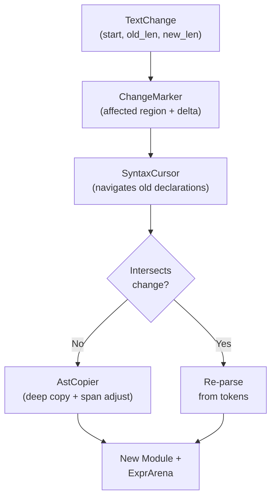
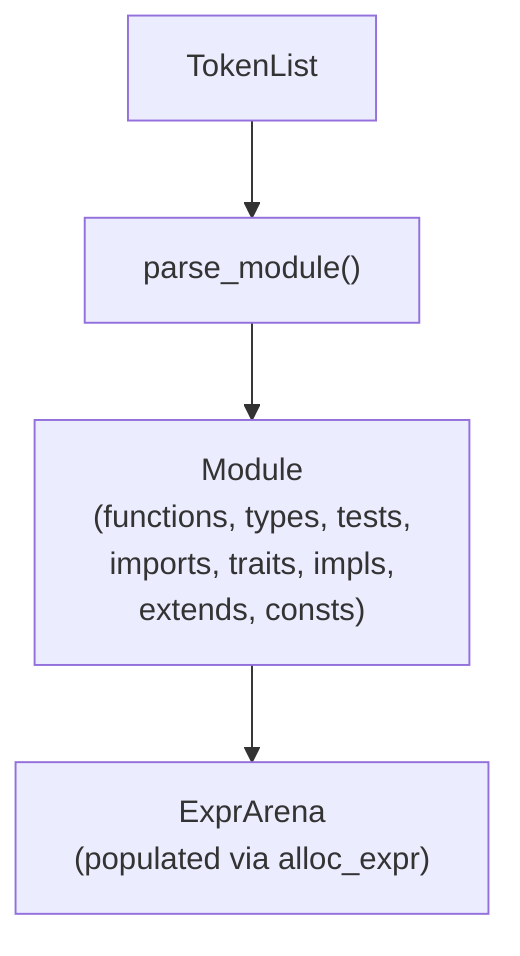

# Parser Overview

The Ori parser transforms a token stream into a flat, arena-allocated AST. It uses recursive descent with a Pratt parser for binary operator precedence and Elm-style four-way progress tracking for automatic backtracking.

## What Makes Ori's Parser Distinctive

### Pratt Parser with Static Operator Table

Most recursive descent parsers use one function per precedence level — 12+ levels means 12+ function calls per simple expression like `a + b`. Ori uses a Pratt parser: a single loop with a static 128-entry lookup table indexed by token discriminant. Each table entry stores left/right binding powers, operator variant, and token count. This provides O(1) operator lookup on the hottest path and reduces function call overhead from ~30 calls per expression to ~4.

```rust
// Single loop replaces 12 precedence-level functions
fn parse_binary_pratt(&mut self, min_bp: u8) -> Result<ExprId> {
    let mut left = self.parse_unary()?;
    loop {
        if let Some((l_bp, r_bp, op, token_count)) = self.infix_binding_power() {
            if l_bp < min_bp { break; }
            // advance token_count tokens, recurse with r_bp
        } else { break; }
    }
    Ok(left)
}
```

Associativity is encoded purely in the binding power gap: left-associative operators use `(even, odd)` so right operands bind tighter; right-associative use `(odd, even)` to allow right recursion.

### Four-Way Progress Tracking (Elm-Style)

Most parsers use `Result<T, E>` — success or failure. Ori tracks a second dimension: **whether input was consumed**. This creates four outcomes that drive automatic backtracking:

| Progress | Result | Variant | Recovery Strategy |
|----------|--------|---------|-------------------|
| Consumed | Ok | `ConsumedOk` | Committed — succeeded |
| Empty | Ok | `EmptyOk` | Optional content absent |
| Consumed | Err | `ConsumedErr` | **Hard error** — report, don't backtrack |
| Empty | Err | `EmptyErr` | **Soft error** — try next alternative |

The key insight (from Elm/Roc): if tokens were consumed before the error, the parser committed to a production — report the error. If nothing was consumed, silently try alternatives. This eliminates the need for manual lookahead in most cases.

Four macros build on `ParseOutcome`:
- **`one_of!`** — try alternatives, backtrack on soft errors, accumulate expected token sets
- **`try_outcome!`** — parse optional elements
- **`require!`** — upgrade soft errors to hard errors after commitment
- **`committed!`** — bridge `Result` to `ParseOutcome` post-commitment

### Compound Operator Synthesis from `>` Tokens

The lexer produces individual `>` tokens so that nested generics like `Result<Result<T, E>, E>` parse without special modes. The Pratt parser's `infix_binding_power()` synthesizes `>=` and `>>` from adjacent `>` tokens by checking span adjacency (no whitespace between them), returning `token_count = 2` to advance past both.

### Declaration-Level Incremental Parsing

When a user edits a file in an IDE, most declarations are unchanged. The parser identifies unaffected declarations by span position and copies them from the old AST with adjusted spans — only re-parsing declarations that overlap the edit region:



This gives O(k) parsing where k = changed declarations, versus O(n) for full reparse. Most IDE edits touch 1-2 declarations, so the majority of the file is reused.

### Bitset-Based Token Recovery

Error recovery uses `TokenSet(u128)` — a 128-bit bitfield where each bit maps to a `TokenKind` discriminant. Membership testing is O(1) via bit operations. Pre-defined recovery sets (`STMT_BOUNDARY`, `FUNCTION_BOUNDARY`) let the parser skip to the next meaningful position after an error, enabling multi-error reporting without cascading false errors.

### Cross-Language Transition Help

When the parser encounters keywords from other languages at declaration position, it produces targeted guidance:

| Foreign Keyword | Ori Guidance |
|----------------|-------------|
| `return` | Last expression is the block's value |
| `fn` / `func` / `function` | Use `@name (params) -> type = body` |
| `class` / `struct` | Use `type Name = { fields }` |
| `switch` | Use `match` |
| `while` | Use `loop` with `if`/`break` |

Lookup uses binary search over a sorted table. These identifiers remain valid in non-declaration positions.

## Performance

### Benchmark Results

Throughput measured via Criterion on generated Ori source (simple function declarations):

| Layer | Throughput | What It Measures |
|-------|-----------|-----------------|
| Lex + parse (`parser/raw`) | ~70–82 MiB/s | Full pipeline — lexing + parsing, no Salsa |
| Parse only (`parser_only`) | ~150–154 MiB/s | Parser alone — tokens already lexed |

The parse-only throughput shows the parser itself runs at ~150 MiB/s. The combined lex+parse number (~75 MiB/s) reflects that lexing and parsing run sequentially within a single pass.

### Running Benchmarks

```bash
# Lex + parse throughput (no Salsa)
cargo bench -p oric --bench parser -- "raw/throughput"

# Parser-only throughput (tokens pre-lexed)
cargo bench -p oric --bench parser -- "raw/parser_only"

# Incremental vs full reparse
cargo bench -p oric --bench parser -- "incremental"

# Run sequentially — CPU contention skews throughput results
```

## Parser Structure

```rust
pub struct Parser<'a> {
    cursor: Cursor<'a>,        // Token navigation
    arena: ExprArena,          // Flat AST storage (SoA layout)
    context: ParseContext,     // Context flags (u16 bitfield)
}
```

**Context flags** affect how tokens are interpreted. `NO_STRUCT_LIT` prevents `{ ... }` from being parsed as a struct literal inside `if` conditions. `IN_TYPE` makes `>` close a generic parameter list instead of comparing. `PIPE_IS_SEPARATOR` makes `|` act as a message separator in `pre()`/`post()` contracts.

## Parsing Flow



## Public API

Three entry points share the same core logic:

| Entry Point | Returns | Used By |
|-------------|---------|---------|
| `parse()` | `ParseOutput` | Compiler pipeline |
| `parse_with_metadata()` | `ParseOutput` + comments/trivia | Formatter, LSP |
| `parse_incremental()` | `ParseOutput` (reuses unchanged decls) | IDE |

## Expression Precedence

Binary operators are listed from highest to lowest precedence (Level 1 binds tightest). See [Pratt Parser](pratt-parser.md) for the binding power model.

| Level | Operators | Associativity |
|-------|-----------|---------------|
| 1 | `.` `[]` `()` `?` `as` `as?` | Left (postfix) |
| 2 | `**` | Right |
| 3 | `!` `-` `~` | Right (unary) |
| 4 | `*` `/` `%` `div` `@` | Left |
| 5 | `+` `-` | Left |
| 6 | `<<` `>>` | Left |
| 7 | `..` `..=` `by` | Non-associative |
| 8 | `<` `>` `<=` `>=` | Left |
| 9 | `==` `!=` | Left |
| 10 | `&` | Left |
| 11 | `^` | Left |
| 12 | `\|` | Left |
| 13 | `&&` | Left |
| 14 | `\|\|` | Left |
| 15 | `??` | Right |
| 16 | `\|>` | Left |

**Note:** `>>` and `>=` are synthesized from adjacent `>` tokens. `**` (power) and `|>` (pipe) are defined in the grammar spec but not yet implemented — they have no token representation.

## Salsa Integration

The parser itself is pure logic with no Salsa dependency — it takes a `TokenList` and returns a `ParseOutput`. The `oric` crate wraps this in a tracked query:

```rust
#[salsa::tracked]
pub fn parsed(db: &dyn Db, file: SourceFile) -> ParseOutput {
    let toks = tokens(db, file);
    parser::parse(&toks, db.interner())
}
```

## Related Documents

- [Pratt Parser](pratt-parser.md) — Binding power table and operator precedence
- [Error Recovery](error-recovery.md) — ParseOutcome, TokenSet, synchronization
- [Grammar Modules](grammar-modules.md) — Module organization and naming
- [Incremental Parsing](incremental-parsing.md) — IDE reuse of unchanged declarations
- [Grammar Spec](https://github.com/upstat-io/ori-lang/blob/master/docs/ori_lang/0.1-alpha/spec/grammar.ebnf) — Complete EBNF grammar definition
