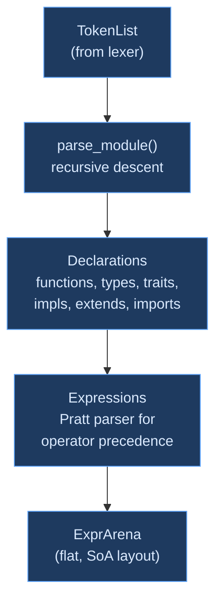

# Parsing

## What Is Parsing?

**Parsing** (or **syntactic analysis**) is the compiler phase that transforms a flat sequence of tokens into a structured tree representing the program's grammatical structure. Where the lexer answers "what are the words?", the parser answers "what do the words mean together?"

```ori
@factorial (n: int) -> int = match n {
    0 -> 1,
    n -> n * factorial(n: n - 1),
}
```

The lexer sees this as a flat sequence of tokens: `@`, `factorial`, `(`, `n`, `:`, `int`, `)`, `->`, `int`, `=`, `match`, `n`, `{`, `0`, `->`, `1`, `,`, `n`, `->`, `n`, `*`, `factorial`, `(`, `n`, `:`, `n`, `-`, `1`, `)`, `,`, `}`. The parser recognizes that `@factorial` begins a function declaration, that `(n: int)` is a parameter list, that `match n { ... }` is a match expression with two arms, and that `n * factorial(n: n - 1)` is a multiplication where the right operand is a recursive function call with a named argument. It builds a tree that encodes this nesting structure — expressions inside match arms, match arms inside a match expression, the match expression as the function body.

This is the fundamental job of every parser: take a linear token stream and recover the hierarchical structure that the programmer intended. The structure is defined by a **grammar** — a formal set of rules specifying which token sequences are valid programs and how they nest.

### Why Parse?

Without a parser, every downstream phase — type checking, optimization, code generation — would have to reconstruct the program's structure from the token stream every time it needed to ask "what is the right-hand side of this assignment?" or "what are the arguments to this function call?" Parsing computes this structure once and makes it available to all subsequent phases through a structured representation.

Parsing also serves as the compiler's **syntax validator**. While the lexer ensures that individual tokens are well-formed (no unterminated strings, no invalid numeric literals), the parser ensures that tokens combine in ways the grammar allows. It catches errors like missing closing brackets, operators without operands, declarations in the wrong position, and keywords used where expressions are expected. Good parsers report these errors precisely and recover gracefully, continuing to parse the rest of the file so the user sees all syntax errors at once rather than fixing them one at a time.

### The Parser's Contract

A correct parser establishes two guarantees for downstream phases:

1. **Structural validity** — every node in the output tree conforms to the grammar. If the parser produces a function node, that node has a name, parameter list, return type, and body in the correct positions.
2. **Span preservation** — every node carries a source span (byte offset range) that points back to the original text. When the type checker reports an error on an expression, the span tells the user exactly where that expression appears in their source file.

The parser does not check whether variable names are defined, whether types match, or whether functions exist — those are the jobs of name resolution and type checking. The parser's scope is purely syntactic: does this sequence of tokens form a valid program according to the grammar?

## Classical Approaches to Parsing

### Top-Down: Recursive Descent

The most common approach in production compilers is **recursive descent** parsing. Each grammar rule becomes a function: `parse_function()` calls `parse_params()` which calls `parse_type()`, mirroring the grammar's structure directly in code. The parser starts at the top-level rule and descends into sub-rules, consuming tokens as it goes.

Recursive descent is popular because it is transparent — the code reads like the grammar, making it easy to understand, debug, and extend. Error messages can be precise because the parser knows exactly which grammar rule it is in when an error occurs. Recovery strategies can be tailored per rule.

The challenge with recursive descent is **operator precedence**. An expression like `a + b * c` must parse as `a + (b * c)` because multiplication binds tighter than addition. The textbook solution is a chain of functions, one per precedence level: `parse_additive()` calls `parse_multiplicative()`, which calls `parse_unary()`, which calls `parse_primary()`. A language with 16 precedence levels needs 16 mutually recursive functions, and a simple expression like `a + b` descends through all of them — calling 16+ functions just to discover that only one operator is present.

[Rust](https://github.com/rust-lang/rust), [Go](https://github.com/golang/go), [Zig](https://github.com/ziglang/zig), [TypeScript](https://github.com/microsoft/TypeScript), [Clang](https://github.com/llvm/llvm-project), [Swift](https://github.com/swiftlang/swift), [Gleam](https://github.com/gleam-lang/gleam), and [Roc](https://github.com/roc-lang/roc) all use hand-written recursive descent parsers.

### Top-Down: Pratt Parsing

Vaughan Pratt's 1973 paper ["Top Down Operator Precedence"](https://dl.acm.org/doi/10.1145/512927.512931) introduced an alternative to the precedence-level function chain. Instead of one function per precedence level, a Pratt parser uses a single loop that consults a **binding power table** to decide whether an operator should capture the current expression or yield to a higher-precedence caller. The entire precedence hierarchy collapses into one function and a data table.

Pratt parsing is a specialization of recursive descent — the parser is still recursive descent for declarations, statements, and non-expression constructs, but switches to the Pratt loop for expressions where precedence matters. This hybrid approach gives the readability of recursive descent where it matters (declarations are complex but have no precedence) and the efficiency of table-driven parsing where it matters (expressions have deep precedence but regular structure).

See [Pratt Parser](pratt-parser.md) for a full treatment of Ori's binding power model.

### Bottom-Up: LR and LALR

**LR parsing** (and its practical variant LALR) works bottom-up: it reads tokens left to right, accumulates them on a stack, and reduces groups of tokens into grammar rules when a complete right-hand side is recognized. Parser generators like [Yacc](https://en.wikipedia.org/wiki/Yacc), [Bison](https://www.gnu.org/software/bison/), and [tree-sitter](https://tree-sitter.github.io/tree-sitter/) generate LR parsers from grammar specifications.

LR parsers handle a wider class of grammars than recursive descent (including left-recursive grammars), and the generated tables guarantee parsing in linear time. The tradeoff is opacity: the generated state machine is difficult to debug, error messages default to unhelpful "syntax error at token X" unless the compiler writer invests significant effort in error recovery hooks, and context-sensitive behavior (like Ori's `>` token meaning different things in type and expression contexts) requires grammar modifications that can be non-obvious.

[Tree-sitter](https://tree-sitter.github.io/tree-sitter/) deserves special mention as a modern LR parser generator designed for incremental parsing in editors. It produces concrete syntax trees (CSTs) that preserve every token including whitespace and comments, supports error recovery by design, and can reparse only the changed portions of a file. Its approach to incrementality — tracking affected ranges in the parse tree and re-running only the affected parse states — is the state of the art for editor-integrated parsing.

### Parser Combinators

**Parser combinators** (used in Haskell's [Parsec](https://hackage.haskell.org/package/parsec) and its descendants [Megaparsec](https://hackage.haskell.org/package/megaparsec), as well as Rust's [nom](https://github.com/rust-bakery/nom) and [chumsky](https://github.com/zesterer/chumsky)) compose small parsing functions using higher-order combinators like `many`, `choice`, `map`, and `then`. The result reads like a grammar specification embedded in the host language.

The key innovation in the parser combinator lineage is **progress tracking**. Parsec (2001) introduced the distinction between parsers that consumed input and parsers that did not, using this to decide when to backtrack. If a parser consumed tokens before failing, it has committed to a parse path and should report the error; if it consumed nothing, it should silently try the next alternative. This idea — which Parsec called "consumed" vs "empty" — was refined by [Elm](https://github.com/elm/parser) into a cleaner four-way model that Ori adopts.

### PEG (Parsing Expression Grammars)

[PEGs](https://bford.info/pub/lang/peg.pdf) (Bryan Ford, 2004) use ordered choice (`/`) instead of unordered alternation (`|`), eliminating ambiguity by always trying alternatives in order and committing to the first match. This makes PEGs unambiguous by construction, but the ordered choice semantics can be surprising — reordering alternatives changes parsing behavior — and PEGs cannot express left-recursive grammars directly.

[Packrat parsing](https://bford.info/pub/lang/packrat-icfp02.pdf) memoizes PEG parsing for guaranteed linear time, at the cost of O(n) memory for the memoization table.

## What Makes Ori's Parser Distinctive

### Pratt Parser with Static Operator Table

Most recursive descent parsers use one function per precedence level — 16 levels means 16 function calls per simple expression like `a + b`. Ori uses a Pratt parser: a single loop with a static 128-entry lookup table indexed by token discriminant. Each table entry stores left/right binding powers, operator variant, and token count. This provides O(1) operator lookup on the hottest path and reduces function call overhead from ~30 calls per expression to ~4.

Associativity is encoded purely in the binding power gap: left-associative operators use `(even, odd)` so right operands bind tighter; right-associative use `(odd, even)` to allow right recursion. The table is a compile-time constant — no runtime allocation, no hash lookups.

### Four-Way Progress Tracking

Most parsers use `Result<T, E>` — success or failure. Ori tracks a second dimension borrowed from the [Elm parser](https://github.com/elm/parser) lineage: **whether input was consumed**. This creates four outcomes that drive automatic backtracking:

| Progress | Result | Variant | Recovery Strategy |
|----------|--------|---------|-------------------|
| Consumed | Ok | `ConsumedOk` | Committed — succeeded |
| Empty | Ok | `EmptyOk` | Optional content absent |
| Consumed | Err | `ConsumedErr` | **Hard error** — report, don't backtrack |
| Empty | Err | `EmptyErr` | **Soft error** — try next alternative |

The key insight: if tokens were consumed before the error, the parser committed to a production — report the error. If nothing was consumed, silently try alternatives. This eliminates the need for manual lookahead in most cases and prevents cascading false errors.

Four macros build on `ParseOutcome` for clean backtracking logic: `one_of!` (try alternatives), `try_outcome!` (optional elements), `require!` (mandatory elements after commitment), and `committed!` (bridge from `Result` to `ParseOutcome` post-commitment).

See [Error Recovery](error-recovery.md) for the full treatment.

### Compound Operator Synthesis

The lexer produces individual `>` tokens so that nested generics like `Result<Result<T, E>, E>` parse without special lexer modes. In expression context, the Pratt parser's `infix_binding_power()` synthesizes `>=` and `>>` from adjacent `>` tokens by checking span adjacency (no whitespace between them), returning `token_count = 2` to advance past both.

This is the same strategy used by [Rust](https://github.com/rust-lang/rust) and [Swift](https://github.com/swiftlang/swift) — the lexer stays simple, and the parser handles the context-sensitive reinterpretation.

### Declaration-Level Incremental Parsing

When a user edits a file in an IDE, most declarations are unchanged. The parser identifies unaffected declarations by span position and deep-copies them from the old AST with adjusted spans — only re-parsing declarations that overlap the edit region. This gives O(k) parsing where k = changed declarations, versus O(n) for full reparse.

This operates below [Salsa](https://github.com/salsa-rs/salsa)'s file-level caching — Salsa handles cross-file dependencies, the incremental parser handles intra-file reuse. See [Incremental Parsing](incremental-parsing.md) for the full design.

### Bitset-Based Token Recovery

Error recovery uses `TokenSet` — a bitfield where each bit maps to a `TokenKind` discriminant. Membership testing is O(1) via bit operations. Pre-defined recovery sets (`STMT_BOUNDARY`, `FUNCTION_BOUNDARY`) let the parser skip to the next meaningful position after an error, enabling multi-error reporting without cascading false errors.

### Cross-Language Transition Help

When the parser encounters keywords from other languages at declaration position, it produces targeted guidance rather than a generic "unexpected token" error:

| Foreign Keyword | Ori Guidance |
|----------------|-------------|
| `return` | Last expression is the block's value |
| `fn` / `func` / `function` | Use `@name (params) -> type = body` |
| `class` / `struct` | Use `type Name = { fields }` |
| `switch` | Use `match` |
| `while` | Use `loop` with `if`/`break` |

These identifiers remain valid in non-declaration positions — the error is only emitted where a top-level declaration is expected.

## Architecture

### Parser State

```rust
pub struct Parser<'a> {
    cursor: Cursor<'a>,        // Token navigation with dense tags
    arena: ExprArena,          // Flat AST storage (SoA layout)
    context: ParseContext,     // Context flags (u16 bitfield)
}
```

The `Cursor` maintains parallel arrays — a dense `u8` tag array alongside the full `TokenList` — for O(1) discriminant checks without reading the full 16-byte `TokenKind`. The `ExprArena` uses struct-of-arrays layout for cache-friendly iteration (see [Arena Allocation](../02-intermediate-representation/arena-allocation.md)). The `ParseContext` bitfield tracks syntactic context: `NO_STRUCT_LIT` prevents `{ ... }` from being parsed as a struct literal inside `if` conditions, `IN_TYPE` makes `>` close a generic parameter list, `PIPE_IS_SEPARATOR` makes `|` act as a message separator in contracts.

### Parsing Flow



### Public API

Three entry points share the same core logic:

| Entry Point | Returns | Used By |
|-------------|---------|---------|
| `parse()` | `ParseOutput` | Compiler pipeline |
| `parse_with_metadata()` | `ParseOutput` + comments/trivia | Formatter, LSP |
| `parse_incremental()` | `ParseOutput` (reuses unchanged decls) | IDE |

All entry points produce a `ParseOutput` containing the `Module` (declaration lists), the populated `ExprArena`, and accumulated parse errors. The parser itself has no Salsa dependency — it takes a `TokenList` and returns a `ParseOutput`. The `oric` crate wraps this in a tracked query:

```rust
#[salsa::tracked]
pub fn parsed(db: &dyn Db, file: SourceFile) -> ParseOutput {
    let toks = tokens(db, file);
    parser::parse(&toks, db.interner())
}
```

## Expression Precedence

Binary operators from highest to lowest precedence (Level 1 binds tightest). See [Pratt Parser](pratt-parser.md) for the binding power model.

| Level | Operators | Associativity |
|-------|-----------|---------------|
| 1 | `.` `[]` `()` `?` `as` `as?` | Left (postfix) |
| 2 | `**` | Right |
| 3 | `!` `-` `~` | Right (unary) |
| 4 | `*` `/` `%` `div` `@` | Left |
| 5 | `+` `-` | Left |
| 6 | `<<` `>>` | Left |
| 7 | `..` `..=` `by` | Non-associative |
| 8 | `<` `>` `<=` `>=` | Left |
| 9 | `==` `!=` | Left |
| 10 | `&` | Left |
| 11 | `^` | Left |
| 12 | `\|` | Left |
| 13 | `&&` | Left |
| 14 | `\|\|` | Left |
| 15 | `??` | Right |
| 16 | `\|>` | Left |

## Performance

Throughput measured via Criterion on generated Ori source:

| Layer | Throughput | What It Measures |
|-------|-----------|-----------------|
| Lex + parse (`parser/raw`) | ~70–82 MiB/s | Full pipeline — lexing + parsing, no Salsa |
| Parse only (`parser_only`) | ~150–154 MiB/s | Parser alone — tokens already lexed |

The parse-only throughput shows the parser itself runs at ~150 MiB/s. The combined lex+parse number (~75 MiB/s) reflects that lexing and parsing run sequentially within a single pass.

```bash
cargo bench -p oric --bench parser -- "raw/throughput"       # Lex + parse
cargo bench -p oric --bench parser -- "raw/parser_only"      # Parser only
cargo bench -p oric --bench parser -- "incremental"          # Incremental vs full
```

## Prior Art

| Compiler | Parser Strategy | Key Insight |
|----------|----------------|-------------|
| [Rust](https://github.com/rust-lang/rust) | Hand-written recursive descent with precedence climbing. Turbofish (`::<>`) disambiguation via context-sensitive lookahead. | Even a very complex grammar (lifetimes, closures, patterns) can be handled by recursive descent with enough care. |
| [Go](https://github.com/golang/go) | Hand-written recursive descent with Pratt-style expression parsing. Deliberately simple grammar — semicolon insertion in the lexer. | Simplicity is a feature — Go's grammar is small enough that the entire parser fits in a few files. |
| [Zig](https://github.com/ziglang/zig) | Hand-written recursive descent with explicit state machine for expressions. Uses a flat AST (multi-array list) rather than heap-allocated tree nodes. | Zig pioneered the flat AST design that Ori's `ExprArena` follows — parallel arrays indexed by node ID, avoiding pointer chasing. |
| [TypeScript](https://github.com/microsoft/TypeScript) | Hand-written recursive descent. Full incremental reuse: unchanged subtrees shared between old and new parse trees via immutable data structures. | Designed for IDE-first compilation, prioritizing incremental updates over raw throughput. |
| [Elm](https://github.com/elm/parser) | Parser combinator library with four-way `Step` type (consumed/empty × ok/err). Designed for excellent error messages. | Elm's progress tracking model is the direct ancestor of Ori's `ParseOutcome`. The insight that "consumed + error = committed" vs "empty + error = try alternative" eliminates most manual lookahead. |
| [Roc](https://github.com/roc-lang/roc) | Hand-written recursive descent inspired by Elm's parser combinators. Rich error recovery with suggestions. | Roc applies Elm's parser combinator ideas in a hand-written parser, showing the progress tracking concept generalizes beyond combinator libraries. |
| [Roslyn](https://github.com/dotnet/roslyn) (C#) | Hand-written recursive descent with red-green tree — immutable green nodes for structure, red wrappers for parent pointers. Full incremental reuse. | The gold standard for IDE-oriented parsing — immutable structure enables safe sharing between parse versions. |
| [tree-sitter](https://tree-sitter.github.io/tree-sitter/) | GLR parser generator with incremental parsing. Produces concrete syntax trees. Reparses only affected parse states after an edit. | Finest-grained incremental reuse at the parse state level, but requires an LR grammar, limiting context-sensitive error recovery. |
| [GHC](https://gitlab.haskell.org/ghc/ghc) (Haskell) | [Happy](https://haskell-happy.readthedocs.io/en/latest/)-generated LALR parser with a hand-written lexer. Layout rules handled by the lexer inserting virtual tokens. | Parser generators can work for complex languages, but the generated parser is augmented with significant hand-written code. |
| [Clang](https://github.com/llvm/llvm-project) (C/C++) | Hand-written recursive descent. Handles C++'s notoriously ambiguous grammar with extensive lookahead and disambiguation. | Even the most complex grammar in common use (C++) can be handled by recursive descent. |

## Related Documents

- [Pratt Parser](pratt-parser.md) — Binding power table and operator precedence
- [Error Recovery](error-recovery.md) — ParseOutcome, TokenSet, synchronization
- [Grammar Modules](grammar-modules.md) — Module organization and naming
- [Incremental Parsing](incremental-parsing.md) — IDE reuse of unchanged declarations
