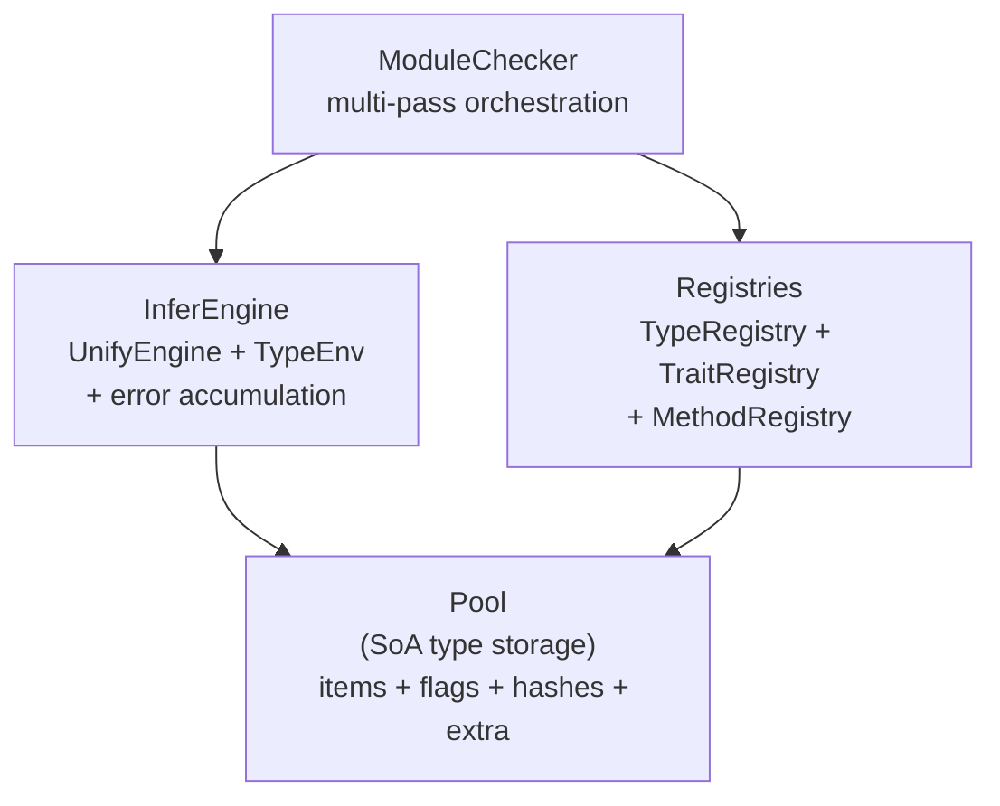
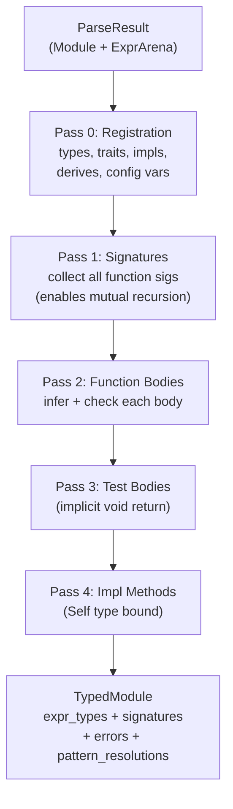

# Type System Overview

The Ori type system provides strict static typing with Hindley-Milner type inference, extended with rank-based let-polymorphism, capability tracking, and user-defined types. The entire type system lives in a single crate, `ori_types`, built around a unified pool architecture.

## What Makes Ori's Type System Distinctive

### Pool-Based Type Interning

Traditional type systems use recursive `enum` types with heap allocation (`Box<Type>`, `Vec<Type>`). Ori stores all types in a flat pool using a Structure-of-Arrays layout, where each type is a 5-byte `Item(Tag, u32)` referenced by a 4-byte `Idx` handle:

```rust
pub struct Pool {
    items: Vec<Item>,              // tag + data per type
    flags: Vec<TypeFlags>,         // pre-computed metadata
    hashes: Vec<u64>,              // for dedup verification
    extra: Vec<u32>,               // variable-length data (func params, tuple elems)
    intern_map: FxHashMap<u64, Idx>,  // hash → Idx deduplication
    var_states: Vec<VarState>,     // type variable state (separate from items)
}
```

Every unique type exists exactly once — same `Idx` means same type, giving O(1) equality. Cache locality is excellent: the hot `items` array is densely packed 5-byte entries. Variable-length data (function parameters, tuple elements) lives in the `extra` array, keeping `Item` fixed-size.

Inspired by Zig's `InternPool` and Roc's type storage.

### Tag-Driven Dispatch with O(1) TypeFlags

Every type carries a 1-byte `Tag` discriminant (organized by semantic range: primitives 0–15, containers 16–47, complex types 48–79, variables 96–111) and a pre-computed `TypeFlags(u32)` bitfield. Flags propagate from children to parents during construction via `PROPAGATE_MASK`, enabling powerful O(1) queries without traversal:

```rust
// Skip occurs check if type has no variables — O(1)
if !pool.flags(idx).contains(TypeFlags::HAS_VAR) {
    return false;
}
```

Flag categories: **presence** (`HAS_VAR`, `HAS_ERROR`, `HAS_INFER`), **category** (`IS_PRIMITIVE`, `IS_CONTAINER`, `IS_FUNCTION`), **optimization** (`NEEDS_SUBST`, `IS_RESOLVED`, `IS_MONO`), **capability** (`HAS_CAPABILITY`, `IS_PURE`, `HAS_IO`).

### Link-Based Union-Find (Not Substitution Maps)

Textbook HM implementations use a substitution map (`HashMap<VarId, Type>`) that grows monotonically. Ori uses **direct linking** through the pool's `VarState` — when variable `T0` unifies with `int`, the engine sets `var_states[T0] = Link { target: Idx::INT }`. No separate map needed. Path compression during `resolve()` achieves O(α(n)) amortized complexity.

### Rank-Based Let-Polymorphism

Type variables are created at a scope-depth rank (`Rank(u16)`). When exiting a `let` binding scope, unbound variables at the current rank are generalized into type schemes. This is simpler and more efficient than the level-based approach used in some implementations:

```
Rank 2 (module level):
  let id = x -> x         ← infer at rank 3
                           ← generalize at rank 3: forall T. T -> T
  let a = id(42)           ← instantiate with fresh vars at rank 2
  let b = id("hello")      ← instantiate with fresh vars at rank 2
```

### Immediate Unification

Constraints are solved as they are generated during AST traversal, not collected and solved later. This simplifies the implementation while fully supporting HM inference — errors are reported at the point of occurrence, and substitutions are available immediately for subsequent inference.

### Capability Tracking in the Type System

Side effects are tracked as capabilities on function types. The `InferEngine` maintains two capability sets — `current_capabilities` (from the function's `uses` clause) and `provided_capabilities` (from `with...in` expressions) — and verifies capability availability at each call site.

## Architecture



### Multi-Pass Type Checking



## Core Types

### Idx — The Canonical Type Handle

Every type is a 4-byte `Idx(u32)`. Primitive types occupy fixed indices 0–11:

| Index | Type | Index | Type |
|-------|------|-------|------|
| 0 | `int` | 6 | `()` (unit) |
| 1 | `float` | 7 | `Never` |
| 2 | `bool` | 8 | `Error` |
| 3 | `str` | 9 | `Duration` |
| 4 | `char` | 10 | `Size` |
| 5 | `byte` | 11 | `Ordering` |

Indices 12–63 are reserved. Dynamic types start at index 64.

### Tag — Type Kind Discriminant

1-byte discriminant organized by semantic range:

| Range | Category | Examples |
|-------|----------|---------|
| 0–15 | Primitives | `Int`, `Float`, `Bool`, `Str`, `Unit`, `Never` |
| 16–31 | Simple containers | `List`, `Option`, `Set`, `Channel`, `Range` |
| 32–47 | Two-child containers | `Map`, `Result` |
| 48–79 | Complex types | `Function`, `Tuple`, `Struct`, `Enum` |
| 80–95 | Named types | `Named`, `Applied`, `Alias` |
| 96–111 | Type variables | `Var`, `BoundVar`, `RigidVar` |

## TypeCheckResult

The top-level result wraps `TypedModule` with an `ErrorGuaranteed` token — a compile-time proof that error reporting was not forgotten (pattern from rustc):

```rust
pub struct TypeCheckResult {
    pub typed: TypedModule,
    pub error_guarantee: Option<ErrorGuaranteed>,
}
```

`ErrorGuaranteed` is `Some` when at least one error was emitted. Downstream code cannot accidentally ignore type errors.

## Method Resolution

Method calls resolve through a three-level dispatch:

1. **Built-in methods** — Compiler-defined methods on primitive/container types (dispatches on type tag + method name)
2. **Inherent methods** — `impl Type { ... }` blocks
3. **Trait methods** — `impl Trait for Type { ... }` blocks

The `TYPECK_BUILTIN_METHODS` constant array (~100+ entries, sorted by type and method name) serves as the manifest of all built-in methods.

## Type Rules

### Literals

```
42      : int       3.14    : float
"hello" : str       true    : bool
'a'     : char      ()      : ()
[]      : [T]       5s      : Duration
```

### Binary Operations

```
int + int       → int       (primitive fast path)
str + str       → str       (concatenation)
T == T          → bool      (where T: Eq)
T + U           → T::Output (where T: Add<U>)
```

### Conditionals

```
if cond then t else e
  cond : bool
  t, e : T (branches unified)
  result : T
```

## Salsa Compatibility

All exported types derive `Clone, Eq, PartialEq, Hash, Debug`. Compile-time assertions verify compatibility:

```rust
assert_salsa_compatible!(Idx, Tag, TypeFlags, Rank);
assert_salsa_compatible!(TypedModule, FunctionSig, TypeCheckError);
```

## Related Documents

- [Pool Architecture](pool-architecture.md) — SoA storage, interning, type construction
- [Type Inference](type-inference.md) — InferEngine, expression inference
- [Unification](unification.md) — Union-find, rank system, occurs check
- [Type Environment](type-environment.md) — Scope chain, name resolution
- [Type Registry](type-registry.md) — User-defined types, traits, methods
