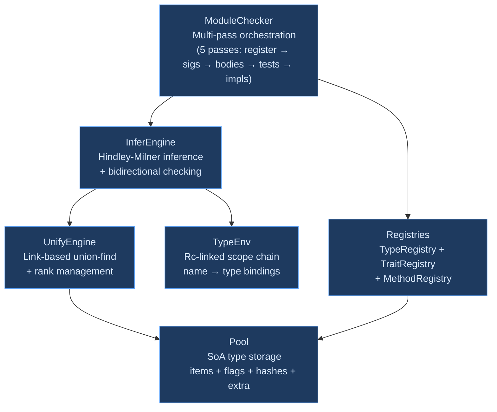
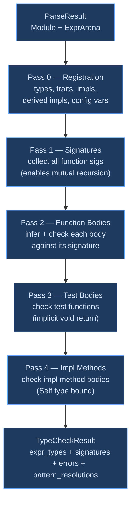

# Type System Overview

## What Is a Type System?

A **type system** is a set of rules that assigns a *type* — a classification like "integer," "string," or "function from integers to booleans" — to every expression in a program. The type checker enforces these rules at compile time, proving that certain classes of errors cannot occur at runtime before the program ever executes.

This idea has deep roots. Bertrand Russell introduced type theory in 1908 to resolve paradoxes in set theory (the famous "set of all sets that don't contain themselves"). Alonzo Church adapted it for the simply typed lambda calculus in 1940, proving that well-typed programs always terminate. By the 1970s, Robin Milner had developed a practical type system for the ML programming language that could *infer* types automatically — programmers didn't need to write type annotations on every expression. This Hindley-Milner (HM) type system, independently discovered by Roger Hindley in 1969 and formalized by Luis Damas and Robin Milner in 1982, became the foundation for type inference in ML, Haskell, OCaml, F#, Rust (partially), and now Ori.

### Why Static Types?

The fundamental promise of static typing is **early error detection**. Consider a function that computes the length of a list — calling it on an integer is meaningless, and a type system catches this at compile time rather than producing a confusing runtime error (or worse, silently doing the wrong thing). Beyond error detection, types serve as:

- **Documentation** — `(url: str, timeout: Duration) -> Result<str, Error>` communicates the function's contract more precisely than any comment
- **Optimization enablers** — knowing that a value is an `int` lets the compiler use machine integers and avoid boxing; knowing a function is pure enables parallelization
- **Refactoring safety nets** — changing a function's signature immediately reveals every call site that needs updating
- **IDE support** — types power autocompletion, go-to-definition, and inline documentation

The tradeoff is annotation burden. Languages with explicit types (C, Java, Go) require programmers to write types on every declaration. Type inference reduces this burden — in Ori, most types are inferred automatically, with annotations required only at function boundaries (and even there, return types can often be inferred).

### Approaches to Type System Design

Type system design involves several orthogonal choices. Understanding the design space clarifies why Ori chose the combination it did.

**Monomorphic vs. polymorphic.** A monomorphic type system (C, early Fortran) gives every expression exactly one type. A polymorphic system allows expressions to have multiple types — a function like `identity(x) = x` can work on integers, strings, and any other type. Polymorphism comes in several flavors:

- **Parametric polymorphism** (ML, Haskell, Ori) — functions are generic over type parameters: `identity<T>(x: T) -> T`. The function works identically regardless of `T`.
- **Ad-hoc polymorphism** (Haskell typeclasses, Rust traits, Ori traits) — different types can provide different implementations of the same interface: `Eq` means "supports equality," but integers and strings implement it differently.
- **Subtype polymorphism** (Java, C#, TypeScript) — a value of type `Cat` can be used wherever `Animal` is expected. Ori does not use subtyping (except for `Never`, the bottom type).

**Explicit vs. inferred.** Explicit type systems (Go, C) require programmers to annotate every binding. Inferred systems (ML, Haskell, Ori) deduce types from usage. Most modern languages blend: Ori infers types within function bodies but requires parameter type annotations at function boundaries (a practical sweet spot that keeps inference decidable while reducing annotation burden).

**Nominal vs. structural.** In a nominal system (Java, Ori), types are distinct if they have different names — `type UserId = int` creates a new type that is *not* interchangeable with `int`, even though they have identical representations. In a structural system (TypeScript, Go interfaces), types are compatible if their shapes match. Ori uses nominal typing for user-defined types, providing stronger guarantees about intent at the cost of occasional wrapping/unwrapping.

**Constraint generation vs. immediate solving.** Type inference must solve equations between types ("this expression should have the same type as that parameter"). The classical approach generates all constraints first, then solves them in a separate pass (Damas and Milner's Algorithm W works this way). An alternative is *immediate solving*: solve each constraint as it's generated during AST traversal. Ori uses immediate solving, which simplifies the implementation and gives better error locality — errors are reported at the point of occurrence rather than during a disconnected solving phase.

## What Makes Ori's Type System Distinctive

Ori's type system is a Hindley-Milner system with rank-based let-polymorphism, capability tracking, and user-defined types — but its *implementation* makes several distinctive choices that differ from the textbook approach.

### Pool-Based Type Interning

Traditional type system implementations use recursive `enum` types with heap allocation (`Box<Type>`, `Vec<Type>`). Every compound type — a function `(int, str) -> bool`, a list `[Option<int>]` — is a tree of heap-allocated nodes. Equality requires deep recursive comparison. Cloning requires deep recursive copying.

Ori replaces this with a **flat interning pool** using a Structure-of-Arrays layout. Every type in the program is stored exactly once in a contiguous array, referenced by a 4-byte `Idx` handle. Two types are equal if and only if their `Idx` values are equal — a single integer comparison. This design, inspired by [Zig](https://github.com/ziglang/zig)'s `InternPool` and [Roc](https://github.com/roc-lang/roc)'s type storage, provides:

- **O(1) type equality** — integer comparison instead of recursive tree comparison
- **Cache-friendly storage** — types are contiguous in memory, not scattered across the heap
- **Zero-copy Salsa compatibility** — `Idx` is `Copy + Eq + Hash`, satisfying Salsa's requirements trivially
- **Cheap metadata** — pre-computed `TypeFlags` bitfields answer common queries ("does this type contain variables?") without traversal

### Link-Based Union-Find

Textbook HM implementations use a substitution map (`HashMap<VarId, Type>`) that grows monotonically — when variable `T0` unifies with `int`, you record `T0 → int` in the map and consult it on every lookup. Ori instead uses **direct linking** through the pool's `VarState`: unifying `T0` with `int` sets `var_states[T0] = Link { target: Idx::INT }`. Path compression during resolution achieves O(α(n)) amortized complexity — effectively constant time. No separate map, no growing allocation, no hash table overhead.

### Tag-Driven Dispatch with O(1) TypeFlags

Every type carries a 1-byte `Tag` discriminant (organized by semantic range: primitives 0–15, containers 16–47, complex types 48–79, variables 96–111) and a pre-computed `TypeFlags(u32)` bitfield. Flags propagate from children to parents during construction via a `PROPAGATE_MASK`, enabling powerful optimizations without traversal:

```rust
// Skip occurs check if type has no variables — O(1)
if !pool.flags(idx).contains(TypeFlags::HAS_VAR) {
    return false;
}
```

The occurs check — which prevents infinite types like `T = [T]` — normally requires traversing the entire type structure. With propagated flags, the check is skipped entirely for monomorphic types, which is the overwhelmingly common case.

### Rank-Based Let-Polymorphism

Type variables are created at a scope-depth rank (`Rank(u16)`). When exiting a `let` binding scope, unbound variables at the current rank are generalized into type schemes — the mechanism that makes `let id = x -> x` polymorphic while `(x -> (x, x))(y -> y)` is not. This is the standard approach from Oleg Kiselyov's work on [efficient generalization](http://okmij.org/ftp/ML/generalization.html), simpler than the level-based approach used by some OCaml implementations.

### Immediate Unification

Constraints are solved as they are generated during AST traversal, not collected and solved later. This simplifies the implementation (no constraint storage or solver infrastructure) while fully supporting HM inference. The tradeoff is that error messages depend on traversal order — but in practice, Ori's error context tracking (which records *why* each type expectation arose) produces clear diagnostics regardless.

### Capability Tracking in Types

Side effects are tracked as capabilities on function types. The `InferEngine` maintains two capability sets — `current_capabilities` (from the function's `uses` clause) and `provided_capabilities` (from `with...in` expressions) — and verifies capability availability at each call site. This is an effect system embedded in the type checker, not a separate analysis.

## Architecture

The type system is organized into four layers, from storage at the bottom to module-level orchestration at the top:



**ModuleChecker** orchestrates the entire type checking process for a module. It owns the pool, registries, and environment, and creates a fresh `InferEngine` for each function body. The five-pass design enables mutual recursion (all signatures are collected before any body is checked) and separate compilation of tests and impl methods.

**InferEngine** implements bidirectional type inference. It synthesizes types bottom-up (`infer_expr`) and checks them top-down against expectations (`check_expr`). Each engine instance borrows the pool, registries, and environment from `ModuleChecker`, and accumulates errors and warnings independently.

**UnifyEngine** implements the core unification algorithm with link-based union-find, path compression, and rank-based generalization. It borrows the pool mutably to update `VarState` links during unification.

**Pool** is the central type storage. All types are interned here — primitives at fixed indices, compound types deduplicated by structural hash. The pool is append-only for types (new types are added, never removed) but mutable for variable state (links are updated during unification).

**TypeEnv** tracks name-to-type bindings using an `Rc`-linked parent chain. Child scopes are created in O(1) via cheap `Rc` cloning, and bindings are looked up by walking the parent chain.

**Registries** store user-defined types (`TypeRegistry`), trait definitions and implementations (`TraitRegistry`), and method resolution state (`MethodRegistry`). They are populated during Pass 0 and consulted during inference.

### Multi-Pass Type Checking

The type checker processes a module in five passes. This ordering ensures that forward references, mutual recursion, and trait implementations all resolve correctly:



**Pass 0 (Registration)** processes type declarations, trait definitions, `impl` blocks, `#derive` attributes, and module-level constants. This populates the registries before any inference begins. The order within Pass 0 matters: types are registered before traits (because traits reference types), traits before impls (because impls reference traits), and impls before derived impls (because derived impls may depend on user impls).

**Pass 1 (Signatures)** collects function signatures, creating type schemes for polymorphic functions. After this pass, every function in the module has a known signature, enabling mutual recursion — function `a` can call `b` and `b` can call `a`, because both signatures are available before either body is checked.

**Pass 2 (Function Bodies)** creates a fresh `InferEngine` for each function body, checks it against the collected signature, and accumulates the inferred expression types. This is where the bulk of type inference happens — expression dispatch, method resolution, pattern matching, and capability verification.

**Pass 3 (Test Bodies)** checks test function bodies. Tests have an implicit `void` return type and may use assertion functions from the standard library. They are checked after regular functions to ensure all tested functions have known types.

**Pass 4 (Impl Methods)** checks method bodies within `impl` blocks. These are deferred because they need the `Self` type bound — `impl Point { @distance(self) -> float }` needs to know that `self: Point` before checking the body.

## Core Types

### Idx — The Canonical Type Handle

Every type is a 4-byte `Idx(u32)`. Primitive types occupy fixed indices 0–11, enabling O(1) primitive checks:

| Index | Type | Index | Type |
|-------|------|-------|------|
| 0 | `int` | 6 | `()` (unit) |
| 1 | `float` | 7 | `Never` |
| 2 | `bool` | 8 | `Error` |
| 3 | `str` | 9 | `Duration` |
| 4 | `char` | 10 | `Size` |
| 5 | `byte` | 11 | `Ordering` |

Indices 12–63 are reserved for future built-in types. Dynamic (user-defined and compound) types start at index 64. Comparing a type to `int` is a single `idx == Idx::INT` comparison — no hash table lookup, no string comparison.

### Tag — Type Kind Discriminant

A 1-byte discriminant organized by semantic range, enabling range-based dispatch:

| Range | Category | Examples |
|-------|----------|---------|
| 0–15 | Primitives | `Int`, `Float`, `Bool`, `Str`, `Unit`, `Never` |
| 16–31 | Simple containers | `List`, `Option`, `Set`, `Channel`, `Range`, `Iterator` |
| 32–47 | Two-child containers | `Map`, `Result`, `Borrowed` |
| 48–79 | Complex types | `Function`, `Tuple`, `Struct`, `Enum` |
| 80–95 | Named types | `Named`, `Applied`, `Alias` |
| 96–111 | Type variables | `Var`, `BoundVar`, `RigidVar` |
| 112–127 | Schemes | `Scheme` |
| 240–255 | Special | `Projection`, `ModuleNs`, `Infer`, `SelfType` |

The range organization means `tag.is_primitive()` is a single comparison (`tag <= 15`), not a multi-arm match. Container tags store their child `Idx` directly in the `Item` data field for zero-indirection access. Complex types store an index into the `extra` array for variable-length data (function parameters, tuple elements).

### TypeCheckResult

The top-level result wraps `TypedModule` with an `ErrorGuaranteed` token — a compile-time proof that error reporting was not forgotten (pattern from [rustc](https://github.com/rust-lang/rust)):

```rust
pub struct TypeCheckResult {
    pub typed: TypedModule,
    pub error_guarantee: Option<ErrorGuaranteed>,
}
```

`ErrorGuaranteed` is `Some` when at least one error was emitted. Downstream code cannot accidentally ignore type errors — the type system encodes the fact that errors were handled.

## Method Resolution

Method calls resolve through a three-level dispatch, following the principle that more specific bindings take priority:

1. **Built-in methods** — Compiler-defined methods on primitive and container types, dispatched on type tag + method name. The `TYPECK_BUILTIN_METHODS` constant array (sorted alphabetically by type and method name) serves as the manifest of all ~100+ built-in methods.

2. **Inherent methods** — `impl Type { ... }` blocks that add methods directly to a type without going through a trait.

3. **Trait methods** — `impl Type: Trait { ... }` blocks, resolved via the `TraitRegistry`. When multiple traits provide a method with the same name, the caller must use qualified syntax (`Trait.method(v)`) to disambiguate.

This ordering means that a type's own methods always shadow trait methods, and built-in methods (which are critical for primitives like `str.len()` or `[T].map()`) take highest priority. The design mirrors Rust's method resolution order.

## Type Rules at a Glance

### Literals

```
42      : int       3.14    : float      "hello" : str
true    : bool      'a'     : char       ()      : ()
[]      : [T]       5s      : Duration   100kb   : Size
```

### Binary Operations

```
int + int       → int       (primitive fast path)
str + str       → str       (concatenation)
T == T          → bool      (where T: Eq)
T + U           → T::Output (where T: Add<U>)
T < T           → bool      (where T: Comparable, desugars to compare())
```

### Conditionals

```
if cond then t else e
  cond : bool
  t, e : T (branches unified)
  result : T
```

## Prior Art

Ori's type system draws from a long lineage of research and production implementations.

### Damas-Milner / Algorithm W

The [Damas-Milner type system](https://dl.acm.org/doi/10.1145/582153.582176) (1982) established the theoretical foundation for HM inference. Algorithm W walks the syntax tree, generating and solving type equations on the fly — essentially the approach Ori uses, enhanced with bidirectional checking and capability tracking. The key insight is that let-polymorphism (generalizing at `let` bindings but not at lambda abstractions) makes inference decidable while preserving most of the expressiveness of System F.

### Zig's InternPool

[Zig](https://github.com/ziglang/zig)'s compiler uses an `InternPool` (`src/InternPool.zig`) with a nearly identical architecture to Ori's `Pool`: all types stored in a flat array, referenced by indices, with separate extra storage for variable-length data. Zig's InternPool also handles values (compile-time known constants), which Ori separates into the `ConstantPool` in canonicalization. The Zig team's blog posts on [performance-oriented data structures](https://ziglang.org/blog/) influenced Ori's SoA layout decisions.

### rustc's Type System

[Rust's compiler](https://github.com/rust-lang/rust) uses `TyKind` (an enum) with `Ty` (an interned reference), combining recursive structure with deduplication. rustc's type interning influenced Ori's pool design, and its `ErrorGuaranteed` pattern for type-level error tracking was adopted directly. The multi-pass approach (macro expansion → name resolution → type checking → borrow checking) inspired Ori's five-pass structure, though Ori's passes are simpler since it lacks borrow checking.

### GHC's Type Checker

[GHC](https://gitlab.haskell.org/ghc/ghc)'s type checker handles a much more complex type system (higher-rank polymorphism, type families, GADTs, type-level computation) but uses the same fundamental approach: constraint generation during traversal, unification via mutable cells. GHC's treatment of rank-based polymorphism (the "level" system) directly influenced Ori's rank design, though Ori's restriction to rank-1 polymorphism makes the implementation substantially simpler.

### Lean 4's Type Checking

[Lean 4](https://github.com/leanprover/lean4)'s type checker operates on a dependently typed language, far more expressive than HM. However, its LCNF IR and the separation between type checking and code generation influenced Ori's architecture. Lean's approach of using a shared pool for type interning (analogous to Ori's `Pool`) and separate variable state (analogous to `VarState`) informed several design decisions.

### Elm and Roc — User-Facing Type Errors

[Elm](https://github.com/elm/compiler)'s type checker (in Haskell) pioneered the approach of treating type error messages as a first-class UX concern — every error includes a clear explanation, expected vs. actual types, and contextual suggestions. [Roc](https://github.com/roc-lang/roc) extended this with type diffing (showing only the parts of complex types that differ). Ori's error context tracking and suggestion system draw from both, though Ori's type diffing is still simpler than Roc's.

## Design Tradeoffs

**Immediate unification vs. constraint generation.** Ori solves constraints on the fly rather than collecting them first. This gives better error locality (errors at the point of occurrence) and simpler implementation (no constraint store), but means error quality can depend on traversal order. A constraint-based approach would allow the solver to choose the "best" error to report, potentially giving clearer diagnostics for complex type mismatches.

**Rank-1 polymorphism only.** Ori supports let-polymorphism but not higher-rank polymorphism (no `forall` in arbitrary positions). This keeps inference decidable and the implementation simple, but means some patterns (like passing a polymorphic function as an argument) require workarounds. The vast majority of practical programs work within rank-1.

**No subtyping.** Ori uses nominal types with trait-based polymorphism, not subtype polymorphism. This eliminates the complexity of variance annotations and subtype constraint solving, but means that `type UserId = int` creates a type that is *not* interchangeable with `int` — users must explicitly convert. The `Never` type is the sole exception (it's a subtype of everything, as the bottom type).

**Pool-based types are session-scoped.** Each compilation creates a fresh `Pool`, and `Idx` values are only meaningful within that pool. Cross-module type identity uses Merkle hashing (structural content hashing) rather than `Idx` comparison. This means pool indices are compact and cache-friendly, but cross-module type operations require re-interning.

## Related Documents

- [Pool Architecture](pool-architecture.md) — SoA storage, interning, type construction, TypeFlags
- [Type Inference](type-inference.md) — InferEngine, expression dispatch, bidirectional checking
- [Unification](unification.md) — Union-find, rank system, occurs check, path compression
- [Type Environment](type-environment.md) — Scope chain, name resolution, polymorphic bindings
- [Type Registry](type-registry.md) — User-defined types, traits, methods, impl resolution
