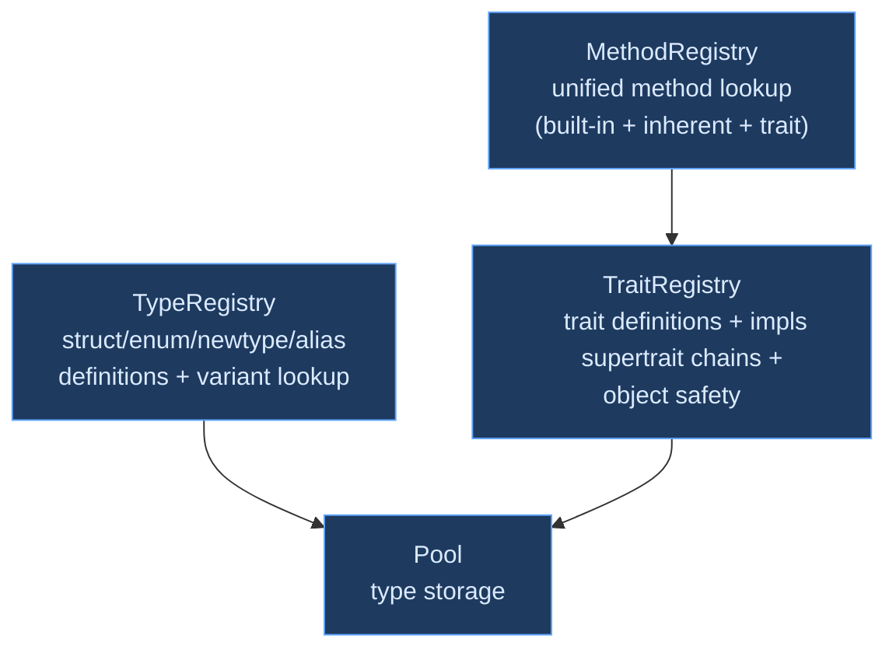
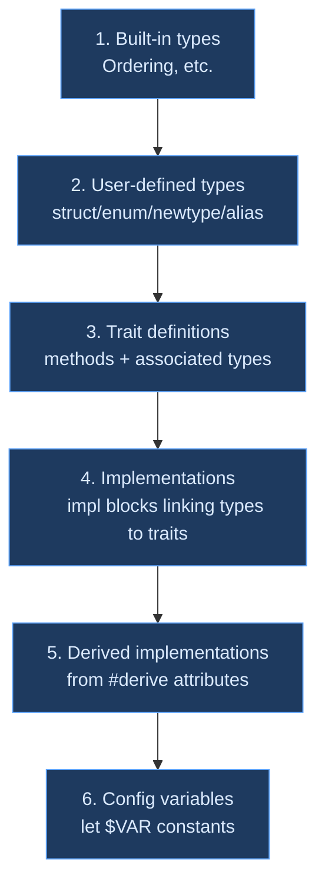

# Type Registry

## What Is a Type Registry?

A type pool stores *structural* types — `[int]`, `(str) -> bool`, `(int, float)`. But a real programming language also has *named* types: `type Point = { x: int, y: int }`, `type Option<T> = Some(T) | None`. These user-defined types need a registry that maps names to definitions, tracks fields and variants, and provides lookup for the type checker during inference.

Beyond types, most languages have **traits** (or interfaces, typeclasses, protocols) — named collections of methods that types can implement. And methods — both inherent (`impl Point { @distance ... }`) and trait-based (`impl Printable for Point { @to_str ... }`) — need a resolution system that finds the right method for a given receiver type.

The **type registry** is the data structure that organizes all of this: type definitions, trait definitions, trait implementations, and method resolution. It is populated during Pass 0 of type checking and consulted throughout the remaining passes.

### Nominal vs. Structural Typing

A fundamental decision in type system design is whether type identity is determined by *name* or by *structure*.

**Structural typing** (TypeScript, Go interfaces, OCaml structural objects): two types are compatible if they have the same shape. A function expecting `{ x: int, y: int }` accepts any value with fields `x: int` and `y: int`, regardless of what the type is called. This is flexible but makes it hard to distinguish semantically different types with the same shape — is `{ cents: int }` a price or a distance?

**Nominal typing** (Java, Rust, Ori): two types are compatible only if they have the same *name*. `type Price = { cents: int }` and `type Distance = { cents: int }` are different types even though they have identical fields. This is more restrictive but provides stronger guarantees about intent.

Ori uses **nominal typing** for all user-defined types. Even newtypes — `type UserId = int` — create a distinct type that is not interchangeable with the underlying representation. The `.inner` field provides access to the underlying value, and explicit construction (`UserId(42)`) is required. This trades convenience for safety: you cannot accidentally pass a `Temperature` where a `Count` is expected, even though both are `int` underneath.

### Traits as Bounded Polymorphism

Traits serve two purposes in Ori's type system:

1. **Ad-hoc polymorphism** — different types implement the same interface differently. `Printable` means "has a `to_str` method," but integers and lists implement it differently.

2. **Bounded generics** — constraining type parameters: `@sort<T: Comparable>(list: [T]) -> [T]` means `T` must support comparison. Without the bound, the function body couldn't call comparison operators on `T`.

This is the typeclass pattern from Haskell (Wadler and Blott, 1989), adapted through Rust's trait system. The key design choice is *explicit implementation* — a type doesn't satisfy a trait just because it has the right methods. It must explicitly `impl Trait for Type`, making the relationship visible in the source code.

## Three Registries

Ori uses three cooperating registries, each with a focused responsibility:



### TypeRegistry — User-Defined Types

```rust
pub struct TypeRegistry {
    types_by_name: BTreeMap<Name, TypeEntry>,     // Deterministic iteration
    types_by_idx: FxHashMap<Idx, TypeEntry>,       // Fast lookup by type Idx
    variants_by_name: FxHashMap<Name, (Idx, usize)>,  // Variant → (enum Idx, variant index)
}
```

`BTreeMap` for `types_by_name` ensures deterministic iteration order — important for reproducible error messages and stable test output. `FxHashMap` for `types_by_idx` provides fast lookup by pool index, the more common access pattern during inference.

### TraitRegistry — Traits and Implementations

```rust
pub struct TraitRegistry {
    traits: Vec<TraitEntry>,
    traits_by_name: BTreeMap<Name, usize>,
    traits_by_idx: FxHashMap<Idx, usize>,
    impls: Vec<ImplEntry>,
    impls_by_type: FxHashMap<Idx, Vec<usize>>,    // Self type → impl indices
    impls_by_trait: FxHashMap<Idx, Vec<usize>>,   // Trait → impl indices
}
```

The dual indexing (`impls_by_type` and `impls_by_trait`) enables efficient lookup from both directions: "what traits does `Point` implement?" and "what types implement `Printable`?"

### MethodRegistry — Unified Method Dispatch

```rust
pub struct MethodRegistry;
```

Currently a thin wrapper that delegates to `TraitRegistry` for trait-based method lookup. Built-in method resolution is handled separately by `resolve_builtin_method()` in the inference engine. The registry exists as an architectural placeholder for future unification of all method lookup paths into a single dispatch mechanism.

## Type Definitions

### TypeEntry

```rust
pub struct TypeEntry {
    pub name: Name,
    pub idx: Idx,
    pub kind: TypeKind,
    pub span: Span,
    pub type_params: Vec<Name>,
    pub visibility: Visibility,
}
```

Each entry carries the type's name, its pool index, its kind (struct, enum, newtype, or alias), its source location for error reporting, generic type parameters, and visibility.

### TypeKind

```rust
pub enum TypeKind {
    Struct(StructDef),
    Enum { variants: Vec<VariantDef> },
    Newtype { underlying: Idx },
    Alias { target: Idx },
}
```

**`Struct`** — a product type with named fields. `StructDef` contains `Vec<FieldDef>` where each field has a name, type `Idx`, span, and visibility. Fields can be individually public or private.

**`Enum`** — a sum type with named variants. Each `VariantDef` has a name and `VariantFields`:

```rust
pub enum VariantFields {
    Unit,                         // None, True — no data
    Tuple(Vec<Idx>),              // Some(int) — positional fields
    Record(Vec<FieldDef>),        // Point(x: int, y: int) — named fields
}
```

**`Newtype`** — a distinct type wrapping an existing type. `type UserId = int` creates a `Newtype` with `underlying = Idx::INT`. The newtype has nominal identity (it's not `int`), zero runtime cost (same representation), and provides `.inner` for unwrapping.

**`Alias`** — a transparent type synonym. Unlike newtypes, aliases are interchangeable with their target — `type Ints = [int]` means `Ints` and `[int]` are the same type. Aliases exist for readability, not for type safety.

### Visibility

```rust
pub enum Visibility {
    Public,   // Visible everywhere
    Private,  // Visible only within the defining module
}
```

The default is `Public`. Types, fields, methods, and trait implementations each carry their own `Visibility`. A public struct can have private fields — the struct is constructible from other modules, but private fields must go through constructor functions.

### Registration

Types are registered during Pass 0 of module checking. The caller creates the type in the pool first (obtaining an `Idx`), then registers the entry under both name and index:

```rust
impl TypeRegistry {
    pub fn register_struct(&mut self, name: Name, idx: Idx, type_params: Vec<Name>,
                           fields: Vec<FieldDef>, span: Span, visibility: Visibility);
    pub fn register_enum(&mut self, name: Name, idx: Idx, type_params: Vec<Name>,
                         variants: Vec<VariantDef>, span: Span, visibility: Visibility);
    pub fn register_newtype(&mut self, name: Name, idx: Idx, type_params: Vec<Name>,
                            underlying: Idx, span: Span, visibility: Visibility);
    pub fn register_alias(&mut self, name: Name, idx: Idx, type_params: Vec<Name>,
                          target: Idx, span: Span, visibility: Visibility);
}
```

Enum registration also populates `variants_by_name` — a reverse index from variant name to (enum `Idx`, variant position). This enables O(1) constructor resolution: when the type checker sees `Some(42)`, it looks up `Some` in `variants_by_name` to find that it belongs to `Option` at variant index 0.

### Lookup

```rust
impl TypeRegistry {
    pub fn get_by_name(&self, name: Name) -> Option<&TypeEntry>;
    pub fn get_by_idx(&self, idx: Idx) -> Option<&TypeEntry>;
    pub fn contains(&self, name: Name) -> bool;
    pub fn lookup_variant(&self, variant_name: Name) -> Option<(Idx, usize)>;
}
```

The variant lookup is critical for pattern matching. When the type checker processes `match value { Some(n) -> ..., None -> ... }`, it looks up each variant name to determine which enum it belongs to and what its discriminant index is (needed by LLVM codegen for `switch` instructions).

## Trait Definitions

### TraitEntry

```rust
pub struct TraitEntry {
    pub name: Name,
    pub idx: Idx,
    pub type_params: Vec<Name>,
    pub methods: FxHashMap<Name, TraitMethodDef>,
    pub assoc_types: FxHashMap<Name, TraitAssocTypeDef>,
    pub super_traits: Vec<Idx>,
    pub object_safety_violations: Vec<ObjectSafetyViolation>,
    pub span: Span,
}
```

**`super_traits`** lists the trait's supertrait `Idx` values. `Comparable` has `Eq` as a supertrait — implementing `Comparable` requires also implementing `Eq`. The `TraitRegistry` provides `all_super_traits()`, which performs a transitive BFS walk to collect the full supertrait closure, used to verify that an impl satisfies all inherited obligations.

**`assoc_types`** tracks associated type declarations. A trait like `Iterator` has `type Item` — the type of elements the iterator produces. Implementations must specify the concrete type: `impl Iterator for Range { type Item = int }`.

### Object Safety

Not every trait can be used as a trait object (dynamic dispatch via `Trait` as a type). The `object_safety_violations` field records why:

```rust
pub enum ObjectSafetyViolation {
    SelfReturn { method: Name, span: Span },    // Returns Self
    SelfParam { method: Name, span: Span },      // Self as non-receiver param
    GenericMethod { method: Name, span: Span },  // Method has type params
}
```

A trait is object-safe if it has no violations. Examples:

- **Object-safe**: `Printable` (`@to_str(self) -> str`), `Debug`, `Hashable`
- **Not object-safe**: `Clone` (`@clone(self) -> Self` — returns `Self`), `Eq` (`@equals(self, other: Self)` — `Self` in non-receiver position), `Iterator` (associated type `Item`)

Object safety is checked at trait definition time and cached in the entry, so later code can check object safety without re-analyzing the trait's methods.

### Default Type Parameters

Traits may have type parameters with defaults:

```ori
trait Add<Rhs = Self> {
    type Output = Self
    @add (self, rhs: Rhs) -> Self.Output
}
```

Default types are stored as `ParsedType` (not `Idx`) because `Self` must be resolved at impl registration time, not at trait definition time. When `impl Add for int` doesn't specify `Rhs`, the default `Self` resolves to `int`.

### Default Associated Types

When an impl omits an associated type that has a default, the default is used with `Self` resolved to the implementing type:

```ori
trait Add<Rhs = Self> {
    type Output = Self     // default: Output is Self
    @add (self, rhs: Rhs) -> Self.Output
}

impl Add for int {
    // Output defaults to int (Self = int)
    @add (self, rhs: int) -> int = { ... }
}
```

## Trait Implementations

### ImplEntry

```rust
pub struct ImplEntry {
    pub trait_idx: Option<Idx>,  // None for inherent impls
    pub self_type: Idx,
    pub type_params: Vec<Name>,
    pub methods: FxHashMap<Name, ImplMethodDef>,
    pub assoc_types: FxHashMap<Name, Idx>,
    pub where_clause: Vec<WhereConstraint>,
    pub span: Span,
}
```

**`trait_idx: None`** marks inherent impls (`impl Point { ... }`) — methods defined directly on a type without going through a trait. Inherent methods take priority over trait methods in resolution.

### Impl Lookup

```rust
impl TraitRegistry {
    pub fn impls_for_type(&self, idx: Idx) -> &[usize];
    pub fn impls_of_trait(&self, idx: Idx) -> &[usize];
    pub fn get_trait_impl(&self, trait_name: Name, self_type: Idx) -> Option<&ImplEntry>;
}
```

The dual indexing supports both lookup directions efficiently:
- **"Does Point implement Printable?"** — `impls_for_type(Point_idx)`, then filter for `Printable`
- **"What types implement Printable?"** — `impls_of_trait(Printable_idx)`

## Method Resolution Order

When a method is called on a value, the type checker searches three layers in priority order:

1. **Built-in methods** — Compiler-defined methods on primitive and container types. Dispatched on type tag + method name via `resolve_builtin_method()`. The `TYPECK_BUILTIN_METHODS` constant array serves as the manifest:

```rust
pub const TYPECK_BUILTIN_METHODS: &[(&str, &str)] = &[
    ("Iterator", "all"),
    ("Iterator", "any"),
    // ... ~100+ entries, sorted alphabetically by (type, method)
    ("str", "trim"),
];
```

This array is sorted, enabling binary search and serving as a single source of truth for all built-in methods. A test verifies the sorted order is maintained.

2. **Inherent methods** — `impl Type { ... }` blocks. These are the type's "own" methods, not associated with any trait.

3. **Trait methods** — `impl Trait for Type { ... }` blocks. When multiple traits provide a method with the same name, the caller must use qualified syntax to disambiguate: `Trait.method(value)`.

This ordering follows the principle that more specific bindings take priority. A type's own methods shadow trait methods, and built-in methods (which are the primary interface for primitives) take highest priority.

### Per-Type Built-in Resolvers

Built-in method resolution is dispatched to per-type resolver functions:

| Resolver | Types | Example Methods |
|----------|-------|----------------|
| `resolve_str_method()` | `str` | `len`, `split`, `trim`, `contains`, `starts_with`, `upper` |
| `resolve_list_method()` | `[T]` | `len`, `push`, `pop`, `get`, `map`, `filter`, `fold`, `sort` |
| `resolve_map_method()` | `{K: V}` | `len`, `get`, `insert`, `remove`, `keys`, `values` |
| `resolve_option_method()` | `Option<T>` | `map`, `unwrap_or`, `ok_or`, `and_then`, `filter` |
| `resolve_result_method()` | `Result<T, E>` | `map`, `map_err`, `unwrap_or`, `ok`, `err` |
| `resolve_iterator_method()` | `Iterator<T>` | `map`, `filter`, `fold`, `find`, `collect`, `count`, `zip` |

Each resolver handles type inference for its methods — determining parameter types, return types, and any generic instantiation needed.

## Registration Order

The registration order during Pass 0 is load-bearing — dependencies must be resolved before dependents:



This ordering ensures:
- Trait definitions can reference user-defined types (traits come after types)
- Trait implementations can reference trait definitions (impls come after traits)
- Derived implementations can reference both user types and trait definitions (derived comes after impls)
- Config variables can reference any registered type (config comes last)

## Error Suggestions

The registries support "did you mean?" suggestions via Levenshtein distance:

```rust
impl TypeRegistry {
    pub fn suggest_similar(&self, name: Name) -> Vec<Name>;
}
```

When a user writes `Optin<int>`, the registry searches `types_by_name` for names within edit distance 2, finding `Option` as a suggestion. This produces actionable error messages: "unknown type `Optin`; did you mean `Option`?"

## Prior Art

### Haskell Typeclasses

Haskell's typeclass system (Wadler and Blott, ["How to make ad-hoc polymorphism less ad hoc"](https://dl.acm.org/doi/10.1145/75277.75283), 1989) established the pattern of explicit trait-like declarations with instance implementations. GHC's typeclass resolution, including superclass constraints and default methods, directly influenced Ori's trait system. The key difference is that Ori's traits support `Self` return types (like Rust) while Haskell's typeclasses traditionally use the type variable approach.

### Rust Traits

[Rust](https://github.com/rust-lang/rust)'s trait system is the most direct influence on Ori's design. Rust's resolution order (inherent > trait), object safety rules, associated types, and default method implementations all appear in Ori with minor variations. The main simplification is that Ori doesn't have lifetime parameters or borrow checking, which significantly reduces the complexity of trait resolution.

### Swift Protocols

[Swift](https://github.com/apple/swift)'s protocol system uses a similar nominal approach with explicit conformance declarations. Swift's protocol witness tables (the runtime mechanism for dynamic dispatch) influenced the design discussion for Ori's trait object representation, though Ori currently uses a simpler vtable approach.

### Go Interfaces (Contrast)

[Go](https://github.com/golang/go)'s interface system uses *structural* conformance — any type that has the right methods automatically satisfies the interface, without explicit declaration. This is more convenient but makes it harder to reason about intent. Ori chose explicit conformance (like Rust) for clarity: if a type implements `Comparable`, it's because the author intentionally decided it has a meaningful total ordering, not because it happens to have a method named `compare`.

## Design Tradeoffs

**BTreeMap vs. FxHashMap for type names.** `BTreeMap` provides deterministic iteration (alphabetical by name), which makes error messages and test output reproducible. `FxHashMap` would be faster for lookup-only workloads but would give non-deterministic iteration. Since type registration happens once and lookup happens many times, the `BTreeMap` overhead for registration is negligible, and lookup is still O(log n) — fast enough for the ~50–200 types in a typical module.

**Variant-level indexing.** The `variants_by_name` map enables O(1) constructor resolution but requires that variant names are unique across all enums in a module. This is a deliberate constraint — Ori does not allow two enums to have variants with the same name (unlike Rust, where each enum has its own namespace). The benefit is simpler resolution; the cost is that generic variant names like `Error` can only belong to one enum.

**Separate registries vs. unified storage.** Three registries (`TypeRegistry`, `TraitRegistry`, `MethodRegistry`) add complexity compared to a single unified registry. The separation keeps each registry focused — type lookup doesn't need to filter out traits, and trait lookup doesn't need to handle type alias resolution. This aligns with the single-responsibility principle but means cross-registry queries (e.g., "find all traits implemented by this type") require coordination between registries.

**Object safety at definition time.** Checking object safety when the trait is defined (rather than when it's used as a trait object) means violations are reported early, but it also means the check runs even for traits that are never used as trait objects. The early check is a small cost (one analysis per trait definition) for a significant UX benefit (errors at the definition site, not at distant use sites).

**Explicit vs. implicit trait implementation.** Requiring explicit `impl Trait for Type` is more verbose than Go's implicit conformance but prevents accidental satisfaction. A type with a `to_str` method doesn't automatically become `Printable` — the author must explicitly declare the intent. This catches bugs where a method happens to have the right name but the wrong semantics.
