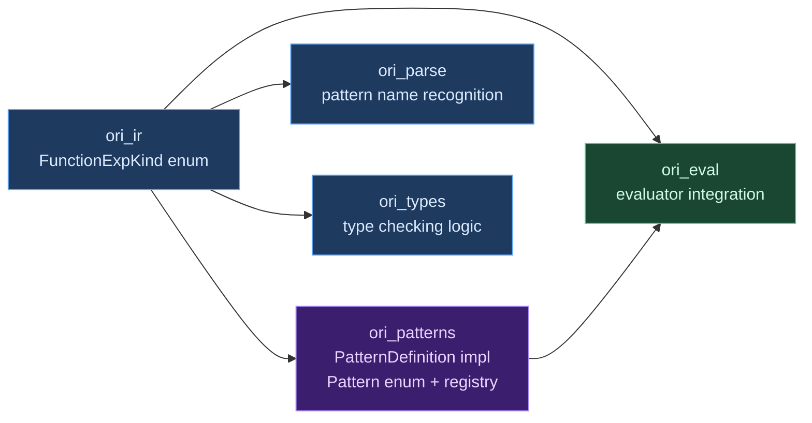

# Adding New Patterns

## When Should Something Be a Pattern?

Before adding a new pattern to the compiler, the first question is whether it should be a pattern at all. Most language features belong in the standard library as regular functions or methods. Patterns are reserved for constructs that genuinely require compiler support — and the bar for "genuinely requires" is high.

A construct should be a compiler pattern only if it needs one or more of these capabilities:

**Scoped binding injection.** The construct introduces identifiers that are only visible in specific sub-expressions. `recurse` introduces `self` scoped to `step`. A library function cannot inject bindings into its caller's scope — only the type checker can extend the type environment for specific property expressions.

**Lazy property evaluation.** The construct must evaluate some properties conditionally or repeatedly. `recurse` evaluates `step` in a loop. `cache` evaluates `op` only on cache miss. Regular function arguments are evaluated eagerly before the call — there's no way for a library function to receive an unevaluated expression and decide when to evaluate it (short of requiring the caller to wrap it in a lambda, which changes the syntax).

**Capability awareness.** The construct needs to check for or consume compiler-tracked capabilities. `cache` requires the `Cache` capability. `print` dispatches through the `Print` capability. The capability system is a compiler concept that library code cannot interact with directly.

**Concurrency semantics.** The construct requires structured concurrency guarantees (join semantics, cancellation, timeout enforcement) that cannot be expressed as a regular function call without runtime support.

**Divergence typing.** The construct produces the `Never` type. `panic`, `todo`, and `unreachable` must return `Never` to enable type-safe divergence. Only the type checker can assign `Never` to an expression.

If a construct can be implemented as a method call with no special bindings, no lazy evaluation, no capabilities, and no divergence, it belongs in the standard library. Data transformation operations (`map`, `filter`, `fold`, `find`, `sort`, `reverse`, `take`, `skip`) all fall in this category.

## The Multi-Crate Change

Adding a pattern requires coordinated changes across multiple crates. This is intentional — the friction ensures each pattern addition is a deliberate architectural decision rather than a casual extension. The crates involved are:



## Step-by-Step Walkthrough

The following walks through adding a hypothetical `retry` pattern that retries an operation with exponential backoff. This is a realistic example — it needs lazy evaluation (retry the operation multiple times) and potentially capability awareness (for timers).

### Step 1: Add the AST Variant

Every pattern has a corresponding variant in `FunctionExpKind`, the enum that the parser produces and the rest of the pipeline consumes. This lives in `ori_ir` because it's a shared data type between all compiler phases:

```rust
// compiler/ori_ir/src/ast/patterns/exp/mod.rs

#[derive(Clone, Copy, Eq, PartialEq, Hash, Debug)]
pub enum FunctionExpKind {
    // ... existing variants ...
    Retry,  // ← new variant
}
```

The variant is deliberately minimal — no payload, no configuration. The pattern's properties (`operation`, `max_attempts`, `delay`) come from the AST's `NamedExpr` list, not from the enum variant.

Adding this variant will cause compile errors everywhere `FunctionExpKind` is matched exhaustively — the parser, type checker, evaluator, and formatter all need updates. This is the enum dispatch guarantee in action: the Rust compiler tells you every location that needs to handle the new pattern.

### Step 2: Create the Pattern Implementation

Create the pattern struct and implement `PatternDefinition`:

```rust
// compiler/ori_patterns/src/retry.rs

use crate::{EvalContext, EvalResult, PatternDefinition, PatternExecutor, Value};

/// retry(operation:, max_attempts:, delay:) — retry with exponential backoff.
pub struct RetryPattern;

impl PatternDefinition for RetryPattern {
    fn name(&self) -> &'static str {
        "retry"
    }

    fn required_props(&self) -> &'static [&'static str] {
        &["operation"]
    }

    fn optional_props(&self) -> &'static [&'static str] {
        &["max_attempts", "delay"]
    }

    fn evaluate(&self, ctx: &EvalContext, exec: &mut dyn PatternExecutor) -> EvalResult {
        let max = match ctx.eval_prop_opt("max_attempts", exec) {
            Some(Ok(v)) => v.as_int()? as usize,
            Some(Err(e)) => return Err(e),
            None => 3,  // default: 3 attempts
        };

        let mut last_error = None;
        for attempt in 0..max {
            match ctx.eval_prop("operation", exec) {
                Ok(value) => return Ok(value),
                Err(e) => {
                    last_error = Some(e);
                    // In interpreter: no actual delay (like timeout)
                    // Compiled output would use actual timer
                }
            }
        }

        // All attempts failed — return last error
        Err(last_error.unwrap())
    }
}
```

Key design decisions in this implementation:

- `operation` is **required** (every retry needs something to retry)
- `max_attempts` and `delay` are **optional** with sensible defaults
- `operation` is evaluated **lazily** — `eval_prop` is called in a loop, re-evaluating the expression each time
- The interpreter does not enforce actual delays — like `timeout`, real delay enforcement is deferred to the compiled output
- Error handling preserves the last error for diagnostics

### Step 3: Register in the Pattern System

Three changes in `ori_patterns`:

**Export the module** in `lib.rs`:
```rust
mod retry;
pub use retry::RetryPattern;
```

**Add the enum variant** in `registry/mod.rs`:
```rust
pub enum Pattern {
    // ... existing variants ...
    Retry(RetryPattern),
}
```

**Add delegation** in the `PatternDefinition` impl for `Pattern` — each trait method needs a new match arm:
```rust
impl PatternDefinition for Pattern {
    fn name(&self) -> &'static str {
        match self {
            // ... existing arms ...
            Pattern::Retry(p) => p.name(),
        }
    }
    // Same for required_props, optional_props, evaluate, etc.
}
```

**Add the registry lookup** in `PatternRegistry::get()`:
```rust
pub fn get(&self, kind: FunctionExpKind) -> Pattern {
    match kind {
        // ... existing arms ...
        FunctionExpKind::Retry => Pattern::Retry(RetryPattern),
    }
}
```

### Step 4: Update the Parser

The parser recognizes pattern names as context-sensitive keywords. Add the new pattern name to the function expression parser:

```rust
// compiler/ori_parse/src/grammar/expr/patterns.rs

fn parse_function_exp_kind(&mut self, name: &str) -> Option<FunctionExpKind> {
    match name {
        "recurse" => Some(FunctionExpKind::Recurse),
        "parallel" => Some(FunctionExpKind::Parallel),
        // ... existing patterns ...
        "retry" => Some(FunctionExpKind::Retry),
        _ => None,
    }
}
```

### Step 5: Add Type Checking

Type checking for patterns lives in `ori_types`, not in the pattern itself. For most patterns, the generic metadata-driven type checking is sufficient — the type checker reads `required_props()` and `optional_props()` and checks that the right properties are present with compatible types.

For patterns with unusual type requirements, add custom logic:

```rust
// compiler/ori_types/src/infer/expr/sequences.rs

fn infer_function_exp(&mut self, kind: FunctionExpKind, ...) -> Idx {
    match kind {
        // ... existing patterns ...
        FunctionExpKind::Retry => {
            // operation must return Result<T, E>
            // max_attempts must be int
            // delay must be Duration
            // result type is Result<T, E>
            self.infer_retry(props)
        }
    }
}
```

### Step 6: Add Tests

Tests should cover basic usage, edge cases, and error conditions:

```rust
#[test]
fn test_retry_succeeds_first_attempt() {
    let result = eval("retry(operation: Ok(42))");
    assert_eq!(result, Value::ok(Value::int(42)));
}

#[test]
fn test_retry_succeeds_after_failures() {
    // Use a stateful operation that fails twice then succeeds
    let result = eval(r#"
        let mut count = 0
        retry(
            operation: {
                count += 1
                if count < 3 then Err("not yet")
                else Ok(count)
            },
            max_attempts: 5,
        )
    "#);
    assert_eq!(result, Value::ok(Value::int(3)));
}

#[test]
fn test_retry_exhausts_attempts() {
    let result = eval(r#"
        retry(
            operation: Err("always fails"),
            max_attempts: 3,
        )
    "#);
    assert!(result.is_err());
}
```

## Construct Boundaries: What Is NOT a Pattern

It's equally important to understand what should NOT be added to the pattern registry.

### Block Expression Constructs

Control flow constructs (`{ }` blocks, `try { }`, `match expr { }`) are NOT patterns. They are:
- Defined as AST nodes in `ori_ir`
- Type-checked directly in `ori_types`
- Evaluated directly in `ori_eval`

These constructs have fundamentally different syntax (block bodies, arms, scrutinees) that doesn't fit the named-property model of patterns. Do not add control flow constructs to the `PatternRegistry`.

### Collection Methods

Data transformation operations like `map`, `filter`, `fold`, `find`, `take`, `skip`, `sort`, `reverse` are collection methods in the standard library, not patterns. They compose naturally as method calls:

```ori
// These are method calls, not patterns
items.map(transform: x -> x * 2)
items.filter(predicate: x -> x > 0)
items.fold(initial: 0, op: (acc, x) -> acc + x)
```

These don't need scoped bindings, lazy evaluation, capabilities, or divergence typing. They work perfectly as regular methods.

### Simple Functions

If a construct can be implemented as a regular function with no special compiler support, it should be. For example, `retry` could potentially be a library function if it accepted a closure:

```ori
// Library version (if we don't need lazy re-evaluation)
@retry (op: () -> Result<T, E>, max_attempts: int = 3) -> Result<T, E> = { ... }
```

The pattern version is justified only if the property-based syntax (`retry(operation: expr)`) is significantly more ergonomic than the closure-based syntax, or if the pattern needs capabilities or scoped bindings that a regular function cannot provide.

## Checklist

Before submitting a new pattern:

- [ ] **Justified** — the construct genuinely needs compiler support (scoped bindings, lazy evaluation, capabilities, concurrency, or divergence)
- [ ] **`FunctionExpKind` variant** added in `ori_ir`
- [ ] **Pattern struct** created in `ori_patterns` as a ZST
- [ ] **`PatternDefinition` trait** implemented with correct `required_props`, `optional_props`, `scoped_bindings`
- [ ] **`Pattern` enum variant** added with trait delegation in each method
- [ ] **Registry `get()` arm** added
- [ ] **Parser** recognizes the pattern name
- [ ] **Type checking** in `ori_types` handles the pattern's type requirements
- [ ] **Evaluator** integration if needed beyond generic dispatch
- [ ] **Unit tests** cover basic usage, edge cases, and error conditions
- [ ] **All crates compile** — `cargo build -p ori_ir -p ori_patterns -p ori_parse -p ori_types -p ori_eval`
- [ ] **Documentation** added to the language spec

## Common Mistakes

**Forgetting to update all match sites.** The enum dispatch system catches this — the Rust compiler will error on every non-exhaustive match. But it's worth running `cargo check` across all crates early to see all the locations at once.

**Putting type checking logic in the pattern.** `PatternDefinition` has no `type_check()` method. Type checking belongs in `ori_types`, which reads the pattern's metadata. If you find yourself wanting to add type inference to a pattern, add it to `ori_types/src/infer/expr/sequences.rs` instead.

**Using raw evaluator APIs instead of PatternExecutor.** Patterns should only interact with the evaluator through `EvalContext` and `PatternExecutor`. Direct access to `Evaluator` internals creates coupling that breaks the abstraction boundary.

**Adding data transformations as patterns.** `map`, `filter`, `fold`, `take`, `skip`, `sort` — these are collection methods, not patterns. If your construct doesn't need scoped bindings, lazy evaluation, or capability tracking, it belongs in the standard library.

**Not handling the interpreter stub case.** Some patterns (like `timeout`, `parallel`) can't be fully implemented in the tree-walking interpreter. Provide an honest stub that evaluates the core operation and emits a `tracing::warn!()` about the missing functionality. Don't silently ignore the pattern.

## Prior Art

### Rust — Adding Compiler Intrinsics

[Rust](https://github.com/rust-lang/rust) adds intrinsics by declaring them in `core::intrinsics`, adding recognition in `rustc_codegen_ssa`, and implementing code generation in each backend (LLVM, Cranelift). Like Ori, this requires coordinated changes across multiple crates. Unlike Ori, Rust intrinsics bypass the type system's normal trait resolution — they're recognized by `DefId`, not by pattern matching on syntax.

### GHC — Adding Built-in Functions

[GHC](https://gitlab.haskell.org/ghc/ghc) adds primops by editing `primops.txt.pp`, a specification file that generates Haskell code for the type checker, code generator, and documentation. This is more automated than Ori's manual multi-crate approach — the specification file is the single source of truth, and code generation ensures consistency. Ori achieves consistency through the `PatternDefinition` trait (metadata in one place) and Rust's exhaustive matching (compile errors for missing cases).

### Zig — Adding Builtins

[Zig](https://github.com/ziglang/zig) adds builtins by adding an entry to the `builtin_fns` array with a name, parameter count, and evaluation function pointer. This is simpler than Ori's approach (one location vs. five) but provides fewer guarantees — there's no exhaustive matching to catch missing handlers, and no trait system to enforce consistent metadata.

## Design Tradeoffs

**Multi-crate friction vs. single-file simplicity.** Ori's pattern system requires changes in 5 crates to add a pattern. A single-crate design (all pattern logic in one file) would be simpler but would violate the compiler's layering: `ori_ir` defines types, `ori_parse` builds AST, `ori_types` infers types, `ori_patterns` defines behavior, `ori_eval` executes. Each crate has a single responsibility, and the cost of cross-crate coordination is the price of that separation.

**Closed enum vs. open registration.** The closed `Pattern` enum means every pattern addition is a compile-time decision. An open registry (like a `HashMap<String, Box<dyn PatternDefinition>>`) would allow runtime extension — potentially even user-defined patterns loaded from plugins. Ori chooses the closed approach because patterns are safety-critical compiler constructs (they affect type checking, control flow, and capability tracking), not user-extensible behavior. The exhaustive matching guarantee is worth more than runtime extensibility for this use case.

**Metadata-driven type checking vs. pattern-owned type checking.** The pattern declares metadata; `ori_types` handles inference. This centralizes type checking logic but means complex patterns need custom code in `ori_types`. If patterns owned their type checking, adding a pattern would be more self-contained, but type checking logic would be scattered across `ori_patterns` and harder to maintain consistently.
