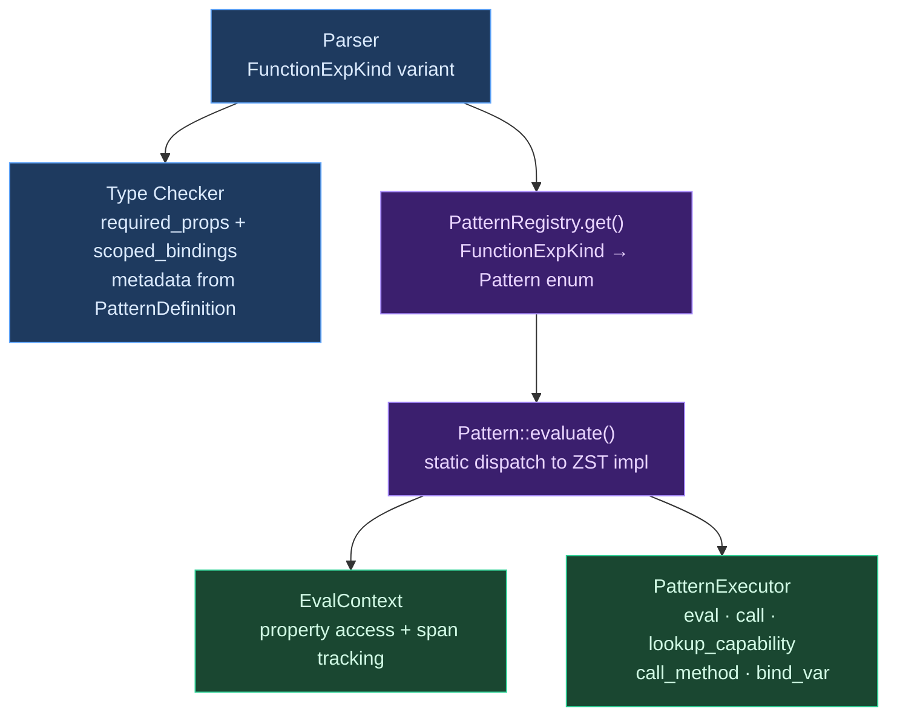

# Pattern System Overview

## What Are Compiler Patterns?

Every programming language draws a line between constructs that live *inside* the compiler and constructs that live in the standard library. On one side: `if`, `match`, `for`, `try` — control flow, pattern matching, error propagation. These need special syntax, scoped bindings, or static analysis that a library function cannot provide. On the other side: `map`, `filter`, `sort`, `split` — data transformation operations that compose naturally as method calls. The boundary between these two categories is one of the most consequential design decisions in language design.

Some languages draw the line conservatively. C has a tiny set of built-in constructs (`if`, `for`, `while`, `switch`) and delegates everything else to libraries. Haskell pushes further by desugaring `do`-notation and list comprehensions into library functions (`>>=`, `return`), letting the type class system handle the rest. Go takes a minimal approach with only `go`, `select`, `defer`, and `chan` as built-in concurrency primitives.

Other languages draw the line generously. Rust's `async`/`await`, `?` operator, `for` loops, and pattern matching are all deeply integrated into the compiler. Swift builds actors, structured concurrency, and property wrappers directly into the language. Each built-in construct creates compiler complexity but enables richer static analysis.

The term **"pattern"** in Ori's codebase refers specifically to these compiler-level constructs — expressions that look like function calls but require compiler support: `recurse(condition:, base:, step:)`, `parallel(tasks:)`, `cache(key:, op:)`. They are distinguished from regular function calls by needing one or more of: scoped binding injection, capability awareness, concurrency semantics, or control flow manipulation.

### The Partitioning Problem

The central question is: what *must* be a compiler intrinsic, and what can be a library function? The answer depends on what information the compiler needs:

| Capability | Requires Compiler Support? | Why |
|---|---|---|
| Iterating a collection | No — method calls compose | `items.map(f).filter(p)` works as regular code |
| Self-referential recursion | Yes — `self` binding | `recurse` introduces `self` scoped to `step` only |
| Concurrent execution | Yes — thread spawning, join semantics | `parallel` needs structured concurrency guarantees |
| Resource lifecycle | Yes — guaranteed cleanup | `with` must call `release` even on panic |
| Capability-aware caching | Yes — effect tracking | `cache` requires the `Cache` capability |
| Time-limited execution | Yes — interrupt semantics | `timeout` needs cooperative cancellation |
| Error recovery | Yes — catch/re-throw mechanics | `catch` wraps panics into `Result` |
| Divergence markers | Yes — `Never` type | `panic`, `todo`, `unreachable` return bottom |

A data transformation like `map` fails all of these criteria — it takes a function and applies it, with no special bindings, no capabilities, no concurrency. It belongs in the standard library. But `recurse` *must* be a compiler pattern because it introduces a scoped binding (`self`) that only the type checker can set up correctly.

### Classical Approaches

Compilers have developed several strategies for managing built-in constructs:

**Hardcoded in the evaluator.** The simplest approach: each built-in construct gets its own case in the interpreter's main evaluation loop. Early Lisps and many scripting languages work this way. It's fast to implement but couples built-in semantics tightly to the evaluator, making the system difficult to extend or test in isolation.

**Special forms.** Lisp's `special forms` (`if`, `cond`, `let`, `lambda`, `quote`) are syntactic constructs that the evaluator handles differently from function application. They receive their arguments unevaluated, enabling lazy evaluation and scoped bindings. This is the philosophical ancestor of Ori's pattern system — patterns receive property expressions lazily, evaluating them on demand via `EvalContext`.

**Compiler intrinsics.** Rust, LLVM, and GCC expose intrinsic functions (`std::intrinsics::*`, `__builtin_*`) that look like function calls but compile to specialized code. The compiler recognizes them by name and generates inline instructions rather than actual function calls. This provides zero-cost abstractions but limits extensibility.

**Macro expansion.** Lisp macros, Rust's `macro_rules!`, and Scala's `inline` methods transform code before or during compilation, effectively extending the language's built-in constructs. This is maximally extensible but makes static analysis harder and error messages worse.

**Trait-based dispatch.** Haskell's type classes and Rust's traits allow built-in syntax to desugar into trait method calls (`for x in y` becomes `IntoIterator::into_iter(y)`). The compiler provides the syntax and the desugaring; the trait system provides the extensibility. Ori uses this approach for operators and iterators but not for patterns.

Ori's pattern system is closest to Lisp's special forms crossed with Rust's intrinsics: patterns receive their properties lazily (like special forms), implement a uniform trait interface (like intrinsics), and dispatch via a closed enum (like compiler-recognized names).

## What Makes Ori's Pattern System Distinctive

### Lean Core, Rich Libraries Boundary

The pattern registry contains only constructs that genuinely require compiler support — special syntax, scoped bindings, capability awareness, or concurrency semantics. Data transformation (`map`, `filter`, `fold`) stays in the standard library as regular method calls. This keeps the compiler surface area small while the library grows independently.

| In Compiler (Patterns) | In Standard Library |
|---|---|
| `recurse` (self-referential `self()`) | `map`, `filter`, `fold`, `find` (collection methods) |
| `parallel`, `spawn`, `timeout` (concurrency) | `retry`, `validate` (library functions) |
| `cache`, `with` (capability-aware resources) | `sort`, `reverse`, `join` (data operations) |
| `panic`, `todo`, `unreachable` (divergence) | `assert_eq`, `assert_ne` (testing utilities) |
| `catch` (error recovery) | `split`, `trim`, `upper` (string methods) |

The boundary is enforced structurally: `FunctionExpKind` is a closed enum. You cannot add a new compiler pattern without modifying the enum in `ori_ir`, adding a `PatternDefinition` implementation in `ori_patterns`, and updating the parser and type checker. This friction is intentional — it makes adding compiler patterns a deliberate architectural decision rather than a casual extension.

### Zero-Cost Enum Dispatch

The `PatternRegistry` uses a `Pattern` enum with zero-sized type (ZST) variants instead of `HashMap<Name, Arc<dyn PatternDefinition>>`. Each pattern type is a zero-sized struct created inline in match arms — no heap allocation, no vtable indirection, no HashMap lookup. The Rust compiler enforces exhaustive handling of all patterns at compile time, eliminating "forgot to handle this pattern" bugs.

### Scoped Binding Injection

Patterns can introduce identifiers that are only visible within specific property expressions. The `recurse` pattern introduces `self` scoped to the `step` property; the type checker reads `ScopedBinding` metadata from the pattern trait to set up the correct type environment. This enables recursive self-reference without polluting the surrounding scope — a capability that no regular function call can provide.

### Lazy Property Evaluation

Unlike regular function arguments (which are evaluated before the call), pattern properties are evaluated on demand through `EvalContext`. This is essential for patterns like `recurse`, where the `step` property must be evaluated in a loop with `self` bound to the recursive continuation, and `cache`, where the `op` property should only be evaluated on cache miss.

### PatternExecutor Abstraction

Patterns evaluate through a `PatternExecutor` trait rather than coupling directly to the interpreter. This abstraction provides a clean boundary between pattern semantics and evaluation machinery: patterns describe *what* to do with their properties; the executor provides *how* to evaluate expressions, call functions, and look up variables. This enables testing patterns in isolation with mock executors and allows the evaluator to evolve independently from pattern definitions.

## Architecture

### Pattern Evaluation Pipeline



The pipeline has three stages:

1. **Parsing** recognizes `FunctionExpKind` variants and builds AST nodes with named property expressions
2. **Type checking** uses pattern metadata (required/optional properties, scoped bindings) from `PatternDefinition` to drive inference — type checking logic lives in `ori_types`, not in patterns
3. **Evaluation** dispatches through the `PatternRegistry` to get a `Pattern` enum value, then calls `evaluate()` with an `EvalContext` (for property access) and a `PatternExecutor` (for expression evaluation)

### Compiler Pattern Categories

**Control flow** — block expressions (`{ }`, `try { }`, `match { }`) are NOT in the pattern registry. They are AST nodes handled directly by the type checker and evaluator. Patterns are specifically the `FunctionExpKind` constructs:

**Recursion:**

```ori
recurse(
    condition: n == 0,
    base: 1,
    step: self(n - 1) * n,
)
```

**Concurrency (post-2026):**

```ori
parallel(tasks: [fetch(url1), fetch(url2)], max_concurrent: 2)
spawn(tasks: [log(msg1), log(msg2)])
timeout(op: slow_computation(), after: 5s)
```

**Resource management (post-2026):**

```ori
cache(key: k, op: expensive(), ttl: 5m)
with(acquire: open(path), action: f -> read(f), release: f -> close(f))
```

**Error recovery and divergence:**

```ori
catch(expr: might_panic())           // -> Result<T, str>
panic(msg: "invariant violated")     // -> Never
todo()                               // -> Never
unreachable()                        // -> Never
```

## Pattern Registry

The `PatternRegistry` uses a `Pattern` enum for static dispatch, avoiding both HashMap overhead and trait object indirection:

```rust
pub enum Pattern {
    Recurse(RecursePattern),
    Parallel(ParallelPattern),
    Spawn(SpawnPattern),
    Timeout(TimeoutPattern),
    Cache(CachePattern),
    With(WithPattern),
    Print(PrintPattern),
    Panic(PanicPattern),
    Catch(CatchPattern),
    Todo(TodoPattern),
    Unreachable(UnreachablePattern),
    Channel(ChannelPattern),
}
```

The `Pattern` enum implements `PatternDefinition` by delegating to each inner type's implementation. Pattern variants are ZSTs created inline — no static instances or heap allocation needed. The registry maps `FunctionExpKind` variants to `Pattern` values via a simple `match`:

```rust
pub fn get(&self, kind: FunctionExpKind) -> Pattern {
    match kind {
        FunctionExpKind::Recurse => Pattern::Recurse(RecursePattern),
        FunctionExpKind::Parallel => Pattern::Parallel(ParallelPattern),
        // ... one arm per pattern, plus channel variants collapsed
        FunctionExpKind::Channel
        | FunctionExpKind::ChannelIn
        | FunctionExpKind::ChannelOut
        | FunctionExpKind::ChannelAll => Pattern::Channel(ChannelPattern),
    }
}
```

## Pattern Interface

All patterns implement the `PatternDefinition` trait, which provides metadata for type checking and an `evaluate()` method for execution:

```rust
pub trait PatternDefinition: Send + Sync {
    fn name(&self) -> &'static str;
    fn required_props(&self) -> &'static [&'static str];
    fn optional_props(&self) -> &'static [&'static str] { &[] }
    fn optional_args(&self) -> &'static [OptionalArg] { &[] }
    fn scoped_bindings(&self) -> &'static [ScopedBinding] { &[] }
    fn allows_arbitrary_props(&self) -> bool { false }
    fn evaluate(&self, ctx: &EvalContext, exec: &mut dyn PatternExecutor) -> EvalResult;
    fn can_fuse_with(&self, next: &dyn PatternDefinition) -> bool { false }
    fn fuse_with(&self, next: &dyn PatternDefinition,
                 self_ctx: &EvalContext, next_ctx: &EvalContext) -> Option<FusedPattern> { None }
}
```

Type checking is handled by `ori_types`, not by patterns themselves. The trait provides metadata (property declarations, scoped bindings) that the type checker reads; patterns have no `type_check()` method.

## Match Pattern System

Separate from the `PatternDefinition` patterns, Ori has a pattern matching system for `match` expressions. This uses the `MatchPattern` AST enum:

```rust
pub enum MatchPattern {
    Wildcard,
    Literal(LiteralValue),
    Binding(Name),
    Variant { name: Name, inner: Vec<MatchPattern> },
    Struct { fields: Vec<(Name, MatchPattern)> },
    Tuple(Vec<MatchPattern>),
    List { elements: Vec<MatchPattern>, rest: Option<Name> },
    Range { start: Option<LiteralValue>, end: Option<LiteralValue>, inclusive: bool },
    Or(Vec<MatchPattern>),
    At { name: Name, pattern: Box<MatchPattern> },
}
```

### Variant Pattern Design

Using `Vec<MatchPattern>` instead of `Option<Box<MatchPattern>>` for variant inner patterns enables uniform handling of all variant arities:

- Unit variants: `None` → `inner: []`
- Single-field: `Some(x)` → `inner: [Binding("x")]`
- Multi-field: `Click(x, y)` → `inner: [Binding("x"), Binding("y")]`
- Nested: `Event(Click(x, _))` → `inner: [Variant { ... }]`

### Variant vs Binding Disambiguation

Uppercase pattern names are treated as variant constructors, lowercase as bindings. The type checker produces `PatternResolution` entries keyed by `PatternKey`, which the evaluator consumes to disambiguate `Binding` patterns that could be either variable bindings or unit variants:

```rust
pub enum PatternResolution {
    UnitVariant { type_name: Name, variant_index: u8 },
}
```

### Type Checking Flow

1. **Infer scrutinee type** via `infer_expr(checker, scrutinee)`
2. **For each arm:** unify pattern with scrutinee type, extract bindings, type-check guard (must be `bool`), unify body with result type
3. **Result type:** common type from all arm bodies

### Runtime Matching

`try_match()` returns `Ok(Some(bindings))` on match, `Ok(None)` on no-match. Guards are evaluated after pattern match succeeds but before the arm body — if the guard returns false, matching continues to the next arm. Guards are NOT considered for exhaustiveness checking since the compiler cannot statically verify guard conditions.

### Exhaustiveness Checking

After pattern compilation produces a decision tree (during canonicalization), the exhaustiveness checker walks the tree to detect:

1. **Non-exhaustive matches** — a reachable `Fail` node or a `Switch` missing constructors of a finite type
2. **Redundant arms** — arms that no path through the decision tree ever reaches

| Type | Exhaustive When |
|---|---|
| `bool` | Both `true` and `false` covered |
| `int`, `str`, `float` | Wildcard (`_`) present (infinite types) |
| `Option<T>` | Both `None` and `Some(_)` covered |
| `Result<T, E>` | Both `Ok(_)` and `Err(_)` covered |
| User-defined enums | All variants covered (root-level switches) |

This reuses the compiled decision tree rather than re-analyzing source patterns, which is sound because the tree faithfully encodes the pattern matrix's coverage. See [Pattern Compilation](../07-canonicalization/pattern-compilation.md) for the full algorithm.

## Prior Art

### Lisp Special Forms

Lisp's [special forms](https://www.cs.cmu.edu/Groups/AI/html/cltl/clm/node59.html) (`if`, `cond`, `let`, `lambda`, `quote`) are the philosophical ancestor of compiler patterns. Like Ori's patterns, they receive arguments unevaluated and apply custom evaluation rules. The difference is that Lisp macros allow users to define new special forms, while Ori's pattern set is closed — only the compiler team adds patterns, and each addition requires changes across multiple crates.

### Rust Compiler Intrinsics

[Rust](https://github.com/rust-lang/rust) uses `#[rustc_intrinsic]` functions that look like normal function calls but compile to specialized instructions. `std::intrinsics::transmute`, `copy_nonoverlapping`, and SIMD operations are all intrinsics. Like Ori's patterns, they're a closed set recognized by name; unlike Ori's patterns, they operate at the code generation level rather than the evaluation level, and they don't support scoped bindings or lazy property evaluation.

### Haskell Do-Notation and Comprehensions

[GHC](https://gitlab.haskell.org/ghc/ghc) desugars `do`-notation into `>>=` and `return`, and list comprehensions into `concatMap` and `filter`. This is the opposite approach from Ori: Haskell makes built-in constructs desugar to library functions, while Ori makes pattern constructs evaluate through a trait interface. Haskell's approach is more extensible (any `Monad` instance gets `do`-notation), while Ori's is more explicit (each pattern declares exactly which properties and bindings it needs).

### Zig Comptime Builtins

[Zig](https://github.com/ziglang/zig) has `@` builtins (`@import`, `@typeInfo`, `@compileError`, `@ctz`) that are compiler-recognized function calls with special semantics. Like Ori's patterns, they're a closed set with compile-time-known signatures. Zig's approach is simpler (no trait abstraction, no executor) but less modular — each builtin is hardcoded in the compiler's main evaluation loop.

### Go Built-in Functions

[Go](https://go.dev/ref/spec#Built-in_functions) has a small set of built-in functions (`make`, `len`, `cap`, `append`, `delete`, `close`, `panic`, `recover`) that look like regular function calls but receive special treatment from the compiler. Like Ori, Go keeps this set minimal and closed. Unlike Ori, Go does not abstract these behind a trait interface — each is handled individually in the compiler.

### Koka Effect Handlers

[Koka](https://github.com/koka-lang/koka) uses algebraic effect handlers for control flow, concurrency, and resource management. Operations like `yield`, `throw`, and `ask` are declared as effect operations and handled by user-defined handlers. This is more general than Ori's pattern system — Koka's handlers are first-class values — but requires a fundamentally different runtime model (continuation-passing or CPS-transformed code).

## Design Tradeoffs

**Closed enum vs. open trait objects.** Ori uses a closed `Pattern` enum, which means adding a new pattern requires modifying the compiler. An open `dyn PatternDefinition` registry would allow extensions without modifying core code, but would sacrifice exhaustive matching (the compiler can't check that all patterns are handled), add vtable overhead, and create ordering/priority ambiguities. Since patterns are not user-extensible — only the compiler team adds them — the closed enum is the right choice.

**Lazy vs. eager property evaluation.** Patterns evaluate properties lazily through `EvalContext`, while regular function calls evaluate arguments eagerly. This adds complexity (the evaluator must handle deferred evaluation) but is essential for patterns like `recurse` (where `step` must be evaluated in a loop) and `cache` (where `op` should only evaluate on miss). The alternative — eager evaluation with closures — would require wrapping every property in a lambda, which is syntactically heavier and semantically different.

**Metadata-driven type checking vs. pattern-local type checking.** The `PatternDefinition` trait provides metadata (`required_props`, `scoped_bindings`) that `ori_types` reads to drive inference, rather than giving patterns a `type_check()` method. This keeps type checking logic in one place (`ori_types`) rather than scattering it across pattern implementations. The tradeoff is that complex patterns may need custom type checking logic in `ori_types` that knows about the specific pattern's semantics.

**Pattern-level fusion infrastructure.** The fusion system (see [Pattern Fusion](pattern-fusion.md)) provides data structures for combining sequential patterns into single-pass operations. This infrastructure exists ahead of the patterns it would optimize (collection operations are currently library methods, not patterns), representing an investment in future optimization capability at the cost of code that isn't yet connected to active evaluation.

## Related Documents

- [Pattern Trait](pattern-trait.md) — PatternDefinition interface design
- [Pattern Registry](pattern-registry.md) — Registration and dispatch system
- [Pattern Fusion](pattern-fusion.md) — Fusion optimization
- [Adding Patterns](adding-patterns.md) — How to add new patterns
- [Pattern Compilation](../07-canonicalization/pattern-compilation.md) — Decision tree construction and exhaustiveness
