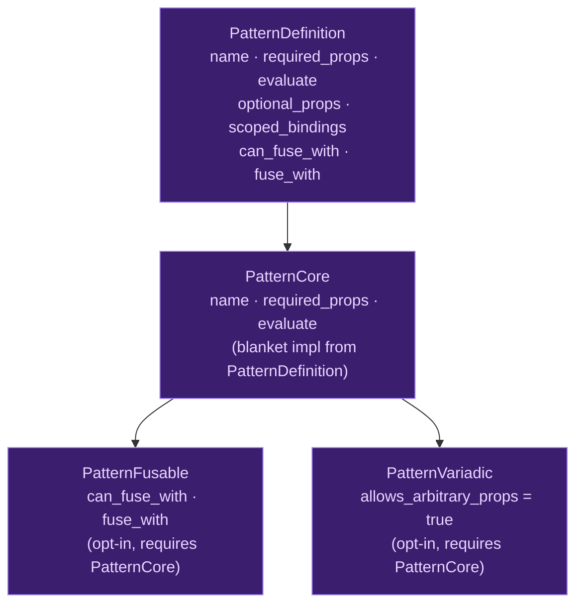

# Pattern Trait

## What Is a Pattern Trait?

When a compiler has multiple built-in constructs — recursion, concurrency, caching, error recovery — it needs a uniform way to describe them. Each construct has different required arguments, introduces different scoped bindings, and evaluates differently, yet they all flow through the same compilation pipeline: parsing, type checking, evaluation. The question is how to structure this shared pipeline without duplicating code for each construct.

The naive approach is a giant `match` statement in the evaluator:

```rust
match kind {
    Recurse => { /* recurse-specific evaluation */ },
    Parallel => { /* parallel-specific evaluation */ },
    Cache => { /* cache-specific evaluation */ },
    // ... one arm per construct, all in one function
}
```

This works but creates a monolithic evaluation function that grows with each new construct. More importantly, it couples the evaluator to every pattern's internals — the evaluator must know how `recurse` manages `self` binding, how `cache` checks the cache, how `parallel` spawns threads.

A **pattern trait** inverts this: each pattern encapsulates its own metadata and evaluation logic behind a common interface. The evaluator knows only the interface — "give me your required properties, give me your scoped bindings, evaluate yourself" — and delegates the details to each pattern's implementation.

### Trait Design in Compiler Internals

The design of a compiler-internal trait involves several decisions:

**What goes in the trait vs. what stays in the compiler.** A trait that includes `type_check()` makes each pattern responsible for its own type inference — flexible but scatters type checking logic across files. A trait that only provides metadata (`required_props`, `scoped_bindings`) keeps type checking centralized. Ori chose the metadata approach: patterns declare *what* they need, and `ori_types` handles the *how*.

**Monolithic vs. decomposed traits.** A single trait with all methods is simple but forces patterns to implement methods they don't use (fusion support, variadic properties). Decomposed traits (a core trait plus opt-in extensions) are more precise but add indirection. Ori provides both: `PatternDefinition` is the primary interface with default implementations for optional methods, while `PatternFusable` and `PatternVariadic` are opt-in traits for specialized capabilities.

**Static vs. dynamic dispatch.** Trait objects (`dyn PatternDefinition`) enable open extension but add vtable overhead. Enum dispatch enables exhaustive matching but requires modifying the enum for each new pattern. Since patterns are a closed set known at compile time, Ori wraps each pattern in an enum variant and delegates trait calls through enum matching — combining the organizational benefits of traits with the performance benefits of static dispatch.

## The PatternDefinition Trait

`PatternDefinition` is the root trait that all patterns implement. It provides the full interface for metadata, evaluation, and optional fusion:

```rust
pub trait PatternDefinition: Send + Sync {
    /// Pattern name (e.g., "recurse", "parallel").
    fn name(&self) -> &'static str;

    /// Required property names (e.g., ["condition", "base", "step"]).
    fn required_props(&self) -> &'static [&'static str];

    /// Optional property names.
    fn optional_props(&self) -> &'static [&'static str] { &[] }

    /// Optional arguments with default values.
    fn optional_args(&self) -> &'static [OptionalArg] { &[] }

    /// Scoped bindings to introduce during type checking.
    fn scoped_bindings(&self) -> &'static [ScopedBinding] { &[] }

    /// Whether this pattern allows arbitrary additional properties.
    fn allows_arbitrary_props(&self) -> bool { false }

    /// Evaluate this pattern.
    fn evaluate(&self, ctx: &EvalContext, exec: &mut dyn PatternExecutor) -> EvalResult;

    /// Check if this pattern can be fused with the given next pattern.
    fn can_fuse_with(&self, _next: &dyn PatternDefinition) -> bool { false }

    /// Create a fused pattern combining this pattern with the next one.
    fn fuse_with(
        &self,
        _next: &dyn PatternDefinition,
        _self_ctx: &EvalContext,
        _next_ctx: &EvalContext,
    ) -> Option<FusedPattern> { None }
}
```

The trait requires `Send + Sync` for thread-safe registry access and parallel compilation. Since all patterns are zero-sized types (ZSTs) with no mutable state, this bound is satisfied automatically.

### Method Categories

The trait's methods fall into three groups:

**Metadata methods** — consumed by the type checker to drive inference. `name()` identifies the pattern for error messages. `required_props()` and `optional_props()` declare which named expressions the pattern expects. `scoped_bindings()` tells the type checker which identifiers to introduce into which property scopes. `optional_args()` provides default values for optional properties.

**Evaluation** — `evaluate()` is the only method that actually executes pattern logic. It receives an `EvalContext` (for accessing property expressions) and a `PatternExecutor` (for evaluating expressions, calling functions, and looking up capabilities).

**Fusion** — `can_fuse_with()` and `fuse_with()` support combining sequential patterns into single-pass operations. Most patterns return `false`/`None` via the default implementations.

## Focused Trait Hierarchy

The implementation uses a decomposed hierarchy that separates concerns:



**`PatternDefinition`** — the primary trait that patterns implement. Contains the full interface with default implementations for optional methods.

**`PatternCore`** — the minimal interface: `name()`, `required_props()`, `evaluate()`. Has a blanket implementation from `PatternDefinition`, so any type implementing `PatternDefinition` automatically implements `PatternCore`. This enables code that only needs the core operations to accept `dyn PatternCore` without depending on fusion or variadic capabilities.

**`PatternFusable`** — opt-in fusion support. Requires `PatternCore`. Only patterns that participate in fusion chains implement this trait.

**`PatternVariadic`** — opt-in arbitrary property support. Requires `PatternCore`. Returns `allows_arbitrary_props() = true`. Used by patterns like `parallel` that accept dynamic task properties beyond the declared required/optional set.

The blanket impl is key — it means patterns only implement `PatternDefinition` and get `PatternCore` for free. The decomposition exists not for patterns to implement selectively, but for consumers to accept different capability levels.

## Context Types

### EvalContext

`EvalContext` provides access to property expressions during evaluation. Properties are evaluated lazily — the pattern decides when and whether to evaluate each property:

```rust
pub struct EvalContext<'a> {
    pub interner: &'a StringInterner,
    pub arena: &'a ExprArena,
    pub props: &'a [NamedExpr],
}
```

The context provides methods for property access with span-aware error reporting:

| Method | Purpose |
|---|---|
| `get_prop(name)` | Get a required property's `ExprId`. Returns `Err` if missing. |
| `get_prop_opt(name)` | Get an optional property's `ExprId`. Returns `None` if missing. |
| `eval_prop(name, exec)` | Evaluate a property expression via the executor. |
| `eval_prop_spanned(name, exec)` | Evaluate with span attachment for error reporting. |
| `eval_prop_opt(name, exec)` | Evaluate optional property, returns `None` if absent. |
| `first_prop_span()` | Get the span of the first property (for general error positioning). |
| `prop_span(name)` | Get a specific property's span (for property-specific errors). |
| `error_with_prop_span(msg, name)` | Create an error positioned at a property's source location. |

Span is computed on demand — `EvalContext` stores the property expressions (which contain spans), not precomputed span values. This avoids work for properties that don't trigger errors.

### PatternExecutor

`PatternExecutor` is the abstraction layer between patterns and the evaluator. All name parameters use interned `Name` (not `&str`) for performance:

```rust
pub trait PatternExecutor {
    /// Evaluate an expression by ID.
    fn eval(&mut self, expr_id: ExprId) -> EvalResult;

    /// Call a function value with arguments.
    fn call(&mut self, func: &Value, args: Vec<Value>) -> EvalResult;

    /// Look up a capability by interned name.
    fn lookup_capability(&self, name: Name) -> Option<Value>;

    /// Call a method on a value by interned method name.
    fn call_method(&mut self, receiver: Value, method: Name, args: Vec<Value>) -> EvalResult;

    /// Look up a variable by interned name.
    fn lookup_var(&self, name: Name) -> Option<Value>;

    /// Bind a variable in the current scope by interned name.
    fn bind_var(&mut self, name: Name, value: Value);
}
```

The executor provides six operations that patterns combine to implement their semantics. `eval()` evaluates AST expressions. `call()` invokes function values. `lookup_capability()` checks whether a capability (like `Cache` or `Print`) is available in the current scope. `call_method()` dispatches method calls. `lookup_var()` and `bind_var()` manage scoped variables — the latter is how `recurse` introduces `self` into the step expression's scope.

This abstraction means pattern implementations never reference `Evaluator` directly. In tests, a mock `PatternExecutor` can provide canned responses, verifying that patterns request the right properties and operations without needing the full evaluation infrastructure.

## Scoped Bindings

The `ScopedBinding` system enables patterns to introduce identifiers into specific property scopes — a capability that regular function calls cannot provide:

```rust
pub struct ScopedBinding {
    /// The name to introduce (e.g., "self").
    pub name: &'static str,

    /// Which properties this binding is available in.
    pub for_props: &'static [&'static str],

    /// How to compute the binding's type.
    pub type_from: ScopedBindingType,
}

pub enum ScopedBindingType {
    /// Same type as another property.
    SameAs(&'static str),

    /// Function returning the type of a property.
    FunctionReturning(&'static str),

    /// The enclosing function's type (for recursion).
    EnclosingFunction,
}
```

### How Scoped Bindings Work

When the type checker encounters a pattern, it reads the `scoped_bindings()` metadata and temporarily extends the type environment for specific property expressions. For `recurse`:

```rust
fn scoped_bindings(&self) -> &'static [ScopedBinding] {
    &[ScopedBinding {
        name: "self",
        for_props: &["step"],
        type_from: ScopedBindingType::EnclosingFunction,
    }]
}
```

This tells the type checker: "When type-checking the `step` property, add `self` to the environment with the type of the enclosing function." The `step` expression can then use `self(n - 1)` for recursive calls. The binding is NOT visible in `condition` or `base` — scope is precisely controlled.

The `ScopedBindingType` variants handle three patterns:

| Variant | Meaning | Example |
|---|---|---|
| `SameAs("over")` | Binding has the same type as the named property | Iterator item type |
| `FunctionReturning("base")` | Binding is a function returning the named property's type | Transform callback |
| `EnclosingFunction` | Binding has the enclosing function's signature | `self` in `recurse` |

## Worked Example: Recurse Pattern

The `recurse` pattern demonstrates the full trait implementation:

```rust
pub struct RecursePattern;

impl PatternDefinition for RecursePattern {
    fn name(&self) -> &'static str { "recurse" }

    fn required_props(&self) -> &'static [&'static str] {
        &["condition", "base", "step"]
    }

    fn optional_props(&self) -> &'static [&'static str] {
        &["memo"]
    }

    fn scoped_bindings(&self) -> &'static [ScopedBinding] {
        &[ScopedBinding {
            name: "self",
            for_props: &["step"],
            type_from: ScopedBindingType::EnclosingFunction,
        }]
    }

    fn evaluate(&self, ctx: &EvalContext, exec: &mut dyn PatternExecutor) -> EvalResult {
        let cond = ctx.eval_prop("condition", exec)?;
        if cond.as_bool()? {
            ctx.eval_prop("base", exec)
        } else {
            ctx.eval_prop("step", exec)
        }
    }
}
```

The evaluation is straightforward: check the condition, evaluate `base` or `step`. The complexity lives in the type checker, which uses `scoped_bindings()` to set up `self` in the `step` scope, and in the evaluator's `PatternExecutor` implementation, which binds `self` to the recursive continuation before evaluating `step`.

### Timeout Pattern: Interpreter vs. Compiled Behavior

The `timeout` pattern illustrates how patterns can have different behavior in the interpreter and compiled output:

```rust
pub struct TimeoutPattern;

impl PatternDefinition for TimeoutPattern {
    fn name(&self) -> &'static str { "timeout" }

    fn required_props(&self) -> &'static [&'static str] {
        &["operation", "after"]
    }

    fn evaluate(&self, ctx: &EvalContext, exec: &mut dyn PatternExecutor) -> EvalResult {
        let _ = ctx.get_prop("after")?;  // Validate presence, don't use
        match ctx.eval_prop("operation", exec) {
            Ok(value) => Ok(Value::ok(value)),
            Err(e) => Ok(Value::err(Value::string(e.into_eval_error().message))),
        }
    }
}
```

In the interpreter, `timeout` validates that `after` is provided but doesn't enforce the time limit — cooperative timeout requires runtime support that the tree-walking interpreter doesn't have. The compiled output will generate actual timeout enforcement. The pattern trait makes this possible: the same `PatternDefinition` provides metadata for both backends, while `evaluate()` handles the interpreter-specific behavior.

## Prior Art

### Haskell Type Classes for Syntax

[GHC](https://gitlab.haskell.org/ghc/ghc) desugars syntactic constructs into type class method calls. `do { x <- m; f x }` becomes `m >>= (\x -> f x)`, dispatching through the `Monad` class. `if c then t else e` with `RebindableSyntax` calls `ifThenElse c t e`, making even conditionals trait-dispatched. This is the most extreme version of the trait-based approach — almost everything is a trait method. Ori is more conservative, using traits only for compiler patterns while keeping control flow hardcoded.

### Rust Trait Desugaring

[Rust](https://github.com/rust-lang/rust) desugars operators (`+`, `*`, `==`) into trait method calls (`Add::add`, `Mul::mul`, `PartialEq::eq`), and `for` loops into `IntoIterator::into_iter` + `Iterator::next`. But Rust's "special" constructs (`?`, `async`/`await`, `match`) are hardcoded in the compiler, not trait-dispatched. Ori's pattern system falls between Rust's operators (trait-dispatched) and Rust's special forms (hardcoded).

### Clang/LLVM Builtins

[Clang](https://clang.llvm.org/docs/LanguageExtensions.html) recognizes builtin functions by name (`__builtin_expect`, `__builtin_clz`, `__builtin_trap`) and generates specialized code for each. Each builtin has metadata (argument types, return type, side effects) similar to Ori's `PatternDefinition`, but there's no shared trait — each builtin is a case in a large switch. Ori's trait approach provides better code organization at the cost of slightly more indirection.

### Zig Compile-Time Builtins

[Zig](https://github.com/ziglang/zig) has `@` builtins with metadata baked into the compiler's `Builtin` struct (eval function pointer, params, return type). Like Ori, each builtin declares its interface. Unlike Ori, Zig doesn't separate metadata from evaluation — the `eval` function pointer is part of the same struct, whereas Ori separates metadata methods (`required_props`, `scoped_bindings`) from the evaluation method.

## Design Tradeoffs

**Metadata-only trait vs. full type checking in trait.** Ori's `PatternDefinition` declares metadata; `ori_types` does type inference centrally. An alternative is giving each pattern a `type_check(&mut TypeChecker)` method. The metadata approach keeps type checking in one place (easier to maintain consistency, share inference logic) but means complex patterns need custom handling in `ori_types`. The full-method approach distributes type checking logic (harder to maintain) but gives each pattern complete control over its type behavior.

**Blanket impl vs. independent traits.** The `PatternCore` blanket impl from `PatternDefinition` means patterns only implement one trait. An alternative is making `PatternCore` independent, requiring explicit implementation. The blanket approach reduces boilerplate (implement once, get core for free) but means you can't implement `PatternCore` without implementing the full `PatternDefinition`. Since all patterns need the full interface anyway, this tradeoff favors convenience.

**ZST patterns vs. stateful patterns.** All patterns are zero-sized types with no instance state. Configuration (like `timeout`'s time limit) comes from property expressions, not struct fields. This simplifies thread safety (ZSTs are trivially `Send + Sync`) and eliminates lifetime concerns, but means patterns can't carry pre-computed data between calls. If a pattern needed cached analysis results, it would have to recompute them each evaluation — a tradeoff that hasn't been problematic because pattern evaluation is dominated by property evaluation cost, not metadata access.

**`EvalContext` + `PatternExecutor` vs. direct evaluator access.** The two-abstraction design separates property access (context) from evaluation capability (executor). Patterns could instead receive a `&mut Evaluator` directly, which would be simpler but would couple pattern implementations to the evaluator's internal API, make testing harder (need full evaluator for every test), and prevent patterns from being used in non-interpreter backends without adaptation.
