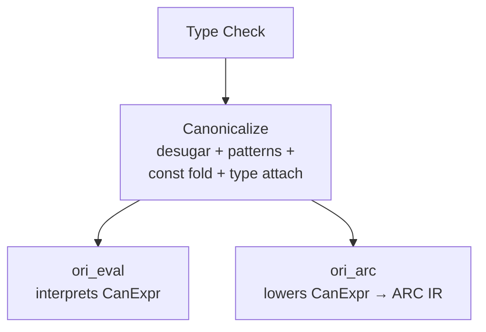

# Canonicalization Overview

The canonicalization phase (`ori_canon` crate) transforms the type-checked AST into a sugar-free, type-annotated intermediate representation. This canonical IR (`CanExpr`) sits between the type checker and both backends — the tree-walking evaluator (`ori_eval`) and the ARC/LLVM codegen pipeline (`ori_arc` + `ori_llvm`).

## What Makes Ori's Canonicalization Distinctive

### Single-Pass Four-in-One Lowering

The `Lowerer` performs desugaring, pattern compilation, constant folding, and type attachment in a single traversal of the AST. There are no separate passes — when the lowerer encounters a sugar variant it desugars inline, when it builds an arithmetic node it immediately attempts constant folding, and every output node gets its resolved type attached. This eliminates redundant tree walks while keeping each transformation's logic in its own module.

### Type-Level Sugar Elimination

`CanExpr` is a **distinct type** from `ExprKind` — sugar variants like `CallNamed`, `TemplateLiteral`, and `ListWithSpread` physically cannot be represented in the canonical form. If a backend tries to match on a sugar variant, it gets a compile error. This makes it impossible for backends to accidentally miss a desugaring case, unlike approaches that use the same AST type throughout.

### Arc-Shared Decision Trees

Decision trees are stored in a `DecisionTreePool` and wrapped in `Arc` for O(1) cloning. Both the tree-walking evaluator and the LLVM codegen share the exact same tree instances without copying. This matters because decision trees can be large for complex match expressions, and both backends need them simultaneously.

### Content-Addressed Constants

The `ConstantPool` uses content-addressing to deduplicate compile-time values. Pre-interned sentinels (`unit`, `true`, `false`, `0`, `1`, `""`) get O(1) access. Folding happens opportunistically during lowering — after constructing a `Binary`, `Unary`, or `If` node, `try_fold()` immediately checks if it can be replaced with a `Constant(ConstantId)`.

### Pipeline Position



Canonicalization is **not** a separate Salsa query. It runs inside `evaluated()` for the interpreter path, inside `check_source()` for the AOT/LLVM path, and inside the `check` command for pattern problem detection.

## What Happens During Lowering

The `Lowerer` performs four transformations in a single pass over the AST:

| Step | Module | What It Does |
|------|--------|-------------|
| **Desugaring** | `desugar` | Eliminates 7 syntactic sugar variants |
| **Pattern Compilation** | `patterns` | Compiles match patterns into decision trees |
| **Constant Folding** | `const_fold` | Pre-evaluates compile-time-known expressions |
| **Type Attachment** | (inline) | Annotates every `CanNode` with its resolved type |

After lowering, **exhaustiveness checking** (`exhaustiveness`) walks the compiled decision trees to detect non-exhaustive matches and redundant arms. A separate **validation** pass (`validate`) performs debug-mode integrity checks on the canonical IR.

## Canonical IR vs AST

`CanExpr` is a **distinct type** from `ExprKind`. Sugar variants cannot be represented in the canonical form, enforced at the type level:

| Present in `ExprKind` | Present in `CanExpr` | Notes |
|-----------------------|---------------------|-------|
| `CallNamed` | No | Desugared to positional `Call` |
| `MethodCallNamed` | No | Desugared to positional `MethodCall` |
| `TemplateLiteral` / `TemplateFull` | No | Desugared to string concatenation chains |
| `ListWithSpread` / `MapWithSpread` / `StructWithSpread` | No | Desugared to method calls |
| — | `Constant(ConstantId)` | Compile-time-folded values (new) |
| `Match` (no tree) | `Match` with `DecisionTreeId` | Patterns pre-compiled to decision trees |

## Key Types

### CanNode

Every canonical expression carries its resolved type and source span:

```rust
pub struct CanNode {
    pub kind: CanExpr,
    pub span: Span,
    pub ty: TypeId,
}
```

### CanArena

Struct-of-arrays storage for canonical expressions (mirrors `ExprArena`):

```rust
pub struct CanArena {
    kinds: Vec<CanExpr>,       // Parallel arrays
    spans: Vec<Span>,          // indexed by CanId
    types: Vec<TypeId>,
    expr_lists: Vec<CanId>,    // Flattened argument/element lists
    map_entries: Vec<...>,     // Key-value pairs
    fields: Vec<...>,          // Struct fields
    binding_patterns: Vec<...>,// For destructuring
    params: Vec<...>,          // Lambda parameters
    named_exprs: Vec<...>,     // FunctionExp properties
}
```

### CanonResult

The complete output of canonicalization:

```rust
pub struct CanonResult {
    pub arena: CanArena,
    pub constants: ConstantPool,
    pub decision_trees: DecisionTreePool,
    pub root: CanId,
    pub roots: Vec<CanonRoot>,        // Function/test entry points
    pub method_roots: Vec<MethodRoot>, // impl/extend/def_impl methods
    pub problems: Vec<PatternProblem>, // Exhaustiveness/redundancy issues
}
```

### ConstantPool

Content-addressed pool of compile-time values with pre-interned sentinels:

```rust
pub struct ConstantPool {
    values: Vec<ConstValue>,
    // Pre-interned: unit, true, false, 0, 1, empty string
}
```

### DecisionTreePool

Arc-wrapped decision trees for O(1) cloning across evaluator and codegen:

```rust
pub struct DecisionTreePool {
    trees: Vec<Arc<DecisionTree>>,
}
```

## Multi-Clause Function Handling

When multiple function clauses share the same name (e.g., `@fib` with 3 clauses), the lowerer synthesizes a single function body as a match expression:

```ori
@fib 0 -> 0
@fib 1 -> 1
@fib n -> fib(n - 1) + fib(n - 2)
```

Becomes:

```text
@fib(param0) -> match param0 {
    0 -> 0
    1 -> 1
    n -> fib(n - 1) + fib(n - 2)
}
```

This unified match expression then goes through pattern compilation, producing a single decision tree.

## Prior Art

| Language | Module | Approach |
|----------|--------|----------|
| **Roc** | `crates/compiler/can/src/expr.rs` | `ast::Expr` → `can::Expr` → `mono::Expr` — both backends consume mono IR |
| **Elm** | `compiler/src/Canonicalize/Expression.hs` | `Source` → `Canonical` → `Optimized` → JS — decision trees baked into Optimized |
| **GHC** | Core → STG → Cmm | Progressive desugaring through IR layers |

## Related Documents

- [Desugaring](desugaring.md) — Sugar elimination details
- [Pattern Compilation](pattern-compilation.md) — Decision tree construction and exhaustiveness checking
- [Constant Folding](constant-folding.md) — Compile-time evaluation
- [ARC System](../09-arc-system/index.md) — ARC pipeline (consumes canonical IR)
