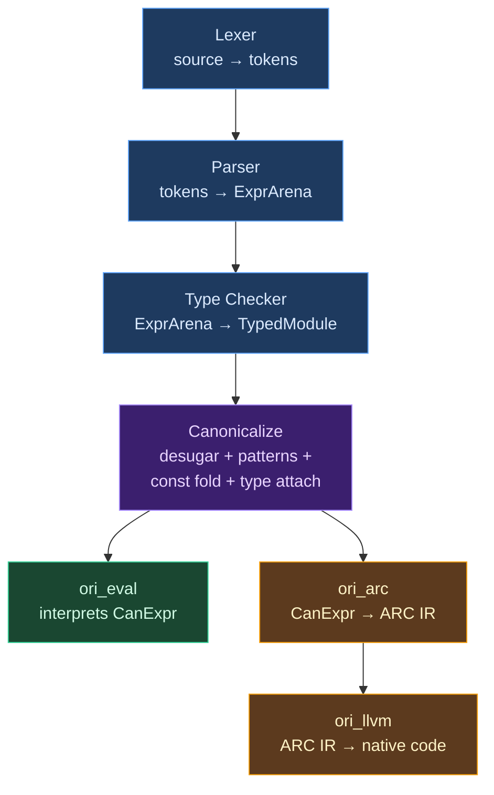

# Canonicalization Overview

## What Is Canonicalization?

Every compiler faces a structural dilemma. The surface syntax that programmers write is rich and redundant — named arguments, template strings, spread operators, pattern matching with guards. Programmers need this expressiveness. But the backends that execute or compile code need something simpler: a uniform, minimal representation where each concept appears in exactly one form. **Canonicalization** is the compiler phase that bridges this gap, transforming the sugared, type-checked AST into a canonical intermediate representation that downstream phases can consume without dealing with syntactic variation.

The term "canonical" comes from mathematics — a **canonical form** is the simplest, most standard representation of an object within its equivalence class. Just as every rational number has a canonical form (3/6 becomes 1/2), every Ori expression has a canonical form: `fetch(timeout: 5s, url: u)` becomes `fetch(u, 5s)`, template strings become concatenation chains, and match expressions become decision trees. The canonical form preserves semantics exactly while eliminating representational choices.

### The IR Spectrum

Compilers vary widely in how many intermediate representations they use and where they place canonicalization in the pipeline. Understanding this spectrum clarifies Ori's position:

**Single-IR compilers** use one representation from parsing through code generation. Early C compilers, many scripting language interpreters, and simple tree-walking evaluators work this way. The advantage is simplicity — one data structure, one set of traversal functions. The disadvantage is that every phase must handle every syntactic variant, including sugar forms that are only meaningful at the surface level.

**Two-IR compilers** distinguish between a "high" representation close to source syntax and a "low" representation suitable for optimization and codegen. This is the most common architecture for production compilers. Rust uses HIR (High-level IR, close to source) and MIR (Mid-level IR, control flow graphs). Go uses the AST and SSA form. The canonicalization phase is the boundary between these two levels.

**Multi-IR compilers** use a pipeline of progressively simpler representations. GHC is the canonical example: source Haskell → Core (a tiny functional calculus) → STG (evaluation-order-explicit) → Cmm (imperative, C-like) → native code. Each IR level strips away more abstraction. This enables sophisticated optimizations at each level but creates a significant engineering burden — every language feature must be represented and tested across all IR levels.

Ori sits in the **two-IR** category. The parser produces an `ExprArena` (rich, sugared AST). The canonicalization phase lowers this to a `CanArena` (sugar-free canonical IR). Both the tree-walking evaluator (`ori_eval`) and the ARC/LLVM pipeline (`ori_arc` + `ori_llvm`) consume the canonical form. This means desugaring, pattern compilation, and constant folding happen exactly once, and both backends operate on the same simplified representation.

### What Canonicalization Encompasses

The term "canonicalization" is used differently across compiler communities. In some contexts it means only desugaring (removing syntactic sugar). In others it includes normalization (rewriting to a standard form), lowering (translating high-level constructs to lower-level ones), or simplification (algebraic rewrites). Ori's canonicalization phase is deliberately broad — it performs four transformations in a single pass:

1. **Desugaring** — eliminating syntactic sugar (named calls → positional, templates → concatenation, spreads → method calls)
2. **Pattern compilation** — compiling match patterns into decision trees and checking exhaustiveness
3. **Constant folding** — pre-evaluating compile-time-known expressions (`1 + 2` → `3`, `if true then A else B` → `A`)
4. **Type attachment** — annotating every canonical node with its resolved type from the type checker

These four concerns are bundled into a single pass because they share the same traversal and because some interact — constant folding can only run after desugaring has produced the canonical binary/unary nodes, and pattern compilation needs type information to resolve enum variants.

### When to Canonicalize: Before vs After Type Checking

A crucial design decision is whether canonicalization happens before or after type checking. Both approaches are used in production compilers:

**Before type checking.** Haskell desugars `do`-notation, list comprehensions, and `where`-clauses before the type checker sees them. Scala desugars `for`-comprehensions into `flatMap`/`map`/`filter` chains before inference. The advantage is that the type checker operates on a simpler language. The disadvantage is that error messages reference desugared code — when a `do`-notation expression fails to type-check, the error may mention `>>=` and `return` rather than the `do` syntax the user wrote.

**After type checking.** Ori, Roc, and Elm canonicalize after type checking. The type checker operates on the full sugared AST — named arguments, template literals, spreads — and produces error messages that reference the syntax the user actually wrote. Only after types are resolved does the canonicalization phase strip the sugar away. This requires the type checker to handle more variants, but produces significantly better diagnostics.

**Progressive.** Rust and GHC desugar in stages. Rust's parser handles compound assignment (`x += 1` → `x = x + 1`), the type checker handles operator overloading, and HIR→MIR lowering handles `for` loops, `?` operator, and pattern matching. GHC desugars `do`-notation early but defers pattern compilation to later. This distributes complexity across phases but makes it harder to reason about which representation a given piece of code is in at any point.

Ori uses a **hybrid** approach. Most desugaring happens after type checking in `ori_canon`, but a few transformations happen earlier because they affect type inference: compound assignment (`x += 1`) desugars in the parser, and pipe (`x |> f(a:)`) and comparison operators (`x < y`) desugar in the type checker.

## What Makes Ori's Canonicalization Distinctive

### Single-Pass Four-in-One Lowering

The `Lowerer` performs desugaring, pattern compilation, constant folding, and type attachment in a single recursive traversal of the AST. There are no separate passes — when the lowerer encounters a sugar variant it desugars inline, when it builds an arithmetic node it immediately attempts constant folding, and every output node gets its resolved type attached. This eliminates redundant tree walks while keeping each transformation's logic in its own module (`desugar/`, `patterns/`, `const_fold/`).

The dispatch is exhaustive on all `ExprKind` variants. The lowerer's `lower_expr()` method copies the expression kind out of the source arena (24 bytes), matches on it, and routes to the appropriate handler — direct mapping for leaf nodes, desugaring for sugar variants, pattern compilation for match expressions, and constant folding for arithmetic. This design means the lowerer can never silently pass through an unhandled variant.

### Type-Level Sugar Elimination

`CanExpr` is a **distinct type** from `ExprKind` — sugar variants like `CallNamed`, `TemplateLiteral`, and `ListWithSpread` physically cannot be represented in the canonical form. If a backend tries to match on a sugar variant, it gets a Rust compile error. This makes it impossible for backends to accidentally miss a desugaring case, unlike approaches that use the same AST type throughout and rely on runtime assertions or comments ("this variant should never appear after desugaring").

Both types are constrained to 24 bytes via `static_assert_size!`, ensuring that neither enum's discriminant bloats the other's memory layout.

### Arc-Shared Decision Trees

Decision trees are stored in a `DecisionTreePool` and wrapped in `Arc` for O(1) cloning. Both the tree-walking evaluator and the LLVM codegen share the exact same tree instances without copying. This matters because decision trees can be large for complex match expressions with nested patterns, and both backends need them simultaneously. The evaluator clones the `Arc` when entering a match (to release the borrow on `self`), and the AIMS pipeline receives the same shared reference during codegen.

### Content-Addressed Constants

The `ConstantPool` uses content-addressing via `FxHashMap<ConstValue, ConstantId>` to deduplicate compile-time values. Pre-interned sentinels (`unit`, `true`, `false`, `0`, `1`, `""`) get O(1) access through named constants (`ConstantPool::ZERO`, `ConstantPool::TRUE`). Folding happens opportunistically during lowering — after constructing a `Binary`, `Unary`, or `If` node, `try_fold()` immediately checks if it can be replaced with a `Constant(ConstantId)`.

### Phase Boundary Optimization: TypeRef

During lowering, the canonicalizer classifies identifiers as either `Ident(name)` (regular variable) or `TypeRef(name)` (type name — `Duration`, `Size`, user-defined types). This eliminates **phase bleeding** at the evaluator boundary: without `TypeRef`, the evaluator would need to check every identifier against the type registry on the hot path to determine if it's an associated function call target. With `TypeRef`, the evaluator can fast-path regular variables and only consult the type registry for explicitly marked references.

### Separate Index Spaces

`CanId` and `ExprId` are completely distinct newtypes. A `CanId` cannot accidentally be used to index the source `ExprArena`, and an `ExprId` cannot index the `CanArena`. This enforces the phase boundary at the type level — the canonical IR is a genuinely separate world from the AST, not a mutation of the same data structure.

## Architecture

### Pipeline Position



Canonicalization sits at the **fork point** between Ori's two execution paths. The tree-walking evaluator (`ori_eval`) consumes `CanonResult` directly for interpreted execution. The AIMS pipeline (`ori_arc`) also consumes `CanonResult`, lowering it further into ARC IR for reference-counting optimization before LLVM codegen.

Canonicalization is **not** a separate Salsa query. It runs inside `evaluated()` for the interpreter path, inside `check_source()` for the AOT/LLVM path, and inside the `check` command for pattern problem detection. This avoids a Salsa caching boundary at the canonical IR level — the canonical form is always fresh, never stale.

### Crate Organization

The canonicalization logic is split between two crates:

**`ori_ir::canon`** defines the canonical IR types — `CanExpr`, `CanArena`, `CanNode`, `ConstantPool`, `DecisionTreePool`, `PatternProblem`. These types live in `ori_ir` so that both `ori_canon` (producer) and consuming crates (`ori_eval`, `ori_arc`, `oric`) can access them without circular dependencies.

**`ori_canon`** contains the transformation logic — the `Lowerer`, desugaring, pattern compilation, constant folding, exhaustiveness checking, and validation. It depends on `ori_ir` (for the IR types), `ori_types` (for type resolution via `Pool`), and `ori_arc` (for the Maranget decision tree compiler).

```text
ori_canon/src/
├── lib.rs              # Module root, re-exports from ori_ir::canon
├── lower/              # AST → CanExpr dispatch
│   ├── mod.rs          # Lowerer struct, lower() and lower_module() entry points
│   ├── expr.rs         # Exhaustive ExprKind → CanExpr dispatch
│   ├── patterns.rs     # Match and multi-clause function lowering
│   ├── collections.rs  # List, Map, Struct, Call, Block lowering
│   ├── sequences.rs    # FunctionExp, Range lowering
│   └── misc.rs         # Helpers (cast target extraction)
├── desugar/            # 7 sugar variant eliminators
│   └── mod.rs          # CallNamed, Templates, Spreads → canonical form
├── patterns/           # Pattern matrix → decision tree compilation
│   └── mod.rs          # Delegates to ori_arc::decision_tree::compile
├── const_fold/         # Compile-time constant folding
│   └── mod.rs          # classify(), try_fold(), fold_binary(), fold_unary()
├── exhaustiveness/     # Pattern coverage analysis
│   └── mod.rs          # Non-exhaustive and redundant arm detection
└── validate.rs         # Post-lowering integrity checks (debug mode)
```

## What Happens During Lowering

The `Lowerer` performs four transformations in a single pass over the AST:

| Step | Module | What It Does |
|------|--------|-------------|
| **Desugaring** | `desugar` | Eliminates 7 syntactic sugar variants |
| **Pattern Compilation** | `patterns` | Compiles match patterns into decision trees |
| **Constant Folding** | `const_fold` | Pre-evaluates compile-time-known expressions |
| **Type Attachment** | (inline) | Annotates every `CanNode` with its resolved type |

After lowering, **exhaustiveness checking** (`exhaustiveness`) walks the compiled decision trees to detect non-exhaustive matches and redundant arms. A separate **validation** pass (`validate`) performs debug-mode integrity checks on the canonical IR.

### Lowering Entry Points

The lowerer has two entry points reflecting Ori's two evaluation modes:

**`lower()`** lowers a single expression — used by the interpreter path (`evaluated()`), which evaluates one expression at a time. Returns a `CanonResult` with a single `root` pointing to the lowered expression.

**`lower_module()`** lowers an entire module — used by the AOT/LLVM path (`check_source()`), which needs all function and method bodies. Returns a `CanonResult` with named `roots` (one per function/test) and `method_roots` (one per `impl`/`extend`/`def impl` method).

Both entry points create a `Lowerer` with pre-interned names (`to_str`, `concat`, `merge`) for desugaring efficiency, pre-allocated arena capacity based on source size, and sentinel constants in the `ConstantPool`.

## Canonical IR vs AST

`CanExpr` is a **distinct type** from `ExprKind`. Sugar variants cannot be represented in the canonical form, enforced at the Rust type level:

| Present in `ExprKind` | Present in `CanExpr` | What Happens |
|-----------------------|---------------------|-------|
| `CallNamed` | No | Desugared to positional `Call` |
| `MethodCallNamed` | No | Desugared to positional `MethodCall` |
| `TemplateLiteral` / `TemplateFull` | No | Desugared to string concatenation chains |
| `ListWithSpread` / `MapWithSpread` / `StructWithSpread` | No | Desugared to method calls |
| — | `Constant(ConstantId)` | Compile-time-folded values (new in canonical form) |
| — | `TypeRef(Name)` | Type references separated from variable references (new) |
| `Match` (flat arms) | `Match` with `DecisionTreeId` | Patterns pre-compiled to decision trees |

`CanExpr` has 46 variants (compared to `ExprKind`'s 47) — the seven sugar variants are removed, but `Constant`, `TypeRef`, and other canonical-only forms are added. Both enums are constrained to 24 bytes.

## Key Types

### CanNode

Every canonical expression carries its resolved type and source span:

```rust
pub struct CanNode {
    pub kind: CanExpr,
    pub span: Span,
    pub ty: TypeId,
}
```

The `TypeId` comes from the type checker's output — canonicalization does not perform type inference. Spans are preserved from the original AST to enable accurate error messages and debugging.

### CanArena

Struct-of-arrays storage for canonical expressions, mirroring `ExprArena`'s design:

```rust
pub struct CanArena {
    kinds: Vec<CanExpr>,       // Parallel arrays
    spans: Vec<Span>,          // indexed by CanId
    types: Vec<TypeId>,
    expr_lists: Vec<CanId>,    // Flattened argument/element lists
    map_entries: Vec<...>,     // Key-value pairs
    fields: Vec<...>,          // Struct fields
    binding_patterns: Vec<...>,// For destructuring
    params: Vec<...>,          // Lambda parameters
    named_exprs: Vec<...>,     // FunctionExp properties
}
```

The SoA layout provides cache-friendly sequential access — the evaluator typically reads `kinds` in a tight loop, and all kinds are contiguous in memory. Pre-allocation uses the heuristic `source_len / 20` expressions (same as `ExprArena`) to avoid repeated reallocations during lowering.

### CanonResult

The complete output of canonicalization:

```rust
pub struct CanonResult {
    pub arena: CanArena,
    pub constants: ConstantPool,
    pub decision_trees: DecisionTreePool,
    pub root: CanId,
    pub roots: Vec<CanonRoot>,        // Function/test entry points
    pub method_roots: Vec<MethodRoot>, // impl/extend/def_impl methods
    pub problems: Vec<PatternProblem>, // Exhaustiveness/redundancy issues
}
```

`CanonResult` is wrapped in `SharedCanonResult(Arc<CanonResult>)` for O(1) cloning across the evaluator and codegen paths. Problems (non-exhaustive matches, redundant arms) are accumulated during lowering and reported by the `check` command.

### ConstantPool

Content-addressed pool of compile-time values with pre-interned sentinels:

```rust
pub struct ConstantPool {
    values: Vec<ConstValue>,
    dedup: FxHashMap<ConstValue, ConstantId>,
}
```

Sentinels are pre-interned at known indices for O(1) access: `UNIT` (0), `TRUE` (1), `FALSE` (2), `ZERO` (3), `ONE` (4), `EMPTY_STR` (5).

### DecisionTreePool

Arc-wrapped decision trees for O(1) cloning across evaluator and codegen:

```rust
pub struct DecisionTreePool {
    trees: Vec<SharedDecisionTree>,  // SharedDecisionTree = Arc<DecisionTree>
}
```

## Multi-Clause Function Handling

When multiple function clauses share the same name (e.g., `@fib` with 3 clauses), the lowerer synthesizes a single function body as a match expression:

```ori
@fib (0: int) -> int = 0
@fib (1: int) -> int = 1
@fib (n: int) -> int = fib(n - 1) + fib(n - 2)
```

Becomes:

```text
@fib(param0) -> match param0 {
    0 -> 0
    1 -> 1
    n -> fib(n - 1) + fib(n - 2)
}
```

This unified match expression then goes through pattern compilation, producing a single decision tree. For multi-parameter clauses, the synthesized match scrutinizes a tuple of the parameters, with each column corresponding to one parameter position.

This unification means there is exactly one code path for pattern compilation — the same Maranget algorithm processes both explicit `match` expressions and multi-clause function definitions. No special-casing is needed in the evaluator or codegen.

## Prior Art

### Roc — Canonicalization as Named Phase

[Roc](https://github.com/roc-lang/roc) has a dedicated `can` crate (`crates/compiler/can/src/`) that transforms `ast::Expr` into `can::Expr`. Like Ori, Roc's canonicalization runs after parsing and performs desugaring, but Roc interleaves canonicalization with name resolution and constraint generation rather than running it as a pure post-type-checking pass. Roc's canonical IR eliminates string interpolation, record updates, and `when` (match) sugar. Both Roc and Ori use distinct source/canonical expression types rather than a shared AST with runtime assertions.

### Elm — Canonical to Optimized Pipeline

[Elm](https://github.com/elm/compiler) uses a three-stage pipeline: `Source` → `Canonical` → `Optimized`. The `Canonicalize` module (`compiler/src/Canonicalize/Expression.hs`) eliminates ports, effects, and operators. Decision trees are baked into the `Optimized` representation (not the Canonical one), which differs from Ori's approach of compiling patterns during canonicalization. Elm's separation of canonical and optimized forms allows pattern compilation to benefit from optimization information, at the cost of an additional IR transformation.

### GHC — Progressive Desugaring Through IR Layers

[GHC](https://gitlab.haskell.org/ghc/ghc) is the most extreme example of multi-stage canonicalization. Source Haskell is desugared into Core (a tiny System FC calculus), which eliminates `do`-notation, list comprehensions, `where`-clauses, and guards. Core is then simplified (inlining, specialization, fusion), then lowered to STG (which makes evaluation order explicit), then to Cmm (an imperative C-like IR), and finally to native code. Each IR transition eliminates abstraction. The tradeoff is extraordinary: GHC's optimization passes are among the most sophisticated in any production compiler, but maintaining four IR levels requires immense engineering effort.

### Rust — HIR to MIR Lowering

[Rust](https://github.com/rust-lang/rust) performs canonicalization in two stages. The parser handles compound assignment (`+=`), and the AST-to-HIR lowering (in `rustc_ast_lowering`) desugars `for` loops, `?` operator, `async`/`await`, and some lifetime elision. HIR-to-MIR lowering then handles pattern matching (decision trees), drop elaboration, and borrow checking. Ori's single-stage canonicalization is simpler but handles fewer transformations than Rust's two-stage approach.

### Zig — Comptime as Canonicalization

[Zig](https://github.com/ziglang/zig) takes a distinctive approach: its `Sema` pass performs type checking, semantic analysis, and comptime evaluation simultaneously. Zig's comptime is far more powerful than Ori's constant folding — it can execute arbitrary Zig code at compile time, including loops, function calls, and memory allocation. This makes Zig's "canonicalization" effectively a partial evaluator. The tradeoff is implementation complexity — Zig's `Sema.zig` is one of the largest single files in any production compiler.

## Design Tradeoffs

**Single pass vs. multi-pass canonicalization.** Ori performs desugaring, pattern compilation, constant folding, and type attachment in a single recursive traversal. An alternative would be separate passes — desugar first, then fold constants, then compile patterns. Separate passes are easier to test in isolation and can be reordered or disabled independently. The single-pass approach avoids redundant traversals (for a language with 7 sugar variants and typical file sizes, this is a modest but real saving) and ensures that constant folding sees desugared forms immediately. The tradeoff is that the four concerns are coupled at the dispatch level — `lower_expr()` must know about all of them.

**Distinct IR type vs. shared AST type.** Using `CanExpr` as a separate type from `ExprKind` means every expression kind that appears in both must be duplicated in both enums. When a new expression form is added to the language, it must be added to both `ExprKind` and `CanExpr` (unless it's sugar, in which case only `ExprKind`). The benefit — compile-time guarantees that sugar cannot leak to backends — is substantial enough to justify the duplication, particularly since sugar-related bugs in backends are notoriously hard to diagnose (they manifest as "this should never happen" panics in code paths that lack test coverage for the variant).

**Post-type-checking canonicalization vs. pre-type-checking.** Running canonicalization after type checking means the type checker handles more expression variants (47 instead of ~40). The payoff is in error messages: type errors reference the syntax the programmer wrote (`fetch(timeout: 5s, url: u)`) rather than desugared forms (`fetch(u, 5s)`). For a language that emphasizes readability and named arguments, this is a significant usability win.

**Opportunistic constant folding vs. dedicated pass.** Constants are folded inline during lowering via `try_fold()` rather than in a separate constant-folding pass. This means folding happens at most once per node (when the node is constructed), which is efficient but limits folding to single-step rewrites — `(1 + 2) + 3` folds to `3 + 3` then to `6` through recursive lowering, but cross-expression folding (propagating a constant across `let` bindings) is not performed. A dedicated constant propagation pass could catch more opportunities but would require an additional traversal.

**Pattern compilation delegation.** The Maranget decision tree algorithm currently lives in `ori_arc::decision_tree::compile`, and `ori_canon::patterns` delegates to it. This is an architectural compromise — the algorithm logically belongs in `ori_canon`, but it was first implemented in `ori_arc` for the AIMS pipeline. Future work will move it to `ori_canon` as the single source of truth.

## Related Documents

- [Desugaring](desugaring.md) — Sugar elimination details and the 7 sugar variants
- [Pattern Compilation](pattern-compilation.md) — Decision tree construction and exhaustiveness checking
- [Constant Folding](constant-folding.md) — Compile-time evaluation and the ConstantPool
- [AIMS](../09-aims/index.md) — AIMS pipeline (consumes canonical IR)
