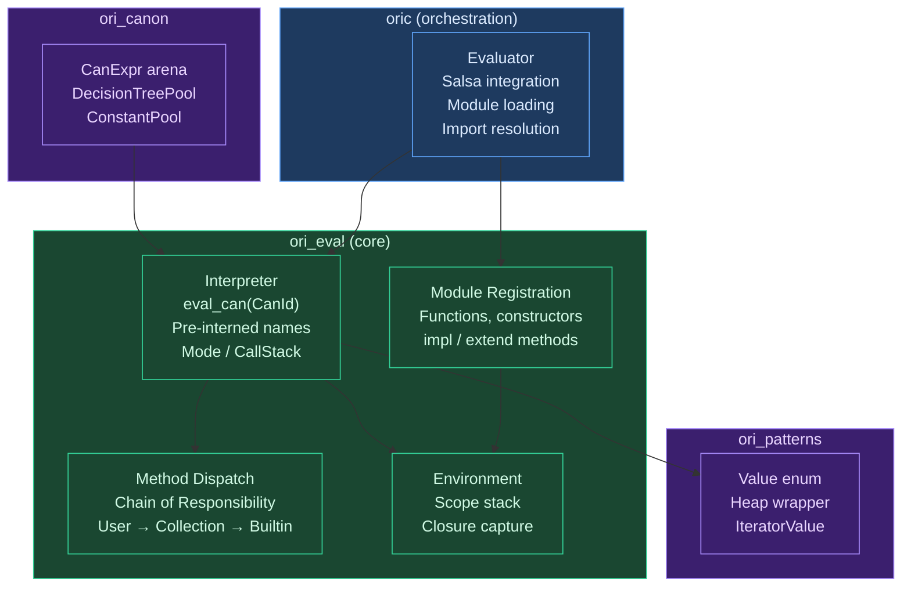
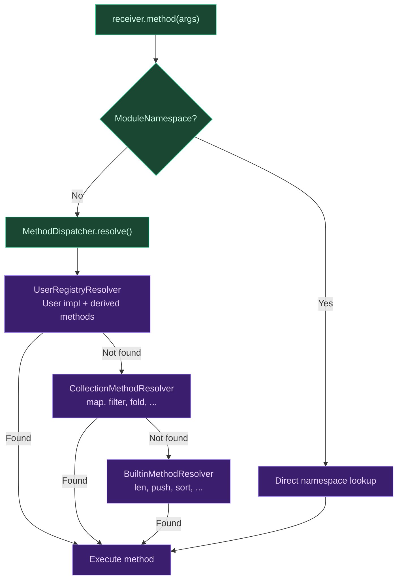

# Evaluator Overview

## What Is an Evaluator?

An evaluator is the component of a language implementation that gives meaning to programs. The parser transforms source text into a tree structure, the type checker verifies that the program is well-formed, and the evaluator answers the question that everything else exists to support: **what does this program do when you run it?**

The history of program evaluation is a history of tradeoffs between simplicity and speed. The earliest evaluators were direct — John McCarthy's original 1960 Lisp interpreter was a recursive function `eval` that walked the program's tree structure, evaluating each node by dispatching on its type. This **tree-walking** approach maps naturally onto the recursive structure of programs: to evaluate `a + b`, evaluate `a`, evaluate `b`, then add the results. Every functional programming textbook teaches this pattern because it is the most transparent way to define a language's semantics.

But tree-walking is slow. Each expression requires dispatching on its type, following pointers through a tree, and the tree's layout in memory is hostile to CPU caches. Production language implementations overwhelmingly choose a different approach: compile the tree to a simpler representation — **bytecode** for a virtual machine, or **machine code** for direct execution — and run that instead. CPython compiles to stack-machine bytecode. The JVM compiles to its own bytecode format. V8 compiles JavaScript to bytecode and then selectively JIT-compiles hot paths to machine code. Lua, Ruby, Erlang, and most production interpreters use bytecode VMs.

A third approach avoids interpretation entirely: **ahead-of-time (AOT) compilation** translates the entire program to machine code before execution. C, C++, Rust, Go, Zig, and Haskell (via GHC) work this way. The program runs at native speed with no interpretation overhead, at the cost of a compilation step that must happen before execution.

### Where Ori Sits

Ori uses **two** of these approaches simultaneously:

1. A **tree-walking interpreter** for development (`ori run`, `ori test`, REPL, WASM playground)
2. An **LLVM-based AOT compiler** for production (`ori build`)

This is not unusual — many modern languages provide both an interpreter and a compiler. Roc has an interpreter for the REPL and an LLVM-based compiler for production builds. Zig has a compile-time interpreter (comptime) alongside its LLVM/native backend. Lean 4 has an interpreter for compile-time reduction and a C code generator for executables. What distinguishes these designs is how the two backends share work, and Ori's answer is the **canonical IR**: both the interpreter and the LLVM pipeline consume the same sugar-free, pattern-compiled, constant-folded representation. Desugaring happens once.

## What Makes Ori's Evaluator Distinctive

### Canonical IR as the Sole Input

Most tree-walking interpreters evaluate a sugared AST — the same tree the parser produced, with template strings, named arguments, spread operators, and all the syntactic convenience features intact. Each evaluation rule must handle every variant, including sugar forms that are semantically equivalent to simpler constructs.

Ori's evaluator never sees the sugared AST. It operates exclusively on `CanExpr`, a sugar-free canonical representation produced by the [canonicalization phase](../07-canonicalization/index.md). Named arguments have been reordered to positional form. Template strings have become concatenation chains. Match expressions have been compiled into decision trees. This means the evaluator's dispatch table handles only **core** expression forms — no redundancy, no sugar variants, no "this case should never appear" arms.

### Salsa-Free Core

The evaluator is split across two crates with a deliberate architectural boundary:

- **`ori_eval`** — the core interpreter, with zero Salsa dependency. It takes an arena, a string interner, and a canonical IR result, and evaluates expressions. No file system access, no query framework, no database. This crate can be compiled to WASM, embedded in a playground, or used in tests without any infrastructure.

- **`oric/src/eval/`** — the high-level orchestration layer that wraps `ori_eval` with module loading, import resolution, prelude management, and Salsa integration.

This split is not accidental. The core interpreter's portability enables the WASM playground to use the same evaluation logic as the CLI, without pulling in Salsa's dependency graph. The same `Interpreter` struct runs programs in both contexts.

### Pre-Interned Name Caches

Method dispatch in a tree-walking interpreter happens on every `.method()` call — potentially millions of times per program. Comparing method names as strings would be catastrophic for performance. Ori pre-interns over 150 method names, type names, operator names, and format names at interpreter construction time, storing them as `Name` values (interned `u32` indices). Every hot-path comparison is then `u32 == u32` — a single CPU instruction — rather than a string comparison.

These caches are organized by domain: `TypeNames` for type checks, `OpNames` for operator trait dispatch, `BuiltinMethodNames` for the 150+ built-in methods, `PrintNames` for print functions, `PropNames` for `FunctionExp` properties, and `FormatNames` for format specifier construction.

### Strategy-Based Derived Method Dispatch

When a user writes `#derive(Eq, Clone, Hashable)` on a type, the compiler generates method implementations at compile time. Many interpreters implement each derived trait as a separate code path — one handler for `Eq`, another for `Clone`, another for `Hashable`. Ori instead uses a **strategy pattern**: each `DerivedTrait` describes itself as a `(FieldOp, CombineOp)` pair, and a single `eval_derived_method()` function handles all derived traits by applying the field operation to each field and combining the results. Adding a new derived trait means defining its strategy, not writing a new evaluation handler.

### Arena Threading for Cross-Module Calls

Each module's expressions live in their own arena, and an `ExprId` is only valid within its originating arena. When the evaluator calls a function from a different module, it must switch to that function's arena. Ori handles this by storing a `SharedArena` reference inside every `FunctionValue` — when a cross-module call occurs, the evaluator creates a child `Interpreter` bound to the callee's arena. This arena threading pattern ensures that expression lookups always use the correct arena, even across deeply nested cross-module call chains.

## Architecture

The evaluator's component structure reflects the Salsa-free core / orchestration wrapper split:

### Evaluation Flow

A program's journey through the evaluator follows a clear pipeline:

The evaluator never reaches back into earlier phases. It receives the canonical IR (a `SharedCanonResult` containing a `CanArena`, `DecisionTreePool`, and `ConstantPool`) and evaluates it. The type checker's output (`expr_types`) was consumed during canonicalization to attach types to canonical nodes. By the time evaluation begins, the full information is embedded in the canonical IR.

### The Interpreter Struct

The `Interpreter` is the central engine — a struct with roughly 20 fields that together define the evaluation state:

| Field Group | Purpose |
|------------|---------|
| `interner`, `arena`, `canon` | Data sources — string interner, expression arena, canonical IR |
| `env` | Variable scope stack (push/pop per block, capture for closures) |
| `type_names`, `op_names`, `builtin_method_names`, ... | Pre-interned name caches for hot-path `u32` comparison |
| `mode`, `mode_state` | Evaluation mode (Interpret / TestRun / ConstEval) with per-mode budget |
| `call_stack` | Frame tracking with depth limits and backtrace capture |
| `user_method_registry` | `SharedMutableRegistry` — user impl/extend/derive methods, dynamically updated |
| `method_dispatcher` | Pre-built Chain of Responsibility for method resolution |
| `imported_arena` | `SharedArena` for cross-module function calls |
| `print_handler` | Capability provider for the `Print` capability |
| `scope_ownership` | RAII flag for panic-safe scope cleanup |

Both `Interpreter` and the high-level `Evaluator` use the **builder pattern** for construction, with sensible defaults for common cases and explicit overrides for testing and embedding.

### Evaluation Modes

The interpreter's behavior is parameterized by `EvalMode`, enabling the same core engine to serve three different use cases:

| Mode | Used By | I/O Policy | Recursion Limit | Budget |
|------|---------|------------|-----------------|--------|
| **Interpret** | `ori run` | Full | None (native) / 200 (WASM) | None |
| **TestRun** | `ori test` | Buffered capture | 500 | None |
| **ConstEval** | Compile-time evaluation | Forbidden | 64 | Configurable call limit |

`ModeState` tracks per-mode mutable state: call budget for `ConstEval`, optional performance counters activated by `--profile`. Counter increments are inlined no-ops when profiling is off, so there is zero overhead in normal execution.

## Method Dispatch

Method calls are the most performance-sensitive operation in the evaluator — every `.method()` call dispatches through the resolution chain. Ori uses a **Chain of Responsibility** pattern with three resolvers, checked in priority order:

The `UserRegistryResolver` is a **unified resolver** — it checks both user-defined methods (from `impl` blocks) and derived methods (from `#derive(...)`) in a single lookup, using the `SharedMutableRegistry<UserMethodRegistry>`. This registry is dynamically updated during module loading, and the `Arc<RwLock<T>>` wrapper allows the cached `MethodDispatcher` to see newly registered methods without rebuilding.

### Operator Dispatch

Binary and unary operators use a **dual-dispatch** strategy for performance:

- **Primitive types** (int, float, bool, str, Duration, Size) use direct evaluation — no method lookup, no trait dispatch, just a match on the operator and operand types
- **User-defined types** dispatch through operator trait methods (`Add::add`, `Sub::subtract`, etc.)
- **Short-circuit operators** (`&&`, `||`) evaluate the left operand first and skip the right if the result is determined
- **Mixed-type operations** (e.g., `int * Duration`) fall back to direct evaluation because primitives do not implement trait methods with `Self` receiver

### Cross-Crate Method Consistency

The evaluator exports an `EVAL_BUILTIN_METHODS` constant listing every `(type_name, method_name)` pair it handles. The type checker exports a corresponding `TYPECK_BUILTIN_METHODS`. A consistency test verifies that every eval method is known to the type checker. Known exceptions — operator methods that the type checker handles via trait lookup rather than builtin handlers — are tracked in a `KNOWN_EVAL_ONLY` list.

## Prior Art

**Roc's evaluator** shares the most structural similarity with Ori's. Roc also has a tree-walking interpreter for development and an LLVM-based compiler for production, with both consuming a canonicalized IR. Roc's `can` module produces a sugar-free representation analogous to Ori's `CanExpr`. The key difference is architecture: Roc's interpreter is more tightly coupled to its compilation infrastructure, while Ori's `ori_eval` is deliberately Salsa-free for portability.

**Lean 4's interpreter** evaluates expressions during compilation for compile-time reduction (similar to Ori's `ConstEval` mode). Lean's approach is more sophisticated — it uses a bytecode VM for performance-critical compile-time evaluation — but serves the same purpose: running code at compile time with restricted capabilities.

**Zig's comptime interpreter** is perhaps the closest analog to Ori's `ConstEval` mode. Zig evaluates `comptime` expressions during compilation using a tree-walking interpreter with strict budget limits, forbidden I/O, and reduced recursion depth — exactly the constraints Ori applies in `ConstEval` mode.

**GHC's reduction engine** (for Template Haskell and type-level computation) walks Core expressions and reduces them. Like Ori, GHC's evaluator operates on a desugared IR rather than surface syntax. Unlike Ori, GHC's evaluator works with a much more complex IR (System FC with coercions).

**Ruby's YARV** (Yet Another Ruby VM) replaced MRI's tree-walking interpreter with a bytecode VM in Ruby 1.9, yielding roughly 2-5x speedups. This is the canonical example of the performance ceiling that tree-walking hits and the typical upgrade path. Ori addresses this differently — rather than building a bytecode VM, it provides AOT compilation via LLVM for performance-critical paths.

## Design Tradeoffs

**Tree-walking vs bytecode VM.** Ori chose tree-walking for the interpreter despite its performance limitations. The rationale: the interpreter exists for development, not production. Development tasks (running tests, checking types, REPL interaction) involve small to medium programs where interpretation overhead is acceptable. Production performance comes from the LLVM backend. Building a bytecode VM would require designing an instruction set, writing a compiler from CanExpr to bytecodes, implementing a dispatch loop, and maintaining all of this alongside the LLVM backend — significant engineering cost for modest benefit in the development workflow.

**Single struct vs interpreter object hierarchy.** Some evaluator designs use an object hierarchy — a base `Evaluator` class with subclasses for different modes. Ori uses a single `Interpreter` struct parameterized by `EvalMode`. This avoids dynamic dispatch overhead and keeps all evaluation logic in one place, at the cost of conditional checks on the mode in a few places (print handling, recursion limits).

**`SharedMutableRegistry` vs rebuilding.** The `UserMethodRegistry` uses `Arc<RwLock<T>>` for interior mutability, allowing module loading to register new methods while the `MethodDispatcher` holds a reference. The alternative — rebuilding the dispatcher after each module load — would be simpler but wasteful for programs with many imports.

**Clone-per-child call stack.** When calling a function, the call stack is cloned into the child interpreter. This is O(N) per call (~24 bytes per frame, ~24 KiB at 1000 depth). The alternative — sharing the stack via `Rc<RefCell<Vec<CallFrame>>>` — would avoid cloning but complicate lifetime management across arena boundaries. At typical recursion depths, the clone cost is negligible.

## Related Documents

- [Tree Walking](tree-walking.md) — Canonical expression dispatch, evaluation strategy
- [Environment](environment.md) — Variable scoping, closure capture, RAII guards
- [Value System](value-system.md) — Runtime value representation, Heap<T>, factory methods
- [Module Loading](module-loading.md) — Import resolution, Salsa-free registration
- [Canonicalization](../07-canonicalization/index.md) — The phase that produces the evaluator's input
- [ARC System](../09-arc-system/index.md) — The alternative backend consuming the same canonical IR
