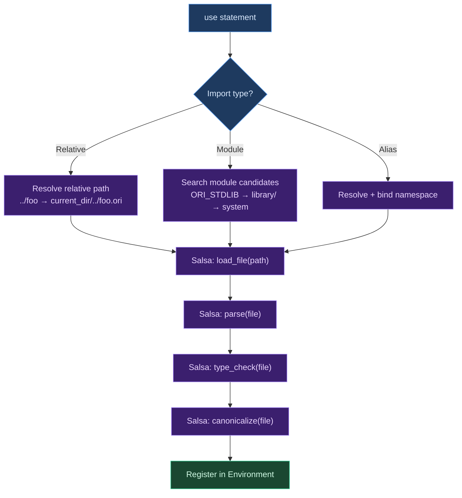

# Module Loading

## What Is Module Loading?

A module system allows programs to be split across multiple files, with each file defining a set of names (functions, types, constants) that other files can import. **Module loading** is the runtime process of taking an import declaration (`use std.math { sqrt }`), locating the corresponding source file, processing it, and making its definitions available to the importing module.

This process is deceptively complex. The module loader must resolve paths (relative vs absolute vs standard library), handle circular dependencies, manage the order of definition registration, and bridge the gap between compile-time analysis (type checking) and runtime availability (making values callable). In a compiled language, module loading is entirely a compile-time concern. In an interpreter, it happens at evaluation time — which means the loader must orchestrate parsing, type checking, canonicalization, and registration for each imported module during program execution.

### Module System Design Space

Languages vary significantly in how they handle modules:

| Aspect | Static (Rust, Haskell) | Dynamic (Python, JS) | Ori |
|--------|----------------------|---------------------|-----|
| When resolved | Compile time | Runtime (on import statement) | Compile time (Salsa) |
| Circular imports | Allowed with restrictions | Allowed (lazy) | Detected and rejected |
| Load order | Determined by dependency graph | Sequential, first import wins | Dependency graph (Salsa) |
| Caching | Compilation units | `sys.modules` / module cache | Salsa memoization |
| Re-evaluation | Never | On reload | Never (Salsa) |

Ori's module system sits between static and dynamic: resolution happens through Salsa's query framework (which provides caching and dependency tracking like a static compiler), but the evaluator registers values at runtime (like a dynamic language's import statement). This hybrid approach gives the predictability of static resolution with the flexibility of interpreted execution.

### The Two-Crate Split

Module loading in Ori is split across two crates, reflecting the Salsa-free core design:

- **`ori_eval/src/module_registration/`** — pure functions that register module contents (functions, types, methods, constructors) into an `Environment` and `UserMethodRegistry`. No Salsa dependency. Any client (CLI, WASM playground, test harness) can call these directly.

- **`oric/src/eval/`** — orchestration layer that handles import resolution, Salsa-tracked file loading, prelude management, and coordinates the registration functions. This crate depends on Salsa.

This split matters because the WASM playground, embedded interpreters, and test utilities need to register modules without pulling in Salsa's entire dependency graph. The pure registration functions accept explicit parameters (arena, environment, registry) rather than reaching into a Salsa database.

## Import Resolution

### Import Types

Ori supports four forms of import:

**Relative imports** resolve paths relative to the current file:

```ori
use "./math" { add, subtract }
use "../utils" { helper }
use "./http/client" { get, post }
```

**Module imports** resolve through the standard library search path:

```ori
use std.math { sqrt, abs }
use std.time { Duration }
```

**Module aliases** bind the entire module to a name, enabling qualified access:

```ori
use std.net.http as http

http.get(url: "https://example.com")
```

**Private and re-exported imports**:

```ori
use "./internal" { ::private_helper }    // Private import
pub use "./internal" { helper, Widget }  // Re-export
```

### Resolution Process

Import resolution goes through Salsa for dependency tracking:



Module path resolution searches multiple locations in order:

1. **`ORI_STDLIB` environment variable** — explicit stdlib path override
2. **Walk up directory tree** — look for `library/` directories (finds project-local and repo-level standard libraries)
3. **System locations** — `/usr/local/lib/ori/stdlib/` and similar platform-specific paths

Each candidate path is tried with both file form (`math.ori`) and directory form (`math/mod.ori`).

### Circular Import Detection

Circular imports are detected through Salsa's query dependency graph. When module A imports module B which imports module A, Salsa detects the cycle during query evaluation and reports it as an error. This is more robust than manual cycle tracking because Salsa handles transitive dependencies automatically — even A → B → C → A cycles are caught without explicit bookkeeping.

## The Loading Pipeline

The `Evaluator::load_module` method orchestrates the full loading process. Understanding the order of operations is important because later steps depend on earlier ones:

### Step 1: Prelude Auto-Loading

```rust
if !self.prelude_loaded {
    self.load_prelude(file_path)?;
}
```

The prelude (`library/std/prelude.ori`) is loaded automatically before the first user module. It defines fundamental types (`Option`, `Result`, `Ordering`), traits (`Eq`, `Clone`, `Printable`), and built-in functions (`print`, `assert_eq`, `panic`). The `prelude_loaded` flag ensures it is loaded exactly once.

### Step 2: Import Resolution

For each `use` statement in the module, the evaluator resolves the import path through Salsa, which triggers parsing and type checking of the imported module (cached if already loaded by another import). The resolved module's public definitions are then selectively imported based on the import's item list.

### Step 3: Arena Creation

```rust
let shared_arena = SharedArena::new(parse_result.arena.clone());
```

A `SharedArena` wraps the module's expression arena for sharing. Every function created from this module will carry a reference to this shared arena — this is the arena threading mechanism that ensures cross-module calls use the correct arena for expression lookup.

### Step 4: Function Registration

```rust
register_module_functions(&module, &shared_arena, env, canon);
```

Each function declaration in the module becomes a `FunctionValue` bound in the environment. The function value carries:
- Parameter names (from the arena)
- Captured environment (all currently visible bindings, shared via `Arc`)
- The `SharedArena` reference (for arena threading)
- Required capabilities (`uses` clause)

Functions within the same module share captures via `Arc<FxHashMap<Name, Value>>` — a single capture map is computed once and shared across all functions, enabling mutual recursion (each function can see the others in its captured environment).

### Step 5: Constructor Registration

```rust
register_variant_constructors(&module, env);
register_newtype_constructors(&module, env);
```

Sum type variants and newtypes are registered as callable values in the global scope:

- **Unit variants** (no fields) are registered as `Value::Variant` directly — `None` is just a value, not a function
- **Field variants** are registered as `Value::VariantConstructor` — callable values that create `Value::Variant` when applied to arguments
- **Newtypes** are registered as `Value::NewtypeConstructor` — single-argument constructors

### Step 6: Method Collection

```rust
let mut user_methods = UserMethodRegistry::new();
let captures = self.env().capture();
collect_impl_methods(&module, &shared_arena, &captures, canon, interner, &mut user_methods);
collect_extend_methods(&module, &shared_arena, &captures, canon, interner, &mut user_methods);
```

Methods from `impl` blocks and `extend` blocks are collected into a `UserMethodRegistry`. Each method becomes a `UserMethod` — similar to `FunctionValue` but with type-name-based dispatch rather than direct name binding.

For trait implementations, default methods from the trait definition are included unless explicitly overridden in the `impl` block. The collector builds a trait map to look up default methods and checks which ones the `impl` already provides.

### Step 7: Derived Trait Processing

```rust
process_derives(&module, &type_registry, &mut user_methods, interner);
```

Types with `#derive(Eq, Clone, Hashable, ...)` get automatically generated method implementations. The derive processor creates strategy-based methods (see [Evaluator Overview](index.md) — Strategy-Based Derived Method Dispatch) and adds them to the user method registry.

### Step 8: Registry Merge

```rust
self.user_method_registry().write().merge(user_methods);
```

The collected methods are merged into the interpreter's global `UserMethodRegistry` via `SharedMutableRegistry<T>` (which wraps `Arc<RwLock<T>>`). This merge happens atomically — all methods from the module become visible to the method dispatcher at once.

The `SharedMutableRegistry` pattern is essential here: the `MethodDispatcher` was built at interpreter construction time with a reference to the registry. Using `Arc<RwLock<T>>` allows the cached dispatcher to see newly registered methods without rebuilding the dispatch chain.

## Module Alias Registration

When a module is imported with `as`, the evaluator creates a `ModuleNamespace` value:

```rust
fn register_module_alias(import, imported, env, alias) {
    let mut namespace: BTreeMap<Name, Value> = BTreeMap::new();

    for func in &imported.module.functions {
        if func.is_public {
            // Create FunctionValue with imported module's arena
            namespace.insert(func.name, Value::Function(func_value));
        }
    }

    env.define(alias, Value::module_namespace(namespace), Mutability::Immutable);
}
```

The resulting `ModuleNamespace` value is a `BTreeMap<Name, Value>` containing all public functions from the imported module. Method calls on a namespace (`http.get(url:)`) bypass the normal method dispatch chain — the interpreter checks for `ModuleNamespace` receivers early and performs a direct map lookup.

## Test Module Access

Test modules in `_test/` directories with `.test.ori` extension receive special treatment: they can access private items from their parent module without the `::` prefix. This enables thorough testing of internal implementation details while maintaining the privacy boundary for regular imports.

The `is_test_module()` function checks both the file extension (`.test.ori`) and the directory structure (`_test/` parent directory) to determine test module status.

## Prior Art

**Rust's module system** resolves all imports at compile time through the module tree. Modules correspond to files, and `use` statements create name bindings that are resolved during name resolution (before type checking). Circular module dependencies are allowed (the module tree is a DAG of items, not files). Ori's approach is simpler — one file = one module, no nested module declarations, no `mod.rs` convention (though `mod.ori` is supported as an alternative file name).

**Python's import system** loads modules at runtime, caching them in `sys.modules`. The first `import` triggers file loading, compilation to bytecode, and execution of the module's top-level code. Subsequent imports return the cached module. Ori's Salsa-based loading is analogous — Salsa memoizes the parse/typecheck/canonicalize queries, so each module is processed at most once.

**Go's package system** uses directory-based packages with explicit imports. Like Ori, Go does not allow circular imports. Unlike Ori, Go requires all imports to be used (unused imports are compile errors). Go's approach is fully static — there is no runtime import resolution.

**Haskell's module system** (GHC) supports circular imports through `.hs-boot` files that provide forward declarations. This is more flexible than Ori's flat rejection of circular imports but adds complexity. Ori's prohibition is simpler and encourages better module structure.

**Node.js's `require()`** loads modules synchronously, executing each module's code on first require and caching the `exports` object. Circular requires are handled by returning a partial `exports` object (whatever has been assigned so far). This can produce surprising behavior where the same module returns different values depending on when it is required. Ori avoids this class of bugs by rejecting circular imports entirely.

## Design Tradeoffs

**Salsa-based resolution vs manual caching.** Using Salsa for import resolution provides automatic caching, incremental recomputation, and cycle detection. The alternative — manual caching with a `HashMap<PathBuf, Module>` — would be simpler but would not integrate with Ori's incremental compilation infrastructure. Since the CLI already uses Salsa for parsing and type checking, extending it to module loading is natural.

**Salsa-free registration functions vs `Evaluator` methods.** The registration functions (`register_module_functions`, `collect_impl_methods`, etc.) are standalone functions that take explicit parameters. They could instead be methods on `Evaluator`, which would simplify their signatures. The standalone approach was chosen for portability — the WASM playground and test utilities can use these functions without constructing an `Evaluator` or depending on Salsa.

**Shared captures via `Arc` vs per-function copies.** Module functions share a single `Arc<FxHashMap<Name, Value>>` for their captured environment. The alternative — giving each function its own copy — would use more memory (one hash map per function × many functions per module) but would avoid the `Arc` overhead. Since module functions typically have identical capture sets (all visible bindings at module scope), sharing is both correct and efficient.

**Reject circular imports vs lazy resolution.** Ori rejects circular imports entirely. Python and JavaScript allow them through lazy resolution or partial exports. Rejection is simpler to implement, produces better error messages, and encourages module designs with clean dependency hierarchies. The cost is that some natural designs (mutual recursion across modules) require restructuring — either combining the modules or extracting shared definitions into a third module.

**`BTreeMap` for `ModuleNamespace` vs `FxHashMap`.** Module namespaces use `BTreeMap<Name, Value>` for deterministic iteration order and Salsa compatibility. Since namespace lookups are infrequent (only on qualified access like `math.sqrt`), the O(log n) lookup cost vs O(1) for `FxHashMap` is negligible.

## Related Documents

- [Evaluator Overview](index.md) — Architecture and the Salsa-free core design
- [Environment](environment.md) — Where module definitions are registered
- [Value System](value-system.md) — `FunctionValue`, `ModuleNamespace`, and constructors
- [Salsa Integration](../01-architecture/salsa-integration.md) — The query framework powering import resolution
