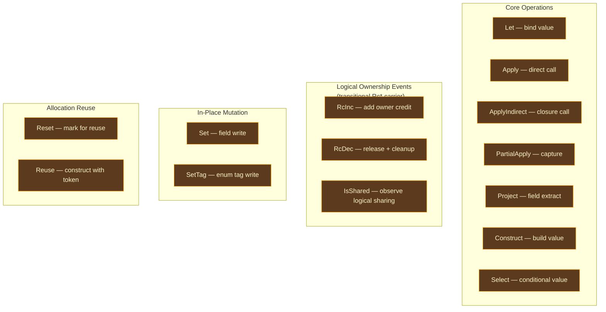
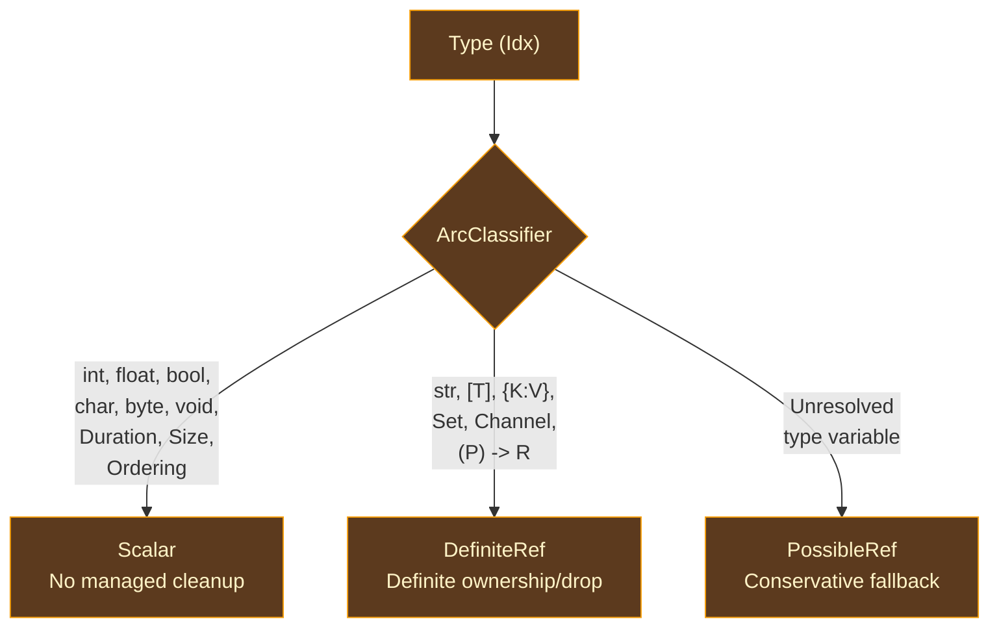

# ARC IR

## Why a Separate IR for Memory Management?

Compilers use intermediate representations to bridge the gap between what programmers write and what machines execute. Each IR is designed for a specific kind of analysis, and the canonical IR that enters AIMS — a typed expression tree with implicit control flow — is the wrong shape for ownership and lifetime analysis.

Ownership and cleanup decisions depend on **control flow**: a variable's last use, branch flow, and closure capture lifetime must be known. Answering those questions requires basic blocks, terminators, and a control-flow graph where dataflow equations can be solved.

Reference counting is one later physical realization, not the reason this shared IR exists.

Optimizing compilers lower the high-level AST into a **basic-block IR** with explicit control flow: LLVM uses LLVM IR; Rust uses MIR; GHC uses STG then Cmm; [Lean 4](https://github.com/leanprover/lean4) uses LCNF; [Swift](https://github.com/swiftlang/swift) uses SIL. These IRs share a fundamental structure of functions, sequential blocks, terminators, and SSA-like value identities.

Ori's ARC IR lowers canonical IR into basic blocks with explicit jumps, branches, and switches; each binding creates a fresh `ArcVarId`, while block parameters carry mutable values across merge points. This shape makes AIMS backward dataflow, contract computation, and unified realization standard dataflow algorithms.

### What Makes ARC IR Distinctive

ARC IR is a **backend-neutral domain-specific IR for ownership and lifetime analysis**, and AIMS is its single ownership, drop, and effect calculus. The evaluator branches from canonical IR as the abstract behavioral oracle; VM, LLVM, native, compiled-WASM, and JIT paths consume frozen AIMS facts without rerunning the calculus:

- **Type classification is embedded**: every variable carries its `ArcClass` (Scalar, DefiniteRef, PossibleRef), so AIMS analysis never queries the type system
- **Ownership annotations are first-class**: function parameters carry `Ownership`, call arguments carry `ArgOwnership`
- **Logical ownership events are explicit instructions**: `RcInc` and `RcDec`
  freeze event identity, operand, multiplicity, order, and CFG edge. Production
  binds each event to a stable `ValueSemanticsId`/`ExecutableDropPlanId`; the
  current embedded `RcStrategy` is a transitional physical-shape carrier, not
  the final AIMS vocabulary.
- **Reuse is a first-class concept**: `Reset`/`Reuse` instructions model in-place allocation reuse as IR constructs, not ad-hoc pattern matching
- **Ownership-relevant value semantics are pre-computed**: each variable has one
  stable logical classification and drop-plan identity. The current
  `ValueRepr` (`Scalar`, `RcPointer`, `Aggregate`, `FatValue`) is a transitional
  analysis carrier; its names do not prescribe a VM or compiled layout.

## Function Structure

### ArcFunction

A complete function body in ARC IR. Contains everything needed for AIMS analysis and realization:

| Field | Type | Purpose |
|-------|------|---------|
| `name` | `Name` | Interned function name |
| `params` | `Vec<ArcParam>` | Parameters with ownership annotations |
| `return_type` | `Idx` | Return type (Pool index) |
| `blocks` | `Vec<ArcBlock>` | Basic blocks in definition order |
| `entry` | `ArcBlockId` | Entry block ID |
| `var_types` | `Vec<Idx>` | Type per variable, indexed by `ArcVarId` |
| `var_reprs` | `Vec<ValueRepr>` | Transitional ownership-shape evidence per variable (populated by `compute_var_reprs`); production executable facts use stable logical value/drop-plan identities |
| `cow_annotations` | `CowAnnotations` | Frozen per-COW-operation uniqueness verdicts |
| `drop_hints` | `DropHints` | Frozen unique-drop facts for `RcDec` targets |
| `is_fbip` | `bool` | Whether `#fbip` annotation is present for reuse enforcement |
| `num_captures` | `usize` | Leading parameters that are closure captures (0 for top-level functions) |

The `var_reprs` field starts empty and `compute_var_reprs` populates it with ownership-relevant shape without choosing target width, alignment, field offset, ABI, or register/slot placement. Those physical decisions belong to the VM or compiled layout plan.

### ArcBlock

A basic block: optional parameters for control flow merges, a sequential instruction body, and a terminator.

| Field | Type | Purpose |
|-------|------|---------|
| `id` | `ArcBlockId` | Block identifier |
| `params` | `Vec<(ArcVarId, Idx)>` | Block parameters (phi-node equivalent) |
| `body` | `Vec<ArcInstr>` | Instructions in execution order |
| `terminator` | `ArcTerminator` | How control exits this block |

Block parameters are ARC IR's phi-node mechanism: a merge block receives branch-specific versions, and each predecessor's `Jump` passes its version as an argument. [MLIR](https://mlir.llvm.org/) and Swift SIL use the same block-argument approach, which is easier to manipulate during AIMS analysis than backend-specific phi nodes.

### ID Types

Both `ArcVarId` and `ArcBlockId` are sequential `#[repr(transparent)]` newtypes over `u32` with `raw() -> u32` and `index() -> usize` accessors. Their distinct types prevent using a block ID as a variable ID or vice versa.

### ArcParam

A function parameter annotated with ownership:

| Field | Type | Purpose |
|-------|------|---------|
| `var` | `ArcVarId` | Variable ID for this parameter |
| `ty` | `Idx` | Type in the Pool |
| `ownership` | `Ownership` | `Owned` or `Borrowed` (refined by borrow inference) |

All parameters start as `Owned` during lowering and may be refined to `Borrowed` by AIMS's interprocedural contract computation. This "start conservative, refine" approach preserves safety: an unnecessarily `Owned` parameter adds redundant logical bookkeeping, while an incorrectly `Borrowed` parameter can leave a required owner credit unfunded and permit premature cleanup.

## Instruction Set

ARC IR has 15 instruction variants (see `compiler/ori_arc/src/ir/instr.rs::ArcInstr` — includes `CollectionReuse` alongside the scalar `Reuse` variant), organized by purpose:

### Core Operations

| Instruction | Purpose |
|-------------|---------|
| `Let { dst, ty, value }` | Bind an `ArcValue` (variable reference, literal, or primitive operation) to a new variable |
| `Apply { dst, ty, func, args, arg_ownership }` | Direct function call — `func` is a `Name`, resolved at link time |
| `ApplyIndirect { dst, ty, closure, args }` | Call through a closure value with an entry point and optional captured environment |
| `PartialApply { dst, ty, func, args }` | Capture arguments into a closure environment |
| `Project { dst, ty, value, field }` | Extract field `field` (by index) from a struct, enum payload, or tuple |
| `Construct { dst, ty, ctor, args }` | Build a composite value — structs, enum variants, tuples, collections, closures |
| `Select { dst, ty, cond, true_val, false_val }` | Conditional value selection; each physical projection chooses its encoding |

**Value-producing instructions** return `Some(dst)` from `defined_var()`. The `ArcValue` type used in `Let` has three variants: `Var(ArcVarId)` for referencing an existing variable, `Literal(LitValue)` for constants, and `PrimOp { op, args }` for primitive arithmetic and comparison operations.

The `CtorKind` enum on `Construct` distinguishes: `Struct(Name)`, `EnumVariant { enum_name, variant }`, `Tuple`, `ListLiteral`, `MapLiteral`, `SetLiteral`, and `Closure { func }`.

### Logical Ownership Operations (Transitional `Rc*` Carrier)

| Instruction | Purpose |
|-------------|---------|
| `RcInc { var, count, strategy }` | Freeze `count` additional logical ownership obligations for `var`. The current `strategy` field is migration residue used by shipped physical adapters. |
| `RcDec { var, strategy }` | Freeze one logical release/cleanup obligation for `var`. The selected physical plan decides whether this becomes a count operation and how final cleanup executes. |
| `IsShared { dst, var }` | Freeze a logical uniqueness observation required by COW/reuse. The selected physical plan supplies a sufficient observation mechanism. |

- AIMS's unified realization inserts these instructions from the converged
  `AimsStateMap` and ownership information.
- Production consumers receive the same exact events and stable logical value/drop-plan IDs.
- `VmLayoutPlan` and `CompiledLayoutPlan(TargetSpec)` independently select a
  satisfying count, observation, traversal, and cleanup mechanism.
- LLVM and the VM may encode different mechanisms; neither may query types or reclassify ownership policy.
- The embedded `RcStrategy` preserves current behavior until that identity-bound seam fully replaces it.

### In-Place Mutation

| Instruction | Purpose |
|-------------|---------|
| `Set { base, field, value }` | Write a value to a field of a struct or tuple. Only valid when the base is uniquely owned (guarded by `IsShared`). |
| `SetTag { base, tag }` | Update the discriminant tag of an enum. Only valid when uniquely owned. |

These instructions support COW (copy-on-write) semantics: before mutating, the compiler inserts an `IsShared` check. If the value is shared, the slow path copies it; if unique, `Set`/`SetTag` mutate in place.

### Allocation Reuse

| Instruction | Purpose |
|-------------|---------|
| `Reset { var, token }` | Mark a value for potential in-place reuse. The `token` is an `ArcVarId` used to track the reuse opportunity. |
| `Reuse { token, dst, ty, ctor, args }` | Construct a new value using the memory from a `Reset` token. If the reset value was uniquely owned, this is a zero-allocation construction. |

`Reset`/`Reuse` are **intermediate instructions** — they are inserted by AIMS's reuse emission step and then **expanded** into `IsShared` guards with fast-path (in-place) and slow-path (fresh allocation) branches. After expansion, no `Reset` or `Reuse` instructions remain in the IR.

## Terminators

Every block ends with exactly one terminator:

| Terminator | Purpose |
|------------|---------|
| `Return { value }` | Return from the function |
| `Jump { target, args }` | Unconditional jump, passing values as block parameters |
| `Branch { cond, then_block, else_block }` | Conditional branch on a boolean |
| `Switch { scrutinee, cases, default }` | Multi-way branch on an integer discriminant (from pattern match compilation) |
| `Invoke { dst, ty, func, args, arg_ownership, normal, unwind }` | Function call with unwinding support — success continues to `normal`, panic transfers to `unwind` |
| `Resume` | Resume unwinding after cleanup (re-raise a caught panic) |
| `Unreachable` | Marks a block as provably unreachable (used after exhaustive match) |

Terminators provide `used_vars()`, `uses_var(target)`, and `substitute_var(old, new)` for AIMS backward analysis, reuse expansion, and logical ownership-identity propagation.

## Type Classification

The three-way `ArcClass` classification is the transitional name for whether a value carries managed logical ownership/drop obligations. Every AIMS step consults it to determine whether bookkeeping and cleanup facts exist; no class selects a counter or storage representation.

Classification is **monomorphized** — it operates on concrete types after type parameter substitution. `PossibleRef` should never appear after monomorphization; encountering it post-mono is a compiler bug.

**Misclassification is catastrophic:**
- Classifying a `DefiniteRef` as `Scalar` omits required logical cleanup/ownership obligations and can cause use-after-free or leaks in a projection.
- Classifying a `Scalar` as `DefiniteRef` adds unnecessary bookkeeping and is a performance defect, though conservative realizations remain correct.

### Transitive Classification

Compound types are classified by their children: `(int, str)` is `DefiniteRef` because cleanup propagates to the string's ownership-bearing storage, while `(int, bool)` is `Scalar` because none of its fields has a managed cleanup obligation.

The rule is conservative: any `DefiniteRef` child makes the compound `DefiniteRef`; otherwise any `PossibleRef` child makes it `PossibleRef`. Only all-`Scalar` children produce a `Scalar` compound.

Recursive types are detected via a cycle-detection set. If classification
encounters an `Idx` already being classified, the value requires non-trivial
managed indirection and is `DefiniteRef`; the physical planner decides whether
that indirection uses heap, region, arena, or another lifetime-compatible
storage mechanism.

### ArcClassifier

The `ArcClassifier` combines a `Pool` reference, memoization cache, cycle detector, and a **fast path** for pre-interned primitives (indices 0–11 in `compiler/ori_types/src/idx/mod.rs`). Numeric, flag, and duration primitives classify as `Scalar` by raw index without a hash lookup; `str` at index 3 is the `DefiniteRef` exception.

- Iterator types are non-trivial and require a dedicated logical cleanup plan.
- The shipped projection represents that plan as `RcStrategy::Iterator` and
  `ori_iter_drop` (`compiler/ori_arc/src/ir/repr.rs` and
  `compiler/ori_types/src/triviality/mod.rs`).
- Those are transitional carrier/helper choices, not AIMS or cross-backend vocabulary.

## Value Representation

- `ValueRepr` currently refines the type-level `ArcClass` into an ownership-relevant shape.
- `compute_var_reprs` computes it once per variable at AIMS entry and stores it in `var_reprs`.
- It carries no offsets or ABI, but names such as `RcPointer` and `FatValue` are
  still representation-shaped migration vocabulary.
- The production executable contract binds a neutral `ValueSemanticsId` and
  `ExecutableDropPlanId` instead.

| Repr | Logical ownership fact | Examples |
|------|------------------------|---------|
| `Scalar` | No logical ownership/drop component | `int`, `float`, `bool`, `char`, `byte`, `void` |
| `RcPointer` | One reference-like managed handle | `[T]`, `{K: V}`, `Set<T>`, `Channel<T>`, iterators |
| `Aggregate` | Compound logical fields or variant payloads | Tuples, structs, enums, `Option<T>`, `Result<T, E>` |
| `FatValue` | One logical managed identity plus value metadata | `str`, closures |

The derivation combines `ArcClass` with the Pool tag: scalar classes produce `Scalar`; strings/functions produce `FatValue`; compound tags produce `Aggregate`; collections produce `RcPointer`. These variants prescribe no byte width, offset, pointer encoding, or register layout; `VmLayoutPlan` and `CompiledLayoutPlan` derive those physical choices from the frozen shape.

## Transitional `RcStrategy` Carrier

The shipped `RcStrategy` identifies a reference-bearing shape without choosing
a concrete field offset or helper ABI. It successfully prevents current VM and
LLVM consumers from repeating Pool queries, but its physical names make it an
adapter-oriented carrier rather than the final AIMS contract.

| Strategy | How It Works |
|----------|-------------|
| `HeapPointer` | Apply the RC operation to the value's sole RC-managed reference |
| `FatPointer` | Apply the RC operation to the reference component while preserving metadata |
| `Closure` | Apply the RC operation to the captured environment when one exists |
| `AggregateFields` | Traverse logical RC-bearing fields and apply their realized strategies |
| `InlineEnum` | Apply operation-specific enum policy; decrement processes the active variant's logical payload |
| `Iterator` | Treat iterator state as uniquely owned: increment is a no-op and decrement drops the state |
| `UserDrop` | Invoke the user-defined drop action once without RC arithmetic |

- Retain the invariant **compute logical policy once and never recompute it**.
- AIMS freezes which event applies, its exact logical fields/drop order, and its stable fact identities.
- A later physical plan answers how that obligation is represented.
- Production retires `RcStrategy` from the shared artifact after
  `ValueSemanticsId`/`ExecutableDropPlanId` cover every reachable type; no
  backend may recover policy from type or layout queries during migration.

## ARC IR vs Canonical IR

| Property | Canonical IR | ARC IR |
|----------|-------------|--------|
| Control flow | Implicit (nested expressions) | Explicit basic blocks with terminators |
| Names | Scoped lexical names (`Name`) | SSA variables (`ArcVarId`) |
| Merge points | Expression nesting | Block parameters on `Jump` |
| Mutable variables | Rebinding in scope | Fresh `ArcVarId` per assignment; merge via block params |
| Function calls | Nested expression | `Apply` (direct), `ApplyIndirect` (closure), `Invoke` (may-unwind) |
| Ownership operations | None (implicit in value semantics) | Explicit logical `RcInc`/`RcDec` events; transitional `RcStrategy`, production stable value/drop-plan IDs |
| Reuse | None | `Reset`/`Reuse` intermediates |
| Types | Per-expression via arena | Parallel `var_types` array indexed by `ArcVarId` |
| Ownership | None | Per-parameter `Ownership`, per-argument `ArgOwnership` |

## Prior Art

**[Lean 4's LCNF](https://github.com/leanprover/lean4/tree/master/src/Lean/Compiler/LCNF)** (Lean Compiler Normal Form) is the closest analog to Ori's ARC IR. LCNF is a basic-block IR with explicit let bindings, function applications, projections, and constructors — essentially the same instruction set as ARC IR. Lean's RC operations (`inc`, `dec`, `reset`, `reuse`) are also explicit instructions. The key structural difference is that Lean's IR is expression-oriented with explicit join points, while Ori uses block parameters for phi-like merges.

**[Swift's SIL](https://github.com/swiftlang/swift/blob/main/docs/SIL.rst)** (Swift Intermediate Language) is a similar basic-block IR with explicit `strong_retain` and `strong_release` instructions. SIL is more complex than ARC IR because it supports Swift's full ownership model (borrowing, move-only types, coroutines), while ARC IR focuses on ownership and lifetime optimization for value semantics. Its current carrier includes RC-shaped events, but those spellings are not the AIMS contract. SIL's type classification is implicit in its ownership rules, while ARC IR's `ArcClass` is an explicit three-way enum.

**[Rust's MIR](https://rustc-dev-guide.rust-lang.org/mir/index.html)** (Mid-level IR) shares the basic-block structure but has no RC instructions — Rust uses ownership and drop glue instead. MIR uses `Place` and `Rvalue` instead of SSA variables, making it more suited to Rust's borrow-checker semantics. ARC IR's SSA-like structure is simpler for the dataflow analyses it needs.

## Design Tradeoffs

**Block parameters vs phi nodes.** ARC IR uses block parameters on `Jump` terminators for merge points, rather than committing AIMS to a backend's merge representation. Block parameters are easier to manipulate during ARC passes because adding a parameter does not require editing another block's phi nodes. A VM projection maps them to its transfer convention; the current LLVM projection converts them to phi nodes where required.

**Stable logical identity vs backend reconstruction.** The shipped
- `RcStrategy` embeds enough shape to avoid executor-side type queries.
- Production keeps that anti-fork benefit with stable `ValueSemanticsId` and
  `ExecutableDropPlanId` references while moving storage/header/traversal/helper
  choices into the selected physical plan.
- Reconstructing either logical policy or physical layout independently inside each executor is forbidden.

**Three-way classification vs two-way.** The `PossibleRef` class exists for pre-monomorphization conservative analysis. A simpler two-way system (Scalar vs Ref) would eliminate the third case but require monomorphization to complete before any ARC analysis can begin. The three-way system allows ARC analysis to start earlier, though in practice monomorphization happens first and `PossibleRef` rarely appears.

**Domain-specific IR vs backend IR.** AIMS analysis cannot safely live in LLVM IR, VM bytecode, or another target representation because those formats lack the semantic information AIMS needs — constructors, projections, ownership annotations, and reuse tokens. A domain-specific IR makes these concepts first-class, at the cost of one shared lowering step before physical projection. That cost buys one calculus instead of a separate ownership implementation in every backend.
