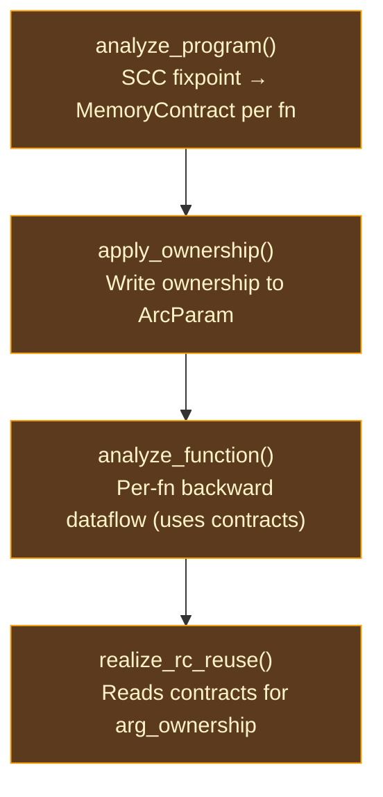

# Interprocedural Contracts

## The Cost of Conservative Ownership

In a naive reference counting system, every function call site performs the same ritual: increment the reference count of each argument before the call (so the callee can use it), and decrement after the call returns (to release the caller's reference). For a function like `len(list)` — which only reads the list to count its elements and never stores, returns, or transfers it — these two atomic operations are pure waste. The callee borrows the value temporarily and gives it back; the reference count never actually needs to change.

The question is: how does the compiler know which parameters are merely borrowed and which are truly consumed? Without analysis, the answer is "assume the worst" — treat every parameter as potentially consumed, and pay the RC cost at every call site. This is what CPython does, and it is a significant contributor to Python's overhead.

AIMS answers this question through **interprocedural contracts** — a
`MemoryContract` per function computed by SCC-based fixpoint iteration over the
module call graph. Each contract describes access, consumption, demand,
lifetime, and uniqueness rather than only Borrowed versus Owned. Unified
realization uses these contracts to omit caller-side logical credit/release
events for borrowed parameters and to freeze precise transfer decisions at
every call. Counter traffic is one downstream physical consequence.

The interprocedural-contract shape drew on [Lean 4](https://github.com/leanprover/lean4)'s compiler (`src/Lean/Compiler/IR/Borrow.lean`), which pioneered SCC-based interprocedural borrow inference for a functional language with reference counting, as a historical influence. AIMS is Ori's own memory model: it composes that binary (Borrowed/Owned) classification SHAPE into a multi-dimensional contract covering all seven lattice dimensions, proven sound independently (see Spec: Annex E §AIMS).

### Why Interprocedural?

A per-function analysis could determine that a function's body only reads a parameter, but it cannot know whether the callees it passes that parameter to will retain it. Consider:

```
@store_in_global (x: [int]) -> void = ...  // stores x somewhere
@process (list: [int]) -> void = { store_in_global(list:) }
```

Looking at `process` alone, the parameter `list` appears to be merely passed to another function. But `store_in_global` retains it, so `process` must treat `list` as Owned. This requires knowing `store_in_global`'s contract — which requires analyzing `store_in_global` first.

For mutually recursive functions, this creates a chicken-and-egg problem: each function's contract depends on the others'. The solution is fixed-point iteration within strongly connected components (SCCs) of the call graph.

## The MemoryContract

Each function's interprocedural summary is a `MemoryContract` with the following components:

| Field | Type | Purpose |
|-------|------|---------|
| `params` | `Vec<ParamContract>` | Per-parameter multi-dimensional contract |
| `return_info` | `ReturnContract` | Return value uniqueness |
| `effects` | `EffectSummary` | What memory effects the function may perform |
| `context_behavior` | `ContextBehavior` | TRMC metadata (Stage 3) |
| `fip` | `FipContract` | FIP certification status |
| `is_fbip` | `bool` | Inferred FBIP eligibility |

### ParamContract

Each parameter's contract captures multiple dimensions from AIMS's lattice:

| Field | Type | Purpose |
|-------|------|---------|
| `access` | `AccessClass` | `Borrowed` or `Owned` — callee's ownership requirement |
| `consumption` | `Consumption` | `Dead`, `Linear`, `Affine`, or `Unrestricted` — how many times consumed |
| `cardinality` | `Cardinality` | `Absent`, `Once`, or `Many` — forward usage count |
| `may_escape` | `bool` | Whether the parameter may outlive the current scope/caller-boundary contract; no physical storage verdict |
| `may_share` | `bool` | Whether the parameter may become shared |
| `locality_bound` | `Locality` | Tightest escape scope |
| `uniqueness` | `Uniqueness` | Caller's uniqueness requirement |

This is richer than traditional borrow inference (which only determines Borrowed vs Owned). The additional dimensions enable AIMS's unified realization to make more precise decisions at call sites — a parameter that is `Borrowed + Once + BlockLocal` is handled differently from one that is `Borrowed + Many + HeapEscaping`.

### FipContract

The FIP certification status tracks whether a function achieves fully in-place mutation:

| Variant | Meaning |
|---------|---------|
| `Certified` | Provably zero unmatched logical storage-acquisition/allocation and lifetime-end cleanup/release obligations |
| `Conditional` | FIP only if specific arguments are unique at call sites |
| `Bounded(n)` | FIP with at most n unmatched logical storage-acquisition obligations |
| `Never` | No FIP certification possible |

## Algorithm: SCC-Based Fixed-Point

The algorithm has four phases:

### Phase 1: Call Graph Decomposition

Build an interprocedural call graph from all functions in the module. Extract direct callees from `Apply`, `PartialApply`, and `Invoke` instructions (indirect calls via `ApplyIndirect` are excluded — their callees are unknown at compile time). Compute SCCs using Tarjan's algorithm, producing a topological ordering of components.

### Phase 2: Seed Contracts

All non-scalar parameters start as `all_borrowed()` — the optimistic assumption that no parameter needs ownership, with minimal consumption and cardinality. Scalar parameters (int, float, bool, etc.) start as `Owned` because they have no managed owner-credit or drop obligation; this classification does not imply a physical counter. Built-in functions get pre-computed contracts from the `builtins` module.

### Phase 3: Topological Processing

SCCs are processed in topological order — callees before callers. This ensures that when analyzing a function, all of its non-recursive callees already have finalized contracts.

- **Non-recursive SCCs** (single function, no self-call): single intraprocedural analysis pass. The backward dataflow analysis converges on the function body, and a contract is extracted from the converged `AimsStateMap`.

- **Recursive SCCs** (mutual recursion): fixed-point iteration. All SCC members are initialized with `all_borrowed()` contracts, then repeatedly analyzed until all contracts converge. Each iteration uses the latest in-progress contracts of co-members, while external callees use their stable final contracts.

### Phase 4: Post-Fixpoint Refinement

After all SCCs converge:

1. **Tighten uniqueness** from caller patterns — if all call sites of a function pass unique values for a parameter, the parameter's contract can reflect this.
2. **Compute FIP status** — compare logical storage-acquisition/cleanup balance against reuse opportunities for each function.
3. **Coverage reporting** — FIP breakdown across the module.

## Contract Extraction

After the intraprocedural backward dataflow analysis converges for a function, the `ParamContract` for each parameter is extracted from the converged `AimsStateMap`:

- **AccessClass**: Derived from how the parameter flows through the function — returned, stored in a construct, or passed to an owned position → `Owned`; otherwise `Borrowed`.
- **Consumption**: From the `Consumption` dimension of the parameter's lattice state at function entry.
- **Cardinality**: From the `Cardinality` dimension — how many times the parameter is used.
- **Escape behavior**: From the `Locality` dimension — whether the parameter escapes its defining scope.
- **Uniqueness**: Whether call sites need to guarantee uniqueness for optimal code.

The extraction reads the same converged state that realization uses — contracts and realization share one data source, ensuring consistency.

## Promotion Rules

A parameter is promoted from Borrowed to Owned when any of the following holds:

**Returned from the function.** If a parameter (or an alias) appears as the value in a `Return` terminator, the function transfers ownership to its caller.

**Passed to an owned parameter.** If a parameter is passed as an argument to another function at a position where the callee's contract marks the parameter as Owned, ownership must transfer.

**Stored in a Construct.** `Construct` instructions build structs, enums, and
closures; an argument stored in the result must satisfy the result's logical
lifetime, so the constructed value takes ownership. Stack, region, arena,
inline, or managed-heap storage is selected later by a physical plan.

**Passed to a PartialApply.** Captured into a closure environment. The closure
owns the capture for the environment's logical lifetime; this requires Owned
semantics without requiring heap storage.

**Passed to an ApplyIndirect.** Indirect calls through closures have unknown callee contracts. All arguments are conservatively promoted to Owned.

**Projected then used in an owned position.** When `Project { dst, value }` extracts a field and the extracted `dst` is used in an owned position (returned, stored, etc.), the source `value` must also be Owned — otherwise the caller might free the struct while the projected field is still live.

### Alias Resolution

Parameters may be aliased via `Let { dst, value: Var(src) }` instructions. Before checking whether a variable is a parameter, the analysis resolves alias chains transitively: `v2 → v1 → v0 (param)`. This ensures that `let v1 = param; Construct([v1])` correctly promotes `param`.

## Bodyless Method Contracts

- Built-in methods have no user-function body from which AIMS can extract a contract.
- Their semantic signature, parameter ownership, and runtime identity belong to
  the shared registry and reach AIMS as typed inputs.
- LLVM inlining, VM opcode dispatch, and helper calls are later physical choices
  that cannot change the contract.

| Category | Behavior | Examples |
|----------|----------|---------|
| Borrowing builtins | All args borrowed | `len`, `is_empty`, `contains`, `first`, `last`, `equals`, `compare`, `hash`, `clone`, `to_str`, ~40 total |
| Consuming receiver | Receiver owned, others borrowed | `push`, `pop`, `insert`, `remove`, `reverse`, `sort` (COW list methods) |
| Consuming second arg | Receiver + arg[1] owned | `add`, `concat` (COW list concat — runtime takes both buffers) |
| Consuming receiver only | Receiver owned, others borrowed | Map/Set `remove`, `difference`, `intersection`, `union` |

These are currently pre-computed into a `BuiltinOwnershipSets` struct of interned names once per session.

> **Current gap — name-keyed compatibility sets.** `BuiltinOwnershipSets` still duplicates part of the registry contract surface by spelling. Production convergence must derive bodyless-call contracts from `MethodDef` and its typed runtime/ownership fields, carry that identity through the shared executable artifact, and reject missing identities. A VM or LLVM handler may implement the physical operation, but it may not infer ownership from a method name or backend implementation choice.

## Pipeline Integration



The current implementation recomputes contracts per pipeline invocation: `analyze_program()` runs whenever `apply_aims_ownership()` is invoked, and there is no per-session `MemoryContract` cache. This is acknowledged construction debt, not the production architecture. Production realization runs once for the closed program batch and freezes one validated executable artifact consumed by every physical projection. Incremental recomputation is Salsa-based and structural, per `.claude/rules/missions.md §Compiler`; it must update that artifact constructor rather than introduce backend-local or ad-hoc caches.

## Prior Art

**[Lean 4](https://github.com/leanprover/lean4)** (`src/Lean/Compiler/IR/Borrow.lean`) is the historical influence. Lean's borrow inference uses the same SCC-based fixed-point approach with monotonic promotion from Borrowed to Owned. AIMS is Ori's own model: it composes that binary-classification SHAPE into multi-dimensional contracts covering consumption, cardinality, locality, and uniqueness in addition to access — proven sound independently (see Spec: Annex E §AIMS).

**[Koka](https://github.com/koka-lang/koka)** (`src/Core/Borrowed.hs`) performs a similar analysis as part of its Perceus implementation. Koka's approach is simpler — it does not perform full SCC decomposition but instead uses a two-pass strategy — which works for Koka's effect-handler-based architecture but would miss opportunities in Ori's more general call graph.

**[Swift](https://github.com/swiftlang/swift)** approaches the problem differently: Swift's ownership model is partly expressed in the source language through move semantics and `consuming`/`borrowing` annotations, rather than inferred purely by the compiler. Swift's SIL optimizer (`lib/SILOptimizer/ARC/`) then optimizes the explicit annotations, while AIMS infers everything automatically.

**[GHC](https://github.com/ghc/ghc)** (`compiler/GHC/Core/Opt/DmdAnal.hs`) influenced the multi-dimensional contract approach. GHC's demand analysis computes rich per-argument summaries (usage, strictness, unboxing) that drive worker-wrapper transformations. AIMS's `ParamContract` with its access, consumption, cardinality, and locality dimensions is analogous to GHC's demand signatures.

## Design Tradeoffs

**Optimistic vs pessimistic initialization.** Starting all parameters as Borrowed (optimistic) and promoting to Owned produces the best results — fewer parameters end up Owned than if starting Owned and trying to demote. The tradeoff is that the fixed-point must iterate until no more promotions occur, rather than converging immediately. In practice, convergence is fast (typically 2-3 iterations per SCC).

**Multi-dimensional vs binary contracts.** AIMS computes richer contracts (7 dimensions per parameter) than traditional borrow inference (binary Borrowed/Owned). The additional dimensions (consumption, cardinality, locality, uniqueness) enable more precise ownership-event, reuse, and COW decisions but increase the contract size and fixpoint convergence time. A counter-selecting projection consequently emits fewer physical RC operations, but that projection is not the contract's definition.

**Interprocedural vs per-function.** Interprocedural analysis produces better results but has higher compile-time cost. A per-function analysis would be O(n) in the function count; the SCC-based approach adds Tarjan's algorithm (O(V + E)) and fixed-point iteration within each SCC. The cost is justified because the logical ownership-event reductions benefit every physical projection.

**Conservative for unknowns.** Unknown callees (not in the contract map, not in the builtin sets) get all-Owned arguments. This is correct but pessimistic: FFI and dynamically dispatched calls carry the full conservative ownership contract, and a counter-selecting projection may pay the corresponding RC cost. A future extension could allow ownership annotations on FFI declarations.
