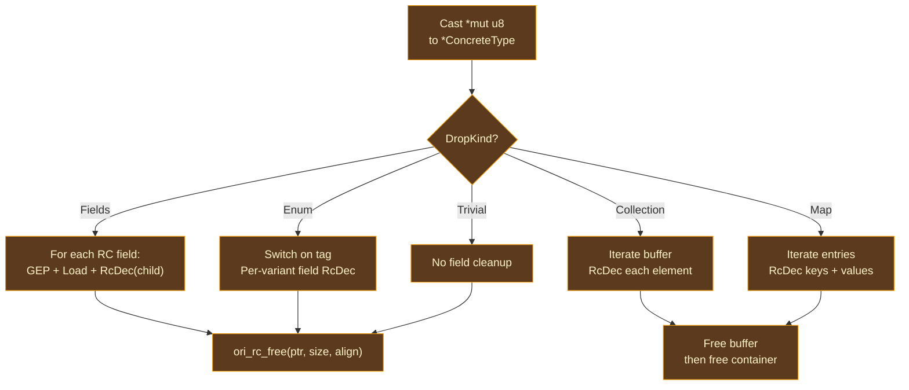

# Drop Descriptors

## What Happens at Final Logical Ownership Discharge?

When the final logical owner or cleanup obligation ends, the value must be cleaned up exactly once. Cleanup is type-dependent: a struct follows each ownership-bearing field, a sum selects the active logical variant, and a collection follows each ownership-bearing element.

A physical plan then chooses how to release storage and realize child obligations.

There are two approaches to this problem:

**Inline physical drop logic.** A compiled adapter could expand the full cleanup sequence at every final-release site. That repeats variant selection, child traversal, user drop, and storage release, causing code bloat.

**Shared drop plans.** The compiler freezes one logical cleanup plan per type. The VM interprets that plan; a compiled projection may generate one specialized drop function per type and pass its address to the runtime.

Drop descriptors bridge ownership policy and physical cleanup: `ori_arc` computes logical field, variant, element, user-drop, and ordering obligations once. VM, LLVM, native, compiled-WebAssembly, and JIT projections consume that plan without re-deriving traversal.

## DropKind Variants

Each type that requires cleanup gets a `DropInfo` containing a `DropKind` that describes the structure of its drop:

### Trivial

Applies to `str`, `[int]`, and bare function pointers: types with no ownership-bearing child cleanup. The logical plan has no child traversal; a physical projection satisfies the owner's final cleanup through its selected storage/runtime adapter.

### Fields

For structs and tuples, the plan follows and releases each ownership-bearing
logical field before releasing the owner. Scalar fields are absent because they
have no ownership obligation.

The descriptor stores `Vec<(u32, Idx)>`: declaration-order field identities paired with child-plan type identities. VM and compiled layout plans map those identities to their own slots or offsets.

### Enum

For sum types, the plan selects the active logical variant before following its child obligations; a physical tag encoding never feeds back into this decision.

The descriptor stores `Vec<Vec<(u32, Idx)>>` — an outer vector indexed by the
stable logical variant identity, each containing the ownership-bearing field
list for that variant. A physical tag value is supplied by the representation
plan and is not an AIMS fact.

### Collection

For `[T]` and `Set<T>`, the plan visits owned elements, follows each element plan, and releases container storage. The descriptor stores `element_type`; physical buffer iteration belongs to the layout/runtime adapter.

### Map

For `{K: V}`, the current descriptor stores `key_type`, `value_type`, `dec_keys`, and `dec_values`; the `dec_*` field names are transitional carrier vocabulary for logical child-cleanup obligations. A `{str: int}` map sets only `dec_keys` because string keys carry cleanup obligations and integer values are scalar.

### ClosureEnv

Closure-environment plans list only ownership-bearing captures and omit trivial
captures. Their descriptor is structurally identical to `Fields`, while
remaining distinct because physical closure and user-struct layouts differ.

## API

### compute_drop_info

Computes one type's descriptor and returns `None` when the type has no logical
cleanup obligation; classification determines which fields carry owned
children.

### compute_closure_env_drop

Builds a `ClosureEnv` drop kind from the list of capture types in a
`PartialApply` instruction. It filters to ownership-bearing captures and records
their stable identities.

### collect_drop_infos

In the transitional carrier, scans all functions in a compilation unit,
collects every type appearing in an `RcDec` or `Construct` instruction, computes
drop info for each, and returns a deduplicated list. Production shared
realization instead closes the transitive logical cleanup table before backend
selection; emitter-time lazy lookup is a current LLVM integration gap.

## LLVM Drop Function Generation

The current LLVM projection reads each `DropInfo` and generates a corresponding LLVM function. Symbol naming, caching, LLVM fields, and forward declarations belong to that projection rather than AIMS.

### Naming and Caching

Drop functions are named `_ori_drop$<idx_raw>` where `idx_raw` is the raw type pool index — deterministic and unique per type. Functions are cached by this mangled name: if a drop function has already been generated, the cached function pointer is returned.

### Recursive Types

Recursive types insert the function ID into the cache **before** generating the body, so `_ori_drop$Node` can resolve its own incomplete declaration while handling `Option<Node>`. LLVM supports the resulting forward function reference directly.

### Drop Function Structure

Every generated drop function has the signature `extern "C" fn(*mut u8)` and follows a three-step structure:

1. **Cast**: Bitcast the opaque `*mut u8` data pointer to a pointer to the concrete struct type.

2. **Field cleanup**: Dispatch on the `DropKind`:
   - `Fields`: GEP to each RC field, load the pointer, call `ori_rc_dec(field_ptr, child_drop_fn)`.
   - `Enum`: Switch on the tag, then per-variant field cleanup.
   - `Collection`/`Map`: Loop over the buffer, decrementing each element/entry.
   - `Trivial`: No field cleanup needed.

3. **Free**: Call `ori_rc_free(data_ptr, size, align)` to release the allocation.

## Prior Art

**[Rust](https://github.com/rust-lang/rust)** generates per-type "drop glue" through the same pattern: each type with a `Drop` impl or drop-needing fields gets a compiler-generated drop function that recursively drops fields before freeing. Rust's drop glue is generated during MIR construction and is more complex because Rust must handle partial moves, `ManuallyDrop`, and panic-during-drop scenarios.

**[Lean 4](https://github.com/leanprover/lean4)** generates per-type "box free" functions that follow the same structure — cast, decrement children, free. Lean's approach is simpler because Lean's type system has fewer special cases (no closures with captures, no maps with separate key/value RC needs).

**[Swift](https://github.com/swiftlang/swift)** generates "value witness tables" that include a destroy function per type. Swift's approach is more general — witness tables include size, alignment, copy, and move functions alongside destroy — but the destroy function serves the same purpose as Ori's drop functions.

**[CPython](https://github.com/python/cpython)** uses `tp_dealloc` function pointers in type objects — the same per-type drop function concept, but stored in the type's vtable at runtime rather than generated at compile time.

## Design Tradeoffs

**Per-type functions vs inline logic in the current compiled counter plan.**
LLVM drop functions are generated once per type and shared across all `RcDec`
sites. Inline logic would avoid one indirect call per drop but would bloat code
size for types used in many places. This is a target-plan tradeoff; it neither
defines the shared cleanup descriptor nor constrains the VM, native, JIT, or
compiled-WebAssembly realization.

**Descriptor-based vs direct emission.** Drop descriptors are computed in `ori_arc` and consumed as part of the shared post-AIMS plan, maintaining the backend-independence boundary. LLVM generates type-specialized drop functions; the VM realizes the same traversal through its object/runtime adapter. Native, compiled-WebAssembly, and JIT backends may choose different physical mechanisms, but none may re-derive which fields are dropped or when. Having `ori_arc` emit target instructions directly would couple the calculus to one backend.

**Forward-reference caching for recursion.** Inserting the function ID into the cache before generating the body is a standard technique (used by LLVM itself for recursive types). The alternative — detecting cycles and generating trampolines — would be more complex for no benefit, since LLVM natively supports forward function references.
