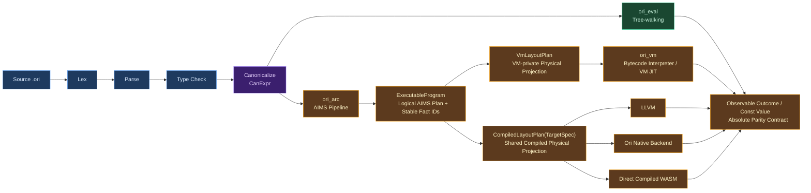
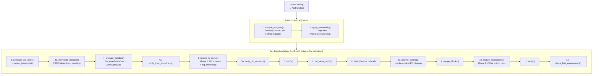

# AIMS Overview

## The Memory-Management Design Space

Every programming language must answer a fundamental question: when a program allocates memory, who decides when to free it? The history of memory management is a history of different answers to this question, each with different tradeoffs between safety, performance, and programmer effort.

**Manual memory management** puts the burden on the programmer. C requires explicit `malloc` and `free` calls; the programmer tracks every allocation's lifetime and frees it at the right time. This gives maximum control and zero runtime overhead, but it is the single largest source of security vulnerabilities in software history — use-after-free, double-free, and memory leaks account for roughly 70% of critical bugs in large C and C++ codebases (Microsoft Security Response Center, 2019; Google Project Zero data).

**Tracing garbage collection** automates the problem by periodically scanning the heap to find unreachable objects and freeing them. Java, Go, Python (as a backup), JavaScript, Haskell (GHC), OCaml, and most managed languages use this approach. It eliminates use-after-free entirely, but introduces pause-time unpredictability (stop-the-world collectors), memory overhead (the collector needs headroom to operate efficiently), and throughput cost (typically 5-15% for generational collectors, more for concurrent ones). Languages with GC also tend to allocate more freely, since the cost of allocation is amortized across collection cycles.

**Ownership and borrowing** is Rust's answer: a static type system tracks which variable owns each allocation, and the compiler inserts `drop` calls at the end of each owner's scope. Borrows (`&T`, `&mut T`) allow temporary access without ownership transfer. This achieves manual-memory-management performance with compile-time safety, but it requires the programmer to think about lifetimes and satisfy the borrow checker — a significant learning curve and a constraint on program architecture (cyclic data structures, self-referential types, and certain patterns require `unsafe` or smart pointers).

**Reference counting** tracks how many references point to each allocation. When a reference is created, the count increments; when a reference is destroyed, it decrements; when the count reaches zero, the allocation is freed. Objective-C (manual retain/release), Swift (ARC), Python (primary collector), and Perl use this approach. Reference counting has deterministic destruction (objects are freed immediately when unreachable, not at the next GC pause), low memory overhead (no collector headroom), and predictable latency. A naive counter-based compiled realization pays an increment, decrement, and often a zero-test for each logical copy and destruction. Atomic operations are required only when that realization permits cross-thread sharing. Other projections may satisfy the same logical owner-credit facts with handles, flags, regions, arenas, or statically discharged operations. Cycles require a separate mechanism where the language can construct them.

**Automatic Reference Counting (ARC)** is reference counting where the compiler — not the programmer — inserts the increment and decrement operations. The programmer writes code as if memory management doesn't exist; the compiler analyzes the program's data flow and places RC operations at precisely the right points. Swift popularized this term, but the concept predates it — Objective-C's ARC (introduced in 2011) was the first widely-deployed automatic RC system, and [Lean 4](https://github.com/leanprover/lean4)'s compiler (2020+) showed that aggressive RC optimization could make functional languages competitive with imperative ones.

### Where Ori Sits

Ori uses **value semantics** — every assignment is a logical copy, every variable owns its data, there is no shared mutable state. This is the programming model of pure functional languages and of Swift's value types. It is the simplest model for programmers to reason about: there are no aliasing bugs, no data races, no spooky action at a distance through shared references.

But value semantics, naively implemented, is catastrophically expensive. Every list push copies the entire list. Every struct update allocates a fresh struct. Every function call that passes a collection duplicates it. A language with value semantics needs an aggressive optimization pipeline to make it practical.

**AIMS** is that pipeline. The historical expansion “ARC Intelligent Memory
System” describes the first counter-based compiled projection; it is not the
normative expansion of the backend-neutral calculus and does not make AIMS an
LLVM or reference-counting subsystem.

It is the single kernel-governed, backend-neutral ownership, lifetime, cleanup, transfer,
COW/reuse, effect, and unwind calculus in `ori_arc`. It lowers canonical meaning
to one logical plan and systematically eliminates the ownership overhead that
value semantics would otherwise impose.

Unlike traditional ARC optimizers that stack independent policy passes (borrow
inference, liveness, ownership-event placement, reuse detection, and cleanup
planning), AIMS uses one formally grounded lattice analysis and unified logical
realization step. Any physical RC cleanup belongs to a later selected adapter.
AIMS is not an LLVM analysis and LLVM is not its
destination: VM, LLVM/native, compiled-WebAssembly, and JIT are sibling physical
projections of the same frozen fact identities.

ARC IR is the shared ownership-realization path for ordinary function bodies: user-defined functions, closures, and lowered control flow flow from `CanExpr` through AIMS before reaching the VM or a compiled backend. The evaluator branches at canonical IR as the representation-abstract behavior oracle; it does not define a competing ownership calculus or consume a physical plan.

> **Current gap — derived trait synthesis.** Derived trait methods (`Eq`, `Clone`, `Debug`, `Printable`, `Default`, `Comparable`, `Hashable`) are currently generated directly as LLVM IR by `compiler/ori_llvm/src/codegen/derive_codegen/` and do not flow through ARC IR. That shipped fact is a convergence gap, not an architectural exception. Production derived semantics must become a typed shared body or executable carrier that passes through the same ownership calculus before VM or compiled projection; a backend-local derivation may not become a second semantic or memory-policy authority.

## What Makes AIMS Distinctive

### Unified Lattice, Not Sequential Passes

> AIMS is not Ori's ARC optimizer; AIMS is Ori's memory semantics made executable as one unified analysis and realization system.

Traditional ARC optimizers (Lean 4, Koka, Swift) run a sequence of independent passes: borrow inference, then liveness analysis, then RC insertion, then reuse detection, then RC elimination. Each pass computes its own analysis, makes its own decisions, and passes results to the next. This works, but creates inter-pass consistency problems — decisions made early constrain what later passes can do, and redundancies accumulate at pass boundaries.

AIMS replaces this with a **single abstract interpreter** over a **7-dimensional
product lattice**. Every logical memory fact about every variable — ownership,
consumption, demand, uniqueness, lifetime, reuse shape, and effect — is computed
in one converging backward dataflow analysis. Logical ownership events, reuse
and COW admissibility, cleanup/drop obligations, and FIP certification are
projections of that same converged state. The shipped carrier additionally
materializes RC-shaped operations; those are current counter-plan migration
data, not AIMS outputs that every executor must reproduce.

| Traditional Pass | AIMS Replacement | Dimensions Used |
|-----------------|-----------------|-----------------|
| Borrow inference | `AccessClass` + interprocedural `ParamContract` | access, consumption |
| Liveness analysis | `Cardinality` + `Consumption` | cardinality, consumption |
| Uniqueness analysis | `Uniqueness` + freshness/alias multiplicity proof | uniqueness, provenance, cardinality |
| Reuse eligibility | `ShapeClass` + `Uniqueness` + `Consumption` | shape, uniqueness, consumption |
| COW mode | Derived view of converged state | uniqueness, access, consumption |
| Drop hints | Derived view of converged state | uniqueness, shape |
| FIP certification | Derived view of `EffectClass` + logical acquisition/cleanup balance | effect, locality, shape |
| RC identity normalization | Eliminated — precise placement avoids need | access, cardinality |
| RC elimination | Eliminated — no redundant pairs to remove | consumption, cardinality |

The lattice join combines every dimension while per-instruction transfer
functions update them in one backward pass; no dimension operates in isolation.
Cross-dimension rules combine lifetime evidence with independent freshness or
alias-proven owner-multiplicity evidence, but locality alone never proves uniqueness.

### The Seven Dimensions

Each variable at each program point has an `AimsState` that is a product of seven dimensions:

| # | Dimension | Values | Purpose | Lattice Height |
|---|-----------|--------|---------|----------------|
| 1 | **AccessClass** | `Borrowed` \| `Owned` | Parameter ownership disposition | 1 |
| 2 | **Consumption** | `Dead` \| `Linear` \| `Affine` \| `Unrestricted` | Substructural: how is value consumed? | 3 |
| 3 | **Cardinality** | `Absent` \| `Once` \| `Many` | Forward usage count | 2 |
| 4 | **Uniqueness** | `Unique` \| `MaybeShared` \| `Shared` | Logical one-owner, unknown-owner, or multiple-owner multiplicity | 2 |
| 5 | **Locality** | `BlockLocal` \| `FunctionLocal` \| `ArgEscaping` \| `HeapEscaping` \| `Unknown` | Escape analysis scope | 4 |
| 6 | **ShapeClass** | `NonReusable` \| `ReusableCtor(kind)` \| `CollectionBuffer` \| `ContextHole` | Constructor kind for reuse matching | 1 (flat) |
| 7 | **EffectClass** | `may_alloc` \| `may_share` \| `may_throw` | Memory effects for FIP | 3 (3 independent bools) |

The target calculus has total lattice height 16. The shipped `ori_arc`
carrier temporarily omits `ArgEscaping` under the explicit ArgEscaping-family
carve-out and therefore has height 15.

This is implementation-status lag, not an executor-specific definition of
AIMS: the compiled Lean/checker model and VM, LLVM/native,
compiled-WebAssembly, and JIT consumers are governed by the five-value
backend-neutral calculus.

Key distinctions between dimensions:

- **Ownership vs Consumption**: Independent. A borrowed parameter can be Unrestricted (read many times). An owned variable can be Linear (moved once).
- **Linearity vs Uniqueness**: `Linear` is a future consumption guarantee;
  `Unique` is a past guarantee that exactly one logical owner exists.
- A physical plan may realize multiplicity with a counter, header, tag, side
  table, constant, or no counter at all; none of those mechanisms is part of
  the AIMS fact.
- **Scalar vs static-lifetime**: Both may require no dynamic ownership events, but
  for different reasons. Scalars have no logical managed-ownership obligation;
  static-lifetime values have lifetime plus exact additional-credit, release,
  and sharing-observation facts that let a physical satisfaction proof discharge
  dynamic operations. The shipped compiled projection uses `MAX_REFCOUNT` for some
  constants, but AIMS does not select heap storage, a header, or saturation.

### Interprocedural Contracts

Most RC optimizers work within a single function. AIMS performs **interprocedural analysis** via SCC-based fixpoint iteration over the module's call graph.

The interprocedural phase computes a `MemoryContract` for each function:

- **ParamContract** per parameter: access class, consumption, cardinality, escape behavior, uniqueness
- **ReturnContract**: return value uniqueness
- **EffectSummary**: what memory effects the function may perform
- **FipContract**: FIP certification status (`Certified`, `Conditional`, `Bounded(n)`, `Never`)
- **ContextBehavior**: TRMC metadata

Contracts start conservative (`all_borrowed()`) and are refined upward toward
`Owned` / `Unrestricted` during the fixpoint. A function that only reads its
list parameter is Borrowed across the program, eliminating caller-side logical
credit/release pairs. A counter-selecting projection consequently emits no
matching inc/dec traffic. Convergence follows from the finite contract lattice
and monotone joins.

### Functional Semantics, Imperative Performance

AIMS's goal is not just correctness — it is to make pure value semantics compile to the same machine code an imperative programmer would write by hand. A list map function that walks a linked list, pattern-matching each node and constructing a new one, should reuse every node allocation in-place. A loop that pushes elements onto a list should mutate the list's buffer directly, not copy it on every iteration. The programmer writes functional code; the compiler generates imperative performance.

### Backend Independence

AIMS currently publishes `ArcFunction` values with explicit logical ownership
operations, annotations, and reuse tokens. The `ArcFunction` / `Rc*` names are
historical migration vocabulary; the production contract is the stable logical
fact and event identities they carry. The design keeps `ori_arc` free of
physical-executor dependencies.

- The bytecode VM, LLVM/native, direct compiled-WebAssembly, and JIT paths are
  sibling projections of the same realized policy.
- Each projection may choose a physical encoding without changing an AIMS decision.
- The tree-walking evaluator remains separate over canonical semantics and does
  not consume post-AIMS representation mechanics.

## How AIMS Eliminates Each Cost

### 1. Type Classification — Skip Ownership Bookkeeping for Trivial Values

- Every type is classified as `Scalar`, `DefiniteRef`, or `PossibleRef`.
- `Scalar` covers primitives and transitively trivial aggregates with no managed-ownership obligation.
- `DefiniteRef` covers strings, collections, closures, or aggregates with definite logical cleanup.
- `PossibleRef` is the conservative fallback for unresolved generics.
- Classification is monomorphized: `Option<int>` is `Scalar`, while `Option<str>` is `DefiniteRef`.
- The classification decides whether logical ownership/drop work exists; it
  does not decide heap versus inline/region/arena storage or a header shape.

See [ARC IR](arc-ir.md) for the classification system.

### 2. Interprocedural Contracts — Eliminate Ownership Bookkeeping at Call Sites

The interprocedural phase computes `MemoryContract` per function via SCC-based fixpoint. A `Borrowed` parameter receives no transferred owner credit and creates no matching release obligation.

For example, `len(list)` borrows its argument without changing logical ownership. In the current compiled ARC projection this usually removes an increment/decrement pair; other projections realize the same contract through their own mechanisms.

See [Interprocedural Contracts](borrow-inference.md) for the algorithm.

### 3. Unified Backward Analysis — Precise Ownership-Event Placement

The intraprocedural phase runs one backward dataflow analysis that computes `AimsState` for every variable at every block boundary. `Cardinality` and `Consumption` determine where owner credits are introduced, transferred, or discharged, including the exact last logical use.

This is more precise than separate liveness and Perceus-style passes because all dimensions inform one another simultaneously.

See [Backward Dataflow Analysis](liveness.md) for the analysis algorithm.

### 4. Unified Realization — Ownership, Reuse, COW, and Drops in One Step

After analysis converges, a single realization step reads the converged `AimsStateMap` and emits all outputs:

- **Ownership events**: logical credit/duplication and release/cleanup records; the current carrier spells these `RcInc`/`RcDec`
- **Reuse operations**: `Reset`/`Reuse` plus logical sharing observation where shape and uniqueness permit
- **COW annotations**: `StaticUnique` (skip runtime check), `StaticShared` (always copy), `Dynamic` (runtime check)
- **Drop facts**: final-owner identity, child traversal, user drop, order, and normal/unwind cleanup obligations

The realization output contains no authority to choose a counter, header, atomic ordering, allocation placement, helper symbol, or backend opcode. Transitional carrier fields that do so are migration debt; `VmLayoutPlan` and `CompiledLayoutPlan(TargetSpec)` select and validate physical mechanisms later.

See [Unified Realization](rc-insertion.md) for the realization algorithm and [Reuse Emission](reset-reuse.md) for reuse details.

### 5. COW Collections — O(1) Mutation for Unique Owners

- The shipped compiled collection adapter checks `ori_rc_is_unique()`: count 1
  uses the in-place path, while a larger count copies and releases the old buffer.
- AIMS itself freezes a logical uniqueness fact or observation requirement.
- A validated VM or compiled plan chooses the observation mechanism; when
  static uniqueness is proved, every projection may use only the fast path
  without a runtime check.

See [Collections & COW](../11-runtime/collections-cow.md).

### 6. FIP Certification — Guaranteed In-Place Mutation

- AIMS's `EffectClass` dimension tracks logical allocation effects.
- When a function's allocation obligations exactly match its reuse
  opportunities, AIMS certifies it as FIP (Functional-but-In-Place).
- The certificate guarantees zero unmatched logical storage-acquisition and
  lifetime-end cleanup obligations on the admitted path; each physical plan proves what that means for
  heap calls, regions, arenas, frames, or inline storage.
- Allocation-balance checking enforces the `FipContract`.

### 7. TRMC — Tail Recursion Modulo Constructor

AIMS detects self-recursive functions that allocate and return in tail position, and rewrites them to iterative loops with in-place mutation. The TRMC (Tail Recursion Modulo Constructor) transformation converts recursive list-building patterns into efficient loops, using context holes to fill in results as the loop progresses. Soundness is verified by checking that Set sites target unique variables.

### The Compounding Effect

Because all dimensions are computed simultaneously, they reinforce each other:

| Current counter projection without | Cost | With AIMS | Residual compiled-counter cost |
|---------|------|-----------|----------|
| Classification | RC ops on ints, bools | Classification | Zero RC on ~50% of variables |
| Contracts | RC at every call site | + Contracts | Zero RC for read-only params |
| Unified analysis | RC at scope boundaries | + Backward dataflow | RC only at true last-use |
| Reuse | alloc+free per constructor | + Shape+Uniqueness | In-place reuse when unique |
| COW | O(n) per collection mutation | + Static uniqueness | O(1) when unique; branchless fast path |
| FIP | Unknown logical acquisition/cleanup balance | + Effect tracking | Certified balanced-obligation functions; an admitted physical plan may achieve zero allocator traffic |

The net result is a minimal logical ownership plan for a program written in pure
value semantics — no mutation syntax, ownership annotations, or lifetime
parameters. The current compiled counter projection realizes that plan with
in-place mutation, allocation reuse, no counter traffic for scalar and borrowed
values, and branchless paths for statically unique values. On that projection,
the measured improvement was **-75% RC operations on golden corpus programs and
-70% on benchmarks** (2026-03-11); those figures measure one physical plan, not
the definition or success criterion of AIMS itself.

## Architecture

### Pipeline Position

AIMS is the entry point for physical execution, not for the representation-abstract evaluator. Both branches start from the same canonical meaning; AIMS then produces one ownership plan for VM, compiled, and JIT consumers:



### Pipeline Passes

The current implementation realizes AIMS into the historical `ArcFunction`
carrier, whose `Rc*` operations, reuse tokens, COW annotations, and drop hints
mix logical obligations with the first compiled counter plan. This is migration
state, not the production seam. The diagram below documents that shipped
implementation so it can be retired deliberately:



Each dependency is structural, not incidental:

- **Interprocedural contracts** need classification (to skip scalars) and the call graph (to compute SCC order)
- **Backward analysis** needs contracts (to know parameter ownership) and var reprs (to skip scalars/immortals)
- **TRMC normalization** needs contracts (to verify rewrite eligibility) — runs before analysis
- **Realization Phase 1** needs the converged `AimsStateMap` (to read lattice state for logical ownership/reuse decisions; its current `Rc*` spelling is transitional)
- **Realization Phase 2** runs after `merge_blocks()` and uses `ArcVarId`-keyed lookups (position-keyed maps are invalidated by block merging)
- **FIP verification** needs realization results (to compare logical acquisition/cleanup balance against reuse opportunities)

### Module Structure

```
ori_arc/src/aims/
├── lattice/          — 7D product lattice: AimsState, dimensions, join/canonicalize
├── transfer/         — Per-instruction transfer functions (backward rules)
├── contract/         — MemoryContract, ParamContract, ReturnContract, FipContract
├── intraprocedural/  — Backward dataflow analysis + AimsStateMap
│   ├── state_map.rs  — Sparse state storage (block boundaries, events, shapes)
│   ├── block.rs      — Per-block backward computation
│   ├── post_convergence.rs — Borrow sources, events, shapes, FIP balance
│   └── fip_balance.rs — FIP token computation
├── interprocedural/  — SCC-based fixpoint for MemoryContract computation
│   └── extract.rs    — Contract extraction from converged state maps
├── normalize/        — TRMC detection + rewriting + verification
│   ├── detect.rs     — Context region identification
│   ├── rewrite.rs    — IR transformation (loop conversion)
│   └── verify.rs     — Soundness checks
├── realize/          — Unified realization (RC, reuse, COW, drop hints)
│   ├── decide.rs     — Decision functions for all outputs
│   ├── emit_unified.rs — Phase 1: forward walk with inline event collection
│   ├── walk.rs       — Instruction-level decision dispatch
│   ├── walk_dec.rs   — RcDec operation placement
│   └── metrics.rs    — Synergy measurement
├── emit_rc/          — RC emission helpers (arg ownership, coalesce, unwind cleanup)
├── emit_reuse/       — Reuse emission helpers (detect, plan, expand, FIP gates)
├── builtins/         — Current name-keyed compatibility contracts; registry-carrier migration gap
├── immortal/         — Current static-lifetime detection; compiled
│                        `MAX_REFCOUNT` realization is transitional
├── verify/           — Structural + semantic verification (AIMS vs IR consistency)
└── verify/fip/       — FIP enforcement verification (Certified vs evidence)
```

### Entry Points

| Function | Purpose |
|----------|---------|
| `run_arc_pipeline()` | Transitional internal single-function adapter; not a production consumer boundary |
| `run_arc_pipeline_all()` | Current batch entry while the closed-artifact constructor is completed |
| `aims::analyze_program()` | Interprocedural — computes `MemoryContract` per function |
| `aims::analyze_function()` | Intraprocedural — backward dataflow → `AimsStateMap` |

Production consumers receive one validated closed `ExecutableProgram` produced by whole-program realization. They do not invoke AIMS. The `run_arc_pipeline*` functions are transitional compiler-internal construction APIs and must converge on that one artifact constructor; `aims::*` functions remain internal to the AIMS pipeline.

## Non-Negotiable Invariants

AIMS is a **unified system** — logical ownership-event placement, reuse, COW,
FIP, contracts, and TRMC are facets of one model, not separate backend
features. Four invariants enforce this:

1. **Contracts and realization must agree.** If `FipContract::Certified`, realization must have exactly matched logical storage-acquisition/allocation obligations and lifetime-end cleanup/release obligations. A mismatch is a bug in contract extraction or realization.
2. **Active rewrites must be sound.** TRMC rewriting must produce identical observable behavior. Soundness is verified structurally (Set sites target Unique variables) and behaviorally.
3. **No pass may rely on stale summaries.** After `merge_blocks()`, position-keyed state maps are invalid. Phase 2 realization uses `ArcVarId`-keyed lookups only. Pipeline ordering is load-bearing.
4. **Every active subsystem must be end-to-end verified.** Implementation + invariant enforcement + tests. A subsystem without verification is not active.

## Prior Art

**[Lean 4](https://github.com/leanprover/lean4)** is the deepest historical influence on AIMS's design vocabulary. Lean 4's compiler (described in [Counting Immutable Beans](https://arxiv.org/abs/1908.05647), Ullrich and de Moura, 2019) pioneered several technique shapes: the three-way type classification (`isScalar` / `isDefiniteRef` / `isPossibleRef`), borrow inference for function parameters, reset/reuse for in-place allocation recycling, and the strategy of stacking RC optimizations into a pipeline. AIMS is Ori's own memory model: it composes those shapes into a unified lattice framework in place of the sequential pass architecture, proven sound independently (see Spec: Annex E §AIMS). Lean's implementation lives in `src/Lean/Compiler/IR/RC.lean` (RC insertion), `Borrow.lean` (borrow inference), and `ExpandResetReuse.lean` (reuse expansion).

**[Koka](https://github.com/koka-lang/koka)**'s [Perceus](https://www.microsoft.com/en-us/research/publication/perceus-garbage-free-reference-counting-with-reuse/) algorithm (Reinking, Xie, de Moura, Leijen, 2021) — precise, liveness-based RC insertion — is the historical influence behind the shape of AIMS's cardinality and consumption dimensions. Koka also introduced [FBIP](https://www.microsoft.com/en-us/research/publication/fp2-fully-in-place-functional-programming/) (Functional But In-Place, Lorenzen, Leijen, et al., 2023) — the idea that functional programs can be analyzed to determine whether all allocations are reusable. AIMS's formulation is its own: FBIP is a lattice-derived certification (`FipContract`) proven against the AIMS contracts rather than a separate diagnostic pass. Koka's borrow analysis (`src/Core/Borrowed.hs`) and FBIP checker (`src/Core/CheckFBIP.hs`) are the cited prior implementations.

**[Swift](https://github.com/swiftlang/swift)** popularized ARC as a mainstream language feature and developed sophisticated ARC optimization passes in its SIL (Swift Intermediate Language) optimizer. Swift's approach differs from AIMS: Swift uses bidirectional dataflow analysis to find matching retain/release pairs (`lib/SILOptimizer/ARC/`), while AIMS uses a unified lattice that avoids creating redundant pairs in the first place. Swift also does not perform borrow inference at the IR level — Swift's ownership model is expressed in the source language through move semantics and borrowing annotations, while AIMS infers ownership automatically.

**[Rust](https://github.com/rust-lang/rust)** solves the same problem through a fundamentally different mechanism: ownership and borrowing are part of the type system, enforced by the borrow checker. Rust never uses reference counting for owned values (only for explicitly opt-in `Rc<T>` / `Arc<T>`). The tradeoff is well-known: Rust gets zero-overhead memory management, but programmers must satisfy the borrow checker. Ori chooses the opposite point in the design space — no borrow checker or lifetime annotations, with AIMS inferring logical ownership and lifetime obligations. A counter-selecting projection may eliminate physical RC operations from that plan.

**[GHC](https://github.com/ghc/ghc)** (Glasgow Haskell Compiler) influenced AIMS's `Cardinality` dimension. GHC's demand analysis (`compiler/GHC/Core/Opt/DmdAnal.hs`) computes usage information per variable — whether it is used zero times, once, or many times — to drive worker-wrapper transformation, unboxing, and dead code elimination. AIMS adapts this idea into its backward lattice, where `Absent` / `Once` / `Many` cardinality directly drives logical ownership-event placement. A counter-selecting projection lowers those events to its physical RC operations.

**[OxCaml](https://blog.janestreet.com/oxidizing-ocaml-locality/)** (Jane Street's OCaml extensions) influenced AIMS's `Locality` dimension. OxCaml's locality inference determines whether values escape their defining scope, enabling stack allocation for local values. AIMS adapts this as a neutral lifetime bound and placement-eligibility input. A nonescaping value is not thereby unique; uniqueness still requires freshness or alias-proven one-owner multiplicity.

**[CPython](https://github.com/python/cpython)** uses naive reference counting with a cycle collector backup. Every reference copy increments, every destruction decrements, with no compile-time optimization. This is the baseline that illustrates why optimization matters — CPython's RC overhead is substantial, and its cycle collector adds GC pauses on top of it. AIMS represents the opposite extreme: aggressive compile-time analysis minimizes logical ownership events before any physical mechanism is selected; a counter projection consequently performs fewer runtime RC operations.

## Design Tradeoffs

**Automatic ownership vs tracing GC.** Ori chose deterministic, inferred
ownership and exactly-once logical cleanup rather than making a tracing
collector part of language semantics. That preserves predictable resource
cleanup, low latency, and value semantics while leaving each admitted physical
plan free to use counters, transfer, regions, arenas, tracing support, or a
hybrid where its `Satisfies` proof permits. Cycle handling is therefore a
physical-plan and future-language-surface question, not an AIMS requirement.

**ARC vs ownership types.** Ori chose inferred logical ownership over Rust-style source ownership and borrowing to reduce programmer burden. The current counter-based compiled projection can pay retain/release overhead where Rust has none; atomic operations are needed only for values whose selected plan admits cross-thread sharing. AIMS eliminates or contracts logical operations before each physical planner chooses counters, flags, handles, regions, arenas, or no runtime operation at all. The tradeoff is a more complex compiler pipeline in exchange for a simpler programming model.

**Unified lattice vs sequential passes.** AIMS chose a unified 7-dimensional
lattice over traditional sequential passes. The benefit is cross-dimension
synergy: uniqueness proofs enable reuse, while precise ownership-event placement
avoids redundancies a later physical optimizer would otherwise remove. The cost
is higher implementation complexity and a need for formal convergence guarantees
bounded by lattice height. The current counter projection measured 75% fewer RC
operations because dimensions that sequential passes compute independently can
reinforce each other.

**Interprocedural vs local analysis.** AIMS analyzes the entire module call
graph. This proves more Borrowed parameters and Unique values at higher
compile-time complexity. Per-function analysis would miss cross-function
opportunities. SCC decomposition bounds iteration, and the logical
ownership-event elimination it enables benefits every physical projection; the
current compiled counter plan additionally realizes that benefit as fewer RC
operations.

**Backend-independent AIMS artifact vs backend-specific optimization.** AIMS
produces a backend-neutral logical artifact. LLVM dead-code elimination, VM
superinstruction selection, and other physical optimizations may rewrite a
faithful encoding only when validation preserves that artifact's exact facts and
observable trace. Target-local guesses never feed back into ownership
classification. Embedding AIMS decisions separately in each backend would
duplicate the calculus and allow drift across VM, native, WebAssembly, and JIT
execution.

## Debugging

| Tool | Command |
|------|---------|
| **Tracing** | `ORI_LOG=ori_arc=debug ori build file.ori` |
| **Verbose tracing** | `ORI_LOG=ori_arc=trace ORI_LOG_TREE=1 ori build file.ori` |
| **ARC IR dump** | `ORI_DUMP_AFTER_ARC=1 ori build file.ori` |
| **RC trace (runtime)** | `ORI_TRACE_RC=1 ./binary` |
| **Leak check** | `ORI_CHECK_LEAKS=1 ./binary` |
| **RC balance** | `diagnostics/rc-stats.sh file.ori` |
| **Codegen audit** | `diagnostics/codegen-audit.sh --strict file.ori` |
| **Full diagnosis** | `diagnostics/diagnose-aot.sh --valgrind file.ori` |
| **Interpreter vs AOT** | `diagnostics/dual-exec-debug.sh file.ori` |

## Related Documents

- [ARC IR](arc-ir.md) — IR definitions, type classification, value representations
- [Lowering](lowering.md) — CanExpr to ARC IR conversion
- [Interprocedural Contracts](borrow-inference.md) — SCC-based contract computation
- [Backward Dataflow Analysis](liveness.md) — 7D lattice analysis algorithm
- [Unified Realization](rc-insertion.md) — RC, reuse, COW, and drop emission
- [Reuse Emission](reset-reuse.md) — In-place constructor and collection reuse
- [RC Optimization](rc-elimination.md) — Redundancy avoidance and remaining elimination
- [Drop Descriptors](drop-descriptors.md) — Per-type drop generation
- [Decision Trees](decision-trees.md) — Pattern compilation in ARC IR
- [ARC Emitter](../10-llvm-backend/arc-emitter.md) — ARC IR to LLVM IR translation
- [Runtime RC](../11-runtime/reference-counting.md) — Runtime RC implementation
