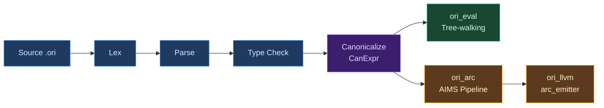
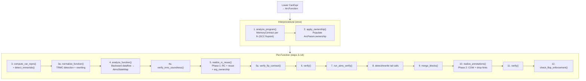

# AIMS Overview

## What Is Automatic Reference Counting?

Every programming language must answer a fundamental question: when a program allocates memory, who decides when to free it? The history of memory management is a history of different answers to this question, each with different tradeoffs between safety, performance, and programmer effort.

**Manual memory management** puts the burden on the programmer. C requires explicit `malloc` and `free` calls; the programmer tracks every allocation's lifetime and frees it at the right time. This gives maximum control and zero runtime overhead, but it is the single largest source of security vulnerabilities in software history — use-after-free, double-free, and memory leaks account for roughly 70% of critical bugs in large C and C++ codebases (Microsoft Security Response Center, 2019; Google Project Zero data).

**Tracing garbage collection** automates the problem by periodically scanning the heap to find unreachable objects and freeing them. Java, Go, Python (as a backup), JavaScript, Haskell (GHC), OCaml, and most managed languages use this approach. It eliminates use-after-free entirely, but introduces pause-time unpredictability (stop-the-world collectors), memory overhead (the collector needs headroom to operate efficiently), and throughput cost (typically 5-15% for generational collectors, more for concurrent ones). Languages with GC also tend to allocate more freely, since the cost of allocation is amortized across collection cycles.

**Ownership and borrowing** is Rust's answer: a static type system tracks which variable owns each allocation, and the compiler inserts `drop` calls at the end of each owner's scope. Borrows (`&T`, `&mut T`) allow temporary access without ownership transfer. This achieves manual-memory-management performance with compile-time safety, but it requires the programmer to think about lifetimes and satisfy the borrow checker — a significant learning curve and a constraint on program architecture (cyclic data structures, self-referential types, and certain patterns require `unsafe` or smart pointers).

**Reference counting** tracks how many references point to each allocation. When a reference is created, the count increments; when a reference is destroyed, it decrements; when the count reaches zero, the allocation is freed. Objective-C (manual retain/release), Swift (ARC), Python (primary collector), and Perl use this approach. Reference counting has deterministic destruction (objects are freed immediately when unreachable, not at the next GC pause), low memory overhead (no collector headroom), and predictable latency. But naive reference counting has three significant costs: every reference copy requires an atomic increment, every reference destruction requires an atomic decrement (often followed by a branch to check for zero), and cycles require a separate mechanism.

**Automatic Reference Counting (ARC)** is reference counting where the compiler — not the programmer — inserts the increment and decrement operations. The programmer writes code as if memory management doesn't exist; the compiler analyzes the program's data flow and places RC operations at precisely the right points. Swift popularized this term, but the concept predates it — Objective-C's ARC (introduced in 2011) was the first widely-deployed automatic RC system, and [Lean 4](https://github.com/leanprover/lean4)'s compiler (2020+) showed that aggressive RC optimization could make functional languages competitive with imperative ones.

### Where Ori Sits

Ori uses **value semantics** — every assignment is a logical copy, every variable owns its data, there is no shared mutable state. This is the programming model of pure functional languages and of Swift's value types. It is the simplest model for programmers to reason about: there are no aliasing bugs, no data races, no spooky action at a distance through shared references.

But value semantics, naively implemented, is catastrophically expensive. Every list push copies the entire list. Every struct update allocates a fresh struct. Every function call that passes a collection duplicates it. A language with value semantics needs an aggressive optimization pipeline to make it practical.

**AIMS (ARC Intelligent Memory System)** is that pipeline. It is a unified semantic framework in the `ori_arc` crate that transforms canonical IR into memory-managed code with explicit reference counting, then systematically eliminates the overhead that value semantics would normally impose. Unlike traditional ARC optimizers that stack sequential passes (borrow inference, liveness, RC insertion, reuse detection, RC elimination), AIMS replaces all of these with a single formally-grounded lattice analysis and a unified realization step. The pipeline is **backend-independent** — it has no LLVM dependency and produces an IR that any backend can consume. The LLVM backend's `arc_emitter` translates ARC IR to LLVM IR, but AIMS itself knows nothing about LLVM.

ARC IR is the **sole codegen path** — all native code generation flows through ARC IR.

## What Makes AIMS Distinctive

### Unified Lattice, Not Sequential Passes

> AIMS is not Ori's ARC optimizer; AIMS is Ori's memory semantics made executable as one unified analysis and realization system.

Traditional ARC optimizers (Lean 4, Koka, Swift) run a sequence of independent passes: borrow inference, then liveness analysis, then RC insertion, then reuse detection, then RC elimination. Each pass computes its own analysis, makes its own decisions, and passes results to the next. This works, but creates inter-pass consistency problems — decisions made early constrain what later passes can do, and redundancies accumulate at pass boundaries.

AIMS replaces this with a **single abstract interpreter** over a **7-dimensional product lattice**. Every memory fact about every variable — ownership, consumption pattern, usage count, uniqueness proof, escape scope, reuse shape, and effect classification — is computed simultaneously in one converging backward dataflow analysis. All outputs (RC operations, reuse tokens, COW annotations, drop hints, FIP certification) are then **projections** of the same converged state, read during one realization step.

| Traditional Pass | AIMS Replacement | Dimensions Used |
|-----------------|-----------------|-----------------|
| Borrow inference | `AccessClass` + interprocedural `ParamContract` | access, consumption |
| Liveness analysis | `Cardinality` + `Consumption` | cardinality, consumption |
| Uniqueness analysis | `Uniqueness` (+ locality/cardinality proof) | uniqueness, locality, cardinality |
| Reuse eligibility | `ShapeClass` + `Uniqueness` + `Consumption` | shape, uniqueness, consumption |
| COW mode | Derived view of converged state | uniqueness, access, consumption |
| Drop hints | Derived view of converged state | uniqueness, shape |
| FIP certification | Derived view of `EffectClass` + allocation balance | effect, locality, shape |
| RC identity normalization | Eliminated — precise placement avoids need | access, cardinality |
| RC elimination | Eliminated — no redundant pairs to remove | consumption, cardinality |

The lattice join at control flow merge points combines all dimensions simultaneously, and per-instruction transfer functions update all dimensions in a single backward pass. Cross-dimension canonicalize rules enforce invariants (e.g., `BlockLocal + Owned + Once → Unique`). No dimension operates in isolation — each constrains or proves facts used by others.

### The Seven Dimensions

Each variable at each program point has an `AimsState` that is a product of seven dimensions:

| # | Dimension | Values | Purpose | Lattice Height |
|---|-----------|--------|---------|----------------|
| 1 | **AccessClass** | `Borrowed` \| `Owned` | Parameter ownership disposition | 1 |
| 2 | **Consumption** | `Dead` \| `Linear` \| `Affine` \| `Unrestricted` | Substructural: how is value consumed? | 3 |
| 3 | **Cardinality** | `Absent` \| `Once` \| `Many` | Forward usage count (GHC demand) | 2 |
| 4 | **Uniqueness** | `Unique` \| `MaybeShared` \| `Shared` | Runtime RC knowledge (past guarantee) | 2 |
| 5 | **Locality** | `BlockLocal` \| `FunctionLocal` \| `HeapEscaping` \| `Unknown` | Escape analysis scope | 3 |
| 6 | **ShapeClass** | `NonReusable` \| `ReusableCtor(kind)` \| `CollectionBuffer` \| `ContextHole` | Constructor kind for reuse matching | 1 (flat) |
| 7 | **EffectClass** | `may_alloc` \| `may_share` \| `may_throw` | Memory effects for FIP | 3 (3 independent bools) |

Total lattice height: 15 (sum of per-dimension heights). Convergence is guaranteed in at most 15 iterations.

Key distinctions between dimensions:

- **Ownership vs Consumption**: Independent. A borrowed parameter can be Unrestricted (read many times). An owned variable can be Linear (moved once).
- **Linearity vs Uniqueness**: `Linear` (consumption) is a FUTURE guarantee — "I will consume this exactly once." `Unique` (uniqueness) is a PAST guarantee — "This is not shared (RC == 1)."
- **Scalar vs Immortal**: Both excluded from RC analysis, but for different reasons. Scalars have no heap allocation. Immortals are heap-allocated constants with MAX_REFCOUNT — the runtime handles them.

### Interprocedural Contracts

Most RC optimizers work within a single function. AIMS performs **interprocedural analysis** via SCC-based fixpoint iteration over the module's call graph.

The interprocedural phase computes a `MemoryContract` for each function:

- **ParamContract** per parameter: access class, consumption, cardinality, escape behavior, uniqueness
- **ReturnContract**: return value uniqueness
- **EffectSummary**: what memory effects the function may perform
- **FipContract**: FIP certification status (`Certified`, `Conditional`, `Bounded(n)`, `Never`)
- **ContextBehavior**: TRMC metadata

Contracts start conservative (`all_borrowed()`) and are refined upward toward `Owned`/`Unrestricted` during the fixpoint. A function that only reads its list parameter gets that parameter marked as `Borrowed` across the entire program, eliminating RC operations at every call site. Convergence is guaranteed because the contract lattice is finite and joins are monotonic.

### Functional Semantics, Imperative Performance

AIMS's goal is not just correctness — it is to make pure value semantics compile to the same machine code an imperative programmer would write by hand. A list map function that walks a linked list, pattern-matching each node and constructing a new one, should reuse every node allocation in-place. A loop that pushes elements onto a list should mutate the list's buffer directly, not copy it on every iteration. The programmer writes functional code; the compiler generates imperative performance.

### Backend Independence

AIMS produces `ArcFunction` values — basic-block IR with explicit RC operations, ownership annotations, and reuse tokens. This IR is consumed by `ori_llvm`'s `arc_emitter`, but the design deliberately keeps `ori_arc` free of any backend dependency. A future WASM backend, a cranelift backend, or even an interpreter that operates on ARC IR could consume the same output without modification.

## How AIMS Eliminates Each Cost

### 1. Type Classification — Skip RC for Value Types

Every type is classified as `Scalar` (int, bool, small structs — no heap pointer, no RC needed), `DefiniteRef` (str, collections, closures — always heap-allocated, always needs RC), or `PossibleRef` (unresolved generics — conservative fallback). Classification is monomorphized: `Option<int>` is Scalar (tag + int, no heap pointer), `Option<str>` is DefiniteRef. Roughly half of all variables in a typical program need zero RC operations.

See [ARC IR](arc-ir.md) for the classification system.

### 2. Interprocedural Contracts — Eliminate RC at Call Sites

The interprocedural phase computes `MemoryContract` per function via SCC-based fixpoint. Parameters classified as `Borrowed` skip RC entirely at the call site — no increment on call, no decrement on return. The result: `len(list)` borrows its argument, and the caller never touches the refcount. Without borrow inference, every `len()` call costs two atomic operations.

See [Interprocedural Contracts](borrow-inference.md) for the algorithm.

### 3. Unified Backward Analysis — Precise RC Placement

The intraprocedural phase runs a single backward dataflow analysis that computes `AimsState` for every variable at every block boundary. The `Cardinality` and `Consumption` dimensions determine exactly where RC operations belong — at the precise point of last use, with increments only for variables used more than once. This is more precise than separate liveness + Perceus passes because all dimensions inform each other simultaneously.

See [Backward Dataflow Analysis](liveness.md) for the analysis algorithm.

### 4. Unified Realization — RC, Reuse, COW, and Drops in One Step

After analysis converges, a single realization step reads the converged `AimsStateMap` and emits all outputs:

- **RC operations**: `RcInc` where cardinality > 1, `RcDec` at last-use points
- **Reuse operations**: `Reset`/`Reuse`/`IsShared` where shape matches and uniqueness allows
- **COW annotations**: `StaticUnique` (skip runtime check), `StaticShared` (always copy), `Dynamic` (runtime check)
- **Drop hints**: which `RcDec` targets unique variables (use `ori_buffer_drop_unique`)

See [Unified Realization](rc-insertion.md) for the realization algorithm and [Reuse Emission](reset-reuse.md) for reuse details.

### 5. COW Collections — O(1) Mutation for Unique Owners

At runtime, every collection mutation (list push, map insert, set remove) checks `ori_rc_is_unique()`. If the collection has RC == 1, it mutates in-place. If shared (RC > 1), it copies the buffer and decrements the old ref. AIMS's static uniqueness dimension can prove ownership at compile time, allowing codegen to emit only the fast path — no `IsShared` check, no branch, no slow-path code.

See [Collections & COW](../11-runtime/collections-cow.md).

### 6. FIP Certification — Guaranteed In-Place Mutation

AIMS's `EffectClass` dimension tracks allocation effects. When a function's allocation count exactly matches its reuse opportunities, AIMS certifies it as FIP (Functional-but-In-Place) — every allocation is recycled, so the function performs zero net heap operations. This is verified through allocation balance checking and enforced through `FipContract`.

### 7. TRMC — Tail Recursion Modulo Constructor

AIMS detects self-recursive functions that allocate and return in tail position, and rewrites them to iterative loops with in-place mutation. The TRMC (Tail Recursion Modulo Constructor) transformation converts recursive list-building patterns into efficient loops, using context holes to fill in results as the loop progresses. Soundness is verified by checking that Set sites target unique variables.

### The Compounding Effect

Because all dimensions are computed simultaneously, they reinforce each other:

| Without | Cost | With AIMS | Residual |
|---------|------|-----------|----------|
| Classification | RC ops on ints, bools | Classification | Zero RC on ~50% of variables |
| Contracts | RC at every call site | + Contracts | Zero RC for read-only params |
| Unified analysis | RC at scope boundaries | + Backward dataflow | RC only at true last-use |
| Reuse | alloc+free per constructor | + Shape+Uniqueness | In-place reuse when unique |
| COW | O(n) per collection mutation | + Static uniqueness | O(1) when unique; branchless fast path |
| FIP | Unknown allocation balance | + Effect tracking | Certified zero-allocation functions |

The net result: a program written in pure value semantics — no mutation syntax, no ownership annotations, no lifetime parameters — compiles to code that mutates in-place, reuses allocations, skips RC on scalars and borrowed params, and eliminates branches on provably-unique values. Measured improvement: **-75% RC operations on golden corpus programs, -70% on benchmarks** (2026-03-11).

## Architecture

### Pipeline Position

AIMS sits at the fork point between interpretation and native compilation. Both paths consume the same canonical IR; AIMS is the entry point for the native code path:



### Pipeline Passes

AIMS produces the same IR format as any ARC pipeline (`ArcFunction` with RC operations, reuse tokens, COW annotations, drop hints), but through a unified analysis-then-realization architecture:



Each dependency is structural, not incidental:

- **Interprocedural contracts** need classification (to skip scalars) and the call graph (to compute SCC order)
- **Backward analysis** needs contracts (to know parameter ownership) and var reprs (to skip scalars/immortals)
- **TRMC normalization** needs contracts (to verify rewrite eligibility) — runs before analysis
- **Realization Phase 1** needs the converged `AimsStateMap` (to read lattice state for RC/reuse decisions)
- **Realization Phase 2** runs after `merge_blocks()` and uses `ArcVarId`-keyed lookups (position-keyed maps are invalidated by block merging)
- **FIP verification** needs realization results (to compare allocation balance against reuse count)

### Module Structure

```
ori_arc/src/aims/
├── lattice/          — 7D product lattice: AimsState, dimensions, join/canonicalize
├── transfer/         — Per-instruction transfer functions (backward rules)
├── contract/         — MemoryContract, ParamContract, ReturnContract, FipContract
├── intraprocedural/  — Backward dataflow analysis + AimsStateMap
│   ├── state_map.rs  — Sparse state storage (block boundaries, events, shapes)
│   ├── block.rs      — Per-block backward computation
│   ├── post_convergence.rs — Borrow sources, events, shapes, FIP balance
│   └── fip_balance.rs — FIP token computation
├── interprocedural/  — SCC-based fixpoint for MemoryContract computation
│   └── extract.rs    — Contract extraction from converged state maps
├── normalize/        — TRMC detection + rewriting + verification
│   ├── detect.rs     — Context region identification
│   ├── rewrite.rs    — IR transformation (loop conversion)
│   └── verify.rs     — Soundness checks
├── realize/          — Unified realization (RC, reuse, COW, drop hints)
│   ├── decide.rs     — Decision functions for all outputs
│   ├── emit_unified.rs — Phase 1: forward walk with inline event collection
│   ├── walk.rs       — Instruction-level decision dispatch
│   ├── walk_dec.rs   — RcDec operation placement
│   └── metrics.rs    — Synergy measurement
├── emit_rc/          — RC emission helpers (arg ownership, coalesce, unwind cleanup)
├── emit_reuse/       — Reuse emission helpers (detect, plan, expand, FIP gates)
├── builtins/         — Hardcoded contracts for built-in methods
├── immortal/         — Heap-allocated constant detection (MAX_REFCOUNT)
├── verify/           — Structural + semantic verification (AIMS vs IR consistency)
└── verify/fip/       — FIP enforcement verification (Certified vs evidence)
```

### Entry Points

| Function | Purpose |
|----------|---------|
| `run_arc_pipeline()` | Single function — full AIMS pipeline |
| `run_arc_pipeline_all()` | Batch — interprocedural + per-function pipeline |
| `aims::analyze_program()` | Interprocedural — computes `MemoryContract` per function |
| `aims::analyze_function()` | Intraprocedural — backward dataflow → `AimsStateMap` |

Consumers always use the `run_arc_pipeline*` entry points, never manual pass sequencing. The `aims::*` functions are called internally by the AIMS pipeline.

## Non-Negotiable Invariants

AIMS is a **unified system** — RC placement, reuse, COW, FIP, contracts, and TRMC are facets of one model, not separate features. Four invariants enforce this:

1. **Contracts and realization must agree.** If `FipContract::Certified`, realization must have exactly matched allocations and deallocations. A mismatch is a bug in contract extraction or realization.
2. **Active rewrites must be sound.** TRMC rewriting must produce identical observable behavior. Soundness is verified structurally (Set sites target Unique variables) and behaviorally.
3. **No pass may rely on stale summaries.** After `merge_blocks()`, position-keyed state maps are invalid. Phase 2 realization uses `ArcVarId`-keyed lookups only. Pipeline ordering is load-bearing.
4. **Every active subsystem must be end-to-end verified.** Implementation + invariant enforcement + tests. A subsystem without verification is not active.

## Prior Art

**[Lean 4](https://github.com/leanprover/lean4)** is the most direct influence on AIMS. Lean 4's compiler (described in [Counting Immutable Beans](https://arxiv.org/abs/1908.05647), Ullrich and de Moura, 2019) pioneered several techniques: the three-way type classification (`isScalar` / `isDefiniteRef` / `isPossibleRef`), borrow inference for function parameters, reset/reuse for in-place allocation recycling, and the overall strategy of stacking RC optimizations into a pipeline. AIMS builds on Lean's foundation but replaces the sequential pass architecture with a unified lattice framework. Lean's implementation lives in `src/Lean/Compiler/IR/RC.lean` (RC insertion), `Borrow.lean` (borrow inference), and `ExpandResetReuse.lean` (reuse expansion).

**[Koka](https://github.com/koka-lang/koka)** contributed the [Perceus](https://www.microsoft.com/en-us/research/publication/perceus-garbage-free-reference-counting-with-reuse/) algorithm (Reinking, Xie, de Moura, Leijen, 2021) — the precise, liveness-based RC insertion strategy that informed AIMS's cardinality and consumption dimensions. Koka also introduced [FBIP](https://www.microsoft.com/en-us/research/publication/fp2-fully-in-place-functional-programming/) (Functional But In-Place, Lorenzen, Leijen, et al., 2023) — the idea that functional programs can be analyzed to determine whether all allocations are reusable. AIMS implements FBIP as a lattice-derived certification (`FipContract`) rather than a separate diagnostic pass. Koka's borrow analysis (`src/Core/Borrowed.hs`) and FBIP checker (`src/Core/CheckFBIP.hs`) are reference implementations.

**[Swift](https://github.com/swiftlang/swift)** popularized ARC as a mainstream language feature and developed sophisticated ARC optimization passes in its SIL (Swift Intermediate Language) optimizer. Swift's approach differs from AIMS: Swift uses bidirectional dataflow analysis to find matching retain/release pairs (`lib/SILOptimizer/ARC/`), while AIMS uses a unified lattice that avoids creating redundant pairs in the first place. Swift also does not perform borrow inference at the IR level — Swift's ownership model is expressed in the source language through move semantics and borrowing annotations, while AIMS infers ownership automatically.

**[Rust](https://github.com/rust-lang/rust)** solves the same problem through a fundamentally different mechanism: ownership and borrowing are part of the type system, enforced by the borrow checker. Rust never uses reference counting for owned values (only for explicitly opt-in `Rc<T>` / `Arc<T>`). The tradeoff is well-known: Rust gets zero-overhead memory management, but programmers must satisfy the borrow checker. Ori chooses the opposite point in the design space — no borrow checker, no lifetime annotations, with AIMS inferring where RC operations can be eliminated.

**[GHC](https://github.com/ghc/ghc)** (Glasgow Haskell Compiler) influenced AIMS's `Cardinality` dimension. GHC's demand analysis (`compiler/GHC/Core/Opt/DmdAnal.hs`) computes usage information per variable — whether it is used zero times, once, or many times — to drive worker-wrapper transformation, unboxing, and dead code elimination. AIMS adapts this idea into its backward lattice, where `Absent` / `Once` / `Many` cardinality directly drives RC placement decisions.

**[OxCaml](https://blog.janestreet.com/oxidizing-ocaml-locality/)** (Jane Street's OCaml extensions) influenced AIMS's `Locality` dimension. OxCaml's locality inference determines whether values escape their defining scope, enabling stack allocation for local values. AIMS adapts this as escape analysis that contributes to uniqueness proofs — a value that cannot escape its defining block is provably unique.

**[CPython](https://github.com/python/cpython)** uses naive reference counting with a cycle collector backup. Every reference copy increments, every destruction decrements, with no compile-time optimization. This is the baseline that illustrates why optimization matters — CPython's RC overhead is substantial, and its cycle collector adds GC pauses on top of it. AIMS represents the opposite extreme: aggressive compile-time analysis to minimize the runtime RC operations that CPython performs unconditionally.

## Design Tradeoffs

**ARC vs tracing GC.** Ori chose ARC over tracing garbage collection for three reasons: deterministic destruction (values are freed immediately when their last reference disappears, enabling predictable resource cleanup), low latency (no stop-the-world pauses), and compatibility with value semantics (the RC provides a natural uniqueness check for COW optimization). The cost is that ARC cannot collect reference cycles — Ori's value semantics and lack of shared mutable references prevent cycles in normal code, but future features (e.g., graph data structures) may need a cycle-breaking mechanism.

**ARC vs ownership types.** Ori chose ARC over Rust-style ownership and borrowing to reduce programmer burden. The tradeoff is that ARC has runtime overhead (atomic increment/decrement operations on reference counts) where Rust has zero, and ARC requires a more complex compiler pipeline. Ori's position is that AIMS can eliminate enough overhead to make the difference negligible for most programs, while providing a simpler programming model.

**Unified lattice vs sequential passes.** AIMS chose a unified 7-dimensional lattice over traditional sequential passes. The benefit is cross-dimension synergy — uniqueness proofs from one dimension enable reuse decisions in another, and precise RC placement avoids creating redundancies that a later pass would need to eliminate. The cost is higher implementation complexity (one complex analysis vs several simple ones) and the need for formal convergence guarantees (bounded by lattice height). The unified approach produces measurably better results (-75% RC operations) because dimensions that would be computed independently in sequential passes can reinforce each other.

**Interprocedural vs local analysis.** AIMS's contract system is interprocedural — it analyzes the entire module's call graph. This produces better results (more parameters marked as Borrowed, more values proven Unique) but has higher compile-time cost and implementation complexity. A per-function analysis would be simpler but would miss cross-function optimization opportunities. The interprocedural approach is justified because SCC decomposition bounds the iteration count, and the RC elimination it enables is worth the compile-time cost.

**Backend-independent ARC IR vs backend-specific optimization.** AIMS produces backend-independent IR, which means backend-specific optimizations (like LLVM's own dead-code elimination or constant propagation) cannot feed back into AIMS decisions. The alternative — embedding AIMS decisions in the backend — would enable more aggressive optimization but would duplicate the pipeline for each backend. Backend independence was chosen because Ori targets multiple backends (LLVM for native, WASM in the future), and AIMS's optimizations are algorithmic (dataflow-based) rather than target-specific.

## Debugging

| Tool | Command |
|------|---------|
| **Tracing** | `ORI_LOG=ori_arc=debug ori build file.ori` |
| **Verbose tracing** | `ORI_LOG=ori_arc=trace ORI_LOG_TREE=1 ori build file.ori` |
| **ARC IR dump** | `ORI_DUMP_AFTER_ARC=1 ori build file.ori` |
| **RC trace (runtime)** | `ORI_TRACE_RC=1 ./binary` |
| **Leak check** | `ORI_CHECK_LEAKS=1 ./binary` |
| **RC balance** | `diagnostics/rc-stats.sh file.ori` |
| **Codegen audit** | `diagnostics/codegen-audit.sh --strict file.ori` |
| **Full diagnosis** | `diagnostics/diagnose-aot.sh --valgrind file.ori` |
| **Interpreter vs AOT** | `diagnostics/dual-exec-debug.sh file.ori` |

## Related Documents

- [ARC IR](arc-ir.md) — IR definitions, type classification, value representations
- [Lowering](lowering.md) — CanExpr to ARC IR conversion
- [Interprocedural Contracts](borrow-inference.md) — SCC-based contract computation
- [Backward Dataflow Analysis](liveness.md) — 7D lattice analysis algorithm
- [Unified Realization](rc-insertion.md) — RC, reuse, COW, and drop emission
- [Reuse Emission](reset-reuse.md) — In-place constructor and collection reuse
- [RC Optimization](rc-elimination.md) — Redundancy avoidance and remaining elimination
- [Drop Descriptors](drop-descriptors.md) — Per-type drop generation
- [Decision Trees](decision-trees.md) — Pattern compilation in ARC IR
- [ARC Emitter](../10-llvm-backend/arc-emitter.md) — ARC IR to LLVM IR translation
- [Runtime RC](../11-runtime/reference-counting.md) — Runtime RC implementation
