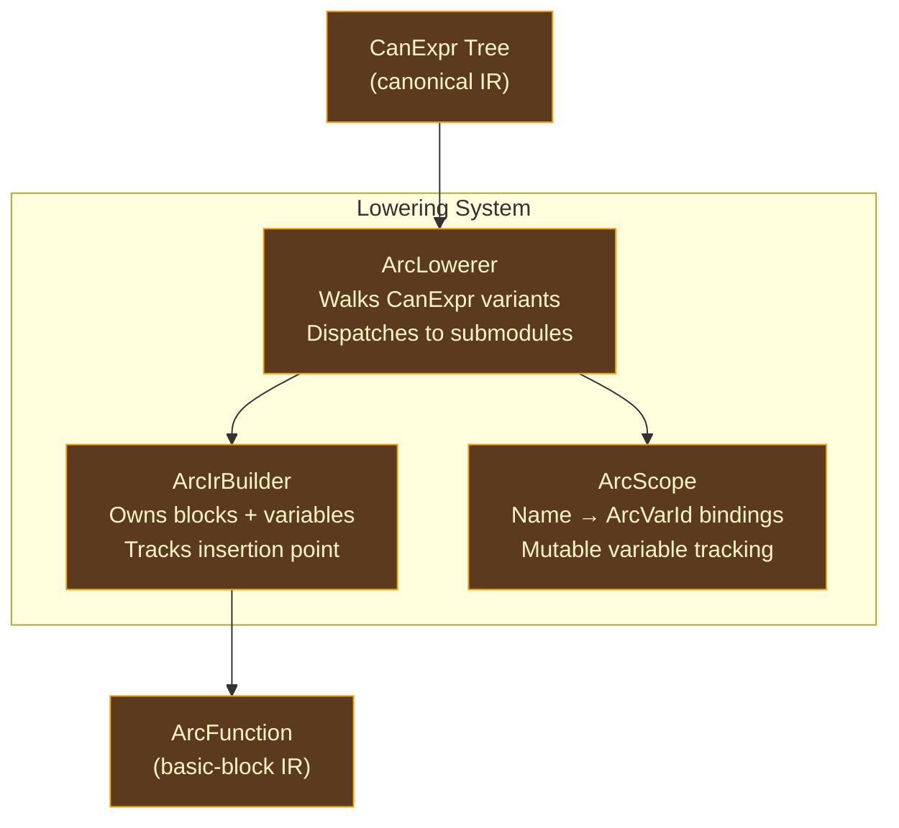
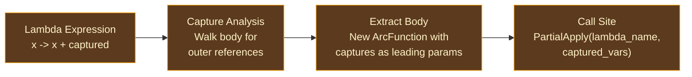

# Lowering

## From Expression Trees to Control Flow Graphs

Every optimizing compiler faces a fundamental representational challenge: the high-level structure that is natural for parsing and type checking — nested expression trees — is the wrong structure for the analyses that code generation requires. Liveness analysis, dataflow optimization, and register allocation all need to reason about the order in which operations execute and the paths that control can take through a function. Expression trees make control flow implicit (an `if/else` is a subtree); code generation needs it explicit (two blocks with a conditional branch between them).

The process of converting a high-level IR into a lower-level one with explicit control flow is called **lowering**. It goes by different names in different compilers — Rust calls it "MIR building," LLVM calls it "instruction selection" (though that term is overloaded), GHC calls it "Core to STG" or "STG to Cmm" depending on the phase — but the fundamental operation is the same: walk the expression tree, emit instructions into basic blocks, and generate explicit jump/branch/switch terminators at control flow points.

Ori's lowering pass converts canonical IR (`CanExpr`, a sugar-free typed expression tree with implicit control flow) into ARC IR (`ArcFunction`, basic blocks with SSA-like variables and explicit terminators). This is the first step of the AIMS pipeline and produces the IR that all subsequent analysis and realization steps operate on.

### The Challenge of SSA Construction

The classical approach to building SSA form is to first build a non-SSA CFG, then compute dominance frontiers, then insert phi nodes. Cytron et al. (1991) described this algorithm, and it remains the standard in textbooks. But it requires building the CFG twice — once without phi nodes, once with — and the dominance computation adds complexity.

A simpler approach, used by many modern compilers, is to construct SSA form **during lowering** rather than after. Each mutable variable tracks its "current" SSA name in a scope structure. When control flow diverges (if/else, match), the scope is snapshotted. When control flow merges, the divergent SSA names are reconciled through phi nodes (or block parameters, which are equivalent). This is the approach used by Swift SIL, MLIR, and Ori's ARC IR.

## Entry Point

The entry point is `lower_function_can()`, which takes a canonical IR body and produces an `ArcFunction` plus any lambda bodies as additional `ArcFunction`s:

```
lower_function_can(name, params, return_type, body, canon, ...)
    -> (ArcFunction, Vec<ArcFunction>)
```

The returned tuple contains the main function's ARC IR and a flat list of all lambda bodies extracted during lowering. Each lambda becomes a separate `ArcFunction` with captured variables as leading parameters and user parameters following.

## Architecture

The lowering pass is organized around three collaborating components:



### ArcIrBuilder

Owns the in-progress function state: blocks, variables, and the current insertion point. Follows the same "position at a block, emit instructions, terminate" pattern as LLVM's `IRBuilder`.

Key operations:
- `new()` — creates a builder with an entry block (block 0) already allocated
- `new_block()` — allocates an empty block and returns its `ArcBlockId`
- `position_at(block)` — sets the current insertion point
- `fresh_var(ty)` — allocates a new `ArcVarId` with the given type
- `add_block_param(block, ty)` — adds a block parameter for phi-like merge
- `emit_let()`, `emit_apply()`, `emit_construct()`, etc. — emit instructions at the current position
- `emit_invoke()` — emits an `Invoke` terminator with normal and unwind continuations
- `terminate_return()`, `terminate_jump()`, `terminate_branch()`, `terminate_switch()` — set block terminators
- `finish()` — consumes the builder and produces the final `ArcFunction`

The `finish()` method validates that every block has a terminator. Unterminated blocks (e.g., dead code after `break`) receive `Unreachable` as a fallback with a tracing warning.

### ArcLowerer

Walks the canonical expression tree and emits ARC IR instructions via the builder. The core method is `lower_expr(id: CanId) -> ArcVarId`, which dispatches on the `CanExpr` variant and returns the SSA variable holding the result.

The lowerer carries all contextual data needed for lowering: the canonical expression arena, the type pool, the string interner, the current scope, an optional loop context for `break`/`continue` targets, a problems accumulator for diagnostics, a lambdas accumulator for extracted lambda bodies, and a `VariantCtors` map for intercepting enum variant construction.

### ArcScope

Tracks `Name` → `ArcVarId` bindings with mutable variable tracking for SSA merge:
- `bind(name, var)` — bind an immutable variable
- `bind_mutable(name, var)` — bind a mutable variable and mark it for SSA merge tracking
- `lookup(name)` — resolve a name to its current `ArcVarId`
- `mutable_bindings()` — iterate over all mutable bindings (for merge point detection)

Child scopes are created via `clone()`. The `merge_mutable_vars()` free function compares branch scopes against a pre-branch snapshot to find reassigned variables and add block parameters for each divergent one.

## Submodule Organization

| Submodule | What It Lowers |
|-----------|---------------|
| `expr/` | Expression dispatch: the main `match` on `CanExpr` variants. Handles literals, identifiers, binary/unary ops, and routes to specialized submodules. |
| `calls/` | Function calls (direct, method, indirect) and the nounwind classification. |
| `calls/lambda.rs` | Lambda expressions: capture analysis, body extraction, `PartialApply` emission. |
| `collections/` | Tuple, list, map, set, struct, enum construction. Field access, index access, range literals. Also `Ok`/`Err`/`Some`/`None`, `try` (`?`), and casts. |
| `constructs.rs` | Special expression forms: `print`, `panic`, `todo`, `unreachable`, `recurse`, `cache`, `catch`, and format specs. |
| `control_flow/` | Block expressions, `let` bindings, `if`/`else`, `match`, `break`, `continue`, assignment. |
| `control_flow/for_loops.rs` | `for`-`in` loop lowering (imperative iteration with `do`). |
| `control_flow/for_yield.rs` | `for`-`yield` (list comprehension) lowering. |
| `control_flow/loops.rs` | Infinite `loop` lowering with `break`/`continue` support. |
| `patterns/` | Pattern binding destructuring for `let` and `for`. |
| `scope/` | `ArcScope` and `merge_mutable_vars` for SSA merge. |

## SSA Construction for Mutable Variables

### Rebinding

Each assignment to a mutable variable creates a fresh `ArcVarId`. The scope tracks the *current* SSA variable for each mutable name. Reading looks up the current binding; writing creates a new one and updates the scope.

```
let x = 1       // scope: x → v0
x = x + 1       // scope: x → v1 (fresh ArcVarId)
x = x * 2       // scope: x → v2 (fresh ArcVarId)
```

This is straightforward within a single basic block. The complexity arises at control flow merge points.

### Merge at Join Points

At control flow join points (if/else, match, loops), mutable variables that were reassigned in divergent branches must be reconciled. The pattern is:

1. **Snapshot** the scope before the branch (`pre_scope = scope.clone()`)
2. **Lower each branch** with a clone of the pre-scope
3. **Compare** each branch's scope against the pre-scope — for each mutable variable where ANY branch changed the `ArcVarId`, add a block parameter to the merge block
4. Each branch's `Jump` to the merge block passes its version of the variable as an argument
5. After the merge, rebind each merged variable to its merge-block parameter

This is equivalent to phi-node insertion, but using block parameters makes it structurally simpler — there are no separate phi instructions to maintain, just block parameters that are part of the block's signature.

### Block Scope Propagation

Block expressions (`{ let x = 1; ... }`) create child scopes. Local `let` bindings die with the block, but mutable variable reassignments (`x = expr` where `x` was declared outside the block) propagate to the parent scope. The `block_let_names` set tracks which names were freshly introduced by `let` in the current block to distinguish new bindings (shadows) from reassignments.

## Lambda Lowering

Lambda bodies are extracted into separate `ArcFunction`s, following the lambda-lifting pattern used by most functional language compilers:



1. **Capture analysis**: `collect_captures()` walks the lambda body's canonical expression tree. For each `Ident(name)` not in the lambda's parameter list and present in the outer scope, it records `(name, outer_arc_var_id)`.

2. **Build lambda function**: A new `ArcIrBuilder` and `ArcScope` are created. Capture parameters come first (with the outer variable's type), followed by user parameters.

3. **Name assignment**: The lambda receives a unique name (`__lambda_N`). The `num_captures` field records how many leading parameters are captures.

4. **PartialApply at call site**: Back in the outer lowerer, a `PartialApply` instruction packs the captured variables into a closure object.

Nested lambdas are handled recursively — the inner lambda lowerer shares the same `lambdas` accumulator, so all extracted lambdas end up in a single flat list regardless of nesting depth.

## Call Classification

Function calls are classified into three categories:

### Direct Calls (Apply / Invoke)

When the callee is a known function, the lowerer checks if it is a variant constructor (emits `Construct` instead) or a regular function. Regular functions are further classified by whether they can unwind:

- **Nounwind**: runtime functions (`ori_*`) and compiler helpers (`__*`) are known to never panic. These emit `Apply` instructions (no unwind handling needed).
- **May-unwind**: user-defined functions may panic. These emit `Invoke` terminators with normal and unwind continuation blocks. The unwind block is terminated with `Resume` (or `Jump` to a catch handler inside `catch(expr:)` blocks).

### Indirect Calls (ApplyIndirect)

When the callee is a local variable holding a closure (or any non-name expression), the lowerer emits `ApplyIndirect` with the closure variable.

### Inline Tag Checks

Calls to `is_ok`, `is_err`, `is_some`, `is_none` are lowered inline as `Project(tag field) == constant` rather than function calls, because these are trivial discriminant checks that don't participate in ownership transfer.

## Control Flow Lowering

### If/Else

Produces four blocks: entry (condition evaluation), then, else, merge. The condition is evaluated in the entry block, which terminates with `Branch`. Each branch lowers its body in a clone of the pre-branch scope. At the merge block, SSA merge adds block parameters for divergent mutable variables plus the result value.

### Match

Uses pre-compiled decision trees from the canonicalization pass. The `DecisionTree` is read from the `CanonResult` and walked by the decision tree emission pipeline to produce ARC IR blocks. Mutable variable merge follows the same pattern as if/else.

### Loops

Infinite loops (`loop { body }`) produce a header block and an exit block. The header block receives mutable variable values as parameters. `break` jumps to the exit block; `continue` jumps back to the header. The `LoopContext` struct tracks exit/continue targets and the ordered list of mutable variable names for consistent block-parameter ordering.

### For Loops

`for`-`in` loops lower the iterator expression, then emit a loop structure that calls `next()` on each iteration, binds the pattern, evaluates the body, and jumps back to the header. `for`-`yield` (list comprehensions) builds a list by appending each yielded value.

## Pattern Binding

Pattern destructuring for `let` and `for` bindings walks the `CanBindingPattern` tree and emits `Project` instructions to extract fields:

- Simple name patterns bind directly
- Tuple/struct patterns emit `Project` for each field
- Nested patterns recurse
- Wildcard patterns (`_`) are skipped
- Mutable bindings use `scope.bind_mutable()`; immutable use `scope.bind()`

Match pattern compilation uses the separate decision tree pipeline, not the binding pattern infrastructure.

## Key Invariants

1. **All parameters start as `Owned`** — refined by borrow inference in a later pass. The lowerer makes no ownership decisions.

2. **Synthetic instructions have `None` spans** — instructions with no direct source correspondence use `None` in the spans parallel array.

3. **Value representations populated after lowering** — both the main function and all lambda bodies get `var_reprs` computed via `compute_var_reprs` at the end of `lower_function_can()`.

4. **Lambda bodies returned separately** — the caller receives the flat list and runs the AIMS pipeline on each independently.

5. **Block-parameter order is deterministic** — mutable variable merge uses `Vec` (not `HashMap`) for ordering, ensuring `Jump` arguments match `add_block_param` order.

6. **VariantCtors built once per function** — the reverse lookup from variant name to enum constructor info is shared immutably with all nested lowerers.

7. **Type substitution for generics** — when lowering a monomorphized function, `type_subst` maps generic `Idx` to concrete `Idx`, so all emitted instructions carry concrete types.

## Prior Art

**[Rust's MIR building](https://rustc-dev-guide.rust-lang.org/mir/index.html)** performs a similar AST→basic-block lowering, converting Rust's HIR (High-level IR) into MIR (Mid-level IR) with explicit basic blocks, terminators, and SSA-like places. Rust's MIR builder uses a `Builder` struct that tracks the current block and emits statements and terminators — the same pattern as Ori's `ArcIrBuilder`. The key difference is that MIR uses `Place` and `Rvalue` for storage locations (supporting Rust's borrow semantics), while ARC IR uses pure SSA variables.

**[Lean 4's LCNF construction](https://github.com/leanprover/lean4/tree/master/src/Lean/Compiler/LCNF)** lowers Lean's Core IR into LCNF (Lean Compiler Normal Form), a basic-block IR with let bindings, function applications, and explicit join points. Lean's approach to mutable variables (which arise from `do`-notation desugaring) is similar to Ori's — each mutation creates a fresh variable, with phi-like merge at join points.

**[Swift's SILGen](https://github.com/swiftlang/swift/tree/main/lib/SILGen)** lowers Swift's AST into SIL, handling closures through a similar lambda-lifting pattern where captured variables become leading parameters of the extracted function. Swift's capture analysis is more complex because Swift supports mutable captures (capturing a variable by reference), while Ori captures by value.

**[MLIR](https://mlir.llvm.org/)** pioneered the use of block arguments (block parameters) as the merge mechanism instead of phi nodes. Ori's ARC IR follows this design — blocks declare parameters, and `Jump` terminators pass arguments. This representation is now widely considered superior to phi nodes for compiler passes that manipulate control flow.

## Design Tradeoffs

**SSA construction during lowering vs post-hoc.** Ori constructs SSA form during lowering rather than building a non-SSA CFG and then running a dominance-frontier-based phi insertion algorithm. This is simpler and produces well-formed SSA immediately, but it means the lowering pass must handle the merge logic for every control flow construct. The alternative (Cytron-style post-hoc insertion) would decouple control flow lowering from SSA construction, at the cost of an additional pass.

**Lambda lifting vs closure conversion.** Lambda bodies are extracted into separate `ArcFunction`s (lambda lifting), with captured variables becoming explicit parameters. The alternative — keeping lambda bodies inline and using a closure representation that the ARC pass can analyze — would avoid the extraction step but complicate every ARC pass (each would need to handle nested function bodies). Lambda lifting simplifies all downstream passes at the cost of the extraction machinery.

**Flat lambda list vs hierarchical.** Nested lambdas are accumulated into a single flat list rather than a tree reflecting the nesting structure. This simplifies the caller (no recursive traversal needed) at the cost of losing nesting information. In practice, the nesting information is not needed after lowering — each `ArcFunction` is self-contained with its captures as explicit parameters.

**Invoke vs Apply split.** The distinction between `Apply` (nounwind) and `Invoke` (may-unwind) could be deferred to the LLVM backend (all calls become `invoke`, and LLVM optimizes away unnecessary landing pads). Making the distinction during lowering allows the AIMS pipeline to generate cleaner code for nounwind calls (no unwind edges, no cleanup blocks) at the cost of a classification decision during lowering.
