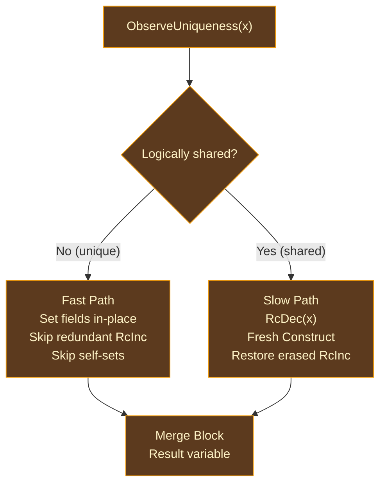

# Reuse Emission

## The Allocation Problem in Functional Programming

Functional programs have a distinctive storage-lifetime pattern: they
deconstruct values and immediately construct shape-compatible new ones. A list
map walks a list, projects an element, applies a function, and constructs a new
result.

Physical projections can waste that opportunity differently: a conventional
heap projection may free an old allocation and call `malloc`, while a VM,
region, arena, or inline projection may churn an equivalent storage identity.

This pattern is ubiquitous in map, filter, fold, and recursive transforms.
Reuse requires all of the following:

- The old value is **logically unique**.
- Its lifetime ends at the replacement.
- Neutral extent/shape evidence proves compatibility.

The selected physical plan can then reuse its storage identity directly. AIMS
proves the logical reuse event but does not choose the storage mechanism.

This insight was formalized independently by two research groups. [Ullrich and de Moura](https://arxiv.org/abs/1908.05647) (2019) described the "reset/reuse" optimization for [Lean 4](https://github.com/leanprover/lean4). [Reinking, Xie, de Moura, and Leijen](https://www.microsoft.com/en-us/research/publication/perceus-garbage-free-reference-counting-with-reuse/) (2021) extended this into the [Perceus](https://www.microsoft.com/en-us/research/publication/perceus-garbage-free-reference-counting-with-reuse/) framework for [Koka](https://github.com/koka-lang/koka), adding the concept of **FBIP** (Functional But In-Place).

AIMS integrates reuse with its lattice analysis, using `ShapeClass` and
`Uniqueness` to derive logical donor/recipient eligibility and ownership
transfer from the same converged state that drives ownership-event placement.
Physical storage recycling and any counter actions remain planner-owned.

## How AIMS Drives Reuse

In a traditional pipeline, reuse detection runs as a separate pass after RC insertion, scanning for `RcDec`/`Construct` pairs. AIMS integrates reuse into its unified analysis and realization:

1. **Shape tracking**: The `ShapeClass` dimension classifies each variable's constructor shape during backward analysis. Values from `Construct` instructions get shapes like `ReusableCtor(Struct)`, `ReusableCtor(EnumVariant)`, `CollectionBuffer`, etc. Non-constructible values get `NonReusable`.

2. **Uniqueness proof**: The `Uniqueness` dimension tracks whether a value is
   provably unique, maybe shared, or definitely shared. Reuse is safe only when
   uniqueness is proved statically or an exact logical uniqueness observation
   is required. The physical plan decides whether that observation reads a
   counter, tag, side table, or needs no runtime operation.

3. **Reuse events**: During post-convergence processing, the analysis emits `ReusableAllocation` events at program points where a variable with a matching shape is being decremented near a construction of the same type.

4. **Realization**: During `realize_rc_reuse()` (Phase 1), the reuse emission step reads these events and emits `Reset`/`Reuse` pairs, then expands them into conditional fast/slow paths.

## The Two-Phase Approach

The transformation proceeds in two phases:

1. **Detection + Planning** — identify reuse candidates from the lattice state, verify constraints, and emit `Reset`/`Reuse` intermediate instructions
2. **Expansion** — lower each `Reset`/`Reuse` pair into conditional fast/slow paths with `IsShared` guards

After expansion, no `Reset` or `Reuse` instructions remain in the IR.

## Detection

Detection operates at two granularities: within a single basic block (the common case) and across block boundaries (for recursive patterns).

### Intra-Block Detection

The common case. A forward scan through each basic block looks for `RcDec`/`Construct` pairs where the lattice state confirms eligibility:

1. Find an `RcDec { var: x }` where `x` has a reusable `ShapeClass`
2. Look ahead for a matching `Construct { dst, ty, ctor, args }` of the same type
3. Verify all constraints (see below)
4. Replace: `RcDec` → `Reset { var: x, token: t }`, `Construct` → `Reuse { token: t, dst, ty, ctor, args }`

### Cross-Block Detection

For patterns where the decrement and construction occur in different blocks — canonically, a recursive function that decrements a list node in one block and constructs a replacement in a dominated block.

The algorithm uses three analyses:

- **Dominator tree**: The block containing the `RcDec` must dominate the block containing the `Construct`
- **Lattice state**: The `Consumption` dimension for the decremented variable must be `Dead` or `Linear` (not used beyond the reuse point) in all intermediate blocks
- **Post-dominator tree**: The `Construct` block must post-dominate the `Reset` block within the relevant subgraph

### Constraints

A pairing is only valid when all of the following hold:

| Constraint | Reason |
|-----------|--------|
| **Shape/extent match** | AIMS requires compatible logical constructor shape; neutral representation evidence and the selected physical plan prove storage extent/alignment compatibility. |
| **No intervening use** | The decremented variable must not be read between the `RcDec` and `Construct`. |
| **Reusable storage identity** | The selected physical plan must expose storage whose lifetime ends here and whose capacity/observability rules admit reuse. Heap, region, arena, frame, and inline candidates are all possible; syntax or locality alone is insufficient. |
| **Not a collection** | Collections use variable-capacity buffers. Constructor-level reuse is not meaningful (see Collection Recycling below). |
| **Shape compatible** | The `ShapeClass` of the old value must match the new construction's shape. |

## Expansion

Expansion lowers each `Reset`/`Reuse` pair into a conditional structure with fast and slow paths:

### Expansion Steps

1. **Analyze projections**: Find `Project { src: x }` instructions that extract fields from the value being reset. Build a projection map.

2. **Projection-increment erasure**: Identify `RcInc` on projected field variables between `Reset` and `Reuse`. On the fast path, these are redundant — projected fields of a unique parent are implicitly owned.

3. **Generate uniqueness observation**: Emit the shared logical `IsShared`
   event when static facts are insufficient. The selected physical adapter
   chooses a sufficient observation mechanism.

4. **Fast path (logically unique)**: Reuse the plan-selected storage — emit
   `Set` for each logical field, apply self-set elimination, and discharge only
   ownership events explicitly licensed by the frozen facts.

5. **Slow path (logically multiple-owner)**: Cannot reuse. The current ARC IR
   emits `RcDec`, a fresh `Construct`, and any erased `RcInc`; these names carry
   logical release/construction/retain events, while the physical plan selects
   their mechanisms.

6. **Merge block**: Join block receives the result from whichever path was taken.

### Self-Set Elimination

A `Set` that writes a value back to the same field it was projected from is a no-op and is eliminated. This arises naturally in record update patterns like `{ ...point, x: new_x }`.

## Collection Recycling

A separate optimization handles collection storage reuse. When a list or set's
logical lifetime ends and a new empty collection of a compatible type is
constructed, `CollectionReuse` records the opportunity to recycle capacity:

- **Fast path (unique)**: Run exact child cleanup, reset logical length to zero,
  and retain the plan-selected capacity/storage identity.
- **Slow path (shared)**: Preserve the old value's release obligation and obtain
  fresh logical storage through the selected plan.

This targets loop patterns like `for x in list yield f(x)`, where the result list often has the same length as the source.

## FIP Certification

**Functional But In-Place** (FBIP) is a property that AIMS certifies through its `FipContract` and `EffectClass` dimensions. A function achieves FIP when every allocation site is covered by reuse — every `Construct` is paired with a `Reset`, meaning zero net allocation on the fast path.

AIMS computes FIP status as follows:

1. **Logical acquisition/cleanup balance**: The transitional `fip_construct_count` and `fip_consumed_count` fields of `AimsStateMap` track logical storage-acquisition and lifetime-end cleanup obligations, not target allocator calls
2. **FipContract assignment**: Based on the balance:
   - `Certified`: Exact match — zero unmatched logical storage-acquisition and lifetime-end cleanup obligations
   - `Conditional`: FIP only if specific arguments are unique at call sites
   - `Bounded(n)`: FIP with at most n unmatched logical storage-acquisition obligations
   - `Never`: No FIP certification possible
3. **Enforcement**: Functions annotated with `#fbip` are verified by `check_fbip_enforcement()` — if any logical storage-acquisition obligation is unmatched, a diagnostic is emitted

FBIP diagnostics are available with `ORI_DUMP_AFTER_ARC=1`.

## Prior Art

**[Lean 4](https://github.com/leanprover/lean4)** (`src/Lean/Compiler/IR/ExpandResetReuse.lean`) pioneered the token-based reset/reuse shape — the historical influence here. AIMS's formulation is Ori's own, proven independently (see Spec: Annex E §AIMS): it adds cross-block detection, projection-increment erasure, self-set elimination, collection recycling, and lattice-driven eligibility.

**[Koka](https://github.com/koka-lang/koka)** and the [Perceus paper](https://www.microsoft.com/en-us/research/publication/perceus-garbage-free-reference-counting-with-reuse/) formalize reuse as part of the Perceus framework and introduce the FBIP concept. The [FP2 paper](https://www.microsoft.com/en-us/research/publication/fp2-fully-in-place-functional-programming/) (2023) extends this with guaranteed zero-net-allocation for qualifying functions. AIMS implements FBIP as a lattice-derived certification rather than a separate diagnostic pass.

**[Swift](https://github.com/swiftlang/swift)** uses `isKnownUniquelyReferenced` for COW container optimization — a runtime check similar to `IsShared`, but applied at the collection API level rather than at the constructor level.

## Design Tradeoffs

**Lattice-driven vs pattern-matching detection.** AIMS uses the converged lattice state (ShapeClass, Uniqueness, Consumption) to identify reuse candidates, rather than pattern-matching `RcDec`/`Construct` pairs after RC insertion. The lattice approach has more information available (cross-dimensional synergy) but requires the analysis to complete before any reuse decisions are made.

**Detection then expansion vs direct emission.** Separating detection (producing `Reset`/`Reuse` intermediates) from expansion (lowering to `IsShared` + branches) keeps each phase focused. Direct emission would avoid the intermediate instructions but would make the detection phase much more complex.

**Conservative logical and physical matching.**

- AIMS requires exact logical type/constructor compatibility.
- A physical plan additionally proves extent, alignment, field mapping, and observability compatibility.
- One backend's coincidental byte layout cannot justify relaxed logical equality.

**Collection exclusion.** Collections are excluded from constructor-level reuse because their buffer size depends on capacity, not element count. Collection recycling handles the buffer-level optimization separately.
