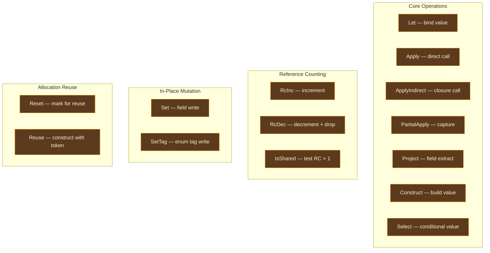
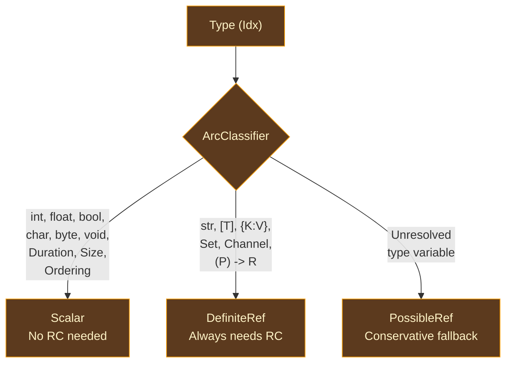

# ARC IR

## Why a Separate IR for Memory Management?

Compilers use intermediate representations to bridge the gap between what programmers write and what machines execute. Each IR is designed for a specific kind of analysis, and the canonical IR that enters the ARC system — a typed expression tree with implicit control flow — is the wrong shape for reference counting analysis.

Reference counting decisions depend on **control flow**: when does a variable's last use occur? Does a value flow down both branches of an if/else? Is a value captured by a closure and thus outlives its declaring scope? Answering these questions requires explicit control flow — basic blocks, terminators, and a control flow graph where dataflow equations can be solved.

The classical solution, used by virtually every optimizing compiler, is to lower the high-level AST into a **basic-block IR** where control flow is explicit. LLVM has LLVM IR. Rust has MIR. GHC has STG and then Cmm. [Lean 4](https://github.com/leanprover/lean4) has LCNF (Lean Compiler Normal Form). [Swift](https://github.com/swiftlang/swift) has SIL (Swift Intermediate Language). Each of these IRs shares the same fundamental structure: functions contain blocks, blocks contain sequential instructions and a terminator, and values are referenced by SSA-like variable IDs.

Ori's ARC IR follows this pattern. It is lowered from the canonical IR (sugar-free expression tree) into basic blocks with explicit jumps, branches, and switches. Variables are SSA-like — each binding creates a fresh `ArcVarId`, and mutable variables are handled through block parameters at control flow merge points (the same mechanism as LLVM's phi nodes, but using block arguments instead). This structure makes liveness analysis, borrow inference, RC insertion, and reuse detection straightforward applications of standard dataflow algorithms.

### What Makes ARC IR Distinctive

ARC IR is not a general-purpose low-level IR like LLVM IR — it is a **domain-specific IR for reference counting analysis**. Every design decision serves this purpose:

- **Type classification is embedded**: every variable carries its `ArcClass` (Scalar, DefiniteRef, PossibleRef), so RC passes never query the type system
- **Ownership annotations are first-class**: function parameters carry `Ownership`, call arguments carry `ArgOwnership`
- **RC operations are explicit instructions**: `RcInc` and `RcDec` are instructions with embedded `RcStrategy`, so the LLVM emitter pattern-matches directly without type queries
- **Reuse is a first-class concept**: `Reset`/`Reuse` instructions model in-place allocation reuse as IR constructs, not ad-hoc pattern matching
- **Value representation is pre-computed**: each variable's `ValueRepr` (Scalar, RcPointer, Aggregate, FatValue) is computed once and stored in a parallel array

## Function Structure

### ArcFunction

A complete function body in ARC IR. Contains everything needed for all ARC analysis passes:

| Field | Type | Purpose |
|-------|------|---------|
| `name` | `Name` | Interned function name |
| `params` | `Vec<ArcParam>` | Parameters with ownership annotations |
| `return_type` | `Idx` | Return type (Pool index) |
| `blocks` | `Vec<ArcBlock>` | Basic blocks in definition order |
| `entry` | `ArcBlockId` | Entry block ID |
| `var_types` | `Vec<Idx>` | Type per variable, indexed by `ArcVarId` |
| `var_reprs` | `Vec<ValueRepr>` | Machine representation per variable (populated by `compute_var_reprs`) |
| `cow_annotations` | `CowAnnotations` | Per-COW operation mode (from uniqueness analysis) |
| `drop_hints` | `DropHints` | RcDec targets proven unique (skip full drop path) |
| `is_fbip` | `bool` | Whether `#fbip` annotation is present for reuse enforcement |
| `num_captures` | `usize` | Leading parameters that are closure captures (0 for top-level functions) |

The `var_reprs` field starts empty after lowering and is populated by `compute_var_reprs` at the beginning of the ARC pipeline. This means the lowering phase does not need to know about machine-level representation — it works purely at the type level.

### ArcBlock

A basic block: optional parameters for control flow merges, a sequential instruction body, and a terminator.

| Field | Type | Purpose |
|-------|------|---------|
| `id` | `ArcBlockId` | Block identifier |
| `params` | `Vec<(ArcVarId, Idx)>` | Block parameters (phi-node equivalent) |
| `body` | `Vec<ArcInstr>` | Instructions in execution order |
| `terminator` | `ArcTerminator` | How control exits this block |

Block parameters are ARC IR's phi-node mechanism. When a mutable variable diverges across branches (if/else, match arms), the merge block receives both versions as block parameters, and each predecessor's `Jump` terminator passes its version as an argument. This is the same approach used by [MLIR](https://mlir.llvm.org/) and Swift SIL — structurally simpler than LLVM's phi nodes and easier to manipulate during ARC passes.

### ID Types

Both `ArcVarId` and `ArcBlockId` are `#[repr(transparent)]` newtypes over `u32`, allocated sequentially starting from 0. They provide `raw() -> u32` and `index() -> usize` for indexing into parallel arrays (`var_types`, `var_reprs`). The newtype discipline prevents accidentally using a block ID as a variable ID or vice versa.

### ArcParam

A function parameter annotated with ownership:

| Field | Type | Purpose |
|-------|------|---------|
| `var` | `ArcVarId` | Variable ID for this parameter |
| `ty` | `Idx` | Type in the Pool |
| `ownership` | `Ownership` | `Owned` or `Borrowed` (refined by borrow inference) |

All parameters start as `Owned` during lowering and may be refined to `Borrowed` by borrow inference. This "start conservative, refine" approach ensures correctness — an `Owned` parameter that should be `Borrowed` wastes RC operations but is correct, while a `Borrowed` parameter that should be `Owned` would be a use-after-free.

## Instruction Set

ARC IR has 13 instruction variants, organized by purpose:

### Core Operations

| Instruction | Purpose |
|-------------|---------|
| `Let { dst, ty, value }` | Bind an `ArcValue` (variable reference, literal, or primitive operation) to a new variable |
| `Apply { dst, ty, func, args, arg_ownership }` | Direct function call — `func` is a `Name`, resolved at link time |
| `ApplyIndirect { dst, ty, closure, args }` | Call through a closure's fat pointer (`{fn_ptr, env_ptr}`) |
| `PartialApply { dst, ty, func, args }` | Capture arguments into a closure environment |
| `Project { dst, ty, value, field }` | Extract field `field` (by index) from a struct, enum payload, or tuple |
| `Construct { dst, ty, ctor, args }` | Build a composite value — structs, enum variants, tuples, collections, closures |
| `Select { dst, ty, cond, true_val, false_val }` | Conditional value selection (maps directly to LLVM `select`) |

**Value-producing instructions** return `Some(dst)` from `defined_var()`. The `ArcValue` type used in `Let` has three variants: `Var(ArcVarId)` for referencing an existing variable, `Literal(LitValue)` for constants, and `PrimOp { op, args }` for primitive arithmetic and comparison operations.

The `CtorKind` enum on `Construct` distinguishes: `Struct(Name)`, `EnumVariant { enum_name, variant }`, `Tuple`, `ListLiteral`, `MapLiteral`, `SetLiteral`, and `Closure { func }`.

### Reference Counting Operations

| Instruction | Purpose |
|-------------|---------|
| `RcInc { var, count, strategy }` | Increment reference count. `count` allows batched increments (e.g., a variable used in 3 places gets `RcInc { count: 2 }` — one use is "free"). `strategy` determines how to find the RC header. |
| `RcDec { var, strategy }` | Decrement reference count. If the count reaches zero, invoke the drop function to free the allocation. |
| `IsShared { dst, var }` | Test whether `var`'s reference count is greater than 1. Returns a boolean. Used as a guard before in-place mutation (COW) and reuse expansion. |

These instructions are **not present after lowering** — they are inserted by the RC insertion pass (Perceus algorithm) based on liveness analysis and ownership information. The `RcStrategy` embedded in each instruction tells the LLVM emitter exactly how to emit the operation, with no further type queries needed.

### In-Place Mutation

| Instruction | Purpose |
|-------------|---------|
| `Set { base, field, value }` | Write a value to a field of a struct or tuple. Only valid when the base is uniquely owned (guarded by `IsShared`). |
| `SetTag { base, tag }` | Update the discriminant tag of an enum. Only valid when uniquely owned. |

These instructions support COW (copy-on-write) semantics: before mutating, the compiler inserts an `IsShared` check. If the value is shared, the slow path copies it; if unique, `Set`/`SetTag` mutate in place.

### Allocation Reuse

| Instruction | Purpose |
|-------------|---------|
| `Reset { var, token }` | Mark a value for potential in-place reuse. The `token` is an `ArcVarId` used to track the reuse opportunity. |
| `Reuse { token, dst, ty, ctor, args }` | Construct a new value using the memory from a `Reset` token. If the reset value was uniquely owned, this is a zero-allocation construction. |

`Reset`/`Reuse` are **intermediate instructions** — they are inserted by the reset/reuse detection pass and then **expanded** by the expansion pass into `IsShared` guards with fast-path (in-place) and slow-path (fresh allocation) branches. After expansion, no `Reset` or `Reuse` instructions remain in the IR.

## Terminators

Every block ends with exactly one terminator:

| Terminator | Purpose |
|------------|---------|
| `Return { value }` | Return from the function |
| `Jump { target, args }` | Unconditional jump, passing values as block parameters |
| `Branch { cond, then_block, else_block }` | Conditional branch on a boolean |
| `Switch { scrutinee, cases, default }` | Multi-way branch on an integer discriminant (from pattern match compilation) |
| `Invoke { dst, ty, func, args, arg_ownership, normal, unwind }` | Function call with unwinding support — success continues to `normal`, panic transfers to `unwind` |
| `Resume` | Resume unwinding after cleanup (re-raise a caught panic) |
| `Unreachable` | Marks a block as provably unreachable (used after exhaustive match) |

Terminators provide `used_vars()`, `uses_var(target)`, and `substitute_var(old, new)` for liveness analysis, reuse expansion, and RC identity propagation.

## Type Classification

The three-way `ArcClass` classification is the foundation of all RC decisions. Every downstream pass — borrow inference, RC insertion, reset/reuse, elimination — consults the classification to determine whether a variable needs RC operations at all.

Classification is **monomorphized** — it operates on concrete types after type parameter substitution. `PossibleRef` should never appear after monomorphization; encountering it post-mono is a compiler bug.

**Misclassification is catastrophic:**
- Classifying a `DefiniteRef` as `Scalar` means missing RC operations → use-after-free or memory leak
- Classifying a `Scalar` as `DefiniteRef` means unnecessary RC operations → performance bug (but correct)

### Transitive Classification

Compound types are classified by their children. A tuple `(int, str)` contains `str` (DefiniteRef), so the tuple itself is `DefiniteRef` — it must participate in RC because decrementing it must propagate to its `str` field. A tuple `(int, bool)` is `Scalar` — no fields need RC, so the tuple doesn't either.

The rule is conservative: if **any** child is `DefiniteRef`, the compound is `DefiniteRef`. If any child is `PossibleRef` (and none is `DefiniteRef`), the compound is `PossibleRef`. Only if all children are `Scalar` is the compound `Scalar`.

Recursive types are detected via a cycle-detection set — if classification encounters an `Idx` already being classified, the type requires heap indirection and is `DefiniteRef`.

### ArcClassifier

The `ArcClassifier` wraps a `Pool` reference with a memoization cache and cycle-detection set. It provides a **fast path** for pre-interned primitives (Pool indices 0-11): `int` through `ordering` are classified by raw index without hash map lookup, producing instant `Scalar` classification. `str` (index 11) is the exception — it classifies as `DefiniteRef`.

Iterators and `DoubleEndedIterator` are classified as `Scalar` despite being heap-allocated, because they are runtime-managed (allocated with `Box::new`, not `ori_rc_alloc`) and lack RC headers.

## Value Representation

`ValueRepr` bridges the type-level `ArcClass` to machine-level layout. Computed once per variable by `compute_var_reprs` at the start of the pipeline, then stored in the `var_reprs` parallel array.

| Repr | Layout | Examples |
|------|--------|---------|
| `Scalar` | Register-width, no RC | `int`, `float`, `bool`, `char`, `byte`, `void` |
| `RcPointer` | Single heap pointer | `[T]`, `{K: V}`, `Set<T>`, `Channel<T>` |
| `Aggregate` | Multi-field value | Tuples, structs, enums, `Option<T>`, `Result<T, E>` |
| `FatValue` | Two-word: pointer + metadata | `str` (ptr + len), closures (`fn_ptr` + `env_ptr`) |

The derivation depends on both `ArcClass` and the Pool tag: `Scalar` classes always produce `Scalar` repr. For ref-containing classes, `Tag::Str` and `Tag::Function` produce `FatValue`, `Tag::Tuple/Struct/Enum/Result/Option` produce `Aggregate`, and collection types produce `RcPointer`.

## RC Strategy

`RcStrategy` refines `ValueRepr` specifically for RC operations — it encodes exactly how to find and manipulate the reference count for a given value shape. It is computed during RC insertion and **embedded in the `RcInc`/`RcDec` instructions themselves**, so the LLVM emitter pattern-matches directly without any Pool queries at emission time.

| Strategy | How It Works |
|----------|-------------|
| `HeapPointer` | Single pointer — call `ori_rc_inc(ptr)` / `ori_rc_dec(ptr, drop_fn)` directly |
| `FatPointer` | Two-word value (e.g., `str`) — extract field 1 (data pointer), then inc/dec |
| `Closure` | Fat pointer with nullable env — extract `env_ptr`, null-check (bare functions have no env), then inc/dec |
| `AggregateFields` | Multi-field struct/tuple — traverse RC-containing fields and inc/dec each recursively |
| `InlineEnum` | Stack-allocated enum — tag-switch, then per-variant field handling |

The key design insight: `RcStrategy` is **computed once and never recomputed**. It is the final answer to "how do you manage RC for this variable?" — all downstream consumers (LLVM emitter, reuse expansion, drop generation) read it directly from the instruction.

## ARC IR vs Canonical IR

| Property | Canonical IR | ARC IR |
|----------|-------------|--------|
| Control flow | Implicit (nested expressions) | Explicit basic blocks with terminators |
| Names | Scoped lexical names (`Name`) | SSA variables (`ArcVarId`) |
| Merge points | Expression nesting | Block parameters on `Jump` |
| Mutable variables | Rebinding in scope | Fresh `ArcVarId` per assignment; merge via block params |
| Function calls | Nested expression | `Apply` (direct), `ApplyIndirect` (closure), `Invoke` (may-unwind) |
| RC operations | None (implicit in value semantics) | Explicit `RcInc`/`RcDec` with strategy |
| Reuse | None | `Reset`/`Reuse` intermediates |
| Types | Per-expression via arena | Parallel `var_types` array indexed by `ArcVarId` |
| Ownership | None | Per-parameter `Ownership`, per-argument `ArgOwnership` |

## Prior Art

**[Lean 4's LCNF](https://github.com/leanprover/lean4/tree/master/src/Lean/Compiler/LCNF)** (Lean Compiler Normal Form) is the closest analog to Ori's ARC IR. LCNF is a basic-block IR with explicit let bindings, function applications, projections, and constructors — essentially the same instruction set as ARC IR. Lean's RC operations (`inc`, `dec`, `reset`, `reuse`) are also explicit instructions. The key structural difference is that Lean's IR is expression-oriented with explicit join points, while Ori uses block parameters for phi-like merges.

**[Swift's SIL](https://github.com/swiftlang/swift/blob/main/docs/SIL.rst)** (Swift Intermediate Language) is a similar basic-block IR with explicit `strong_retain` and `strong_release` instructions. SIL is more complex than ARC IR because it supports Swift's full ownership model (borrowing, move-only types, coroutines), while ARC IR is focused specifically on RC optimization for value semantics. SIL's type classification is implicit in its ownership rules, while ARC IR's `ArcClass` is an explicit three-way enum.

**[Rust's MIR](https://rustc-dev-guide.rust-lang.org/mir/index.html)** (Mid-level IR) shares the basic-block structure but has no RC instructions — Rust uses ownership and drop glue instead. MIR uses `Place` and `Rvalue` instead of SSA variables, making it more suited to Rust's borrow-checker semantics. ARC IR's SSA-like structure is simpler for the dataflow analyses it needs.

## Design Tradeoffs

**Block parameters vs phi nodes.** ARC IR uses block parameters on `Jump` terminators for merge points, rather than LLVM-style phi nodes at the start of blocks. Block parameters are easier to manipulate during ARC passes (adding a parameter doesn't require updating phi nodes in other blocks) and map naturally to function arguments during lowering. The tradeoff is that some LLVM optimizations are designed around phi nodes, so the ARC→LLVM translation must convert between the two representations.

**Embedded strategy vs late binding.** The `RcStrategy` is computed during RC insertion and embedded in every `RcInc`/`RcDec` instruction. The alternative — computing strategy at emission time from the variable's type — would keep the IR simpler but force the LLVM emitter to query the Pool for every RC operation. Embedding the strategy makes the emitter a tight, stateless loop over instructions, at the cost of a slightly larger IR.

**Three-way classification vs two-way.** The `PossibleRef` class exists for pre-monomorphization conservative analysis. A simpler two-way system (Scalar vs Ref) would eliminate the third case but require monomorphization to complete before any ARC analysis can begin. The three-way system allows ARC analysis to start earlier, though in practice monomorphization happens first and `PossibleRef` rarely appears.

**Domain-specific IR vs reusing LLVM IR.** ARC analysis could theoretically be done on LLVM IR directly, using LLVM's own SSA variables and basic blocks. But LLVM IR lacks the semantic information that ARC analysis needs — constructors, projections, ownership annotations, reuse tokens. A domain-specific IR makes these concepts first-class, at the cost of an additional lowering step (CanExpr → ARC IR → LLVM IR instead of CanExpr → LLVM IR directly).
