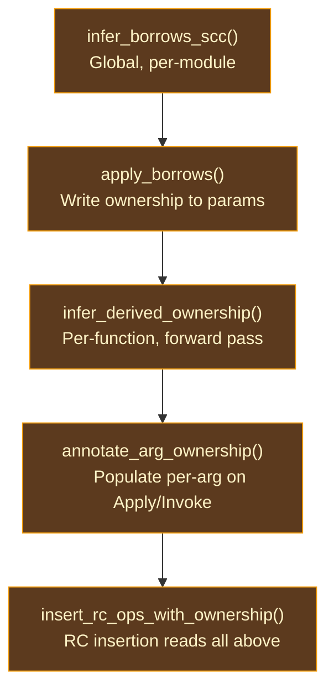

# Borrow Inference

## The Cost of Conservative Ownership

In a naive reference counting system, every function call site performs the same ritual: increment the reference count of each argument before the call (so the callee can use it), and decrement after the call returns (to release the caller's reference). For a function like `len(list)` — which only reads the list to count its elements and never stores, returns, or transfers it — these two atomic operations are pure waste. The callee borrows the value temporarily and gives it back; the reference count never actually needs to change.

The question is: how does the compiler know which parameters are merely borrowed and which are truly consumed? Without analysis, the answer is "assume the worst" — treat every parameter as potentially consumed, and pay the RC cost at every call site. This is what CPython does, and it is a significant contributor to Python's overhead.

**Borrow inference** is the analysis that answers this question automatically. It examines each function's body to determine whether each parameter is only read (Borrowed) or may be stored, returned, or otherwise retained (Owned). The result is an `AnnotatedSig` per function that downstream passes — derived ownership, RC insertion — use to skip RC operations at call sites for borrowed parameters.

The concept originates from [Lean 4](https://github.com/leanprover/lean4)'s compiler (`src/Lean/Compiler/IR/Borrow.lean`), which pioneered SCC-based interprocedural borrow inference for a functional language with reference counting.

### Why Interprocedural?

A per-function analysis could determine that a function's body only reads a parameter, but it cannot know whether the callees it passes that parameter to will retain it. Consider:

```
@store_in_global (x: [int]) -> void = ...  // stores x somewhere
@process (list: [int]) -> void = { store_in_global(list:) }
```

Looking at `process` alone, the parameter `list` appears to be merely passed to another function. But `store_in_global` retains it, so `process` must treat `list` as Owned. This requires knowing `store_in_global`'s ownership signature — which requires analyzing `store_in_global` first.

For mutually recursive functions, this creates a chicken-and-egg problem: each function's ownership depends on the others'. The solution is fixed-point iteration within strongly connected components (SCCs) of the call graph.

## Algorithm: SCC-Based Fixed-Point

The algorithm has four phases:

### Phase 1: Call Graph Decomposition

Build an interprocedural call graph from all functions in the module. Extract direct callees from `Apply`, `PartialApply`, and `Invoke` instructions (indirect calls via `ApplyIndirect` are excluded — their callees are unknown at compile time). Compute SCCs using Tarjan's algorithm, producing a topological ordering of components.

### Phase 2: Initialize

All non-scalar parameters start as `Borrowed` — the optimistic assumption that no parameter needs ownership. Scalar parameters (int, float, bool, etc.) start as `Owned` because they have no reference count — there is nothing to borrow. The classifier determines this.

### Phase 3: Topological Processing

SCCs are processed in topological order — callees before callers. This ensures that when analyzing a function, all of its non-recursive callees already have finalized signatures.

- **Non-recursive SCCs** (single function, no self-call): single-pass analysis. The function body is scanned once; any parameter usage requiring ownership triggers promotion.

- **Recursive SCCs** (mutual recursion): fixed-point iteration. All SCC members are initialized as Borrowed, then repeatedly scanned until no parameter changes ownership. Each iteration uses the latest in-progress signatures of co-members, while external callees use their stable final signatures.

### Phase 4: Convergence

Ownership is **monotonic**: parameters can only move from Borrowed to Owned, never backwards. With N total parameters in an SCC, convergence is guaranteed in at most N + 1 iterations — each iteration must promote at least one parameter, and when none change, the analysis has reached its fixed point.

## Promotion Rules

The core analysis scans all instructions and terminators. A parameter is promoted from Borrowed to Owned when any of the following holds:

**Returned from the function.** If a parameter (or an alias) appears as the value in a `Return` terminator, the function transfers ownership to its caller.

**Passed to an owned parameter.** If a parameter is passed as an argument to another function at a position where the callee's signature marks the parameter as Owned, ownership must transfer. Unknown callees conservatively mark all arguments as Owned.

**Stored in a Construct.** `Construct` instructions build structs, enums, and closures. All arguments are stored in heap-allocated memory — the constructed value takes ownership.

**Passed to a PartialApply.** Captured into a closure environment. Captured values are stored on the heap, requiring Owned semantics.

**Passed to an ApplyIndirect.** Indirect calls through closures have unknown callee signatures. All arguments are conservatively promoted to Owned.

**Projected then used in an owned position.** When `Project { dst, value }` extracts a field and the extracted `dst` is used in an owned position (returned, stored, etc.), the source `value` must also be Owned — otherwise the caller might free the struct while the projected field is still live. This propagation is transitive and handled naturally by the fixed-point iteration.

**Passed to a tail call at an owned position.** A tail call passes a Borrowed parameter to an Owned position — the parameter must be promoted. Without this, RC insertion would need to insert an `RcDec` after the tail call, breaking tail call optimization.

### Alias Resolution

Parameters may be aliased via `Let { dst, value: Var(src) }` instructions. Before checking whether a variable is a parameter, the analysis resolves alias chains transitively: `v2 → v1 → v0 (param)`. This ensures that `let v1 = param; Construct([v1])` correctly promotes `param`.

## Derived Ownership

After parameter-level borrow inference, **derived ownership** extends tracking to all local variables via a single forward pass (no fixed-point needed — SSA form guarantees each variable is defined exactly once).

The classification:

| Category | Source | Meaning |
|----------|--------|---------|
| `Owned` | Function call results, literals, block parameters, `Select` results | Caller owns; normal RC tracking |
| `BorrowedFrom(var)` | Projection or alias of a borrowed variable | Transitively borrowed; skip RC tracking |
| `Fresh` | `Construct`, `PartialApply` results | Newly created, RC == 1; enables aggressive reuse pairing |

The key insight: `BorrowedFrom` is transitive. If `v1` borrows from parameter `p`, and `v2 = Project(v1, field)`, then `v2` also borrows from `p`. The forward pass resolves these chains.

## Built-in Ownership

The analysis must know about built-in methods that the LLVM backend compiles inline (they have no user-function entries in the sigs map).

| Category | Behavior | Examples |
|----------|----------|---------|
| Borrowing builtins | All args borrowed | `len`, `is_empty`, `contains`, `first`, `last`, `equals`, `compare`, `hash`, `clone`, `to_str`, ~40 total |
| Consuming receiver | Receiver owned, others borrowed | `push`, `pop`, `insert`, `remove`, `reverse`, `sort` (COW list methods) |
| Consuming second arg | Receiver + arg[1] owned | `add`, `concat` (COW list concat — runtime takes both buffers) |
| Consuming receiver only | Receiver owned, others borrowed | Map/Set `remove`, `difference`, `intersection`, `union` |

These are pre-computed into a `BuiltinOwnershipSets` struct (interned names) constructed once per session.

## Pipeline Integration



Borrow inference results are cached per session. When a function body has not changed, its cached `AnnotatedSig` is reused without re-running inference.

## Prior Art

**[Lean 4](https://github.com/leanprover/lean4)** (`src/Lean/Compiler/IR/Borrow.lean`) is the direct inspiration. Lean's borrow inference uses the same SCC-based fixed-point approach with monotonic promotion from Borrowed to Owned. Ori's implementation follows Lean's algorithm closely, with additions for COW collection methods and closure capture optimization.

**[Koka](https://github.com/koka-lang/koka)** (`src/Core/Borrowed.hs`) performs a similar analysis as part of its Perceus implementation. Koka's approach is simpler — it does not perform full SCC decomposition but instead uses a two-pass strategy — which works for Koka's effect-handler-based architecture but would miss opportunities in Ori's more general call graph.

**[Swift](https://github.com/swiftlang/swift)** approaches the problem differently: Swift's ownership model is partly expressed in the source language through move semantics and `consuming`/`borrowing` annotations, rather than inferred purely by the compiler. Swift's SIL optimizer (`lib/SILOptimizer/ARC/`) then optimizes the explicit annotations, while Ori infers everything automatically.

## Design Tradeoffs

**Optimistic vs pessimistic initialization.** Starting all parameters as Borrowed (optimistic) and promoting to Owned produces the best results — fewer parameters end up Owned than if starting Owned and trying to demote. The tradeoff is that the fixed-point must iterate until no more promotions occur, rather than converging immediately. In practice, convergence is fast (typically 2-3 iterations per SCC).

**Interprocedural vs per-function.** Interprocedural analysis produces better results but has higher compile-time cost. A per-function analysis would be O(n) in the function count; the SCC-based approach adds Tarjan's algorithm (O(V + E)) and fixed-point iteration within each SCC. The cost is justified because the RC eliminations it enables are worth more than the analysis time.

**Conservative for unknowns.** Unknown callees (not in the sigs map, not in the builtin sets) get all-Owned arguments. This is correct but pessimistic — it means FFI calls and dynamically dispatched calls always pay full RC cost. A future extension could allow ownership annotations on FFI declarations.
