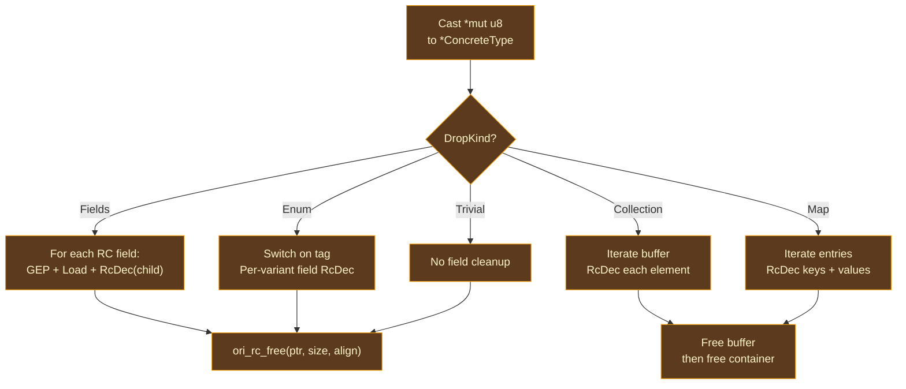

# Drop Descriptors

## What Happens When a Refcount Reaches Zero?

When a reference count drops to zero, the value is unreachable and must be cleaned up. But "cleanup" is type-dependent — freeing a struct requires decrementing each of its reference-counted fields before freeing the struct itself, freeing an enum requires checking the tag to determine which variant's fields to decrement, and freeing a collection requires iterating its buffer to decrement each element.

There are two approaches to this problem:

**Inline drop logic.** At every `RcDec` site, the compiler emits the full cleanup sequence inline — the tag check, the field traversal, the child decrements, and the free call. This is what a naive implementation would do. The problem is code bloat: a struct type used in 50 places generates 50 copies of the same cleanup code.

**Drop functions.** The compiler generates a single drop function per type, and every `RcDec` for that type passes the drop function's address to the runtime. The runtime's `ori_rc_dec` decrements the refcount and, if it reaches zero, calls the drop function. This is the approach used by Ori, Rust, Swift, and Lean 4.

Drop descriptors are the bridge between these two worlds: they are computed in `ori_arc` (which knows the type structure) and consumed by the LLVM backend's `DropFunctionGenerator` (which generates the actual LLVM IR for each drop function).

## DropKind Variants

Each type that requires cleanup gets a `DropInfo` containing a `DropKind` that describes the structure of its drop:

### Trivial

Applies to `str`, `[int]`, bare function pointers — types with no reference-counted children. The drop function simply frees the allocation without visiting any fields. Strings contain bytes, not pointers; lists of primitives contain inline data. No child decrements needed.

### Fields

Applies to structs and tuples. The drop function decrements each reference-counted field (by index) and then frees the allocation. Fields that are scalars (int, float, bool) are skipped — they have no refcount to decrement.

The descriptor stores `Vec<(u32, Idx)>` — pairs of field index (for GEP offset calculation) and type pool index (to look up the child's drop function).

### Enum

Applies to sum types. The drop function switches on the tag discriminant, and each case handles the fields specific to that variant. Variants with no RC fields (e.g., containing only integers) have an empty field list and skip straight to freeing.

The descriptor stores `Vec<Vec<(u32, Idx)>>` — an outer vector indexed by variant tag, each containing the RC field list for that variant.

### Collection

Applies to `[T]` and `Set<T>`. The drop function iterates over the buffer, decrementing each element's refcount, then frees both the buffer allocation and the container struct. The descriptor stores the `element_type` so the element's drop function can be looked up.

### Map

Applies to `{K: V}`. Like collections, but with two element types. The descriptor stores `key_type`, `value_type`, and two booleans: `dec_keys` and `dec_values`. A `{str: int}` map has `dec_keys: true, dec_values: false` — only string keys need decrementing; integer values are scalars.

### ClosureEnv

Applies to closure environments — heap-allocated structs containing captured variables. Only captures whose types are reference-counted appear in the field list. Primitive captures (integers, booleans) are skipped. The descriptor is structurally identical to `Fields` but is separated because closure environments have a different allocation layout than user structs.

## API

### compute_drop_info

Computes the drop descriptor for a single type. Returns `None` if the type is stack-only (no heap allocation, no RC). The classifier determines whether each field needs RC.

### compute_closure_env_drop

Builds a `ClosureEnv` drop kind from the list of capture types in a `PartialApply` instruction. Filters to only RC-needing captures and records their indices.

### collect_drop_infos

Scans all functions in a compilation unit, collects every type appearing in an `RcDec` or `Construct` instruction, computes drop info for each, and returns a deduplicated list. This is the main entry point used by the LLVM backend to gather all needed drop functions before code generation.

## LLVM Drop Function Generation

The LLVM backend's `DropFunctionGenerator` reads each `DropInfo` and generates a corresponding LLVM function.

### Naming and Caching

Drop functions are named `_ori_drop$<idx_raw>` where `idx_raw` is the raw type pool index — deterministic and unique per type. Functions are cached by this mangled name: if a drop function has already been generated, the cached function pointer is returned.

### Recursive Types

Recursive types (e.g., a linked list node containing `Option<Node>`) require special handling. The function ID is inserted into the cache **before** the function body is generated. This breaks the recursion: when generating the body of `_ori_drop$Node`, the `RcDec` for the `next` field looks up `_ori_drop$Node` and finds the already-registered (but not yet complete) function. LLVM handles forward references to functions natively, so this produces correct code.

### Drop Function Structure

Every generated drop function has the signature `extern "C" fn(*mut u8)` and follows a three-step structure:

1. **Cast**: Bitcast the opaque `*mut u8` data pointer to a pointer to the concrete struct type.

2. **Field cleanup**: Dispatch on the `DropKind`:
   - `Fields`: GEP to each RC field, load the pointer, call `ori_rc_dec(field_ptr, child_drop_fn)`.
   - `Enum`: Switch on the tag, then per-variant field cleanup.
   - `Collection`/`Map`: Loop over the buffer, decrementing each element/entry.
   - `Trivial`: No field cleanup needed.

3. **Free**: Call `ori_rc_free(data_ptr, size, align)` to release the allocation.

## Prior Art

**[Rust](https://github.com/rust-lang/rust)** generates per-type "drop glue" through the same pattern: each type with a `Drop` impl or drop-needing fields gets a compiler-generated drop function that recursively drops fields before freeing. Rust's drop glue is generated during MIR construction and is more complex because Rust must handle partial moves, `ManuallyDrop`, and panic-during-drop scenarios.

**[Lean 4](https://github.com/leanprover/lean4)** generates per-type "box free" functions that follow the same structure — cast, decrement children, free. Lean's approach is simpler because Lean's type system has fewer special cases (no closures with captures, no maps with separate key/value RC needs).

**[Swift](https://github.com/swiftlang/swift)** generates "value witness tables" that include a destroy function per type. Swift's approach is more general — witness tables include size, alignment, copy, and move functions alongside destroy — but the destroy function serves the same purpose as Ori's drop functions.

**[CPython](https://github.com/python/cpython)** uses `tp_dealloc` function pointers in type objects — the same per-type drop function concept, but stored in the type's vtable at runtime rather than generated at compile time.

## Design Tradeoffs

**Per-type functions vs inline logic.** Drop functions are generated once per type and shared across all `RcDec` sites. Inline logic would avoid the function call overhead (one indirect call per drop) but would bloat code size for types used in many places. The function call overhead is negligible compared to the memory operations inside the drop, and the code size reduction improves instruction cache behavior.

**Descriptor-based vs direct emission.** Drop descriptors are computed in `ori_arc` and consumed by `ori_llvm`, maintaining the backend-independence boundary. The alternative — having `ori_arc` generate LLVM IR directly — would eliminate the descriptor intermediate but would couple the ARC system to LLVM. The descriptor approach allows a future WASM or cranelift backend to generate its own drop functions from the same descriptors.

**Forward-reference caching for recursion.** Inserting the function ID into the cache before generating the body is a standard technique (used by LLVM itself for recursive types). The alternative — detecting cycles and generating trampolines — would be more complex for no benefit, since LLVM natively supports forward function references.
