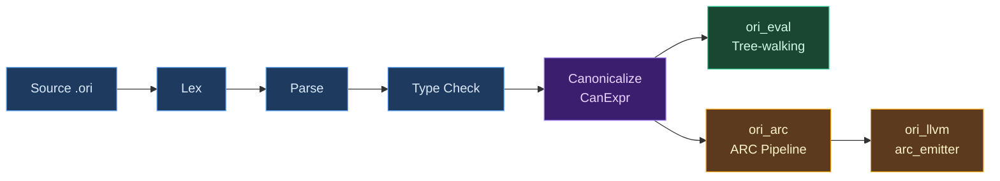
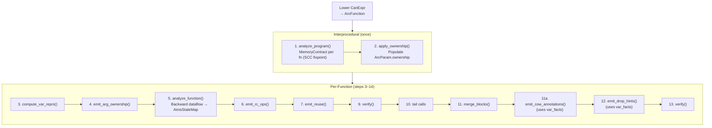
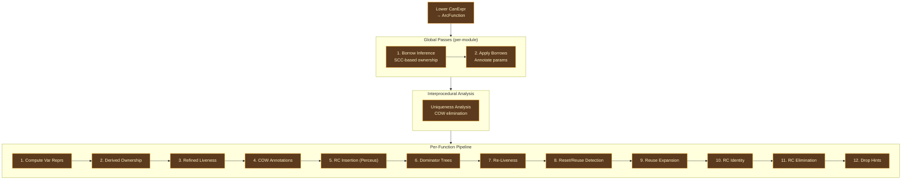

# ARC System Overview

## What Is Automatic Reference Counting?

Every programming language must answer a fundamental question: when a program allocates memory, who decides when to free it? The history of memory management is a history of different answers to this question, each with different tradeoffs between safety, performance, and programmer effort.

**Manual memory management** puts the burden on the programmer. C requires explicit `malloc` and `free` calls; the programmer tracks every allocation's lifetime and frees it at the right time. This gives maximum control and zero runtime overhead, but it is the single largest source of security vulnerabilities in software history — use-after-free, double-free, and memory leaks account for roughly 70% of critical bugs in large C and C++ codebases (Microsoft Security Response Center, 2019; Google Project Zero data).

**Tracing garbage collection** automates the problem by periodically scanning the heap to find unreachable objects and freeing them. Java, Go, Python (as a backup), JavaScript, Haskell (GHC), OCaml, and most managed languages use this approach. It eliminates use-after-free entirely, but introduces pause-time unpredictability (stop-the-world collectors), memory overhead (the collector needs headroom to operate efficiently), and throughput cost (typically 5-15% for generational collectors, more for concurrent ones). Languages with GC also tend to allocate more freely, since the cost of allocation is amortized across collection cycles.

**Ownership and borrowing** is Rust's answer: a static type system tracks which variable owns each allocation, and the compiler inserts `drop` calls at the end of each owner's scope. Borrows (`&T`, `&mut T`) allow temporary access without ownership transfer. This achieves manual-memory-management performance with compile-time safety, but it requires the programmer to think about lifetimes and satisfy the borrow checker — a significant learning curve and a constraint on program architecture (cyclic data structures, self-referential types, and certain patterns require `unsafe` or smart pointers).

**Reference counting** tracks how many references point to each allocation. When a reference is created, the count increments; when a reference is destroyed, it decrements; when the count reaches zero, the allocation is freed. Objective-C (manual retain/release), Swift (ARC), Python (primary collector), and Perl use this approach. Reference counting has deterministic destruction (objects are freed immediately when unreachable, not at the next GC pause), low memory overhead (no collector headroom), and predictable latency. But naive reference counting has three significant costs: every reference copy requires an atomic increment, every reference destruction requires an atomic decrement (often followed by a branch to check for zero), and cycles require a separate mechanism.

**Automatic Reference Counting (ARC)** is reference counting where the compiler — not the programmer — inserts the increment and decrement operations. The programmer writes code as if memory management doesn't exist; the compiler analyzes the program's data flow and places RC operations at precisely the right points. Swift popularized this term, but the concept predates it — Objective-C's ARC (introduced in 2011) was the first widely-deployed automatic RC system, and [Lean 4](https://github.com/leanprover/lean4)'s compiler (2020+) showed that aggressive RC optimization could make functional languages competitive with imperative ones.

### Where Ori Sits

Ori uses **value semantics** — every assignment is a logical copy, every variable owns its data, there is no shared mutable state. This is the programming model of pure functional languages and of Swift's value types. It is the simplest model for programmers to reason about: there are no aliasing bugs, no data races, no spooky action at a distance through shared references.

But value semantics, naively implemented, is catastrophically expensive. Every list push copies the entire list. Every struct update allocates a fresh struct. Every function call that passes a collection duplicates it. A language with value semantics needs an aggressive optimization pipeline to make it practical.

Ori's ARC system is that pipeline. It is a compiler pass (`ori_arc` crate) that transforms canonical IR into memory-managed code with explicit reference counting, then systematically eliminates the overhead that value semantics would normally impose. The pipeline is **backend-independent** — it has no LLVM dependency and produces an IR that any backend can consume. The LLVM backend's `arc_emitter` translates ARC IR to LLVM IR, but the ARC system itself knows nothing about LLVM.

ARC IR is the **sole codegen path** — all native code generation flows through ARC IR.

## What Makes Ori's ARC System Distinctive

### AIMS: Unified Memory Intelligence

> **Note:** The ARC system has two pipeline implementations. The **legacy pipeline** uses sequential passes (described below as "eight stacked optimizations"). The **AIMS pipeline** (`--features aims`) replaces these sequential passes with one unified memory-intelligence system. AIMS is the active development direction; the legacy pipeline will be removed once AIMS achieves full parity.

> AIMS is not Ori's ARC optimizer; AIMS is Ori's memory semantics made executable as one unified analysis and realization system.

**AIMS (ARC Intelligent Memory System)** is a single abstract interpreter over a 7-dimensional product lattice. It does not combine existing passes — it replaces them with dimensional facts that are all computed in one converging fixpoint:

| Legacy Concept | AIMS Replacement | Dimensions Used |
|---------------|-----------------|-----------------|
| Borrow inference | `AccessClass` + interprocedural `ParamContract` | access, consumption |
| Liveness analysis | `Cardinality` + `Consumption` | cardinality, consumption |
| Uniqueness analysis | `Uniqueness` (+ locality/cardinality proof) | uniqueness, locality, cardinality |
| Reuse eligibility | `ShapeClass` + `Uniqueness` + `Consumption` | shape, uniqueness, consumption |
| COW mode | Derived view of converged state | uniqueness, access, consumption |
| Drop hints | Derived view of converged state | uniqueness, shape |
| FIP certification | Derived view of `EffectClass` + allocation balance | effect, locality, shape |
| RC identity normalization | Eliminated — precise placement avoids need | access, cardinality |
| RC elimination | Eliminated — no redundant pairs to remove | consumption, cardinality |

The seven dimensions are:

1. **AccessClass** (`Borrowed` | `Owned`) — parameter ownership disposition
2. **Consumption** (`Dead` | `Borrowed` | `Owned` | `Linear`) — how a value is used
3. **Cardinality** (`Absent` | `Once` | `Many`) — demand count (backward)
4. **Uniqueness** (`Unique` | `MaybeShared`) — RC uniqueness proof
5. **Locality** (`BlockLocal` | `FunctionLocal` | `HeapEscaping` | `Unknown`) — escape scope
6. **ShapeClass** (`NonReusable` | `ReusableCtor(kind)` | `CollectionBuffer` | `ContextHole`) — reuse compatibility
7. **EffectClass** (`may_alloc` | `may_share` | `may_throw`) — function effect flags

The lattice join at control flow merge points combines all dimensions simultaneously, and per-instruction transfer functions update all dimensions in a single backward pass. Cross-dimension canonicalize rules enforce invariants (e.g., `BlockLocal + Owned + Once → Unique`). No dimension operates in isolation — each constrains or proves facts used by others.

COW, FIP, reuse, drop hints, and RC operations are not separate passes. They are projections — different views of the same converged lattice read during one realization step.

AIMS produces the same outputs as the legacy pipeline (RC operations, reuse tokens, COW annotations, drop hints) but with better optimization quality: **-75% RC operations on golden corpus programs, -70% on benchmarks** (measured 2026-03-11). See [AIMS Plan](../../../plans/aims/00-overview.md) for the full design.

### Eight Stacked Optimizations (Legacy Pipeline)

The legacy pipeline applies eight sequential optimization layers that compound on each other:

1. **Type classification** eliminates RC for half of all variables (scalars)
2. **Borrow inference** eliminates RC at call sites for read-only parameters
3. **Perceus insertion** places RC at precise last-use points (not scope boundaries)
4. **Reset/reuse** converts drop-then-allocate sequences into in-place reuse
5. **RC identity normalization** enables elimination across field projections
6. **RC elimination** removes canceling inc/dec pairs
7. **COW runtime** provides O(1) mutation for uniquely-owned collections
8. **Static uniqueness analysis** proves ownership at compile time, eliminating runtime checks

### Functional Semantics, Imperative Performance

The ARC system's goal is not just correctness — it is to make pure value semantics compile to the same machine code an imperative programmer would write by hand. A list map function that walks a linked list, pattern-matching each node and constructing a new one, should reuse every node allocation in-place. A loop that pushes elements onto a list should mutate the list's buffer directly, not copy it on every iteration. The programmer writes functional code; the compiler generates imperative performance.

### Backend Independence

The ARC pipeline produces `ArcFunction` values — basic-block IR with explicit RC operations, ownership annotations, and reuse tokens. This IR is consumed by `ori_llvm`'s `arc_emitter`, but the design deliberately keeps `ori_arc` free of any backend dependency. A future WASM backend, a cranelift backend, or even an interpreter that operates on ARC IR could consume the same output without modification.

### Interprocedural Analysis

Most RC optimizers work within a single function. Ori's borrow inference and uniqueness analysis are **interprocedural** — they analyze the entire module's call graph, decompose it into strongly connected components, and iterate to fixpoint. A function that only reads its list parameter gets that parameter marked as `Borrowed` across the entire program, eliminating RC operations at every call site. This is the difference between optimizing locally and optimizing globally.

## How the Pipeline Eliminates Each Cost

### 1. Type Classification — Skip RC for Value Types

Every type is classified as `Scalar` (int, bool, small structs — no heap pointer, no RC needed), `DefiniteRef` (str, collections, closures — always heap-allocated, always needs RC), or `PossibleRef` (unresolved generics — conservative fallback). Classification is monomorphized: `Option<int>` is Scalar (tag + int, no heap pointer), `Option<str>` is DefiniteRef. Roughly half of all variables in a typical program need zero RC operations.

See [ARC IR](arc-ir.md) for the classification system.

### 2. Borrow Inference — Eliminate RC at Call Sites

A global SCC-based fixed-point analysis classifies each function parameter as **Borrowed** (callee only reads it) or **Owned** (callee may store, return, or transfer it). Borrowed parameters skip RC entirely at the call site — no increment on call, no decrement on return. The result: `len(list)` borrows its argument, and the caller never touches the refcount. Without borrow inference, every `len()` call costs two atomic operations.

See [Borrow Inference](borrow-inference.md) for the algorithm.

### 3. Perceus RC Insertion — Place RC at Last-Use Points

Once ownership is known, RC operations are placed mechanically via backward liveness analysis. Each variable gets an `RcDec` at its last use and an `RcInc` at each additional use beyond the first. This is the [Perceus](https://www.microsoft.com/en-us/research/publication/perceus-garbage-free-reference-counting-with-reuse/) algorithm (Reinking et al., 2021), originally developed for the [Koka](https://github.com/koka-lang/koka) language. The precision matters because it sets up later passes — conservative placement would hide optimization opportunities.

See [RC Insertion](rc-insertion.md) for the Perceus algorithm.

### 4. Reset/Reuse — Turn Free+Alloc into In-Place Mutation

When an `RcDec` (about to free a value) is followed by a `Construct` of the same type (about to allocate), the pipeline replaces both with a reset/reuse pair. At runtime, if the old value is uniquely owned (RC == 1), the allocation is reused in-place — no free, no alloc, no copy. If shared (RC > 1), the slow path decrements and allocates fresh. This is what makes functional pattern matching competitive with imperative mutation.

See [Reset/Reuse](reset-reuse.md) for detection and expansion.

### 5. RC Identity Normalization — Enable Elimination Across Projections

When `v1 = Project(v0, field)`, both `v1` and `v0` share the same RC identity — incrementing `v1` is the same as incrementing `v0`. The identity pass normalizes all RC operations to target canonical roots, so `RcInc(v1)` followed by `RcDec(v0)` can be recognized as a canceling pair. Without this, struct field manipulation leaves orphaned RC operations.

### 6. RC Elimination — Remove Redundant Pairs

A bidirectional intra-block dataflow pass finds `RcInc(x)` / `RcDec(x)` pairs with no intervening use and removes both. Cross-block elimination handles pairs split across basic block boundaries along single-predecessor edges. The pass cascades until fixpoint — removing one pair can expose another.

See [RC Elimination](rc-elimination.md).

### 7. COW Collections — O(1) Mutation for Unique Owners

At runtime, every collection mutation (list push, map insert, set remove) checks `ori_rc_is_unique()`. If the collection has RC == 1, it mutates in-place. If shared (RC > 1), it copies the buffer and decrements the old ref. This is what makes value semantics practical for collections — without COW, `list.push(x)` in a loop is O(n^2).

See [Collections & COW](../11-runtime/collections-cow.md).

### 8. Static Uniqueness Analysis — Eliminate Runtime Checks

The final layer proves at compile time that certain values are uniquely owned, allowing codegen to emit only the fast path — no `IsShared` check, no branch, no slow-path code. The analysis uses a forward dataflow lattice (`Unique` / `MaybeShared` / `Shared`) with the key insight that COW operations always produce unique results.

## The Compounding Effect

Each technique handles a different dimension of the problem, and they multiply:

| Without | Cost | With | Residual |
|---------|------|------|----------|
| Classification | RC ops on ints, bools | Classification | Zero RC on ~50% of variables |
| Borrow inference | RC at every call site | + Borrow inference | Zero RC for read-only params |
| Precise insertion | RC at scope boundaries | + Perceus | RC only at true last-use |
| Reset/reuse | alloc+free per constructor | + Reset/reuse | In-place reuse when unique |
| RC elimination | Redundant inc/dec pairs | + Elimination | Minimal surviving RC ops |
| Identity normalization | Orphaned ops on projections | + Normalization | No leaked projection RC |
| COW runtime | O(n) per collection mutation | + COW | O(1) when unique |
| Static uniqueness | Branch per mutation | + Uniqueness | Branchless fast path |

The net result: a program written in pure value semantics — no mutation syntax, no ownership annotations, no lifetime parameters — compiles to code that mutates in-place, reuses allocations, skips RC on scalars and borrowed params, and eliminates branches on provably-unique values.

## Architecture

### Pipeline Position

The ARC system sits at the fork point between interpretation and native compilation. Both paths consume the same canonical IR; the ARC system is the entry point for the native code path:

### Pipeline Passes

Two pipeline implementations exist, selected at compile time by feature flag. Both produce the same IR format (`ArcFunction` with RC operations, reuse tokens, COW annotations, drop hints).

#### AIMS Pipeline (`--features aims`)

The AIMS pipeline replaces ~22 legacy steps with one analysis and one realization:

Key constraint: steps 11a–12 use `var_facts` (keyed by `ArcVarId`), not position-keyed state maps (invalidated by `merge_blocks()`).

#### Legacy Pipeline (default)

Each dependency is structural, not incidental:

- **Borrow inference** needs classification (to skip scalars)
- **RC insertion** needs borrow ownership (to skip borrowed params) and liveness (to find last-use points)
- **Reset/reuse** needs RC insertion (to find RcDec/Construct pairs)
- **Reuse expansion** needs detection (to know what to expand)
- **RC elimination** needs identity normalization (to match projected pairs)
- **Static uniqueness** needs COW paths (to prove results are unique)

### Entry Points

| Function | Purpose |
|----------|---------|
| `run_arc_pipeline()` | Single function — dispatches to AIMS or legacy based on feature flag |
| `run_arc_pipeline_all()` | Batch — dispatches to AIMS or legacy based on feature flag |
| `run_uniqueness_analysis()` | Interprocedural uniqueness — SCC-based fixpoint (legacy) |
| `aims::analyze_program()` | AIMS interprocedural — computes `MemoryContract` per function |
| `aims::analyze_function()` | AIMS intraprocedural — backward dataflow → `AimsStateMap` |

Consumers always use the `run_arc_pipeline*` entry points, never manual pass sequencing. The `aims::*` functions are called internally by the AIMS pipeline.

### Feature Flags

| Flag | Effect |
|------|--------|
| (default) | Legacy multi-pass pipeline |
| `aims` | AIMS unified lattice pipeline replaces legacy |
| `aims-shadow` | Implies `aims`; runs both pipelines and compares results (5 dimensions) |

## Prior Art

**[Lean 4](https://github.com/leanprover/lean4)** is the most direct influence on Ori's ARC system. Lean 4's compiler (described in [Counting Immutable Beans](https://arxiv.org/abs/1908.05647), Ullrich and de Moura, 2019) pioneered several techniques that Ori adopts: the three-way type classification (`isScalar` / `isDefiniteRef` / `isPossibleRef`), borrow inference for function parameters, reset/reuse for in-place allocation recycling, and the overall strategy of stacking RC optimizations into a pipeline. Lean's implementation lives in `src/Lean/Compiler/IR/RC.lean` (RC insertion), `Borrow.lean` (borrow inference), and `ExpandResetReuse.lean` (reuse expansion). Ori's pipeline follows Lean's pass ordering closely, with additions for COW collection optimization and static uniqueness analysis that Lean does not perform.

**[Koka](https://github.com/koka-lang/koka)** contributed the [Perceus](https://www.microsoft.com/en-us/research/publication/perceus-garbage-free-reference-counting-with-reuse/) algorithm (Reinking, Xie, de Moura, Leijen, 2021) — the precise, liveness-based RC insertion strategy that Ori uses. Koka also introduced [FBIP](https://www.microsoft.com/en-us/research/publication/fp2-fully-in-place-functional-programming/) (Functional But In-Place, Lorenzen, Leijen, et al., 2023) — the idea that functional programs can be analyzed to determine whether all allocations are reusable, enabling guaranteed in-place mutation. Ori implements FBIP checking as a diagnostic pass (`fbip/`) that verifies reuse goals were achieved. Koka's borrow analysis (`src/Core/Borrowed.hs`) and FBIP checker (`src/Core/CheckFBIP.hs`) are reference implementations.

**[Swift](https://github.com/swiftlang/swift)** popularized ARC as a mainstream language feature and developed sophisticated ARC optimization passes in its SIL (Swift Intermediate Language) optimizer. Swift's approach differs from Ori's: Swift uses bidirectional dataflow analysis to find matching retain/release pairs (`lib/SILOptimizer/ARC/`), while Ori uses Perceus-style liveness-based insertion followed by elimination. Swift also does not perform borrow inference at the IR level — Swift's ownership model is expressed in the source language through move semantics and borrowing annotations, while Ori infers ownership automatically.

**[Rust](https://github.com/rust-lang/rust)** solves the same problem through a fundamentally different mechanism: ownership and borrowing are part of the type system, enforced by the borrow checker. Rust never uses reference counting for owned values (only for explicitly opt-in `Rc<T>` / `Arc<T>`). The tradeoff is well-known: Rust gets zero-overhead memory management, but programmers must satisfy the borrow checker. Ori chooses the opposite point in the design space — no borrow checker, no lifetime annotations, with the compiler inferring where RC operations can be eliminated.

**[CPython](https://github.com/python/cpython)** uses naive reference counting with a cycle collector backup. Every reference copy increments, every destruction decrements, with no compile-time optimization. This is the baseline that illustrates why optimization matters — CPython's RC overhead is substantial, and its cycle collector adds GC pauses on top of it. Ori's pipeline represents the opposite extreme: aggressive compile-time analysis to minimize the runtime RC operations that CPython performs unconditionally.

## Design Tradeoffs

**ARC vs tracing GC.** Ori chose ARC over tracing garbage collection for three reasons: deterministic destruction (values are freed immediately when their last reference disappears, enabling predictable resource cleanup), low latency (no stop-the-world pauses), and compatibility with value semantics (the RC provides a natural uniqueness check for COW optimization). The cost is that ARC cannot collect reference cycles — Ori's value semantics and lack of shared mutable references prevent cycles in normal code, but future features (e.g., graph data structures) may need a cycle-breaking mechanism.

**ARC vs ownership types.** Ori chose ARC over Rust-style ownership and borrowing to reduce programmer burden. The tradeoff is that ARC has runtime overhead (atomic increment/decrement operations on reference counts) where Rust has zero, and ARC requires a more complex compiler pipeline. Ori's position is that the optimization pipeline can eliminate enough overhead to make the difference negligible for most programs, while providing a simpler programming model.

**Interprocedural vs local analysis.** Borrow inference and uniqueness analysis are interprocedural — they analyze the entire module. This produces better results (more parameters marked as Borrowed, more values proven Unique) but has higher compile-time cost and implementation complexity. A per-function analysis would be simpler but would miss cross-function optimization opportunities. The interprocedural approach is justified because borrow inference convergence is fast in practice (SCC decomposition bounds the iteration count), and the RC elimination it enables is worth the compile-time cost.

**Backend-independent ARC IR vs backend-specific optimization.** The ARC pipeline produces backend-independent IR, which means backend-specific optimizations (like LLVM's own dead-code elimination or constant propagation) cannot feed back into ARC decisions. The alternative — embedding ARC decisions in the backend — would enable more aggressive optimization but would duplicate the pipeline for each backend. Backend independence was chosen because Ori targets multiple backends (LLVM for native, WASM in the future), and the ARC optimizations are algorithmic (dataflow-based) rather than target-specific.

**Perceus vs scope-based RC.** Most ARC implementations insert RC at scope boundaries — increment when entering a scope, decrement when leaving. Perceus inserts at the precise point of last use, which is more aggressive but requires liveness analysis. The benefit is that later passes (reset/reuse, elimination) have more information to work with. The cost is an extra analysis pass and more complex insertion logic.

## Debugging

| Tool | Command |
|------|---------|
| **Tracing** | `ORI_LOG=ori_arc=debug ori build file.ori` |
| **Verbose tracing** | `ORI_LOG=ori_arc=trace ORI_LOG_TREE=1 ori build file.ori` |
| **ARC IR dump** | `ORI_DUMP_AFTER_ARC=1 ori build file.ori` |
| **RC trace (runtime)** | `ORI_TRACE_RC=1 ./binary` |
| **Leak check** | `ORI_CHECK_LEAKS=1 ./binary` |
| **RC balance** | `diagnostics/rc-stats.sh file.ori` |
| **Codegen audit** | `diagnostics/codegen-audit.sh --strict file.ori` |
| **Full diagnosis** | `diagnostics/diagnose-aot.sh --valgrind file.ori` |
| **Interpreter vs AOT** | `diagnostics/dual-exec-debug.sh file.ori` |

## Related Documents

- [ARC IR](arc-ir.md) — IR definitions, type classification, value representations
- [Lowering](lowering.md) — CanExpr to ARC IR conversion
- [Borrow Inference](borrow-inference.md) — Global ownership inference (legacy)
- [Liveness](liveness.md) — Backward dataflow analysis (legacy)
- [RC Insertion](rc-insertion.md) — Perceus algorithm (legacy)
- [Reset/Reuse](reset-reuse.md) — In-place constructor reuse (legacy)
- [RC Elimination](rc-elimination.md) — Redundant pair removal (legacy)
- [Drop Descriptors](drop-descriptors.md) — Per-type drop generation
- [Decision Trees](decision-trees.md) — Pattern compilation in ARC IR
- [ARC Emitter](../10-llvm-backend/arc-emitter.md) — ARC IR to LLVM IR translation
- [Runtime RC](../11-runtime/reference-counting.md) — Runtime RC implementation
- [AIMS Plan](../../../plans/aims/00-overview.md) — AIMS implementation plan (Sections 01–11)
