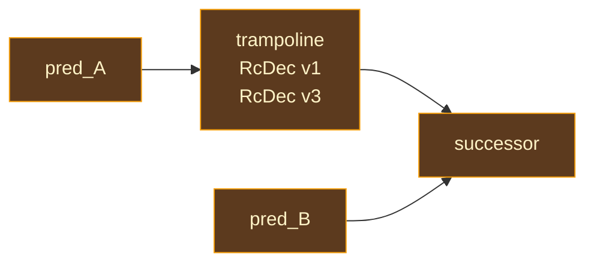

# RC Insertion

## The Placement Problem

Given a program with reference-counted values, where exactly should increment and decrement operations go? This is the RC placement problem, and there are several approaches with different tradeoffs:

**Scope-based placement** is the simplest: increment when a variable enters scope, decrement when it leaves. This is what Objective-C's manual retain/release and early Swift implementations did. It is correct but wasteful — a variable that is used once at the top of a long function holds its refcount for the entire scope, even though it could be freed immediately after its single use.

**Eager placement** inserts an increment at every reference creation and a decrement at every reference destruction. This is what CPython does. It is precise in one sense (every reference is tracked) but generates enormous numbers of RC operations, most of which cancel out.

**Liveness-based placement** is the approach developed for the [Perceus](https://www.microsoft.com/en-us/research/publication/perceus-garbage-free-reference-counting-with-reuse/) algorithm (Reinking, Xie, de Moura, Leijen, 2021): decrement at the precise point of **last use** (when the variable transitions from live to dead), and increment only when a variable is used **more than once** (to keep it alive past the first consumption). This produces the minimum number of RC operations for a given ownership assignment.

Ori uses Perceus-style liveness-based RC insertion. The pass transforms ARC IR functions in-place, inserting `RcInc` and `RcDec` instructions that the LLVM backend later lowers to runtime calls.

## The Perceus Algorithm

The algorithm processes each basic block with a backward scan, maintaining a running set of live variables initialized from `live_out`. The backward direction is natural: to determine whether a use is the last one, you need to know what future uses exist, which means scanning from the end toward the beginning.

### Step 1: Terminator Uses

Variables used in the terminator that are already in the live set get `RcInc` — they must survive past the terminator into successor blocks, so the extra reference is needed. New uses are added to the live set.

Special cases:
- **Return**: The returned variable occupies an owned position. Borrowed parameters and borrowed-derived variables at return positions get `RcInc` to transfer ownership to the caller.
- **Invoke**: Per-argument ownership is read from the pre-computed `arg_ownership` field. Borrowing arguments are added to `live` but skip `RcInc` — the callee borrows without consuming.

### Step 2: Instruction Backward Pass

For each instruction in reverse order:

**Definitions**: If the defined variable (`dst`) is not in the live set, it is dead immediately — emit `RcDec` after the definition. Otherwise, remove it from the live set (its definition satisfies its liveness).

**Borrowing uses** (PrimOps, scalar projections, all-borrowed Apply): The operation reads its arguments without consuming them. Arguments not in the live set are at their last use — emit `RcDec` after the borrowing operation. Arguments already in the live set need no `RcInc`.

**Consuming uses** (Construct, PartialApply, Apply with owned args, ApplyIndirect): The operation takes ownership of its arguments. If an argument is already in the live set, emit `RcInc` (the value must survive past this consumption). Duplicate arguments in the same instruction get exactly one `RcInc` for the second occurrence.

### Step 3: Block and Function Parameters

After processing the body, any block parameter not in the live set gets `RcDec` (unused parameter — passed but never read). For the entry block, function parameters with `Ownership::Owned` that are not in the live set also get `RcDec`.

### Invoke Dst Definitions

Invoke `dst` variables defined at a block's entry (via predecessor Invoke terminators) are treated like block parameters: if not in the live set, they get `RcDec`.

## Borrowed Parameter Handling

Borrowed parameters receive special treatment that is central to the Perceus algorithm's effectiveness:

- **Borrowed params** skip all RC tracking — no `RcInc`, no `RcDec`, not added to the live set. The only exception is at `Return`: returning a borrowed param transfers ownership to the caller, requiring `RcInc`.

- **Borrowed-derived variables** (projections or aliases of borrowed params) skip normal RC tracking but get `RcInc` at **owned positions** — places where the value will be stored on the heap:
  - `Construct` arguments
  - `PartialApply` captures (unless the capture is at a borrowed callee position and the closure does not escape)
  - `Apply`/`ApplyIndirect` arguments at owned positions
  - `Return` values

### Closure Capture Optimization

When `PartialApply` captures a borrowed-derived variable, the normal rule requires `RcInc` (the closure stores the value). But this can be safely skipped when both conditions hold:

1. The callee expects the corresponding parameter as `Borrowed`
2. The closure does not escape the current block (`dst` is not in `live_out`)

In this case, the captured value remains alive through its borrow root. This follows [Lean 4](https://github.com/leanprover/lean4)'s `Borrow.lean` pattern for closure captures.

## Borrowing vs Consuming Classification

The algorithm must classify each instruction by how it uses its arguments:

| Classification | Instructions | Behavior |
|---------------|-------------|----------|
| Borrowing | PrimOps, scalar projections, all-borrowed Apply | Read without consuming; last-use gets `RcDec` |
| Consuming | Construct, PartialApply, owned Apply/Invoke, ApplyIndirect | Take ownership; multi-use gets `RcInc` |

One notable exception: `Binary(Add)` on list-typed operands is classified as consuming (COW list concatenation), not borrowing.

## Edge Cleanup

After per-block RC insertion, variables that are live at a predecessor's exit but not live at a successor's entry create "edge gaps" — they need `RcDec` at the transition. Three cases arise:

**Single-predecessor blocks**: `RcDec` instructions are prepended to the successor block's body.

**Multi-predecessor with identical gaps**: All predecessors strand the same variables. `RcDec` is prepended to the successor block.

**Multi-predecessor with differing gaps**: Different predecessors strand different variables. A **trampoline block** (critical edge splitting) is created for each edge that needs cleanup:

If the successor has block parameters, the trampoline accepts and forwards them so the edge split is transparent.

## External Invoke Cleanup

A companion post-pass handles `Invoke` terminators with borrowing arguments. The main Perceus pass keeps borrowing args alive through the call (adds to `live`, skips `RcInc`). The cleanup pass inserts `RcDec` at the start of the normal successor block for borrowing args whose last use is the Invoke — args still needed later are decremented at their actual last-use point by the normal Perceus logic.

This pass uses the **original** (pre-RC-insertion) liveness data, which correctly reflects user-code liveness without RC operation interference.

## RcStrategy Assignment

Each `RcInc` and `RcDec` instruction carries an `RcStrategy` that tells the LLVM backend exactly how to emit the operation. The strategy is computed from `ValueRepr` during RC insertion and embedded in the instruction — the LLVM emitter pattern-matches directly without any Pool queries.

| Strategy | What It Does |
|----------|-------------|
| `HeapPointer` | Direct `ori_rc_inc`/`ori_rc_dec` on the pointer |
| `FatPointer` | Extract data pointer from field 1, then inc/dec |
| `Closure` | Extract env_ptr, null-check (bare functions have no env), then inc/dec |
| `AggregateFields` | Traverse RC fields recursively |
| `InlineEnum` | Tag-switch, per-variant field handling |

## Prior Art

**[Koka](https://github.com/koka-lang/koka)** and the [Perceus paper](https://www.microsoft.com/en-us/research/publication/perceus-garbage-free-reference-counting-with-reuse/) (Reinking et al., 2021) are the direct source. The paper formalizes the liveness-based RC insertion algorithm and proves that it produces the minimum number of RC operations for a given ownership assignment. Ori implements the algorithm as described, with extensions for borrowed-derived variables and closure capture optimization.

**[Lean 4](https://github.com/leanprover/lean4)** (`src/Lean/Compiler/IR/RC.lean`) implements a similar liveness-based RC insertion. Lean's version predates the Perceus paper and was developed independently by Ullrich and de Moura (2019). The algorithms are functionally equivalent — both use backward liveness to place RC at last-use points.

**[Swift](https://github.com/swiftlang/swift)** (`lib/SILOptimizer/ARC/`) takes a different approach: Swift inserts RC eagerly during SILGen and then optimizes them away using bidirectional dataflow analysis. This is the opposite strategy — "insert liberally, eliminate aggressively" vs Perceus's "insert precisely from the start." Swift's approach works well for Swift's ownership model but generates more intermediate work for the optimizer.

## Design Tradeoffs

**Precise insertion vs liberal-then-eliminate.** Perceus inserts RC at the minimum points determined by liveness, while Swift inserts eagerly and eliminates redundancies. Perceus produces better initial results but makes the insertion pass more complex. Ori chose Perceus because the downstream passes (reset/reuse, RC elimination) benefit from starting with a minimal set — there is less noise to filter through.

**Backward walk with reverse.** The algorithm builds the new instruction body in reverse during the backward walk, then reverses at the end. The alternative (forward walk with lookahead) would avoid the reverse but require computing "next use" information, which is essentially liveness by another name. The backward walk is cleaner.

**Classification at insertion time.** The borrowing vs consuming classification is computed during RC insertion rather than being pre-computed. This means the classification logic is co-located with the insertion code, making it easier to understand and modify. The tradeoff is that the classification runs for every instruction — pre-computing would avoid repeated work for instructions that appear in multiple contexts (e.g., `Apply` in both borrowing and consuming modes).
