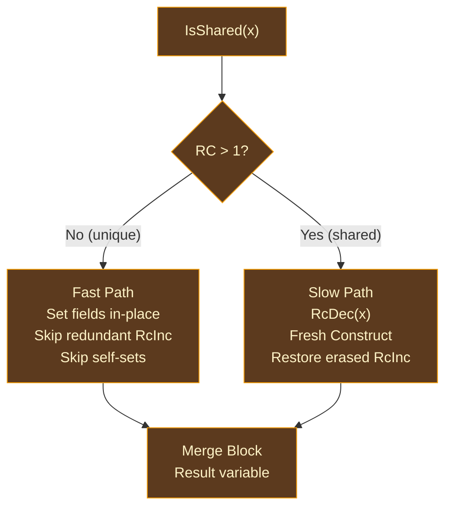

# Reset/Reuse

## The Allocation Problem in Functional Programming

Functional programs have a distinctive allocation pattern: they deconstruct values and immediately construct new ones. A list map walks a linked list, pattern-matching each node into its head and tail, applying a function to the head, and constructing a new node with the transformed value. Each iteration drops an old node (free) and allocates a new one (malloc) of exactly the same type and size.

This pattern is ubiquitous — it appears in every map, filter, fold, and recursive transformation. And it is wasteful: the free and malloc cancel out. The old node's memory is returned to the allocator, and then the allocator immediately hands back a block of the same size. If the old node is **uniquely owned** (reference count == 1), its memory could be reused directly — no free, no malloc, no allocator involvement at all.

This insight was formalized independently by two research groups. [Ullrich and de Moura](https://arxiv.org/abs/1908.05647) (2019) described the "reset/reuse" optimization for [Lean 4](https://github.com/leanprover/lean4), where a value about to be freed is "reset" (its fields cleared) and then "reused" as the allocation for a new value of the same type. [Reinking, Xie, de Moura, and Leijen](https://www.microsoft.com/en-us/research/publication/perceus-garbage-free-reference-counting-with-reuse/) (2021) extended this into the [Perceus](https://www.microsoft.com/en-us/research/publication/perceus-garbage-free-reference-counting-with-reuse/) framework for [Koka](https://github.com/koka-lang/koka), adding the concept of **FBIP** (Functional But In-Place) — programs that achieve complete reuse, where every allocation is recycled from a previous deallocation.

Ori implements both reset/reuse detection and FBIP diagnostics as part of its ARC pipeline.

## The Two-Phase Approach

The transformation proceeds in two phases:

1. **Detection** — identify `RcDec`/`Construct` pairs that can be linked, and replace them with intermediate `Reset`/`Reuse` instructions
2. **Expansion** — lower each `Reset`/`Reuse` pair into conditional fast/slow paths with `IsShared` guards

After expansion, no `Reset` or `Reuse` instructions remain in the IR. They are fully replaced by `IsShared` checks, branches, and concrete `Set`/`Construct` instructions.

## Detection

Detection operates at two granularities: within a single basic block (the common case) and across block boundaries (for recursive patterns).

### Intra-Block Detection

The common case. A forward scan through each basic block looks for `RcDec`/`Construct` pairs:

1. Find an `RcDec { var: x }` at position `i`
2. Look ahead for a matching `Construct { dst, ty, ctor, args }` at position `j`
3. Verify all constraints (see below)
4. If valid, replace: `RcDec` → `Reset { var: x, token: t }`, `Construct` → `Reuse { token: t, dst, ty, ctor, args }`
5. Continue scanning from `j+1`

The forward scan finds the nearest eligible `Construct`, minimizing the live range of the reuse token.

### Cross-Block Detection

For patterns where the decrement and construction occur in different blocks — the canonical example being a recursive function that decrements a list node in one block and constructs a replacement in a dominated block.

The algorithm uses three analyses:

- **Dominator tree**: The block containing the `RcDec` must dominate the block containing the `Construct`, ensuring the reuse token is available on all paths reaching the construction.
- **Refined liveness**: The decremented variable must be `live_for_drop` (not `live_for_use`) in all intermediate blocks. If any path reads the variable, reuse is unsafe.
- **Post-dominator tree**: The `Construct` block must post-dominate the `Reset` block within the relevant subgraph, ensuring the token is always consumed.

### Constraints

A pairing is only valid when all of the following hold:

| Constraint | Reason |
|-----------|--------|
| **Type match** | The old allocation's size and layout must be compatible with the new value. Conservative structural equality — no subtyping or coercion. |
| **No intervening use** | The decremented variable `x` must not be read between positions `i` and `j`. Reading a value whose refcount has been decremented is unsound. |
| **Needs RC** | The type must be heap-allocated. Stack values have no allocation to reuse. |
| **Not a collection** | Collections (lists, maps, sets) use buffer allocations whose size depends on capacity, not element count. Constructor-level reuse is not meaningful for them. |

### The Reuse Token

The `Reset` instruction produces a **reuse token** — a fresh `ArcVarId` that represents the potential to reuse an allocation. The token has no runtime representation; it is a compile-time artifact linking the `Reset` to the `Reuse`. It is consumed during expansion and does not appear in the final IR.

```
Before:                                 After:
  RcDec { var: x }                        Reset { var: x, token: t }
  ...                                     ...
  Construct { dst: y, ty: T, args }       Reuse { token: t, dst: y, ty: T, args }
```

## Expansion

Expansion lowers each `Reset`/`Reuse` pair into a conditional structure with fast and slow paths:



### Expansion Steps

For each `Reset`/`Reuse` pair:

1. **Analyze projections**: Scan instructions before the `Reset` to find `Project { src: x }` instructions that extract fields from the value being reset. Build a projection map recording which fields have been projected and into which variables.

2. **Projection-increment erasure**: Identify `RcInc` instructions on projected field variables between the `Reset` and `Reuse`. On the fast path, these are redundant — projected fields of a unique parent are implicitly owned (RC is 1, so the parent exclusively owns its fields). Mark these increments for erasure on the fast path only.

3. **Generate IsShared check**: Emit `IsShared { var: x }` testing whether the refcount exceeds 1.

4. **Fast path (unique, RC == 1)**: The allocation is reused in place:
   - For each constructor argument, emit `Set { base: x, field: i, value: arg }` to write the new field value directly into the existing allocation
   - Apply self-set elimination (see below)
   - Omit erased `RcInc` instructions
   - The result variable points to the same allocation as `x`

5. **Slow path (shared, RC > 1)**: The value is shared and cannot be reused:
   - Emit `RcDec { var: x }` to release this reference
   - Emit a fresh `Construct` to allocate a new value
   - Restore any `RcInc` instructions that were erased on the fast path

6. **Merge block**: A join block receives the result from whichever path was taken.

### Projection-Increment Erasure

When the fast path reuses a unique allocation, fields projected out before the `Reset` are implicitly retained — the parent's refcount is 1, meaning it exclusively owns its fields. Incrementing a projected field's refcount before storing it into a sibling slot is unnecessary on this path.

The erased increments are recorded and restored on the slow path, where the original value is shared and projected fields need proper refcount management.

This is particularly effective for record update patterns that pass most fields through unchanged — only the changed field incurs any work on the fast path.

### Self-Set Elimination

A `Set` instruction that writes a value back to the same field it was projected from is a no-op:

```
v = Project { src: x, field: 2 }
Set { base: x, field: 2, value: v }   // eliminated — writes v back where it came from
```

This arises naturally when a match expression deconstructs a value, transforms one field, and reconstructs the same variant with the other fields unchanged. Self-set elimination avoids the redundant store — common in record update patterns like `{ ...point, x: new_x }`.

## Collection Recycling

A separate optimization handles collection buffer reuse. When a list or set is decremented and a new empty collection of the same type is constructed, the `CollectionReuse` instruction recycles the old collection's buffer:

- **Fast path (unique)**: Clear the collection's contents and reset its length to 0, but keep the allocated buffer. The new collection starts with the old capacity — no reallocation needed.
- **Slow path (shared)**: Decrement the old collection and allocate a fresh empty one.

This optimization specifically targets loop patterns like `for x in list yield f(x)`, where the result list often ends up with the same length as the source list.

## FBIP Diagnostics

**Functional But In-Place** (FBIP) is a diagnostic concept from [Koka](https://github.com/koka-lang/koka) ([Lorenzen, Leijen, et al., 2023](https://www.microsoft.com/en-us/research/publication/fp2-fully-in-place-functional-programming/)). A function is FBIP if all of its allocation sites are covered by reuse — every `Construct` is paired with a `Reset`, meaning no net allocation occurs on the fast path.

Ori implements FBIP checking as a read-only diagnostic pass:

- **Achieved reuse**: `Reset`/`Reuse` pairs successfully detected. Reports the source location, type, and constructor.
- **Missed reuse**: `RcDec` and `Construct` of the same type exist in proximity but could not be paired. Reports the failure reason (intervening use, type mismatch, collection constructor).

Functions annotated with `#fbip` are verified by the `check_fbip_enforcement()` pass — if any allocation site is not covered by reuse, a diagnostic is emitted. Functions where all COW operations are provably `StaticUnique` are detected by `is_auto_fbip()` as automatically FBIP without annotation.

FBIP diagnostics are emitted with the `ORI_DUMP_AFTER_ARC=1` flag.

## Prior Art

**[Lean 4](https://github.com/leanprover/lean4)** (`src/Lean/Compiler/IR/ExpandResetReuse.lean`) is the direct inspiration. Lean pioneered the token-based reset/reuse pattern: `Reset` marks a value for potential reuse, `Reuse` constructs using the token's memory, and expansion generates the `IsShared` conditional. Ori's implementation follows Lean's design closely, with additions for cross-block detection (Lean's version is intra-block only), projection-increment erasure, self-set elimination, and collection recycling.

**[Koka](https://github.com/koka-lang/koka)** and the [Perceus paper](https://www.microsoft.com/en-us/research/publication/perceus-garbage-free-reference-counting-with-reuse/) formalize reuse as part of the Perceus framework and introduce the FBIP concept. Koka's implementation focuses on proving that functional programs can achieve in-place mutation through careful reuse analysis. The [FP2 paper](https://www.microsoft.com/en-us/research/publication/fp2-fully-in-place-functional-programming/) (2023) extends this with fully in-place functional programming, where the compiler guarantees zero net allocation for qualifying functions.

**[Swift](https://github.com/swiftlang/swift)** (`lib/SILOptimizer/ARC/`) uses a related but different optimization for COW containers: Swift's `isKnownUniquelyReferenced` check enables in-place mutation of copy-on-write collections. This is a runtime check similar to Ori's `IsShared`, but Swift applies it at the collection API level rather than at the constructor level.

## Design Tradeoffs

**Detection then expansion vs direct emission.** Ori separates detection (producing `Reset`/`Reuse` intermediates) from expansion (lowering to `IsShared` + branches). The alternative — emitting the conditional structure directly during detection — would avoid the intermediate instructions but would make the detection pass much more complex (it would need to manage block splitting, phi nodes, and projection analysis simultaneously). The two-phase approach keeps each phase focused.

**Conservative type matching.** Reuse requires exact type equality, not structural compatibility. A `Point { x: int, y: int }` cannot be reused for a `Vec2 { x: int, y: int }` even though they have identical layout. This is conservative but safe — relaxing the constraint would require layout analysis that does not yet exist.

**Collection exclusion.** Collections are excluded from constructor-level reuse because their buffer size depends on capacity, not element count. A list with capacity 100 and length 3 cannot be reused for a list with capacity 4 and length 4. Collection recycling handles the buffer-level optimization separately.

**Cross-block detection complexity.** Cross-block reuse requires dominator and post-dominator trees plus refined liveness, adding significant complexity. The benefit — catching recursive patterns like list map — justifies this because recursive transformations are among the most allocation-intensive patterns in functional programs.
