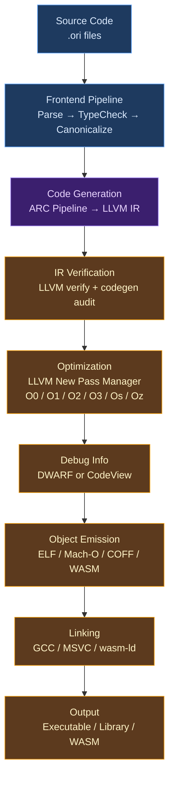

# AOT Compilation

## What Is Ahead-of-Time Compilation?

When a programmer writes `ori build main.ori`, they expect an executable — a file they can run on their machine without the compiler present, without a runtime environment, without an interpreter. The program should start instantly, run at native speed, and behave identically to the interpreted version. Producing that executable is the job of the AOT (Ahead-of-Time) compilation system.

AOT compilation is distinguished from JIT (Just-in-Time) compilation by *when* translation happens. A JIT compiler translates code during execution — the program starts in an interpreted or partially compiled state, and hot paths are compiled to native code as they run. Java's HotSpot, JavaScript's V8, and .NET's RyuJIT work this way. An AOT compiler translates the entire program before execution — the output is a native binary that runs directly on the CPU with no runtime compilation step.

The tradeoff is startup time versus peak performance. JIT compilers can optimize based on runtime profiling data (which branches are actually taken, which types actually appear), but they pay compilation cost during execution. AOT compilers pay compilation cost upfront and cannot adapt to runtime behavior, but they eliminate startup latency and enable whole-program optimizations that JIT compilers cannot afford.

### What Goes Into Building a Native Executable

Producing an executable from source code involves several stages beyond code generation, each with its own design decisions:

**Target configuration** determines what kind of machine the code will run on — the CPU architecture (x86-64, AArch64, RISC-V), the operating system (Linux, macOS, Windows), the ABI (System V, Windows x64), and the available CPU features (AVX2, NEON). Each combination requires different instruction selection, calling conventions, and memory layout.

**Object file emission** translates the in-memory LLVM IR into a platform-specific binary format — ELF on Linux, Mach-O on macOS, COFF on Windows, or WASM for WebAssembly. Object files contain machine code and data, but they are not yet executable — they contain unresolved references to functions in other files and libraries.

**Symbol mangling** gives every function and global a unique name in the object file's symbol table. Languages with modules, generics, traits, and method overloading need a mangling scheme that encodes enough information to distinguish `math.add` from `http.add`, `int::Eq.equals` from `str::Eq.equals`, and `identity<int>` from `identity<str>`.

**Optimization** runs LLVM's pass pipeline to transform the code — inlining functions, eliminating dead code, hoisting loop-invariant computations, vectorizing loops, propagating constants. The optimization level (O0 through O3, Os, Oz) determines which passes run and how aggressively.

**Debug information** embeds source-level metadata (file names, line numbers, variable names, type descriptions) into the binary so that debuggers like GDB, LLDB, and Visual Studio can map machine instructions back to source code.

**Linking** resolves symbol references between object files and libraries, combining everything into a single executable. The linker finds `ori_print` in `libori_rt.a`, `printf` in libc, and the program's own functions across compilation units, then arranges everything into the final binary layout.

**Runtime library discovery** locates the Ori runtime (`libori_rt.a`), which provides heap allocation, reference counting, string operations, collection mutations, and panic handling — operations too complex for inline LLVM IR.

## What Makes Ori's AOT System Distinctive

### Shared Pipeline, Different Outputs

Many compilers have separate code paths for interpreted and compiled execution. Ori's AOT system shares the exact same codegen pipeline as the JIT path — the LLVM module produced by `FunctionCompiler` and `ArcIrEmitter` is identical whether it will be executed in-process or written to an object file. The divergence happens only at the final step: JIT creates an `ExecutionEngine` and calls functions directly, while AOT runs optimization passes, emits an object file, and invokes a linker.

This shared-pipeline design means that a program compiled with `ori build` produces exactly the same code as one tested with the LLVM JIT. Bugs found in one path are bugs in the other. There is no "works in development but breaks in production" divergence caused by different codegen logic.

### Executable-Relative Runtime Discovery

Most language compilers find their runtime libraries through environment variables (`JAVA_HOME`, `GOROOT`, `RUSTUP_HOME`) or configuration files. Ori follows [rustc](https://github.com/rust-lang/rust)'s sysroot pattern — walking up from the compiler binary's location rather than relying on environment state. This makes builds reproducible regardless of shell configuration, PATH ordering, or environment variable pollution. The `--runtime-path` flag provides an explicit override when the automatic discovery is insufficient.

### Platform-Agnostic Linker Abstraction

Rather than invoking a specific linker directly, Ori uses a `LinkerDriver` abstraction with platform-specific implementations. On Linux and macOS, it delegates to `cc` or `clang` as a wrapper (letting the C compiler handle CRT linking and library search paths). On Windows, it invokes `link.exe` directly. For WebAssembly, it uses `wasm-ld`. This abstraction isolates platform-specific linking details (macOS's `-dynamiclib`, Windows COFF relocation models, WASM memory configuration) from the rest of the pipeline.

## The AOT Pipeline

The AOT pipeline extends the shared codegen pipeline with target-specific stages:



The pipeline flows from left to right with no backtracking. Each stage produces a well-defined output that the next stage consumes. The `check_source()` function handles the front-end pipeline (parse through canonicalization), returning the typed and canonicalized program or `None` if errors occurred. The AOT-specific stages — optimization, debug info, object emission, and linking — only proceed if the front-end succeeds.

## Target Configuration

The `TargetConfig` struct encapsulates everything LLVM needs to know about the compilation target: the target triple, CPU name, CPU features, optimization level, relocation mode, and code model.

### Supported Targets

| Target Triple | Architecture | OS | Notes |
|---------------|-------------|-----|-------|
| `x86_64-unknown-linux-gnu` | x86-64 | Linux (glibc) | Default on Linux x86-64 |
| `x86_64-unknown-linux-musl` | x86-64 | Linux (musl) | Static linking, no glibc dependency |
| `x86_64-apple-darwin` | x86-64 | macOS (Intel) | Requires macOS SDK |
| `aarch64-apple-darwin` | AArch64 | macOS (Apple Silicon) | Default on Apple Silicon Macs |
| `x86_64-pc-windows-msvc` | x86-64 | Windows (MSVC) | Requires Visual Studio |
| `x86_64-pc-windows-gnu` | x86-64 | Windows (MinGW) | GCC-compatible toolchain |
| `wasm32-unknown-unknown` | WASM | Standalone | No OS, no WASI |
| `wasm32-wasi` | WASM | WASI | File system, stdout, args |

Target initialization uses `Once` guards per architecture family to ensure LLVM's target-specific code generators are initialized exactly once, even in multi-threaded compilation. On Linux, position-independent code (PIC) is enabled by default to support Position-Independent Executables (PIE) — a security hardening measure that enables Address Space Layout Randomization (ASLR).

The `TargetTripleComponents` struct parses the triple into its constituent parts (architecture, vendor, OS, environment), providing predicate methods (`is_wasm()`, `is_windows()`, `is_linux()`, `family()`) for platform-specific branching throughout the pipeline.

## Symbol Mangling

Every function, method, and global in an Ori program needs a unique symbol name in the object file. The mangling scheme must handle modules, trait implementations, extensions, generics, and associated functions while remaining human-readable for debugging.

### Mangling Format

```
_ori_[<module>$]<entity>[<suffix>]
```

The `_ori_` prefix identifies Ori symbols in the global namespace. Module paths use `$` as a separator (replacing `/`, `\`, `.`, and `:`). Alphanumeric characters and `_` pass through unchanged; other characters use named or hex escapes.

### Examples

| Ori Symbol | Mangled Name | Rule |
|------------|--------------|------|
| `@main` (root module) | `_ori_main` | No module prefix |
| `math.@add` | `_ori_math$add` | Module path with `$` separator |
| `http/client.@connect` | `_ori_http$client$connect` | Nested module path |
| `int::Eq.@equals` | `_ori_int$$Eq$equals` | Trait impl: `$$` separator |
| `Option.@some` | `_ori_Option$A$some` | Associated function: `$A$` marker |
| `identity<int>` | `_ori_identity$Gint` | Generic instantiation: `$G` prefix |
| `[int].sum` (extension) | `_ori_$LBint$RB$$ext$sum` | Extension: `$$ext$` marker |

### Special Markers

| Marker | Purpose | Example |
|--------|---------|---------|
| `$$` | Trait implementation boundary | `int$$Eq$equals` |
| `$$ext$` | Extension method | `str$$ext$utils$to_upper` |
| `$A$` | Associated function | `Option$A$some` |
| `$G` | Generic instantiation suffix | `identity$Gint` |

### Escape Sequences

Characters that are not alphanumeric or `_` are escaped:

| Character | Escape | Character | Escape |
|-----------|--------|-----------|--------|
| `<` | `$LT` | `>` | `$GT` |
| `[` | `$LB` | `]` | `$RB` |
| `(` | `$LP` | `)` | `$RP` |
| `,` | `$C` | `:` | `$CC` |
| `-` | `$D` | space | `_` |
| Other | `$XX` (hex) | | |

The named escapes (`$LT`, `$LB`) improve readability over pure hex encoding — a developer examining a symbol table can recognize `$LBint$RB` as `[int]` more easily than `$5Bint$5D`.

### Demangling

The `demangle()` function reverses the process, converting mangled symbols back to Ori-style notation. The `ori demangle` CLI command exposes this for debugging — developers can pipe symbol names from tools like `nm` or `objdump` through `ori demangle` to see Ori-readable function names.

## Runtime Library Discovery

The runtime library (`libori_rt.a` on Unix, `ori_rt.lib` on Windows) provides operations that are too complex for inline LLVM IR: memory allocation, reference counting, string manipulation, collection COW mutations, panic handling, and I/O. Every AOT-compiled Ori binary links against it.

### Discovery Algorithm

The discovery algorithm walks up from the compiler binary's location, following [rustc](https://github.com/rust-lang/rust)'s sysroot pattern:

1. **Same directory as binary** — for development builds where the compiler and runtime are in the same `target/debug/` or `target/release/` directory
2. **Sibling profile directory** — checks the other profile (release when running from debug, and vice versa)
3. **Installed layout** — `<exe_dir>/../lib/libori_rt.a`, following the Filesystem Hierarchy Standard for installed packages
4. **Standalone build** — `compiler/ori_rt/target/{release,debug}/`, for when `ori_rt` is built independently
5. **Workspace fallback** — `$ORI_WORKSPACE_DIR/target/`, for `cargo run` within the workspace

The `--runtime-path` CLI flag provides an explicit override for custom deployments. Symlinks are resolved via `canonicalize()` so that a symlink like `/usr/local/bin/ori → /home/user/projects/ori_lang/target/debug/ori` correctly finds the runtime relative to the actual binary location.

### Platform-Specific Linking

Once the runtime is found, `RuntimeConfig` configures the link command with platform-specific system libraries:

| Platform | System Libraries |
|----------|-----------------|
| Linux | `libc`, `libm`, `libpthread` |
| macOS | `libc`, `libm`, `libSystem` |
| Windows | `msvcrt`, `kernel32`, `ucrt` |
| WASM | None (standalone) or WASI runtime |

## Optimization Pipeline

The optimization system uses LLVM's **New Pass Manager** (NPM), which replaced the legacy pass manager in LLVM 14+. Rather than manually constructing pass orders — a notoriously complex task — Ori uses LLVM's string-based pipeline specification, delegating pass ordering to LLVM's own expertise.

### Optimization Levels

| Level | Flag | Description | Use Case |
|-------|------|-------------|----------|
| None | `-O0` | No optimization, fastest compile | Debugging, iteration |
| Less | `-O1` | Basic: CSE, DCE, simple inlining | Fast builds with some optimization |
| Default | `-O2` | Standard: LICM, GVN, aggressive inlining | Production builds (default for `--release`) |
| Aggressive | `-O3` | Full: vectorization, loop unrolling | Maximum performance, larger binaries |
| Size | `-Os` | Size-focused with performance balance | Embedded, WASM |
| MinSize | `-Oz` | Aggressive size minimization | Size-critical deployments |

### Link-Time Optimization (LTO)

LTO extends optimization across compilation unit boundaries. Without LTO, the optimizer can only see one `.o` file at a time. With LTO, it sees the entire program.

| Mode | Description | Build Time | Code Quality |
|------|-------------|-----------|--------------|
| None | Each file optimized independently | Fastest | Good |
| Thin | Parallel cross-module optimization | Moderate | Very good |
| Full | Sequential whole-program optimization | Slowest | Best |

Thin LTO uses LLVM's `ThinLTOBitcode` format to enable parallel optimization while still performing cross-module inlining, dead code elimination, and interprocedural analysis. Full LTO merges all bitcode into a single module for maximum optimization at the cost of single-threaded, memory-intensive compilation.

The `--release` profile uses `--lto=full` by default. The `release-lto` Cargo profile applies the same to the compiler itself, producing an `ori` binary that is roughly 20% faster at the cost of 3.5x longer build time.

### Pipeline Safety

Every optimization pipeline starts with LLVM module verification — a check that the IR is well-formed before any transformations run. This catches codegen bugs early: a malformed PHI node, an incorrect type, or a missing terminator will fail verification rather than causing a mysterious crash deep in an optimization pass.

## Debug Information

The `DebugInfoBuilder` generates platform-appropriate debug information during codegen:

| Platform | Format | Debugger |
|----------|--------|----------|
| Linux | DWARF | GDB, LLDB |
| macOS | DWARF | LLDB |
| Windows | CodeView | Visual Studio, WinDbg |
| WASM | DWARF | Chrome DevTools, wasm-gdb |

### Debug Levels

| Level | `--debug` | Content | Binary Size Impact |
|-------|-----------|---------|-------------------|
| None | `0` | No debug info | Baseline |
| LineTablesOnly | `1` | File names, line numbers | Small increase |
| Full | `2` | Types, variables, scopes, expressions | Significant increase |

Debug information is built incrementally during codegen — each function and instruction receives source location metadata as it is emitted. A `LineMap` tracks source positions to DWARF line number entries. The debug info builder maintains a scope stack for lexical block nesting and a type cache to avoid re-creating DWARF type descriptions.

The producer string identifies "Ori Compiler" in binary metadata, allowing debugging tools and binary analysis tools to identify the compiler that produced the binary.

## Linking

The `LinkerDriver` provides a platform-agnostic interface with three implementations:

### Platform Linkers

**GccLinker** (Linux, macOS) uses `cc` or `clang` as a wrapper around the system linker. This delegation is deliberate — the C compiler knows how to find the C runtime startup files (`crt1.o`, `crti.o`), how to order library search paths, and how to handle platform-specific linking details. Reimplementing this in Rust would be fragile and maintenance-heavy.

**MsvcLinker** (Windows) invokes `link.exe` directly with COFF-specific options. Windows linking has different conventions (`.lib` instead of `-l`, `/OUT:` instead of `-o`), and the MSVC linker handles CRT linking through `/DEFAULTLIB` directives embedded in object files.

**WasmLinker** uses `wasm-ld` from the LLVM toolchain with WebAssembly-specific options: memory configuration (initial and maximum pages), stack size, exported symbols, and WASI-specific linking.

### Linker Selection

| Platform | Default | LLD Alternative |
|----------|---------|-----------------|
| Linux | `cc` (gcc/clang) | `ld.lld` |
| macOS | `clang` | `ld64.lld` |
| Windows | `link.exe` | `lld-link` |
| WASM | `wasm-ld` | `wasm-ld` (always LLD) |

The `--linker` flag overrides the default choice. Response file support handles long command lines that would exceed shell argument limits — on projects with many object files, the linker arguments are written to a temporary file and passed via `@response_file`.

## Multi-File Compilation

When source files contain imports (`use "./..."` or `use "../..."`), the build command automatically discovers, orders, and compiles all dependencies.

### Dependency Graph

The build system walks import statements starting from the entry file, building an acyclic dependency graph. Each import resolves to a file path:

- `./http` resolves to `./http.ori` or `./http/mod.ori`
- `../utils` resolves relative to the importing file

Cycle detection uses a loading stack with O(1) lookup — if a file appears on the stack while its dependencies are being resolved, the compiler reports a circular import error.

### Compilation Order

Modules compile in topological order — dependencies before dependents. Each module produces a separate object file, enabling parallel compilation of independent modules and fine-grained incremental caching.

Module-qualified mangling ensures symbol uniqueness across files:

| File | Function | Mangled Symbol |
|------|----------|----------------|
| `main.ori` | `@main` | `_ori_main` |
| `helper.ori` | `@process` | `_ori_helper$process` |
| `http/mod.ori` | `@get` | `_ori_http$get` |

Imported symbols are declared (not defined) in each module's object file. The linker resolves cross-module references at link time — this is the standard separate compilation model used by C, Rust, and most compiled languages.

## WebAssembly

WASM compilation is integrated as a specialized target, not a separate pipeline. The core AOT stages (codegen → optimize → object → link) remain unchanged; WASM-specific details plug in at appropriate points.

### Configuration

The `WasmConfig` struct controls WASM-specific options:

| Option | Purpose |
|--------|---------|
| Memory pages (initial/max) | Linear memory sizing |
| Stack size | WASM stack allocation |
| JS bindings | Generate `.js` glue and `.d.ts` declarations |
| WASI preopens | Filesystem directories accessible from WASM |
| wasm-opt | Run Binaryen's optimizer for size/performance |

### JavaScript Bindings

When JS bindings are enabled, the build produces three files: the `.wasm` module, a `.js` glue file that handles instantiation and type marshaling, and a `.d.ts` TypeScript declaration file. This enables seamless integration with web applications — the generated JS provides a typed API that hides WASM's raw memory operations.

### WASI Support

[WASI](https://wasi.dev/) (WebAssembly System Interface) provides standardized system calls for WASM modules — file I/O, stdout, command-line arguments, environment variables. The `WasiConfig` struct configures filesystem access through preopens (directories the WASM module is allowed to access) and environment variable passthrough.

## Incremental Compilation

The incremental compilation system caches compiled artifacts and tracks dependencies for faster rebuilds.

### Cache Key Components

Each cached object file is keyed by:

- **Source file content hash** — changes to the source invalidate the cache
- **Import signatures** — changes to imported functions' types invalidate dependents
- **Compiler flags** — optimization level, target, features
- **Compiler version** — automatic invalidation on compiler updates

Content-based hashing avoids the pitfalls of timestamp-based invalidation (clock skew, filesystem metadata inconsistencies) and enables distributed caching.

### Parallel Compilation

Independent modules (those with no dependency relationship) can compile in parallel:

```bash
ori build --jobs=4 main.ori    # 4 parallel compilation threads
ori build --jobs=auto main.ori # Auto-detect available cores
```

The parallel executor uses a work queue with configurable degree of parallelism. Modules are dispatched in topological order — once a module's dependencies are compiled, it is eligible for scheduling.

## CLI Build Command

The `ori build` command provides the user-facing interface to the AOT pipeline:

### Basic Usage

```bash
ori build main.ori              # Debug build → build/debug/main
ori build --release main.ori    # Release build → build/release/main
ori build -o myapp main.ori     # Custom output path
```

### Build Options

| Category | Flags |
|----------|-------|
| **Mode** | `--release`, `--opt=<0,1,2,3,s,z>`, `--debug=<0,1,2>` |
| **Output** | `-o=<path>`, `--out-dir=<dir>`, `--emit=<obj,llvm-ir,llvm-bc,asm>` |
| **Target** | `--target=<triple>`, `--cpu=<name>`, `--features=<list>` |
| **Linking** | `--lib`, `--dylib`, `--linker=<system,lld,msvc>`, `--link=<static,dynamic>`, `--lto=<off,thin,full>` |
| **WASM** | `--wasm`, `--js-bindings`, `--wasm-opt` |
| **Parallel** | `--jobs=<n>` |
| **Debug** | `-v, --verbose` |

### Output Organization

```
build/
├── debug/           # Debug builds (default)
│   └── main
└── release/         # Release builds (--release)
    └── main
```

Multi-file compilation is automatic — when the entry file contains imports, the build command discovers all dependencies, compiles each to an object file, and links them together.

## Prior Art

**[rustc](https://github.com/rust-lang/rust)** — Ori's AOT architecture is most directly influenced by Rust's compiler. The runtime discovery pattern (executable-relative sysroot), the two-phase declare-then-define compilation, the LLVM new pass manager integration, and the linker driver abstraction all follow patterns established by rustc. Rustc's separation of `rustc_codegen_llvm` from `rustc_driver` mirrors Ori's separation of `ori_llvm` from `oric`.

**[Go](https://github.com/golang/go)** — Go's `cmd/link` is a self-contained linker written in Go, avoiding external linker dependencies entirely. Ori chose the opposite approach — delegating to system linkers via `cc`/`link.exe` — because writing a linker is a massive undertaking and system linkers handle platform-specific details (code signing on macOS, SELinux on Linux, COFF section layout on Windows) that would be impractical to reimplement.

**[Zig](https://github.com/ziglang/zig)** — Zig bundles its own linker (based on LLVM's LLD) and ships cross-compilation toolchains for all targets. This "batteries included" approach enables `zig build-exe --target=aarch64-linux` from any platform without external tools. Ori's approach is more traditional (use the system linker) but could evolve toward Zig's model as the ecosystem matures.

**[Swift](https://github.com/apple/swift)** — Swift's symbol mangling scheme uses a different strategy: a Huffman-coded substitution scheme that produces compact but opaque symbols (`$s4main3FooC`). Ori's mangling is deliberately more readable (`_ori_main$Foo$method`) at the cost of longer symbol names. The readability tradeoff favors debugging — developers examining symbol tables, crash reports, or linker errors can identify Ori functions without a demangling tool.

**[Emscripten](https://github.com/emscripten-core/emscripten)** — Emscripten pioneered the LLVM-to-WebAssembly pipeline and JavaScript binding generation. Ori's WASM support follows a similar architecture: compile to WASM via LLVM's wasm backend, generate JS glue code for browser integration, and optionally run wasm-opt for size optimization.

## Design Tradeoffs

**System linker delegation vs. bundled linker.** Ori delegates to `cc`/`clang`/`link.exe` rather than bundling a linker. This means Ori requires a C toolchain for AOT builds, which is an extra dependency. The alternative — bundling LLD like Zig does — would eliminate this dependency but would require maintaining linker integration for every platform. The delegation approach is simpler and leverages battle-tested platform linkers, at the cost of requiring users to install a C compiler.

**Readable mangling vs. compact mangling.** Ori's mangled symbols are longer than necessary — `_ori_math$add` vs. a hypothetical `_o4m3a` compressed form. Compact mangling reduces binary size (symbol tables can be significant) and link time. Ori chose readability because debugging time dwarfs link time in practice, and being able to read `_ori_int$$Eq$equals` in a crash report without reaching for a demangling tool is valuable.

**Content-based caching vs. timestamp-based caching.** Content hashing is more expensive than checking file modification times but avoids false invalidation (touching a file without changing it) and false retention (changing a file and reverting the timestamp). For a compiler where incorrect caching can produce subtly wrong binaries, correctness outweighs the hashing cost.

**Separate objects per module vs. whole-program compilation.** Compiling each module to a separate `.o` file enables parallel compilation and incremental rebuilds but loses some optimization opportunities — LLVM can only optimize within a single module unless LTO is enabled. The separate-object approach with optional LTO provides the best of both worlds: fast incremental builds by default, with whole-program optimization available for release builds.

**WASM as specialized target vs. separate pipeline.** Ori reuses the core AOT pipeline for WASM rather than building a separate WASM-specific compiler. This reduces maintenance burden and ensures WASM output stays in sync with native output, but it means WASM-specific optimizations (like aggressive dead code elimination for small bundles) must be expressed through LLVM's pass system rather than custom passes.
