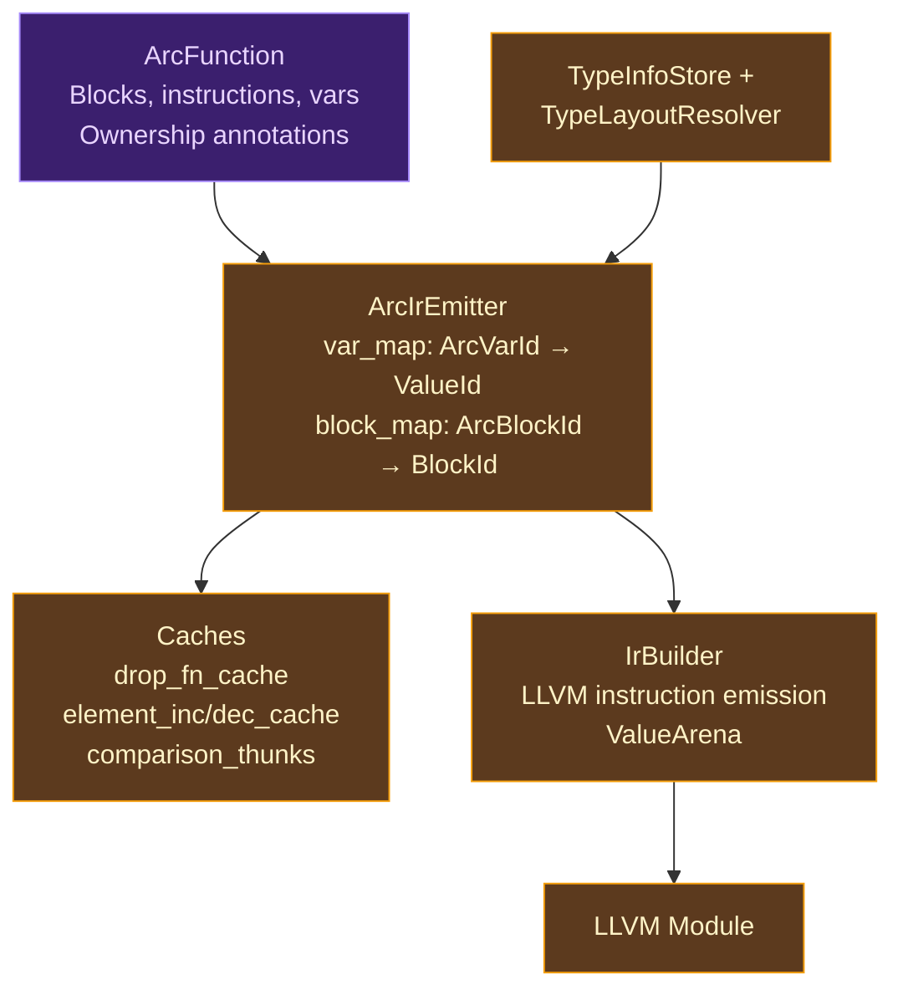
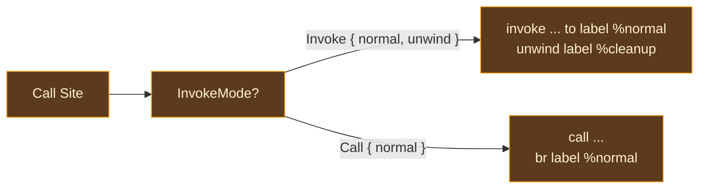

# ARC Emitter

## What Is Instruction Selection?

The final step of code generation is **instruction selection** — translating the compiler's internal representation into the target machine's instruction set. In a compiler that targets LLVM, this means translating the compiler's own IR into LLVM IR instructions: `add`, `load`, `store`, `call`, `br`, `phi`, and the rest of LLVM's typed SSA instruction set.

This translation is rarely one-to-one. A high-level "construct a struct" operation might become a sequence of `alloca`, `store`, and `insertvalue` instructions. A "call a closure" operation might become `extractvalue`, `extractvalue`, `call`. A "decrement reference count" operation might become a `load` (to read the refcount), a `sub` (to decrement it), a `store` (to write it back), an `icmp` (to check for zero), and a `br` (to branch to the cleanup code if zero). The instruction selector's job is to produce correct, efficient LLVM IR for each high-level operation.

### Classical Approaches

**Table-driven instruction selection** (LLVM's own SelectionDAG, GCC's RTL matcher) uses pattern-matching tables to map IR operations to machine instructions. The tables are typically generated from target description files. This approach is systematic but complex — LLVM's SelectionDAG is one of the largest and most complex components of the LLVM codebase.

**Direct emission** (the approach used by most language compilers targeting LLVM) translates each IR instruction into a sequence of LLVM API calls. The compiler walks its own IR tree or basic blocks and emits LLVM instructions procedurally. This is simpler than table-driven selection because the source IR (the compiler's own representation) is much higher-level than machine instructions — each source instruction maps to a fixed pattern of LLVM instructions.

**Template-based emission** (used by some JIT compilers) pre-compiles instruction patterns into templates that are filled in with runtime values. This is fast but inflexible.

### Where Ori Sits

Ori uses **direct emission** from ARC IR to LLVM IR. The `ArcIrEmitter` walks each `ArcFunction`'s basic blocks, dispatching on instruction type and emitting the corresponding LLVM IR through the `IrBuilder` API. Each ARC IR instruction maps to a known pattern of LLVM instructions — there is no pattern matching, no template expansion, just a procedural walk.

- The source IR is **ARC IR**, not the original canonical expressions.
- Before emission, high-level constructs become explicit control flow and AIMS
  freezes every logical ownership event, reuse/COW decision, transfer edge, and
  cleanup obligation.
- Production emission validates those facts against
  `CompiledLayoutPlan(TargetSpec)` and encodes them mechanically as LLVM IR.
- The shipped `RcStrategy` and `EmittedValue` dispatch documents today's
  physical adapter; it is not the AIMS contract.

## What Makes the ARC Emitter Distinctive

### The Ordinary-Body Codegen Path

The `ArcIrEmitter` is the sole LLVM path for ordinary realized bodies: user-defined functions, closure bodies, and lowered control flow. It translates the ownership plan mechanically and does not decide where RC, COW, reuse, or drops belong.

An earlier version of the backend routed simple user functions through a direct `ExprLowerer` while complex functions used AIMS. Removing that split eliminated a recurring divergence class for source bodies.

> **Current gap — compiler-generated bodies.** Derived trait methods are still synthesized directly by `derive_codegen`, outside `ArcIrEmitter` and AIMS. Some wrappers and builtin handlers also have LLVM-specific construction surfaces. These are not exceptions to the one-calculus rule: production convergence must express shared semantics and ownership in the executable carrier, then let this module project them to LLVM. Until that migration lands, claims of a sole whole-program codegen path are incorrect.

### RPO Block Emission

Basic blocks are emitted in **Reverse Post-Order** (RPO), not in the order they appear in the ARC IR arrays. This ordering guarantee is necessary for correct SSA construction: in SSA form, every use of a value must be dominated by its definition, and RPO ensures that every block's dominators are visited before the block itself.

RPO ordering is particularly important because the AIMS pipeline's `expand_reuse` pass appends fast-path/slow-path/merge blocks whose terminators may target blocks that appear earlier in the array. Without RPO, the emitter might try to emit a branch to a block that hasn't been created yet, or build a PHI node for a block whose predecessors haven't been visited.

The RPO traversal is computed once from the ARC IR's control flow graph before emission begins: build a CFG adjacency list from terminators, compute post-order via iterative DFS, then reverse.

### Dead Block Elimination

During RPO computation, the emitter detects and skips **dead unwind blocks** — blocks that are only reachable via the unwind edge of an `invoke` that was downgraded to a `call` (because the callee was proved `nounwind` by the nounwind analysis). These blocks contain cleanup code (RC decrements for in-scope values) that would never execute. Emitting them would produce unreachable LLVM code that confuses the optimizer and inflates binary size.

## Architecture

The emitter's component structure reflects its role as a translation layer between ARC IR and LLVM:

The emitter holds several lookup tables and caches:

| Field | Purpose |
|-------|---------|
| `var_map` | Maps ARC IR variables (`ArcVarId`) to LLVM values (`ValueId`) |
| `block_map` | Maps ARC IR blocks (`ArcBlockId`) to LLVM basic blocks (`BlockId`) |
| `drop_fn_cache` | Memoized drop functions by mangled name (prevents regeneration) |
| `element_inc_cache` | Per-element-type RC increment callbacks (for COW collection operations) |
| `element_dec_cache` | Per-element-type RC decrement callbacks |
| `comparison_thunks` | Comparison function thunks for runtime sort/search operations |
| `type_info_store` | Lazy type info resolution (`Idx` → `TypeInfo`) |
| `type_layout` | LLVM type resolution (`Idx` → `BasicTypeEnum`) |

The emitter borrows the `IrBuilder` mutably for the duration of a single function's emission. After emission, control returns to `FunctionCompiler` for the next function.

## EmittedValue

`EmittedValue` is a tagged wrapper around LLVM values that carries memory representation information through the emission pipeline. Every value produced or consumed by the emitter is wrapped in `EmittedValue`, making the representation explicit at every step.

| Variant | Payload | When Used |
|---------|---------|-----------|
| `Immediate(ValueId)` | Register-width scalar | `int`, `float`, `bool`, `byte`, `char`, pointers |
| `RcPointer(ValueId)` | Pointer to RC-managed heap | Struct/enum instances that are heap-allocated |
| `Aggregate(ValueId)` | Stack LLVM struct value | Tuples, small structs, Option/Result |
| `Pair { first, second }` | Two separate `ValueId`s | `str` (len + ptr), closures (fn_ptr + env_ptr) |
| `ZeroSized` | No payload | `void`, `Never`, unit structs with no fields |

The distinction between variants matters in three places:

1. **RC operations**: Incrementing an `Immediate` is a no-op. Incrementing an `RcPointer` calls `ori_rc_inc`. Incrementing a `Pair` may need to increment one or both components. Incrementing an `Aggregate` may need to walk its fields.

2. **ABI passing**: An `Aggregate` is passed as a single LLVM value. A `Pair` must be split into its components at call boundaries and rejoined on the other side. A `ZeroSized` value is not passed at all.

3. **Memory access**: An `RcPointer` requires a GEP (GetElementPointer) to access fields. An `Aggregate` uses `extractvalue`. A `Pair` uses direct component access.

## RC Operation Emission

- Ownership-event projection is the emitter's most nuanced responsibility.
- The shipped `RcInc`, `RcDec`, and `IsShared` carrier includes `RcStrategy`,
  which currently selects an LLVM emission pattern.
- Production uses the event's stable `ValueSemanticsId`/`ExecutableDropPlanId`
  plus `CompiledLayoutPlan(TargetSpec)`; LLVM never determines which logical
  event or field cleanup applies.

### Current `RcStrategy` Dispatch (Migration Surface)

| Strategy | Inc Pattern | Dec Pattern |
|----------|-------------|-------------|
| `HeapPointer` | `call ori_rc_inc(ptr)` | `call ori_rc_dec(ptr)` |
| `HeapPointer` (list) | `call ori_list_rc_inc(data, cap)` | `call ori_list_rc_dec(data, cap)` |
| `FatPointer` | Extract field 1 (data ptr), inc | Extract field 1, dec |
| `Closure` | Extract `env_ptr`; null-check; if non-null, `ori_rc_inc(env_ptr)` | Extract `env_ptr`; null-check; if non-null, load `drop_fn`, `ori_rc_dec_with_drop(env_ptr, drop_fn)` |
| `AggregateFields` | Recursively inc each RC field | Recursively dec each RC field |
| `InlineEnum` | No-op | Tag-switch: per-variant cleanup |

**Closure RC** is the most complex case. Non-capturing closures have a null `env_ptr`, so RC operations must null-check before touching the pointer. The dec path is asymmetric: it loads the drop function from field 0 of the environment struct and passes it to `ori_rc_dec_with_drop`, which calls the drop function when the refcount reaches zero.

**AggregateFields** currently uses recursive type-structure traversal in
`rc_value_traversal.rs`. It must migrate to the bound `ExecutableDropPlanId`
for logical field/drop order plus `CompiledLayoutPlan(TargetSpec)` for offsets;
LLVM must not re-derive either policy from the type.

**InlineEnum** currently generates a switch on the compiled discriminant. In
production, the drop plan selects the active variant's logical fields and the
compiled layout supplies the discriminant/offset encoding. The current no-op
increment behavior is migration evidence, not a universal AIMS or VM rule.

## Drop Function Generation

The `DropFunctionGenerator` creates specialized `extern "C" fn(*mut u8)` functions for each type that requires custom cleanup at RC-zero. These are called by the runtime's `ori_rc_dec` when the refcount reaches zero.

### Naming and Caching

Drop functions are named `_ori_drop$<idx_raw>` (where `idx_raw` is the numeric type index) and cached by mangled name. The cache entry is inserted **before** the function body is generated — this handles recursive types. If type `A` contains a field of type `A` (via `Option<A>`), the drop function for `A` can reference itself without infinite recursion during code generation.

### Drop Variants

| Type Pattern | Generated Body |
|-------------|---------------|
| No RC fields | `call ori_free(ptr)` — trivial drop |
| Struct with RC fields | GEP to each RC field, load, dec, then free |
| Enum | Load tag, switch to per-variant cleanup, then free |
| Collection (`[T]`) | Loop over elements, dec each, then free backing storage |
| Map (`{K: V}`) | Loop over entries, dec each key and value, then free |
| Closure environment | GEP to each captured variable, dec if RC-managed, then free |

### Element RC Callbacks

Collection types need element-level RC operations for COW mutations. When `ori_list_push_cow` is called, it may need to copy the list — and copying means incrementing the reference count of every element. The emitter generates `extern "C" fn(*mut u8)` callbacks (one for inc, one for dec per element type) that know how to handle a single element. These are cached in `element_inc_cache` / `element_dec_cache` and passed to runtime COW functions.

## Terminator Emission

Each ARC IR block ends with exactly one terminator. The emitter translates terminators into LLVM control flow:

### Return

The return terminator respects the function's ABI classification:

- **Direct**: `ret <value>` for register-sized returns
- **Sret**: Store the value through the sret pointer (first parameter), then `ret void`
- **Void**: `ret void` for functions returning `void` or `Never`

### Jump

Unconditional branch to a target block. Records PHI incoming values for the target block's parameters, then emits `br label %target`.

### Branch

Conditional branch on a boolean. Emits `br i1 %cond, label %true_target, label %false_target`. Records PHI incoming values for both targets.

### Switch

Multi-way branch on a discriminant integer. Emits LLVM `switch` with one case per variant and a default (which may be `unreachable` if the match is exhaustive). Records PHI incoming values for all targets.

### InvokeMode

The `Invoke` terminator's emission depends on `InvokeMode`, which makes call-site control flow explicit:

- **`Invoke { normal, unwind }`** — emits LLVM `invoke` with normal and unwind continuations. The unwind block contains cleanup code (RC decrements for in-scope values) followed by `resume`.
- **`Call { normal }`** — emits LLVM `call` followed by `br label %normal`. Used when the callee is provably `nounwind`.

`InvokeMode` replaced boolean flags (`is_nounwind`, `has_unwind_target`) that previously caused subtle bugs. The enum makes the decision explicit: you either have both continuations or just the normal one.

### Resume and Unreachable

- **Resume** — re-raises the current exception. Emits LLVM `resume` with the landingpad value.
- **Unreachable** — emits LLVM `unreachable`. Used after calls to `@noreturn` functions like `panic`.

## Interaction with ori_arc

- The shipped emitter consumes `ArcFunction` values produced by `ori_arc::run_arc_pipeline()`.
- It does not call ARC analysis passes itself.
- Production consumes the validated executable carrier plus compiled layout plan.

**AIMS and executable construction are responsible for:**
- Lowering canonical expressions to basic-block IR
- Borrow inference (determining Owned vs. Borrowed parameters)
- Liveness analysis (determining when variables are last used)
- RC insertion (placing `RcInc` and `RcDec` at the right points)
- Reset/reuse optimization (converting free+alloc to in-place reuse)
- RC elimination (removing redundant inc/dec pairs)
- Binding every logical event to exact stable value/drop-plan identities;
  `RcStrategy` remains a transitional carrier until that coverage is complete

**ArcIrEmitter is responsible for:**
- Translating flat ARC IR blocks into LLVM basic blocks
- Emitting LLVM instructions for each ARC IR instruction
- Encoding bound drop plans and collection cleanup through the validated
  `CompiledLayoutPlan(TargetSpec)` without re-deriving logical traversal
- Managing the LLVM basic block structure (RPO ordering, dead block elimination)
- Respecting the selected compiled representation at every step

- The emitter never reasons about variable liveness or logical ownership-event placement.
- It does not own layout; it validates and encodes the shared compiled plan.
- That narrow responsibility makes the projection independently verifiable and
  prevents LLVM from becoming a hidden AIMS or representation authority.

## Prior Art

**[rustc_codegen_llvm](https://github.com/rust-lang/rust/tree/master/compiler/rustc_codegen_llvm)** — Rust's LLVM backend translates MIR (Mid-level IR) to LLVM IR, similar to Ori's ARC-IR-to-LLVM-IR translation. Rust's MIR already has explicit drops and borrow checking, so rustc's codegen is primarily an instruction selection problem — much like Ori's emitter. The key difference is that MIR uses Rust's ownership model (drops at scope boundaries), while ARC IR uses reference counting (explicit inc/dec instructions).

**[Swift SILGen](https://github.com/apple/swift/tree/main/lib/SILGen)** — Swift's SIL generation translates AST to SIL (Swift Intermediate Language), which carries explicit ARC operations (`strong_retain`, `strong_release`). Swift's SIL-to-LLVM translation (IRGen) then lowers these ARC operations to LLVM calls, similar to how Ori's emitter translates `RcInc`/`RcDec` to `ori_rc_inc`/`ori_rc_dec` calls. Swift's IRGen is more complex because SIL carries more information (ownership conventions, resilience, witness tables).

**[Lean 4 EmitLLVM](https://github.com/leanprover/lean4/tree/master/src/Lean/Compiler/LCNF)** — Lean's compiler emits C code rather than LLVM IR directly, but the translation is structurally similar: LCNF basic blocks with explicit RC operations are translated to C function bodies with `lean_inc_ref` / `lean_dec_ref` calls. Ori's emitter could be seen as a version of Lean's C emitter that targets LLVM IR instead.

**[Zig codegen](https://github.com/ziglang/zig/blob/master/src/codegen/llvm.zig)** — Zig's LLVM codegen walks its AIR (Analyzed IR) and emits LLVM instructions directly, similar to Ori's approach. Zig's codegen is notable for its `noreturn` handling and its careful treatment of LLVM's undefined behavior semantics. Ori's emitter handles the same concerns (unreachable blocks, nounwind analysis) through its `InvokeMode` system.

## Design Tradeoffs

**Shared calculus vs. tiered physical compilation.** All ordinary functions go through ARC IR, even when they need no RC operations. Physical tiers may interpret bytecode, emit LLVM IR, or JIT hot regions, but they consume one ownership plan. A tier that reruns ownership analysis for "simple" functions would reintroduce the divergence that removing `ExprLowerer` fixed. Compiler-generated bodies remain the current convergence gap described above.

**RPO emission vs. natural order.** RPO traversal adds a pre-computation step (DFS + reversal) before emission. Emitting blocks in array order would be simpler but would produce incorrect SSA in cases where the `expand_reuse` pass creates blocks out of dominance order. The RPO computation is O(n) in the number of blocks and adds negligible time relative to the LLVM instruction emission.

**Per-type drop functions vs. generic traversal.** Generating a specialized drop function for each type produces more code but keeps drop-time overhead minimal (a linear sequence of GEPs and RC decrements). A generic traversal approach — storing type layout metadata and interpreting it at runtime — would reduce code size but add runtime interpretation overhead on every object destruction. For a language where object destruction happens on every RC-zero event, the specialized approach is the right choice.

**EmittedValue tagging vs. implicit representation.** Wrapping every LLVM value in an `EmittedValue` tag adds verbosity to the emitter code. The alternative — tracking representations implicitly (assuming all pointers are RC-managed, all structs are aggregates) — would be more concise but error-prone. The tags catch representation mismatches at the point of use rather than producing subtly wrong LLVM IR that fails later during optimization or execution.

**Cached element callbacks vs. inline generation.** Element RC callbacks for COW operations are generated once per element type and cached. An alternative — generating the callback inline at each COW call site — would avoid the function call overhead but would duplicate the callback code at every list push, map insert, and set operation. Caching reduces code size and instruction cache pressure at the cost of one indirect call per element during COW copies.
