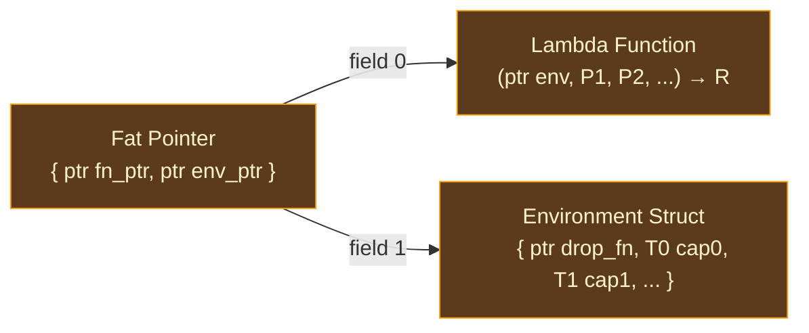

# Closures

## What Is a Closure?

A closure is a function bundled with the variables it captured from its enclosing scope. When a programmer writes `x -> x + offset`, the resulting value is not just a function — it is a function *plus* the current value of `offset`. If `offset` changes later (in the outer scope), the closure retains its own copy. If the closure outlives the scope that created it, the captured value must survive too.

This concept — a function that "closes over" its environment — is one of the most powerful abstractions in programming languages. It enables higher-order programming patterns: passing behavior as values, building abstractions like `map`, `filter`, and `fold`, and creating callbacks that remember their context. But from a compiler's perspective, closures pose a fundamental implementation challenge: **how do you represent a function that carries data?**

### The Representation Problem

A bare function pointer — `fn(int) -> int` — is a single address. You can store it, pass it, call it. But it carries no data. A closure needs both the code (what to execute) and the environment (what values were captured). The compiler must choose a representation that bundles these together efficiently.

The history of closure implementation is a history of different answers to this bundling problem:

**Heap-allocated environments** (the Lisp/Scheme tradition) store captured variables in a heap-allocated record. The closure is a pair: a code pointer and an environment pointer. This is simple and general — any number of captures, any types — but it requires heap allocation for every closure creation, even trivial ones.

**Stack-allocated closures** (the C++ lambda tradition) store captured values inline in a compiler-generated struct on the stack. The struct's type varies with each lambda (each lambda is a unique anonymous type), so closures cannot be stored in uniform containers without type erasure. C++ solves this with `std::function` (which heap-allocates the erased closure) or templates (which monomorphize at each call site).

**Defunctionalization** (the Reynolds 1972 / MLton tradition) eliminates closures entirely at compile time. Each lambda is converted to a tagged union variant, and each call site becomes a `switch` on the tag. This avoids heap allocation and indirect calls entirely but requires whole-program analysis and produces code that doesn't compose with separate compilation.

**Closure conversion with lambda lifting** (the GHC / functional language tradition) transforms closures into top-level functions with extra parameters for the captured variables. The "closure" becomes a partial application of this lifted function. This works well for purely functional languages where all data is immutable, but it requires careful handling of mutable captures.

**Fat pointers** (the Go / Swift tradition) represent closures as a two-word pair: a function pointer and a context pointer. The function always receives the context pointer as a hidden first argument. Non-capturing closures set the context to null. This provides a uniform calling convention — all closure calls look the same regardless of capture count — at the cost of one extra argument per call.

### Current LLVM Projection

The current LLVM projection uses the **fat pointer** approach: every closure is a `{ fn_ptr, env_ptr }` pair, where `fn_ptr` points to the lambda function and `env_ptr` points to a heap-allocated, counter-managed environment struct. The lambda function always receives `env_ptr` as its hidden first parameter, whether or not it has captures. Non-capturing closures set `env_ptr` to null and ignore the parameter. AIMS freezes the logical callable, capture, ownership, lifetime, and drop facts; it does not require this representation.

This choice is driven by Ori's type system: closures are typed as `(P1, P2, ...) -> R`, and all closures with the same parameter and return types are interchangeable. A `[int].map(transform:)` call can receive *any* `(int) -> int` closure, regardless of what it captures. The fat pointer representation makes this possible without boxing or type erasure — every closure with the same functional type has the same LLVM representation.

## What Makes Ori's Closure Compilation Distinctive

### Uniform Calling Convention

Many compilers use different calling conventions for capturing and non-capturing closures. A non-capturing `x -> x + 1` might compile to a bare function pointer, while a capturing `x -> x + offset` compiles to a fat pointer. This creates complexity at call sites: the caller must check which kind it received.

The current LLVM projection eliminates this by making its calling convention **uniform**. Every lambda function — with or without captures — takes `ptr %env` as its first parameter. Non-capturing lambdas simply ignore it. Call sites never check whether captures exist; they always extract `fn_ptr` and `env_ptr`, prepend the `env_ptr` to the argument list, and call through `fn_ptr`. This uniformity trades one unused argument (for non-capturing closures) for zero branching at call sites.

### ARC-Managed Environments

In the current LLVM projection, closure environments are heap-allocated via `ori_rc_alloc` and use its reference-counting adapter. Logical closure duplication and release become counter increments and decrements. At the adapter's final-owner transition, a per-closure **drop function** releases all managed captures before freeing the environment. VM, native, direct-WebAssembly, and JIT planners may satisfy the same frozen AIMS facts differently.

This means closures compose naturally with Ori's value semantics — copying a closure is cheap (one RC increment), and cleanup is automatic. There is no separate lifetime management for closure environments.

### Capture Analysis in ARC IR

Capture analysis happens during ARC lowering upstream of AIMS (in `ori_arc`), not during LLVM emission. The `ArcLowerer`'s `collect_captures` method walks the lambda body recursively, identifying free variables — identifiers that are used but not bound as lambda parameters. Each capture is recorded with its name, ARC variable ID, and type. AIMS then freezes the ownership and cleanup obligations for those captures.

This early capture analysis means the AIMS pipeline can reason about closure captures the same way it reasons about any other value: a captured list that is only read can be borrowed, while an owned captured string receives one logical owner credit at closure creation and discharges it at closure death. The LLVM backend never performs its own capture analysis — it receives pre-analyzed `PartialApply` instructions and frozen capture facts from the executable artifact.

## Representation

### The Fat Pointer

All closures in the current LLVM projection use the same LLVM type: a struct with two pointer fields.



For non-capturing closures, `env_ptr` is null. The lambda function still takes `ptr %env` as its first parameter but never dereferences it.

### Environment Struct Layout

When a closure captures variables, the current LLVM projection stores them in a heap-allocated environment struct. The first field is a **drop function pointer** — a per-closure generated `extern "C" fn(*mut u8)` that handles the adapter's final-owner cleanup. Captured values follow at fields 1 through N:

| Field | Content | Type |
|-------|---------|------|
| 0 | Drop function pointer | `ptr` |
| 1 | First capture | Native LLVM type of capture |
| 2 | Second capture | Native LLVM type of capture |
| ... | ... | ... |

Each capture is stored at its **native LLVM type** — an `int` capture is `i64`, a `str` capture is `{ i64, ptr }`, a closure capture is `{ ptr, ptr }`. There is no coercion to a uniform type like `i64` or `ptr`. This means the environment struct's layout varies per closure, but the lambda function knows the exact layout because it was generated alongside the environment.

### Drop Functions for Environments

The current LLVM drop function at field 0 is generated specifically for each closure capture set. It walks the environment struct and projects the frozen logical cleanup plan into the counter-based adapter for each managed capture. Captures with no logical cleanup obligation are ignored.

This per-closure drop function is what makes closure environments work with the RC system. When `ori_rc_dec` determines that the environment's refcount has reached zero, it calls the drop function (loaded from field 0 of the environment), which cleans up all captures, and then frees the environment allocation.

## Compilation

### Creating a Closure (`emit_partial_apply`)

When the ARC IR contains a `PartialApply` instruction, the emitter creates a closure fat pointer. The process has six steps:

1. **Read capture information** from the `PartialApply` instruction. Each capture has a name, an ARC variable ID (pointing to the outer scope's value), and a type index.

2. **Look up the lambda's type** from `TypeInfo::Function` to determine the actual parameter types and return type.

3. **Generate the lambda function** with signature `(ptr %env, T1 %p1, T2 %p2, ...) -> R`. The hidden `ptr %env` is always the first parameter. The function uses `fastcc` (LLVM's fast calling convention) for internal calls.

4. **Unpack captures in the lambda body**. If the closure has captures, the lambda function's entry block loads each capture from the environment struct using `struct_gep` at fields 1 through N (skipping field 0, the drop function). Each loaded value is bound in the local scope by capture name.

5. **Compile the lambda body** with captures and parameters in scope. The body is compiled through the normal ARC IR emission path.

6. **Build the fat pointer**. If there are no captures, construct `{ fn_ptr, null }`. If there are captures: allocate the environment via `ori_rc_alloc`, store the drop function at field 0, store each capture value at fields 1 through N (with `RcInc` for RC-managed captures), and construct `{ fn_ptr, env_ptr }`.

### Non-Capturing Fast Path

For lambdas that capture no variables, the compiler skips environment allocation entirely. The lambda function pointer is reused directly (cached in `non_capturing_lambdas` to avoid regenerating the same lambda), and the fat pointer's `env_ptr` is set to null. This avoids heap allocation for simple function-as-value patterns like `list.map(transform: x -> x * 2)`.

### Calling a Closure (`emit_apply_indirect`)

When the ARC IR contains an `ApplyIndirect` instruction (calling a value that holds a closure), the calling convention is uniform:

1. **Extract** `fn_ptr` and `env_ptr` from the fat pointer using `extract_value` at indices 0 and 1.
2. **Prepend** `env_ptr` as the first argument, followed by the actual arguments.
3. **Call indirectly** through `fn_ptr` with the combined argument list, using the actual parameter and return types from `TypeInfo::Function`.

No tag-bit checking, no null testing, no branching. The calling convention is the same whether the closure captures ten variables or none. The `env_ptr` may be null (non-capturing closure), but the lambda function was generated to accept and ignore it in that case.

### Wrapper Functions for Capturing Closures

For capturing lambdas, a wrapper function `_ori_partial_N` bridges calling conventions. The wrapper unpacks captures from the environment struct and calls the underlying lambda with the correct parameter types. This indirection allows the fat pointer calling convention to remain uniform while each lambda's internal signature matches its actual parameter types — important for LLVM's optimizer, which benefits from precise type information.

## Capture Analysis

Capture analysis identifies which variables from the enclosing scope a lambda needs. The `collect_captures` method in `ArcLowerer` walks the lambda body recursively:

```
Walk(expression):
    Identifier(name) →
        if name NOT in lambda parameters
        AND name IS in current scope
        AND name NOT already captured
        → record (name, arc_var_id, type) as capture

    Binary/Unary/Call/Conditional/Block/Lambda/FieldAccess/Index →
        recursively walk sub-expressions
```

The analysis handles:
- **Identifiers** — the primary capture source
- **Binary and unary operations** — operands may reference outer variables
- **Function calls** — both the callee and arguments may be captures
- **Conditionals** — all branches are walked
- **Blocks with let bindings** — new bindings shadow outer variables; the body is walked with the extended scope
- **Nested lambdas** — inner lambdas may capture the same outer variables
- **Field access and indexing** — the receiver may be a captured value

Captures become the first parameters of the lambda's `ArcFunction` in the ARC IR. The `PartialApply` instruction records which outer variables are captured and their values. AIMS freezes their logical ownership, lifetime, and drop obligations. The current LLVM projection then generates an environment struct that satisfies those facts; other physical planners may choose different storage and cleanup mechanisms.

## Prior Art

**[Go](https://github.com/golang/go)** — Go closures use the same fat pointer representation as Ori: a function pointer plus a context pointer passed as a hidden first argument. Go's closure variables are captured **by reference** (the closure and the enclosing scope share the same variable), while Ori captures **by value** (each closure gets its own copy). Go's reference capture is more flexible (mutations in the closure are visible outside) but introduces aliasing and lifetime complexity that Ori's value semantics avoid.

**[Swift](https://github.com/apple/swift)** — Swift closures capture variables by reference by default, with `[capture]` syntax for explicit value capture. Swift's closure representation is more complex: closures can be `@escaping` (heap-allocated, reference-counted context) or non-escaping (stack-allocated, no overhead). This distinction enables significant optimizations for short-lived closures (like those passed to `map` and `filter`) but requires the type system to track escaping. The current LLVM projection's simpler approach — always heap-allocate the environment — trades this optimization opportunity for uniformity.

**[Rust](https://github.com/rust-lang/rust)** — Rust closures are monomorphized anonymous types. Each closure has a unique type that implements `Fn`, `FnMut`, or `FnOnce`. This means `|x| x + offset` and `|x| x + other_offset` have different types, even though both are `impl Fn(i32) -> i32`. Closures are stored inline (no heap allocation) unless explicitly boxed via `Box<dyn Fn()>`. This produces optimal code (no indirect calls, no heap allocation for non-escaping closures) but requires generics or trait objects for uniform storage. Ori's fat pointer approach is less efficient for non-escaping closures but simpler for uniform storage.

**[Haskell (GHC)](https://gitlab.haskell.org/ghc/ghc)** — GHC uses closure conversion and lambda lifting extensively. Closures are heap-allocated objects with an info table pointer (analogous to Ori's drop function pointer) and payload fields for captures. GHC's STG (Spineless Tagless G-machine) representation is more general — it handles thunks (unevaluated closures) and partial applications as first-class concepts — but the core representation (code pointer + environment fields) is structurally similar to Ori's.

**[OCaml](https://github.com/ocaml/ocaml)** — OCaml closures are heap-allocated blocks containing the function code pointer and captured values. Like Ori, captures are stored at their native types. OCaml's garbage collector handles closure memory management, while Ori uses reference counting. The functional representation is nearly identical.

**[MLton](http://mlton.org/)** — MLton (Standard ML compiler) uses whole-program defunctionalization: every lambda is converted to a constructor of a datatype, and every call site becomes a case analysis. This eliminates all indirect calls and heap allocation for closures but requires whole-program compilation and produces specialized code for each call site. Ori's separate compilation model precludes this approach.

## Design Tradeoffs

**Fat pointers vs. monomorphized closures.** Ori uses uniform `{ ptr, ptr }` fat pointers; Rust uses unique anonymous types. Fat pointers enable uniform storage (a `[Closure]` list is straightforward) but require indirect calls (the CPU must load the function pointer, then call through it). Monomorphized closures enable direct calls and inline optimization but require generics or type erasure for uniform storage. Ori's choice aligns with its type system — closures are typed by their signature `(P1, ...) -> R`, not by their identity, so uniform representation is essential.

**Value capture vs. reference capture.** Ori captures by value — each closure gets its own copy of captured variables. Go and Swift default to reference capture — the closure and the outer scope share the variable. Reference capture is more flexible (the closure can observe later mutations to the captured variable) but introduces aliasing, lifetime issues, and potential race conditions. Value capture aligns with Ori's value semantics: there is no shared mutable state, closures are self-contained, and captured values cannot be invalidated by changes in the outer scope.

**Always heap-allocate vs. escape analysis.** The current LLVM projection heap-allocates every capturing closure environment. Swift performs escape analysis to determine whether a closure can be stack-allocated (non-escaping closures avoid heap allocation entirely). Ori's backend-neutral AIMS lifetime facts and target layout planners make stack, arena, region, or heap placement a projection choice rather than a source-language rule. Completing those facts and planners is the production optimization path.

**Drop function per closure vs. type metadata.** The current LLVM projection generates a unique drop function for each closure capture set. AIMS owns the logical capture traversal and exactly-once drop obligations; the compiled layout plan selects and validates the cleanup adapter. A metadata-driven routine could reduce code size at some runtime interpretation cost, while a VM may use a stable drop-plan ID. The current LLVM per-closure mechanism produces slightly larger binaries but keeps its drop-time path direct.

**Uniform calling convention vs. optimized dispatch.** Passing `env_ptr` to non-capturing closures wastes one argument register. An alternative — checking at the call site whether the closure captures anything and using a direct call for non-capturing ones — would save one register but add a branch at every call site. The uniform convention favors call-site simplicity (no branching, same code path for all closures) over marginal per-call overhead.
