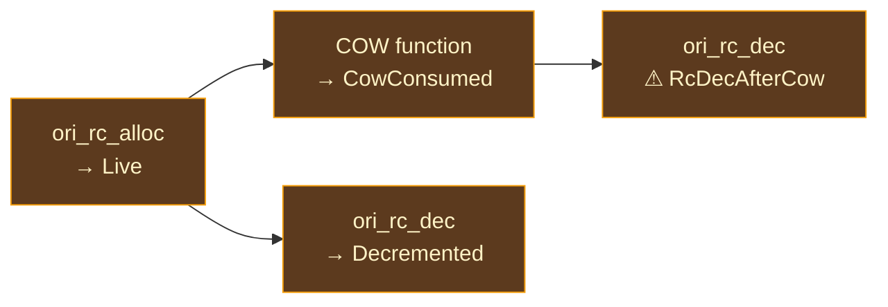

# Codegen Verification

## Why Verify Generated Code?

A compiler's correctness is measured not by what it accepts, but by what it produces. A type checker can reject ill-formed programs, and a parser can reject invalid syntax, but the final test of a code generator is whether the machine code it produces does the right thing. For a language with automatic reference counting, "the right thing" includes a particularly treacherous requirement: **every allocation must be freed exactly once**.

Reference counting bugs are among the hardest to diagnose in compiler development. A missing `RcDec` does not crash immediately — it produces a memory leak that accumulates silently. An extra `RcDec` does not fail at the point of the error — it corrupts the refcount of an allocation that may not be accessed again for thousands of instructions, leading to a use-after-free in an entirely different part of the program. A COW operation on a freed pointer does not segfault deterministically — it corrupts whatever happens to occupy that memory now, which might be a completely unrelated data structure.

These bugs survive testing because they depend on allocation patterns, execution order, and timing. A program might run correctly a thousand times and then crash on the thousand-and-first because the allocator happened to reuse memory in a different order. Traditional testing — write input, check output — is necessary but insufficient. What is needed is a way to verify the *structure* of the generated code, catching RC lifecycle violations before the code ever executes.

### Classical Approaches to Generated Code Verification

**LLVM's built-in verifier** checks structural invariants of LLVM IR: every instruction's operands have correct types, every basic block has a terminator, every PHI node has entries for all predecessors. This catches codegen bugs that produce malformed IR (type mismatches, missing terminators) but knows nothing about language-level semantics like reference counting.

**Sanitizers** (AddressSanitizer, MemorySanitizer, LeakSanitizer) instrument the generated code to detect memory errors at runtime. They catch use-after-free, buffer overflows, and leaks, but they require actually executing the code with inputs that trigger the bug. They are reactive — they find bugs that happen, not bugs that could happen.

**Static analysis of generated code** walks the generated IR to verify language-level invariants without executing it. This is the approach taken by Ori's codegen verification system. It operates on in-memory LLVM IR — the same `Module`, `FunctionValue`, and `InstructionValue` objects used during codegen — and checks RC lifecycle rules, COW sequencing constraints, and ABI conformance. The analysis runs during compilation itself, catching issues before the module reaches optimization or execution.

**Model checking and formal verification** (used in verified compilers like [CompCert](https://compcert.org/)) prove that the generated code preserves source-level semantics for all possible inputs. This is the gold standard but requires enormous implementation effort and limits the optimizations that can be verified.

### Where Ori Sits

Ori's codegen verification is a **lightweight static analysis** that walks the generated LLVM IR looking for common patterns of RC bugs. It is not a full model checker — it uses a linear forward scan rather than full dataflow analysis, which means it can miss conditional RC paths. But it is designed to catch the bugs that actually appear in practice: straight-line RC sequences where an allocation is never decremented, where a COW function receives a freed pointer, or where a runtime function is called with the wrong number of arguments.

The analysis is **opt-in** (gated behind `ORI_AUDIT_CODEGEN=1`) and **zero-cost when disabled** — no data structures are allocated, no IR is walked, no functions are called.

## What Makes Ori's Verification Distinctive

### In-Pipeline, Not Post-Hoc

Most code analysis tools operate on files — they read textual LLVM IR, parse it, and analyze the parsed representation. This introduces parsing fragility (the tool must handle LLVM IR syntax changes across versions) and adds a compilation step (emit IR to file, then analyze).

Ori's verification operates on **live inkwell IR objects** — the same `Module`, `FunctionValue`, and `InstructionValue` types used during codegen. The audit runs inside the compilation pipeline, between code generation and optimization/emission. There is no IR serialization, no file I/O, no parsing. This makes the audit fast, precise, and immune to format changes.

### Four Independent Checks

The verification system comprises four independent check modules that share a reporting infrastructure but have no data dependencies:

1. **RC Balance** — tracks pointer states through the RC lifecycle
2. **COW Sequencing** — validates Copy-on-Write operation ordering
3. **ABI Conformance** — verifies calling convention correctness
4. **Safety Check Density** — measures panic/assert coverage (informational)

Each module iterates over every function in the LLVM module (skipping declarations without bodies), applies the function filter if set, and appends findings to a shared `AuditReport`. Adding a new check module requires no changes to existing modules.

### Graduated Severity

Findings are classified by severity:

| Severity | Meaning | Build Impact |
|----------|---------|--------------|
| Error | Definite correctness violation | Fails the build |
| Warning | Likely problem (may have false positives in edge cases) | Reported, does not fail |
| Note | Informational observation | Reported, no action needed |

Errors are reserved for findings that represent real violations in normal mode — the system is designed to never produce false positive errors in normal mode. Strict mode may produce false positives (by design) and uses errors more liberally.

## The Four Checks

### 1. RC Balance

The RC balance checker tracks pointer states through the reference counting lifecycle. Every call to `ori_rc_alloc` records the result SSA name as `Live`. Subsequent operations transition the state:



At function exit, any pointer still in `Live` state is flagged:

| Situation | Finding | Severity |
|-----------|---------|----------|
| Pointer `Live` at function exit | `RcLeak` | Warning (Error in strict) |
| `ori_rc_dec` on `CowConsumed` pointer | `RcDecAfterCow` | Warning |
| `ori_rc_dec` on `Decremented` pointer | `RcDoubleDec` | Error (strict only) |

The tracker uses an `FxHashMap<String, PtrState>` keyed by SSA name. This is a **linear forward scan**, not full CFG dataflow — it handles straight-line RC patterns (which account for 95%+ of codegen output) but may miss conditional RC paths. By design it produces false negatives (misses), never false positives for Error-severity findings in normal mode.

### 2. COW Sequencing

The COW sequencing checker validates three ordering rules for Copy-on-Write operations:

**Rule 1: No reuse after COW.** After `ori_list_push_cow(data_ptr, ...)`, any subsequent use of `data_ptr` (other than `ori_rc_dec`) is an error. The COW function may have reallocated the backing storage, invalidating the old pointer.

```
ori_list_push_cow(data, ...)   // COW may reallocate
ori_list_len(data)              // ERROR: data may be freed
```

**Rule 2: COW output extraction.** Structurally impossible to violate — COW functions return void and write to output allocas. No check needed.

**Rule 3: No dec before COW.** If `ori_rc_dec(ptr)` fires before `ori_list_push_cow(ptr, ...)`, the COW function receives a potentially freed pointer.

```
ori_rc_dec(data)                // Might free data
ori_list_push_cow(data, ...)    // ERROR: data may be freed
```

The module tracks two sets per function: `cow_consumed` (pointers passed to COW functions) and `decremented` (pointers passed to `ori_rc_dec`). It walks all instructions, checking call and non-call operands against these sets.

### 3. ABI Conformance

Three independent sub-checks validate calling convention correctness:

**Large aggregate loads.** Detects `load %StructType, ptr` where the struct exceeds 16 bytes. These trigger LLVM FastISel bugs in JIT mode — the correct pattern is per-field `struct_gep` + `load` + `insert_value`. The 16-byte threshold is computed conservatively by `estimated_type_size()`, which sums field sizes without padding (real structs are only larger).

**Runtime argument count mismatch.** Checks calls to `ori_*` runtime functions against the `RT_FUNCTIONS` table — the single source of truth for runtime function signatures. If a call has a different operand count than the declared parameter count, it produces an error. This catches codegen bugs where the emitter passes the wrong number of arguments to a runtime function.

**Nounwind + invoke conflict.** Functions marked `Nounwind` in `RT_FUNCTIONS` should be called with `call`, not `invoke` (which generates unnecessary landing pads). This is a warning rather than an error because the extra landing pad is wasteful but not incorrect.

### 4. Safety Check Density

The safety density checker analyzes how many panic/assert checks appear relative to total instruction count. This is purely informational — all findings are `Note` severity.

The analysis uses a two-pass approach per function:

1. **Pass 1**: Identify "panic blocks" — basic blocks containing calls to safety functions (`ori_panic`, `ori_assert*`, or any runtime function with `Attr::Cold`).

2. **Pass 2**: Count safety calls and conditional branches targeting panic blocks. Compute density as `check_count / instruction_count * 100`.

Unconditional branches to panic blocks are not counted — they represent inevitable panics (the code always panics there), not guard checks. The density metric helps identify functions that might benefit from more defensive checks or, conversely, functions where excessive checking inflates code size.

## Strict Mode

Setting `ORI_AUDIT_STRICT=1` activates pessimistic assumptions:

1. **COW treated as freeing.** COW consumption transitions the pointer directly to `Decremented` instead of `CowConsumed`. Any subsequent `ori_rc_dec` is a definite `RcDoubleDec` error.

2. **Parameters tracked as RC-managed.** Function pointer parameters are recorded as `Live` at entry. If a function receives a pointer but never decrements it, strict mode flags an `RcLeak` error. Normal mode ignores parameters (they may be borrowed).

3. **Leaks elevated to errors.** RC leaks that are `Warning` in normal mode become `Error` in strict mode.

Strict mode may produce false positives by design. It is intended for **focused investigation** of suspected RC bugs, not routine CI use. When a program shows signs of memory corruption (intermittent crashes, growing memory usage), running with strict mode narrows the search to specific functions with suspicious RC patterns.

## Function Filtering

Setting `ORI_AUDIT_FUNCTION=name` restricts the audit to functions whose LLVM name contains the substring `name`. This is useful for large programs where auditing every function would produce too much output:

```bash
ORI_AUDIT_CODEGEN=1 ORI_AUDIT_FUNCTION=process ori build file.ori
```

audits only functions whose name contains `process`. The filter applies across all four check modules.

## Reporting

All findings are collected in an `AuditReport`:

```
codegen audit: warning: [_ori_process_list] RC pointer %3 still Live at function exit (potential leak)
codegen audit: error: [_ori_update_data] COW input %data reused after ori_list_push_cow
codegen audit: note: [_ori_main] 3 safety checks in 47 instructions (6.4% density)

codegen audit summary: 1 error(s), 1 warning(s), 1 note(s)
```

All strings are owned (`String`, not `&str`) because the report must outlive inkwell's LLVM context — a subtlety of LLVM's memory management that leaks through to any tool that operates on live LLVM objects.

### Exit Behavior

The audit **can fail the build**. If `audit_report.has_errors()` returns true after emitting to stderr, compilation aborts with an error message reporting the error count. Warnings and notes do not block compilation.

In the AOT path, the audit runs inside `dbg_do!` (zero cost in release builds). In the JIT path, the audit runs behind a raw `audit_requested()` check (the `ori_llvm` crate cannot depend on `oric` for the `dbg_do!` macro).

## The `codegen-audit.sh` Diagnostic Script

The shell script `diagnostics/codegen-audit.sh` wraps the audit with a convenient CLI:

```bash
diagnostics/codegen-audit.sh [options] <file.ori>
```

| Flag | Effect |
|------|--------|
| `--strict` | Sets `ORI_AUDIT_STRICT=1` |
| `--function <name>` | Sets `ORI_AUDIT_FUNCTION=<name>` |
| `--color` / `--no-color` | Force or disable colored output |
| `-h` / `--help` | Show usage |

The script invokes `ori build` with `ORI_AUDIT_CODEGEN=1`, captures stderr, colorizes findings (errors in red, warnings in yellow, summary in bold), and determines the exit code from the summary line. It cleans up any compiled binary after the audit completes.

| Exit Code | Meaning |
|-----------|---------|
| `0` | Clean — no findings |
| `1` | Findings detected |
| `2` | Usage error or compilation failure |

## Prior Art

**[LLVM Verifier](https://llvm.org/docs/Passes.html#verify-module-verifier)** — LLVM's built-in verifier checks structural IR invariants (type correctness, CFG well-formedness, PHI node consistency). Ori's verification is complementary — it checks language-level invariants (RC lifecycle, COW sequencing) that LLVM has no knowledge of. Both run during compilation: LLVM's verifier before optimization, Ori's verifier before emission.

**[Miri](https://github.com/rust-lang/miri)** (Rust) — Miri is an interpreter for Rust's MIR that detects undefined behavior, including use-after-free, data races, and invalid pointer arithmetic. Miri operates at runtime (interpreting MIR), while Ori's audit operates at compile time (analyzing LLVM IR). Miri catches more bugs (it tracks every memory operation) but requires test inputs that exercise the buggy code paths. Ori's audit catches structural violations regardless of test coverage.

**[Swift SIL Verifier](https://github.com/apple/swift/tree/main/lib/SIL/Verifier)** — Swift's SIL verifier checks ARC-specific invariants: balanced retain/release pairs, correct ownership conventions, and valid borrow scopes. This is the closest prior art to Ori's RC balance checker. Swift's verifier operates on SIL (before LLVM IR generation), while Ori's operates on LLVM IR (after generation). Swift's approach catches errors earlier in the pipeline; Ori's approach catches errors in the final output.

**[Valgrind](https://valgrind.org/)** — Valgrind's Memcheck tool detects memory errors (leaks, use-after-free, uninitialized reads) by instrumenting the executable at runtime. Ori provides Valgrind integration through `diagnostics/valgrind-aot.sh`, but Valgrind requires actually running the program. The codegen audit provides complementary coverage: it catches structural RC violations without execution, while Valgrind catches dynamic memory errors that the static analysis misses.

**[CompCert](https://compcert.org/)** — CompCert is a formally verified C compiler that proves semantic preservation from source to assembly. This is the gold standard for compiler verification but requires immense effort (CompCert's verification took years of proof engineering). Ori's codegen audit is far less rigorous but also far more practical — it took days to implement, not years, and catches the specific class of bugs (RC lifecycle violations) that are most dangerous for an ARC-based language.

## Design Tradeoffs

**Linear scan vs. full dataflow analysis.** The audit uses a forward linear scan per function, not CFG-aware dataflow analysis. A dataflow approach would catch conditional RC paths (where only one branch decrements) but would be significantly more complex and slower. The linear scan handles 95%+ of real RC patterns and was implemented in days rather than weeks. The deliberate choice is: fast, simple, and catches most bugs, rather than thorough and catches all bugs.

**False negatives by design.** The audit accepts that it will miss some bugs (conditional RC paths, inter-procedural flows, aliased pointers) in exchange for **never producing false positive errors** in normal mode. Every Error finding in normal mode represents a real violation. This is the right trade-off for an audit that can fail the build — false positives would train developers to ignore the audit.

**Opt-in vs. always-on.** The audit is gated behind an environment variable rather than running on every build. Always-on would catch more bugs but would add compilation time and produce noise (notes and warnings on every build). The opt-in approach lets developers enable the audit when investigating suspected RC bugs, and keeps the normal compilation path fast and quiet.

**Live IR vs. textual IR.** Operating on inkwell IR objects rather than parsing textual LLVM IR makes the audit fast and immune to format changes, but couples it to inkwell's API. If Ori ever switches LLVM bindings (to a different Rust wrapper or direct C API calls), the audit would need porting. The coupling is acceptable because inkwell is deeply embedded in the backend — any binding change would require rewriting far more than just the audit.

**Separate check modules vs. unified analysis.** The four checks are independent modules with no data dependencies. A unified analysis — tracking RC state, COW state, and ABI correctness in a single pass — would be faster (one walk instead of four) but would tangle the concerns. Independent modules are easier to maintain, test, and extend. The overhead of multiple passes is negligible relative to LLVM instruction emission.
