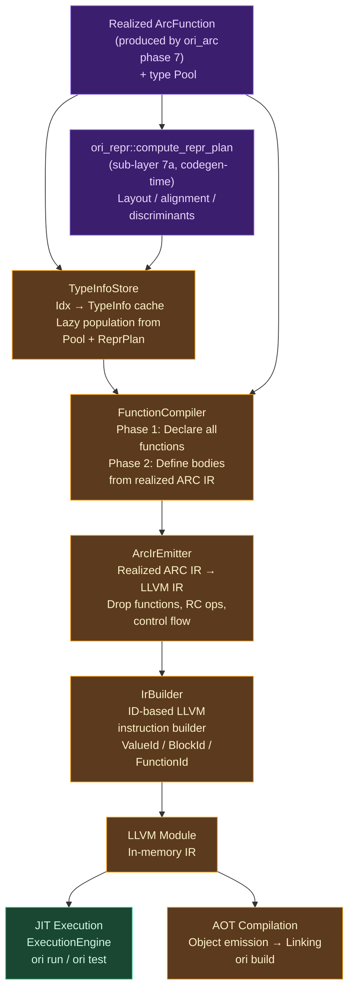
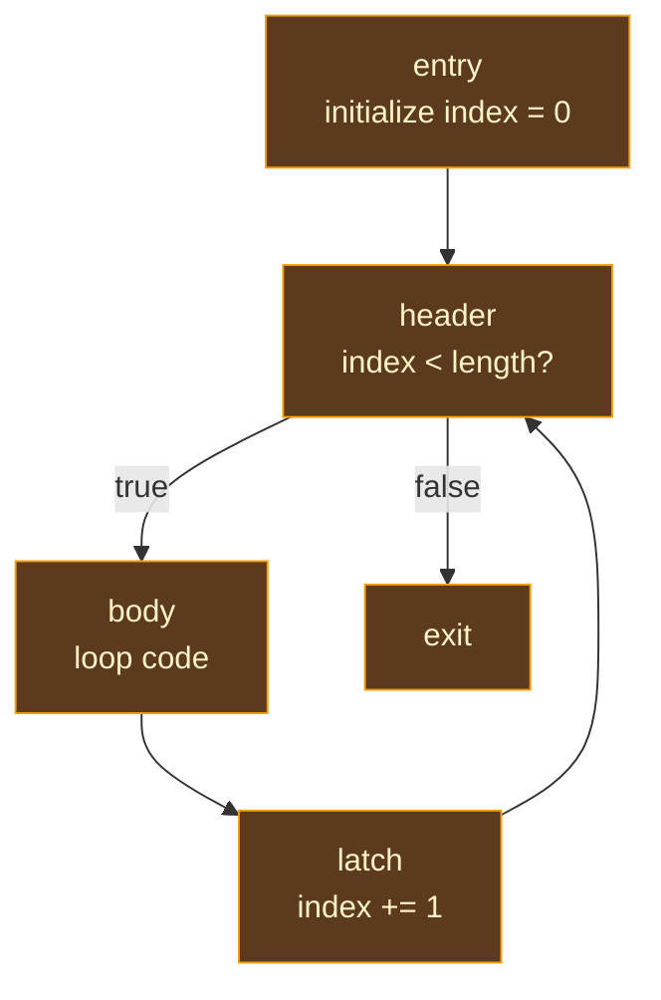

# LLVM Backend Overview

## What Is Code Generation?

A compiler's job is to transform source code into something a machine can execute. The front end — lexer, parser, type checker — understands the *meaning* of a program: its types, its control flow, its invariants. But meaning alone doesn't execute. At some point, the compiler must answer a fundamentally different question: **how do I turn this high-level meaning into instructions that a CPU can run?**

This is the domain of code generation, or *codegen* — the phase where abstract representations become concrete machine operations. A type-checked expression like `a + b` must become a sequence of assembly instructions: load `a` into a register, load `b` into another register, add them, store the result. A function call must become a calling convention: push arguments in the right order, jump to the callee's address, retrieve the return value. A struct must become a memory layout: which field is at which byte offset, how much padding is needed for alignment.

### Classical Approaches to Code Generation

The history of code generation is a progression from direct, bespoke code emitters to layered, reusable infrastructure.

**Direct code emission** is the oldest approach. The compiler walks its internal tree and directly emits machine instructions — x86 opcodes, ARM instructions, whatever the target demands. Early C compilers worked this way, and some modern compilers still do for simple targets. The advantage is simplicity and control; the disadvantage is that every optimization must be implemented by the compiler author, every target architecture requires a complete rewrite of the backend, and the resulting code quality depends entirely on the compiler team's expertise with each target.

**Bytecode compilation** emits instructions for a virtual machine rather than a physical CPU. Java's JVM bytecode, Python's CPython bytecode, and .NET's CIL are the canonical examples. The bytecode format serves as a portable intermediate representation that can run on any platform with a compatible VM. The tradeoff is runtime overhead — the VM must interpret or JIT-compile the bytecode before it becomes native instructions.

**Compiler infrastructure frameworks** provide a reusable backend that handles optimization, register allocation, instruction selection, and code emission for multiple target architectures. The compiler author translates their language's IR into the framework's IR, and the framework does the rest. [GCC](https://gcc.gnu.org/)'s RTL (Register Transfer Language) was the first widely successful example, enabling GCC to target dozens of architectures with shared optimization passes. [LLVM](https://llvm.org/) refined this model with a more principled IR, better optimization infrastructure, and a modular library design that allows compilers to use exactly the pieces they need.

**LLVM** (originally "Low Level Virtual Machine," now just a proper name) provides a typed, SSA-form intermediate representation with a rich optimization pipeline and code generators for x86, ARM, AArch64, RISC-V, WebAssembly, and many other targets. A language compiler translates its own IR into LLVM IR, and LLVM handles everything from dead code elimination to register allocation to instruction scheduling. [Rust](https://github.com/rust-lang/rust) (via `rustc_codegen_llvm`), [Swift](https://github.com/apple/swift), [Julia](https://github.com/JuliaLang/julia), [Zig](https://github.com/ziglang/zig), [Haskell](https://gitlab.haskell.org/ghc/ghc) (GHC's LLVM backend), and dozens of other languages use LLVM for native code generation. The LLVM ecosystem has become the de facto standard for new language implementations that need competitive native code quality without building a backend from scratch.

### Where Ori Sits

Ori uses LLVM as its native code generation backend. The `ori_llvm` crate translates Ori's internal representation into LLVM IR, which LLVM then optimizes and compiles to native machine code. This provides:

- **Production-quality code** — LLVM's optimization passes (constant propagation, loop unrolling, vectorization, inlining, global value numbering) produce code competitive with GCC and hand-tuned assembly
- **Multi-target support** — a single codegen implementation targets x86-64, AArch64, WebAssembly, and any other LLVM-supported architecture
- **JIT and AOT** — the same LLVM module can be executed immediately in-process (JIT for `ori run`) or compiled to an object file for linking into a native executable (AOT for `ori build`)

But Ori's LLVM backend is not a straightforward AST-to-LLVM translator.

AIMS sits upstream of physical-executor selection and freezes one ownership,
lifetime, cleanup, and effect plan for every executor. LLVM receives one
validated projection of that shared artifact, so the
[AIMS pipeline](../09-aims/index.md) shapes this backend without belonging to
it or terminating here.

## What Makes Ori's LLVM Backend Distinctive

### Projecting the Shared AIMS Plan

Most compilers that use LLVM translate their high-level IR directly into LLVM IR. Rust lowers its MIR (Mid-level IR) to LLVM IR. Swift lowers its SIL (Swift Intermediate Language) to LLVM IR. Zig lowers its AIR (Analyzed Intermediate Representation) to LLVM IR. In each case, there is a relatively direct correspondence between the compiler's own IR and the LLVM instructions that result.

Ori takes a different path. **Ordinary function bodies** — user-defined functions, closures, and lowered control flow — are first lowered from canonical IR to ARC IR by the `ori_arc` crate, and only then translated to LLVM IR by the `ArcIrEmitter`. The LLVM backend never sees high-level expressions like `a + b` or `if x then y else z` for these functions — it sees basic blocks with explicit reference counting instructions, ownership annotations, and reuse tokens.

**Derived trait methods** (`Eq`, `Clone`, `Debug`, `Printable`, `Default`, `Comparable`, `Hashable`) currently take a separate direct-codegen path: `compiler/ori_llvm/src/codegen/derive_codegen/` generates LLVM IR structurally from `TypeRegistry` metadata, bypassing canonical IR and ARC IR.

> **Current gap — direct derive codegen.** The direct path is a truthful description of the shipped LLVM backend, not the production architecture. It leaves the VM without the same derived body and allows ownership-sensitive behavior to exist outside the shared AIMS carrier. Production convergence must synthesize derived semantics once as a typed body or executable operation, pass it through the shared ownership plan, and leave LLVM responsible only for physical emission.

The ordinary-function managed pipeline still eliminates an entire class of bugs that plague fully-dual-path backends for hand-written code: one consistent instruction-selection, calling-convention, and RC-lifecycle surface for every user-written function. The direct derive-codegen surface is narrow and trait-family scoped, with its own test suite.

### ID-Based LLVM Abstraction

LLVM's C++ API, and its Rust binding [inkwell](https://github.com/TheDan64/inkwell), use raw pointers with complex lifetime relationships. An LLVM `Value` is valid only as long as its containing `Module` and `Context` exist. Rust's borrow checker makes this safe but verbose — every function that manipulates LLVM values must thread lifetime parameters through its signature.

Ori's `IrBuilder` wraps inkwell with **opaque ID types**: `ValueId`, `BlockId`, `FunctionId`, and `LLVMTypeId`. These are `u32` newtypes that index into internal arenas. The IDs are `Copy`, require no lifetime parameters, and can be freely stored, passed, and compared. This is the same arena+ID pattern used throughout the rest of the compiler (for expressions via `ExprId`, types via `Idx`, interned strings via `Name`), extended to the LLVM layer.

The trade-off is an extra indirection on every LLVM operation — but the payoff is that higher-level code (the ARC emitter, builtin handlers, drop function generators) can work with simple value types instead of fighting inkwell's lifetime requirements.

### Two-Phase Compilation with Nounwind Projection

LLVM requires that a function be declared before it can be called. In a language like C, forward declarations handle this explicitly. Ori has no forward declaration syntax — any function can call any other function in the same module, including mutual recursion.

The backend solves declaration ordering with two phases: first declare all functions (computing their ABI and LLVM signatures), then define all function bodies.

Unwind behavior is not an LLVM-owned analysis. AIMS freezes each function's backend-neutral control-effect facts in the executable artifact; LLVM projects a proven non-unwinding fact to the `nounwind` attribute and chooses `call` or `invoke` mechanically.

The shipped LLVM path still performs a local fixed-point call-graph scan between declaration and definition. That scan is a migration gap, not a second source of semantic truth: it must be replaced by validation of the bound executable artifact.

A missing, stale, or incomplete AIMS fact fails closed to the unwinding path. This preserves cleanup correctness while keeping the optimization available to LLVM, native, compiled-WASM, and JIT projections without asking any backend to re-analyze the program.

### EmittedValue: Tagged Representation Through the Pipeline

A pervasive problem in LLVM codegen is tracking what a value *means* at the machine level. Is this `ValueId` a register-width integer? A pointer to an RC-managed heap allocation? A stack-allocated aggregate? The answer determines how to pass it to a function, how to increment its reference count, and whether loading it from memory requires a single instruction or a multi-field GEP sequence.

Ori's `EmittedValue` enum carries this representation information alongside every LLVM value:

| Variant | What It Means | Example |
|---------|---------------|---------|
| `Immediate` | Register-width scalar | `int`, `float`, `bool`, `byte` |
| `RcPointer` | Pointer to RC-managed heap object | Struct/enum instances |
| `Aggregate` | Stack-allocated LLVM struct value | Tuples, small structs, Option/Result |
| `Pair` | Two separate values | `str` (len + ptr), closures (fn_ptr + env_ptr) |
| `ZeroSized` | No payload | `void`, `Never`, unit structs |

The distinction matters everywhere. Incrementing an `Immediate(i64)` is a no-op; incrementing an `RcPointer` calls `ori_rc_inc`. Passing an `Aggregate` to a function uses LLVM's aggregate passing; passing a `Pair` requires splitting and rejoining at call boundaries. By making the representation explicit in the type system, the emitter catches mismatches at compile time rather than generating subtly wrong IR.

## Architecture

The LLVM backend is organized around a linear pipeline where each stage feeds the next:

- `ori_llvm`'s production architectural input is a validated
  `ExecutableProgram` plus `CompiledLayoutPlan(TargetSpec)`.
- `ori_arc` owns Canon → ARC Lower → AIMS Analyze → ARC Realize and freezes logical facts.
- Representation analysis supplies neutral evidence; the compiled planner owns physical layout/ABI.
- LLVM owns only faithful encoding and LLVM-private optimization.

The LLVM projection consumes those results and may not rerun either policy. The subgraph below shows that target seam:

> **Current gap — pipeline orchestration inside `ori_llvm`.** The shipped `FunctionCompiler` still accepts `CanId`/`CanonResult` and calls `ori_arc::run_arc_pipeline` from `function_compiler/shared_seam.rs` before invoking `ArcIrEmitter`. The analysis implementation is shared rather than duplicated, but the dependency direction is not yet the production seam. Convergence moves orchestration above `ori_llvm` and passes a closed realized carrier into both VM and compiled projections.

### Key Types and Their Roles

**SimpleCx** is the minimal LLVM context wrapper. It holds the inkwell `Context`, the LLVM `Module`, and pre-constructed common types (`i64`, `f64`, `i1`, `i8`, `i32`, void, pointer). Following [rustc_codegen_llvm](https://github.com/rust-lang/rust/tree/master/compiler/rustc_codegen_llvm)'s pattern, it is a thin reference holder with no complex logic — a bag of LLVM handles that every other component borrows from.

**TypeInfoStore** is a lazily-populated cache from type pool indices (`Idx`) to `TypeInfo` variants. Indices 0–63 are pre-populated for primitive types; dynamic types (user structs, enums, generics) are computed on first access by reading the type checker's `Pool`. The store uses `RefCell` for interior mutability — multiple components need read access while occasionally triggering lazy population.

**TypeLayoutResolver** bridges `TypeInfoStore` and `SimpleCx` to produce LLVM `BasicTypeEnum` values from `Idx`. It handles recursive types via LLVM's named struct forward references: a struct that contains itself (through `Option<Self>` or similar) gets a named opaque struct declared first, then its body set afterward. Resolved types are cached for performance.

**IrBuilder** is the ID-based instruction builder that wraps inkwell. It maintains a `ValueArena` of all LLVM values, types, blocks, and functions, returning `Copy` ID handles. Methods are organized by category: constants, memory, arithmetic, comparisons, conversions, control flow, aggregates, calls, and PHI/type/block operations. It also tracks codegen errors (type mismatches during IR construction) and supports the `codegen_errors` diagnostic.

**FunctionCompiler** orchestrates the two-phase LLVM projection. Before construction, `oric` closes and validates one backend-neutral `ExecutableProgram`; the constructor cannot accept an arbitrary AIMS contract map, and `bind_executable_program` is the only production binding seam. In Phase 1, it walks artifact-backed functions, computes their `FunctionAbi` (parameter passing conventions, sret returns, calling convention), and declares LLVM functions. The shipped path still runs an LLVM-local nounwind scan between phases; that duplicated effect analysis is migration debt. In Phase 2, it reads exact post-AIMS bodies and facts from the bound artifact and emits them via `ArcIrEmitter`. Its production responsibilities are artifact validation, LLVM declaration, ABI and attribute projection, and mechanical body emission—never AIMS invocation or ownership reclassification.

**ArcIrEmitter** is the core translation engine. It maps ARC IR variables to LLVM values (`ArcVarId` → `ValueId`), ARC IR blocks to LLVM basic blocks (`ArcBlockId` → `BlockId`), and walks each block's instructions in RPO (Reverse Post-Order) order, emitting LLVM IR. It caches drop functions, element RC callbacks, comparison thunks, and equality thunks per type. Every instruction type — `Apply`, `Construct`, `Project`, `RcInc`, `RcDec`, `IsShared`, `Reuse` — has a dedicated emission method in one of its submodules.

## Type Mappings

Ori types map to LLVM types through the `TypeInfo` system. These are **canonical** mappings — the type as it appears in memory at the LLVM level:

| Ori Type | LLVM Type | Bytes | Notes |
|----------|-----------|-------|-------|
| `int` | `i64` | 8 | Signed, range [-2^63, 2^63 - 1] |
| `float` | `f64` | 8 | IEEE 754 double-precision |
| `bool` | `i1` | 1 | 1-bit boolean |
| `byte` | `i8` | 1 | Unsigned, range [0, 255] |
| `char` | `i32` | 4 | Unicode code point |
| `Duration` | `i64` | 8 | Nanoseconds |
| `Size` | `i64` | 8 | Bytes |
| `Ordering` | `i8` | 1 | -1 / 0 / 1 |
| `str` | `{ i64, ptr }` | 16 | Length + data pointer |
| `[T]` | `{ i64, i64, ptr }` | 24 | Length, capacity, data pointer |
| `{K: V}` | `{ i64, i64, ptr }` | 24 | Uniform collection layout |
| `Set<T>` | `{ i64, i64, ptr }` | 24 | Uniform collection layout |
| `Option<T>` | `{ i8, T }` | 1 + T | Tag (0=None, 1=Some) + payload |
| `Result<T, E>` | `{ i8, payload }` | 1 + max(T, E) | Tag (0=Ok, 1=Err) + payload |
| `(A, B, ...)` | `{ A, B, ... }` | sum | Anonymous LLVM struct |
| User struct | `{ field1, field2, ... }` | sum | Named LLVM struct |
| User enum | `{ i8, i64 }` | 9 | Tag + max variant payload |
| Closure | `{ ptr, ptr }` | 16 | Fat pointer: fn_ptr + env_ptr |
| `Iterator<T>` | `ptr` | 8 | Opaque heap-allocated handle |
| `Range` | `{ i64, i64, i64, i64 }` | 32 | start, end, step, inclusive |

A key design choice is the **uniform collection layout**: lists, maps, and sets all use the same `{ i64, i64, ptr }` triple. The `ptr` field points to the actual data (an array for lists, parallel arrays for maps, a hash table for sets), while `len` and `cap` have type-specific meanings. This uniformity simplifies the ABI — collection-typed parameters always pass the same way — at the cost of some type information being implicit rather than structural.

## Compilation Modes

### JIT Compilation

JIT execution compiles and runs code immediately in the same process. The `OwnedLLVMEvaluator` orchestrates the full pipeline: parse → type check → canonicalize → lower to ARC IR → emit LLVM IR → create `ExecutionEngine` → call the function. This path is used for `ori run --compile` (JIT backend) and explicit JIT-backend test runs; **default `ori run` and `ori test` use the tree-walking interpreter** (`Backend::Interpreter` — see `compiler/oric/src/main.rs:112` and `compiler/oric/src/test/runner/mod.rs:65`).

The JIT mode uses `setjmp`/`longjmp` for panic recovery — when an Ori `panic()` fires at runtime, control returns to the JIT harness rather than crashing the compiler process. After execution, the evaluator checks for ARC leaks by comparing live allocation counts before and after.

### AOT Compilation

AOT compilation generates native executables, static libraries, shared libraries, or WebAssembly modules. It shares the same codegen pipeline as JIT — the LLVM module is identical — but adds target configuration, optimization passes, object file emission, debug information generation, and platform-specific linking. See [AOT Compilation](aot.md) for the full treatment.

## Compilation Phases

### Phase 1: Declaration

All functions are declared before any are defined. The compiler walks every function signature, computes its `FunctionAbi` (how parameters are passed, whether the return value uses sret, which calling convention to use), and emits an LLVM function declaration. This enables mutual recursion without forward declaration syntax — any function can call any other function in the same module.

User-defined types are also registered in this phase. The `register_user_types()` function eagerly resolves each `TypeEntry` from the type checker through the `TypeLayoutResolver`, creating named LLVM struct types in the module. Generic types are skipped — they are resolved later during monomorphization when concrete type arguments are known.

### Nounwind Projection and the Current Local-Scan Gap

The production contract carries a closed AIMS effect fact for every function and typed runtime operation. A function may receive LLVM `nounwind` only when that bound artifact proves that the function and every reachable operation cannot unwind.

Runtime declarations contribute neutral `may_unwind` facts through their typed operation descriptors; the LLVM declaration table merely projects those facts to ABI attributes.

The shipped backend still reconstructs this closure with a fixed-point scan over its declared functions and an LLVM-local runtime table. That behavior is retained here as an implementation observation, but it is not architectural authority.

Convergence removes the scan, validates exact artifact identity and coverage, and projects `call` only for a proven non-unwinding callee; every other call uses `invoke` with the shared `ExecutableDropPlan` cleanup obligations. Eliminating unnecessary landing pads then remains an LLVM optimization, while the proof and cleanup policy stay shared.

### Phase 2: Definition

Ordinary function bodies enter the single closed-program AIMS realization upstream in `oric`; `FunctionCompiler` receives the resulting bound artifact and cannot invoke the calculus. Every other physical executor must receive that same artifact identity. Derived bodies remain the explicit convergence gap described above until their semantics and ownership obligations are represented in the shared batch.

The shipped `run_arc_pipeline()` entry point enforces AIMS ordering inside the shared crate. Its unified analysis computes the complete product state before realization freezes logical ownership, reuse, COW, and drop operations. LLVM then applies a validated compiled physical plan; the current carrier's `Rc*` spellings do not make counter selection part of AIMS.

## Control Flow Compilation

### Short-Circuit Operators

Logical `&&` and `||` operators use short-circuit evaluation with proper basic block structure. For `left && right`, the compiler emits: evaluate `left`, branch on the result — if false, skip to the merge block with `false`; if true, evaluate `right` and branch to the merge block with the result. A PHI node at the merge selects between the two incoming values. The implementation handles the edge case where the right operand may terminate (for example, `condition && panic("fail")`), in which case no merge edge is added from the right block.

### Conditionals

If/else expressions create three basic blocks: `then`, `else`, and `merge`. Both branches evaluate their body, jump to `merge`, and a PHI node selects the result. When a branch terminates (via panic, break, or diverging control flow), it skips the merge jump — the PHI only receives an incoming value from the non-terminating branch.

### Loops

Loop compilation creates structured basic blocks with dedicated roles:

**Infinite loops** (`loop { ... }`) use a three-block structure: `header` → `body` → back-edge to `header`, with an `exit` block reached via `break`.

**For loops** use a four-block structure with a dedicated **latch** block:

The latch block is critical: `continue` jumps to the latch (which increments the index and then checks the loop condition), not directly to the header. Jumping to the header without incrementing would create an infinite loop on the same element — a subtle bug that direct-to-header designs encounter.

Loop context tracks continue and exit targets for nested control flow, enabling labeled `break:name` and `continue:name` to jump to the correct block in nested loop structures.

## Runtime Functions

The backend links against `libori_rt`, a C-compatible runtime library that provides operations too complex for inline LLVM IR: heap allocation, reference counting, string manipulation, collection mutations, panic handling, and I/O. All runtime function declarations live in a single `RT_FUNCTIONS` table — roughly 132 functions organized by category:

| Category | Purpose |
|----------|---------|
| Memory | `ori_alloc`, `ori_free`, `ori_realloc` |
| Reference Counting | `ori_rc_alloc`, `ori_rc_free`, `ori_rc_inc`, `ori_rc_dec`, `ori_rc_is_unique` |
| Strings | Concatenation (SSO-aware), comparison, hashing, conversion, character iteration |
| Collections | List/map/set creation, access, COW mutations, slicing |
| Iterators | Construction from list/range/str, next, adapter chaining, drop |
| Panic & Assertions | `ori_panic`, type-specific `assert_eq` variants, panic handler registration |
| Comparison | Integer/float comparison, min/max |
| Formatting | Format spec parsing, interpolation |
| Entry | `ori_run_main`, `ori_args_from_argv` |

The `RT_FUNCTIONS` table serves as a single source of truth — the [codegen verification](codegen-verification.md) system validates that all call sites match the declared signatures, catching argument count mismatches and calling convention errors.

## Prior Art

Ori's LLVM backend draws from several established compiler implementations, each of which influenced different aspects of the design:

**[rustc_codegen_llvm](https://github.com/rust-lang/rust/tree/master/compiler/rustc_codegen_llvm)** (Rust) — Ori's `SimpleCx` follows rustc's pattern of a minimal context wrapper that holds LLVM handles. Rust's codegen also uses a two-phase declare-then-define approach for the same reason: enabling mutual recursion without forward declarations. The key difference is that Rust's codegen lowers MIR (which already has explicit drops and borrow checking) directly to LLVM IR, while Ori interposes an ARC IR layer for its backend-neutral AIMS ownership calculus before selecting a physical plan.

**[Swift SIL](https://github.com/apple/swift/tree/main/lib/SIL)** (Swift) — Swift's compiler lowers to SIL (Swift Intermediate Language) before going to LLVM IR, similar to Ori's ARC IR interposition. Swift's SIL carries ARC operations explicitly (`strong_retain`, `strong_release`), and Swift's SIL optimizer eliminates redundant RC operations before LLVM IR emission. AIMS instead freezes backend-neutral ownership, cleanup, COW/reuse, effect, unwind, and provenance facts over basic-block IR; a counter-selecting Ori plan may then produce analogous physical operations.

**[Lean 4 LCNF](https://github.com/leanprover/lean4/tree/master/src/Lean/Compiler/LCNF)** (Lean) — Lean's compiler lowers to LCNF (Lambda Calculus Normal Form) and then to C code (not LLVM IR directly). Lean's RC insertion algorithm (Perceus-inspired, like Ori's) operates on LCNF, and Lean's borrow inference is interprocedural — the same approach Ori uses. Ori adopted Lean's SCC-based borrow analysis and adapted it for a different target IR.

**[Zig's codegen](https://github.com/ziglang/zig/blob/master/src/codegen/llvm.zig)** (Zig) — Zig's self-hosted compiler generates LLVM IR from its AIR (Analyzed Intermediate Representation). Zig's approach is notable for its aggressive use of comptime evaluation to reduce the work the LLVM backend must do. Ori's canonical IR serves a similar purpose — constant folding, desugaring, and pattern compilation happen before LLVM ever sees the program.

**[GHC's LLVM backend](https://gitlab.haskell.org/ghc/ghc/-/tree/master/compiler/GHC/CmmToLlvm)** (Haskell) — GHC lowers Cmm (C minus minus, its low-level IR) to LLVM IR. GHC's approach is instructive as a "how to bridge a high-level functional language to LLVM" case study, but GHC uses a tracing garbage collector rather than reference counting, so the memory management story is fundamentally different.

**[Julia's codegen](https://github.com/JuliaLang/julia/tree/master/src)** (Julia) — Julia uses LLVM for both JIT and AOT compilation, similar to Ori. Julia's approach to the JIT/AOT duality — same codegen pipeline, different execution model — directly influenced Ori's design of sharing a single LLVM module path between `ori run` (JIT) and `ori build` (AOT).

## Design Tradeoffs

**ARC IR interposition vs. direct lowering.** Routing ordinary bodies through ARC IR adds a compilation step — canonical IR must be lowered to basic blocks before physical projection. A direct LLVM lowering would duplicate ownership policy. Ori's production architecture requires one AIMS calculus because a missing logical release can leak and an extra one can permit premature cleanup; each physical plan must then prove exact satisfaction. The current derived-method bypass above remains a gap until it enters that same carrier.

**ID-based builder vs. direct inkwell.** The `IrBuilder`'s ID abstraction adds an indirection on every LLVM operation. Direct inkwell usage would be slightly faster at compile time but would thread lifetime parameters through every function signature in the backend. Ori chose IDs because the complexity reduction in higher-level code (the ARC emitter, builtin handlers, drop generators) outweighs the per-operation overhead of arena lookups.

**Nounwind projection vs. conservative invoke.** The shared AIMS effect closure avoids forcing every compiled call through `invoke`. LLVM's projection is cheap: validate the function identity and emit `call` only for a proven non-unwinding callee. The shipped LLVM-local fixed point duplicates ownership-adjacent semantic analysis and is therefore a migration gap, even when it reaches the same answer.

**Uniform collection layout vs. specialized types.** Using `{ i64, i64, ptr }` for all collections simplifies the ABI but means the LLVM type system cannot distinguish a list from a map at the IR level. A more precise type mapping (different LLVM struct types for different collection kinds) would enable LLVM to catch certain errors and might enable specialized optimizations. Ori chose uniformity because the runtime already handles the distinction (the `ptr` field points to different backing structures), and the ABI simplification reduces the surface area for calling convention bugs.

**JIT via LLVM vs. bytecode and tiered JIT.** LLVM JIT provides production-quality code but has high startup latency. The bytecode VM now supplies the strict interpreted physical path, while LLVM JIT remains valuable for native-code verification. A future hot tier may compile selected VM regions, but it must consume the same post-AIMS ownership plan; tiering is not permission to fork semantic or memory analysis.

## Chapter Guide

This chapter covers the LLVM backend in depth:

- [AOT Compilation](aot.md) — Target configuration, symbol mangling, object emission, linking, optimization, WebAssembly, debug information, and incremental compilation
- [Closures](closures.md) — Fat pointer representation, environment capture, calling conventions, and drop function generation for closure environments
- [User-Defined Types](user-types.md) — TypeInfo system, struct layout, type registration, impl block compilation, and method dispatch
- [ARC Emitter](arc-emitter.md) — ARC IR to LLVM IR translation, RPO block emission, EmittedValue, RC operation patterns, and terminator emission
- [Builtins Codegen](builtins-codegen.md) — Inline LLVM IR generation for built-in methods, the `declare_builtins!` macro, and sync testing
- [Codegen Verification](codegen-verification.md) — In-pipeline audit system for RC balance, COW sequencing, ABI conformance, and safety check density
