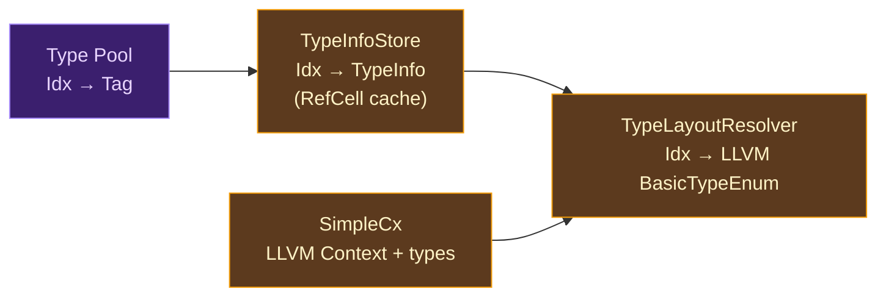

# User-Defined Types

## From Types to Memory Layouts

A type system operates in the realm of meaning: `Point { x: int, y: int }` describes a value with two integer fields. But a CPU knows nothing about types — it operates on bytes at addresses. Between the type checker's abstract understanding and the machine's concrete memory lies a translation problem: **how do you turn a type description into a memory layout that the CPU can efficiently access?**

This problem has been studied since the earliest compilers. FORTRAN (1957) laid out arrays in contiguous memory with computed offsets. C (1972) introduced the struct layout algorithm that most languages still use: fields are placed sequentially with alignment padding, and the struct's alignment is the maximum of its fields' alignments. The C layout model became so dominant that it is literally called "C layout" — and virtually every language that interoperates with C must support it.

### The Layout Design Space

Modern compilers face several layout decisions for user-defined types:

**Field ordering** — should fields be laid out in declaration order (C, Rust by default) or reordered to minimize padding (Rust with `#[repr(Rust)]`, Go)? Declaration order is predictable and ABI-stable; reordering saves memory but makes the layout compiler-dependent.

**Tagged unions** — how do you represent sum types (`A | B | C`)? A discriminant tag (Rust, Swift, Haskell) identifies which variant is active. The tag can be a separate field (simple but wastes space) or encoded within the payload (niche optimization — Rust uses this for `Option<&T>`, encoding `None` as the null pointer). C uses untagged unions, requiring the programmer to track the active variant.

**Pointer indirection** — should the struct's fields be inline (the struct *is* its fields, allocated wherever the variable lives) or behind a pointer (the variable holds a pointer to a heap-allocated object)? Inline is faster for access (no pointer chase) but makes copying expensive for large types. Pointer indirection makes copying cheap (copy the pointer) but adds heap allocation and cache misses.

**RC integration** — for languages with reference counting, the type layout must account for which fields need RC operations. A struct with an `int` field and a `str` field needs different cleanup behavior than one with two `int` fields. The layout system must provide enough information for the RC system to generate correct drop functions.

### Where Ori Sits

Ori uses **inline struct layouts** with **declaration-order fields** and **separate discriminant tags** for sum types. Structs are LLVM named structs with fields at their native types. Enums use a `{ i8, max_payload }` representation with a one-byte tag. RC information flows from the type system (via `TypeInfo`) to the ARC pipeline (via `ArcClass` classification) to the LLVM backend (via drop function generation).

The key architectural decision is the `TypeInfo` enum — a unified representation that captures both the logical structure of each type and the information needed to generate correct LLVM code for it.

## What Makes Ori's Type Compilation Distinctive

### The TypeInfo Enum: One Representation for All Decisions

Most LLVM backends maintain separate data structures for different concerns: one for type layouts, one for method resolution, one for RC classification. Ori unifies these into a single `TypeInfo` enum with one variant per type category. When the backend needs to know how to lay out a `Point`, how to RC-increment a `[str]`, or how to destructure a `Result<T, E>`, it asks the same `TypeInfo` value.

This unification means that adding a new type category requires exactly one `TypeInfo` variant — not scattered updates across multiple lookup tables. The trade-off is that `TypeInfo` is a large enum, but the benefit is that type-related decisions are centralized.

### Lazy Population with Cycle Detection

The `TypeInfoStore` cache is lazily populated — types are resolved on first access, not eagerly at startup. This matters because the type system supports recursive types: a linked list `type Node = { value: int, next: Option<Node> }` refers to itself. Eager resolution would loop infinitely.

The lazy approach handles cycles through LLVM's named struct mechanism: a named opaque struct is created first (just a name, no body), then its body is set afterward. If the type refers to itself (through `Option<Self>` or similar), the reference resolves to the already-created named struct. The `TypeLayoutResolver` tracks which types are currently being resolved to detect cycles and insert forward references.

### Eager Registration Before Compilation

While `TypeInfo` resolution is lazy, type *registration* is eager. Before any function body is compiled, `register_user_types()` iterates over all `TypeEntry` values from the type checker and resolves each through the `TypeLayoutResolver`. This ensures that all named struct types exist in the LLVM module before any function might reference them.

Generic types are skipped during registration — a `Stack<T>` has no concrete LLVM layout until `T` is known. Generic instantiations are resolved during monomorphization, when the concrete type arguments are available.

## The TypeInfo System

### TypeInfo Variants

Each Ori type category maps to a `TypeInfo` variant:

| TypeInfo Variant | Ori Types | LLVM Representation |
|-----------------|-----------|---------------------|
| `Int` | `int` | `i64` |
| `Float` | `float` | `f64` |
| `Bool` | `bool` | `i1` |
| `Byte` | `byte` | `i8` |
| `Char` | `char` | `i32` |
| `Str` | `str` | `{ i64, ptr }` |
| `Duration` | `Duration` | `i64` |
| `Size` | `Size` | `i64` |
| `Ordering` | `Ordering` | `i8` |
| `Void` / `Never` | `void`, `Never` | void / unreachable |
| `List { element }` | `[T]` | `{ i64, i64, ptr }` |
| `Map { key, value }` | `{K: V}` | `{ i64, i64, ptr }` |
| `Set { element }` | `Set<T>` | `{ i64, i64, ptr }` |
| `Tuple { elements }` | `(A, B, ...)` | `{ A, B, ... }` |
| `Option { inner }` | `Option<T>` | `{ i8, T }` |
| `Result { ok, err }` | `Result<T, E>` | `{ i8, max(T, E) }` |
| `Struct { fields }` | User structs | `{ field1, field2, ... }` |
| `Enum { variants }` | User enums | `{ i8, max_payload }` |
| `Function { params, ret }` | `(P) -> R` | `{ ptr, ptr }` |
| `Iterator { item }` | `Iterator<T>` | `ptr` |
| `Range` | `Range` | `{ i64, i64, i64, i64 }` |

Each variant carries the information needed for downstream decisions: `List { element: Idx }` stores the element type's pool index, which the ARC system uses to generate element-level RC callbacks. `Struct { fields: Vec<(Name, Idx)> }` stores field names and types, which drop function generation uses to walk and decrement RC-managed fields.

### TypeInfoStore

The `TypeInfoStore` is a lazily-populated cache from `Idx` (type pool index) to `TypeInfo`:



Indices 0–63 are pre-populated for primitive types — these are always the same regardless of the program being compiled. Dynamic types (index 64 and above) are resolved on first access by reading the `Pool`'s `Tag` for that `Idx` and constructing the appropriate `TypeInfo` variant. Interior mutability via `RefCell` allows multiple components to share a reference to the store while still allowing lazy population.

### TypeLayoutResolver

The `TypeLayoutResolver` bridges `TypeInfoStore` and `SimpleCx` to produce concrete LLVM types. It combines type information (from the store) with LLVM type constructors (from the context) to resolve `Idx` → `BasicTypeEnum`.

For recursive types, the resolver uses LLVM's **named struct forward reference** pattern:
1. Create a named opaque struct: `%Node = type opaque`
2. Resolve the struct's fields (which may reference `%Node` through `Option<Node>`)
3. Set the struct's body: `%Node = type { i64, { i8, %Node* } }`

The forward reference allows the self-reference to resolve without infinite recursion. Resolved types are cached, so subsequent lookups are O(1).

## Struct Type Registration

Before function bodies are compiled, user-defined types must be registered with the LLVM module. This is driven by the type checker's `TypeEntry` output.

### Registration Flow

1. The type checker produces a list of `TypeEntry` values, each describing a user-defined type: its name, kind (struct, enum, newtype), fields, and type pool index.

2. The `LLVMEvaluator` creates a `TypeInfoStore` (backed by the type checker's `Pool`) and a `TypeLayoutResolver` (combining the store with `SimpleCx`).

3. `register_user_types()` iterates over `TypeEntry` values and eagerly resolves each through the `TypeLayoutResolver`. This creates named LLVM struct types in the module and populates the cache.

Generic types (those with non-empty `type_params`) are skipped during registration. A `Stack<T>` has no concrete layout — `Stack<int>` and `Stack<str>` have different field types. These are resolved during monomorphization when the compiler encounters a concrete instantiation.

## Impl Block Compilation

Impl blocks define methods for types. In the LLVM backend, methods are compiled as standalone functions — there is no vtable or method table for concrete types.

### Compilation Flow

Impl block methods are compiled alongside module functions, following the same two-phase pattern:

1. **Phase 1 (Declaration)**: Each method is declared as an LLVM function with its computed ABI. The method's mangled name encodes the type and method name (e.g., `Point.distance` → `_ori_Point$distance`).

2. **Phase 2 (Definition)**: Each method body is lowered through the ARC pipeline and emitted as LLVM IR via `ArcIrEmitter`. The method's `self` parameter is passed as the first argument, following the same calling convention as any other function parameter.

Methods are compiled as regular functions because Ori uses static dispatch for concrete types — the compiler knows the exact type at every call site. Dynamic dispatch only occurs through trait objects, which are handled separately by the trait system.

## Method Call Compilation

Method calls are resolved during type checking and canonicalization, long before they reach the LLVM backend. By the time the backend sees them, method calls are just function calls with the receiver as the first argument.

### Dispatch Order

The LLVM backend resolves method calls through a multi-tier strategy:

1. **Built-in methods** — type-specific inline codegen handled by the [builtins system](builtins-codegen.md). Methods like `list.len()`, `str.contains()`, and `int.abs()` emit specialized LLVM IR without function call overhead. This is checked first because built-in methods are the most common and most performance-sensitive.

2. **Type-qualified lookup** — the receiver type's name and method name are combined to look up a declared LLVM function. For example, `point.distance()` looks up `_ori_Point$distance` in the method function map.

3. **Bare-name fallback** — if no type-qualified function is found, the method name alone is checked against the function map. This handles cases where the method was registered without type qualification.

4. **LLVM module lookup** — as a last resort, the emitter searches for a function by name directly in the LLVM module. This handles runtime functions that were declared but not registered in the function map.

### Method Call ABI

When a method call has ABI information (computed during function declaration), the emitter uses ABI-aware parameter passing:

- **Direct** — register-sized values passed in registers
- **Indirect** — large values passed via pointer (caller allocates stack space)
- **Reference** — borrowed values passed as pointers without ownership transfer
- **Sret** — large return values written to a caller-provided buffer (hidden first parameter)

The receiver is always the first argument, followed by the method's explicit parameters.

## Field Access

Field access on structs is resolved during ARC lowering, before it reaches LLVM codegen. The ARC lowering pass translates high-level field access (`point.x`) into explicit `Project` instructions that carry the field index directly:

```
Project { dst: v2, ty: int_idx, src: v1, field: 0 }
```

In the LLVM backend, this becomes an `extract_value` operation on the LLVM struct value at the field's index. The field index is known at compile time (determined by declaration order), so field access is a single LLVM instruction with no runtime lookup.

For nested field access (`state.position.x`), each level produces a separate `Project` instruction. The ARC pipeline handles ownership correctly at each level — if `position` is shared, it gets an `RcInc` before the projection.

## Enum Representation

Sum types (enums with variants) use a tag-plus-payload representation:

| Component | LLVM Type | Purpose |
|-----------|-----------|---------|
| Tag | `i8` | Variant discriminant (0, 1, 2, ...) |
| Payload | `i64` (or max variant size) | Data for the active variant |

The payload is sized to the largest variant. A variant with no data still occupies the payload space (it is simply unused). This is the simplest tagged union representation — it wastes space when variants have different sizes but avoids the complexity of overlapping layouts.

For RC operations, enum values require tag-based dispatch: the `RcDec` path generates a switch on the discriminant, with one arm per variant. Each arm decrements only the RC fields present in that variant. For example, an enum with `Some(value: str)` and `None` has a dec path that decrements the `str` in the `Some` arm and does nothing in the `None` arm.

## Prior Art

**[Rust](https://github.com/rust-lang/rust)** — Rust's type layout system is the most direct influence on Ori's approach. Rust uses named LLVM struct types, supports recursive types via forward references, and computes layouts lazily during codegen. Rust goes further with niche optimization: `Option<&T>` uses the null pointer as `None`, eliminating the tag entirely. Ori does not currently implement niche optimization — all `Option<T>` values carry an explicit `i8` tag.

**[Zig](https://github.com/ziglang/zig)** — Zig's `InternPool` serves a similar purpose to Ori's `TypeInfoStore` + `Pool` combination: mapping type indices to concrete representations. Zig's approach is more tightly integrated with its comptime system, where type layouts are computed as part of compile-time evaluation. Ori separates type checking (which produces `Pool` entries) from layout computation (which produces `TypeInfo` and LLVM types).

**[Swift](https://github.com/apple/swift)** — Swift's type metadata system is more dynamic than Ori's. Swift generates runtime type metadata (witness tables, value witness tables) that describe type layouts at runtime, enabling generic code to work with types whose layouts aren't known at compile time. Ori's approach is fully static — all type layouts are resolved at compile time, and generic code is monomorphized.

**[GHC](https://gitlab.haskell.org/ghc/ghc)** (Haskell) — GHC's "info table" system attaches layout information to every heap object. Each object carries a pointer to its info table, which describes the object's type, GC traversal behavior, and entry code. This is conceptually similar to Ori's drop function pointer in closure environments, but generalized to all heap objects. Ori's approach is more specialized — only closure environments carry drop pointers; other types use statically-generated drop functions looked up by type.

**[Go](https://github.com/golang/go)** — Go reorders struct fields to minimize padding (unlike C's declaration-order guarantee). Go's type system also uses interface tables (itables) for dynamic dispatch, where each (concrete type, interface) pair gets a runtime-generated dispatch table. Ori uses static dispatch for concrete types and reserves dynamic dispatch for explicit trait objects.

## Design Tradeoffs

**Lazy TypeInfo vs. eager resolution.** Lazy population avoids resolving types that are never used (which matters for large programs with many types), but it requires thread-safe interior mutability (`RefCell`) and cycle detection logic. Eager resolution would be simpler but would waste time on unused types and would need a separate mechanism for recursive types.

**Inline structs vs. pointer indirection.** Ori lays out struct fields inline — a `Point { x: int, y: int }` is 16 bytes of contiguous memory, not a pointer to a 16-byte allocation. This is faster for access (no pointer chase, better cache locality) but makes passing large structs by value expensive. The ABI system mitigates this by passing large structs via pointer (indirect passing), but the layout is still inline in memory.

**Fixed tag size vs. niche optimization.** Using a fixed `i8` tag for all enums wastes space when the payload could encode the variant information (like using null for `None` in `Option<&T>`). Niche optimization would save memory but adds significant complexity to the layout algorithm, the codegen, and the ARC system (which must know where the tag is for each type). This is a future optimization opportunity.

**Static dispatch vs. vtables.** Ori compiles method calls as direct function calls, not vtable lookups. This means every concrete method call has zero dispatch overhead but requires monomorphization for generic code. The alternative — vtables for all types, like Java — would enable code sharing across generic instantiations but would add indirect call overhead to every method call.

**Declaration-order layout vs. field reordering.** Ori lays out struct fields in declaration order, like C. Reordering fields to minimize padding (like Rust's default `repr(Rust)`) would reduce memory usage for structs with mixed-size fields, but it would make the layout depend on the compiler's optimization decisions — changing the compiler could change the layout. Declaration order is predictable and simpler to reason about.
