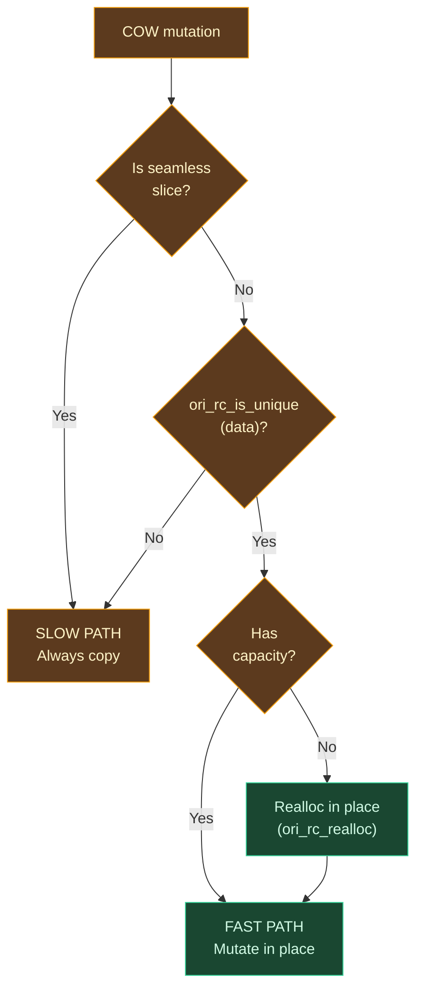
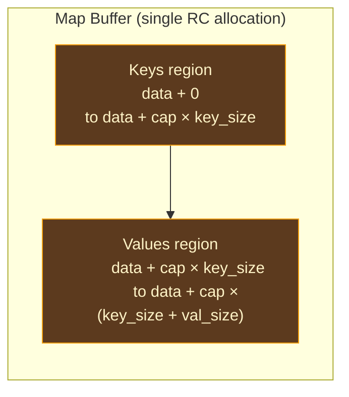

# Collections & COW

## What Is Copy-on-Write?

Copy-on-Write (COW) is a technique that combines the safety of immutable value semantics with the performance of in-place mutation. The idea is simple: when a value has a single owner, mutations happen directly on the data. When a value is shared (multiple references point to the same underlying buffer), mutations first create a private copy, then modify the copy.

The concept originates in operating systems — Unix's `fork()` system call uses COW to share memory pages between parent and child processes, copying a page only when one process writes to it. The technique was adopted by language runtimes when persistent data structures became impractical for performance-critical paths. Swift's standard library collections (`Array`, `Dictionary`, `Set`) all use COW, and the pattern has influenced every ARC-based language since.

For Ori, COW is the mechanism that makes value semantics practical. Without COW, every mutation of a list would require copying the entire buffer — O(n) for every push, every index assignment, every sort. With COW, the common case (unique owner) is O(1), and the copy only happens when the data is actually shared. The AIMS analysis pass works to ensure that the common case *is* the unique-owner case, by eliminating unnecessary reference count increments and inferring borrowed parameters. But the runtime must handle both paths correctly.

### The Uniqueness Test

The foundation of COW is a single question: **is this the only reference to this buffer?**

The answer comes from `ori_rc_is_unique(data_ptr)`, which checks whether the strong count is exactly 1. If yes, the mutation proceeds in place. If no, the slow path copies.

This test is O(1) — a single atomic load and comparison — and it is the first thing every COW operation does. The rest of the operation is either the fast path (in-place mutation) or the slow path (copy, then mutate).

## The COW Decision Flow

Every mutating collection operation follows the same decision sequence:



Seamless slices always take the slow path because their `data` pointer is interior to another allocation. Calling `ori_rc_is_unique(data)` on a slice would read garbage from the wrong memory location — the RC header is at the *original* buffer's data pointer minus 16, not the slice's data pointer minus 16.

## Consuming Semantics

All COW operations use **consuming semantics**: they take ownership of the caller's reference to the data buffer and produce a new `{len, cap, data}` triple via an `out_ptr` sret parameter. The caller must not access the original buffer after the call.

This design is load-bearing for correctness. Consider the fast path (unique owner):

1. The caller passes its reference to the COW function
2. The function mutates the buffer in place
3. The function writes the (possibly same) `{len, cap, data}` to `out_ptr`
4. No RC operations needed — the sole reference transfers from input to output

If the convention were borrowing (caller retains its reference), the fast path would need to increment the count to hand back a second reference, and the caller would need to decrement its old reference. Two atomic operations that serve no purpose — the consuming protocol eliminates them entirely.

On the slow path (shared buffer):

1. The caller's reference is one of N references to the buffer
2. The function allocates a new buffer and copies the relevant elements
3. Element RCs are incremented on the copies
4. The function decrements the old buffer's RC (the caller's consumed reference)
5. The function writes the new `{len, cap, data}` to `out_ptr`

The conceptual signature of every COW operation:

```
fn mutate_cow(
    data: *mut u8,       // consumed: caller's reference transferred
    len: i64,
    cap: i64,
    /* mutation parameters */
    elem_size: i64,
    elem_align: i64,
    inc_fn: Option<fn(*mut u8)>,    // element RC increment
    out_ptr: *mut u8,               // sret: {len, cap, data} written here
)
```

## Element RC Callbacks

When the slow path copies elements from one buffer to another, each element that is itself RC-managed needs its reference count incremented. The runtime handles this through type-agnostic callbacks:

**`inc_fn`** — Called once per element during the copy, incrementing the element's internal reference counts. For a `[str]` (list of strings), this calls `ori_rc_inc` on each string's heap data pointer. For a `[[int]]` (list of lists), this calls `ori_rc_inc` on each inner list's data buffer.

**`elem_dec_fn`** — Called during cleanup when elements need their RCs decremented. Used by `ori_buffer_rc_dec` when freeing a collection buffer.

If these callbacks are `None`, the elements are plain data (`int`, `float`, `bool`) and no RC work is needed. The LLVM backend generates type-specialized trampolines for each concrete element type at compile time.

This callback-based design keeps the runtime entirely type-agnostic. The runtime never needs to know what type the elements are — only how to increment, decrement, or compare them. The type information is baked into the generated trampolines.

## List COW Operations

### `ori_list_push_cow`

Appends an element to a list. Three cases:

**Fast path (unique, has capacity):**
1. Copies `elem_size` bytes from the element pointer to `data + len * elem_size`
2. Increments `len`
3. Returns the same `data` pointer — no RC changes, no allocation

**Fast path (unique, needs growth):**
1. Calls `ori_rc_realloc` to grow the buffer with `next_capacity(old_cap, old_len + 1)` — at least 2× the current capacity
2. Copies the element into the new space
3. Returns the (possibly relocated) `data` pointer

**Slow path (shared or empty):**
1. Allocates a new buffer with capacity `next_capacity(old_cap, old_len + 1)`
2. Copies all existing elements via `copy_nonoverlapping`
3. Copies the new element into position `len`
4. Calls `inc_fn` on each copied element (incrementing their RCs)
5. Decrements the old buffer's RC (via `dec_list_buffer`, which is slice-aware)
6. Writes the new `{len + 1, new_cap, new_data}` to `out_ptr`

### `ori_list_pop_cow`

Removes the last element. The element must be extracted before calling pop (via index access) — this function only shortens the list.

**Fast path (unique):** Decrements `len`. The element remains in the buffer but is logically inaccessible. No auto-shrink — the capacity is retained for potential future growth.

**Slow path (shared or slice):** Allocates a new buffer, copies `len - 1` elements, increments their RCs, decrements the old buffer's RC.

### `ori_list_set_cow`

Replaces the element at a given index.

**Fast path (unique):** Overwrites `elem_size` bytes at `data + index * elem_size`. The old element's RC management is the codegen's responsibility — the AIMS analysis pass has already inserted the appropriate decrement before the set operation.

**Slow path (shared):** Allocates a new buffer, copies all elements, overwrites the element at `index`, increments RCs for all copied elements except the overwritten one.

### `ori_list_insert_cow` and `ori_list_remove_cow`

These follow the same COW pattern but additionally shift elements to maintain contiguity:

- **Insert** uses `memmove` to shift elements right from the insertion point, then copies the new element into the gap
- **Remove** uses `memmove` to shift elements left, filling the gap left by the removed element

Both require `memmove` (not `memcpy`) because the source and destination regions overlap.

### `ori_list_concat_cow` — Dual-Consuming

Concatenation is unique among COW operations because it consumes **both** input lists. The runtime checks uniqueness of each buffer independently to select the optimal strategy:

| list1 | list2 | Strategy |
|-------|-------|----------|
| unique | unique | Reuse list1's buffer, **move** list2's elements (no RC increment) |
| unique | shared | Reuse list1's buffer, **copy** list2's elements (increment each) |
| shared | unique | New buffer, copy list1 (increment), **move** list2's elements |
| shared | shared | New buffer, copy both (increment all) |

**Bonus optimization:** If list1 is empty and list2 is unique, the runtime performs an O(1) takeover of list2's buffer — no copying at all.

List2's consumed buffer is cleaned up via `dec_consumed_list2`, which re-checks uniqueness at disposal time (not at the initial snapshot). This handles the self-concatenation case (`x + x`) correctly — when the same buffer appears as both list1 and list2, the initial uniqueness checks see count 2 for both, but after list1's slow path copies the data, list2's buffer may have become unique.

### `ori_list_reverse_cow`

**Fast path (unique):** Swaps pairs from both ends working inward using a temporary element buffer. O(n), no allocation.

**Slow path (shared):** Allocates a new buffer and copies elements in reverse order.

### `ori_list_sort_cow` / `ori_list_sort_stable_cow`

Both sort operations build a sorted index array rather than moving elements during comparison. This avoids calling `inc_fn`/`dec_fn` during the comparison phase:

1. Build an index array `[0, 1, 2, ..., len-1]`
2. Sort the index array using Rust's `sort_unstable_by` (or `sort_by` for stable), with a comparator that compares elements at the indexed positions
3. Apply the resulting permutation to the actual elements

**Fast path (unique):** Applies the permutation in place using cycle-following (`apply_permutation_in_place`). Each element is moved at most once, using a temporary buffer for the cycle start. O(n log n) sort + O(n) permutation, no allocation beyond the index array.

**Slow path (shared):** Copies elements to a new buffer in sorted order using the index array. O(n log n) sort + O(n) copy.

## Map COW Operations

Maps use a split-buffer layout where keys are packed at the front and values follow after the key region. This adds a complication that lists do not have: **value relocation** during growth.



Key storage: `data + index * key_size`
Value storage: `data + cap * key_size + index * val_size`

### The Growth Complication

When a map buffer is reallocated with a larger capacity, the keys section expands, pushing the values section's start address further into the buffer. The values must be **relocated** from their old offset to their new offset:

```
Before realloc (cap=4):  [k0 k1 __ __ | v0 v1 __ __]
After  realloc (cap=8):  [k0 k1 __ __ __ __ __ __ | v0 v1 (at wrong offset)]
                                                      ↑ must move to new offset
Relocated (cap=8):       [k0 k1 __ __ __ __ __ __ | v0 v1 __ __ __ __ __ __]
```

This relocation uses `memmove` because the old and new value regions may overlap (the new key region may extend into where the old values were).

### `ori_map_insert_cow`

**Key exists + unique:** Overwrites value in place at `data + cap * key_size + idx * val_size`.

**Key exists + shared:** Copies all keys and values to a new buffer, overwrites the value at `idx`, increments RCs for all copied keys and for all copied values except the overwritten one.

**New key + unique + has capacity:** Appends key at `data + len * key_size` and value at `data + cap * key_size + len * val_size`.

**New key + unique + needs growth:** Reallocs the buffer, then `memmove` to relocate the values section from `old_cap * key_size` to `new_cap * key_size`. Then appends the new entry.

**New key + shared/empty:** Allocates a new buffer, copies existing keys to offset 0, copies existing values to `new_cap * key_size`, appends the new entry. Increments RCs for all copied keys and values.

### `ori_map_remove_cow`

**Unique + key found:** Shifts keys left and values left separately via `memmove`. Returns with `len - 1`.

**Unique + last entry:** Frees the buffer, returns the empty sentinel (`{0, 0, null}`).

**Key not found:** Returns input unchanged regardless of sharing.

**Shared + key found:** Allocates a new buffer with `len - 1` entries, copies all entries except the removed one, increments RCs for the copies.

### `ori_map_update_cow`

Replaces the value for an existing key. If the key is not found, returns the input unchanged (no insertion). Delegates to the same internal logic as `ori_map_insert_cow` to avoid code duplication.

### Type-Agnostic Key Lookup

Maps use linear scan for key lookup, not hash tables:

```rust
fn find_key(
    data: *const u8,
    len: usize,
    key_size: usize,
    needle: *const u8,
    key_eq: extern "C" fn(*const u8, *const u8) -> bool,
) -> Option<usize>
```

The `key_eq` callback is generated by the LLVM codegen for each concrete key type. For `int` keys, this compiles to a direct 8-byte comparison. For `str` keys, this calls `ori_str_eq`. For user-defined types, it calls the derived `Eq` implementation.

Linear scan is O(n) per lookup, which is efficient for small maps (the common case in Ori programs) and keeps the implementation simple. The keys are packed contiguously, so the scan benefits from CPU cache prefetching.

## Set COW Operations

Sets use the same contiguous layout as lists — a single element type stored in a flat array. This makes set COW simpler than map COW (no split-buffer relocation needed), but set operations accept an `elem_eq` callback for type-agnostic element comparison.

### `ori_set_insert_cow`

Checks for membership first via `find_elem` with the `elem_eq` callback. If the element already exists, returns the input unchanged (no-op). Otherwise follows the same push-style COW pattern as lists.

### `ori_set_remove_cow`

Finds the element via `find_elem`. If not found, returns unchanged. If found:
- **Unique:** Shifts remaining elements left via `memmove`
- **Unique + last element:** Frees buffer, returns empty sentinel
- **Shared:** Copies all elements except the removed one to a new buffer

### `ori_set_union_cow` — Asymmetric Consuming

Union consumes set1's reference but only **borrows** set2. First counts how many elements from set2 are new (not in set1). If zero, returns set1 unchanged.

**Fast path (set1 unique):** Extends set1 in place, appending unique elements from set2. Reallocs if capacity is insufficient.

**Slow path (set1 shared):** Allocates a new buffer containing all of set1 plus unique elements from set2.

### `ori_set_intersection_cow` / `ori_set_difference_cow`

Both use **write-cursor compaction** on the fast path: iterate through set1, keeping only elements that pass the membership test (present in set2 for intersection, absent for difference). The write cursor naturally compacts surviving elements into the front of the buffer without shifting.

**Slow path (shared):** Allocates a new buffer, copies only qualifying elements. If the result is empty, frees the new buffer and returns the empty sentinel.

## Seamless Slices

Ori uses a technique called **seamless slices** to create zero-copy views into existing collection buffers. Rather than introducing a separate slice type, the slice state is encoded in the capacity field:

```
cap >= 0:  regular collection (cap is element capacity)
cap <  0:  seamless slice
           bit 63 = 1 (SLICE_FLAG = i64::MIN)
           bits 0-62 = byte offset from original allocation's data start
```

The slice's `data` pointer points directly to the first element within the original buffer. To find the original allocation for RC operations:

```
original_data = slice_data - byte_offset
RC header at original_data - 16
```

Key properties:
- **Zero-copy creation:** `ori_list_slice` sets the data pointer, length, and encoded capacity — no elements are copied
- **Transparent access:** The `data` pointer gives direct access to the slice's elements, just like a regular list
- **RC sharing:** The slice increments the original buffer's RC, keeping the underlying allocation alive
- **COW triggers copy:** Any mutation on a slice always takes the slow path, creating an independent buffer from the slice's elements
- **Composable:** Slices of slices accumulate the byte offset, always pointing back to the original allocation

### Slice Operations

| Function | Purpose |
|----------|---------|
| `ori_list_slice` | Zero-copy view into a range of elements |
| `ori_list_slice_take` | First N elements as a slice |
| `ori_list_slice_drop` | Skip N elements, rest as a slice |
| `ori_list_materialize_slice` | Copy slice elements into an independent owned list |

## Capacity Management

### `MIN_COLLECTION_CAPACITY = 4`

The minimum initial capacity for all collections. Avoids the pathological single-element reallocation sequence (1 → 2 → 4) by jumping directly to 4 on the first insertion.

### Growth: `next_capacity(current, required)`

Returns `max(required, current * 2, MIN_COLLECTION_CAPACITY)`. Uses 2× doubling, matching Rust's `Vec`, Swift's `Array`, Java's `ArrayList`, and Go's slice growth strategy:

- **Amortized O(1) insertion:** Each element causes at most O(log n) reallocations over the lifetime of the collection
- **At most 50% wasted capacity:** The unused portion of the buffer never exceeds the used portion
- **Simple and predictable:** No heuristic thresholds or growth-rate transitions

### Empty Collections

Empty collections (`len == 0`) use a null data pointer and zero capacity. No allocation occurs until the first element is added. Since `ori_rc_inc(null)` and `ori_rc_dec(null)` are no-ops, empty collections require zero allocation, zero cleanup, and flow through the RC protocol transparently.

### No Auto-Shrink

Collections do not automatically shrink when elements are removed. Once a buffer is allocated at a given capacity, it retains that capacity. This avoids the "ping-pong" problem — alternating growth and shrinkage around a capacity boundary causing pathological reallocation. Matches Rust's `Vec`, Go's slices, and Java's `ArrayList`.

## sret Output Convention

All COW operations write results through an `out_ptr` parameter (the sret pattern) rather than returning by value. This is necessary because `OriList`, `OriMap`, and `OriSet` are all 24 bytes — above the 16-byte threshold for register return on x86-64 System V ABI.

With explicit sret, the LLVM codegen controls the destination address. This is important for correct integration with the rest of the compiled code — the codegen knows where the result needs to end up (a local alloca, a struct field, a function argument) and can point the sret directly there, avoiding an extra copy.

## Performance Summary

| Operation | Fast Path (unique) | Slow Path (shared) |
|-----------|-------------------|-------------------|
| List push | O(1) amortized | O(n) copy + alloc |
| List pop | O(1) | O(n) copy + alloc |
| List set (by index) | O(1) | O(n) copy + alloc |
| List insert (at index) | O(n) shift | O(n) copy + alloc |
| List remove (at index) | O(n) shift | O(n) copy + alloc |
| List concat | O(m) append | O(n+m) copy + alloc |
| List reverse | O(n) swap | O(n) copy + alloc |
| List sort | O(n log n) | O(n log n) + O(n) copy |
| Map insert | O(n) scan + O(1) | O(n) scan + O(n) copy |
| Map remove | O(n) scan + shift | O(n) scan + O(n) copy |
| Set insert | O(n) scan + O(1) | O(n) scan + O(n) copy |
| Set union | O(n×m) membership | O(n×m) + copy |

The fast path is the common case. The AIMS analysis pass works to ensure that collections reach mutation points with a reference count of 1 — through interprocedural contracts, move semantics, and precise RC placement. When it succeeds (which is most of the time for typical Ori programs), every mutation in the table above hits the fast path.

## Prior Art

**[Swift's COW collections](https://github.com/swiftlang/swift/blob/main/stdlib/public/core/Array.swift)** use the same uniqueness-test-then-mutate pattern. Swift's `isKnownUniquelyReferenced()` is the analog of `ori_rc_is_unique`. The key difference is implementation level: Swift's COW logic is written in Swift itself (in the standard library), while Ori's is written in Rust (in the runtime). Swift's approach enables more aggressive inlining of the fast path, but Ori's approach keeps the runtime type-agnostic.

**[Roc's seamless slices](https://www.roc-lang.org/tutorial)** inspired Ori's negative-capacity encoding for slices. Roc uses a similar technique to create zero-copy list slices that share the underlying buffer's reference count. The encoding differs in detail but the concept — stealing a bit from the capacity field to distinguish slices from owned collections — is the same.

**[Clojure's persistent vectors](https://github.com/clojure/clojure/blob/master/src/jvm/clojure/lang/PersistentVector.java)** take a different approach entirely: instead of COW, Clojure uses structural sharing through a 32-way trie. Updates create new tree nodes sharing most of the structure with the old tree. This gives O(log₃₂ n) ≈ O(1) for both reads and writes, at the cost of indirection and cache-unfriendly memory layout. Ori's flat-array COW trades this for true O(1) indexed access and cache-friendly sequential access, at the cost of O(n) on the slow path.

**[Lean 4's destructive updates](https://lean-lang.org/lean4/doc/dev/ffi.html)** achieve a similar effect through the Perceus algorithm — detecting unique ownership and enabling in-place mutation of functional data structures. Lean performs this analysis at the IR level (like Ori's ARC pass) rather than at the runtime level. The runtime provides `lean_is_exclusive` (analogous to `ori_rc_is_unique`) but the decision logic is compiled into the generated code.

## Design Tradeoffs

**Consuming vs borrowing semantics.** The consuming convention (caller gives up its reference) eliminates two atomic operations on the fast path. The cost is that every COW call site in the codegen must be structured as "move reference in, receive result out" — the caller cannot keep using the old reference. This is a natural fit for Ori's value semantics, where mutation conceptually creates a new value.

**Type-agnostic runtime vs type-specialized runtime.** Ori's runtime handles all element types through callbacks (`inc_fn`, `dec_fn`, `key_eq`). The alternative — generating specialized runtime functions for each concrete type (as C++ templates would) — could eliminate the indirect call overhead but would dramatically increase code size and complicate the runtime. The callback overhead is a single indirect function call per element per copy, which is negligible compared to the cost of the copy itself.

**Linear scan vs hash tables for maps.** O(n) key lookup is a deliberate simplicity choice. Adding hash-based lookup would require a hash callback for every map operation, a more complex buffer layout (hash table + key/value storage), and significantly more code paths in the COW protocol. For small maps (the common case), linear scan is faster than hashing due to lower overhead and better cache behavior. A future optimization could introduce hash-based lookup above a size threshold while retaining linear scan for small maps.
