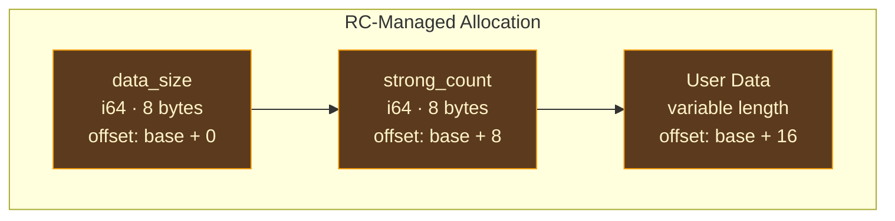
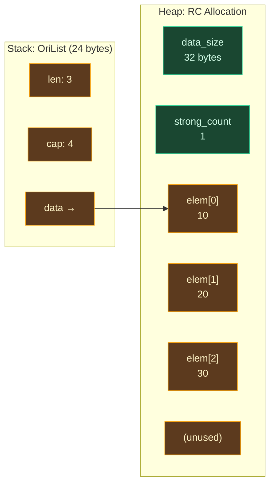
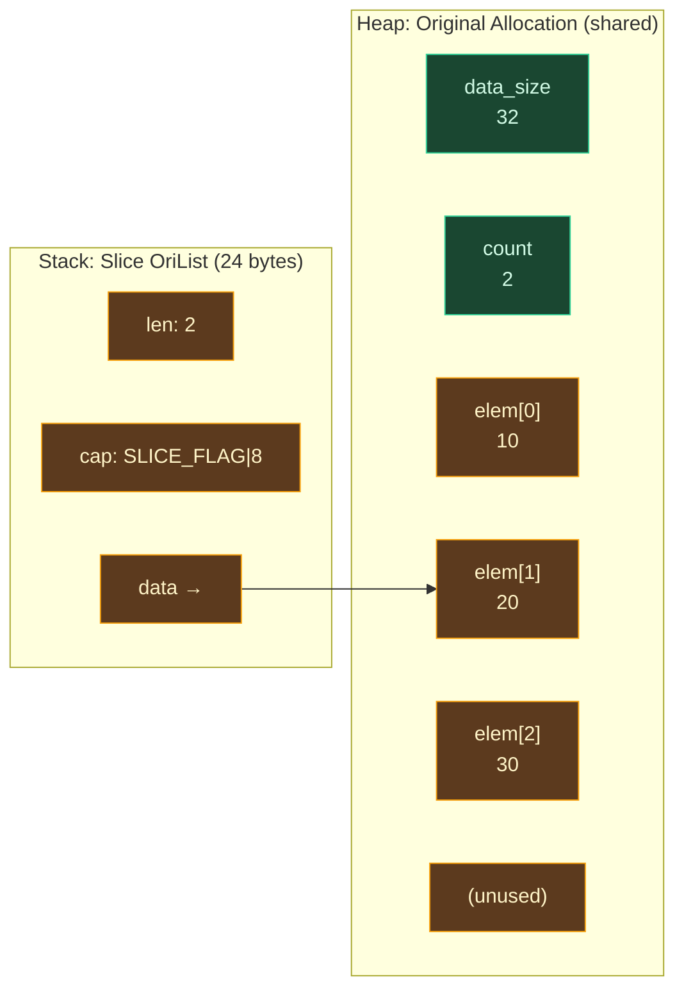
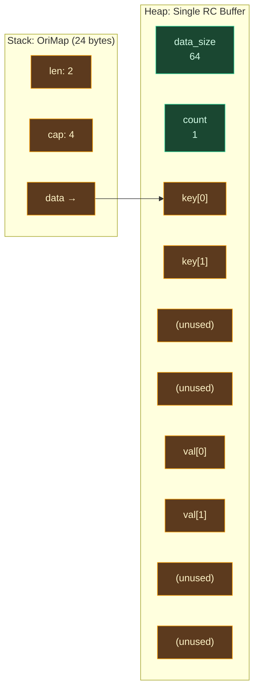
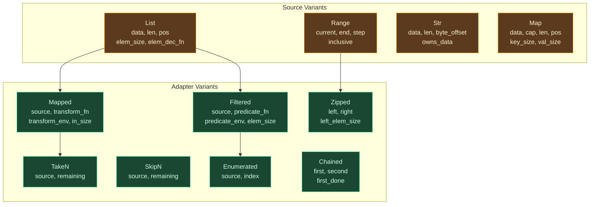

# Data Structures

## Why Memory Layout Matters

A language runtime's data structures are not abstract types — they are concrete memory layouts that the compiler's code generator must understand precisely. When the LLVM backend emits code to read the length of a list, it generates a `load i64, ptr %list_ptr` at offset 0. When it emits code to check whether a string is SSO, it loads byte 23 and tests the high bit. Every field offset, every alignment constraint, and every encoding convention must be agreed upon by both the code generator and the runtime. A mismatch of even one byte means corruption.

This is the fundamental constraint that shapes runtime data structure design: the layouts must be **C-ABI compatible** (`#[repr(C)]` in Rust), meaning the compiler controls field ordering and padding. They must be **small** to minimize passing and copying overhead. And they must be **self-describing enough** that the runtime can operate on them without external metadata — the string must carry its own SSO/heap discriminator, the list must carry its own slice-vs-owned encoding, and the RC header must carry its own allocation size.

This chapter documents the memory layout of every core data type in the Ori runtime: how many bytes each occupies, what lives at each offset, and why the layout was chosen.

## RC Header

All heap-allocated, reference-counted objects share a 16-byte header placed **before** the data pointer. This header is the foundation of the entire memory management system — every list buffer, map buffer, set buffer, and heap string buffer begins with this header.



| Field | Offset from data_ptr | Size | Description |
|-------|---------------------|------|-------------|
| `data_size` | -16 | 8 bytes | User data size in bytes |
| `strong_count` | -8 | 8 bytes | Reference count (atomic i64) |

The critical design choice: **`ori_rc_alloc` returns a pointer to the user data, not the allocation base.** All RC operations recover the header by subtracting from the data pointer. This means data pointers can be passed to C FFI without offset adjustment, and the common operation (accessing data) requires no arithmetic.

Header size is `RC_HEADER_SIZE = 16`. Minimum alignment is 8 bytes, ensuring `strong_count` is naturally aligned for atomic operations on all architectures.

## OriList

`OriList` is a 24-byte `#[repr(C)]` struct representing a dynamic array:

| Field | Offset | Size | Description |
|-------|--------|------|-------------|
| `len` | 0 | 8 bytes | Number of elements |
| `cap` | 8 | 8 bytes | Capacity (negative = seamless slice) |
| `data` | 16 | 8 bytes | Pointer to RC-managed buffer (or null) |

Elements are stored contiguously at `data + index * elem_size`. The element size is **not** stored in the struct — it is always passed as a parameter to runtime functions. This keeps the struct at 24 bytes and avoids redundancy (the compiler knows the element size at every call site).

### Buffer Layout



### Empty List

```
OriList { len: 0, cap: 0, data: null }
```

No allocation occurs for empty lists. `ori_rc_inc(null)` and `ori_rc_dec(null)` are no-ops. The first element insertion triggers an allocation with `MIN_COLLECTION_CAPACITY = 4`.

### Seamless Slices

List slices reuse the `OriList` struct with a special encoding in `cap`:

```
cap >= 0:  regular list (cap is element capacity)
cap <  0:  seamless slice
           bit 63 = 1 (SLICE_FLAG = i64::MIN)
           bits 0-62 = byte offset from original allocation's data start
```

The slice's `data` pointer points directly into the original buffer at the first slice element. To find the original allocation's data pointer for RC operations:

```
original_data = slice_data - byte_offset
RC header at original_data - 16
```



Properties of seamless slices:
- `len` gives the slice length as usual
- `data` gives direct access to the slice elements (no offset calculation for reads)
- RC operations go through the original buffer via `slice_original_data`
- COW on a slice always takes the slow path (allocates an independent buffer)
- Slices of slices accumulate the byte offset to always point back to the root allocation

### Allocation Functions

| Function | Purpose |
|----------|---------|
| `ori_list_alloc_data` | Allocate RC-managed buffer for `cap * elem_size` bytes |
| `ori_list_box_new` | Wrap `{len, cap, data}` in an RC-managed OriList |
| `ori_list_new` | Allocate both OriList struct and data buffer (AOT mode) |
| `ori_list_free` | Free a heap-allocated OriList struct (from `ori_list_new`) |
| `ori_list_free_data` | Free the data buffer only (stack-struct lists) |

Sets share the same memory layout and allocation functions — an `OriSet` is an `OriList` with set-specific COW operations.

## OriMap

`OriMap` is a 24-byte `#[repr(C)]` struct representing an associative array:

| Field | Offset | Size | Description |
|-------|--------|------|-------------|
| `len` | 0 | 8 bytes | Number of entries |
| `cap` | 8 | 8 bytes | Capacity in entries |
| `data` | 16 | 8 bytes | Pointer to RC-managed buffer (or null) |

### Split-Buffer Layout

Maps store keys and values in a **single contiguous RC-managed buffer** with keys packed at the front and values packed after the key region:



Key storage: `data + index * key_size`
Value storage: `data + cap * key_size + index * val_size`
Total buffer size: `cap * key_size + cap * val_size`

Advantages of the single-buffer design:
- **One RC header** covers the entire map — one `ori_rc_is_unique` check determines the COW path
- **Cache locality** for keys — the linear scan in `find_key` stays in cache because keys are packed together
- **Simple COW** — a single buffer copy duplicates everything

The tradeoff is **value relocation** during growth: when the buffer is reallocated with a larger capacity, the values section must be moved because the keys section has expanded. This requires a `memmove` after every realloc (see [Collections & COW](./collections-cow.md) for details).

### Empty Map

```
OriMap { len: 0, cap: 0, data: null }
```

Like empty lists, empty maps require zero allocation and zero cleanup.

## OriSet

Sets are structurally identical to lists — they use the `OriList` struct with contiguous element storage. The difference is operational: set COW operations accept equality callbacks for membership testing, and set-specific operations (union, intersection, difference) are provided.

```
OriSet (24 bytes, same struct as OriList):
  +----------+----------+----------+
  | len: i64 | cap: i64 | data: *  |
  +----------+----------+----------+
  Buffer: [elem0 | elem1 | ... | elemN | (unused)]
```

## OriStr

`OriStr` is a 24-byte `#[repr(C)]` union with two variants, discriminated by the high bit of byte 23. See the [String SSO](./string-sso.md) chapter for the complete layout and semantics.

```
OriStr (24 bytes, union):
  SSO:  [23 inline bytes | flags byte (0x80 | len)]
  Heap: [len: i64 | cap: i64 | data: *mut u8]
```

## OriOption

`OriOption<T>` represents Ori's `Option<T>` type in the runtime:

| Field | Offset | Size | Description |
|-------|--------|------|-------------|
| `tag` | 0 | 1 byte | `0` = None, `1` = Some |
| (padding) | 1 | varies | Alignment padding for `T` |
| `value` | aligned | `sizeof(T)` | The value (valid only when `tag == 1`) |

Total size is `1 + padding + sizeof(T)`, where padding brings the `value` field to `T`'s natural alignment. For `Option<int>` (where `T` = i64 with 8-byte alignment), the layout is 16 bytes: 1 byte tag + 7 bytes padding + 8 bytes value.

The tag is a single byte (`i8`), not a pointer-sized integer. This minimizes padding waste for small payload types. The LLVM codegen generates the correct GEP offsets based on the concrete type's alignment requirements.

## OriResult

`OriResult<T, E>` represents Ori's `Result<T, E>` type:

| Field | Offset | Size | Description |
|-------|--------|------|-------------|
| `tag` | 0 | 1 byte | `0` = Ok, `1` = Err |
| (padding) | 1 | varies | Alignment padding |
| `value` | aligned | `max(sizeof(T), sizeof(E))` | Overlapping storage |

The value field is sized to the larger of `T` and `E`. The storage is shared (union-like) — `Ok` values and `Err` values occupy the same bytes, distinguished by the tag. The compiler generates the correct access code based on the tag at each use site.

## OriPanic

The panic payload for stack unwinding in AOT mode:

```rust
pub struct OriPanic {
    pub message: String,
}
```

Wrapped in `std::panic::panic_any` so the Itanium EH ABI unwinds through LLVM-generated `invoke`/`landingpad` pairs. This gives cleanup handlers (generated by the ARC pass) a chance to release RC-managed resources during unwinding. The entry point wrapper (`ori_run_main`) catches the panic with `catch_unwind`.

## Iterator Runtime

Iterators are represented as opaque `Box<IterState>` handles, cast to `*mut u8` for the C ABI. LLVM-generated code never sees the internal `IterState` enum — all interaction goes through pointer-sized handles and C-ABI functions.

### IterState Variants

The `IterState` enum has two categories of variants — **sources** that produce elements from data, and **adapters** that transform elements from another iterator:



### Trampoline Functions

Adapters that accept closures use C-ABI trampoline function pointers:

| Type | Signature | Used By |
|------|-----------|---------|
| `TransformFn` | `(env, in_ptr, out_ptr) -> void` | `Mapped` |
| `PredicateFn` | `(env, elem_ptr) -> bool` | `Filtered`, consumers |
| `ForEachFn` | `(env, elem_ptr) -> void` | `for_each` |
| `FoldFn` | `(env, acc_ptr, elem_ptr, out_ptr) -> void` | `fold` |

The `env` parameter is the closure environment pointer (may be null for stateless operations). The LLVM backend generates type-specialized trampolines that unpack the environment, cast the element pointers to the correct types, and call the user's closure body.

### Iterator Lifecycle

**Creation:** `ori_iter_from_list`, `ori_iter_from_range`, `ori_iter_from_str`, `ori_iter_from_map` allocate a `Box<IterState>` on the heap and return the raw pointer.

**Adaptation:** `ori_iter_map`, `ori_iter_filter`, `ori_iter_take`, etc. allocate a new `Box<IterState>` that wraps the source iterator. The source is consumed — the caller must not use it after passing it to an adapter.

**Advancement:** `ori_iter_next(iter_ptr, out_ptr, elem_size)` dispatches through the `IterState` enum, writes the next element to `out_ptr`, and returns whether an element was produced.

**Consumption:** `ori_iter_collect`, `ori_iter_count`, `ori_iter_fold`, etc. consume the iterator to completion and return a result.

**Cleanup:** `ori_iter_drop(iter_ptr)` calls Rust's `Drop` on the `Box<IterState>`. For source iterators, this decrements the RC of the underlying data. For adapters, this recursively drops the wrapped source iterator, cascading cleanup through the entire adapter chain.

### RC Ownership

Source iterators take ownership of one RC reference to their data:

- **List:** Owns a reference to the data buffer. Drop calls `ori_buffer_rc_dec` to decrement the buffer's RC and clean up element RCs if the buffer is freed.
- **Str:** Owns a reference to the string's heap buffer (if heap-mode). Drop calls `ori_buffer_rc_dec` when `owns_data` is true.
- **Map:** Owns a reference to the map's data buffer. Drop calls `ori_map_buffer_rc_dec` for key/value cleanup.
- **Range:** No RC ownership — ranges are purely computed values.

Adapter variants contain a `Box<IterState>` that Rust automatically drops when the adapter is dropped, cascading cleanup to the source.

### Scratch Buffer

Adapters that produce intermediate values (e.g., `Mapped` transforms an element into a new element) use a stack-allocated scratch buffer of `MAX_ELEM_SIZE = 256` bytes. This avoids heap allocation for temporary values during iteration. If an element type exceeds 256 bytes (unlikely in practice), the scratch buffer is dynamically allocated.

## Capacity Management

### `MIN_COLLECTION_CAPACITY = 4`

All collections start with capacity 4 upon first insertion. This avoids the pathological 1 → 2 → 4 reallocation sequence that would otherwise occur for the first three insertions.

### `next_capacity(current, required) -> usize`

```
max(required, current * 2, MIN_COLLECTION_CAPACITY)
```

Uses 2× doubling for amortized O(1) insertion. At most 50% wasted capacity. Matches Rust's `Vec`, Swift's `Array`, Java's `ArrayList`, and Go's slice growth strategy.

### No Auto-Shrink

Collections retain capacity after element removal. This avoids oscillation at capacity boundaries where alternating insertions and deletions near a power-of-two boundary would cause pathological reallocation.

## Prior Art

**[Zig's `InternPool`](https://github.com/ziglang/zig/blob/master/src/InternPool.zig)** uses a fundamentally different approach — all values are interned into a single pool with tagged indices. This gives O(1) equality via index comparison but requires indirection for every access. Ori's approach keeps data in dedicated struct layouts, avoiding the indirection cost at the expense of requiring explicit equality implementations.

**[Swift's runtime](https://github.com/swiftlang/swift/tree/main/stdlib/public/runtime)** uses similar tagged-union layouts for Optional and Either types, with layout optimization (null pointer optimization for single-payload enums). Swift's `Array` uses a `ContiguousArrayBuffer` with a refcount header, structurally equivalent to Ori's `OriList`. The main difference is that Swift's buffer header includes additional metadata (element type, reserved flags) while Ori's header is minimal (just size and count).

**[Go's slice header](https://go.dev/blog/slices-intro)** is a 24-byte struct (`{data, len, cap}`) — identical in structure to Ori's `OriList`. Go's slices are also views into underlying arrays, similar to Ori's seamless slices, but Go encodes this relationship through the pointer and capacity directly rather than through a negative-capacity flag. Go's approach requires the garbage collector to trace from the slice pointer to the underlying array; Ori's negative-capacity encoding makes the relationship explicit without GC support.

**[Lean 4's `lean_object`](https://github.com/leanprover/lean4/blob/master/src/runtime/object.h)** uses a header with refcount plus a tag byte for runtime type discrimination. This enables polymorphic code to determine an object's type at runtime — something Ori does not need because the LLVM backend generates type-specialized code for every concrete type.

**[Roc's data structures](https://www.roc-lang.org/)** share the most conceptual similarity with Ori's. Roc's list is a `{data, len, cap}` triple with seamless slice encoding via negative capacity (the direct inspiration for Ori's approach). Roc's string uses SSO with a similar discriminator technique. The convergence is not coincidental — both languages are expression-based, ARC-managed, and value-oriented, leading to similar runtime design choices.

## Design Tradeoffs

**24-byte collections vs smaller.** All three collection types (list, map, set) and strings use 24-byte structs. A 16-byte struct (dropping capacity) would save memory but lose amortized O(1) insertion (every push would need to query the allocation's size). A 32-byte struct (adding element size or hash state) would increase passing and copying overhead. The 24-byte choice matches Go's slice header and is the smallest layout that supports capacity-aware growth.

**Single buffer for maps vs separate key/value arrays.** Maps pack keys and values into one RC-managed buffer. Two separate buffers would eliminate value relocation during growth but double the RC management overhead (two uniqueness checks, two allocations, two frees). The single-buffer design makes the common case (small maps) fast at the cost of a `memmove` during growth.

**Opaque iterator handles vs inline state.** Iterators use heap-allocated `Box<IterState>` handles rather than inlining the state into the caller's stack frame. Inlining would avoid the heap allocation but require the compiler to know the size of every iterator variant at compile time — which changes when adapters are composed. The opaque-handle approach trades one heap allocation per iterator for complete decoupling between the compiler and the runtime's iterator implementation.

**Tag byte vs bitfield for Option/Result.** Using a full byte for the tag wastes 7 bits but simplifies codegen (simple i8 load + compare) and avoids the complexity of bitfield extraction. For `Option<int>`, the 7 bytes of padding between tag and value are dictated by alignment, so the tag's size does not affect the overall struct size.
