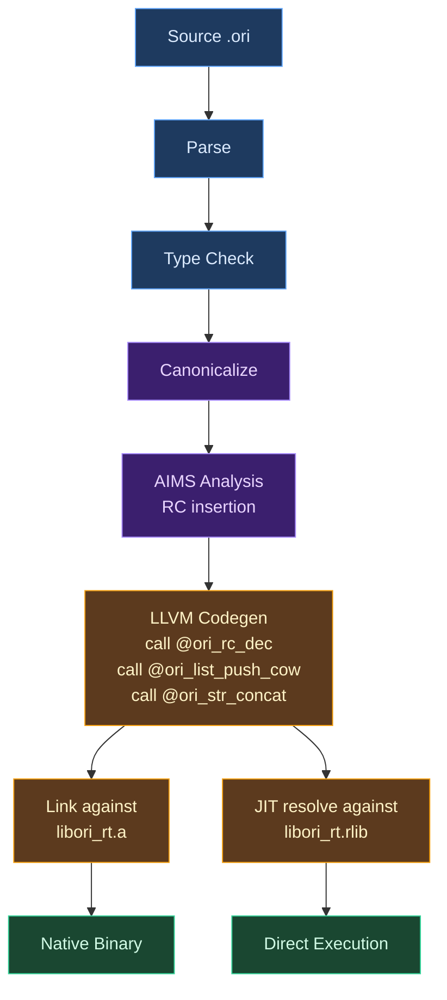
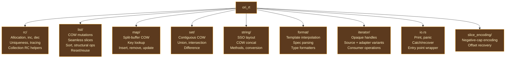

# Runtime Overview

## What Is a Language Runtime?

Every compiled language needs a bridge between the machine code it produces and the services that code relies on at execution time. This bridge is the **runtime library** — a collection of functions, data structures, and conventions that the compiler's generated code calls into for operations it cannot (or should not) perform inline. The compiler emits `call ori_rc_dec(ptr)`, and somewhere, a real function must exist to handle that call. The runtime is where that function lives.

The scope of a runtime library varies enormously across languages. C's runtime is minimal: `malloc`, `free`, `printf`, and a handful of startup/shutdown functions. The compiler generates self-contained machine code for arithmetic, control flow, and memory access; the runtime provides only what the hardware cannot. At the other extreme, Java's runtime is a full virtual machine — a bytecode interpreter, garbage collector, class loader, JIT compiler, thread scheduler, and standard library, all bundled together. The "compiled" program is bytecode that cannot execute without the runtime present.

Most production languages fall somewhere between these poles. Go's runtime includes a garbage collector and goroutine scheduler but no bytecode interpreter. Rust's runtime is minimal (just the allocator and panic infrastructure) because the borrow checker eliminates the need for runtime memory management. Swift's runtime includes reference counting operations, type metadata for dynamic dispatch, and protocol witness tables — similar in scope to what Ori needs.

### The ARC Runtime Pattern

Languages that use **automatic reference counting** (ARC) as their memory management strategy need a specific kind of runtime. The compiler statically determines where reference count operations must be inserted, but the operations themselves — allocating with a header, incrementing atomically, decrementing with cleanup — are too complex and too shared to inline everywhere. They live in the runtime.

Swift pioneered this pattern in a production setting. The Swift runtime provides `swift_retain` and `swift_release` (the equivalents of `ori_rc_inc` and `ori_rc_dec`), along with type metadata, protocol conformance tables, and heap object management. Lean 4 follows a similar pattern with its `lean_inc_ref` and `lean_dec_ref` functions. In both cases, the compiler's static analysis determines *where* to call these functions, and the runtime provides *what* those functions do.

Ori's `ori_rt` crate follows this pattern: the [AIMS analysis pass](../09-aims/index.md) determines statically where reference count operations belong, and the runtime provides the atomic increment/decrement implementations, copy-on-write collection mutations, string operations, and I/O primitives that the generated code calls into.

## What Makes Ori's Runtime Distinctive

### Zero Compiler Dependencies

The `ori_rt` crate has **no dependencies on the compiler**. It does not import `ori_ir`, `ori_types`, `ori_parse`, or any other compiler crate. It links only against the Rust standard library and the system allocator. This is not an accident — it is a hard architectural constraint that keeps the runtime minimal and ensures that changes to the compiler's internal representations never ripple into the runtime.

The contract between compiler and runtime is entirely defined by C-ABI function signatures. The LLVM backend emits `call @ori_rc_dec(ptr, drop_fn)`, and the runtime provides a function with that exact name and calling convention. Neither side knows about the other's internal types.

### Dual Build Artifacts

The crate builds as both an `rlib` (Rust library) and a `staticlib` (C-compatible archive):

- **`libori_rt.rlib`** — Used by `ori_llvm` for JIT execution. The LLVM execution engine resolves runtime function addresses directly from the loaded Rust library, enabling `ori run` to call runtime functions without a separate linking step.
- **`libori_rt.a`** — Linked into AOT-compiled binaries by the system linker. When `ori build` produces a native executable, the linker resolves all `ori_*` symbols against this static archive.

Both artifacts are built by `cargo b` (debug) or `cargo b --release` (release). This dual-output design means the same runtime code serves both the development workflow (JIT) and the production workflow (AOT), eliminating the class of bugs where the JIT runtime behaves differently from the AOT runtime.

### Data Pointer Convention

RC allocations return a **data pointer** — a pointer to the user data region, past the 16-byte header — rather than a pointer to the allocation base. This seemingly small decision has deep consequences:

- Generated code passes data pointers directly to C FFI without adjustment
- Every RC operation recovers the header by subtracting a fixed offset (`ptr - 16` for the count, `ptr - 8` for the size)
- The data pointer *is* the value — no wrapping, no indirection, no fat pointer needed

This matches Swift's approach, where `HeapObject*` points to the object data (past the metadata/refcount header), and contrasts with CPython, where `PyObject*` points to the header and callers must offset to reach the data.

### Null Sentinels for Empty Collections

Empty lists, maps, and sets use a **null data pointer** with zero length and zero capacity. No allocation occurs until the first element is added. The runtime makes `ori_rc_inc(null)` and `ori_rc_dec(null)` explicit no-ops, so empty collections flow through the entire RC protocol without special-casing at every call site.

This means creating an empty list is free (24 bytes of zeros on the stack), passing it around is free (no RC operations on null), and dropping it is free (the no-op dec). The first `push` triggers the initial allocation with `MIN_COLLECTION_CAPACITY = 4` elements.

### Consuming COW Semantics

Every mutating collection operation takes **ownership** of the caller's reference to the data buffer. The caller passes its reference in and receives a new `{len, cap, data}` triple through an sret output pointer. After the call, the caller must not access the original buffer.

This consuming protocol enables the fast path: when the reference count is 1, the runtime mutates the buffer in place and returns the same pointer. No copy, no RC changes — the sole reference transfers from input to output. On the slow path (shared buffer), the runtime copies, increments element RCs on the copy, and decrements the old buffer's RC. The consuming protocol makes the fast path a zero-cost operation rather than a copy-then-dec.

### SSO Strings as First-Class Values

Strings of 23 bytes or fewer are stored entirely inline in the 24-byte `OriStr` struct — no heap allocation, no reference counting, no cleanup. An SSO string has the same copy cost as a 24-byte `memcpy` and zero drop cost. This makes short strings (identifiers, error codes, format fragments) as cheap as primitive values in terms of memory management overhead.

## Architecture

The runtime sits at the bottom of the compilation pipeline. The LLVM backend emits `call` instructions targeting `ori_rt`'s `#[no_mangle] extern "C"` functions. These calls are resolved at link time (AOT) or symbol resolution time (JIT).



The runtime never calls back into the compiler. Data flows one way: compiled code calls runtime functions, the runtime operates on raw memory, and results are returned through C ABI conventions — return values for small results, sret output pointers for aggregates larger than 16 bytes, or in-place mutation for COW fast paths.

### Module Organization

The runtime is organized into functional modules, each responsible for a category of operations:



### Function Categories

The runtime exports approximately 80 C-ABI functions. They fall into six categories:

| Category | Functions | Purpose |
|----------|-----------|---------|
| **Memory** | `ori_alloc`, `ori_free`, `ori_realloc` | Raw allocator wrappers |
| **Reference Counting** | `ori_rc_alloc`, `ori_rc_inc`, `ori_rc_dec`, `ori_rc_is_unique`, ... | RC lifecycle (see [Reference Counting](./reference-counting.md)) |
| **Collection COW** | `ori_list_push_cow`, `ori_map_insert_cow`, `ori_set_union_cow`, ... | Copy-on-write mutations (see [Collections & COW](./collections-cow.md)) |
| **String Operations** | `ori_str_concat`, `ori_str_split`, `ori_str_eq`, ... | SSO-aware string handling (see [String SSO](./string-sso.md)) |
| **Format** | `ori_format_int`, `ori_format_float`, `ori_format_str`, ... | Template string interpolation |
| **I/O and Panic** | `ori_print`, `ori_panic`, `ori_run_main`, `ori_catch_recover`, ... | Output, error handling, entry point |

### C ABI Design Decisions

All runtime functions use `#[no_mangle] extern "C"` for cross-language compatibility. Several design decisions shape the calling conventions:

**sret output pattern.** Functions returning collections write results through an `out_ptr` parameter rather than returning by value. `OriList`, `OriMap`, and `OriStr` are all 24 bytes — above the 16-byte threshold for register return on x86-64 System V ABI. Explicit sret gives the codegen control over the destination address, which is essential for correct integration with LLVM's alloca/store/load pattern.

**Function pointer callbacks.** COW operations accept `inc_fn` (element RC increment), `elem_dec_fn` (element RC decrement), `key_eq` (key equality), and comparator callbacks as C function pointers. The LLVM backend generates type-specialized trampolines for each concrete type. This keeps the runtime entirely type-agnostic — it never needs to know what type the elements are, only how to increment, decrement, compare, or drop them.

**Consuming semantics.** Every COW mutation function takes ownership of the caller's reference to the data buffer. This is not just a convention — it is load-bearing for correctness. The fast path (unique owner) mutates in place and returns the same pointer without any RC changes. If the convention were borrowing (caller retains its reference), the fast path would need an extra increment to hand back the reference, and the common case would pay an atomic operation it does not need.

### Build Modes

The crate supports one feature flag:

- **`single-threaded`** — Substitutes non-atomic `i64` reads/writes for `AtomicI64` operations. This eliminates atomic operation overhead on programs that do not use task parallelism. The flag is compile-time only — there is no runtime check.

## Debugging and Diagnostics

The runtime provides three environment-variable-controlled diagnostic modes that compose freely:

**`ORI_TRACE_RC=1`** logs every RC operation (alloc, inc, dec, free) to stderr with pointer addresses and count transitions. The `verbose` setting adds stack backtraces to each operation. The trace check uses `OnceLock` to read the environment variable once and cache the result — the cost when disabled is a single always-not-taken branch per RC operation.

```
[RC] alloc   0x7f8a1c000b70  size=48   count=1
[RC] inc     0x7f8a1c000b70  count=1->2
[RC] dec     0x7f8a1c000b70  count=2->1
[RC] dec     0x7f8a1c000b70  count=1->0  (dropping)
[RC] free    0x7f8a1c000b70  size=48
```

**`ORI_RT_DEBUG=1`** enables runtime assertions that validate RC headers on every operation — catching use-after-free, double-free, and header corruption. Debug builds additionally track freed pointers in a `HashSet` for double-free detection.

**`ORI_CHECK_LEAKS=1`** counts live RC allocations via a global atomic counter. At program exit, an `atexit` handler reports unfreed allocations. Exit code 2 indicates a detected leak. Debug builds track allocation sites (pointer, size, alignment) for attribution.

These modes compose: `ORI_TRACE_RC=1 ORI_CHECK_LEAKS=1 ORI_RT_DEBUG=1 ./binary` enables all three simultaneously. All are zero-cost when disabled — the first access caches the environment variable, and subsequent checks are a single branch on a cached boolean.

## Prior Art

**[Swift's runtime](https://github.com/swiftlang/swift/tree/main/stdlib/public/runtime)** is the closest analog. Swift uses ARC with a similar two-word header (metadata pointer + refcount), `swift_retain`/`swift_release` for RC operations, and copy-on-write semantics for its standard library collections (`Array`, `Dictionary`, `Set`). The key differences: Swift's runtime includes type metadata for dynamic dispatch and protocol witness tables — capabilities Ori does not need because it uses monomorphization. Swift's refcount also packs additional bits (pinned flag, unowned count) into the refcount word, while Ori uses a simpler single-counter design.

**[Lean 4's runtime](https://github.com/leanprover/lean4/tree/master/src/runtime)** implements reference counting for a functional language with similar goals. Lean's `lean_object` header contains a refcount and a tag byte for type discrimination. Lean's RC operations (`lean_inc_ref`, `lean_dec_ref`) follow the same Relaxed-increment / Release-decrement / Acquire-fence-before-drop synchronization protocol that Ori uses. Lean also implements reset/reuse optimization at the runtime level — detecting unique ownership and recycling allocations — which Ori handles at the ARC IR level instead.

**[Koka's runtime](https://github.com/koka-lang/koka/tree/master/kklib)** (`kklib`) provides the execution support for Koka's Perceus reference counting. Like Ori, Koka uses a C-compatible runtime with reference counting primitives. Koka's approach is distinctive in that the compiler generates C code rather than LLVM IR, so the runtime is a C library rather than a Rust crate. Koka also uses a thread-local heap with bump allocation, while Ori uses the system allocator.

**[CPython's runtime](https://github.com/python/cpython)** uses non-atomic reference counting (the GIL provides thread safety). CPython's `Py_INCREF`/`Py_DECREF` are conceptually similar to Ori's operations but use a different header layout — the refcount is the *first* field of `PyObject`, and the type pointer follows. CPython's cycle detector (for reference cycles in arbitrary object graphs) has no analog in Ori, where value semantics prevent cycles by construction.

**Rust has almost no runtime.** The Rust standard library provides `alloc::alloc` and the panic infrastructure, but no reference counting primitives — `Arc` is a library type with inline operations, not a runtime service. This minimal approach is possible because the borrow checker eliminates the need for runtime memory management. Ori's runtime is larger because ARC requires runtime support that static ownership analysis does not.

## Design Tradeoffs

**Rust crate vs C library.** Ori's runtime is written in Rust and compiled as a static library, while Koka's `kklib` and Lean 4's runtime are written in C. The Rust choice provides memory safety within the runtime itself (important when the runtime manipulates raw pointers on behalf of generated code), access to Rust's standard library for complex operations (sorting, UTF-8 handling, formatting), and the ability to share the runtime as an `rlib` for JIT mode. The cost is a Rust toolchain dependency for building the runtime.

**Atomic vs non-atomic refcounts.** The default is atomic operations (`AtomicI64`), with a `single-threaded` feature flag for non-atomic mode. The alternative — always non-atomic with a runtime lock for concurrent access — would be simpler but would make concurrent programs pay for lock acquisition on every RC operation. The per-program feature flag lets single-threaded programs avoid atomic overhead entirely, while concurrent programs pay only the atomic operation cost (which is free on x86 due to cache coherency and maps to lightweight barriers on ARM).

**Linear scan vs hash tables for maps.** Ori's map runtime uses linear key scan with an equality callback, not hash tables. This is O(n) per lookup, which is efficient for small maps (the common case) but degrades for large maps. The rationale: hash-based maps would require the runtime to know the key's hash function, adding another callback parameter to every map operation and complicating the COW protocol. Linear scan keeps the implementation simple and makes the common case (maps with fewer than ~20 entries) fast. A future optimization could add hash-based lookup for maps above a size threshold.

**No auto-shrink.** Collections retain their capacity even after elements are removed. This avoids the performance cliff of alternating growth and shrinkage around a capacity boundary (the "ping-pong" problem). The cost is wasted memory for collections that grow large and then shrink. This matches the behavior of Rust's `Vec`, Go's slices, and Java's `ArrayList`.

**Seamless slices via negative capacity.** Rather than introducing a separate slice type, Ori encodes slice state in the capacity field's sign bit. This keeps the `OriList` struct at 24 bytes and means slices flow through the same code paths as regular lists (with a branch at the COW decision point). The alternative — a separate `OriSlice` type — would avoid the branch but require the compiler to track which type each variable holds, complicating the generated code.

## Related Documents

- [Reference Counting](./reference-counting.md) — RC header layout, atomic operations, synchronization model
- [Collections & COW](./collections-cow.md) — Copy-on-write mutation protocol, list/map/set operations
- [String SSO](./string-sso.md) — Small string optimization, SSO/heap discrimination, COW string operations
- [Data Structures](./data-structures.md) — Memory layouts for OriList, OriMap, OriSet, OriStr, iterators
- [AIMS](../09-aims/index.md) — The analysis pass that determines where RC operations are inserted
- [LLVM Backend](../10-llvm-backend/index.md) — The code generator that emits calls to runtime functions
