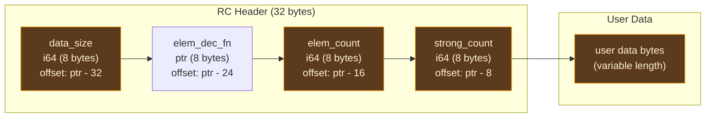

# Reference Counting

## What Is Runtime Reference Counting?

Reference counting is a memory management strategy where each heap allocation carries a counter tracking how many references point to it. When a new reference is created, the counter increments. When a reference is destroyed, the counter decrements. When the counter reaches zero, no references remain, and the allocation can be freed.

The idea dates to George Collins' 1960 paper on list processing, making reference counting one of the oldest automatic memory management techniques. Despite its age, it remains the strategy of choice for several modern language runtimes — Swift, Objective-C, CPython, Perl, and PHP all use reference counting as their primary memory management mechanism.

Reference counting has a fundamental advantage over tracing garbage collection: **deterministic destruction**. When the last reference to an object disappears, the object is freed immediately — not at some later point when a garbage collector decides to run. This determinism makes resource management predictable (file handles close when expected, network connections release promptly) and eliminates the pause-time problem that plagues tracing collectors.

The tradeoff is overhead: every copy increments, every scope exit decrements, and in a multithreaded program, these operations must be atomic. The [AIMS analysis pass](../09-aims/index.md) exists to minimize this overhead through static analysis — eliminating redundant operations, inferring borrowed parameters, and enabling in-place mutation through uniqueness detection. But the operations that survive static optimization must actually execute at runtime, and this chapter describes the implementation of those operations.

### Atomic vs Non-Atomic

In a single-threaded program, reference count operations are simple integer arithmetic. In a multithreaded program, they must be atomic — two threads decrementing the same counter simultaneously must not lose an update, or the allocation will either leak (missed decrement) or be freed while still in use (double decrement).

The standard approach, used by Rust's `Arc`, Swift's `swift_retain`/`swift_release`, and C++'s `shared_ptr`, is to use atomic read-modify-write instructions with carefully chosen memory orderings. Ori follows this approach. The `single-threaded` feature flag substitutes plain integer operations for programs that do not need thread safety.

## RC Header Layout

Every RC-managed allocation uses a 32-byte header placed immediately before the user data:



The layout as a conceptual struct:

```
struct RcHeader {
    data_size: i64,        // offset -32 from data_ptr
    elem_dec_fn: *fn,      // offset -24 from data_ptr
    elem_count: i64,       // offset -16 from data_ptr
    strong_count: i64,     // offset -8 from data_ptr
}
```

Three design decisions shape this layout:

**Data pointer, not header pointer.** `ori_rc_alloc` returns a pointer to the user data — past the header — not to the allocation base. The runtime recovers the header by subtracting 32 bytes from the data pointer. This provides C FFI transparency: callers see a normal data pointer and can pass it directly to external C functions without adjustment. This matches Swift's approach (where `HeapObject*` points past the metadata) and contrasts with CPython (where `PyObject*` points to the refcount).

**`data_size` in the header.** Storing the allocation size in the header rather than requiring callers to pass it to every RC operation is essential for seamless slices. A slice holds an interior pointer into another allocation's buffer. When the slice is the last reference and the underlying allocation must be freed, the runtime needs the allocation's size for `dealloc` — and the slice does not know this size. The header provides it.

**Natural alignment of `strong_count`.** All header fields are 8-byte i64 or pointer values, so `strong_count` is always 8-byte aligned without additional padding. This matters because atomic operations on misaligned addresses cause faults on some architectures (ARM, RISC-V) and performance penalties on others (x86 with split cache lines).

## Core Operations

### Allocation: `ori_rc_alloc`

```
ori_rc_alloc(size: i64, align: i64) -> *mut u8
```

Allocates a new RC-managed block and returns the data pointer:

1. Computes total allocation: `RC_HEADER_SIZE + size` (where `RC_HEADER_SIZE = 32`)
2. Allocates via `std::alloc::alloc` with alignment `max(align, 8)`
3. Writes `data_size = size` at offset 0
4. Writes `elem_dec_fn = null` at offset 8 (caller may set later)
5. Writes `elem_count = 0` at offset 16
6. Writes `strong_count = 1` at offset 24 (the initial reference belongs to the caller)
7. Increments `RC_LIVE_COUNT` (atomic, for leak detection)
8. Returns `alloc_ptr + 32`

The minimum alignment of 8 bytes is enforced regardless of the requested alignment. This ensures the `strong_count` field is always aligned for atomic operations, even when the caller requests 1-byte alignment for byte buffers.

### Increment: `ori_rc_inc`

```
ori_rc_inc(data_ptr: *mut u8)
```

Atomically increments the strong count by 1:

```
(*header).strong_count.fetch_add(1, Ordering::Relaxed)
```

**Relaxed ordering** is sufficient for increments. The increment does not need to be immediately visible to other threads — it only needs to be visible to whichever thread eventually decrements. No data access depends on the increment being ordered relative to other operations. This matches the ordering used by Rust's `Arc::clone()` and Swift's `swift_retain`.

**Null safety.** `ori_rc_inc(null)` is a no-op. This enables empty collections (which use null data pointers) to flow through the RC protocol without special-casing at every call site.

**Overflow protection.** If the count reaches `MAX_REFCOUNT` (defined as `isize::MAX`, approximately 4.6 quintillion on 64-bit platforms), the process aborts immediately. Reaching this count indicates a programming error — likely a reference cycle or unbounded cloning — that cannot be recovered from. This matches Rust's `Arc` behavior.

### Decrement: `ori_rc_dec`

```
ori_rc_dec(data_ptr: *mut u8, drop_fn: Option<fn(*mut u8)>)
```

Atomically decrements the strong count by 1. If the count reaches zero, runs cleanup and frees the allocation:

```
let prev = (*header).strong_count.fetch_sub(1, Ordering::Release);
if prev == 1 {
    atomic::fence(Ordering::Acquire);
    if let Some(f) = drop_fn { f(data_ptr); }
    ori_rc_free(data_ptr, ...);
}
```

The synchronization protocol is the critical correctness concern:

**Release ordering on decrement.** The `Release` ordering ensures that all writes to the managed data by this thread are visible to whichever thread performs the final decrement. Without this, the dropping thread might see stale data when running the drop function.

**Acquire fence before drop.** The `Acquire` fence ensures the dropping thread sees all writes from *all* threads that previously decremented. This fence is only executed on the final decrement (when `prev == 1`), so it has zero cost in the common case where the count does not reach zero.

This Release-decrement / Acquire-fence-before-drop protocol is the standard synchronization model for reference-counted pointers. It is used by:
- Rust's `Arc` ([`std::sync::Arc`](https://doc.rust-lang.org/std/sync/struct.Arc.html))
- Swift's `swift_release` ([Swift runtime](https://github.com/swiftlang/swift/blob/main/stdlib/public/runtime/HeapObject.cpp))
- C++'s `shared_ptr` (both libstdc++ and libc++)
- Lean 4's `lean_dec_ref` ([Lean runtime](https://github.com/leanprover/lean4/blob/master/src/runtime/object.h))

**Drop callback.** If `drop_fn` is `Some`, it is called with the data pointer before deallocation. This handles recursive RC decrements for nested heap-allocated values. For example, a list of strings needs to decrement each string's RC before freeing the list buffer — the drop function walks the elements and calls `ori_rc_dec` on each one. The LLVM backend generates type-specialized drop functions for each concrete type (see [Drop Descriptors](../09-aims/drop-descriptors.md)).

**Null safety.** `ori_rc_dec(null, _)` is a no-op, matching `ori_rc_inc`.

**Underflow detection.** The runtime always checks for underflow — decrementing an already-zero count. This is a single branch per decrement that is always not-taken in correct programs, so branch prediction eliminates the cost. On underflow, the process aborts with a diagnostic message. This check is always enabled (not gated behind `ORI_RT_DEBUG`) because the cost is negligible and the alternative — silent memory corruption — is unacceptable.

### Uniqueness Check: `ori_rc_is_unique`

```
ori_rc_is_unique(data_ptr: *mut u8) -> bool
```

Checks whether the allocation has exactly one reference:

```
(*header).strong_count.load(Ordering::Relaxed) == 1
```

This is the fast-path gate for Copy-on-Write operations. If the value is unique, mutations can proceed in place without copying. Relaxed ordering is sufficient because of a subtle correctness argument:

- **False positive (see 1 when true count is > 1) is impossible.** The only way to increment a refcount is by cloning an existing reference. If the current thread holds a reference and sees count == 1, no other thread can be concurrently incrementing — they would need a reference to clone, but no other reference exists.
- **False negative (see > 1 when true count is 1) is harmless.** If the count was recently decremented by another thread but the Relaxed load sees the stale higher value, the COW operation takes the copy path — which is always safe, just slower than necessary. A stale read never leads to incorrect mutation of shared data.

This correctness argument is the same one used by Rust's `Arc::get_mut()` and Swift's `isKnownUniquelyReferenced()`.

**Null variant.** `ori_rc_is_unique_or_null` returns `true` for both unique references and null pointers. This is used by COW operations that treat empty collections (null data pointer) the same as uniquely-owned collections — both can be "mutated" without copying (empty collections allocate fresh, unique collections mutate in place).

### Reallocation: `ori_rc_realloc`

```
ori_rc_realloc(data_ptr: *mut u8, old_size: i64, new_size: i64, align: i64) -> *mut u8
```

Resizes an RC-managed buffer. This function **requires unique ownership** — the caller must have verified `ori_rc_is_unique` beforehand:

1. Computes old and new layouts including the 32-byte header
2. Calls `std::alloc::realloc` on the header pointer
3. Updates `data_size` in the header to `new_size`
4. Returns the new data pointer (`realloc_result + 32`)

If reallocation fails, the process aborts. There is no fallible reallocation API — out-of-memory is treated as unrecoverable, matching Rust's default allocator behavior.

### Free: `ori_rc_free`

```
ori_rc_free(data_ptr: *mut u8, size: i64, align: i64)
```

Unconditionally deallocates an RC-managed buffer without checking the reference count. Called internally by `ori_rc_dec` after the final decrement:

1. Computes layout including header
2. Calls `std::alloc::dealloc` on the header pointer
3. Decrements `RC_LIVE_COUNT` (atomic)

### Data Size: `ori_rc_data_size`

```
ori_rc_data_size(data_ptr: *mut u8) -> i64
```

Reads the `data_size` field from the header at `data_ptr - 32`. Used by slice operations that need the underlying buffer's allocation size for deallocation without the caller passing it explicitly.

## Synchronization Model

The atomic ordering choices are deliberately minimal — each operation uses the weakest ordering that preserves correctness:

| Operation | Ordering | Rationale |
|-----------|----------|-----------|
| `inc` | Relaxed | No data dependency on the increment being visible |
| `dec` | Release | Publish writes before potential drop |
| fence before drop | Acquire | See all prior writes from all threads |
| `is_unique` | Relaxed | Single-owner semantics (false negative harmless) |

Using stronger orderings (e.g., `SeqCst` everywhere) would add unnecessary synchronization barriers. On x86, Release and Acquire are essentially free (the memory model provides them natively via the strong ordering of the cache coherency protocol). On ARM and RISC-V, they map to lightweight barrier instructions (`dmb`). `SeqCst` would require full memory fences (`mfence` on x86, `dmb ish` + `isb` on ARM), which are measurably more expensive.

### Single-Threaded Mode

The `single-threaded` feature flag replaces all atomic operations with plain integer reads and writes:

- `fetch_add(1, Relaxed)` becomes `*count += 1`
- `fetch_sub(1, Release)` becomes `*count -= 1`
- The Acquire fence before drop is eliminated entirely

This saves the cost of atomic instructions on programs that do not use task parallelism. The flag is a compile-time choice — there is no runtime check for whether threading is in use.

## Collection RC Helpers

Beyond the core primitives, the runtime provides specialized RC operations for collections that contain RC-managed children:

### `ori_buffer_rc_dec`

Decrements a collection buffer's RC and, if the count reaches zero, calls `elem_dec_fn` on each element before freeing the buffer. This handles the cascading cleanup for types like `[str]` (a list of strings) — when the list buffer is freed, each string's RC must be decremented.

The function is slice-aware: if the capacity indicates a seamless slice, it resolves the original buffer's data pointer and decrements the original allocation's RC instead.

### `ori_map_buffer_rc_dec`

Similar to `ori_buffer_rc_dec` but handles the split-buffer layout of maps. When a map buffer is freed, both keys and values may contain RC-managed data. The function accepts separate `key_dec_fn` and `val_dec_fn` callbacks to handle cleanup for each region independently.

### `ori_list_rc_inc`

Slice-aware RC increment for list buffers. If the list is a seamless slice, increments the RC of the original underlying buffer rather than the slice's data pointer (which points into the middle of the original allocation).

### `ori_memcpy_elements` / `ori_memmove_elements`

Bulk copy operations for collection elements. `memcpy` is used when source and destination do not overlap (e.g., copying elements to a new buffer). `memmove` is used when they may overlap (e.g., shifting elements during insert/remove operations). The caller is responsible for element RC management — these functions copy raw bytes only.

## MAX_REFCOUNT

```rust
const MAX_REFCOUNT: i64 = isize::MAX as i64;
```

If any increment would push the count past `MAX_REFCOUNT`, the process aborts. This prevents the count from wrapping around to a small positive value (or negative), which would lead to premature deallocation and use-after-free.

In practice, reaching `MAX_REFCOUNT` requires approximately 4.6 × 10¹⁸ increments on a 64-bit platform. This is physically unreachable through legitimate usage — it indicates a reference cycle or unbounded cloning bug.

## RC_LIVE_COUNT

The runtime maintains a global atomic counter of live RC allocations:

```rust
static RC_LIVE_COUNT: AtomicI64 = AtomicI64::new(0);
```

Incremented by `ori_rc_alloc`, decremented by `ori_rc_free`. When `ORI_CHECK_LEAKS=1` is set, an `atexit` handler checks this counter. A non-zero value at exit indicates leaked allocations (exit code 2).

This is a coarse-grained diagnostic — it reports the total count but not addresses or types. For per-allocation tracking, use `ORI_TRACE_RC=1`. For detailed attribution in debug builds, `ORI_CHECK_LEAKS=1` additionally tracks each allocation's pointer, size, and alignment in a registry.

## Tracing

When `ORI_TRACE_RC=1` is set, every RC operation logs a diagnostic line to stderr:

```
[RC] alloc   0x7f8a1c000b70  size=48   count=1
[RC] inc     0x7f8a1c000b70  count=1->2
[RC] dec     0x7f8a1c000b70  count=2->1
[RC] dec     0x7f8a1c000b70  count=1->0  (dropping)
[RC] free    0x7f8a1c000b70  size=48
```

Setting `ORI_TRACE_RC=verbose` adds stack backtraces to each event, enabling precise attribution of RC operations to specific code paths.

The tracing check uses `OnceLock` to read the environment variable once and cache the result. The cost when tracing is disabled is a single always-not-taken branch per RC operation — negligible in practice, since branch predictors handle never-taken branches with near-perfect accuracy.

## Interaction with ARC Analysis

The AIMS analysis pass determines statically where `ori_rc_inc` and `ori_rc_dec` calls belong. The runtime provides the actual implementations. The contract between them:

1. Every value produced by `ori_rc_alloc` starts with count 1
2. Every additional use requires an `ori_rc_inc`
3. Every end-of-use requires an `ori_rc_dec`
4. The ARC pass guarantees that the net count reaches zero exactly when the value is no longer reachable

The runtime performs no reachability analysis or cycle detection. Cycles are prevented by Ori's value semantics — there are no shared mutable references, so circular reference structures cannot be constructed. This is the same guarantee that makes Swift's ARC safe in practice (with the caveat that Swift allows reference cycles through `class` types, which Ori does not have).

## Prior Art

**Rust's [`Arc`](https://doc.rust-lang.org/std/sync/struct.Arc.html)** uses the same Release/Acquire synchronization protocol. The key difference is that `Arc` is a library type with inline operations — there is no runtime function to call. Each `Arc::clone()` and `Arc::drop()` inlines the atomic operation at the call site. Ori uses runtime functions instead because the AIMS analysis pass needs a single call target for each operation, and the LLVM backend generates calls to these targets.

**Swift's [`swift_retain`/`swift_release`](https://github.com/swiftlang/swift/blob/main/stdlib/public/runtime/HeapObject.cpp)** are the closest analogs to `ori_rc_inc`/`ori_rc_dec`. Swift's refcount word packs additional information — a pinned flag, unowned reference count, and weak reference count — into the same 64-bit word using bit fields. Ori's simpler single-counter design reflects the absence of weak references and pinning in Ori's memory model.

**Lean 4's [`lean_inc_ref`/`lean_dec_ref`](https://github.com/leanprover/lean4/blob/master/src/runtime/object.h)** follow the same protocol. Lean's header includes a tag byte for runtime type discrimination (distinguishing constructors, closures, arrays, etc.), which Ori does not need because the LLVM backend generates type-specialized drop functions instead.

**CPython's [`Py_INCREF`/`Py_DECREF`](https://github.com/python/cpython/blob/main/Include/object.h)** use non-atomic operations protected by the Global Interpreter Lock (GIL). The refcount is the first field of `PyObject`, followed by a type pointer. CPython also implements a cycle detector for reference cycles in arbitrary object graphs — something Ori does not need because value semantics prevent cycles.

## Design Tradeoffs

**32-byte header vs smaller headers.** Some RC implementations use smaller headers — Swift packs refcount data into 8 bytes using bit fields, Lean uses a combined tag/refcount word. Ori uses 32 bytes because storing `data_size`, `elem_dec_fn`, `elem_count`, and `strong_count` together enables seamless slice deallocation, full-range element cleanup, and self-describing cleanup without external bookkeeping. The 24-byte cost per allocation beyond the refcount is modest — a program with 10,000 live heap objects uses 240 KB of header overhead.

**Data pointer vs header pointer.** Returning the data pointer (past the header) rather than the header pointer adds a subtraction to every RC operation (`ptr - 8` to reach the count, `ptr - 32` to reach the size). The benefit is FFI transparency — data pointers can be passed to C functions without adjustment, and the common operation (accessing data) requires no offset calculation. The subtraction is a single LEA instruction on x86, with zero latency impact due to address generation units.

**Always-on underflow detection.** Checking for underflow on every decrement adds a branch. The alternative — only checking in debug mode — risks silent corruption in release builds. The branch is always not-taken in correct programs, so branch prediction makes it effectively free. The cost of the check (~0.5ns per decrement) is negligible compared to the cost of debugging memory corruption from an undetected double-free.

**No weak references.** Ori's runtime provides only strong reference counting — no weak references, no unowned references. This simplifies the header (no weak count) and the protocol (no weak/strong interaction). Weak references are primarily needed to break reference cycles in object graphs with back-references (parent ↔ child). Ori's value semantics prevent such cycles, making weak references unnecessary.
