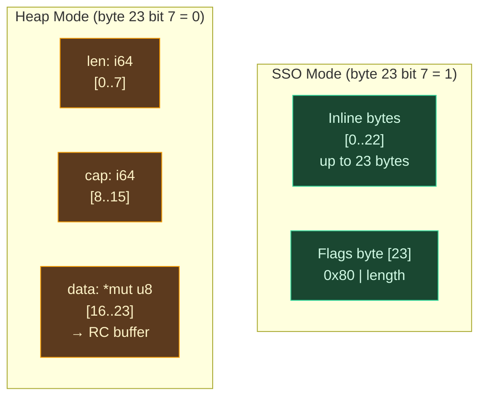

# String SSO

## What Is Small String Optimization?

Strings are among the most frequently allocated objects in any program. Error messages, identifiers, format fragments, map keys, log labels — most of these are short. Studies of real-world programs consistently find that the majority of strings are under 20-30 bytes. Allocating a heap buffer, writing an RC header, and managing the lifecycle for a 5-byte string like `"hello"` is wasteful when the string could fit inside the pointer that would otherwise reference the heap buffer.

**Small String Optimization** (SSO) eliminates this waste by storing short strings inline within the string struct itself, using the same bytes that would otherwise hold a pointer, length, and capacity. The technique was popularized by the C++ standard library — libstdc++'s `std::string` uses a 32-byte struct that stores strings of up to 15 bytes inline, and libc++'s implementation uses a 24-byte struct with a 22-byte inline capacity. Facebook's `folly::fbstring` extended the idea with a three-tier design (inline, heap, and reference-counted).

The insight behind SSO is that small strings have fundamentally different performance characteristics from large strings. A 10-byte string copied inline is a single `memcpy` and requires no heap allocation, no reference counting, and no deallocation. A 10-byte string on the heap requires an `alloc` + RC header write + `memcpy` for creation, an atomic increment for every copy, and an atomic decrement + potential `free` for every drop. SSO makes the common case (short strings) as cheap as integers.

### SSO in Practice

Most modern language runtimes that care about string performance use some form of SSO:

- **C++ libstdc++** — 15-byte inline capacity in a 32-byte struct
- **C++ libc++** — 22-byte inline capacity in a 24-byte struct
- **Rust's `compact_str`** — 24-byte inline capacity in a 24-byte struct (community crate)
- **Swift** — 15-byte inline capacity in a 16-byte struct (bridged types use different layouts)
- **V8 (JavaScript)** — "sequential" vs "cons" vs "sliced" string representation with inline small strings

Ori's `OriStr` uses a 24-byte struct with a 23-byte inline capacity — among the most aggressive SSO thresholds of any production runtime. This covers all ASCII strings up to 23 characters, most common identifiers, and many UTF-8 strings in Western European languages (where most codepoints fit in 1-2 bytes).

## OriStr Layout

`OriStr` occupies exactly 24 bytes (3 machine words on 64-bit platforms). The layout is a `#[repr(C)]` union of two variants, discriminated by a single bit:



The Rust implementation uses a `union` of `OriStrHeap { len: i64, cap: i64, data: *mut u8 }` and `OriStrSSO { bytes: [u8; 23], flags: u8 }`.

## The Discriminator

The discriminator is a single bit — bit 7 (the high bit) of byte 23:

- **Set (0x80):** SSO mode. The low 7 bits of byte 23 store the string length (0 to 23). The full flags byte is `SSO_FLAG | len`, where `SSO_FLAG = 0x80`.
- **Clear:** Heap mode. Byte 23 is the most significant byte of the `data` pointer.

This works because of a property of modern 64-bit architectures: user-space virtual addresses use **canonical addressing**, where the upper bits of a pointer are always zero (or sign-extended from bit 47 or 56, depending on the architecture). On current x86-64 and ARM64 platforms, user-space pointers always have bit 63 clear. Since byte 23 of the struct is byte 7 of the `data` pointer (the MSB on little-endian), a valid heap pointer always has bit 7 of byte 23 clear — exactly the opposite of the SSO flag.

The mode check is a single instruction:

```rust
fn is_sso(&self) -> bool {
    self.sso.flags & SSO_FLAG != 0  // SSO_FLAG = 0x80
}
```

The `EMPTY` constant is an SSO string with zero length: all bytes zero except byte 23, which is `0x80` (SSO flag with length 0).

## SSO Mode

In SSO mode, the 24-byte struct is used directly as a byte buffer:

- Bytes 0 through `len - 1` contain the string data (valid UTF-8)
- Bytes `len` through 22 are unused (may contain stale data from prior values)
- Byte 23 contains `0x80 | len`

SSO strings have **no heap allocation, no RC header, and no refcount operations**:

| Operation | Cost |
|-----------|------|
| Create | Write bytes + set flags byte |
| Copy | 24-byte `memcpy` |
| Drop | No-op |
| Length | `flags & 0x7F` |
| Data access | Pointer to self (the struct is the buffer) |

This means short strings have the same memory management profile as primitive values. Creating, copying, and dropping a 10-byte string is as cheap as doing the same with a 24-byte struct of integers.

### The 23-Byte Threshold

The threshold fills the full 24-byte struct minus the 1-byte flags field. This covers:

- All ASCII strings up to 23 characters
- Most common identifiers, variable names, and error codes
- Many UTF-8 strings (Western European text is typically 1-2 bytes per codepoint)
- Format specifiers, boolean representations ("true"/"false"), and short numeric representations

A more conservative threshold (e.g., 15 bytes like Swift) would waste 8 bytes of the struct on every SSO string. A larger struct (e.g., 32 bytes) would increase the cost of copying and passing strings around. The 24-byte choice is a natural fit for 3-word-aligned structures on 64-bit platforms.

## Heap Mode

In heap mode, the 24 bytes are interpreted as three 64-bit fields:

| Field | Offset | Description |
|-------|--------|-------------|
| `len` | 0 | Number of valid bytes in the buffer |
| `cap` | 8 | Total capacity (or seamless slice encoding if negative) |
| `data` | 16 | Pointer to RC-managed buffer via `ori_rc_alloc` |

The `data` pointer points to the user data region of an RC allocation (past the 32-byte RC header). The buffer is managed by the standard RC protocol: `ori_rc_inc` on copy, `ori_rc_dec` on drop, `ori_rc_is_unique` for COW.

Heap strings also support **seamless slices** using the same negative-capacity encoding as lists: when `cap < 0`, `data` points into another string's buffer, and the lower 63 bits of `cap` encode the byte offset from the original allocation's data start. This enables zero-copy `substring`, `split`, and `trim` operations.

## Promotion and Demotion

### SSO to Heap: `promote_to_heap`

When an SSO string needs to grow beyond 23 bytes, it is promoted to heap mode:

1. Computes capacity via `next_capacity(0, min_cap)` — at least 4, at least `min_cap`, doubling from 0
2. Allocates via `ori_rc_alloc(capacity, 1)`
3. Copies the inline bytes to the new heap buffer
4. Rewrites the struct fields to heap mode: `{len, cap, data}`

### No Demotion

There is **no demotion** (heap back to SSO). A string that has been promoted to heap mode stays on the heap even if it is later shortened to under 23 bytes. The rationale:

- The common case after promotion is continued growth (string building, concatenation chains)
- Checking the length on every mutation to decide whether to demote would add overhead to the fast path
- Demotion would change the identity of the string (new copy in SSO, old heap buffer freed) in ways that could confuse callers holding the old data pointer

## Capacity Management

### `ensure_capacity`

Ensures a heap string has at least `required` bytes of capacity. Only called on uniquely-owned heap strings (precondition):

1. If `cap >= required`: no-op
2. If `cap < required`: realloc via `ori_rc_realloc` with `next_capacity(old_cap, required)` for amortized doubling growth

The C-ABI entry point `ori_str_ensure_capacity` is a no-op for SSO strings (promotion is handled by the caller).

## SSO-Aware Operations

Every string operation must handle both SSO and heap modes. The pattern is consistent: check the mode, extract `(data, len)` from the appropriate variant, perform the operation, and construct the result in whichever mode fits.

### Concatenation: `ori_str_concat`

Concatenation is the most performance-critical string operation. Four cases, from fastest to slowest:

**1. Both SSO, result ≤ 23 bytes:** Copy `a`'s bytes then `b`'s bytes into an inline buffer. Construct SSO result. **Zero allocation, zero RC.**

**2. `a` is heap, unique, has capacity:** Append `b`'s bytes in place at `data + a_len`. Update length. O(m) where m = len(b). **No allocation.**

**3. `a` is heap, unique, needs growth:** Realloc the buffer to accommodate both strings, then append `b`. **One realloc, no full copy.**

**4. General case (shared, or SSO-to-heap promotion):** Allocate a new buffer with `next_capacity(a_cap, combined_len)` for amortized doubling. Copy both strings into the new buffer.

### Push Char: `ori_str_push_char`

Same four-case COW protocol as concat. Encodes the character to UTF-8 (1-4 bytes), then follows the SSO/heap/unique/shared decision tree. For the unique-needs-growth case, `push_char` can safely use `ori_rc_realloc` directly (unlike concat, where the input string may be borrowed from a caller).

### Substring: `ori_str_substring`

Three cases based on the source and result:

- **SSO source:** Copies the byte range into a new SSO or heap string
- **Heap source, result ≤ 23 bytes:** Copies bytes into SSO (cheaper than RC management for small results)
- **Heap source, result > 23 bytes:** Creates a **seamless slice** sharing the original buffer's RC. Increments RC on the original allocation. Supports slice-of-slice by accumulating byte offsets.

The seamless slice path is the key optimization: a substring that returns 1000 bytes from a 10,000-byte string costs a pointer calculation and an atomic increment — no copying.

### Split: `ori_str_split`

Returns a list of `OriStr` values. Uses a hybrid strategy to minimize allocations:

- If the source is a heap string, pieces longer than 23 bytes are returned as **seamless slices** (zero-copy, sharing the original buffer's RC via `ori_rc_inc`)
- Pieces of 23 bytes or fewer use **SSO** (no heap allocation, no RC)
- If the source is SSO, all pieces fit in SSO anyway (the source is at most 23 bytes)

This means splitting a large string produces no copies for the large pieces and no heap allocations for the small pieces — the optimal combination.

### Trim: `ori_str_trim`

Finds the whitespace boundaries, then delegates to `ori_str_substring`. For heap strings, the trimmed result is a seamless slice (zero-copy). For SSO strings, the trimmed result is a new SSO string.

### Case Conversion: `ori_str_to_uppercase` / `ori_str_to_lowercase`

Three-tier COW optimization based on content and ownership:

**1. Non-ASCII content:** Falls through to Rust's `to_uppercase()` / `to_lowercase()`. Non-ASCII case conversion can change byte length (e.g., German "ß" uppercases to "SS"), so the runtime delegates to Rust's Unicode-aware implementation.

**2. ASCII + SSO:** Transforms bytes in place on a copy of the SSO struct. Since SSO strings are value types (copied by `memcpy`), the transformation creates a new value without affecting the original.

**3. ASCII + heap + unique:** Transforms bytes in place in the buffer. ASCII case conversion preserves byte length (every byte maps to exactly one byte), so no reallocation is needed. Returns the same struct.

**4. ASCII + heap + shared:** Allocates a new buffer and copies with transformation.

### Replace: `ori_str_replace`

COW optimization for same-length replacement on unique heap strings: scans the buffer and overwrites matches in place. When the replacement has a different length than the pattern, the runtime delegates to Rust's `String::replace()` and wraps the result.

### Repeat: `ori_str_repeat`

Always allocates a new buffer with exact capacity (`n * len` bytes). If the result fits in SSO (≤ 23 bytes), fills the inline bytes directly. Otherwise allocates via `ori_rc_alloc`.

## Length and Data Access

`ori_str_len` and `ori_str_data` are SSO-safe C-ABI entry points:

- **`ori_str_len`:** Returns `flags & 0x7F` for SSO, `heap.len` for heap
- **`ori_str_data`:** Returns a pointer to the inline bytes (the struct itself) for SSO, or `heap.data` for heap strings

**Lifetime note:** For SSO strings, the data pointer points into the `OriStr` struct itself. If the struct is on the stack, the pointer is only valid while that stack frame is live. The LLVM codegen must not store SSO data pointers in long-lived structures — the pointer becomes dangling when the stack frame returns.

## Equality and Comparison

### `ori_str_eq` / `ori_str_ne`

Equality comparison extracts `(data, len)` from each string (SSO or heap) and compares:

1. If lengths differ, return `false` immediately
2. Otherwise, `memcmp` the byte sequences

This handles SSO-vs-heap comparisons transparently — the comparison operates on raw bytes regardless of storage mode.

### `ori_str_compare`

Lexicographic comparison for the `Comparable` trait. Returns an `Ordering` tag (Less = 0, Equal = 1, Greater = 2). Compares byte-by-byte via `memcmp`, then uses lengths to break ties (shorter string is "less" when both share a common prefix).

### `ori_str_hash`

FNV-1a hash function for the `Hashable` trait. Extracts the byte sequence (SSO or heap) and hashes it. SSO and heap strings with the same bytes produce the same hash, preserving the invariant `a == b → hash(a) == hash(b)`.

## Performance Characteristics

| Operation | SSO | Heap |
|-----------|-----|------|
| Create (small) | memcpy, no alloc | N/A |
| Create (large) | N/A | alloc + memcpy |
| Length | mask byte 23 | load field |
| Data access | pointer to self | pointer to buffer |
| Copy | 24-byte memcpy | 24-byte memcpy + RC inc |
| Drop | no-op | RC dec (possibly free) |
| Concat (result small) | memcpy, no alloc | N/A |
| Concat (result large) | N/A | alloc or in-place |
| Substring (small) | memcpy (SSO copy) | memcpy (SSO copy) |
| Substring (large) | N/A | seamless slice (RC inc) |
| Case conversion (ASCII) | in-place on copy | in-place if unique |

## Prior Art

**[libc++'s `std::string`](https://github.com/llvm/llvm-project/blob/main/libcxx/include/string)** uses the same general approach — a union of inline and heap modes discriminated by a bit flag. libc++ uses 22-byte inline capacity in a 24-byte struct, slightly less than Ori's 23 bytes. The discriminator is in the first byte (not the last), using the short-string length's high bit. Ori's approach of putting the discriminator in the last byte (the MSB of the heap pointer) is arguably cleaner because it avoids shifting the length on every access.

**[Swift's String](https://github.com/swiftlang/swift/blob/main/stdlib/public/core/StringObject.swift)** uses a complex multi-tier representation: small (inline), large (heap with refcounting), and various bridged forms for Objective-C interoperability. Swift's inline capacity is 15 bytes in a 16-byte struct. Ori's 23-byte threshold in a 24-byte struct captures significantly more strings in the inline path.

**[Rust's `compact_str`](https://github.com/ParkMyCar/compact_str)** is a community crate that provides 24-byte inline capacity in a 24-byte struct — very similar to Ori's design. The key difference is that `compact_str` is a library type layered on top of Rust's allocator, while `OriStr` is a runtime primitive with integrated RC management and seamless slice support.

**[V8's string representations](https://v8.dev/blog/cost-of-javascript-strings)** use a hierarchy of string types: SeqOneByteString, SeqTwoByteString, ConsString (lazy concatenation), SlicedString, and ExternalString. V8's approach is more complex because JavaScript strings are immutable and V8 optimizes for different access patterns (concatenation-heavy code uses ConsString to defer copying). Ori's two-tier SSO/heap design is simpler because Ori strings are mutable-by-value (COW handles sharing).

## Design Tradeoffs

**24-byte struct vs smaller.** A 16-byte struct (like Swift) would reduce copy costs but limit the SSO threshold to ~15 bytes. A 32-byte struct would increase the threshold to ~31 bytes but make every string parameter, return value, and collection element 33% larger. The 24-byte choice balances SSO coverage with value-passing efficiency.

**No demotion.** Promoting an SSO string to heap mode is a one-way trip. The alternative — checking length after every mutation and demoting back to SSO when possible — would add a branch to every string operation's fast path. Since the common case after promotion is continued growth, demotion would rarely trigger and the branch cost would rarely pay off.

**Single-bit discriminator vs tag byte.** Using a full byte as a tag (with values like 0 for heap, 1 for SSO) would be more explicit but would sacrifice one byte of inline capacity (22 vs 23 bytes) or require a larger struct. The single-bit approach maximizes inline capacity by exploiting a property of pointer representations that holds on all current 64-bit platforms.

**Seamless slices vs separate slice type.** Heap strings support seamless slices via negative capacity encoding, just like lists. The alternative — a separate `OriStrSlice` type — would avoid the capacity-encoding complexity but require the compiler to track two string types. The seamless approach means all string operations work with a single `OriStr` type.
